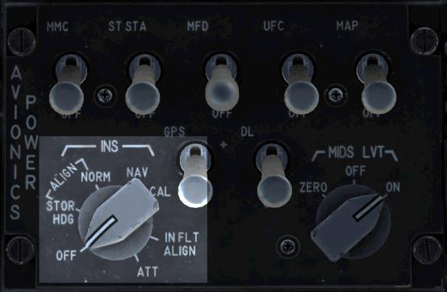
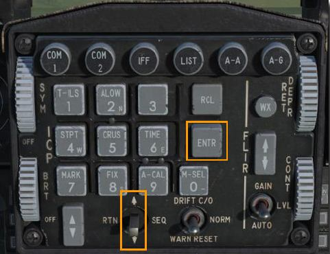
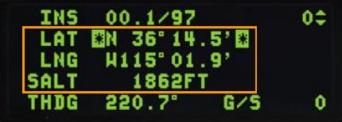
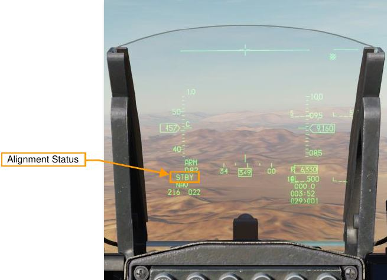
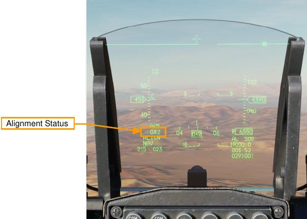
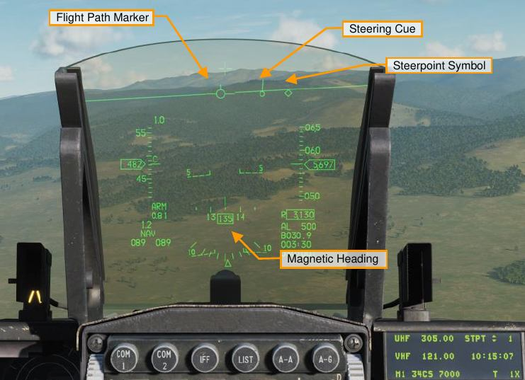
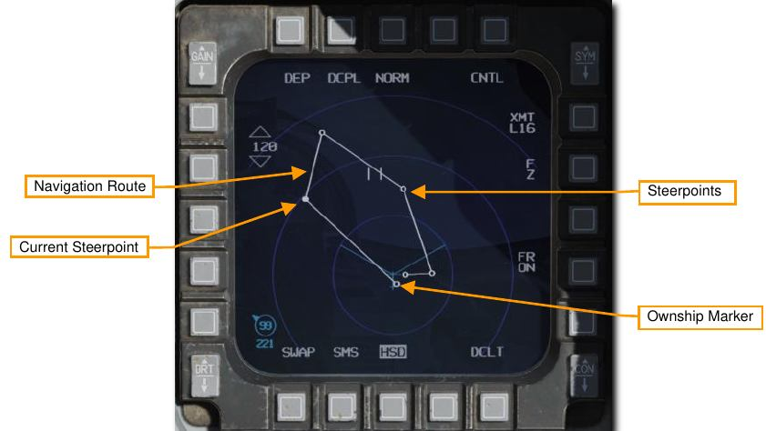

# INS Navigation

The inertial navigation system (INS) is the primary navigation system of the F-16C and provides accurate
attitude, navigation, and vertical and horizontal steering information. The Up-Front Controls (UFC) are the
primary interface device to the INS. In this Navigation chapter we will discuss the practical application of using
the INS for navigation purposes.

## INS Alignment

The navigation system can be aligned by a variety of methods on the ground or in the air. This is started by
positioning the INS knob on the Avionics Power panel to the desired position. The INS knob is set to NAV when
the alignment is complete.

The Normal (NORM) Alignment is the primary alignment mode. The NORM alignment requires approximately
eight minutes to fully accomplish.

The Stored Heading (STOR HDG) Alignment allows for a quick alignment in 90 seconds or less in some
conditions. This can only be used if the aircraft has been set up specifically for this alignment beforehand.

An Inflight Alignment (INFLT ALIGN) places the INS in ATT mode and performs an in-flight alignment. The
pilot must hold the aircraft steady and level during this process.

In Attitude (ATT) mode, only attitude and heading information is given to the avionics.

### Normal Gyrocompass (NORM) Alignment

A full INS alignment in the NORM position should be accomplished prior to every flight. This is normally started
just after engine start and avionics power-up to allow time for the full alignment to complete prior to taxi.

1. Position the INS knob to the NORM position.

    This begins the INS alignment and calls up the INS page on the DED. The progress of the alignment may
    be monitored from here.
    
    
    
    **Time into Alignment**. This is the elapsed time in minutes and decimal seconds since the INS alignment
    began.
    
    **Alignment Status**. This is an estimate of the alignment quality. Values count down from 99 with the
    following meanings:
    
    - 99 – Initialization
    - 90 – Valid attitude data, coarse align begins
    - 79 – Valid heading data
    - 70 – Degraded navigation state, steady RDY displayed on DED, steady ALIGN displayed on HUD
    - 60-20 – Circular error probability (CEP) multiplier compared to fully aligned state; 60 = 6.0 times
    normal CEP, 20 = 2.0 times normal CEP
    - 10 – INS fully aligned, RDY flashes on DED, ALIGN flashes on HUD
    - 6 – INS fully aligned and enhanced to 0.6 times normal precision with GPS data or other techniques
    
    **Latitude**. Latitude of start position.
    
    **Longitude**. Longitude of start position
    
    **System Altitude**. Altitude used by the fire control computer for air to ground weapons delivery
    
    **True Heading**. Last known true heading or heading derived during alignment
    
    **Ground Speed**. Current ground speed.

2. Enter the latitude, longitude, and altitude for the starting location.

    The last known coordinates and estimate of altitude are displayed when the alignment begins, however the
    data must be re-entered even if it is still correct.
    
    If the data is accurate, use the DCS switch to highlight each line and press ENTR for each in turn. If the
    data is not accurate, enter the correct data for each field with the ICP keypad.
    
    
    
    
    Failure to enter the data will flag the alignment as degraded and not allow important monitoring functions to
    take place. Navigation, weapons delivery and targeting pod pointing errors may also result.
    
    The alignment will stop and start again if the data is entered later than two minutes into the alignment.

3. Monitor alignment progress and switch INS knob to NAV.

    The RDY on the DED and ALIGN on the HUD will begin to flash when the alignment is complete. This
    should happen in 8 minutes or less. Position the INS knob to NAV to accept the alignment.
    
    

### Stored Heading (STOR HDG) Alignment

A Stored Heading alignment option is available to allow a faster INS alignment in certain situations. This can be
useful for “scramble” missions or for situations when your playtime is limited.

This alignment assumes a full gyrocompass alignment was already performed before the aircraft was last shut
down and the aircraft has not been moved. The previously computed true heading is stored in the Inertial
Navigation Unit (INU), a component of the INS, and is used to give the alignment process a head start. The new
alignment should take about 90 seconds.

1. Position the INS knob to the STOR HDG position.

    This begins the INS alignment and calls up the INS page on the DED. The progress of the alignment may
    be monitored from here just as on a normal alignment.
    
    

2. Verify, but do not enter, the latitude, longitude, altitude, and true heading for the starting location.
3. Monitor alignment progress and switch INS knob to NAV.

    The RDY on the DED and ALIGN on the HUD will begin to flash when the alignment is complete. This
should happen in about 90 seconds. Position the INS knob to NAV to accept the alignment.

    

### Inflight (INFLT) Alignment

It is possible to lose your INS alignment inflight due to electrical failure, battle damage or switchology errors. A
new alignment may be obtained while airborne provided the INS is functional and GPS data is available. If GPS
is not available, the inflight alignment will not complete.

1. Position the INS knob to OFF for 10 seconds.
2. Maintain straight, level and unaccelerated flight.
3. Position the INS knob to the INFLT position.

    This begins the inflight INS alignment and calls up the INFLT ALIGN page on the DED. No action or data
    entry is required on this page if GPS data is available. An initial heading may be entered based on
    magnetic compass reading or other outside sources, but this is not required.
    
    
    
    The STBY mnemonic will replace the max G indication in the HUD, showing that coarse alignment of the
    inertial platform is in progress. Horizon line, pitch ladders and compass information may be displayed but
    will not be accurate.
    
    

4. Maintain straight, level and unaccelerated flight for approximately one minute, until ALIGN appears
in the HUD.

    
    
    This indicates that coarse alignment is complete and fine alignment is in progress. Attitude information
    becomes available in the HUD and ADI, and the aircraft may be maneuvered normally.
    
    Shortly after attitude information appears, the flight path marker, steering cue, aircraft heading, and HSI
    navigation data become available. Reliability of the data increases as the alignment progresses.

5. Switch INS knob to NAV after Max-G replaces ALIGN in the HUD.

    Replacement of ALIGN with Max-G shows that the alignment is complete. The mission may proceed
    normally from there.
    
    

## HUD Indication

You can view your current heading on the top or bottom of the HUD, depending on the selected master mode.
The heading scale shows your current magnetic heading indicated by the central caret.

The Steering Cue shows the heading to your selected steerpoint. If you turn the aircraft to align the Flight Path
Marker with the Steering Cue, you will be flying to your steerpoint.

## Horizontal Situation Display (HSD) Indication

When there is an active steerpoint, it will be displayed on the HSD as a solid circle. Other steerpoints will be
displayed as empty circles with lines connecting them all to show the route. The ownship marker shows your
aircraft’s current position.

## Horizontal Situation Indicator (HSI) Indication

The HSI is your primary gauge to assist in navigation to steerpoints, TACAN beacons, and radio beacons.
While you will likely be using HUD symbology for most of your navigation purposes, a firm understanding of the
HSI is necessary for access to additional navigation data that is not present on the HUD or DED displays, and
in case of battle damage.

**Compass Card**. Arrayed around the periphery of the HSI, this is a compass that rotates such that the top of the
compass indicates the aircraft’s magnetic heading.

**Aircraft Symbol**. In the center of the gauge is the aircraft symbol that always remains static. All HSI displays
reference this symbol.

**Lubber Line**. This is a fixed line that runs from the aircraft symbol to the top of the gauge. This line represents
current aircraft heading in relation to the compass card.

**Range Indicator**. Indicating range in nautical miles, this three-place drum indicator provides slant distance from
your aircraft to the selected steerpoint or TACAN station.

**Bearing Pointer**. This arrow-shaped indicator moves around the outside of the compass card and points to the
current steerpoint or TACAN station. Located 180° from the Bearing Pointer head is the tail that represents the
reciprocal bearing.

**Heading Set Knob**. Located in the lower left portion of the gauge, when rotated, this knob allows you to set the
position of the Heading Marker on the compass card.

**Heading Bug**. Shown as two thick lines on the outside of the compass card, this marker can be moved around
the compass card using the Heading Set Knob. After being set, this marker rotates with the Compass Card to
provide a heading to the selected magnetic bearing.

**Course Set Knob**. Positioned in the lower right corner of the gauge, this knob, when rotated, allows you to set
the course numeric in the Course Selector Window and move the course pointer around the compass card.

**Course Indicator**. This window displays the course set using the Course Set Knob numerically in degrees.

**Course Pointer**. Set by the Course Set Knob, these two lines represent the set course and reciprocal course
on the compass card.

**Course Deviation Indicator**. This line that runs through the center area of the gauge provides an indication of
how accurately you are flying on the set course line. When the line runs through the aircraft symbol in the center
of the gauge, you are on course. If it is to either side, you need to correct your heading to place the aircraft back
on the course line.

**To-From Indicator**. These two triangles along the intended course line indicate the course the aircraft will fly to
or away from the selected TACAN station or steerpoint.

{!abbr.md!}
