# APG-68 Fire Control Radar

## Air-to-air Modes

The FCR provides two basic A-A modes for target detection, acquisition, and tracking:

**Combined Radar Mode (CRM)**. This mode combines air-to-air sub-modes used for search under one interface.

Sub-modes are:

- Range While Search (RWS)
- Track While Scan (TWS)

**Air Combat Mode (ACM)**. This mode combines all sub-modes for automatic target acquisition under one
interface. Sub-modes are:

- 30° × 20°
- Boresight
- 10° × 60°
- Slewable

**Single Target Track (STT)** is an additional mode entered by locking a target in CRM or ACM sub-modes.

Air-to-Air weapon employment using the radar is discussed in the following sections:

- [Air to Air Gunnery](18.ata.md#air-to-air-gunnery)
- [AIM-9M/X Employment](18.ata.md#aim-9mx-employment)
- [AIM-120 Employment](18.ata.md#aim-120-employment)

We will first discuss aspects of the radar that spans multiple modes, and then later we will discuss radar
functions specific to unique applications/weapons.

The air-to-air radar display uses a standard B-scope format in which the ownship (your aircraft) is in the bottom
center of the display. As such, all indications on the b-scope are ahead of the ownship. Targets on the scope
are displayed in range from the closest being at the bottom and the more distant being toward the top. Contacts
left and right of the ownship are represented as being indicted left and right of the center of the display to
indicate azimuth.

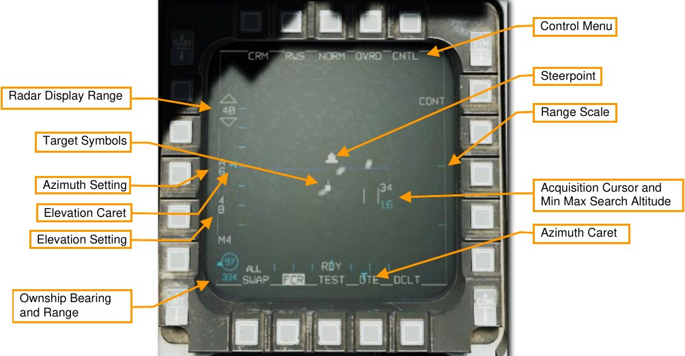

Important, basic components of the display include:

**Radar Display Range**. The currently selected range displayed on the MFD is shown on the left of the display.
This can be increased or decreased by pressing the adjacent OSBs or by slewing the acquisition cursor to the
top or bottom of the display.

**Target Symbols**. Target symbols are displayed as solid squares (bricks). The horizonal position of the target
symbol indicates angular position in respect to ownship heading. The vertical position indicates range.

**Acquisition Cursor**. Consisting of two parallel, vertical lines, this cursor is moved in response to Cursor/Enable
Switch commands. When in a RADAR search mode, the altitude band being covered by the RADAR beam is
indicated above and below the cursor.

Targets are locked by slewing the cursor over the target symbol and commanding TMS Up on your stick.

**Range Scale**. The right side of the b-scope represents RADAR range. The scale includes marks for ¼, ½, and
¾ of the selected radar range.

**Azimuth Setting**. Indicates the azimuth setting, in tens of degrees. A setting of “A6” means the radar is
scanning 60° to either side of boresight, which is the maximum scan azimuth. Options are A6, A3, and A1.
Azimuth setting will be A1 during the RWS acquisition process. Higher azimuth settings will result in a longer
detection period and a slower refresh rate.

**Elevation Setting**. Indicates the elevation area scanned, in number of bars. A setting of “4B” means the radar
is sweeping four different elevations (corresponding to a 40° elevation range). Options are 4B, 2B, and 1B.
Higher elevation settings will result in a longer detection period and a slower refresh rate.

**Antenna Azimuth and Elevation Caret**. The current radar azimuth is shown by a T symbol on the bottom of
the display. The current radar elevation is shown by a T symbol on the left of the display. The carats move
along scales that show the full ±60⁰ sweep range of the antenna.

**Ownship Bearing and Range**. This shows the bearing and range from your own aircraft to the Bullseye.

**Control Menu**. Pressing this OSB takes you to the control menu. See Control (CNTL) .

Radar modes are selected by pressing the OSB adjacent to the current mode (OSB1). After pressing this OSB,
a menu of all available air-to-air modes is displayed on the left side of the display. Press the OSB adjacent to
the desired mode to select it.

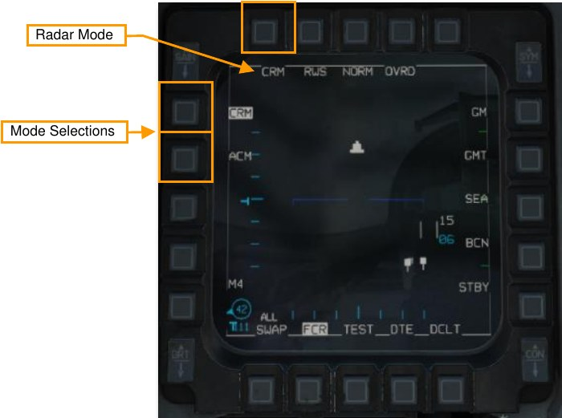

### Combined Radar Mode (CRM)

This mode is selected by default at power-up. It is designed to reduce pilot workload by combining air-to-air
sub-modes used for search under one interface. Sub-modes are:

- Range While Search (RWS)

    - Situational Awareness Mode (SAM)
    - Dual Target Track (DTT)

- Track While Scan (TWS)
- Single Target Track (STT)

The RWS and TWS sub-modes may be cycled by pressing OSB 2 adjacent to the sub-mode.

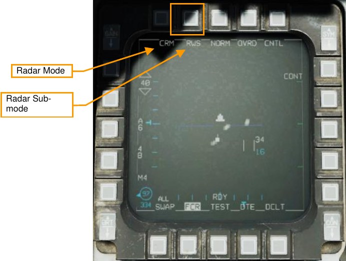

You can also cycle between RWS and TWS by holding TMS right for more than one second.

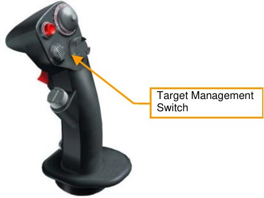

#### Range While Search (RWS) Sub-mode

The Range While Search (RWS) sub-mode is used for fast, long-range acquisition and engagement. The pilot
can set the acquisition range (10, 20, 40, 80, or 160 nautical miles) and change the azimuth width and
elevation.

Targets may be acquired and tracked in three ways: Situational Awareness Mode (SAM), Dual Target Track
(DTT), or Single Target Track (STT).

- **Situational Awareness Mode (SAM)**. Placing the acquisition cursor over a target and pressing TMS
forward commands SAM. The antenna will be directed to the cursor position and a 4-bar, ±10° spotlight
scan will be performed while TMS forward is held.

    

    If a target is not under the acquisition cursor when TMS forward is released or no target is detected, the
    scan coverage reverts to the previous scan pattern. The SAM acquisition sequence will only commence if
    a target was under the TDC when TMS forward was pressed.

    After a successful acquisition, the radar enters SAM mode, with the target bugged. The radar will continue
    a scan pattern, pausing to dwell on the bugged target periodically. An AIM-120 AMRAAM will guide on the
    bugged target even without an STT lock.
    
    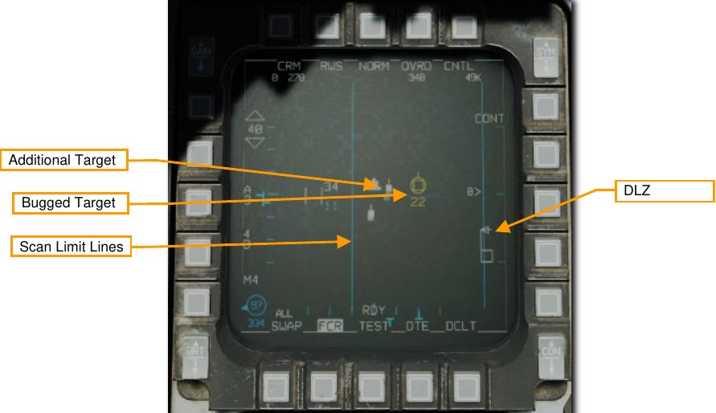
    
    If a missile is selected (AIM-9 or AIM-120), the DLZ will be displayed along the right edge.

    SAM mode may be exited with TMS aft. Positioning the acquisition cursor over the bugged target and
    pressing TMS forward commands Single Target Track. Positioning the acquisition cursor over another
    target and pressing TMS forward commands Dual Target Track.

- **Dual Target Track (DTT)**. Dual Target Track is entered from SAM by bugging a second target. In DTT
mode, the radar will dwell on two targets while continuing a scan pattern centered around the secondary
target. If the primary target closes within 10 NM of the aircraft, the scan pattern is inhibited, and the radar
will “ping-pong” between the two bugged targets.

    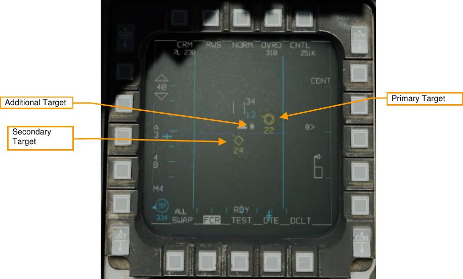
    
    In DTT, pressing TMS left will swap the primary and secondary targets. The radar will shift its scan pattern
    to be centered around the new secondary target. AIM-120 launches in DTT will track the primary target.

- **Single Target Track (STT)**. Placing the acquisition cursor over a primary bugged target and pressing TMS
forward commands Single Target Track mode. Placing the acquisition target over a non-bugged target and
pressing TMS up twice in quick succession accomplishes the same function.

    In STT, the radar focuses all its energy on a single target and provides high-resolution and high-frequency
    updates. However, the radar does not scan, and will no longer detect other contacts. If the enemy has a
    RWR onboard, it will be alerted to the STT lock.
    
    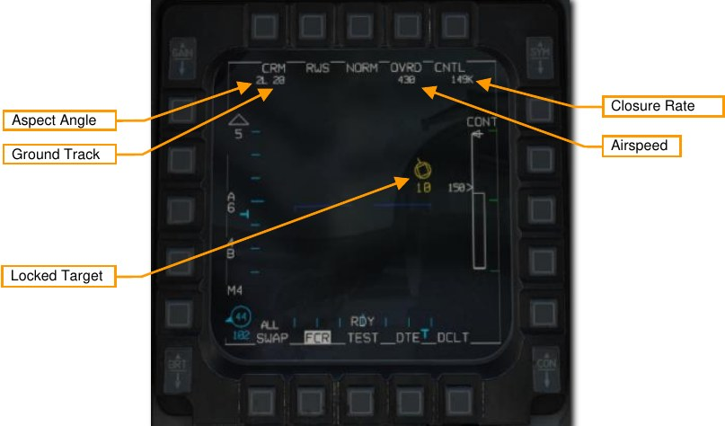
    
    STT mode may be exited with TMS aft. TMS Aft once returns to SAM mode with the target bugged. TMS
    Aft twice returns to the previous CRM mode.
    
    This mode is discussed in the [Single Target Track (STT) section](14.radar.md#single-target-track-stt-mode).

#### Track While Scan (TWS) Sub-mode

TWS mode is a multi-target tracking mode. In TWS, the radar will initially detect only hits, like RWS. However,
as successive hits in proximity are detected in subsequent scans, the radar will attempt to combine these hits
into targets. Each detected target is represented by a trackfile, which stores a history of detected hits. This
history is used to build a picture of the target’s heading, speed, and other properties.

TWS has several restrictions. The radar will attempt to build trackfiles for each contact, but given a large scan
volume, there will be a sizable refresh time between scans. During each scan the radar will try to predict the
position of the contact for the next scan. If, however, the target takes evasive, high-G maneuvers and quickly
changing its trajectory and speed, the radar can lose the track by making an incorrect trackfile prediction, and
the contact will disappear from the radar, replaced only with a hit on the next scan.

TWS, when combined with the AIM-120, provides a powerful ability to engage multiple targets quickly.
Nevertheless, target tracking is not as reliable as SAM, and especially less reliable than STT. Unlike STT
though, a TWS lock does not trigger an elevated RWR indication. As such, the first warning the enemy pilot will
likely get is when the radar seeker of the AIM-120 goes active.

Trackfiles are automatically established on up to 10 targets based on information received from each radar
sweep. The radar scan volume options are identical to those used for RWS but are reduced to 3-bar, ±25° when
a target is designated.

Four types of target symbols are available to help sort contacts. They are, in increasing order of importance:
Search Target, Track Target, System Target, and Bugged Target. In addition, two other target symbols can
appear: Cursor Target and Locked Target.

**Search Target**. These are radar hits that have not been resolved well enough to build a track. They are
displayed as a small brick in much the same way as in RWS.
These targets disappear after a few sweeps if a track cannot be obtained. If a valid track is obtained, usually
after being detected on two consecutive sweeps, the contact automatically becomes a Track Target.

**Track Target**. Once enough information about a Search Target has been received to build a trackfile, it is
upgraded to a Track Target. These targets are displayed as a larger brick with a velocity vector line showing
their direction of travel. Their altitude is displayed just below each contact. Up to 10 of these tracks may be
present at one time.

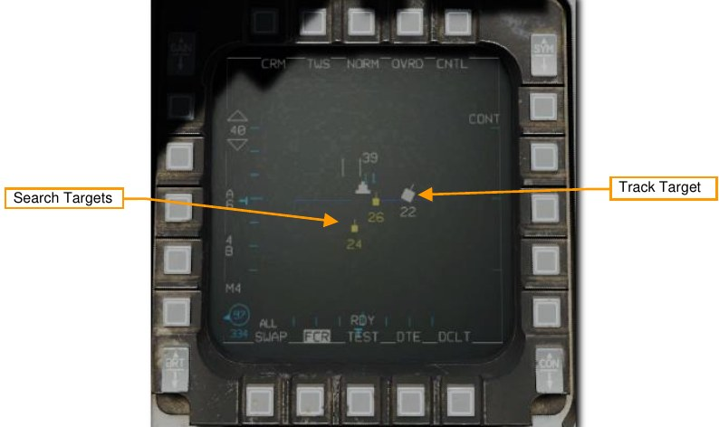

Track targets can be considered the most basic radar contact. Other options become available after a trackfile
has been established. The pilot can upgrade any Track Targets of interest to System Targets.

**System Target**. System Targets are Track Targets designated by the pilot. System Targets are not given any
additional radar energy; the System Target feature is only used by the pilot to designate those targets that the
pilot may wish to monitor or employ weapons against later.

To upgrade a Track Target to a System Target, position the radar cursor over a Track Target and press TMS
Forward. If no System Targets have yet been designated, pressing TMS Right upgrades all Track Targets to
System Targets.

You can position the acquisition cursor over any System Target to increase its scan priority, making it a Cursor
Target.

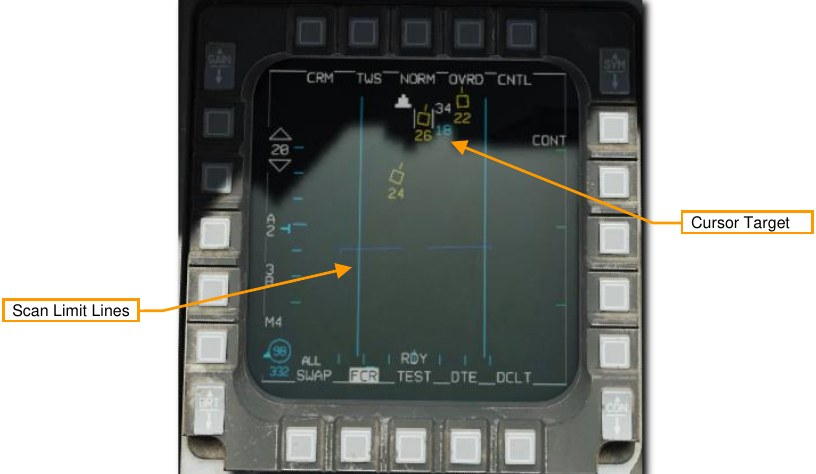

The radar will limit its scan to a 3-bar, ±25° pattern centered on that target to provide faster updates and reduce
the chance of losing the Cursor Target. This does not designate the target for AIM-120 employment, only
increases its priority for radar updates.

The Cursor Target can be changed by slewing the cursor to another system target. Slewing away from all
system targets returns the radar to a normal TWS scan.

A System Target can be designated as the Bugged Target by placing the radar cursor over it and pressing
TMS Forward. This changes the scan to a 3-bar, ±25° pattern centered on the bugged target to provide faster
updates and reduce the chance of losing the track.

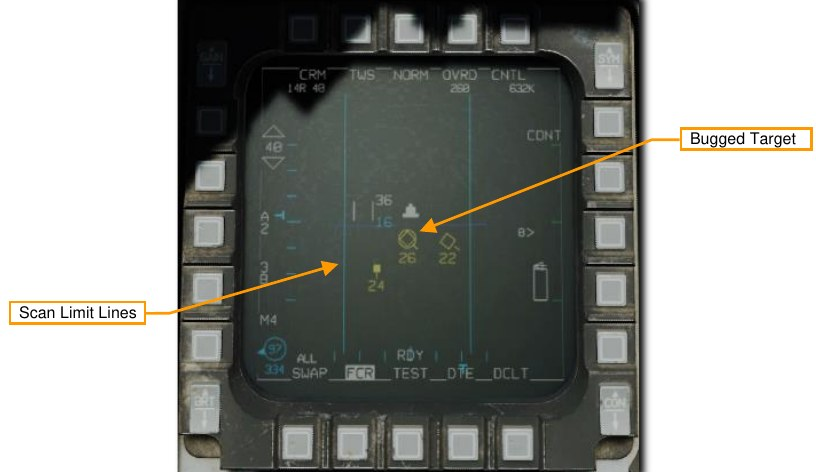

The Bugged Target is also selected for weapons employment. AIM-9 and AIM-120 DLZ information in the HUD
and FCR format references the Bugged target.

TMS Right will select the closest System Target as the bugged target. Subsequent presses of TMS Right will
cycle through all displayed System Target in range order, making each the Bugged Target in turn.

The Bugged Target can be transitioned to an STT lock by pressing TMS Forward with the cursor over the
Bugged Target. This will transition the radar to STT mode.

Pressing TMS Aft downgrades a Bugged Target to a System Target, or a System Target to a Tracked Target.

### Air Combat Mode (ACM)

The Air Combat Mode (ACM) automatically acquires aircraft at short ranges. This mode is used most often
when the target is already acquired visually. The pilot flies the aircraft to position the target in the proper
position for radar acquisition.

Different scan patterns are available in the four different sub-modes:

- Boresight (BORE)
- 10° × 60° (Vertical Scan)
- 30° × 20° (HUD Scan)
- Slewable

The radar locks the first target it detects within each sub-mode’s search pattern. Maximum acquisition range is
10 nautical miles. Each sub-mode has its own strengths and weaknesses and is best used in different
situations.

ACM may be entered in two ways:

- Position the Dogfight/Missile Override (DOGFIGHT) Switch to DGFT. This selects ACM automatically.

Or,

- Press the OSB next to the radar mode and select ACM from the options on the left of the screen.

    

The 30° × 20° sub-mode is entered in a non-radiating (NO RAD) state by default when ACM mode is selected.
The radar is activated when a sub-mode is selected by either cycling through sub-modes on the MFD or using
the Target Management Switch (TMS).

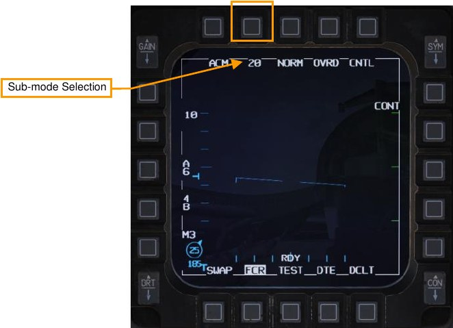

HOTAS functions of the TMS in ACM radar mode and the radar as SOI are:

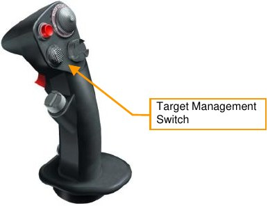

- TMS Up: Boresight (BORE) Sub-mode
- TMS Down: 10° × 60° (Vertical Scan)
- TMS Right: 30° × 20° (HUD Scan)
- TMS Left: No function

#### 30° × 20° (HUD Scan) Sub-mode

The 30° × 20° HUD scan pattern searches an area slightly larger than the HUD field of view. The lock range is
10 nautical miles. The radar automatically locks on to the first target in this zone. When locked, the target is
automatically tracked in STT mode.

There is no special HUD symbology for this sub-mode. The FCR format will display “ACM 20.”

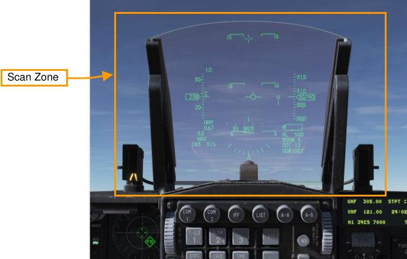

This sub-mode is less precise than the BORE sub-mode and may take longer to achieve a lock because of the
larger target area for the radar scan to cover.

#### Boresight (BORE) Sub-mode

The BORE scan pattern searches a small one-beamwidth area located 3° below the HUD’s gun cross. An
additional Boresight Cross is displayed on the HUD at the center of the radar scan zone to aid in positioning
the target in the radar beam.

The FCR format will display “ACM BORE.”

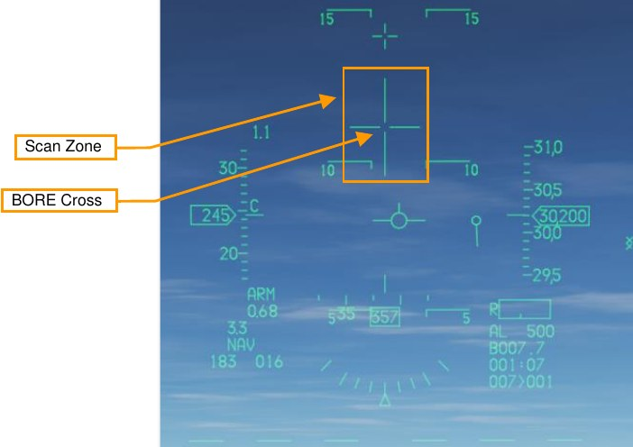

BORE is useful for quickly locking a target within visual range (WVR) and allows a degree fine control as to the
target being locked. The first target detected within 20 nautical miles is locked and automatically tracked in STT
mode.

#### 10° × 60° (Vertical Scan) Sub-mode

In the 10° × 60° vertical scan sub-mode, the radar searches an area with 10° in width and 60° in the vertical.
The scan center is 23° above the HUD’s gun cross. This mode is indicated by a vertical line extending from the
gun cross to the bottom of the HUD.

The FCR format will display “ACM 60.”

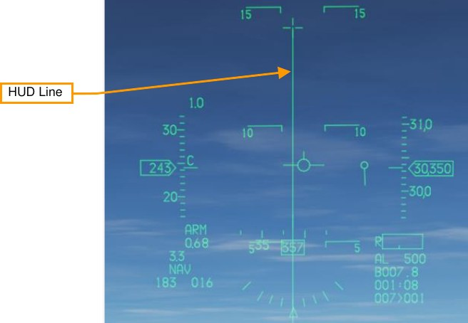
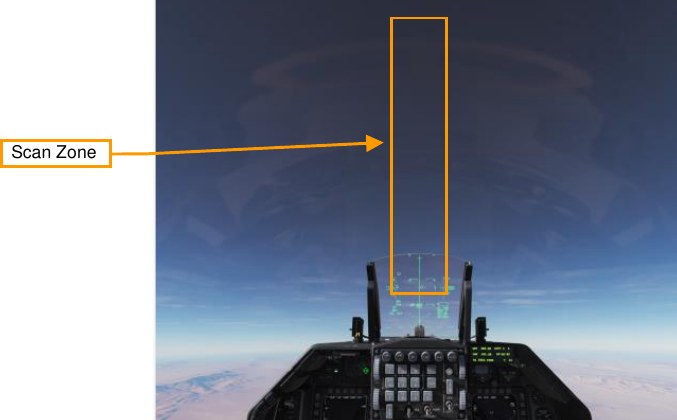

The lock range is 10 nautical miles. The radar automatically locks on to the first target in this zone. When
locked, the target is automatically tracked in STT mode.

This mode is most often used during air combat maneuvering (ACM) dogfights. During such fights, you are
often trying to place the target on the lift vector and “pull” the target into the HUD. When in this mode, you can
often lock on to the target earlier, even when it is well above the HUD frame.

#### Slewable Sub-mode (later in early access)

The scan pattern is approximately 20° high × 60° wide. When selected, the scan is centered directly in front of
the aircraft on the horizon. The scan is slewable via the CURSOR/ENABLE control until a target is acquired.
The amount of slew is limited by the radar gimbal limits.

The FCR format will display “ACM SLEW.”

As with the other sub-modes, the radar automatically locks on to the first target in this zone. When locked, the
target is automatically tracked in STT mode.

This mode is useful when you have a direction to look, for example ‘bandits 2 o’clock high’, but have not picked
them up visually yet.

#### Single Target Track (STT) Mode

After you have locked the target from RWS or ACM sub-modes, the radar will change to STT mode. The radar
now focuses all its energy on a single target and provides constant updates. However, the radar will no longer
detect other contacts and the enemy may be alerted by this radar lock.

The MFD display in STT mode remains much the same as RWS mode with these differences: The locked
radar target is displayed as a circled triangle symbol with a flight vector line. The target’s altitude is displayed
below the target symbol. The top of the display shows aspect angle, ground track (direction the contact is
traveling over the ground), calibrated airspeed, and closure rate.

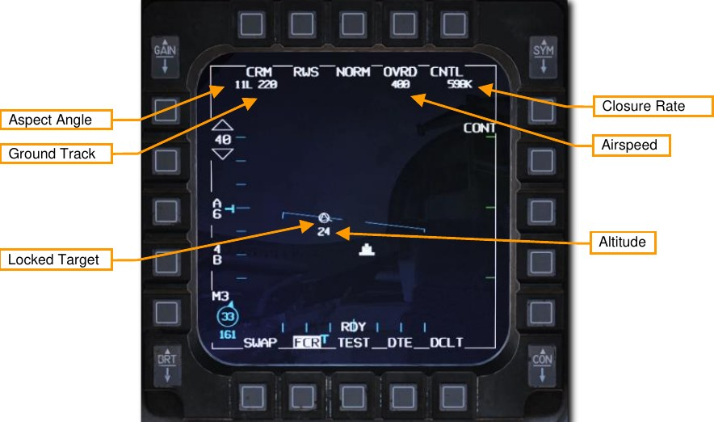

### Control (CNTL) Menu

The Control Menu allows configuration of the FCR in air-to-air mode and the air-to-air presentation. Some
options are only applicable to air-to-ground radar modes; the air-to-air options are documented below.

**Channel**. Selects the frequency channel the radar uses, 1 through 4 (not implemented). Different aircraft within
a flight should use different channels to avoid radar interference with each other.

**Frequency Agility Band**. Toggles between wide (WIDE) and narrow (NARO) frequency agility bandwidth (not
implemented). Frequency agility refers to the radar’s technique of randomly hopping between different
frequencies within the agility band, to increase the difficulty of being jammed.

**Power Management**. Not implemented.

**Radar Level**. Not implemented.

**Target History**. Sets the number of frames that a radar return lives (default 3). When set to 1, a radar return is
only displayed during the frame that it is detected. When set to 2, 3, or 4, the radar return is displayed for
additional scan frames, becoming dimmer with each new frame. By setting the target history, you can get a
broad idea of target relative bearing, since the frames will appear to form a line.

**Altitude Tracker**. Toggles on and off the altitude line tracker/blanker (not implemented). When on, blanks all
targets which are detected at the range of the altitude line.

**Moving Target Rejection**. Sets the minimum relative velocity that a detected aircraft must have before it is
displayed (Doppler gate). Not implemented.

### Expand (EXP) Feature

The radar provides the ability to enter an expanded field of view display that allows sorting and resolution of
closely grouped contacts. This can be thought of as a zoom feature that provides a 4:1 scale view centered
around the radar cursor. This feature is available in all radar modes.

The expanded display may be toggled on or off by selecting the OSB next to NORM/EXP or by pressing the
Expand/FOV Button (pinky switch) while the FCR is sensor of interest.

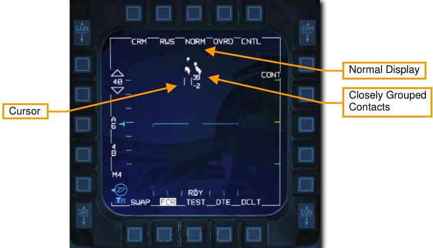
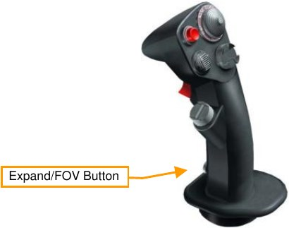

The expanded display features a 2 nm × 2 nm reference box centered on the cursor. Basic functions and
symbology are unchanged from the normal display.

### IFF Interrogation

The Identification Friend or Foe (IFF) system allows interrogation of aircraft to determine if they are friendly or
hostile. This is done by transmitting a coded signal aimed at a specific radar contact or volume of space within
the selected radar azimuth and elevation. Transponders in friendly aircraft receive this signal and reply with the
correct coded response.

Contacts are classified based on the response and symbols identifying contacts as friendly or hostile are
displayed on the radar screen. The IFF system is not radar dependent so interrogation of contacts is still
possible with the radar off.

The IFF Master Switch must be set to NORM or LOW on the IFF panel to enable IFF interrogation.

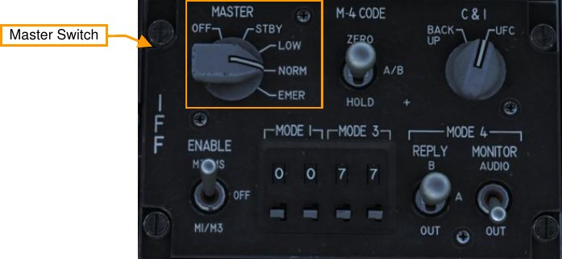
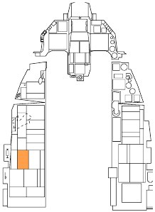

Interrogation is initiated by HOTAS command in one of two modes:

- **Scan**. Press TMS Left short (1 second or less) to interrogate all contacts in the radar scan volume.
- **Line of Sight (LOS)**. Press TMS Left long (more than 1 second) to interrogate the locked target or
immediate area around the radar cursor.

    

If the contact is friendly a green circle is drawn around the contact for three seconds. If no reply is received, no
indication is displayed, and the contact is classified as unknown. These contacts may be assumed to be hostile
depending on the rules of engagement (ROE) in your current scenario.

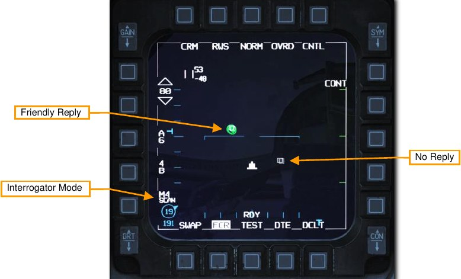

## Air-to-ground Modes

The air-to-ground radar operates in six different selectable modes:

- Ground Map (GM)
- Ground Moving Target (GMT)
- Sea Search (SEA)

In addition, there are three additional modes that the radar uses in certain situations:

- Fixed Target Track (FTT)
- Air-to-Ground Ranging (AGR)
- Situational Awareness Mode (SAM)

Currently, the GM and SEA sub-modes are selectable.

### Ground Mapping (GM) Mode

The Ground Mapping mode is a B-scope raster scan of terrain ahead of the aircraft. Image intensity is a
function of the strength of a radar return. Certain ground features will have higher intensity (e.g., buildings or
vehicles) and others will have lower intensity (e.g., water). Terrain or tall structures will impede the radar beam
from traveling further, creating distinctive shadows, giving the resulting image the appearance of an elevation
relief map.

Normally, the radar only scans the area around the SPI, regardless of aircraft location or heading. If the SPI
moves outside the radar field of view, the radar antenna is boresighted. To scan directly ahead of the aircraft
instead, use Snowplow (SP) Mode.

The ground mapping mode operates in one of four sub-modes:

- NORM: Normal mode
- EXP: Expanded mode, a 4:1 expansion of the NORM scan area.
- DBS1: Doppler beam sharpening mode level 1. The DBS mode can create a higher-resolution image
than the enhanced ground mapping mode, though it takes longer to render the image. DBS level 1
produces a 24:1 sharpening. The rendered area is the same size as EXP mode.
- DBS2: Doppler beam sharpening mode level 2. Level 2 creates an even sharper image, at 64:1, but
raster takes three times longer than DBS1. The rendered area depends on range to target, with a
minimum of 8 NM square.

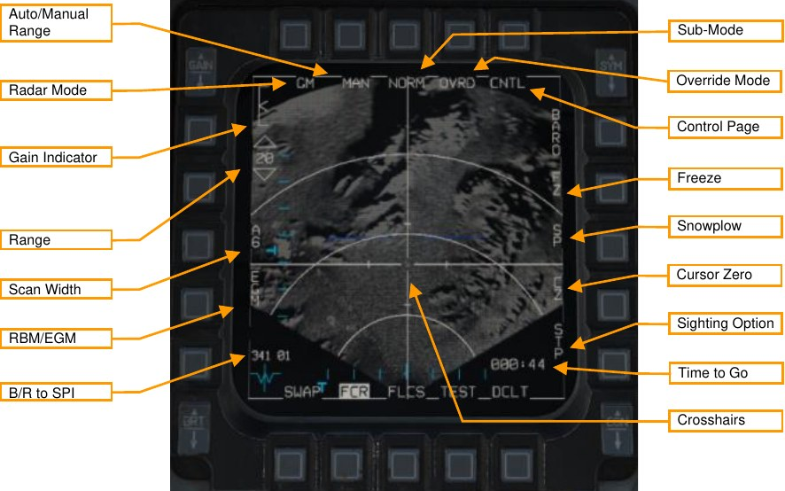

**Radar Mode**. Pressing this OSB displays the radar mode menu. Radar modes will be displayed along the right
side and can be selected with the adjacent OSB. Only GM and SEA are available currently.

**Sub-Mode**. Cycles between NORM, EXP, DBS1, and DBS2 sub-modes. See Expanded Sub-Modes, below.

**Override Mode**. When highlighted, places the radar in standby mode and suppresses radar transmission.

**Range**. Pressing these OSBs moves between the radar range options: 80, 40, 20, and 10 NM.
Auto/Manual Range. Pressing this OSB toggles between AUTO and MAN (manual) range control. When in
AUTO mode, moving the crosshairs to the top or bottom of the display increases or decreases the range. The
label displays the mode that will be set if the OSB is pressed: AUTO is displayed when manual mode is active,
and MAN is displayed when automatic mode is active.

**Gain Indicator**. The scale indicates the range of possible radar gain values. The caret indicates the current
radar gain. Radar gain is adjusted with the GAIN rocker to the left. Higher gain values will produce a brighter
image but may wash out details.

**Scan Width**. Press to cycle between azimuth width options. The radar will only scan inside that azimuthal area.
Options are A6 (60° to each side of center), A2 (20° to each side), and A1 (10° to each side). Decreasing scan
azimuth will increase refresh rate but hinder situational awareness.

**RBM/EGM**. Toggles between Real Beam Mode (RBM) or Enhanced Ground Map (EGM). RBM uses raw radar
data to quickly produce an image. EGM uses post-processing to improve the image resolution but takes longer
to render an image. When EGM is on, only the center portion of the radar image is post-processed. EGM is not
available at large bank angles.

**Crosshairs**. The crosshairs indicate the current sensor point of interest (SPI). When not in snowplow mode, the
Cursor Enable control can be used to move the crosshairs and change the SPI.

**B/R to SPI**. Displays the bearing and range from the aircraft’s position to the SPI.

**Time to Go**. Displays the time (minutes:seconds) until reaching the SPI.
Control Page. Pressing displays the Control menu. See Control (CNTL) Menu.

**Freeze**. Pressing this OSB puts the radar in standby mode and freezes the current radar image on the display.
See Freeze (FZ) Function, below.

**Snowplow**. Pressing this OSB moves the crosshairs to the center of the display and causes the radar to scan
in front of the aircraft, regardless of its location relative to the SPI. See Snowplow (SP) Mode, below.

**Cursor Zero**. Pressing this OSB resets all cursor slew. See Sensor Point of Interest (SPI).

**Sighting Option**. Toggles between different sighting options. The selected sighting option determines the
relationship between the current steerpoint and the SPI. (Not implemented.)

- STP. SPI is the current steerpoint. Default in NAV master mode.
- TGT. SPI is the designated target (or the current steerpoint if no target is designed). Default in A-G
master mode.
- OA1. SPI is Offset Aimpoint 1 for the current steerpoint.
- OA2. SPI is Offset Aimpoint 2 for the current steerpoint.
- RP. SPI is the Visual Reference Point for the current steerpoint (see Using Visual Reference Points).
- IP. SPI is the Visual Initial Point for the current steerpoint (see Using Visual Initial Points).
- SP (sensor point). Displayed when TMS Forward is pressed. SPI is the location designated on the
FCR format.

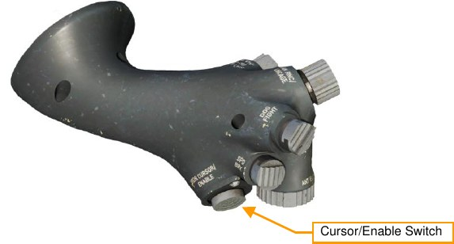

When in GM mode, pressing TMS forward designates a target (see Fixed Target Track (FTT)). Pressing TMS
aft undesignates that target.

Pressing the pinky switch cycles between the different sub-modes (NORM, EXP, DBS1, and DBS2).

#### Expanded Sub-Modes

The expanded sub-modes cannot resolve radar information directly ahead of the aircraft’s nose. When using an
expanded sub-mode, only off-azimuth radar data will be shown.

When in an expanded sub-mode, the crosshairs are fixed at the center of the screen, and using the Cursor
Enable control slews the image, not the crosshairs.

**Yardstick**. Indicates a ¼ nautical mile distance.

#### Freeze (FZ) Function

When OSB7 is pressed, the Freeze function is activated. The radar image will freeze. If the radar continues to
maintain line of sight to the imaged area, the image will continue to refresh with subsequent scans, though the
location and bounds of the image will not change. If the radar loses LOS, it will coast, and the last scanned
composite image will be preserved on the display.

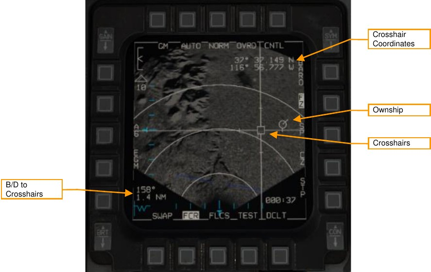

**Crosshairs**. Used to designate a target. Controlled by the Cursor Enable control. When the radar is coasting,
the crosshair center is displayed as a hollow box. When the radar is actively scanning the crosshair area, the
crosshairs center is displayed as a filled triangle.

**Ownship**. Displays the location of the aircraft within the radar image. Not displayed if the aircraft is outside the
radar image dimensions.

**Bearing and Distance to Crosshairs**. Displays the bearing and distance from the present position
(represented by the ownship) to the crosshairs.

**Crosshair Coordinates**. Displays latitude and longitude of crosshair position. Holding TMS aft temporarily
blanks this text.

#### Fixed Target Track (FTT)

When a location is designated with TMS Forward, the radar enters FTT sub-mode. This sub-mode has identical
symbology and operation to the FZ (Freeze) function, described above, although the radar beam remains
locked on the designated location and is no longer used to create a raster image.

FTT is appropriate for tracking fixed ground targets or slow-moving sea targets such as ships. To track moving
land targets or fast-moving sea targets, use Ground Moving Target (GMT) mode (will be implemented later).

When in FTT, the designated location becomes the SPI. The radar will continue to track the target location while
line-of-sight is maintained. If LOS is lost, the radar will coast for 10 seconds before the radar returns to GM or
SEA mode. If the designated location moves outside the radar field of view, the radar will slew to boresight until
the target returns into the radar FOV, at which point the radar will reacquire the target. If the target remains
outside the radar FOV for 60 seconds, the radar will return to GM or SEA.

**Situational Awareness Cue**. The point about which the map has been expanded.

#### Snowplow (SP) Mode

In Snowplow mode, the radar scans directly ahead of the aircraft, independent of the SPI location. The radar
cursor is fixed at the center of the display.

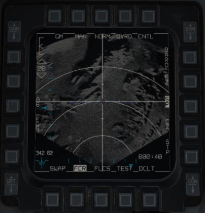

Pressing TMS Forward while in Snowplow mode ground-stabilizes the cursor and exits Snowplow mode. You
can then either designate a target, or press Cursor Zero (CZ) if desired to reset the cursor to the steerpoint
location.

#### Sea Search (SEA) Mode

SEA mode works identically to GM mode (see above). SEA mode is appropriate for tracking slow-moving or
stationary objects on the water’s surface.

{!abbr.md!}
