# AIR-TO-AIR EMPLOYMENT

## AIR COMBAT PREPARATION

Remember to anticipate what is coming up next and stay ahead of the curve. You do not have to wait until you
are about to make an attack to set the aircraft up.

When entering an area where you expect to encounter enemy aircraft, you will want to take the following steps:

1. Position the Master Arm Switch to ARM. Weapons may be released normally when in the ARM
position. If the Master Arm switch is placed in the SAFE position, weapon release is inhibited.

    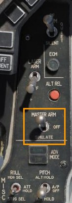
    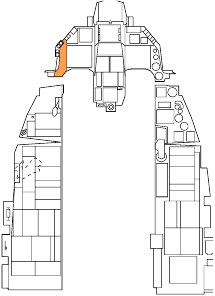

2. Press the A-A Master Mode Button on the ICP to place the fire control system in Air-to-Air Missile
 (AAM) Mode.

    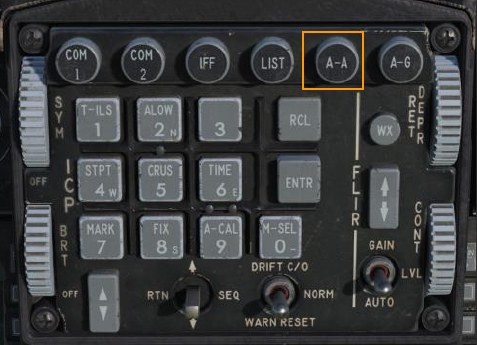
    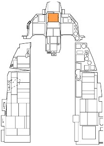

This is one method for preparing the aircraft for an air-to-air attack. There are also two air-to-air override modes
that can be quickly selected using HOTAS commands. Those are described below.

## DOGFIGHT AND MISSILE OVERRIDE MODES

Two override modes are available to quickly configure the aircraft for an air-to-air engagement: Dogfight and
Missile Override. These modes are selected using the DOGFIGHT switch located on the throttle grip. It is a
three-position switch that overrides any mode except emergency jettison.

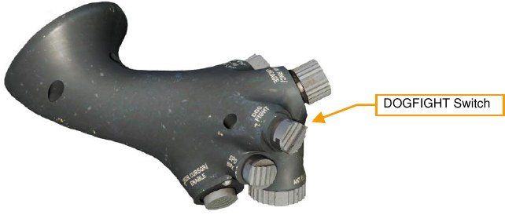

- DOGFIGHT (outboard). This mode provides symbology on the HUD for both 20mm gun firing and
AIM-9 Sidewinder missile delivery.
- MSL OVRD (inboard, unlabeled). This provides symbology for AIM-120 missile firing only. If no AIM-
120 is loaded, AIM-9s are selected.
- Center position. Returns to the last selected master mode.

Requests for master mode changes made using the ICP will be ignored while either of these modes are active.

Changes to missile or radar settings made while either override mode is active will be saved throughout the
mission. A common technique is to configure the displays, radar, and missiles for each mode as desired during
ground operations. This provides three distinct weapon delivery options (Dogfight, Missile Override and Default)
without the need to remove your hands from the controls.

### Dogfight Mode

With the switch in the DOGFIGHT (outboard) position, the HUD is configured for Gun and AIM-9 missile firing.
The left MFD is configured with the radar in ACM Boresight mode and the right MFD is configured with the
Dogfight SMS page.

The Dogfight HUD combines elements of the Missile and Guns HUD modes into one decluttered display. Note
that the heading bar, flight path marker and attitude bars are removed.

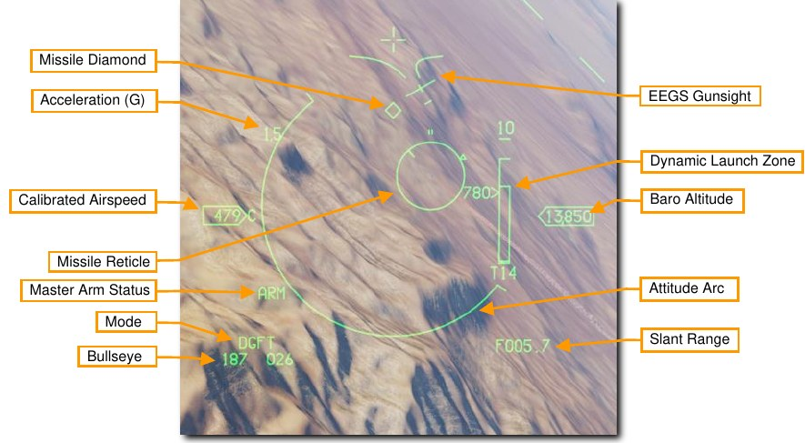

See the sections on Air to Air Gunnery and AIM-9 Sidewinder Employment for details on each display and how
to use them. //link

### Missile Override Mode

With the switch in the Missile Override (inboard) position, the HUD is configured for AIM-120 missile firing. The
left MFD is configured with the radar in RWS mode and the right MFD is configured with the Missile SMS page.

See the section on AIM-120 AMRAAM Employment for details on each display and how to use them.//link

## M6A1 20MM CANNON

The M61A1 20mm automatic gun system provides the pilot with a formidable weapon capability. It is a six-barrel
Gatling type gun mounted in the left strake of the aircraft. The system has a capacity of 512 rounds of
ammunition fired at 6,000 rounds per minute.

### Gun Dispersion

Rounds fired from any gun system do not follow a perfectly straight path but are dispersed in a cone shaped
pattern after they leave the gun’s muzzle. The dispersion pattern becomes a larger and larger cone as slant
range increases. The density of rounds within the cone becomes less and less as the edge of the cone is
approached.

!!! info inline end
    This is based on MIL-DTL-45500/1A that states “At a range of 1,000 inches, 80 percent of a 75 round (min.) burst shall be completely within an 8.0 inch diameter circle for accuracy” and the manufacturer’s data sheet that states “8 milliradians diameter, 80 percent circle”.

The average dispersion of the M61A1 is 8 mils diameter for 80% of the rounds fired and 12 mils for 100% of the
rounds fired.

USAF units maintain a boresight program to ensure gun systems installed on aircraft continue to
meet these specifications while in operational use.

One mil is equal to 1/1000 of a radian so 8 mils equals an 8 foot diameter circle at 1,000 feet range and 12 mils
equals a 12 foot diameter circle. The size of the circle continues to increase with range.

In practical terms, this means you have some leniency in accuracy when firing the gun. In this example, the
green gun pipper is a 4-mil diameter circle. This is where bullets are most dense within the cone. The red
shaded area is the 8-mil circle 80% of the rounds will pass through at the target range. The orange shaded area
is the 12-mil circle that 100% of the rounds will pass through at the target range.

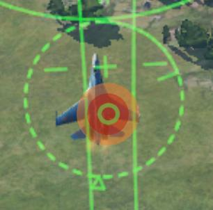

The dispersion pattern of rounds fired from the gun is a circle only if the target is perpendicular to the flight path.
It resembles an ellipse when firing against a horizontal target on the ground.

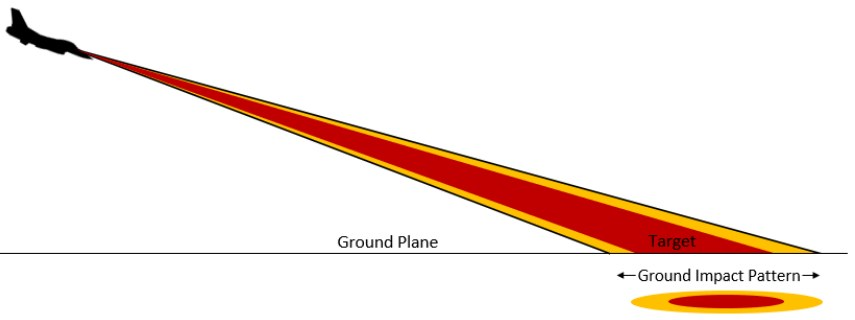

!!! summary

    1. Select A/A master mode [[1]] or DGFT override mode [[3]]
    2. Set Master Arm Switch to Arm
    3. Acquire target using ACM radar mode (optional)
    4. Fly the EEGS funnel and pipper onto the target
    5. Squeeze the Trigger [[Space]] to the second detent to fire the gun

### Air to Air Gunnery

1. There are two ways to get into the correct SMS configuration for air-to-air gunnery. They are:

    - Select the Air-to-Air Gunnery operating mode on the MFD by pressing OSB 1 until GUN is
    displayed, or
    - Position the Dogfight/Missile Override (DOGFIGHT) Switch to DGFT.

    This provides symbology on the HUD for both 20mm gun firing and A-A missile delivery.

    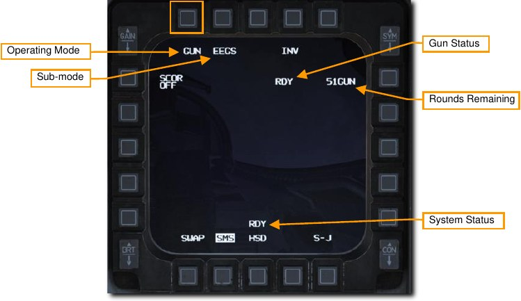

2. **Verify A-A GUN symbology is displayed in the HUD.**

    The Enhanced Envelope Gun Sight (EEGS) provides different levels of information depending on
    whether the radar is locked on the target.
    
    Level I is a failure mode that only displays the Boresight Cross in the event of a Rate Sensor Unit
     (RSU) and INS failure. It should almost never be encountered.
    
    Level II provides a prediction of the bullet path when there is no radar lock. The Boresight Cross,
    EEGS Funnel and Multiple Reference Gunsight (MRGS) Lines are provided.
    
    Level III and IV are intermediate levels that lead to the Level V display. These are usually not seen
    by the pilot.
    
    Level V is displayed after radar lock-on and a firing solution has been computed using that data.
    Additional references in the HUD include the Target Designator, T-Symbol, Range to Target,
    Closure Rate and Level V Pipper.
    
    
    
    **Boresight Cross**. This symbol is always available and shows the boresight direction. This is the
    direction rounds will travel before other influences like gravity or air resistance take effect.
    
    **EEGS Funnel**. Each point along the funnel represents the target at a specific range for which the gun
    is correctly aimed. In other words, an aircraft whose wings are the same width as the funnel is at the
    correct range to be hit by rounds fired at that moment.
    
    As the range decreases, the target size will increase. As this occurs, you must place the target higher
    in the funnel to keep the target wingspan just touching the sides of the funnel. This results in placing
    the target higher in the HUD or, more importantly, closer to the Boresight Cross which results in
    reduced lead for the reduced range.
    
    The target aircraft wingspan must be known for the funnel to provide accurate range information.
    
    **Multiple Reference Gunsight Lines**. The MRGS sight is composed of a series of five line segments
    pointing toward the Gun Bore Line, and spaced in an arc near the bottom of the HUD. They aid in
    lining up long range, high aspect shots by providing the correct lateral aiming solution so the target
    flies up the funnel.
    
    When using an MRGS line, if the target is smaller than the line, it is either out of range or moving
    faster than anticipated and requires extra lead. If the target is larger than the MRGS line, the target is
    moving slower than anticipated and will require less lead.
    
    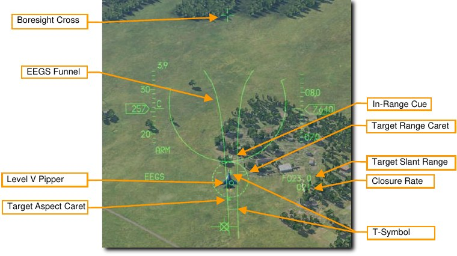
    
    **Target Designator**. This symbol is centered on the locked radar target. The triangular Target
    Aspect Caret shows the target’s aspect angle. Maximum effective gun range is shown by an In-
    Range Cue, two small lines on the outside of the symbol. The position of the Target Range Caret
    indicates the range to the locked target. Each o’clock position represents 1,000 feet of range, so:
    
    - 12 o’clock = 12,000 ft
    - 9 o’clock = 9,000 ft
    - 6 o’clock = 6,000 ft
    - 3 o’clock = 3,000 ft
    
    **Target Range**. The distance to the locked target. Tenths of a mile are displayed for ranges greater
    than one mile. Hundreds of feet are displayed at ranges less than one mile.
    
    **Closure Rate**. The rate of closure with the target in knots.
    
    **T-Symbol**. This symbol shows two firing solutions for the locked target. The + symbol, or ‘one-G
    pipper’ shows the lead angle against a non-maneuvering target. The small horizontal bar, or ‘nine-G
    pipper’ shows the lead angle for a target turning at maximum sustained rate. These may be used as
    a backup in situations the Level V Pipper is not displayed.
    
    Two maneuver potential lines are displayed on either side of the 1g pipper. The longer the lines, the
    greater the out-of-plane maneuver potential of the target.
    
    **Level V Pipper**. This represents the gunfire solution computed for the target’s current range and
    rates. The goal is to stabilize this pipper over the target and fire.

3. **Maneuver your aircraft to frame the target aircraft within the EEGS funnel.**

    Each point along the funnel represents the target at a specific range for which the gun is correctly
    aimed. In other words, an aircraft whose wings are the same width as the funnel is at the correct
    range to be hit by rounds fired at that moment.
    
    Place the enemy aircraft in the funnel so that the wingtips touch the edges or the Level V Pipper is
    stabilized over the target.

4. **Squeeze the trigger all the way to the second detent** to fire the gun when the wingtips touch
the funnel (Level II) or Pipper is over the target (Level V).

Target range greatly affects gun effectiveness. As the rounds come out of the gun, they will gradually
disperse and lose velocity. Increased dispersion and loss of velocity reduce the accuracy and
effectiveness of the gun. The top of funnel represents the minimum range of approximately 600 feet.
The bottom of the funnel represents the maximum range of approximately 3,000 feet. If the target is
smaller than the bottom of the funnel, it is out of range.

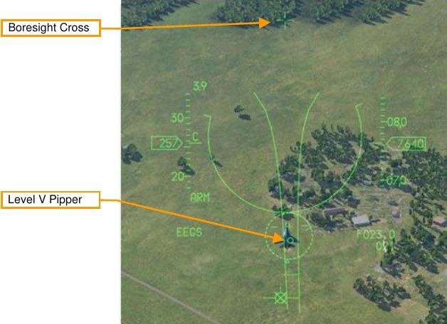

An additional symbol known as the Bullets at Target Range (BATR) Symbol is displayed after rounds are
fired. The BATR is displayed as the first real or simulated round passes the target range and is removed after
the last round has passed. This is only available with a radar lock and EEGS Level III, IV or V symbology
displayed.

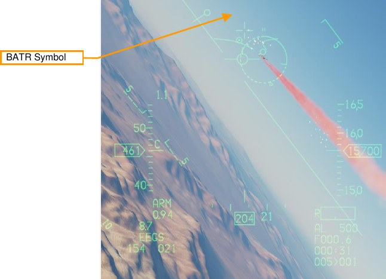

## AIM-9M/X SIDEWINDER

The AIM-9 is a short-range, infrared-guided missile best used in a dogfight. It is fire-and-forget and can be used
with or without a radar lock. The primary indication of a seeker lock is a higher-pitched lock tone. The seeker
can also be uncaged to ensure the seeker is tracking the target when it has first been sensor-slaved to the
target.

Note that the AIM-9 can be decoyed by flares and it’s a good idea to ensure you have a good seeker lock
before launching an AIM-9 with flares in the seeker field of view.

!!! summary

    1. Select AAM [[4]] or DGFT [[3]] master mode
    2. Set Master Arm Switch to Arm
    3. Acquire target using radar (optional)
    4. Maneuver until target is in launch zone
    5. Depress Uncage switch [[C]] to command missile track (if required)
    6. Verify missile diamond is on target and lock tone is audible
    7. Depress Weapon Release [[RAlt]]+[[Space]] switch to fire missile

### AIM-9M/X Employment

1. There are two ways to get into the correct SMS configuration for firing an AIM-9. They are:

    - Select AIM-9s on the MFD by pressing OSB 7 until AIM-9s are displayed
    - Position the Dogfight/Missile Override (DOGFIGHT) Switch to DGFT.

    This overrides any other master mode and configures the displays for air combat. The DOGFIGHT
    position provides symbology on the HUD for both 20mm gun firing and A-A missile delivery. The MSL
    position provides symbology on the HUD for A-A missile delivery only.
    
    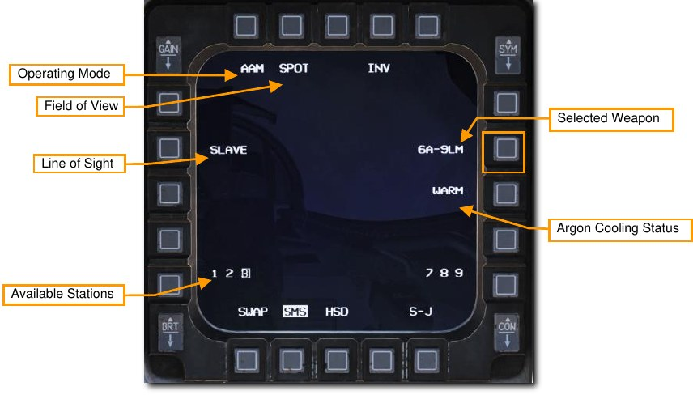
    
    The number and type of missiles is displayed next to OSB 7. The stations with missiles loaded are
    displayed at the bottom and the selected station is boxed. Step through available stations with the
    MSL Step button or by selecting the adjacent OSB.
    
    **SPOT/SCAN** commands the missile seeker to either scan in a narrow field of view (SPOT) or wide
    field of view (SCAN). The wider field of view is achieved by seeker nutation around the line of sight.
    Detection range is decreased when SCAN is used. SCAN mode is not currently implemented.
    
    **SLAVE/BORE** commands the missile to either follow the radar line of sight (SLAVE) or keep looking
    straight ahead down the boresight (BORE). Pressing and holding the CURSOR/ENABLE control
    overrides the current selected option. Releasing the control returns to the option selected on the
    MFD.
    
    **WARM/COOL** activates or deactivates argon cooling of the seeker. This should be set to COOL
    prior to an engagement to cool the seeker and increase detection sensitivity. COOL is selected
    automatically when entering DGFT or MSL Override mode. Argon supply duration varies depending
    on outside air temperature, pressure, and bottle charge level at installation, but the average duration
    is 90 minutes.

2. **Verify A-A Missile symbology is displayed in the HUD.**

    The air-to-air HUD provides information on the status and targeting of air-to-air missiles. Most of the
    symbology from the NAV mode is retained but several new features are added to aid in target
    acquisition and missile launch.
    
    The Missile Diamond indicates the position of the AIM-9 seeker head. This starts at the seeker
    boresight position but unlatches to follow the radar line of sight or track a locked target when a lock is
    achieved.
    
    The Missile Reticle shows the seeker field of view. This will be shown as different sizes depending
    on the SPOT/SCAN field of view setting chosen on the MFD.
    
    

3. **Acquire target using radar (optional).**

    Perhaps the most common and easiest way to target an aircraft with the AIM-9 is to acquire a target
with one of the [ACM Radar Modes](14.radar.md#air-combat-mode-acm). This slews the AIM-9 seeker to the radar target if SLAVE is
selected on the missile. This results in an AIM-9 lock if the target is in range and other IR detection
conditions are met.

4. **Maneuver until target is in launch zone.**

    Fly the missile reticle in the HUD over a target. If the missile detects enough IR energy from the
target, target detection is indicated by an audio missile detection tone (growling sound).

5. **Press Uncage switch to command missile self-track.**

    When the AIM-9 seeker detects a target, it can be uncaged by pressing the Cage/Uncage button to
allow the seeker lock on and follow the target within the confines of the missile seeker’s field of view.
The Missile Diamond latches to the target when locked.

6. **Verify missile diamond is on target and lock tone is audible.**

    The missile growl will become high pitched when the target is locked. A Target Designator Box will
be present over a target locked with radar. If firing against a radar target, the Missile Diamond
should be over the Target Designator box. The Target Range is displayed if radar is used.

    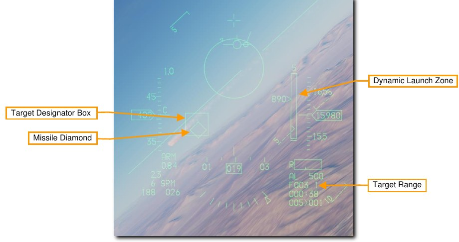
    
    The Dynamic Launch Zone (DLZ) will be displayed on the right side of the HUD when a target is designated
    with the radar. Monitor the DLZ and assess the threat situation to determine the optimal missile firing point. The
    missile diamond flashes when the target is within maximum aerodynamic range (Raero). The missile reticle
    flashes when the target is within maximum maneuvering range (Rtr, when the missile would be effective against
    even a target that immediately turns and runs).
    
    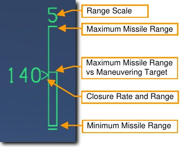

7. **Press the Weapon Release switch to fire the missile.**

    The missile will attempt to intercept the target and the next missile in sequence will be selected. The
AIM-9 is a fire and forget weapon so there is no need to continue tracking the target.

### AIM-9M/X HMCS Missile BORE Employment

The HMCS allows the AIM-9M or AIM-9X missiles to slave to the Helmet Mounted Display (HMD) Aiming Cross
when BORE mode is selected on the missile. This is useful in situations where no radar lock is possible or
desired. This can be thought of as normal AIM-9 employment, except the HMD line of sight is used instead of
the HUD line of sight. The mechanization is otherwise the same.

1. **Turn on the Helmet Mounted Display (HMD) symbology.**

    Power to the HMCS is selected from the HMD Symbology control knob on the left auxiliary console.
Rotating the knob clockwise from the OFF position to INC (increase) provides power to the HMD.
Continued clockwise rotation increases symbology brightness.

    
    

2. **Select AIM-9s on the MFD by pressing OSB 7 until AIM-9s are displayed, or
position the Dogfight/Missile Override (DOGFIGHT) Switch to DGFT.**

    Symbology and functions are identical to non-HMCS employment. Set the Line-of-Sight mode to
BORE to use the HMCS for AIM-9M/X targeting without radar.

    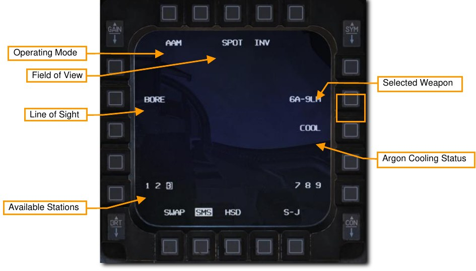

3. **Acquire the target in the HMD.**

    With the AIM-9 set to BORE and the HMCS on, the seeker will follow the Dynamic Aiming Cross in
    the HMD display. The aiming cross is treated as the boresight position. Simply look at the target
    instead of flying the aircraft all the way into position for an AIM-9 lock.
    
    Remember, you will still be constrained by the missile seeker gimbal limits when looking around. The
    Missile Diamond shows where the missile seeker is looking. If you look beyond the missile seeker
    gimbal limits, the diamond symbol will be displayed with an “X” through it and will be clamped to the
    edge of the HMCS display area.
    
    The other symbology on the display intentionally mimics the symbology from the HUD.
    
    

4. **Press Uncage switch to command missile seeker track.**

    When the AIM-9 seeker detects a target, it can be uncaged by pressing the Cage/Uncage button.
This allows the seeker to lock on and follow the target within the confines of the missile seeker’s
gimbal limits. The Missile Diamond latches to the target when the seeker has locked on.

    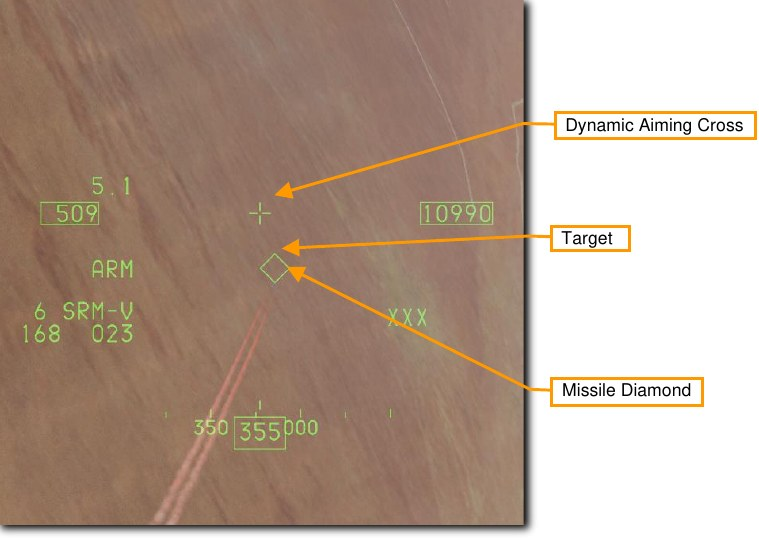

5. **Verify missile diamond is on target and lock tone is audible.**

    The missile growl will become high pitched when the target is locked. The Missile Diamond should
be latched to the target and no longer follow the Aiming Cross.

6. **Press the Weapon Release switch to fire the missile.**

    The missile will track the target and the next missile in sequence will be selected. The AIM-9 is a fire
and forget weapon so there is no need to continue tracking the target.

### AIM-9M/X HMCS Radar BORE Employment

The HMCS also allows the Fire Control Radar to slave to the HMCS Aiming Cross when ACM BORE radar
mode is selected. This can be thought of as normal AIM-9 employment, except the HMD line of sight is used
instead of the HUD line of sight. The mechanization is otherwise the same.

1. **Turn on the Helmet Mounted Display (HMD) symbology.**

    Power to the HMCS is selected from the HMD Symbology control knob on the left auxiliary console.
Rotating the knob clockwise from the OFF position to INC (increase) provides power to the HMD.
Continued clockwise rotation increases symbology brightness.

    
    

2. **Select AIM-9s on the MFD by pressing OSB 7 until AIM-9s are displayed, or
position the DOGFIGHT Switch to DGFT.**

    Symbology and functions are identical to non-HMCS employment. Set the Line-of-Sight mode to
SLAVE to use the HMCS and radar for AIM-9M/X targeting.

    

3. **Select ACM BORE radar mode, press TMS forward, and acquire the target in the HMD.**

    With the ACM BORE radar mode selected and the HMCS on, the radar will follow the Dynamic
    Aiming Cross in the HMD display. The aiming cross is treated as the boresight position. Press TMS
    forward once, then simply look at the target instead of flying the aircraft all the way into position for a
    radar lock.
    
    Remember, you will still be constrained by the radar gimbal limits when looking around. The ACM
    BORE Symbol shows where the radar is pointing. If you look too far off the aircraft boresight, the
    radar will not be able to follow.
    
    The Target Range is displayed after radar lock. The other symbology on the display intentionally
    mimics the symbology from the HUD.
    
    

4. **Achieve radar lock in ACM BORE Mode.**

    The radar will lock the first target detected within the ACM Bore Symbol. A Target Designator Box
    will be present over a target locked with radar.
    
    With the AIM-9 line of sight set to SLAVE, the seeker will slew to the radar line of sight. When the
    AIM-9 seeker detects a target, it can be uncaged by pressing the Cage/Uncage button. This allows
    the seeker to lock on and follow the target within the confines of the missile seeker’s gimbal limits.
    The Missile Diamond latches to the target when the seeker has locked on.
    
    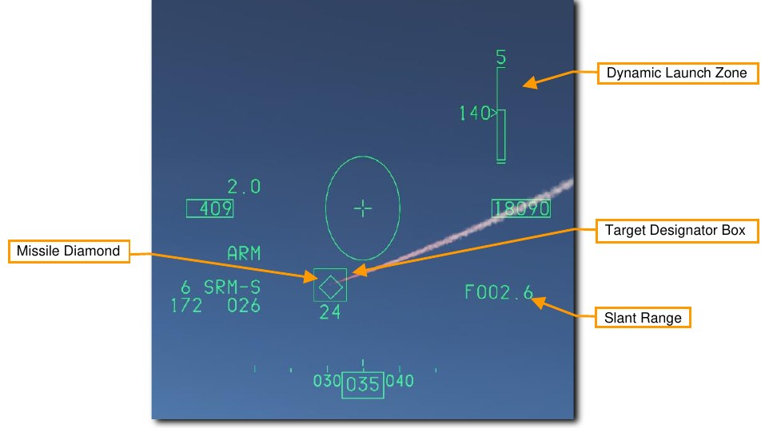
    
    
    The Dynamic Launch Zone (DLZ) will be displayed on the right side of the HMD when a target is
    designated with the radar. Monitor the DLZ and assess the threat situation to determine the optimal
    missile firing point. The missile diamond flashes when target is within maximum range against a
    maneuvering target.
    
    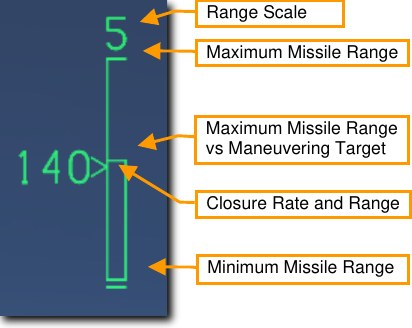

5. **Verify missile diamond is on target and lock tone is audible.**

    The missile growl will become high pitched when the target is locked. The Missile Diamond should
be latched to the target.

6. **Press the Weapon Release switch to fire the missile.**

    The missile will attempt to intercept the target and the next missile in sequence will be selected. The
AIM-9 is a fire and forget weapon so there is no need to continue tracking the target.

## AIM-120 AMRAAM

The AIM-120 AMRAAM is an Active Radar-Homing (ARH) air-to-air missile that can self-guide to a target using
an active radar seeker in its nose. The missile is guided initially via datalink commands from the launching
aircraft, and transitions to onboard active radar homing once within range. Because of the active seeker, the
pilot can engage multiple targets at once without needing to support the missile for its entire time of flight.

The AIM-120 is a medium range missile and can engage targets outside 20 nm. However, engagement range is
highly dependent on target aspect, engagement altitude, launch speed, and target post-launch maneuvering. As
such, the engagement range of the AIM-120 can be less than 10 nm in some situations.

In WVR combat, the AIM-120 can also be launched in BORE mode without a radar lock. Once the missile is
launched, it will track and attempt to hit the first target it detects within the AIM-120 reticle on the HUD.

### SMS Format
With AIM-120s selected, the SMS format appears as shown:

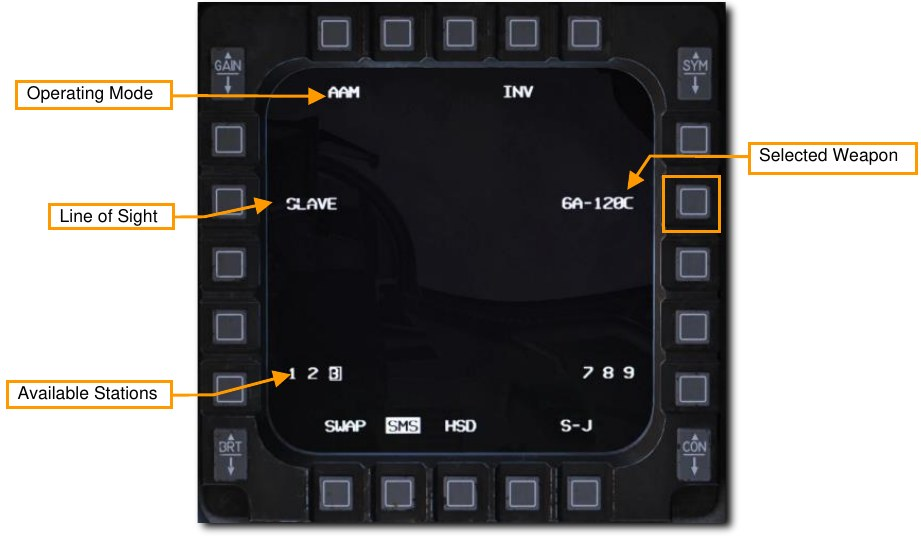

Line of Sight. When set to SLAVE, missile radar line of sight is slaved to the aircraft’s radar. The missile will
receive datalink steering from the launching aircraft until it’s within radar range, then it will attempt to track the
target. When set to BORE, the missile’s radar scans straight ahead. It will track the first detected target after
launch. Pressing Cursor Enable also cycles between SLAVE and BORE modes.

### HUD Symbology

**No Target Lock**

**Master Arm Status**. Displays “ARM” when Master Arm is on.

**Missiles Remaining**. Displays the number of missiles remaining and “MRM” for medium-range missile.

**Missile Diamond**. Indicates missile radar line of sight. This is initialized at seeker boresight position but will
slew to target LOS when SLAVE mode is selected, and a target is locked.

**Allowable Steering Error Circle (ASEC)**. Indicates the zone in which the Attack Steering Cue (ASC) should
be located prior to launch to hit the target with a high probability kill (PK). The ASC is displayed after radar lock.
The ASEC shows the maximum angular steering error probability. In other words, the circle increases in size
when the distance to the target intercept point decreases, which means that as the distance decreases, the
missile can be launched with greater steering error.

**With Target Lock**

**Relative Angle-Off**. Displays the angular difference between aircraft heading and target bearing.

**Dynamic Launch Zone**. Displays information about the missile’s capabilities against a target at its current
range.

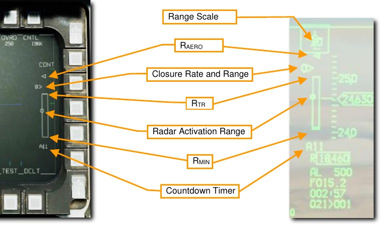

**Range Scale**. Indicates the range represented by the highest tick mark.

**R~AERO~ (aerodynamic range)**. The maximum kinematic range of the missile. A shot at this distance would only be
effective against a target that continues its current course and speed and does not maneuver.
Closure Rate and Range. The caret indicates the current target range against the DLZ, and the adjacent
number is the closure rate in knots.

**R~TR~ (turn-and-run range)**. The maximum range where the missile is guaranteed to reach the target regardless of
target maneuvering. A shot at this distance would hit a target that immediately turns 180° away from the missile
while maintaining speed.

**Radar Activation Range**. The range at which the missile will activate its own radar, and no longer needs
continued support from the launching aircraft.

**R~MIN~ (minimum range)**. The closest range that allows the missile to activate its seeker, lock a target, arm, and
detonate safely.

**Countdown Timer**. Displayed after missile launch. Displays “A” followed by the number of seconds until the
missile activates its seeker, then “T” followed by the number of seconds until predicted impact.

### FCR Post-Launch Symbology

Following AIM-120 launch, the FCR format will display different symbols to indicate different missile
employment statuses:

{ align=left }

A target with an AMRAAM in flight is displayed in magenta with a solid “tail” opposite its trend
vector.    

{ align=left }

A target with at least one AMRAAM in flight that has gone active is displayed in red, and the tail
flashes.    

{ align=left }

A target with at least one AMRAAM that has reached predicted time of impact is displayed with
a flashing “X” through it.   

### AIM-120 Employment

** Summary **

1. Select A/A master mode [[1]] or MSL override mode [[4]]
2. Set Master Arm Switch to Arm
3. Acquire target using radar (optional but recommended)
4. Maneuver until target is in launch zone
5. Depress Weapon Release [[RAlt]]+[[Space]] switch to fire missile

  

1. **There are two ways to select the AIM-120 for employment:**

    - Select AIM-120s on the MFD by pressing OSB 7 until AIM-120s are displayed, or
    - Position the Dogfight/Missile Override Switch to MSL OVRD. This overrides any other master
    mode and configures the displays for air combat. The MSL position provides symbology on the
    HUD for A-A missile delivery and selects the longest-range missile type loaded.

2. **Verify A-A Missile symbology is displayed in the HUD.**

    The air-to-air HUD provides information on the status and targeting of air-to-air missiles. Most of the
    symbology from the NAV mode is retained but several new features are added to aid in target
    acquisition and missile launch.

3. **Acquire target using the radar**

    Typically, a target will be locked using RWS, TWS, or any ACM radar sub-mode and the AIM-120 set
    to SLAVE.
    
    When the locked target is outside the HUD field on view as shown below, a Target Locator Line
     (TLL) extends from the Gun Cross and points directly at the target. The Relative Angle is displayed
    next to the Gun Cross showing the angle in degrees between the cross and the target.
    The Allowable Steering Error Circle (ASEC) changes size and the Attack Steering Cue (ASC)
    becomes visible. The Target Range is displayed after target radar lock.

4. **Maneuver until Attack Steering Cue (ASC) is inside the Allowable Steering Error Circle (ASEC)**

    The size of the Allowable Steering Error Circle will vary depending on the target range and aspect.
    Ensure that the Attack Steering Cue is located as close to the Allowable Steering Error Circle
    center as possible when firing to achieve the best performance out of the missile.
    
    When the target enters the HUD, the Target Designator Box will be displayed over the target and
    the Missile Diamond will track that location.
    
    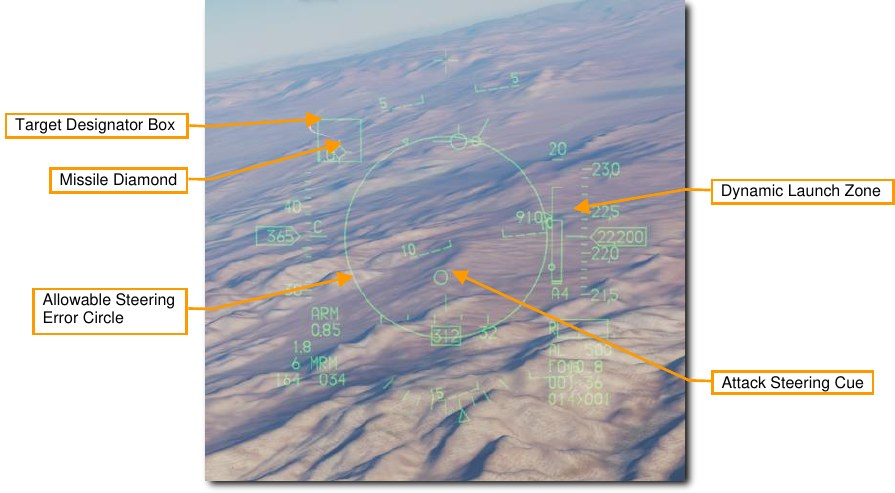
    
    Monitor the Dynamic Launch Zone and assess the threat situation to determine the optimal missile
    firing point.

5. Press and hold the Weapon Release switch to fire the missile.

    The missile will track the target and the next missile in sequence will be selected.

    The AIM-120 may also be employed in BORE mode without a radar lock on the target. This is used
when a quick shot must be taken, or no radar emissions are desired. The missile radar will go active
at launch and guide on the first target it detects so use this mode with care.

### Simultaneous Employment Against Multiple Targets

The F-16 FCR can support up to four simultaneous in-flight AMRAAMS against up to four targets. Simultaneous
employment is accomplished in TWS or RWS DTT mode.

** Summary **

1. Select A/A master mode [[1]] or MSL override mode [[4]]
2. Set Master Arm Switch to Arm
3. Acquire at least two targets using TWS or DTT
4. Maneuver until all targets are in launch zone
5. Depress Weapon Release [[RAlt]]+[[Space]] to fire first missile
6. Press TMS Left to cycle bug to next target
7. Depress Weapon Release [[RAlt]]+[[Space]] to fire second missile

 

1. **Select AIM-120s for employment:**

    1. Activate A-A master mode using the ICP, then on the SMS format, press OSB6 until AIM-
    120 is selected; or
    1. Place the Dogfight/Missile Override switch in MSL OVRD.

2. **Set the Master Arm switch to Arm.**

3. **Acquire at least two targets using TWS or DTT.**

    In RWS mode, move the acquisition cursor over the first target and press TMS Forward to designate
    it. Then, move the acquisition cursor over the second target and press TMS Forward to designate it.
    
    In TWS mode, move the acquisition cursor over each target and press TMS Forward to designate it
    as a System Target. You may designate up to four System Targets for AMRAAM employment.
    
    

4. **Maneuver until all targets are within the launch zone.**

    DLZ information is only displayed for the
current bugged target. Use TMS left to cycle between bugged targets and track DLZ status for each.

5. **Depress Weapons Release to fire first missile.**

    Then press TMS Left to cycle the bug to the next
target, and press Weapons Release again to fire the second missile. If using TWS, you can repeat
this process up to four times total.

