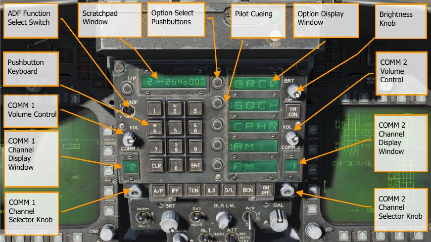

# Communication System

The DCS: F/A-18C Hornet is equipped with two ARC-210 (RT-1556) radios. These act as COMM 1 and
COMM 2 and operate as both VHF and UHF radios for air-to-air and air-to-ground voice
communications, in addition to Automatic Direction Finding (ADF).

Up two 20 channels in the 30 to 400 MHz band can be set as pre-assigned frequencies for each
radio. Guard frequency operates at 243.00 AM. Preset frequencies are set in the Mission Editor but
can be manually edited while in flight.

To radio transmit on COMM 1 or COMM 2, the radio switch on the throttles must be pressed to the
selected radio (1 or 2).

## How to Use the Radios

1. Select desired radio preset frequency by rotating either the COMM 1 or COMM 2 knob.
The frequency preset will be displayed on the Scratchpad.
2. Press COMM 1 or COMM 2 on the radio switch on the throttles based on radio the
frequency is tuned to.
3. Use the Radio Menu to issue your radio message.

## UFC Radio Functions

Primary control of the radios is done with the Upfront Control (UFC) include:

**COMM 1 and COMM 2 Volume Control**. Rotate these two knobs to control radio volume of the
two radios.

**COMM 1 and COMM 2 Channel Selector Knobs**. When either knob is pulled, the active frequency
is displayed on the Scratchpad Window. When rotated, they cycle through each of their 20 preset
channels. Additionally, manual frequency selection mode (M), guard channel (G) at 121.5 MHz for
VHF and 243.0 for UHF, cue channel (C), and maritime (S) are available.

- **1–20**. The radio is tuned to one of the 20 preset frequencies.
- **M**. The radio is tuned to a manual frequency. You can enter a frequency using the UFC
keypad without having to override an existing preset.
- **G**. The radio is tuned to the guard frequency, which is an emergency frequency monitored
by all aircraft. Guard is 121.5 MHz VHF or 243.0 MHz UHF. The radio will select either the
VHF or UHF guard frequency depending on whether the previously tuned frequency was in
the UHF or VHF band.
- **C**. The radio tunes to a SINGCARS cue frequency. (N/I)
- **S**. The radio tunes to a maritime channel. Maritime radio channels are numbered from 1 to
28 or 60 to 88. They are used by shipboard radios or coastal stations. Use the UFC keypad
to enter the maritime radio channel.

**COMM 1 and COMM 2 Channel Display Windows**. These two windows display the selected
preset channel (1-20) and the G, M, C and S selections.
ADF Function Switch. This switch enables ADF steering on a selected radio beacon. When ADF 1 is
selected, ADF steering is based on the COMM 1 radio setting. When set to ADF 2, ADF steering is
regarding the COMM 2 frequency. The OFF setting disables ADF steering.
ADF steering is indicated on the Horizontal Situation Indicator (HSI) as a small circle. See Navigation
section of this guide.

**Scratchpad Window**. The selected radio preset, or G, M, C, and S frequency are displayed on the
Scratchpad, by either pulling either COMM knob or rotating the knob. The Scratchpad is also used to
enter a frequency using the Manual entry (M) mode.
Option Display Windows. When a preset or G, M, C, S frequency is selected, options are displayed
on the Option Display Windows in the center of the UFC. These include:

- **GRCV**. When selected and colon is visible, Guard is enabled. Guard is disabled when the
colon is absent.
- **SQCH**. With colon visible, radio squelch is enabled to reduce the level of radio noise. With
no colon displayed, squelch is disabled.
- **CPHR**. Cycles between plain voice radio (uncolonized), baseband cipher mode (:CPHR),
and diphase cipher mode (:CPDP). (N/I)
- **AM**. Colon indicates that AM modulation is selected.
- **FM**. Colon indicates that FM modulation is selected.
- **MENU**. Displays a menu for sending or receiving Time of Day (TOD). (N/I)

**Option Select Pushbuttons**. These buttons are used to select the options indicated in the Option
Display Windows.

**Brightness Control Knob**. Rotating this knob controls the brightness of the UFC display.
