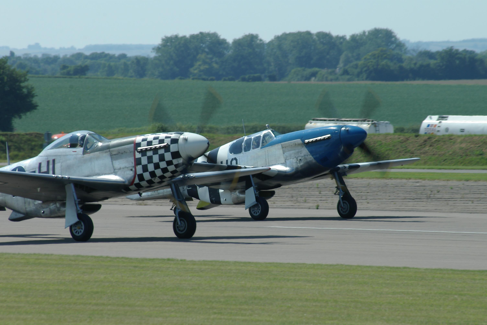

# An Old Indian Legend

Once upon a time, long ago, when his tribe was at war, a young Indian brave was called to the tepee of his eldest uncle. “My son,” said the uncle, who was one of the chiefs of the tribe, “you are needed to join our warriors in the fight. You haven’t many years, but you are strong of body and quick of mind. And you are greatly needed. So I have decided to bestow upon you a great honor,” continued the uncle. “You are to have the finest stallion in my herd – that beautiful young mustang from the western plains.”

The boy’s face glowed with delight. For well he knew that only the luckiest among the tribe were privileged to go forth to battle on the speedy, spirited, and durable little mustangs.

“But it will take time to master this stallion,” warned the uncle. “You will have to work hard and long and patiently with the animal. And you will not be allowed to join your elders against the enemy until you have proven well that you can handle him.”

In the days that followed, the young brave was the envy of all eyes, for the mustang was a beauty to behold and one of the fastest horses of the tribe. Now this made the young brave all the more eager. So in just a few weeks he returned to his uncle saying, “I am ready to join the fight.”

The chief took the young brave, proud upon his fiery mustang, to a great clearing in the woods to see how well he and his newly broken stallion could perform. In the very first tests where the going was rough, the boy landed in a heap on the ground.

“My son,” said the uncle, “you have disregarded my warning. There is no finer horse in all our herds than the one I have given you. But it is fast, and full of power and destruction. And it must be made to know that you are its master. Or, as you have learned, you will not be riding the animal long.”

In the days that followed, the chastened young brave worked diligently with his stallion. He now respected its speed and daring which were his to command. And though confident, he never bragged of his prowess. In due time, the uncle, wise in the ways of the world, put the boy once again to the test. On this occasion the young brave had the mustang completely under his control. He had worked hard and long, because he really wanted to succeed. Man and animal performed as one, the beautiful stallion responding to the slightest command of the rider in a manner that warmed the heart of the aged uncle.

In the years that followed, the young brave, with his unrivaled mustang under perfect control, performed brilliantly in fight after fight. Enemy braves, riding lesser animals, could never match his masterful performances. None could outride him; none could outwit him. The young brave’s deeds became legendary. And he lived to be a very old man and had many offspring – who never tired of relating the heroic deeds of the famous forbearer.
