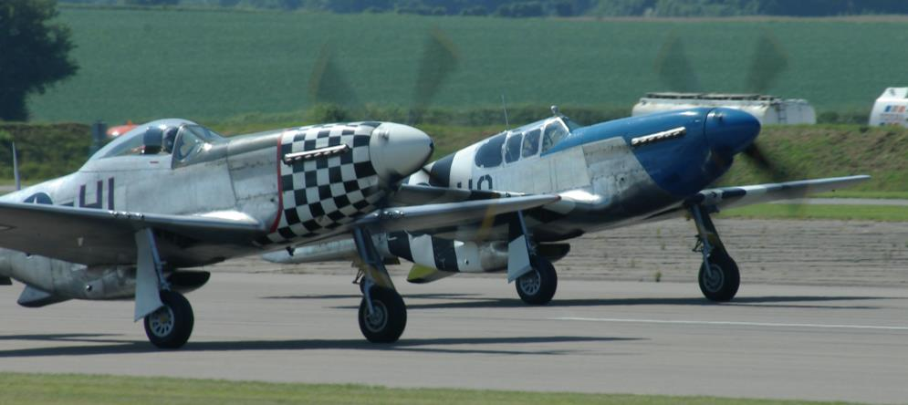

# Introduction

Like the Indian braves of the old southwest whose favorite in battle was the small speedy Mustang, young fighter pilots of World War II, with their newly won wings, almost without exception wanted to fly the famous namesake of that sleek and powerful war horse, the P-51.

And no wonder, for the P-51 is truly a pilot’s aircraft. In mission after mission it had proved that it could more than hold its own against any opposition. Its speed and range were at the tops. It operated effectively on the deck and all the way up to 40,000 feet. In maneuverability and load-carrying capacity, it ranked with any other fighter in the world.

The P-51 was the first aircraft of the war to be built entirely on the basis of combat experience. Its design was started by North American Aviation (NAA) after the Luftwaffe had begun to overwhelm Europe – and many lessons had already been learned about modern aerial warfare from actual experience.

The P-51 was initially conceived when NAA was approached by the British in 1940 to license produce their P-40's on order from Curtiss-Wright Corporation. NAA's president responded that the company could instead produce its own, better fighter aircraft in the same time it would take to prepare for the production of the P-40. The first prototype, designated NA-73X, made its maiden flight on 26 October, 1940 - after an unusually swift design and production schedule.

The first operational Mustangs were delivered to the Royal Air Force (RAF) in October of 1941 as Mustang Mark-I's. These aircraft saw their initial action in the summer of 1942. Armed with two .50 caliber and four .30 caliber machine guns and limited in high altitude performance, they were used primarily for reconnaissance and 'rhubarb' missions – for zooming in at low altitudes and strafing trains, troops, and enemy installations.

The P-51’s were the first American-built fighters to carry the war back across the English channel after the battle of Dunkirk. A short time later they would set another record by being the first single- engine planes of any country to penetrate Germany proper from bases in England. So successful were the powerful little Mustangs that the United States Army Air Forces (USAAF) decided to adopt the aircraft for its own use.

Two improved models were created – a P-51A fighter (designated Mustang Mark-II in the RAF) and an attack version known as the A-36 "Apache". This attack model was equipped with bomb racks and diving brakes and armed with six .50 caliber machine guns. Thus, as the A-36, the Mustang became a triple-threat performer – fighter, strafer, and dive bomber. In these roles, it helped write aerial history in the momentous days when the Allies took Sicily and Italy.

Up to this point, the Mustang had been powered by the Allison V-1710 series engine, which did not provide satisfactory high-altitude performance. When the need for higher altitude and longer range fighters developed so urgently, it was decided to see what the Mustang could do to meet these requirements. The Allison engine, with its single-speed supercharger blower, was replaced by the more powerful Rolls-Royce Merlin engine with a 2-speed supercharger blower. Along with other improvements, the prop was increased from three to four blades. Thus was developed the P-51B and C (B if built on the west coast, C if built in Texas – they were essentially the same otherwise), or the Mustang Mark-III as it was known in the RAF.

The new model proved an unquestioned success. The Luftwaffe learned to fear it at any altitude. As for range, the new Mustang made it possible for the first time for fighters to escort heavy bombers all the way from Britain to Berlin. Later, Mustangs escorted bombers all the way to Poland. And when the great triangular shuttle raids connecting England, Russia, and Italy began, P-51’s were the first fighters to operate all around the continent-girdling circuit. One of the legs of this triangle was some 1600 miles long!

The P-51D version of the Mustang retained all of the great features of its predecessor, with important added improvements. Chief among these are the increased visibility for the pilot in a new "bubble" canopy, more convenient cockpit arrangement, and heavier firepower with six .50-cal machine guns fitted in the wings. The 'D' also featured a new dorsal fin to improve directional stability problems encountered when the rear fuselage area of the previous models was reduced to increase rear visibility from the cockpit.

Becoming the definitive model of the Mustang during World War II, over 8,000 P-51D airframes were produced. As the war drew to a close, P-51s were active not only in the European theatre, but also in the Mediterranean and in the Far East, where, like in Europe, the aircraft's long range and superior performance made it the ideal escort for bombers running missions into the heart of Japan.

