# Aircraft Overview

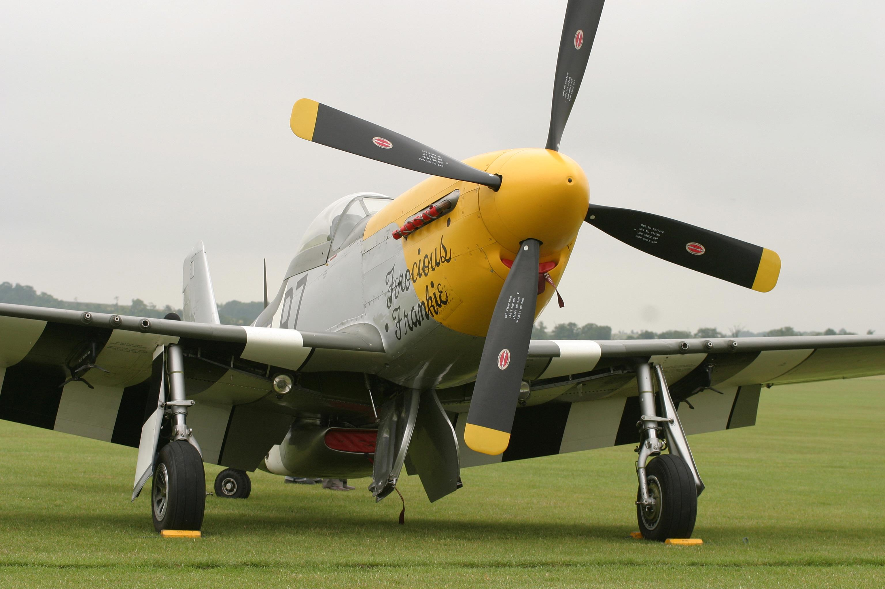

## General Description

The North American Aviation P-51D fighter aircraft is a single-seat, low wing monoplane powered by a 12-cylinder V-1650-7 liquid cooled, Packard built Rolls Royce "Merlin" engine. The engine is equipped with a two-speed, two-stage supercharger and an automatic manifold pressure regulator. The engine spins a four blade Hamilton Standard Hydromatic constant speed propeller.

The Packard engine delivers approximately 1490 horse power at sea level. It has a critical altitude of approximately 14,000 feet in low blower supercharger mode and a critical altitude of approximately 27,000 feet in high blower mode. The maximum altitude is approximately 40,000 feet. The supercharger ratios are approximately 6 to 1 in low blower mode and 8 to 1 in high blower mode.

The fuselage is a semi-monocoque, all-metal structure. The all-metal wings are built in two halves which are joined at the aircraft center line and are of full cantilever structure. The airfoil is of laminar- flow design, which provides low drag even at high speed. The tail section is metal with fabric-covered elevator and rudder control surfaces. The aircraft is flush-riveted throughout – another factor contributing to its great speed.

Two fuel tanks with a total capacity of 184 U.S. gallons are located inside the wing and an additional 85-gallon fuselage fuel tank is located aft of the cockpit.

The armament consists of six .50 caliber machine guns mounted in the wings. Streamlined bomb racks installed beneath each wing panel can accommodate one 100, 300, or 500-lb. bomb each, or a depth charge or chemical tank. The bomb racks can be easily removed. Bombs may be substituted by droppable combat fuel tanks with a capacity of 75 or 110 U.S. gallons each for long-range operations. The wing can also support up to 10 unguided rockets, or up to 6 if bombs are also loaded.

### Specifications

Specifications for the P-51D are:

* Wingspan – 37 feet

* Overall length – 32 feet 3 inches

* Height (tail down) – 12 feet 2 inches

* Prop diameter – 11 feet 2 inches

* Pitch setting – 23° to 65°

* Wing area – 233.19 square feet

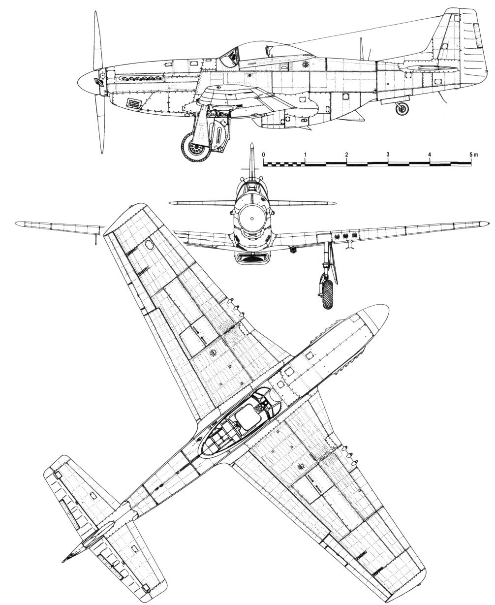

## P-51D Major Assembly Parts

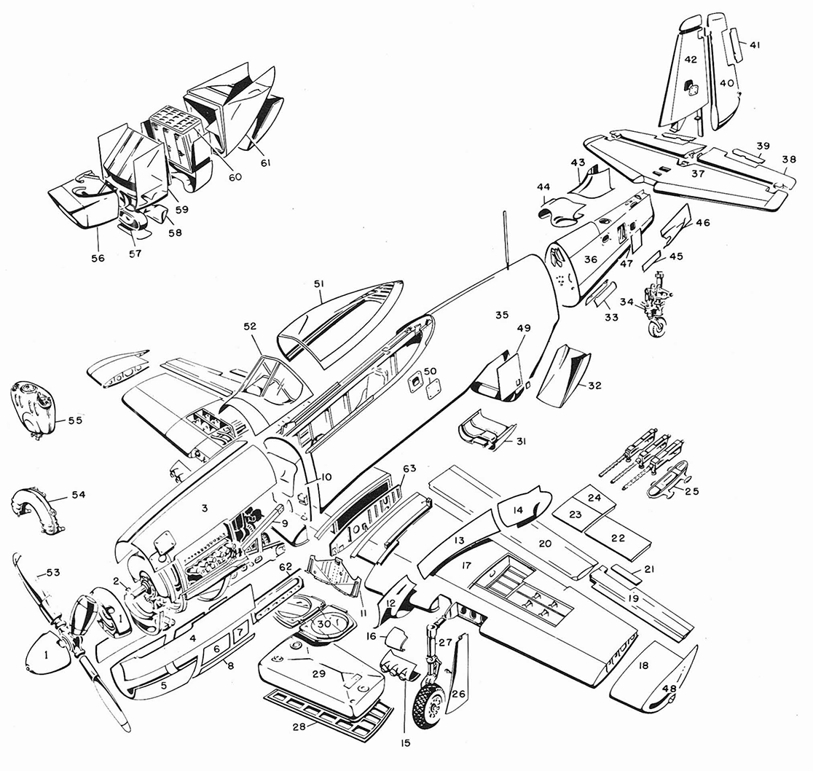

1. Propeller Spinner
2. Engine Mount Front Flame
3. Engine Top Cowling
4. Engine Intermediate Cowling
5. Engine Bottom Cowl 
6. Engine Bottom Cowl Center
7. Engine Bottom Cowl Rear
8. Engine Bottom Cowl Aft
9. Engine Mount Assembly
10. Firewall Assembly
11. Wing Center Bulkhead
12. Wing Fillet Forward
13. Wing Fillet Intermediate
14. Wing Fillet Rear
15. Gun Nose Assembly
16. Landing Gear Access Door
17. Outer Wing Panel
18. Wing Tip Assembly Inner
19. Aileron Assembly
20. Flap Assembly
21. Aileron Trim Tab Assembly
22. Ammunition Bay Door
23. Gun Bay Door Forward
24. Gun Bay Door Rear
25. Wing Bomb Rack
26. Strut Fairing
27. Landing Gear Strut
28. Fuel Tank Door
29. Fuel Cell
30. Wheel Fairing Door
31. Coolant Radiator Access Cover
32. Radiator Air Scoop Rear
33. Tail Wheel Doors
34. Tail Wheel Assembly
35. Fuselage Assembly Front Covered
36. Fuselage Assembly Rear Covered
37. Horizontal 
38. Elevator
39. Elevator Trim Tab
40. Rudder
41. Rudder Trim Tab
42. Fin
43. Fin Fillet Forward
44. Empennage Fillet, Forward 45. Empennage Fillet, Lower
46. Stabilizer Fillet Rear
47. Cover Assembly
48. Wing Tip Assembly Outer 49. Cover Assembly
50. Cover Assembly
51. Canopy
52. Windshield Assembly
53. Propeller Blade
54. Cool. Header Tank Complete 55. Oil Tank
56. Radiator Air Scoop Forward 57. Oil Cooler
58. Oil Cooler Outlet Door
59. Radiator Air Duct Forward 60. Radiator Assembly
61. Air Duct Aft
62. Stack Fairing
63. Rib, Wing Center

## Fuselage

The fuselage is a semi-monocoque, aluminum alloy structure consisting of three sections: engine mount, main fuselage, and aft section. The engine mount is a box-beam structure attached to the firewall at four points and extending forward on each side of and below the engine. The engine mount structure serves as the sole support for all parts of the aircraft which are forward of the firewall. The main fuselage is of the four-longeron type incorporating an A-shaped overturn structure aft of the pilot’s seat. Armor plating is provided behind the pilot’s seat and is included as part of the firewall. The aft section of the fuselage houses the tail wheel assembly and supports the tail section.

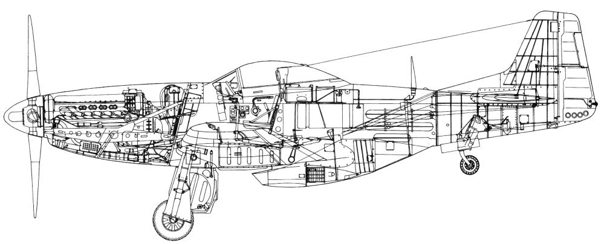

### Canopy

The P-51D features a teardrop canopy design that allows for an unrestricted view around the aircraft. The canopy slides back and forth and is operated by a clutch-and-crank handle on the right side of the cockpit. The canopy is unlocked from the outside by a release button below the canopy on the right side of the fuselage. The forward flat section of the windshield is armor plate glass.

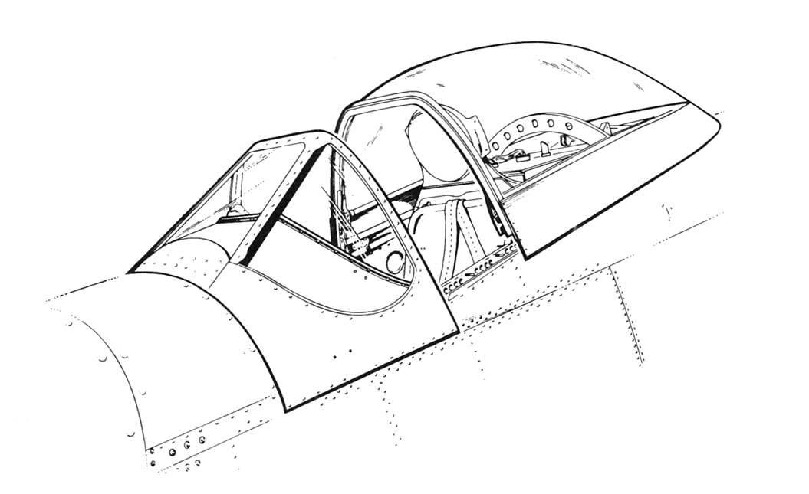

## Wing

The airfoil is a full cantilever, two spar, laminar flow wing. It is filler finished and hand polished. The upper and lower leading edge surfaces are covered with a surfacer to assure smoothness of the airfoil sections. The metal-covered ailerons are statically, dynamically, and aerodynamically balanced. The left aileron is equipped with a trim tab, controllable from the cockpit. Hydraulically operated, sealed type wing flaps extend from the ailerons to the fuselage.

The efficiency of the wing is adversely affected by nicks, dents, and scratches on the surface.

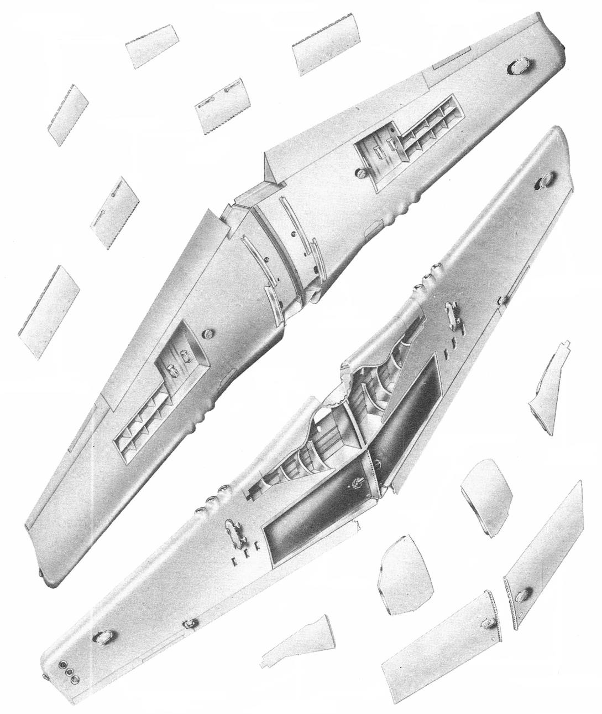

Tests have been conducted at the factory and it was found that, with a strip of wire 1/16” in diameter taped along the leading edge of the wing, the aircraft would not leave the ground. Frost will affect the wing in the same manner; therefore care must be taken to preclude any takeoff attempts with frost on the wing.

Unique to the P-51 in its time was the laminar flow wing, which was developed by the US National Advisory Committee for Aeronautics (NACA). Conventional wing designs feature a cross-section with maximum thickness about a fifth of the way across the wing from the leading edge, with most of the camber on the top of the wing. The laminar flow wing, in contrast, has its maximum thickness well aft from the leading edge, and has almost as much camber on top as on the bottom. This design reduces turbulent flow across the wing, thereby reducing drag and increasing speed and range. Drag was also reduced on the P-51 by positioning a ventral radiator underneath the rear of the fuselage, to present the smallest possible fuselage cross section.

A laminar flow wing of a thin cross section allowed the Mustang to avoid most of the compressibility dive problems that plagued many other high performance fighters of the time.

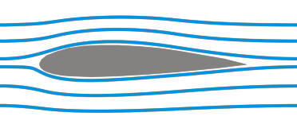
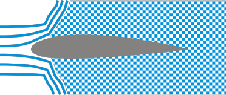
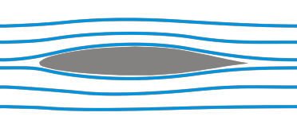
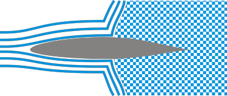

## Tail Section

The tail section consists of a horizontal stabilizer, vertical stabilizer, elevators, and rudder. The elevators and rudder are equipped with trim tabs controllable from the cockpit. Lead weights are attached to the leading edges to balance the elevators and rudder statically and dynamically.

Compared to the earlier B-C model, the P-51D features a dorsal fin section ahead of the vertical stabilizer for increased lateral control and structural strength.

## Flight Controls

The ailerons, elevators, and rudder are controlled by a conventional stick and rudder pedals. The ailerons are sealed internally so that no air can pass through the opening between the aileron and wing section. This lightens the pressure on the control stick and at the same time provides more positive action.

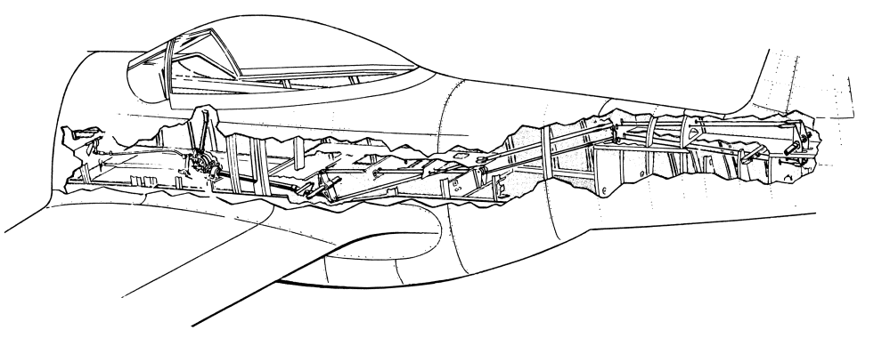

The tail section control surfaces are limited to the following angular movements: rudder: +/-30°, elevator: +30°/-20°. The aileron travel can be adjusted to the following settings: +/-10°, +/-12°, +/- 15°. The flaps extend the full distance from the fuselage to the ailerons and are hydraulically operated by a control handle on the left side of the cockpit. The flaps have a 47° range of movement and are brought to any desired position by moving the control lever to the corresponding angle as indicated on the panel. It takes 11-15 seconds for the flaps to go from the full up to the full down position.

Trim tab controls for the left aileron, rudder, and elevators are also located on the left side of the cockpit. A pointer marker integrated with each control wheel mechanism indicates the position of the tab in degrees. The rudder pedals are adjustable for leg length by means of a lever at the inboard side of each pedal.

### Surface Control Lock

The surface control lock is located at the base of the control stick. To lock the controls, the stick is moved into the locking arm while pulling out the knob on the arm; then the knob is released to lock the stick in place. This locks all of the controls. The rudders catch and are locked when moved into neutral position. To release the lock, the locking arm is pulled out and the spring is moved forward out of the way. Note that there are two holes in the locking lug. When you use the bottom hole, the tail wheel is locked along with the controls. Using the top hole leaves the tail wheel free to swivel 360°, so the aircraft can be towed.

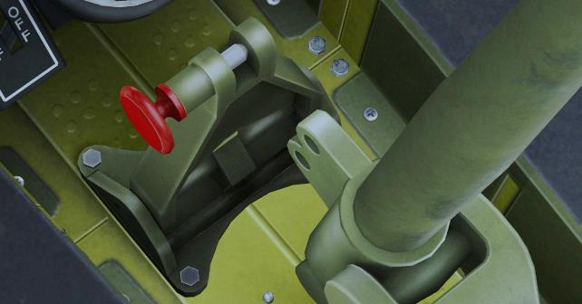

## Landing Gear

The landing gear consists of two main gears and a tail gear. All three units are fully retractable hydraulically and are controlled simultaneously by the Landing Gear Control handle on the left side of the cockpit. When the landing gear is retracted, the main gear is completely enclosed in the wings and the tail gear is completely enclosed in the fuselage. The tail wheel is steerable and full swiveling. When the control stick is in the neutral position or pulled back, the tail wheel is locked; in this position it is steerable 6° to the right or left through the use of the rudder pedals. With the control stick positioned forward of neutral, the tail wheel is unlocked for free swiveling action.

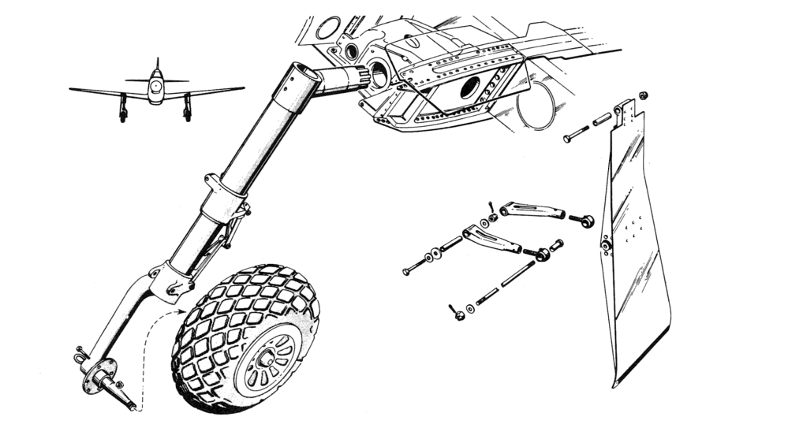

The landing gear takes 10-15 seconds to move into position. In situations where the landing gear must be raised immediately after lowering it, such as go-around, it’s important to raise the gear only after it is fully extended and locked. Raising the gear before it locks risks damaging the gear or the fairing doors.

In emergency situations, the landing gear can be released by means of a red handle just above the hydraulic pressure gauge on the front panel of the cockpit. Pulling this handle releases the pressure in the hydraulic lines, allowing the gear to drop of its own weight when the landing gear lever is in the DOWN position. Slight rocking of the aircraft left and right using roll input may be required to ensure the gear is locked in place when hydraulic pressure is released.

Compared to the earlier P-51 B-C models, the landing gear system of the P-51D has been redesigned to save weight. The weight-on-wheels (WOW) safety mechanism on previous models, which prevented the pilot from accidentally retracting the gear while on the ground, has been eliminated. While operating the D model, therefore, attention must be paid not to move the landing gear lever while the aircraft is on the ground.

!!! When operating the P-51D, do not set the Landing Gear Control handle to the UP position while the aircraft is on the ground!

The landing light is installed inside the left wheel well and retracts with the gear. An automatic cut-off switch makes it impossible for the landing light to be on when in the retracted position.

## Brake System

The main landing wheel brake system employs hydraulically actuated disc-type brakes. Each brake is operated by individual master brake cylinders located directly forward of the instrument panel. The brakes are selectively controlled by means of toe pedals incorporated into the rudder pedal assembly.

The brake system is entirely separate from the general hydraulic system, however the brake master cylinders receive hydraulic fluid directly from the reservoir of the hydraulic system. A stand-pipe arrangement in the reservoir ensures a reserve of fluid for brake operation even if the supply of fluid for normal hydraulic operation is lost.

A parking brake incorporated into the brake system holds the wheels in a locked condition over long periods of time; the parking brake control handle is just below the center of the instrument panel.

After takeoff, it’s important to avoid braking the wheels to stop them from turning. If the brakes are hot from excessive ground use, they are likely to freeze. The design of the gear and the wheel wells is such that under normal conditions the turning of the wheels has no harmful effect even after they have been retracted into the wheel wells.

## Engine

The power plant of the P-51D is a liquid-cooled, 12-cylinder Rolls-Royce Merlin V-1650-7, built in the U.S. by the Packard Motor Car Company. It is equipped with an injection-type carburetor, a two- speed, two-stage supercharger, and develops over 1400 hp on takeoff.

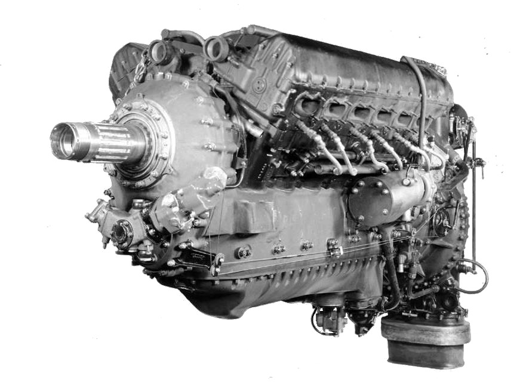
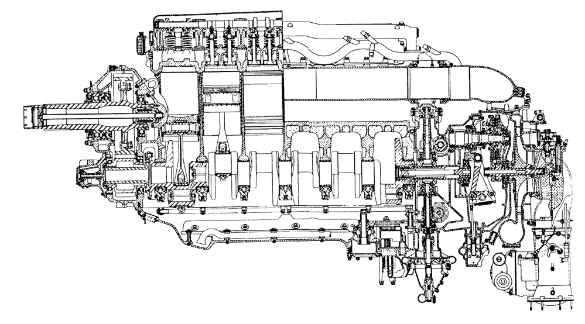
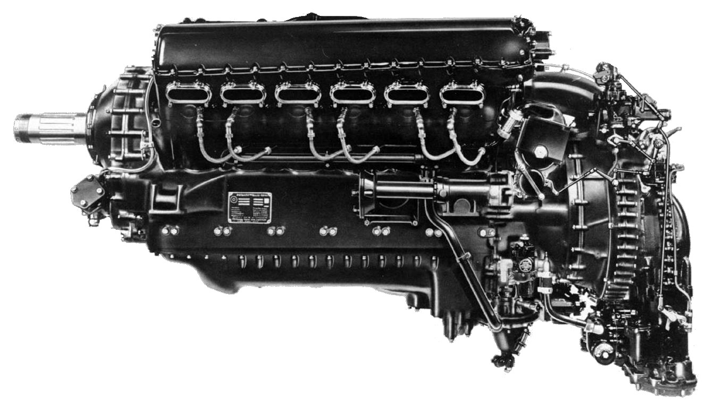

Engine Ratings:

Operating Condition | Blower | RPM | MP | HP | Critical Altitude With Ram | Critical Altitude No Ram | Mixture Control Position |  Fuel Flow (Gal/Hr/Eng.) U.S. | Maximum Duration (Minutes)
-|-|-|-|-|-|-|-|-|-
Take-Off | Low | 3000 | 61 | 1400 | S.L. | S.L. | Run/AR | 150 | 5
War Emergency | Low | 3000 | 67 | 1595 | 17,000 | 11,700 | Run/AR | 166 | 5
War Emergency | High | 3000 | 67 | 1295 | 28,800 | 23,200 | Run/AR | 160 | 5
Military | Low | 3000 | 61 | 1450 | 19,800 | 13,700 | Run/AR | 158 | 15
Military | High | 3000 | 61 | 1190 | 31,200 | 25,600 | Run/AR | 144 | 15
Maximum Continuous | Low | 2700 | 46 | 1120 |20,500 | 17,500 | Run/AR | 111 | Cont.
Maximum Continuous | High | 2700 | 46 | 940 | 34,400 | 29,500 | Run/AR | 106 | Cont.
Maximum Cruise | Low | 2400 | 36 | 790 | 19,500 | 17,000 | Run/AL | 70 | Cont.
Maximum Cruise | High | 2400 | 35 | 640 | 30,200 | 28,200 | Run/AL | 70 | Cont.

### Supercharger

The supercharger installed on the Packard Merlin engine includes two compressor stages that deliver air from the carburetor intake to the pistons under much greater pressure than would be possible through direct aspiration, allowing a greater fuel-air mixture to be burned and increasing power output.

The supercharger works in either low or high blower mode, selection of which can be automatic or manually set by the pilot. In normal operations, high blower mode starts automatically from 14,500 to 19,500 feet, depending on the amount of ram air being delivered through the carburetor. The supercharger increases the blower-to-engine compression ratio from a low of 5.8 to 1 to a high of 7.35 to 1.

The supercharger can be controlled manually by a switch on the instrument panel. The switch has three positions – AUTOMATIC, LOW, and HIGH.

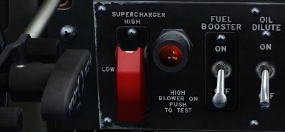

For normal operations, the supercharger switch should be kept in the AUTOMATIC position. In this position, the supercharger is controlled by an aneroid-type pressure switch, which automatically cuts the unit into high or low blower as required. This switch is adjusted to cut the unit back into low blower mode approximately 1,500 feet under the altitude at which it cuts into high blower. This prevents the high blower from going on and off repeatedly with slight changes in altitude near the level at which the high blower cuts in. If the aneroid switch fails, the supercharger automatically returns to low blower.
The LOW position on the switch on the instrument panel makes it possible to operate the supercharger in low blower mode at high altitudes. This provides better range at high altitudes, which can be used for long-range flights.
The HIGH position on the switch makes it possible to test the high blower mode on the ground. The switch must be held in the HIGH position by hand, however, because it is springloaded and returns to the LOW position when released.
An indicator light next to the switch on the instrument panel turns on when the supercharger is in high blower. The light can be pressed to test its functionality.

### Carburetor

The carburetor provides automatic control of the fuel-air mixture passed from the air intake to the supercharger and onto the engine manifold for combustion in the cylinders.

The Packard Merlin engine has an injection-type carburetor and an automatic manifold pressure regulator. The manifold pressure regulator is effective only at pressures in excess of 41 in. The automatic pressure regulator alleviates the pilot from having to jockey the throttle to maintain a constant manifold pressure in the high-speed range during a climb or descent. The pilot is only required to set the desired pressure by setting the throttle lever and the pressure regulator does the rest. It compensates automatically for the difference in air density at different altitudes by gradually
opening the carburetor butterfly valve in a climb or smoothly closing it in a descent.

Carburetor air comes through a long carburetor air scoop directly under the engine. The aircraft’s motion forces air at high speed (or rams it) directly into the carburetor. This is termed ram air.

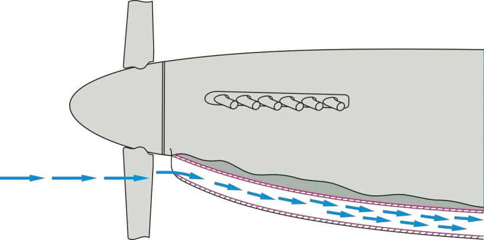

If the scoop becomes obstructed by ice or other foreign matter, a door in the air duct opens automatically to admit hot air from the engine compartment to the carburetor.

During normal operations, ram air is always used, but in the event of extreme icing or dust conditions, the carburetor air controls on the left cockpit pedestal allow the pilot to select either unrammed filtered or, in later model aircraft, unrammed hot air for operation. In order to obtain hot air, the Hot Air control handle must be set to HOT and the Cold Air control handle set to UNRAMMED FILTERED AIR. If the Cold Air control handle is set to RAM AIR, the hot air control will be ineffective.

Hot air should not be used above 12,000 feet. At high altitudes its use affects the carburetor’s altitude compensation and may result in an overly lean fuel mixture.

### War Emergency Power

In order to provide an extra boost to the engine in extreme situations, the throttle can be moved past the gate stop by the quadrant to break the safety wire. The engine will then be opened up to its absolute limit and will give approximately 6 in. of additional manifold pressure in excess of the normal full throttle setting of 61 in. (with mixture control set to RUN or AUTO RICH and prop set for 3000 RPM.) This throttle reserve is called War Emergency Power (WEP) and should be used only in extreme situations. If used for more than 5 minutes at a time, vital parts of the engine may be damaged.

WEP provides no benefit at altitudes below 5,000 feet. The throttle alone provides more than enough power to exceed the operating limits of the engine at these altitudes.

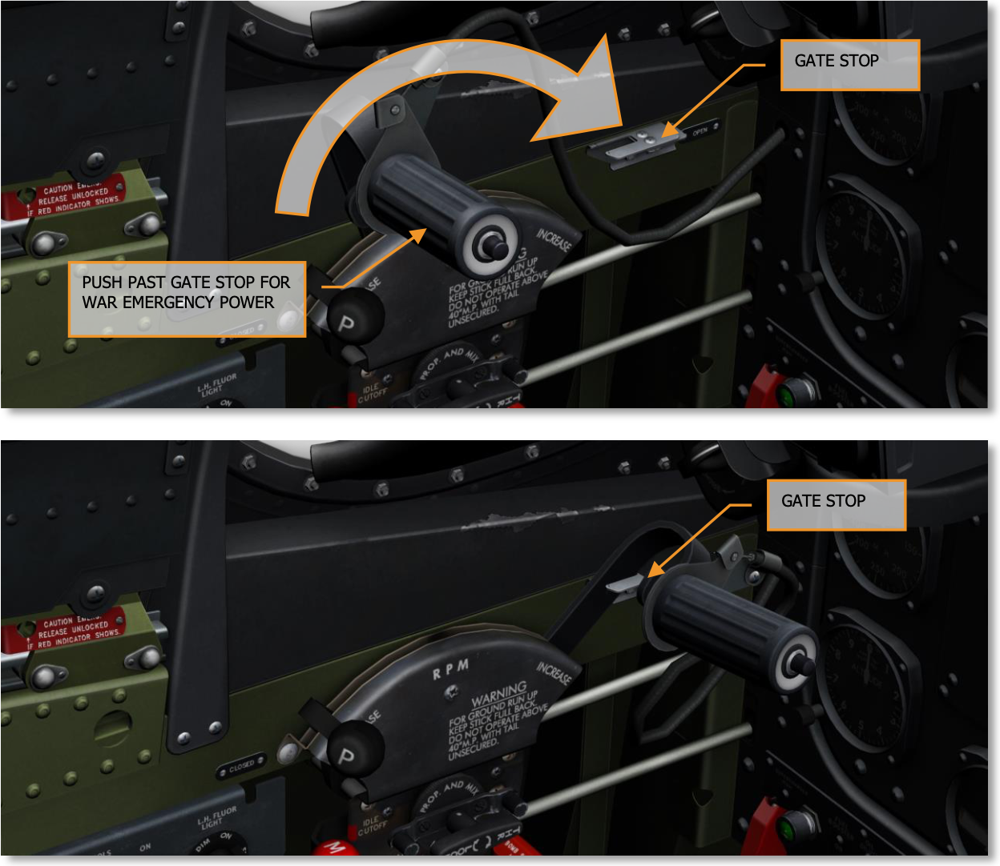

## Propeller

The P-51D propeller is a Hamilton Standard four-blade, hydraulic, constant-speed propeller with a diameter of 11 ft, 2 in and a blade pitch range of 42°, set to 23° at low pitch and 65° at high pitch. The propeller RPM is controlled by the Propeller Control lever on the throttle quadrant in the cockpit. The propeller governor automatically controls propeller pitch to maintain a constant speed between 1800 and 3000 RPM, depending on the Propeller Control setting. The propeller cannot be feathered.

## Fuel System

The Mustang features two main fuel tanks, one in each wing. The main tanks have a capacity of 92 gallons in each or a total of 184 gallons. An auxiliary 85 gallon tank is installed in the fuselage aft of the cockpit. There is also provision for carrying two droppable combat tanks on the wing bomb racks. These are available in 75-gallon and 110-gallon capacities. The total fuel capacity of the aircraft, including two 110-gallon droppable tanks, is 489 U.S. gallons.

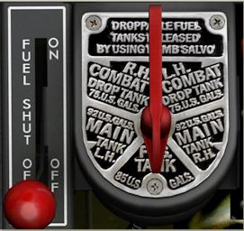

The fuel tanks are self-sealing and so are the fuel lines. The auxiliary drop tanks are not self-sealing. Fuel is forced to the carburetor by an engine-driven pump at a normal operating pressure of 16-19 PSI. In addition, there is an electrically powered booster pump in each internal tank. The booster pumps prevent vapor lock at high altitudes, assure sufficient fuel supply under all flight conditions and, in case of engine-driven pump failure, provide enough fuel to the carburetor for normal engine operation. The droppable tanks do not have a booster pump. However, a constant and controlled pressure of 5 lbs./sq.in. is maintained within the combat tanks by pressure obtained from a vacuum pump. This is in addition to the pressure obtained from the main engine fuel pump.

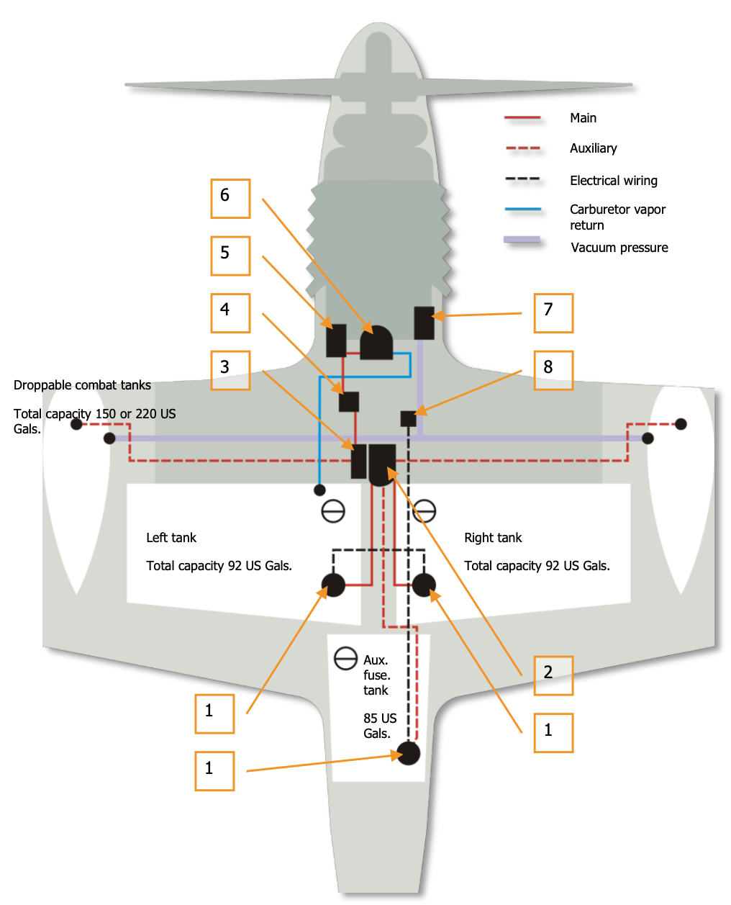

1. Booster Pump
2. Fuel Selector Valve
3. Fuel Shut-Off Valve
4. Fuel Strainer
5. Engine-Driven Pump
6. Carburetor
7. Vacuum Pump
8. Booster Pump Switch

The tanks are not interconnected and it is necessary to switch from one tank to the other to maintain balance. The three booster pumps are controlled by a single switch on the front switch panel. Selection between the tanks is performed by turning the booster pump switch to ON, then turning the fuel selector valve to the desired tank.

Fuel capacity is monitored using the Fuel Gauges for the main and fuselage tanks. No gauges for drop tanks are available.

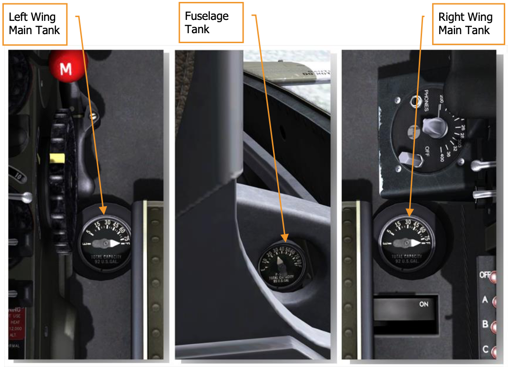

The carburetor is of the fuel injection type with a separate idle cut-off device and is equipped with a vapor return line that extends to the left fuel tank. The vapor vent line may become a fuel return line if the needle valve in the vapor eliminator sticks in the open position. The left fuel tank should always be used first to ensure availability of space for any returning fuel.

!!! warning

    When changing tanks, don't stop the selector valve at an empty tank position, or at a droppable tank position if no droppable tanks are equipped. Starving the engine of fuel will result in engine failure. In such a case, perform the following steps immediately:

    1. Turn the fuel selector to a loaded tank;
    2. Make sure that the booster pump switch is ON;
    3. As the engine takes hold, adjust the throttle setting as required.

## Hydraulic System

The P-51D is equipped with two separate hydraulic systems. One is the main power system for the operation of the landing gear and wing flaps. The other system is the foot pedal-operated brake system. The only connection between the two systems is that they receive their supply of fluid from the same reservoir in which a 3 cubic in. capacity cup is arranged so that in the event all the hydraulic fluid from the main power system might be lost, the brakes may still be operated.

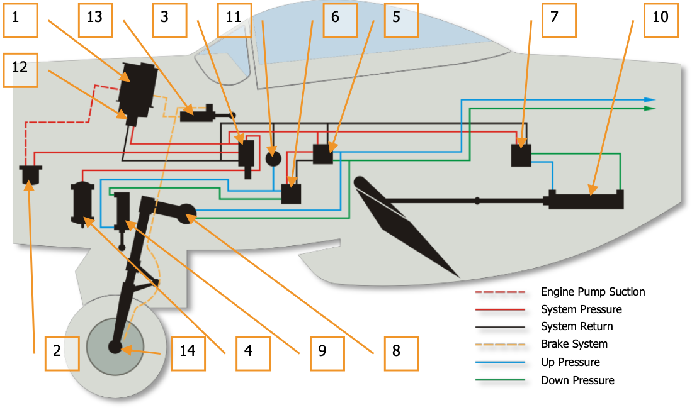

1. Reservoir
2. Engine-driven Pump
3. Unloading and Relief Valve
4. Pressure Accumulator
5. Landing Gear Control Valve
6. Fairing Door Control Valve
7. Wing Flap Control Valve
8. Landing Gear Operating Strut
9. Fairing Door Operating Strut
10. Wing Flap Operating Strut
11. Emergency Release Valve
12. Check Valves
13. Master Brake Cylinders
14. Disc-type Brake

In the main power system, a pump is permanently geared to the engine and maintains a pressure of 800-1100 lbs/sq.in. As long as the engine is running, the engine unloading valve loads the hydraulic system when hydraulic pressure drops to 800-850 lbs. It unloads the system when hydraulic pressure reaches 1050-1100 lbs. In the event of hydraulic pump failure, no provision is made for emergency operation of the wing flaps.

Incorporated into the hydraulic system on all P-51 model aircraft is a Landing Gear Fairing Door Emergency Release handle. The purpose of this handle when pulled out is to release or bypass hydraulic pressure from the fairing door cylinders and lines back directly to the reservoir. After the knob has been pulled out and has served its purpose, pushing it back in will once again restore normal operation of the hydraulic system. Therefore, if emergency landing gear procedure has been followed, push the knob back to attempt normal operation of the flaps. If flaps fail to extend, no emergency procedure is available.

## Oil System

The oil system includes a tank just forward of the firewall and a radiator in the air scoop under the fuselage. The full capacity of the oil system is 21 U.S gallons. The tank is a hopper type - that is, it is designed with hoppers or compartments which facilitate quick warm-up and also make it possible to fly the aircraft in adverse attitudes or with little oil in the system.

With this tank, the P-51 can be flown in any attitude when the tank is full. The aircraft can also be put into a vertical climb or dive when the tank is only 1/4 full and it will continue to provide proper lubrication. However, when the aircraft is in inverted flight, the oil pressure falls off, because no oil reaches the scavenger pump. For this reason, inverted flight must be limited to 10 seconds.

An outlet door on the bottom of the air scoop controls the oil temperature. Under ordinary conditions this door is operated automatically. However, it can be operated manually when running the engine on the ground or in case the automatic regulator fails in the air. This can be done by means of the Oil Radiator Air Control switch, located on the Radiator Air Control panel on the left side of the cockpit. The switch has three positions: AUTOMATIC, OPEN, and CLOSE. The door can be set in any position by holding the toggle switch in the OPEN or CLOSE position for the necessary length of time (approximately 20 seconds), then returning the switch to neutral.

The oil system uses standard Air Force oil dilution equipment. This allows the oil to be thinned with gasoline to make the engine easier to start in ambient temperatures below 40°F. Thinning the oil requires allowing the engine to idle with the coolant flap open until the oil temperature drops to 50°C or less. Then, before stopping the engine, oil is diluted using the Dilution switch on the Engine Control panel of the front dash. This will dilute the oil until the engine is ready to be started again. Once the engine warms up, the gasoline in the oil is quickly evaporated.

If the engine temperature is high, the engine should be stopped to allow it to cool to an oil temperature of about 40°C. Then the engine can be started again. The oil should be diluted immediately as explained above.

Two minutes of oil dilution is sufficient for any ambient temperature down to 10°F. When starting in temperatures lower than 10°F, heating the engine and oil may be necessary. Dilution duration will vary in such cases depending on local conditions.

Specifications for the oil system include:

— | Temperature [°C] | Pressure [lbs/sq.in.]
-|-|-
Minimum | 40 | 60
Desired | 70 - 80 | 70 - 80
Maximum | 90 | 90

## Coolant System

With the radiators located in the big air scoop aft of the cockpit under the fuselage, the cooling of the P-51 engine is quite different from that of most other fighters of the era. The engine is cooled by liquid in two separate cooling systems. The first system cools the engine proper, the second (called the after-cooling system) cools the supercharger fuel-air mixture. Each performs a separate function and the systems are not connected in any way. They both pass through a single large radiator, but in different compartments.

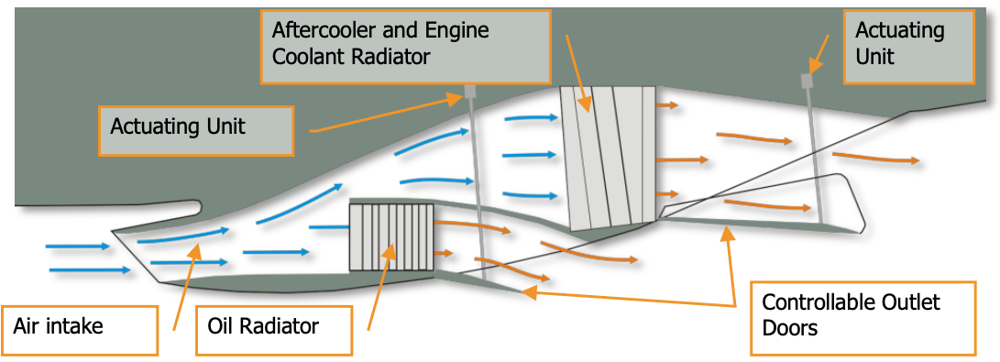

The engine coolant system is a high-pressure system (30 PSI) and its capacity is 16 1/2 U.S. gallons. Operating pressure of the after-cooling system is lower (20 PSI) and its capacity is 5 U.S. gallons.

The coolant used is a mixture of ethylene glycol and water, treated with a corrosion preventative. There are two types - Type D for normal use, which consists of 30% glycol and 70% water, and Type C for winter use (below 10°F), which consists of 70% glycol and 30% water.

An air outlet door at the rear of the air scoop controls the temperature of the coolant. This door operates similarly to that of the oil cooler. Normally, it works automatically, but can be controlled manually by means of the Coolant Radiator Air Control switch on the Radiator Air Control panel on the left side of the cockpit.

Specifications for the coolant system include:

— | Temperature [°C]
-|-
Minimum | 60
Desired | 100 – 110
Maximum | 121

## Electrical System

The electrical system is a 24-volt, direct-current (DC) system which provides power for operating the various aircraft systems, controls, and lighting equipment. The system employs the aircraft's metallic structure as a common ground return.

The electrical system runs off the battery until the engine reaches 1500-1700 RPM, when the generator is cut in by the voltage regulator. The battery charge and power for the electrical system is then supplied by the generator. An external battery receptacle is mounted on the right side of the fuselage at the trailing edge flap.

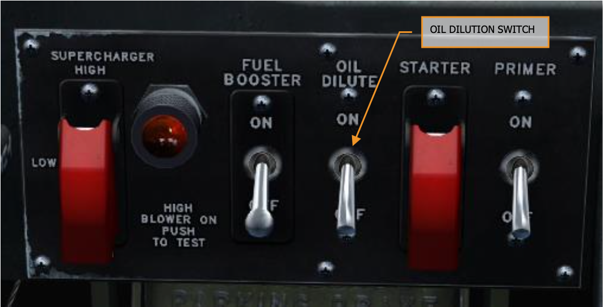

To prevent any damage to the electrical system from overload, circuit breakers are used. These eliminate the use of fuses and allow for the possibility of replacing broken circuits in mid-flight.

The circuit breaker reset buttons are on the Electrical Control panel. All of the buttons can be reset at once by means of a vertical "bump" plate that covers all of the switches. The ammeter gauge is also located on the Electrical Control panel. The ammeter indicates how much current is flowing from the generator and also shows whether or not the generator has cut in at 1500-1700 RPM as it should.

The battery is just behind the pilot's armor plate in the radio compartment. The battery and generator disconnect switches are located on the Electrical Control panel. The generator switch should be left on at all times when the engine is running. The maximum normal charging rate of the generator is 100 amperes.

!!! warning
    The ammeter should be checked prior to takeoff. Takeoff should not be attempted if the generator is charging over 50 amperes.

The electrical system controls the emergency fuel pumps, remote compass, pitot heater, gun heaters, gunsight, radios, carburetor air temperature gauge, coolant temperature gauge, bomb release, warning lights, circuit breakers, oil dilution system, and IFF destructor controls. The lights controlled by the electrical system include cockpit lights, the landing light in the left wheel well, recognition lights installed on the underside of the right wing, and standard navigation lights on the wingtips and rudder.

Except for the booster coil, which is used only in starting, the ignition system is completely independent of the electrical system and will continue to function normally in case of electrical system failure. Ignition power is supplied by the magnetos, the switch for which is on the front switch panel. The P-51D starter can easily overheat due to the large loads. The starter should not be used for more than four 20-second attempts to start, with 15-second intervals, followed by a 5- minute cooling period.

## Oxygen System

The oxygen system of the P-51D is a low-pressure, demand-type system. A regulator automatically provides the correct amount of oxygen required at any altitude. Controls and gauges for the oxygen system are located in the right front section of the cockpit and include an automatic mixture regulator, a pressure gauge, and a blinker indicator which opens when the pilot inhales and closes when the pilot exhales.

The oxygen supply is carried in four tanks installed just aft of the fuselage fuel tank. Two D-2 and two F-2 tanks are supplied for a total capacity of 3000 cubic in. Normal full pressure of the system is 400 PSI.

!!! Oxygen is flammable! Take every precaution to keep oil, grease, and all such readily combustible materials well away from any oxygen equipment, including the breathing mask.

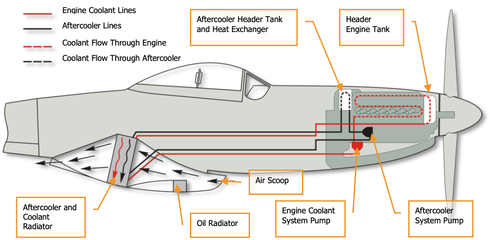

1. Low Pressure Oxygen Cylinder Type F2
2. Low Pressure Oxygen Cylinder Type D2
3. Filler Valve
4. Oxygen Regulator
5. Pressure Gauge
6. Blinker Flow Indicator
7. Oxygen Mask Tube

### Approximate Oxygen Supply

Oxygen consumption depends on many varying factors, so the following is only an approximate time of available supply. These times are based on a 400 PSI initial pressure in the system.

Altitude [ft] | Normal Oxygen | 100% Oxygen | Emergency
-|-|-|-
40,000 | 11.4 Hrs. | 11.4 Hrs. | 12.6 Min.
35,000 | 8.1 | 8.1 | 12.6
30,000 | 6.0 | 6.0 | 12.6
25,000 | 6.0 | 4.9 | 12.6
20,000 | 7.1 | 3.3 | 9.0
15,000 | 8.1 | 2.7 | 9.0
10,000 | 10.2 | 2.1 | 9.0

As an aircraft ascends to high altitudes where the temperature is normally quite low, the oxygen cylinders become chilled. As the cylinders become colder, the oxygen gauge pressure is reduced, sometimes rather rapidly. With a 100°F decrease in temperature in the cylinders, the gauge pressure can be expected to drop by 20%. This rapid fall in pressure is not a cause for alarm. All of the oxygen remain in place and as the aircraft descends to lower altitude, the pressure will tend to rise again. A rapid fall in oxygen pressure while the aircraft is in level flight or while it is descending, is not normal and should be considered an indication of a leakage or loss of oxygen.

Hypoxia (ill effects from oxygen starvation) may not begin immediately after normal air stops being supplied to the pilot. The onset of hypoxia effects may be delayed by as much as half an hour or more to just a few seconds, depending largely on altitude and other factors. The table below illustrates approximate Time of Useful Consciousness (TUC) after normal oxygen flow is stopped.

Altitude [ft] | TUC
-|-
15,000 | 30 min or more
18,000 | 20-30 minutes
22,000 | 5-10 minutes
25,000 | 3-5 minutes
28,000 | 2.5-3 minutes
30,000 | 1-3 minutes
35,000 | 30-60 seconds
40,000 | 15-20 seconds
45,000 | 9-15 seconds
50,000 | 6-9 seconds

## Environmental Systems

Warm air for heating the cockpit and for defrosting the windshield is conducted from a port in the dome aft of the coolant radiator through a flexible duct to a point behind the pilot's seat. The air then passes to the cockpit hot air outlet valve at the right side in front of the pilot's seat. From the defroster valve, warm air is conducted to a distributor fitting, to which windshield defroster tubes are attached. The two valves are of the gate type. A pointer attached to the valve handle indicates the position of the gate.

Air for cooling and venting the cockpit is diverted by a scoop above the forward part of the radiator scoop and conducted through a flexible tube to a valve behind the pilot's seat. Two smaller flexible tubes attached to the valve conduct the cool air to the outlets located behind and on each side of the pilot's seat just below the canopy line. The valve is controlled by a handle on the floor in front of the right side of the pilot's seat.

## Radio Equipment

The radio equipment of the P-51D consists of a SCR-522 VHF (Very High Frequency) radio for voice communication and radio homing, a Detrola LF (Low Frequency) radio receiver, an AN/APS-13 rear- warning radar, and an SCR-695A IFF (Identification Friend or Foe) radio.

All radio equipment is stored in the fuselage aft of the cockpit. Controls are grouped on the right side of the cockpit. Each set has a dedicated antenna arrangement: the VHF antenna mast extends vertically above the fuselage aft of the cockpit, the Detrola wire antenna runs from the back armor plate to the top of the fin, the AN/APS-13 antenna rods extend horizontally from the sides of the fin, and the IFF antennae project from the undersides of the wings.

1. AN/APS-13 Signal Light
2. Microphone Button
3. Detrola Radio Set
4. AN/APS-13 Control Panel
5. SCR-522-A Control Panel
6. AN/APS-13 Signal Bell
7. IFF Control Panel
8. SCR-522-A Dynamotor
9. Antenna Relay Box
10. SCR-522-A Radio Set
11. SCR-522-A Radio Mast
12. Detrola Antenna
13. AN/APS-13 Radio Set
14. AN/APS-13 Antenna

## Armor

Armor plating is provided at three points: back of the pilot’s seat, at the firewall in the opening between the engine and the fuselage, and behind the spinner, in front of the coolant tank. Further, protection is provided by the bulletproof glass windshield and the engine itself, which protects the pilot from head-on fire.

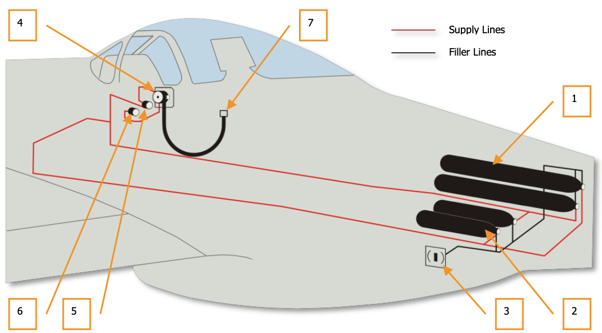

## Armament

The P-51D is equipped with six free-firing .50 caliber machine guns, three in each wing. The guns are manually charged on the ground and fire simultaneously when the Gun Trigger switch is pressed on the front of the control stick grip. The maximum ammunition capacity is 400 rounds for each of the inboard guns and 270 rounds for the center and outboard guns for a total ammunition load of 1880 rounds. The guns can be adjusted on the ground for different convergence points based on the tactical needs of the mission. Normally the convergence point is set to 250 - 300 yards. The amount of ammunition remaining is not indicated in the cockpit.

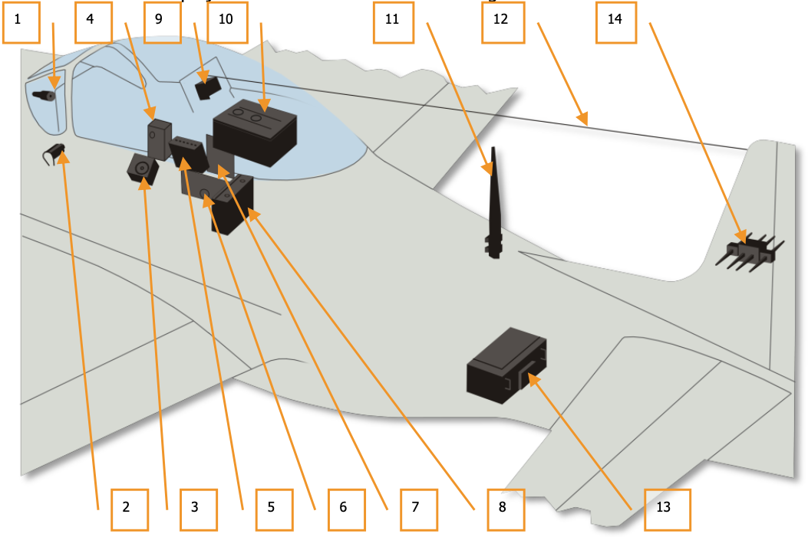

If the mission needs require longer firing time, it’s possible to remove the center gun in each wing. This allows each outboard gun to be loaded with 500 rounds.

A single removable bomb rack can be attached to each wing. These can be loaded with either 100, 250, or 500 pound bombs. If bombs are not installed, chemical smoke tanks or droppable fuel tanks may be hung on the bomb racks. Bombs are released by pressing the Bomb-Rocket Release switch on top of the control stick grip.

In addition to the machine guns and bombs, up to ten 5 in. rockets, five under each wing, can be equipped to perform ground attack missions. When bombs or droppable tanks are carried, only six rockets can be loaded, three on each wing. The rockets are fired by pressing the Bomb-Rocket Release switch on top of the control stick grip.

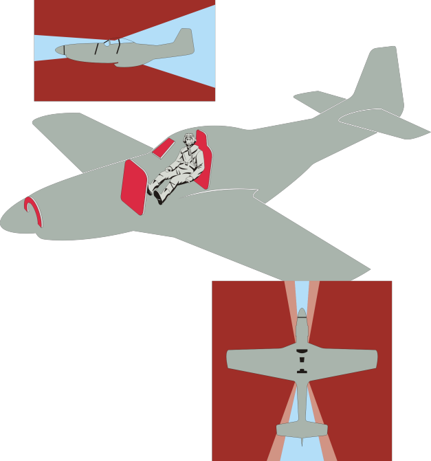

The aircraft is equipped with a K-14 gunsight, mounted on the instrument hood centerline. The sight includes both fixed and gyro-actuated optical systems, and computes the correct lead angle for targets at ranges from 200 to 800 yards. The K-14A sight features range lines on the fixed reticle, used for aiming rockets.

The P-51D is equipped with a gun camera, installed on the leading edge of the left wing.
