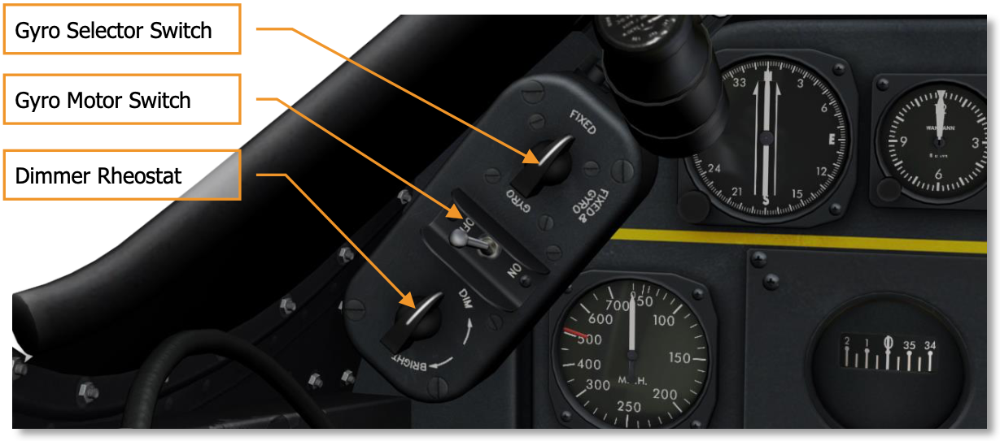
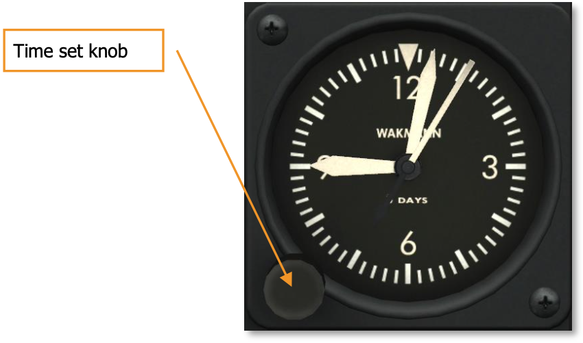
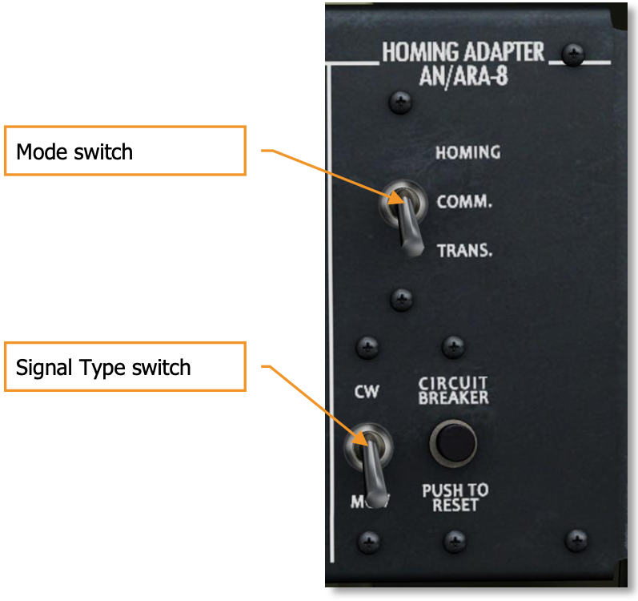

# Cockpit

The cockpit instruments and controls of the P-51D are grouped to provide the greatest possible efficiency in the limited space available. The cockpit can be both heated and ventilated. The pilot’s seat is designed to accommodate either a seat-type or a back-pack parachute. The back cushion is kapok-filled and can be used as a life preserver. The seat is adjustable vertically, but not forward-aft. A small, folding arm rest is provided on the left side of the cockpit for increased comfort during long flights. A standard safety belt and shoulder harness is provided. A lever on the left side of the seat allows the pilot to relax the harness tension to allow for leaning forward.

The cockpit is divided into three primary areas: the front dash, which includes the K-14 gunsight, the instrument panel, and the front switch panel, the right side with canopy controls, oxygen system controls, the Electrical Control panel, and radio systems controls, and the left side with engine, trim, and additional controls.

## Front Dash Legend

The front dash of the P-51D cockpit houses the K-14 gunsight along with its associated controls, the instrument panel, engine control panel, landing gear warning lights, front switch panel, fuel system valve switches, and a number of additional indicators and controls.

1. Clock
2. Radio Indicator Compass
3. Directional Gyro
4. Gunsight Selector-Dimmer Panel
5. Airspeed Indicator
6. Bank and Turn Indicator
7. Altimeter
8. Landing Gear Warning Lights
9. External Stores Control Switches
10. Engine Control Panel
11. Ignition Switch
12. Gun, Camera and Sight Switch
13. Fuel Shut-Off Valve
14. Fuel Selector Valve
15. Hydraulic Pressure Gauge
16. Suction Gauge
17. Manifold Pressure Gauge
18. Flight Indicator
19. Coolant Temperature
20. Carburetor Air Temperature
21. Tachometer
22. Rate of Climb Indicator
23. Oil Temperature, Fuel, and Oil Pressure Gauge
24. Accelerometer
25. Oxygen Pressure Gauge
26. Oxygen Flow Indicator
27. Cockpit Light Control
28. Parking Brake Handle
29. Horn Silence Button
30. Landing Gear Fairing Door Emergency Release Handle

## Left Side Legend

The left side of the cockpit includes the primary engine and mechanical systems controls, as well as the signal flare pistol mount and bomb salvo release handles.

1. Flare Pistol Mount
2. Coolant Radiator Air Control Switch
3. Oil Radiator Air Control Switch
4. Landing Light Switch
5. Left Fluorescent Light Switch
6. Mixture Control
7. Propeller Control
8. Throttle handle with Microphone Button
9. Throttle Quadrant Locks
10. Flap Control Handle
11. Carburetor Air Control
12. Rudder Trim Tab Control
13. Aileron Trim Tab Control
14. Elevator Trim Tab Control
15. Landing Gear Control
16. Bomb Salvo Release

## Right Side Legend

The right side of the cockpit includes the oxygen regulator, canopy controls, the electrical control panel with electrical system controls, and radio systems controls.

1. Oxygen Regulator
2. Emergency Canopy Release
3. Canopy Handcrank
4. Recognition Lights Keying Switch
5. Circuit Breakers (under) Bump Plate
6. Right Fluorescent Light Switch
7. Electrical Control Panel
8. Rear Warning Radar Control Panel 9. Detrola Control Box
10. VHF Control Box
11. IFF Control Panel
12. Homing Adapter Control Panel

## Front Dash Indicators and Controls

This section will overview in detail all of the indicators and controls located on the front dash.

### K-14 Gunsight

The P-51D is equipped with the K-14 gunsight, mounted on the instrument hood centerline. This sight contains both fixed and gyro-actuated optical systems, and computes the correct lead angle for targets at ranges of 200 – 800 yards.

The fixed optical sight system projects on the reflector glass a cross, surrounded by a 70-mil ring which can be blanked out by pulling down the masking lever on the left side of the sight. The fixed sight is used to engage ground targets and as a secondary sight against airborne targets. The gyro sight projects a variable-diameter circle of six diamond-shaped pips surrounding a central dot. The gyro sight is the primary sight used to engage airborne targets.

The reticle type and their brilliance are set on the Selector-Dimmer panel located under the left side of the instrument hood. This panel also contains a two-position toggle switch controlling the gyro mechanism. This switch should remain ON at all times.
The sight is adjusted for the size of the target by means of the wingspan scale on the front of the sight. Then range is set into the computing mechanism by rotating the throttle grip until the diameter of the gyro image coincides with the span of the target in view. Targets must be tracked for at least one second before the sight will compute effectively.

### Gunsight Selector-Dimmer Panel

The K-14 gunsight Selector-Dimmer panel is located below the left instrument shroud and is used to turn the sight on and off, set the sight mode, and adjust the sight brightness.

**GYRO SELECTOR SWITCH.** The sight gyro is controlled by the Gyro Selector switch with FIXED, FIXED & GYRO, and GYRO positions. The three positions allow the sight to be used as a fixed sight, combined fixed and compensating sight, or compensating sight only.

**GYRO MOTOR SWITCH.** Used to turn the gyro motor on and off by setting to ON or OFF positions.

**SIGHT DIMMER RHEOSTAT.** Used to adjust the sight brightness between DIM and BRIGHT
settings.

!!! warning
    During landing, the Gyro Selector switch should be set to FIXED to prevent damage to the gyro.

### Instrument Panel

Most of the primary instruments are mounted on the instrument panel, flight instruments being grouped together to the left, engine instruments to the right. Exceptions are the Hydraulic Pressure Gauge, which is below the Front Switch Panel; the Fuel Gauges, located on the floor and aft of the cockpit, and the Ammeter on the Electrical Switch and Circuit Breaker Panel.

The instruments can be classified into four general groups: Vacuum System Instruments, Pitot Static System Instruments, Engine Instruments, and Miscellaneous Instruments.

### Vacuum System Instruments

Vacuum system instruments are operated by a vacuum pump driven by the engine and include the Flight Indicator, Bank and Turn Indicator, Directional Gyro, and Suction Gauge.

#### Flight Indicator

The AN5736 Flight Indicator (Gyro Horizon Indicator) indicates a miniature plane and a gyro-actuated horizon bar. This instrument is used during instrument flying to indicate the longitudinal and lateral attitude of the aircraft. The horizon bar will indicate pitch up to 60° and bank up to 100°. The top needle of the instrument indicates the angle of bank on the bank scale, graduated from 0° to 90° and scaled to 30°. The cage knob is used to cage the instrument. To operate the cage knob, left-click on it to pull the knob out and roll the mouse wheel to turn it clockwise to the caged position. To uncage the instrument, roll the mouse wheel over the knob to turn it counter-clockwise. The horizon knob is used to adjust the horizon level. To operate the horizon knob, place the mouse over the knob and roll the mouse wheel to set the horizon higher or lower.

#### Bank and Turn Indicator

The AN5820 bank-and-turn indicator is composed of a gyroscope-type turn indicator and a ball-type bank (slip) indicator. The bank indicator is a liquid-filled curved tube in which a free-rolling inclinometer ball changes position according to the direction of the force of gravity and centrifugal force. The bank indicator is used to minimize side-slip by keeping the ball centered between the center reference lines while turning. This instrument has no caging knob.

#### Directional Gyro

The AN5735 Directional Gyro Indicator is used to supplement the magnetic compass in maintaining the aircraft on a straight course. The indicator is nonmagnetic. Relative movement of the aircraft from right to left shows on the circular card which is graduated in degrees the same as a compass card. This instrument is provided with a caging knob. The Gyro Indicator is uncaged for normal operation. The instrument can be caged to manually rotate the heading card. To cage the instrument, click on the caging knob to push it in and rotate the mouse wheel to adjust the heading.

#### Suction Gauge

The AN5771-5 vacuum system suction indicates whether the vacuum pump is providing proper vacuum for the system. The instrument is graduated from 0 to 10 and indicates pressure in inches of mercury (inHg). If the gauge reads less than 3.75 or more than 4.25, the pressure is abnormal and vacuum instrument readings are not reliable. Normal suction reading is 4.00 inHg.

### Pitot Static System Instruments

Pitot Static System Instruments are operated by pressure or static air from the pitot tube, which is located under the right wing and from the static plates on the fuselage skin. They include the Airspeed Indicator, Altimeter, and Rate of Climb Indicator.

#### Airspeed Indicator

The Type F-2 Airspeed Indicator is a sensitive differential pressure gauge that measures the difference between pitot tube impact air pressure and static air pressure. The indicator displays Indicated Airspeed (IAS) and is graduated from 0 to 700 mph. The scale is to 10 mph from 50 to 300 mph and to 50 mph thereafter. The red line indicates the maximum permissible IAS of 505 mph at an altitude of 5,000 ft and less.

!!! warning
    Red line IAS lowers as altitude increases above 5,000 ft. Always anticipate a lower maximum permissible IAS as altitude increases above 5,000 ft!

#### Altimeter

The AN5760-2 altimeter determines the altitude at which the aircraft is flying by measuring atmospheric pressure. The instrument consists of 3 needles; the shortest needle indicates altitude in tens of thousands of feet, the medium needle indicates altitude in thousands of feet, and the long needle indicates altitude in hundreds of feet. For example, the image below indicates 29,500 ft.

The instrument includes a Kollsman window on the right side of the face to indicate the sea level reference pressure in inches of mercury (inHg). The reference pressure can be adjusted by turning the reference pressure knob.

#### Rate of Climb Indicator

The AN5825 Rate of Climb Indicator shows the rate of ascent or descent of the aircraft. The instrument is graduated from 0 to 6,000 ft. in both positive and negative directions and indicates vertical speed in feet per minute. The face is scaled to 100 ft between 0 and 1,000 ft, and to 500 ft thereafter. The Rate of Climb Indicator is used to maintain a constant altitude when turning and to establish a definite and constant rate of climb or descent when flying on instruments.

### Engine Instruments

The engine instruments include the Manifold Pressure Indicator, Tachometer, Carburetor Air Temperature Indicator, Coolant Temperature Indicator, and the Engine Gauge.

#### Manifold Pressure Indicator

The Manifold Pressure Indicator is used to set the desired engine power setting by adjusting the throttle. As the throttle handle is moved forward, a throttle butterfly opens and allows more air to flow through the carburetor to be compressed by the supercharger and delivered to the manifold for combustion in the cylinders.

The Type D-10 Manifold Pressure Indicator is a vaporproof, absolute-pressure instrument. The gauge measures pressure in inches of mercury (inHg) and is graduated from 10 to 75 inHg. The face is scaled to 1 inHg. The green range indicates the normal operating range of 26-36 inHg. The red line indicates full military power of 61 inHg. When running in War Emergency Power, the manifold pressure can be increased to a maximum of 67 inHg.

#### Tachometer

The Tachometer provides remote indication of engine speed. The instrument is graduated from 0 to 4500 and indicates engine speed as Revolutions Per Minute (RPM) in hundreds of RPM. The face is scaled to 100 RPM throughout. The green range indicates normal operating RPM of 1600 - 2400. The red line indicates maximum normal RPM of 3000.

#### Carburetor Air Temperature Indicator

The AN5790-6 Carburetor Air Temperature Indicator shows the temperature of the air running through the carburetor air scoop. The gauge indicates temperature in degrees Celsius (°C) and is graduated from - 70° to 150°C. The face is scaled to 10°C. The green range indicates normal operating temperature of 10° - 30°C. The red line indicates maximum temperature of 40°C.

#### Coolant Temperature Indicator

The Coolant Temperature Indicator shows the temperature of the coolant fluid. The gauge indicates temperature in degrees Celsius (°C) and is graduated from - 70° to 150°C. The face is scaled to 10°C. The green range indicates normal operating temperature of 100° - 110°C. The red line indicates maximum coolant temperature of 121°C.

#### Engine Gauge

The engine gauge consists of three instruments in one – showing oil temperature, oil pressure, and fuel pressure.

**OIL TEMPERATURE GAUGE.** The Oil Temperature Gauge dominates the top half of the Engine Gauge. The gauge is graduated from 0 to 100 and indicates oil temperature in degrees Celsius (°C). The gauge is scaled to 5°. The green range indicates normal operating temperature of 70° - 80°C. The red line indicates maximum oil temperature of 90°C.

**OIL PRESSURE GAUGE.** The Oil Pressure Gauge is located on the lower left side of the Engine Gauge. The gauge indicates oil pressure in pounds per square inch (PSI) and is graduated from 0 to 200 PSI. The gauge is scaled to 10 PSI throughout. The green range indicates normal operating pressure of 70-80 PSI. The red lines indicate a minimum permissible pressure of 50 PSI and a maximum permissible pressure of 90 PSI.

**FUEL PRESSURE GAUGE.** The Fuel Pressure Gauge is located on the bottom right side of the Engine Gauge. The gauge indicates fuel pressure in pounds per square inch (PSI) and is graduated from 0 to 25 PSI. The gauge is scaled to 1 PSI. The green range indicates normal operating pressure of 12 - 16 PSI. The red lines indicate a minimum permissible pressure of 12 PSI and a maximum permissible pressure of 19 PSI.

### Miscellaneous Instruments

Miscellaneous instruments include the Remote Indicator Compass, Clock, Oxygen Flow Indicator, Oxygen Pressure Gauge, Hydraulic Pressure Gauge, Fuel Gauges, Ammeter, and Accelerometer.

#### Remote Indicator Compass

The Remote Indicator Compass on the P-51D replaces the conventional magnetic compass of previous aircraft, although some models also include a conventional standby magnetic compass as a backup. The remote compass unit is installed in the left wing and transmits its readings electrically to the indicator on the instrument panel. This type of compass doesn’t float around and fluctuate when the aircraft is maneuvered. This provides all of the advantages of the directional gyro without the precessions. However, the directional gyro is provided as a backup should the electrical system fail.

The Remote Indicator Compass consists of a stationary compass rose, a current magnetic heading arrow, and a desired magnetic heading arrow. The knob of the instrument is used to adjust (turn) the desired magnetic heading arrow to a desired heading.

#### Clock

The clock is installed in the upper left section of the instrument panel. The winding knob is used to set the time. To operate the knob, pull the knob out with a left mouse button click and roll the mouse wheel to set the time, then return the knob into the pressed position with another click of the left mouse button.

#### Oxygen Flow Indicator

The Oxygen Flow Indicator is located immediately to the left of the Oxygen Pressure Gauge on the bottom right corner of the instrument panel. This indicator shows the flow of oxygen as it is inhaled and exhaled by the pilot. When the pilot inhales, the blinkers open as oxygen is moved through the system. As the pilot exhales and oxygen stops flowing, the blinkers close.

#### Oxygen Pressure Gauge

The Oxygen Pressure Gauge is located on the bottom right corner of the instrument panel and indicates pressure in the oxygen system. The gauge measures pressure in pounds per square inch (PSI). The instrument is graduated from 0 to 500 PSI and scaled to 50 PSI. Normal full pressure of the system is 400 PSI. Note, oxygen pressure readings can drop as altitude increases due to the cooling of the oxygen tanks. Conversely, the pressure can increase as altitude decreases due to the warming of the tanks. A rapid decrease of oxygen pressure in level flight or during a descent is abnormal and may indicate an oxygen system leak or malfunction.

#### Hydraulic Pressure Gauge

The Hydraulic Pressure Gauge is located on the bottom of the front dash, above the Parking Brake handle. This instrument indicates fluid pressure in the hydraulic system, measured in pounds per square inch (PSI). The instrument is graduated from 0 to 2,000 PSI and scaled to 200 PSI throughout. Normal pressure for the hydraulic system is 1,050 (+/- 50) PSI.

#### Fuel Gauges

A fuel gauge is connected to each main tank and the fuselage tank. The fuel gauges for the main (wing) tanks are located on the cockpit floor on either side of the seat. The fuel gauge for the fuselage tank is located behind the seat on the pilot's left side.

#### Accelerometer

The AN-5745 accelerometer indicates the load factor (G forces) acting on the airframe. The gauge is graduated from -5 to 12G and is scaled to 1G throughout. The instrument includes three needles to indicate current G, and maximum and minimum G readings recorded since the last reset. The Reset knob is used to reset the maximum and minimum needles. To operate the Reset knob, perform a left mouse button click over it. Two red lines indicate maximum permissible loads of -4G and +8G.

### Engine Control Panel

The Engine Control Panel is located at the bottom left of the front dash and includes a number of switches to control engine systems.

1. **SUPERCHARGER BLOWER SWITCH.** The Supercharger Blower switch has three positions: AUTO, LOW, and HIGH.

    * **AUTO.** In AUTO mode, the supercharger operates automatically, switching from Low to High blower at an altitude of 14,500 to 19,500 feet, depending on the amount of ram air. The supercharger switches from High to Low blower at an altitude approximately 1,500 feet below that at which High blower engages to prevent repeated activation of High and Low blower modes at borderline altitudes. AUTO mode is the normal setting for the supercharger.

    * **LOW.** Setting the switch to LOW sets the supercharger to Low blower mode manually. Operating the supercharger in Low blower mode may be desirable for maximum fuel efficiency when conducting long-range flights.

    * **HIGH.** Setting the switch to HIGH sets the supercharger to High blower mode manually. The switch must be held in the High position to maintain High blower mode. Releasing the switch will revert the supercharger to Low blower mode.

    An amber jewel indicator light next to the switch turns on when the supercharger is in high blower. The indicator can be tested by pressing inward.

    For a more detailed description of the supercharger system, see the Supercharger section of the aircraft overview.

2. **FUEL BOOSTER SWITCH.** Setting the Fuel Booster switch to the ON (up) position provides electrical power to the booster pumps in the two main and one fuselage tanks. Each booster pump is engaged by selecting the corresponding tank using the Fuel Selector Valve at the bottom of the front dash.
  For a more detailed description of the fuel system, see the Fuel System section of the aircraft overview.

3. **OIL DILUTE SWITCH.** Setting the Oil Dilute switch to the ON (up) position thins the oil with gasoline, which may be necessary when starting the engine at temperatures of 40°F and lower.
  For a more detailed description of the oil system, see the Oil System section of the aircraft overview.

4. **STARTER SWITCH.** The Starter switch is used to start the engine. The switch is spring-loaded and needs to be held in the ON (up) position to execute a start.

    !!! warning
        Do not operate the starter for over 15 seconds continuously.

5. **PRIMER SWITCH.** The Primer switch is used to prime the engine with fuel. The switch is spring- loaded and needs to be held in the ON (up) position to execute a prime. When the primer switch is held ON, fuel passes to the primer lines and into the induction manifold. Usually 3 or 4 seconds are sufficient to prime a cold engine. One second is usually sufficient for a warm engine. The engine should be primed only when it is turning over.

### Front Switch Panel

The front switch panel includes a number of weapons control switches, as well as the Ignition Selector switch, Cockpit Lights switch, and the Horn Silence button.

1. **IGNITION SELECTOR SWITCH.** The Ignition Selector switch controls the magnetos used to supply power to the engine ignition system and has four possible positions: OFF, R (right), L (left), and BOTH.

    * **OFF.** The magnetos are turned off.

    * **R.** The right magneto is used to start the engine.

    * **L.** The left magneto is used to start the engine.

    * **BOTH.** Both magnetos are used to start the engine. Normally both magnetos are used to start the engine.

2. **BOMB-ROCKET SELECTOR SWITCH.** The Bomb-Rocket Selector switch controls the selection of external weapons for fire and has four possible positions: SAFE, ROCKETS, BOMBS BOTH, and BOMBS TRAIN.

    * **SAFE.** When set to safe, external weapons are not released.

    * **ROCKETS.** When set to rockets, rockets are fired according to the release settings set on the Rocket Control Panel.

    * **BOMBS BOTH.** When set to BOMBS BOTH, both bombs or drop tanks are dropped simultaneously with a single press of the Bomb-Rocket Release button.

    * **BOMBS TRAIN.** When set to BOMBS TRAIN, the left bomb or drop tank is released with the first press of the Bomb-Rocket Release button and the right bomb or drop tank is released with the second press of the Bomb-Rocket Release button.

3. **BOMB ARMING SWITCHES.** The Bomb Arming switches control the arming of the left and right bombs, as well as initiate release of chemicals or smoke from the left and right external chemical tanks. The switches have three possible positions: OFF, ARM, and CHEM RELEASE.

    * **OFF.** Bombs are not armed. This position can be used to jettison bombs in unarmed state.

    * **ARM.** Bombs are armed for detonation. This position must not be set for chemical tanks.

    * **CHEM RELEASE.** When carrying external chemical or smoke tanks, setting the left or right switch to CHEM RELEASE will initiate chemical or smoke release from the selected canister. Once chemical or smoke release is confirmed visually, the switch can be returned to OFF. Chemical or smoke release will continue until the tank is depleted.

4. **COCKPIT LIGHTS SWITCH.** The cockpit lights switch controls the state and intensity of the two cockpit lights.

5. **GUN SAFETY SWITCH.** The gun safety switch controls the arming of the guns and operation of the gun camera. The switch has three possible positions: OFF, GUNS & CAMERA SIGHT, and CAMERA SIGHT.

    * **OFF.** The guns are not fired and the gun camera is not operated.

    * **GUNS & CAMERA SIGHT.** In this position, pressing the gun trigger all the way down will fire the guns and operate the gun camera simultaneously.

    * **CAMERA SIGHT.** In this position, pressing the gun trigger all the way down will operate the gun camera, but not fire the guns.

6. **ROCKET RELEASE CONTROL SWITCH.** The Rocket Release Control switch controls the rocket release mode and has three possible positions: OFF, SINGLE, and AUTO.

    * **OFF.** Rockets are not fired.

    * **SINGLE.** A single rocket is fired with each press of the Bomb-Rocket Release switch. The specific rocket to be fired can be set using the Rocket Counter Control knob.

    * **AUTO.** In Auto mode, rockets are fired in train (ripple) as long as the Bomb-Rocket Release switch is held down. All ten rockets are fired within approximately one second.

7. **ROCKET COUNTER.** The Rocket Counter window indicates the next rocket to be fired according to station number. The left wing stations include #1, 3, 5, 7, and 9. The right wing stations include #2, 4, 6, 8, and 10. Note, stations 7, 8, 9, and 10 are not installed when bombs are carried. The knob of the Rocket Control Counter panel is used to set the desired rocket station for fire. This should be set to 1 at the start of a mission.

8. **ROCKET DELAY SWITCH.** The Rocket Delay switch is used to set the fuse mode for rockets. When set to DELAY, the rocket detonates a moment after impact. When set to INST, detonation is instantaneous upon impact.

9. **HORN SILENCE BUTTON.** The Horn Silence button is used to silence the landing gear alert horn.

### Fuel Shutoff and Selector Valves

Fuel flow to the engine is controlled by the Fuel Shutoff Valve and the Fuel Selector Valve, both located at the bottom of the front dash, in front of the control stick.

**FUEL SHUTOFF VALVE.** The Fuel Shutoff Valve lever is mechanically linked to the fuel shutoff valve in the left wheel well. The fuel shutoff valve controls fuel flow from all tanks to the engine-driven pump. The valve can be set to either ON (open) or OFF (closed).

**FUEL SELECTOR VALVE.** The Fuel Selector Valve controls which tank is feeding fuel to the engine. Only one tank can be selected at a time. Possible settings include:

* **FUS. TANK** — Fuselage Tank

* **MAIN TANK L.H.** — Main Left Tank

* **MAIN TANK R.H.** — Main Right Tank

* **R.H. COMBAT DROP TANK** — Right Drop Tank

* **L.H. COMBAT DROP TANK** — Left Drop Tank

The fuel gauges for the two main (wing) tanks are located on the cockpit floor on either side of the pilot's seat. The fuel gauge for the fuselage tank is located aft of the seat, behind the pilot's left shoulder.

### Landing Gear Warning Lights

The Landing Gear Warning lights, located at the bottom of the instrument panel, are used to alert the pilot about the state of the landing gear system. The red Unsafe light will turn on and a horn alert will sound in the cockpit when the throttle is retarded below the minimum cruise condition while the landing gear doors are closed and the gear is up and locked, or at any throttle position if the landing gear doors are open and the gear is down and unlocked or up and locked.

The below chart illustrates the possible conditions of the Landing Gear Warning lights:

Throttle And Gear State | Safe/unsafe Light
-|-
Throttle: Retarded Doors: Closed Gear: Up and Locked Signal: Unsafe and buzzer | 
Throttle: Any position Doors: Open Gear: In transfer, unlocked Signal: Unsafe | 
Throttle: Any position Doors: Open Gear: Down and Locked Signal: Safe | 
Throttle: Advanced ahead more then 1/3 Doors: Closed Gear: Up and Locked Signal: None | 
 
### Parking Brake

The Parking Brake handle is located just to the right of the Landing Gear Warning Lights at the bottom center of the instrument panel.

To engage the parking brake, pull the parking brake handle out, depress the brake pedals, release the brake pedals, and then release the parking brake handle. To release the parking brake, simply depress the pedals.

!!! warning
    Never set the parking brake when the brakes are hot. The brake discs may freeze.

#### Landing Gear Fairing Door Emergency Release Handle

The Landing Gear Fairing Door Emergency Release Handle is located at the bottom of the instrument panel, adjacent to the Fuel Selector Valve and just above the Hydraulic Pressure Gauge. This handle can be used in case of hydraulic system failure to mechanically release the hydraulic pressure and fairing doors after the landing gear handle is placed in the DN (down) position. As the gear is lowered, yawing the aircraft may be required to ensure the gear locks in position. The release handle is also used after the aircraft is parked, to release the hydraulic pressure and open the fairing doors. Opening the fairing doors mechanically locks the Landing Gear handle in the down position.

## Left Side Controls

This section will describe in detail the controls located on the left side of the cockpit.

### Throttle Quadrant

The throttle quadrant includes the Throttle Control handle with the radio push-to-talk button, Propeller Control lever, Mixture Control lever, and friction locks.

**THROTTLE CONTROL HANDLE.** The Throttle Control handle is used to set the desired manifold pressure by opening and closing the throttle butterfly of the engine. A throttle stop assembly on the upper longeron allows full travel of the throttle control lever to obtain 67 inHg manifold pressure. However, a throttle gate on the longeron stops the lever at the 61 inHg manifold pressure position - the full military power setting. A safety wire is installed across the gate at this position and as the gate is passed to obtain War Emergency Power (up to 67 inHg manifold pressure), the wire will be broken, indicating that 61 inHg manifold pressure has been exceeded.

The throttle handle features a twist grip, which is used to adjust the range setting for the K-14
gunsight.

**RADIO PUSH-TO-TALK BUTTON.** The throttle handle includes the radio push-to-talk button, which activates the VHF transmitter when pressed.

**THROTTLE CONTROL HANDLE LOCK.** The Throttle Control handle lock is used to adjust the amount of friction on the Throttle Control handle.

**PROP. AND MIXTURE CONTROL LEVERS LOCK.** The Prop. and Mixture Control levers lock is used to adjust the friction of the Propeller Control lever and the Mixture Control lever.

**PROPELLER CONTROL LEVER.** The Propeller Control lever is used to set the propeller RPM. The propeller governor is designed to maintain 1800 RPM at the low setting and 3000 RPM at the high setting. The governor automatically adjusts the propeller pitch to maintain the set RPM. High RPM settings are used when maximum performance is desired, such as takeoff or combat, while lower RPM settings are used to maximize fuel economy and engine wear during less demanding flight stages. For standard MP and RPM settings, consult the engine ratings chart.

**MIXTURE CONTROL LEVER.** The Mixture Control lever is used to set the fuel/air mixture. On earlier aircraft, the lever has four possible positions: IDLE CUTOFF, AUTO LEAN, AUTO RICH, and FULL RICH. On later aircraft, the AUTO LEAN and AUTO RICH positions have been replaced by a single RUN position.

* **IDLE CUTOFF.** The IDLE CUTOFF position is used when starting and stopping the engine. This position should be set after the engine is stopped to ensure that no fuel is allowed to enter the carburetor while the engine is not running.

* **RUN. The RUN** position is the standard operating setting for the engine and is normally used for takeoff, climb, landing, and combat.

* **FULL RICH.** The FULL RICH position is an emergency setting to be used only in case of carburetor failure to ensure a sufficient fuel supply to the engine.

### Radiator Air Control Panel

The Radiator Air Control panel includes the Coolant Radiator Air Control switch, the Oil Radiator Air Control switch, the Landing Light switch, and the Left-hand Cockpit Fluorescent Light Rheostat.

1. **COOLANT RADIATOR AIR CONTROL SWITCH.** Airflow through the dual radiator is controlled by an electric actuator which is mechanically connected to the coolant flap in the rear of the air scoop. Operation of the actuator is controlled by the Coolant Radiator Air Control switch on the Radiator Air Control panel. The switch has four possible positions: AUTOMATIC, OPEN, CLOSE, and OFF.

    * **AUTOMATIC.** This is the standard position of the switch and should be set for all normal operations. The switch is held in this position by a spring-loaded guard. With the switch set to AUTOMATIC, the temperature of the coolant governs the amount the coolant flap will be opened or closed.

    * **OPEN.** The OPEN position of the switch is spring-loaded and must be held in this position manually in order to further open the coolant flap. Releasing the switch from the OPEN position will automatically set it to the OFF position. The OPEN position can be used for ground operations or if manual adjustment of the coolant flap is necessary in flight.

    * **CLOSE.** The CLOSE position of the switch is spring-loaded and must be held in this position in order to further close the coolant flap. Releasing the switch from the CLOSE position will automatically set it to the OFF position. The CLOSE position can be used for ground operations or if manual adjustment of the coolant flap is necessary in flight.

    * **OFF.** Control of the radiator coolant flap is disabled.

2. **OIL RADIATOR AIR CONTROL SWITCH.** The Oil Radiator Air Control switch controls the electric actuator of the oil radiator air outlet flap, located midway along the bottom of the air scoop. The switch has four possible positions: AUTOMATIC, OPEN, CLOSE, and OFF.
    
    * **AUTOMATIC.** This is the standard position of the switch and should be set for all normal operations. When set to AUTOMATIC, a thermostat automatically starts and stops the actuator to move the oil radiator air outlet flap, depending on oil temperature.
    
    * **OPEN.** The oil radiator air outlet flap can be opened manually by setting the switch to the OPEN position in case automatic control of the flap fails, resulting in an abnormal oil temperature reading on the Engine Gauge.
    
    * **CLOSE.** The oil radiator air outlet flap can be closed manually by setting the switch to the CLOSE position in case automatic control of the flap fails, resulting in an abnormal oil temperature reading on the Engine Gauge.
    
    * **OFF.** Control of the oil radiator air outlet flap is disabled.

3. **LANDING LIGHT SWITCH.** The Landing Light switch is used to turn the landing light on and off by setting the switch to the corresponding position. Retraction and extension of the landing light is controlled automatically by mechanical means when the gear is operated. A safety switch is incorporated into the landing light circuit to cut off current to the light when it is retracted.

    !!! warning
        Keep ground operation of the landing light to a minimum to prevent overheating and damaging the unit.

4. **LEFT-HAND FLUORESCENT LIGHT RHEOSTAT.** This rheostat controls the left fluorescent instrument panel light. To turn the light on, first set the rheostat to the START position, then adjust intensity between the ON and DIM settings. Note, the right fluorescent light is controlled by the Right-hand Fluorescent Light rheostat located on the Electrical Control panel.

### Trim Tab Controls

Trim tab controls are installed on the left side of the cockpit to control the elevator, rudder, and aileron trim tabs.

**ELEVATOR TRIM TAB CONTROL WHEEL.** The elevator trim tab control wheel is mounted in a vertical plane on the left console and is connected to the elevator trim tabs by dual cables. Rolling the wheel forward in the direction of the NH arrow makes the aircraft nose-heavy. Rolling the wheel in the direction of the TH arrow causes a tail-heavy condition.

**RUDDER TRIM TAB CONTROL KNOB.** The rudder trim tab control knob is located horizontally on the left console and is marked "R" (right) and "L" (left) with indicating arrows. A geared pointer indicates the number of degrees the trim tab is moved.

**AILERON TRIM TAB CONTROL KNOB.** The aileron trim tab control knob is located horizontally on the left console and is marked "R" (right) and "L" (left) with indicating arrows. A geared pointer indicates the number of degrees the trim tab on the left aileron is moved (the trim tab on the right aileron is ground-adjustable).

### Carburetor Air Controls

Cold outside ram air enters a duct in the nose just below the propeller spinner and moves toward the carburetor for induction into the engine. In case of dust or icing conditions, a door at the forward end of the duct can be closed mechanically from the cockpit using the Ram Air Control lever to force the air to enter through perforated side panels (and filters) on each side of the engine cowl. An additional door further down the duct can be opened using the Hot Air Control lever to allow warm air from the engine compartment to enter the carburetor. If hot air is used, the Ram Air Control lever should be set to UNRAMMED FILTERED AIR to prevent cold ram air from entering the carburetor.

**RAM AIR CONTROL LEVER.** The Ram Air Control lever opens and closes the ram air door in the forward section of the carburetor air duct. The lever has two positions: RAM AIR and UNRAMMED FILTERED AIR. In the RAM AIR position, the front intake is open and ram air enters the duct toward the carburetor. In the UNRAMMED FILTERED AIR position, the ram air door is closed and air passes through the side filters to the carburetor. Normal flying operations should be conducted using ram air (lever set to RAM AIR). UNRAMMED FILTERED AIR can be used in severe icing or dust conditions.

**HOT AIR CONTROL LEVER.** The Hot Air Control lever has two positions: NORMAL and HOT AIR. When set to NORMAL, the hot air door is closed and either ram air or unrammed filtered air enters the carburetor, depending on the Ram Air Control lever setting. When set to HOT AIR, the hot air door is open and warm air from the engine compartment enters the carburetor. Note, the warm air door is spring-loaded and will open automatically in case of icing or other foreign object obstruction due to the suction on the carburetor.

!!! warning
    Do not use HOT AIR at altitudes above 12,000 ft. Doing so may affect the carburetor's altitude compensation and result in an overly lean fuel mixture.

### Flaps Control

The Wing Flaps handle is located on the left side of the cockpit, aft of the console. The handle has six positions: UP, 10°, 20°, 30°, 40°, and 50°. A detent is constructed for each position. Note, normal takeoff is performed with the flaps up. Flaps can be set to 15 - 20° down for a minimum-run takeoff.

### Bomb Salvo Handles

Two Bomb Salvo handles are located aft of the instrument panel on the left side of the cockpit and can be used to release bombs or drop wing tanks mechanically in case of an emergency when a normal electrical release using the Bomb-Rocket Release switch fails. The two handles are mounted side by side and may be operated simultaneously with one hand. To drop bombs in a safe condition, ensure the Bomb Arming switches are set to OFF.

### Landing Gear Handle

The Landing Gear handle is located on the left side of the cockpit just forward of the seat and is used to raise and lower the landing gear. The handle has two positions - UP and DN (down). The gear handle positions the landing gear selector valve through a mechanical linkage. The handle is spring- loaded into a detent in its quadrant and must be pulled inboard to be moved from one position to another. The handle is mechanically locked in the down position when the Landing Gear Fairing Door Emergency Release handle is pulled (fairing doors open). This prevents accidentally raising the handle while the aircraft is on the ground. While the aircraft is moving on the ground, the landing gear will retract if the landing gear handle is set to UP.

## Right Side Controls

This section will describe in detail the controls located on the right side of the cockpit.

### Canopy Controls

The cockpit canopy controls include the Canopy Handcrank and the Canopy Emergency Release handle.
   

**CANOPY HANDCRANK.**  The Canopy Handcrank is used to open and close the canopy from inside the cockpit in normal and safe conditions. The handcrank includes a latch on the handle, which must be depressed prior to turning the handle. The canopy slides fore and aft and can be set in any desired position along the slide rails. The canopy can be locked in an open position by releasing the crank latch and completing a turn to a locking position.

**CANOPY EMERGENCY RELEASE HANDLE.** The red Canopy Emergency Release handle is located just ahead of the Canopy Handcrank. The handle is operated by pulling toward the pilot. This results in a mechanical release of the latches holding the canopy and permits the slipstream to carry the canopy clear of the aircraft.

### Oxygen Regulator

The AN6004 oxygen regulator is installed on the right side of the cockpit, just aft of the instrument panel. The oxygen regulator has a diaphragm which actuates a valve, permitting oxygen to flow through the regulator, where it mixes with free air in varying amount in accordance with barometric pressure. A control valve allows the pilot to close the air intake, thus causing pure oxygen to flow to the mask. The regulator also has an emergency valve, which causes oxygen to by-pass the regulator and flow directly to the mask. A feed line directs oxygen to the Oxygen Flow Blinker indicator to show when the regulator is functioning.

**DILUTER LEVER.** The Diluter lever is located on the side of the regulator case and may be positioned to NORMAL OXYGEN or 100% OXYGEN. The Diluter lever manually operates the air shutoff valve, allowing the regulator to deliver pure oxygen when the lever is in the 100% OXYGEN position. During normal operations, the Diluter lever should be left in the NORMAL OXYGEN position to allow air and oxygen to mix in the proper proportions for any given altitude.

**EMERGENCY VALVE.** The regulator has an independent oxygen emergency valve. When the valve is turned counterclockwise, a continuous stream of oxygen is allowed to by-pass the regulator and flow to the mask.

### Recognition Lights

The P-51D is equipped with three recognition lights - red, green, and amber, installed underneath the right wing. Each light is provided a switch on the Electrical Control panel and can be set to burn continuously or be flashed on and off by means of a keying switch mounted in a box just above the Electrical Control panel.

**RECOGNITION LIGHTS KEYING SWITCH.** The keying switch is used to turn the recognition
lights on and off when the lights are set to KEY on the Electrical Control panel.

**RECOGNITION LIGHT SWITCHES.** The Red, Green, and Amber Recognition Light switches have three possible positions: OFF, STEADY, and KEY. When set to STEADY, the light burns continuously. When set to KEY, the light turns on and off with each press and release of the keying switch. When set to OFF, the light stays off.

!!! warning
    Do not operate the recognition lights for over 10 seconds continuously on the ground. This may result in melting the plastic lens due to heat.

### Electrical Control Panel

The Electrical Control panel is located on the right side of the cockpit and includes the Circuit Breaker panel, Right-hand Fluorescent Light Rheostat switch, Ammeter, and a number of additional systems control switches.

1. **CIRCUIT BREAKER PANEL.** A row of circuit breakers is provided on the Circuit Breaker panel. Each circuit is designed to pop out if it is overloaded and can be reset by pushing it back in. A master "bump" plate covers the panel to allow the pilot to reset all of the circuit breakers with one press of the bump plate.

2. **RIGHT-HAND FLUORESCENT LIGHT RHEOSTAT.** This rheostat controls the right fluorescent instrument panel light. To turn the light on, first set the switch to the START position, then adjust intensity between the ON and DIM settings. Note, the left fluorescent light is controlled by the Left- hand Fluorescent Light rheostat located on the Radiator Air Control panel.

3. **AMMETER.** The Ammeter gauge indicates the amount of current being supplied by the generator. The gauge is graduated from 0 to 150 amperes and scaled to 10 amperes. Normal maximum current is 100 amperes and should only be used for a short period of time. Takeoff should not be performed if a reading of over 50 amperes is present.

4. **GENERATOR DISCONNECT SWITCH.** The Generator Disconnect switch has two positions: ON and OFF. When set to ON, the generator provides power to the electrical system when the speed is above approximately 1200 RPM. When set to OFF, generator power is not provided. All electrical equipment on the aircraft is powered by the generator, except the Remote-Indicator Compass, which derives power from the inverter.

5. **BATTERY DISCONNECT SWITCH.** The Battery switch has two positions: ON and OFF. When set to ON, battery power is supplied to the electrical system. When set to OFF, battery power is not provided. The switch should be set to OFF when external power is used for starting, to conserve the battery. Whenever the engine is running and external power is disconnected, the switch should be set in the ON position.

6. **GUN HEAT SWITCH.** The Gun Heat switch is used to enable or disable power to the electrical heaters installed on the cover plate of each gun. Gun Heat should remain on whenever flight conditions necessitate.

7. **PITOT HEAT SWITCH.** The Pitot Heat switch is used to enable or disable power to the electrical heater of the pitot tube. Pitot heat should remain on whenever flight conditions necessitate. Pitot heat should be set to OFF on the ground, as not enough air flow is present to cool the heater and prevent overheating.

8. **POSITION LIGHTS.** The Wing and Tail Position Lights switches control the position lights located on the wing and tail of the aircraft. Each switch has three possible positions: OFF, DIM, and BRIGHT.

### AN/APS-13 Rear Warning Radar

The AN/APS-13 rear warning radar is a lightweight radar set that provides a cockpit warning when an aircraft is approaching from the rear. The warning indicator light is mounted above the front dash on the left side and the bell alarm is mounted on the side cockpit wall near the seat.

The AN/APS-13 control panel includes a Power switch, Test switch, warning light intensity rheostat, and a volume knob for the VHF set.

When flying at low altitudes, the warning radar may sound an alarm due to signal reflections from the ground.

### SCR-522-A VHF Radio

The SCR-522-A command radio is a push-button controlled transmitter-receiver that operates in the 100 - 156 MHz band and is used for radio homing and two-way voice communication. The control box is located just aft of the Electrical Control panel on the right side of the cockpit. A microphone button is located on the throttle handle. The radio operates on one of four preset frequency channels. The frequency of each channel is set in the mission editor by the mission designer and cannot be changed in flight. The desired channel is selected in flight by the pilot using the Channel Selector buttons. A Mode switch is provided that allows the pilot to select remote operation (REM) using the throttle Mic button, continuous reception (R), or continuous transmission (T).

**LIGHT DIMMER SWITCH.** The Light Dimmer switch is used to cover the Selected Channel lights
with a dimmer cap to minimize light glare in the cockpit.

**OFF BUTTON.** When pressed down, the OFF button disables the radio.

**CHANNEL SELECTOR BUTTONS.** The Channel Selector buttons are used to set the channel for reception and transmission. Only one channel can be selected at a time.

* "A" channel is usually used for all normal plane-to-plane communication or for plane-to- ground communication with a Controller.

* "B" channel is common to all VHF-equipped control towers. It is normally used to contact the control tower for takeoff and landing instructions.

* "C" channel is frequently used in contacting homing stations.

* "D" channel is normally used for plane-to-ground contact with D/F stations, and as a special frequency which is automatically selected at regular intervals by the action of a contactor unit.

**SELECTED CHANNEL LIGHTS.** The Selected Channel lights indicate when a channel is selected for
reception and transmission.

**MODE LOCK SWITCH.** The Mode Lock switch is used to lock the Mode switch in the selected position. When the Mode Lock switch is set to the up position, the Mode switch is held in place by a locking mechanism. When the Mode Lock switch is set to the down position, the Mode switch is held in the R (receive) position and can be moved to a spring-loaded T (transmit) position to allow the pilot to transmit in case remote operation of the transmitter using the Mic button is inoperable. When released from the T position, the Mode switch reverts to the R position for continuous reception. The Mode switch cannot be set to the REM (remote) position when the Mode Lock switch is set in the down position.

**MODE SWITCH.** The Mode switch has three possible positions: REM (remote), R (receive), and T (transmit). When set to REM, the radio is operated by the throttle Mic button, receiving when the Mic button is released and transmitting when it is pressed. When set to R, the radio is in continuous reception mode. When set to T, the radio is in continuous transmit mode.

You control the volume of the VHF set by means of a knob on the AN/APS-13 Rear Warning Radar control panel located at your right side.

### SCR-695-A IFF Radio

The SCR-695-A IFF (Identification Friend or Foe) radio set permits automatic transmission of identification signals upon reception of a challenge signal from a properly equipped friendly air or surface unit. It can also be used to transmit emergency or distress signals. The IFF controls include a Code Selector switch which provides a choice of six code settings, an Emergency switch for transmitting a distress signal, and an ON-OFF control switch.

The SCR-695-A IFF Radio is not operational in DCS: P-51D Mustang.

### AN/ARA-8 Homing Adapter

The AN/ARA-8 Homing Adapter unit is used in conjunction with the SCR-522-A command radio to permit homing on any transmitting carrier within the frequency range of 120 - 140 MHz. In addition, this equipment may be used for air-to-air homing for the purposes of rendezvous. Homing can be performed on continuous wave (CW) and modulated continuous wave (MCW) signals. Homing signals are provided to the pilot in the form of an audible signal in the headset, Morse code character D (— • •) when the transmitting station is to the left and Morse code character U (• • —) when the transmitting station is to the right.

**MODE SWITCH.** The Mode switch is used to set the operating mode of the adapter. When set to HOMING, the adapter is in Homing mode and homing audio signals are provided to the pilot through the headset. In this mode, no voice communication is heard from the VHF radio. When set to COMM., the adapter is not homing and voice communication from the VHF radio is provided to the pilot's headset. When set to TRANS., the adapter transmits a signal using the radio to act as a beacon for other aircraft.

**SIGNAL TYPE SWITCH.** The Signal Type switch is used to set the signal type for homing - Continuous Wave (CW) or Modulated Continuous Wave (MCW).

The AN/ARA-8 Homing Adapter is not operational in DCS: P-51D Mustang.

### BC-1206 "Detrola" Radio Range Receiver

Because the SCR-522-A radio command set installed in the aircraft is of the Very High Frequency type, the BC-1206 "Detrola" radio range receiver is used for reception of signals in the Low Frequency range of 200 - 400 kHz. The Detrola is located toward the bottom of the right side of the cockpit, forward of the seat. The Detrola is a receiver only and does not transmit. However, reception is possible using both the Detrola and the VHF command radio simultaneously. Controls of the Detrola include the ON-OFF/Volume knob and the Tuning knob.

The Detrola is not operational in DCS: P-51D Mustang.

## Cockpit Heating and Ventilating Controls

The P-51D is equipped to provide hot and cold air into the cockpit, as well as defrosting air for the windshield.

**DEFROSTING CONTROL KNOB.** The windshield Defrosting Control knob is located on the floor of the cockpit, on the left side below the seat. The control may be set to ON, OFF, or any intermediate position and mechanically controls a gate valve in the air duct.

**HOT AIR CONTROL KNOB.** The cockpit Hot Air Control knob mechanically controls a gate-type valve and is located on the floor of the pilot's cockpit, below the right front edge of the seat. The control may be set to ON, OFF, or any intermediate position and mechanically controls a gate valve in the air duct.

**COLD AIR CONTROL HANDLE.** The Cold Air Control handle is located at the right side of the pilot's seat on the cockpit floor. The handle has two possible positions: ON and OFF. Operation of the control handle mechanically allows a flow of cold air from the two outlets located behind the pilot's seat.

## Kneeboard Map

To aid with navigation, a kneeboard map is included in the cockpit. The map can be opened at any time in the cockpit for a quick glance by pressing and holding the [[K]] command or toggled on and off with the [[RSHIFT]] + [[K]] command. The map displays a plot of the flight plan and is initially centered on the starting waypoint. The [[ [ ]] (open bracket) and [[ ] ]] (close bracket) commands can be used to change the kneeboard page, which cycles through the flight plan waypoints on the map view.

Additionally, the [[RCTRL]] + [[K]] command can be used to place a mark point on the map. A mark point indicates the location of the aircraft on the map, the aircraft’s heading, and the game time at which the mark point was placed.

The kneeboard can also be viewed on the pilot’s left leg when the pilot is enabled in the cockpit ([[RSHIFT]] + [[P]]).

