# Flight Characteristics

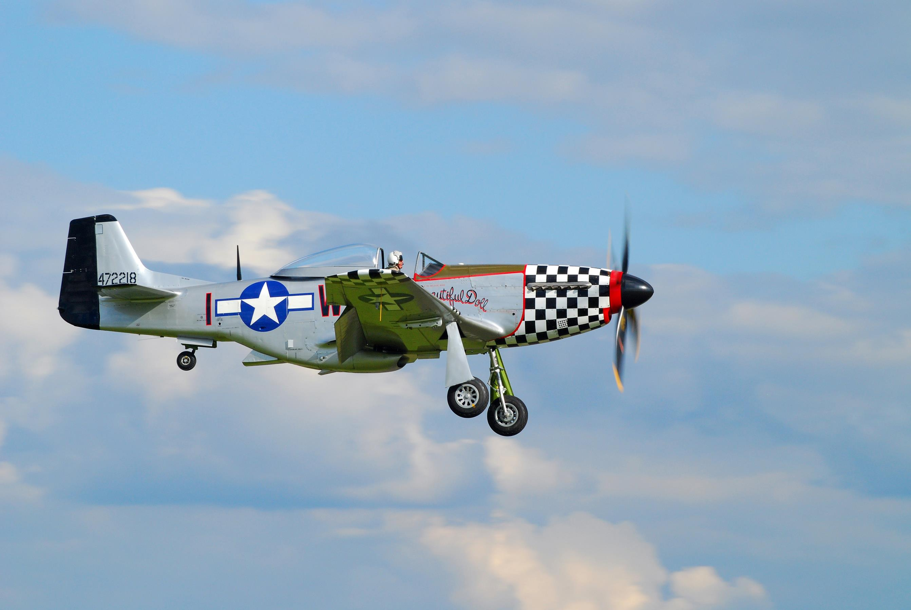

## General Characteristics

The P-51D is generally a very well-handling aircraft. It is very light on all of the controls and stable at all normal loadings. Light, steady pressure on the controls is sufficient to execute any routine maneuver. At various speeds in level flight or in climbing or diving, the control pressures required are slight and can be stabilized by adjustments on the trim tabs. However, the trim control tabs themselves are sensitive and require careful adjustments. The rudder and the elevator trim change slightly as the speed or the power output of the engine changes.

The aircraft has a redline speed of 505 mph Indicated Airspeed (IAS), with a maximum diving engine RPM of 3240. Extra caution should be used not to attempt steep dives at low altitudes as the aircraft accelerates very rapidly.

The aircraft is susceptible to high speed stalls, but not any more so than any other high speed aircraft. A buffeting of the tail section occurs about 5 to 10 MPH above the stall. All that is necessary to recover from a high speed stall is to release the back pressure on the stick and then recovery is almost instantaneous.

Recovery from a normal stall is the same. The buffeting, however, occurs at about 3 to 5 miles per hour above the stall.

The aircraft is generally normal in its flying characteristics. When trimmed for normal cruising speed, the aircraft will become nose-heavy when the nose is raised and the airspeed drops. Under the same cruising conditions, if the nose is lowered and the airspeed increases, the aircraft will become tail heavy in direct proportion to the airspeed.

When you lower the flaps, the airplane becomes nose heavy.

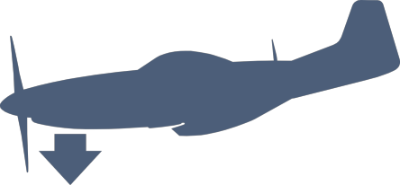

When you raise the flaps, the airplane becomes tail heavy.

When you retract the landing gear, the airplane becomes tail heavy.

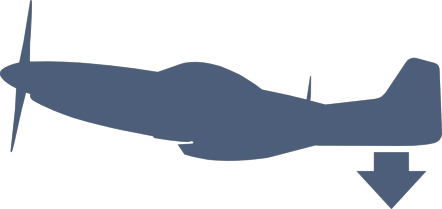

When you lower the landing gear, the airplane becomes nose heavy.

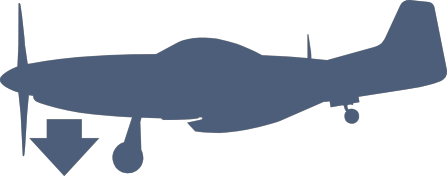

Similarly, normal flight attitude changes can be expected when raising or lowering the flaps and landing gear. Increased drag causes the aircraft to lower the nose, while decreased drag results in raising the nose.
The P-51 does not hold a sustained side-slip. The aileron control is not sufficient to hold the aircraft in a side-slipping angle. However, side-slip can be maintained for a short duration of time in an effort to evade enemy fire. When any side-slipping is attempted, complete recovery should be achieved above 200 feet to avoid ground collision.

As new equipment was added to the aircraft over the course of its development, in particular the radio equipment and the fuselage tank installed aft of the cockpit, the center of gravity (CG) has been moved back. This has resulted in decreased back pressure required to move the control stick. Instead of a force of 6 lbs. per G of acceleration, the required force in the P-51D is only 1 1⁄2 lbs. Additionally, the stick forces begin to reverse as acceleration exceeds 4G. Great care must be taken not to black out or over-stress the airframe in sharp pulls and turns.

## Operating Limits

### Load Factor Limitations

The P-51D structural load limit is +8G and -4G (plus a standard safety factor of 1.5). The below chart illustrates the maximum load factor limitations for different indicated airspeeds and three altitude bands at a gross weight (GW) of 9,000 lbs.

To calculate the maximum G load for a different GW, take the maximum load for the desired airspeed and altitude band provided in the chart, multiply by 9,000 and divide by the desired GW. For example, to calculate the maximum G load for a GW of 11,000 lbs (i.e. a P-51D with payload) at 225 mph IAS and altitudes below 10,000 feet, perform the following steps:

* Take the maximum G load provided by the chart for 225 mph IAS at altitudes below 10,000 feet (4G)

* Multiply the chart reading by 9,000 (4 x 9,000 = 36,000)

* Divide the result by desired GW (36,000 / 11,000 = 3.27G)

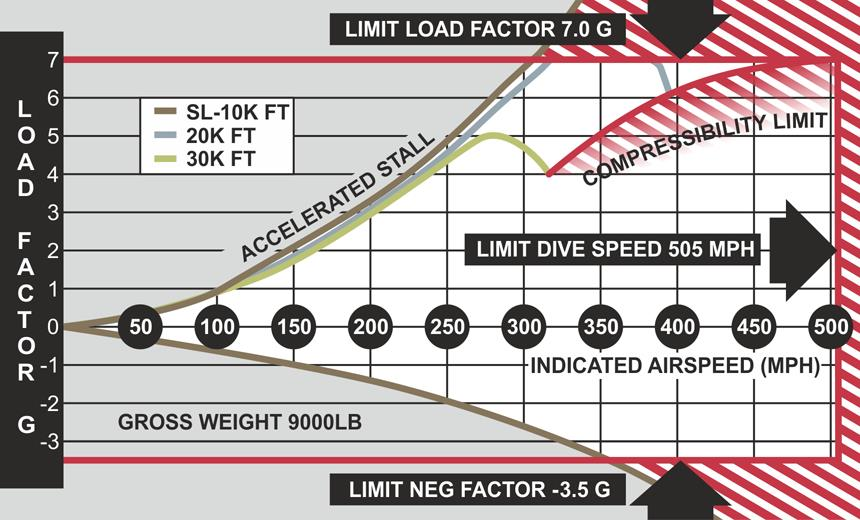

!!! warning
    Aerobatics are NOT permitted unless the fuselage tank contains less than 40 gallons of fuel or if external fuel tanks and/or bombs are carried.

### Engine Limitations

The maximum diving engine overspeed is 3240 RPM. Avoid operation below 1600 RPM in low blower supercharger mode. Avoid operation below 2000 RPM in high blower supercharger mode.

### Airspeed Limitations

The red line index on the Airspeed Indicator marks the maximum permissible airspeed (505 mph) up to 5,000 feet in altitude. At altitudes above 5,000 feet, the maximum permissible indicated airspeed must be adjusted for altitude as indicated in the Maximum Indicated Airspeed illustration.

Do not exceed the following wing flap setting airspeed restrictions:

Flaps Down Angle [degrees] | Maximum IAS [mph]
---|----
10 | 400
20 | 275
30 | 225
40 | 180
50 | 165

When droppable 75-gallon combat fuel tanks are installed, do not exceed 400 mph indicated airspeed. Do not allow airspeed to fall below 110 mph indicated airspeed during a sideslip.

### Instrument Markings

Flight and engine operating limits for normal flight are included on the cockpit on a special placard and consist of the following limits:

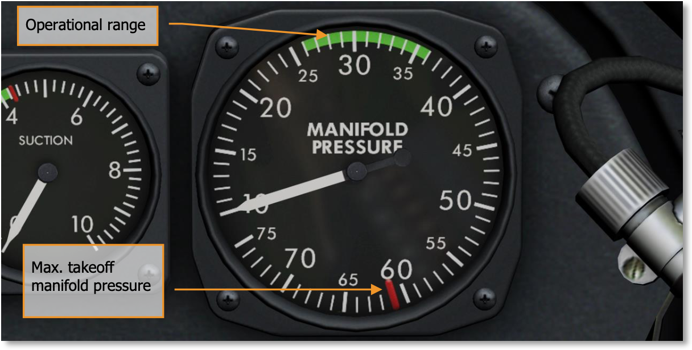

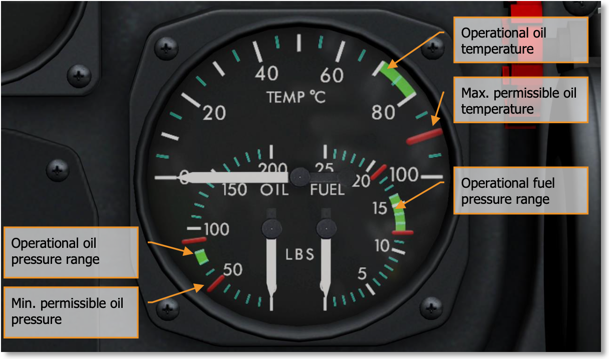

Max permissible oil temperature 90°C (194°F), operating oil temperature 70...80°C (158...176°F).

Max permissible oil pressure 90 lbs./sq. in. Min permissible oil pressure 50 lbs./sq. in. Operating oil pressure range 70...80 lbs./sq. in.

Max fuel pressure 19 lbs./sq. in. Min permissible fuel pressure 12 lbs./sq. in. Operating fuel pressure range 12...16 lbs./sq. in.

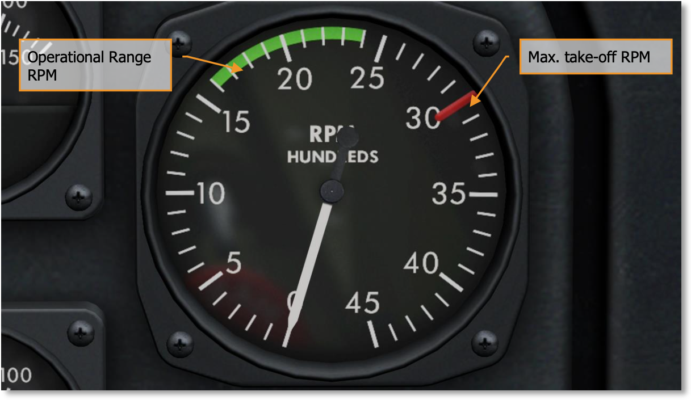

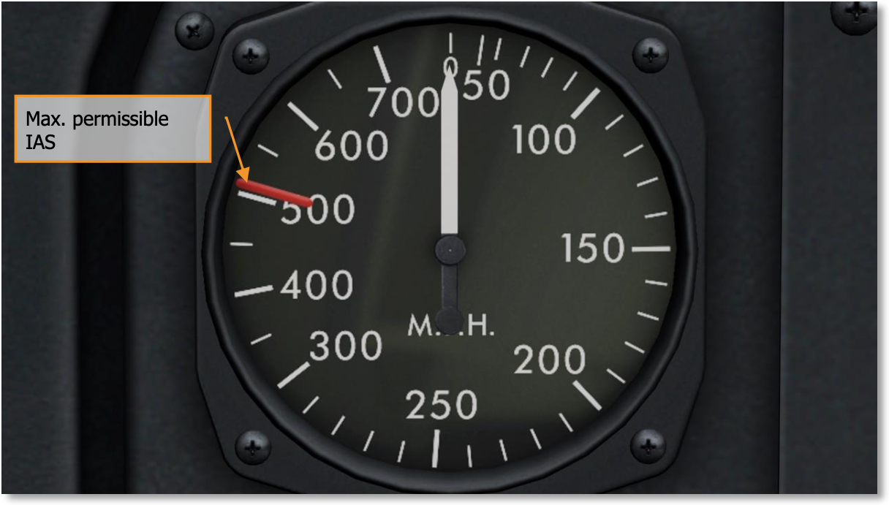

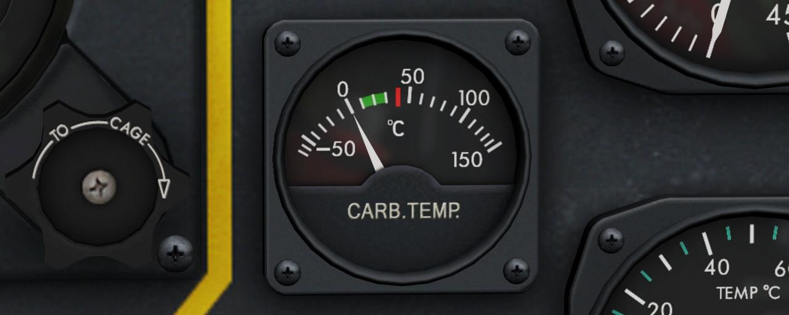

## Special Flight Conditions

### Full Fuselage Tank

Special care must be taken with the control stick when the fuselage tank contains more than 25 gallons of gas. In such cases, the flying characteristics of the aircraft change considerably – increasingly so as the amount of fuel in the tank is increased. When carrying more than 40 gallons of fuel in the fuselage tank, it’s necessary to avoid any high performance maneuvers. The fuel weight shifts the CG back, making the aircraft highly unstable during maneuvering.

### Reversibility

With the fuselage tank full, the CG of the aircraft moves back so far that it is nearly impossible to trim for hands-off level flight. Also, as soon as a sharp pull or turn is attempted, the stick forces reverse due to the effects of high G on an aft-positioned CG airframe. For example, once the G is loaded into a turn, the aircraft will naturally tighten the pull and may require pushing forward on the stick to balance. Similarly, when recovering from a dive with an aft-positioned CG, the aircraft tends to recover too sharply and may require changing from pulling the stick back to pushing it forward to maintain a desirable pullout rate.

The tendency for the CG to affect stick forces to the point of reversing them is called Reversibility. In the P-51, this effect can be expected when the fuselage tank is loaded with a significant quantity of fuel. Reversibility is reduced rapidly as the fuel quantity in the fuselage tank drops to half and below. Additionally, the P-51D features a bobweight added to the elevator control system bellcrank. This weight reduces the amount of forward pressure required to overcome reversibility tendencies.

### Drop Tanks

When equipped with drop tanks, only normal flight attitudes are permitted. Only normal climbing turns and descents should be performed when carrying drop tanks.

### Low Level Flight

When flying at extremely low altitudes, the aircraft should be trimmed slightly tail-heavy to avoid dropping the nose toward the ground in case the pilot’s attention is momentarily taken away from aircraft control.

### High Altitude Flight Characteristics

The P-51D’s 2-stage, 2-speed supercharger provides plentiful power up to well above 35,000 feet. As a general rule, the greater the altitude, the greater the control movement required to achieve the same response.

The supercharger blower will automatically shift into high speed at between 14,500 and 19,500 feet. This change will be accompanied by a momentary surge in power and increase in manifold pressure, until the manifold pressure regulator catches up. There is no noticeable effect when the supercharger shifts back into low blower on the descent. As a precaution, attention should be paid to the Supercharger control switch. If the amber light isn’t out below 12,000 feet, the supercharger should be set manually to LOW. When running in high blower, care should be taken to handle the throttle smoothly, as any rough handling will cause the engine to surge, greatly decreasing the efficiency of the airframe at high altitude and increasing control efforts.

### High Speed Dives

The P-51 is an excellent diving platform, thanks to its clean-lined design, laminar-flow wing, exceptional aerodynamics characteristics, and small frontal area. It is capable of developing terrific speeds, which makes it necessary to pay careful attention when diving. The following table illustrates safe pullout altitudes for various diving angles. These figures are based on a constant 4G pull for a flight level altitude of 4,000 feet at recovery.

It is recommended that trim tabs are not used during a dive after the aircraft is trimmed for level prior to initiating the dive. If so desired, the aircraft can be trimmed once during the dive, but this must be done carefully as the trim tabs are sensitive to input and care must be taken not to trim the aircraft nose-heavy.

**Note the accompanying table, which shows the minimum safe altitude required for pullout from dives of various degrees. These figures are based on a constant 4G acceleration, which is about what the average pilot can withstand without blacking out.**

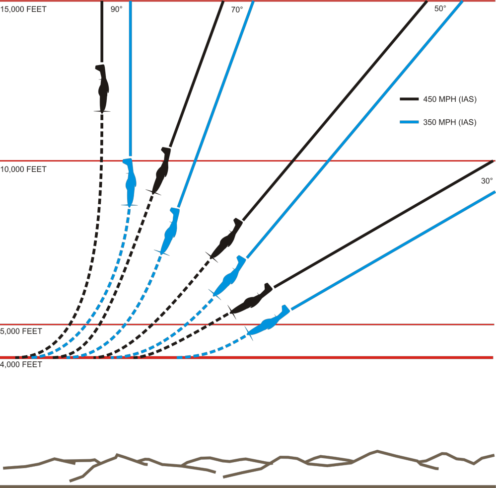

### Maximum Indicated Airspeed

The maximum safe indicated airspeeds (IAS) for the P-51 at different altitudes are provided in the graph below. Note that at altitudes above 5,000 feet the figures are less than 505 mph IAS. In other words, the red line speed for the P-51 is not a fixed figure, but a variable figure with altitude. The greater the altitude, the lower the maximum allowable IAS. Reaching speeds greater than the allowed maximums will overstress the wings and other structural elements of the airframe.

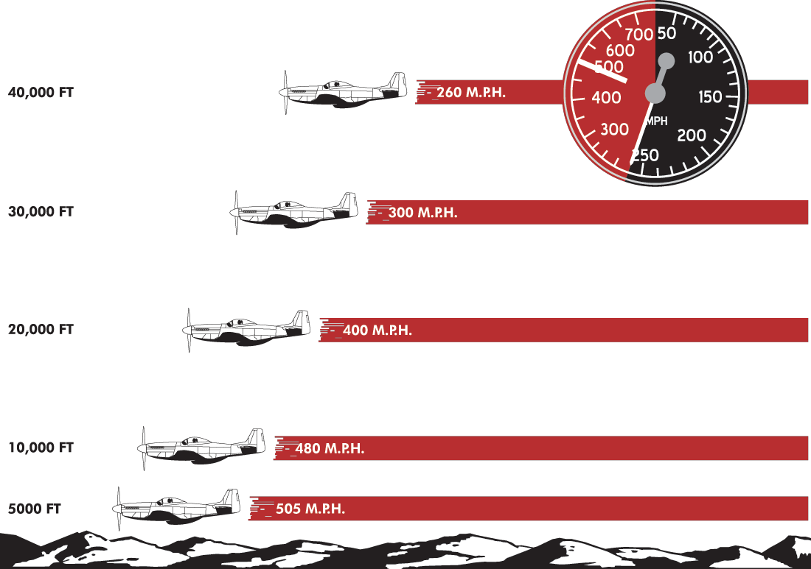

### Compressibility

Compressibility effects result in a loss of control over the aircraft as it approaches the speed of sound and is the reason maximum IAS is reduced as altitude increases. The lift characteristics of the aircraft are largely destroyed and intense drag develops. The stability, control, and trim characteristics of the aircraft are affected. The tail buffets or the controls stiffen, or the aircraft develops uncontrollable pitching and porpoising, or uncontrollable rolling and yawing, or any combination of these effects. If the speed of the aircraft is allowed to increase out of control in a dive, either the terrific vibrations of the sound barrier shockwaves cause structural failure or the aircraft crashes while still in the compressibility dive.

In the P-51, the first effect of compressibility is a “nibbling” of the control stick, where it occasionally jumps slightly in the pilot’s hand. If the airspeed is allowed to climb, this movement will increase into a “walking” stick, where it moves uncontrollably forward and back, resulting in the characteristic “porpoising” pitching moments of the aircraft. As the airspeed builds, this effect will become increasingly violent.

To avoid compressibility effects in a dive, it’s critical that a dive is entered at a safe airspeed for the altitude and that airspeed is monitored carefully during the dive. The table below indicates safe dive start airspeeds for different altitudes in both True Airspeed (TAS) and Indicated Airspeed (IAS).

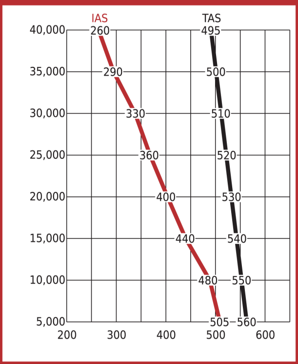

### Glides

The P-51 can be glided safely at speeds down to 25% above stalling speed. With average loads, this will be around 125 mph IAS at any level – this speed increasing with the weight of the aircraft. The optimum power-off gliding speed is 175 mph.

With the landing gear and flap retracted, the glide flight path is fairly flat. In this condition, however, the nose is held high and forward visibility is poor. Lowering either the flaps or the landing gear reduces the safe gliding speed and greatly steepens the gliding angle and increases the rate of descent.

The table below demonstrates the horizontal glide distances obtained with a power-off glide at 175 mph IAS from various altitudes:

Alt. [ft] | 40,000 | 35,000 | 30,000 | 25,000 | 20,000 | 15,000 | 10,000 | 5,000
----------|--------|--------|--------|--------|--------|--------|--------|------
Dist. [mi]| 115    | 101    | 87     | 72     | 58     | 43     | 29     | 14

### Stalls

A stall occurs when the aircraft is unable to generate sufficient lift for controlled flight, usually on one of both wings. This results in a loss of control to various degrees, leading to a possible wing-over or an uncontrolled spin in the worst case. The P-51 stalling characteristics are generally mild and recoverable. In general, a stall is preceded by airframe buffeting. Stalling speeds vary greatly depending on the gross weight and the external loading of the aircraft. Lowering the flaps reduces stall speeds considerably.

Recovery from a stall on the P-51 is normal. In early onset, simply releasing the stick and rudder to drop the nose will recover control. If a wing-drop condition occurs, applying opposite rudder and releasing the stick will recover control.

The below chart illustrates the approximate indicated power-off stall speeds in mph for various flight conditions:

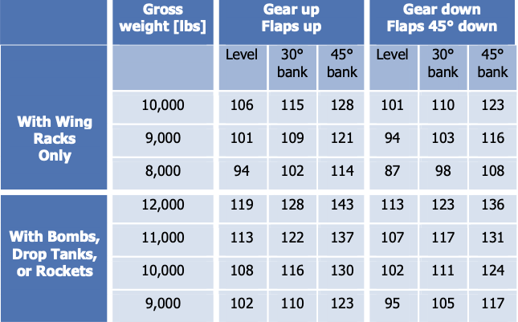

### Spins

#### Power-off Spins

In general, spins in the P-51D are uncomfortable, because of heavy oscillations. Occasionally, the left spin oscillations will dampen out after approximately three turns, but the right spin oscillations will not. When controls are applied to start a spin, the aircraft snaps one-half turn in the direction of the spin, with the nose dropping to near vertical. At the end of one turn, the nose rises to or above the horizon and the spin slows down, occasionally coming almost to a complete stop. The aircraft then snaps one-half turn with the nose dropping to 50-60 degrees below the horizon and continues as during the first turn. The force required to hold the controls in the spinning position is quite heavy, and some rudder buffet becomes noticeable. When controls are applied for recovery, the nose drops to a near vertical position and the spin speeds up and then stops in one to 1 and 1/4 turns.

#### Power-off Spin Recovery

Recovery procedure is the same in both a left and a right spin. As soon as opposite rudder is applied, the nose drops slightly. The spin speeds up for about 1 and 1/4 turns and then stops. The rudder force is light at first, becomes very heavy for about one second in the first one-half turn, and then drops to zero as the spin stops. Recovery is affected in the normal manner as follows:

* Controls with spin.

* Apply full opposite rudder.

* Stick neutral after the aircraft responds to rudder (as rotation stops).

* Rudder to neutral and complete recovery as spin ends.

#### Power-on Spins

Power-on spins should never be intentionally performed in the P-51. In a power-on spin, the nose of the aircraft remains 10 to 20 degrees above the horizon, and recovery control has no effect upon the aircraft until the throttle is completely retarded.

#### Power-on Spin Recovery

Close throttle completely and apply controls as for power-off spins recovery. Hold full opposite rudder with stick in neutral until recovery is affected. As many as five or six turns are made after rudder is applied for recovery, and 9,000 to 10,000 feet of altitude are lost.

### High Performance Maneuvers

The P-51D offers exceptional aerobatic qualities; stick and rudder pressures are light and the aileron control is excellent at all speeds. The primary safety consideration for any high performance maneuver is altitude.

The aircraft is capable of performing chandelles, wingovers, slow rolls, loops, Immelmans, and Split S turns with ease. However, remember that inverted flight must be limited to 10 seconds, because of loss of oil pressure and failure of the scavenger pump to operate in an inverted position.

When performing a loop, the nose of the aircraft needs to be pulled over the top, as it may not do so by itself. Without pulling pressure on the stick, the aircraft has a tendency to climb on its back.

The aerodynamic characteristics of the P-51D are such that snap rolls cannot be satisfactorily performed. Attempting to snap roll the aircraft aggressively may result in a power spin.

!!! warning
    High performance maneuvers can only be performed when the fuselage tank contains less than 40 gallons of fuel.

### Instrument Flying

#### Altitude Control

The rate of climb or descent, at a given airspeed and power setting, is determined by the degree of pitch, or nose attitude change. At high speeds, a very slight change in pitch will immediately result in a high rate of climb or descent, with a rapid gain or loss of altitude. Therefore, when maneuvering at low altitude under instrument conditions, as during an instrument approach, the primary rule of safety is: keep the airspeed down.

#### Bank Control

The turn needle is gyro-actuated and indicates rate of turn only, regardless of speed. Therefore, at a given rate of turn, the angle of bank in a coordinated turn depends upon true airspeed. A standard- rate turn at an altitude of 1,000 ft and an IAS of 200 MPH will require approximately 27° of bank. But at 25,000 ft, an IAS of 200 MPH will require about 37° of bank to accomplish a standard-rate turn, because the TAS at that altitude is in excess of 300 MPH.

Control pressure on the elevators changes rapidly during the entry into a steeply banked turn, and it’s very easy at this time to make inadvertent changes in your pitch. As explained above, these slight changes in nose attitude, at high speeds, will result in large altitude variations; these can be critically dangerous when flying on instruments and close to the ground. This hazard can also be avoided by keeping the airspeed low. When airspeed is low, the angle of bank required for a given rate of turn is greatly lessened and the problem of control is proportionally reduced.

#### Control Sensitivity

Given the sensitivity of the P-51 controls, it is essential to remain mentally attentive to the instruments at all times. Accurate trim control is extremely important; it will contribute greatly to physical relaxation and make it easier to concentrate on the numerous unrelated details of instrument flight. Trimming should be done carefully and as often as required.

#### Instrument Approach

Shortly before reaching the station on the initial approach, airspeed is reduced to 150 mph Indicated and flaps are lowered to 10°. Keeping the airspeed low simplifies radio procedures and increases control of the aircraft.

After completion of the initial approach, final approach is performed at 130 mph Indicated, with landing gear down and flaps set to 15°.

Although final approach speed depends largely on ceiling conditions, 130 mph with 15° of flaps is
recommended.

### Icing

Ice normally forms on the windshield, wing, stabilizer, vertical fin, and forward portions of the drop tanks. At first sign of icing, change altitude immediately to get out of the icing air layer. Ice accumulation increases drag and decreases lift, requiring an increase in power to maintain altitude and airspeed. If ice accumulates on the wings, make wide, shallow turns at a greater airspeed than normal, especially during approach and landing. Use flaps with care. Remember, stalling speed increases with ice. Be sure the pitot heater is on during icing conditions.

Ice can also form in the intake duct and affect engine performance. Carburetor ice forms most readily when carburetor air temperature is between -10°C (14°F) and +15°C (59°F). However, carburetor ice can form at any time, even with outside temperature as high as 32°C (90°F) and with temperature and dew point spread as much as 12°C (54°F). The formation of carburetor ice is hard to detect, because the automatic manifold pressure regulator maintains a constant manifold pressure. The only warning is a roughness of the engine.

To prevent carburetor icing, set the carburetor Ram Air control lever to UNRAMMED FILTERED AIR and the Hot Air control lever to HOT AIR. Use the two controls together. If application of carburetor hot air does not remove roughness, clean out the engine by running it at full Takeoff Power for one minute. If carburetor ice is the cause of roughness, use hot air as needed to prevent further ice formation.

If the air duct becomes obstructed with ice, hot air is automatically admitted to the intake regardless of the position of the carburetor air control.
