{width="8.291666666666666in" height="10.95in"}

{width="3.2916666666666665in" height="0.48125in"}

**СПИСОК ИЗМЕНЕНИЙ** 6

**DCS: WORLD FUNDAMENTALS** 7

> Health Warning! 8
>
> Installation and Launch 8
>
> Configure Your Game 9
>
> Fly a Mission 13
>
> Flight Control 14
>
> Changing Airspeed 15
>
> Changing Altitude 15
>
> Changing Heading 16
>
> Game Problems 17
>
> Useful Links 17

**КАБИНА (КОКПИТ)** **THE F-16C VIPER** 18

Обзор кабины Cockpit Overview [19](#bookmark2)

> Центральная Инструментальная Панель. Instrument Panel 20
>
> Левая вспомогательная консоль. Left Auxiliary Console
> [25](#bookmark23)
>
> Правая вспомогательная консоль. Right Auxiliary Console 27
>
> Левая консоль см. дополнительные материалы. Left Console 29
>
> Правая консоль. Right Console 34

**HOTAS HANDS-ON CONTROLS** 37

> РУС. Stick 37
>
> РУД. Throttle 40
>
> Сенсор внимания. Sensor of Interest (SOI) 41

**UPFRONT CONTROLS (UFC)** 42

> Интегрированная панель управления. Integrated Control Panel (ICP) 43
>
> Дисплей ввода данных. Data Entry Display (DED) 45
>
> Начальная страница. Сводная. CNI Page. 45
>
> Опасная высота, страница. ALOW Page 46
>
> Ввод времени, страница. Time Page 48

**Многофункциональные дисплеи (MФД) MULITFUNCTION DISPLAYS (MFD)** 49

> Дисплей горизонтальной ситуации. Horizontal Situation Display (HSD) 47
>
> Управление внешними подвесками. [Stores Management Set
> (SMS)](#bookmark257) 48
>
> Выборочный сброс подвесок. Selective Jettison (S-J) Page

**ИЛС HEAD-UP DISPLAY (HUD)** 50

> Панель управления ИЛС HUD Remote Control Panel 51

**НАВИГАЦИЯ NAVIGATION** 52

> Навигационная система EGI [Embedded GPS/INS (EGI) Navigation
> 5](#bookmark91)3
>
> Селектор управления INS INS Alignment 53
>
> ИЛС индикатор HUD Indication 56

**2**

> МФД горизонтальной ситуации Horizontal Situation Display (HSD)
> Indication 57
>
> Плановый навигационный прибор Horizontal Situation Indicator (HSI)
> Indication 58

**Тактическая аэронавигационная система TACAN (TCN) Navigation** 60

> Ввод/выбор станции TAKAN Select TACAN Station 61
>
> Выбор станции TACAN на ПНП Navigate to Selected TACAN Station 63
>
> Instrument Landing System (ILS) Navigation 64
>
> Select ILS Frequency 66
>
> Navigate with ILS Glide Slope and Localizer 67

**РАДИОСВЯЗЬ RADIO COMMUNICATIONS** 70

> Обзор Overview 71
>
> Радиочастоты Radio Frequencies 71
>
> Ввод предустановленных каналов [Preset Frequency Change](#bookmark110)
> 72
>
> Ввод частоты канала Manual Frequency Change 73
>
> Radio Commands 74
>
> Easy Communication Not Enabled 74
>
> Easy Communication Enabled 74

**Процедуры PROCEDURES** 76

> Cold Start 77
>
> Taxi 87
>
> Before Takeoff 90
>
> [Takeoff](#bookmark127) 94
>
> Crosswind Takeoff 95

Normal Flight 96

> [In-Flight Checks](#bookmark134) 96
>
> Trimming the Aircraft 96
>
> Дозаправка в воздухе Air Refueling 97
>
> Descent/Before Landing 104

Landing 106

Crosswind Landing 107

> After Landing 108
>
> Engine Shutdown 110

**РАДАР УПРАВЛЕНИЯ ВООРУЖЕНИЕМ AN / APG-68 FIRE CONTROL RADAR (FCR)**
112

> Обзор Overview 113
>
> Режим Воздух – Воздух [Air-to-Air Modes (А-А)](#bookmark150) 113
>
> Комбинированный режим радара [Combined Radar Mode (CRM)](#bookmark152)
> 116
>
> Подрежим «Диапазон дальности при поиске» Range While Search (RWS)
> Submode
>
> Подрежим «Отслеживание во время сканирования»Track While Scan (TWS)
> Submode
>
> Режим воздушного боя (БВБ) [Air Combat Mode (ACM)](#bookmark159) 124
>
> Режим «Одиночная цель в захвате» [Single Target Track (STT) Mode
> 131](#bookmark167)
>
> Увеличение зоны внимания сенсора FCR Expand (EXP) Feature 132
>
> Работа системы “Свой Чужой» [IFF Interrogation 1](#bookmark167)33

**СИСТЕМА ТАКТИЧЕСКОЙ информации LINK 16 DATALINK** 135

> Обзор Overview 136
>
> Символы на дисплее Display Symbology 137
>
> Фильтрация на дисплее Radar Display Filtering 141
>
> Страницы DED DED Pages 142
>
> Статус сети Network Status 142
>
> Опции MIDS Radio Options 143
>
> Управление фильтрацией Flight Management 143

ПОДВЕСНОЙ КОНТЕЙНЕР **LITENING AT TARGETING POD (TGP)** 144

Обзор Overview 145

Включение TGP TGP Activation 146

**3**

Режим «Ожидание» Standby (STBY) Mode [1](#bookmark174)47

Выбор режимо[в Mode Selection 1](#bookmark176)48

Режим ВОЗДУХ – ЗЕМЛЯ [Air-to-Ground (A-G) Mode 1](#bookmark178)49

Измерение наклонной дальности лазерным подсветом точки [Laser
Ranging](#bookmark181) 151

Режим ВОЗДУХ - ВОЗДУХ [Air-to-Air (A-A) Mode 1](#bookmark183)52

Ввод кода лазера в DED (RU)[LASR DED Page 15](#bookmark185)4

**НАШЛЕМНЫЙ УКАЗАТЕЛЬ HELMET MOUNTED CUEING SYSTEM** 155

Обзор Overview 156

Режим обзора Non-Designated Mode 157

**ПРИМЕНЕНИЕ РАКЕТ В- В AIR-TO-AIR EMPLOYMENT** 156

Подготовка в воздушному бою [Air Combat Preparation 1](#bookmark191)59

Пушка M61A1 20mm Gun 160

Применение пушки в режиме В-В [Air to Air Gunnery 1](#bookmark196)60

AIM-9M/X Sidewinder 165

Применение [AIM-9M/X Employment 1](#bookmark206)66

Применение [AIM-9M/X HMCS Missile BORE Employment 1](#bookmark216)69

Применение [AIM-9M/X HMCS Radar BORE Employment 1](#bookmark224)72

AIM-120 AMRAAM 176

Применение [AIM-120 Employment 1](#bookmark235)77

**ПРИМЕНЕНИЕ РАКЕТ В - З AIR TO GROUND EMPLOYMENT** 181

Подготовка к атаке Attack Preparation 182

**ПРИМЕНЕНИЕ ПУШКИ M61A1 20mm Gun Strafe** 183

Target Attack 183

In-Range Cue Update 182

**ПРИМЕНЕНИЕ НАР 2.75” Rockets** 188

Атака с пикирования Target Attack (CCIP) 188

**Применение неуправляемых бомб Unguided Bombs** 192

Бомбы общего назначения General Purpose Bombs 192

Кассетные бомбы Cluster Bombs 192

Тренировочные бомбы Training Bombs 193

Страница SMS неуправляемых/управляемых бомб [Unguided/Guided Bombs A-G
SMS Page 1](#bookmark281)94

Применение бомб в режиме CCIP Unguided Bombs CCIP Attack 201

Применение бомб в режиме CCIP Unguided Bombs CCIP Attack (Post -
Designate) 204

Применение бомб в режиме CCRP Unguided Bombs CCRP Attack 207

**4**

Бомбы с лазерным наведением [Laser Guided Bombs](#bookmark276) 211

Ввод кода лазера Bomb Seeker [Laser Code](#bookmark278) 212

Страница SMS Page 212

Применение бомб с лазерным наведением [Laser Guided Bomb CCRP
Attack](#bookmark310) 213

**СИСТЕМЫ ЗАЩИТЫ DEFENSIVE SYSTEMS** 220

Обзор Overview 221

Азимутальный индикатор [Azimuth Indicator (RWR)](#bookmark322) 221

Системы противодействия [Countermeasures Dispensing Set
(CMDS)](#bookmark324) 223

Панель управления CMDS Control Panel 223

HOTAS 224

Страница CMDS DED Page 225

**5**

[]{#_bookmark0 .anchor}

[]{#СПИСОК_ИЗМЕНЕНИЙ .anchor}**СПИСОК ИЗМЕНЕНИЙ**

Значительные изменения в руководстве будут отмечены на этой странице.
Изменения могут быть обозначены черной полосой рядом с новым или
пересмотренным текстом, как показано здесь в правом поле.

15 Oct 2019 – Added IFF Interrogation procedure to radar section.
(Добавлена процедура опроса IFF в радаре)

20 Oct 2019 – Updated AIM-9 diamond and uncage behavior description in
AIM-9M/X Employment sections. (Обновленное описание поведения AIM-9 в
разделах AIM-9M / X Employment)

22 Oct 2019 – Added Track While Scan radar submode description.
(Добавлено описание подрежима радара Track While Scan)

25 Oct 2019 – Added INS alignment procedures. (Добавлены процедуры
выставления INS)

28 Oct 2019 – Added section on SMS MFD page and Selective Jettison.
(Добавлен раздел на странице SMS MFD и Selective Jettison).

05 Nov 2019 – Added Air refueling procedures. (Добавлены процедуры в
заправки воздухе)

08 Nov 2019 – Added Link 16 Datalink information (Добавлены процедуры
Link 16 Datalink)

14 Nov 2019 – Added Link 16 Datalink DED Page information (Добавлены
процедуры Link 16 Datalink на странице DED)

15 Nov 2019 – Added additional CMDS DED Page descriptions (Добавлены
процедуры CMDS на странице DED)

23 Nov 2019 – Updated Link 16 Datalink information (Обновлены процедуры
Link 16 Datalink на странице DED)

24 Nov 2019 – Added information on the radar display’s Expand Feature
(Добавлена информация о функции Expand Feature дисплея радара)

21 Jan 2020 – Added EEGS Level V gunsight information (Добавлена
информация о прицеле EEGS Level V)

28 Jan 2020 – Added information on filtering FCR display datalink
tracks. (Добавлена информация по фильтрации треков datalink tracks.
отображения данных FCR)

11 Feb 2020 – Added slave/bore HOTAS functionality to AIM-9 employment
section. (Добавлена функция переключения режимов lave/bore на HOTAS)

25 Feb 2020 – Updated TACAN band change procedure in the TACAN
Navigation section. (Обновлена процедура смены диапазона TACAN в разделе
навигации TACAN.)

15 Mar 2020 – Added M61A1 Gun dispersion information to the Gun
Employment section. (15 марта 2020 г. - Добавлена информация о
рассеивании снарядов M61A1 в раздел «Использование оружия».)

31 Mar 2020 – Added Time and ALOW DED page descriptions to the UFC
section (31 марта 202г. – (Добавлено описание страниц DED ALOW Опасная
высота и Time Время )

> DCS: WORLD FUNDAMENTALS

{width="8.266622922134733in"
height="11.020978783902013in"}

{width="8.272872922134733in"
height="11.034965004374452in"}

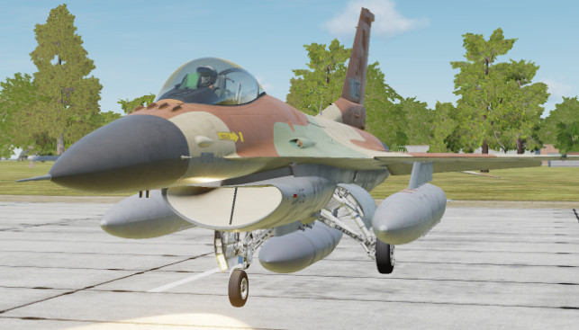{width="7.21250656167979in"
height="4.112676071741032in"}

[]{#F16C_VIPER_КАБИНА .anchor}**THE F-16C VIPER КАБИНА (КОКПИТ)**

[]{#Обзор_кабины .anchor}**Обзор кабины**

Попав в кабину, Вы должны иметь общее представление о том, где находятся
различные органы управления. Чтобы упростить поиск оборудования и
органов управления, кабину разделена на пять основных областей: **Левая
консоль (Left Console), Левая вспомогательная консоль (Left Auxiliary
Console), Центральная инструментальная панель (Instrument Panel), Правая
вспомогательная консоль (Right Auxiliary Console) и Правая консоль
(Right Console)**.

**19**

{width="6.666666666666667in"
height="3.888888888888889in"}

[]{#Инструментальная_Панель .anchor}**Instrument Panel (Центральная
Инструментальная Панель)**

***Head-Up Display (HUD) (ИЛС)***

HUD предоставляет символы полета, касающиеся режимов атаки, навигации,
оружия, прицеливания и посадки. Он также предоставляет символы для
важных данных о характеристиках самолета, включая высоту, скорость
полета, ориентацию и курс.

***AOA Indexer АОА (Индекс)***

Указатель угла атаки состоит из трех огней. Если верхнее табло
подсвечивается красным шевроном, вы выше угла атаки в 14 градусов, и вы
снижаетесь с углом атаки, превышающим энергию снижения. Если центральное
табло, зеленый круг подсвечен, ваш угол атаки составляет от 11 до 13
градусов, и вы находитесь на скорости с оптимальным углом атаки; и если
подсвечивается нижнее табло с янтарным шевроном, ваш угол атаки ниже 11
градусов, и вы получаете энергию снижения с углом атаки меньше
оптимального. Эти данные дублируется на индикаторе угла атаки на
приборной панели и на HUD, который виден только при малой мощности
двигателя. При посадке вы должны снижаться в диапазоне от 11 до 13
градусов AОA. Также обратите внимание, что эти огни всегда включены, а
не только с пониженной мощностью двигателя.

***AR Status/NWS Indicator (Индикатор воздушной дозаправки и управления
носового колеса шасси)***

Центральное табло управления носовым колесом шасси (УНКШ) и заправочной
горловины (ЗГ) горят зеленым светом, когда УНКШ включено. При включении
управления движения педалей позволяют управлять колесом шасси.

При заправке в воздухе верхний индикатор готовности светится синим
цветом и указывает, что горловина открыта и готова, средний AR горит
зеленым светом, когда заправочная стрела защелкивается, а нижний
индикатор отключения отображается, когда происходит прекращение
заправки. Когда заправочная стрела защелкнута, индикатор горит зеленым,
а нижний индикатор отключения показывает отключение от стрелы.

**20**

{width="0.7326388888888888in"
height="1.1055555555555556in"}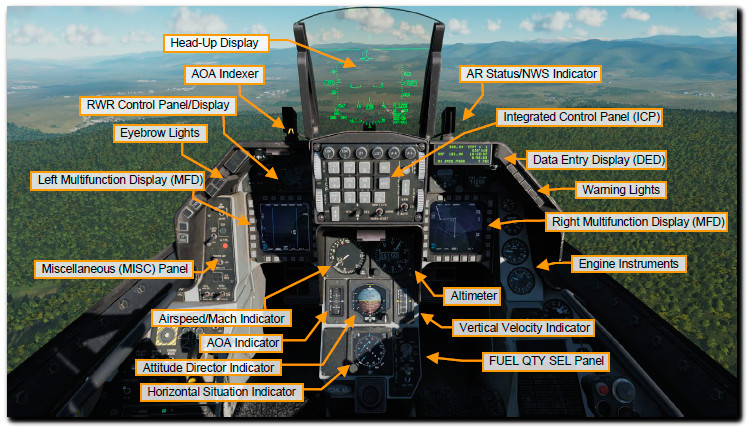{width="5.517361111111111in"
height="3.1881944444444446in"}{width="0.8875in"
height="1.042361111111111in"}

***Data Entry Display (Дисплей ввода данных)***

Дисплей ввода данных, или DED, обеспечивает отображение связи,
навигационных средств и идентификации, называемых CNI, и информации,
связанной с доставкой оружия. Манипуляция DED осуществляется с помощью
ICP.

***RWR Prime Control Panel/Azimuth Display***

Индикатор азимутальный. предупреждения об угрозе. ALR-56M - это приемник
радиолокационного предупреждения в Viper. Это план в форме плана с вашим
самолетом в центре, а излучатели обнаружены на 360 градусов вокруг него.
Слева от прицела находятся световые индикаторы предупреждения об угрозе.

***Eyebrow Lights (Табло световой индикации)***

**IFF Identification Light.**Световая идентификация IFF. Нажатие кнопки
идентификации IFF инициирует ответ IFF на запрос или запрос от
авиадиспетчерской службы.

**Fault Acknowledge Light.** Световая панель подтверждения
неисправности. Когда неисправность появляется на дисплее списка
неисправностей пилота или PFLD, кнопка подтверждения неисправности
нажимается для подтверждения получения информации о неисправности.

**Master Caution Light.** Главный предупредительный световой сигнал.
Главный предупредительный световой сигнал загорается каждый раз, когда
загорается предупредительный световой сигнал, указывающий на
неисправность или возникновение определенного состояния, он не
загорается предупредительными световыми сигналами. Сигнал можно
сбросить, нажав на светящуюся кнопку.

***Left and Right Multifunction Display (MFD) (Левый и Правый МФД)***

Левый и Правый многофункциональный дисплей, или МФД (MFD), состоит из
полноцветного ЭЛТ-экрана с 20 опциями выбора по окружности кнопками или
OSB, в четырех группах по пять. По углам МФД находятся кулисные
переключатели для регулировки дисплея: яркость символов, контрастность и
яркость дисплея.

***Miscellaneous (MISC) Panel Панель оборудования***

**Autopilot Roll and Pitch Switches.** Автопилот Крен и Тангаж
Переключатели.

Два переключателя автопилота в различных положениях позволяют вам
устанавливать удержание высоты и крена в различных режимах полёта.

Функциональные положения переключателей:

Переключатель Тангажа (правый переключатель) может быть установлен в
положение:

-   **ALT HOLD** (вверх) режим управление самолётом автопилотом для
    поддержания текущей высоты;

-   **A / P OFF** (среднее) отключает режимы автом. управления,
    выбранные в положениях вверх и вниз;

-   **ATT HOLD** (вниз) режим удержания самолет в положении текущего
    тангажа (или положения).

Переключатель Крена (левый переключатель) может быть установлен в
положение:

-   **HDG SEL** (вверх) режим управление самолётом автопилотом, при
    котором самолет разворачивается и выполняет полёт к ЛЗП, для
    исправления бокового отклонения;

-   **ATT HOLD** (среднее) отключает режимы автом. управления и
    удерживает текущее положение крена;

-   **STRNG SEL** (вниз) режим управление самолётом автопилотом для
    полёта на выбранный ППМ (в DED).

Две функции автопилота переключателями в разных положениях могут быть
использованы одновременно.

**21**

***Integrated Control Panel (ICP) (Интегрированная панель управления)***

Интегрированная панель управления, или ICP, заполняет верхнюю часть
центральной приборной панели и является одной из основных системы связи,
навигации и IFF, или CNI, в Viper. Это описано в разделе ниже.

{width="1.66875in"
height="1.5847222222222221in"}{width="1.1055555555555556in"
height="0.7888888888888889in"}

**RF Switch.** Переключатель излучения. Представляет собой
трехпозиционный переключатель, который позволяет контролировать
излучение систем самолета. Положения переключателя RF устанавливают
режимы: NORM (нормальный), QUIET (тихий) и SILENT (бесшумный). В Тихом
режиме, хотя, радар, TACAN и канал передачи данных передают, но все
другие излучения запрещены. Когда установлен Бесшумном режиме, все
электронные сигналы из систем самолёта отключены (радар,
радиолокационный высотомер, канал передачи данных, передачу TACAN и
ECM).

**ECM Enable Light.** Световой индикатор включения ECM. Когда ECM
передает, загорается индикатор ECM.

**Laser Arm Switch.** Лазерный переключатель. Если прицельный контейнер
загружен, лазерный рычаг включает лазер.

**ALT Release Button**. Кнопка разблокировки ALT REL. Кнопка
разблокировки функционирует как резервная кнопки применения оружия
(weapons release) на РУС в случае ее неисправности.

**Master Arm Switch**. Главный Переключатель вооружения имеет три
положения. В положении «Вык.» (среднее) пуск/сброс АСП ЗАПРЕЩЕН, за
исключением Аварийного сброса. В положении ARM (вверх) система
управления радаром и управления вооружением работает в обычном режиме
(NORM). В положении SIMULATE (вниз) системы и цепи вооружения работают,
но никакие АСП не могут быть применены. Режим SIM обычно используется в
обучении, чтобы работать с символикой вооружения БЕЗ фактического пуска
/ сброса, режим, за исключением Аварийного сброса

**ADV Mode Switch.** Переключатель режима ADV. Кнопка обхода ландшафта
здесь предназначена для рельефа местности и не используется в блоке 50
Viper.

***Warning Lights (Табло предупреждения)***

Вдоль правой «брови» есть серия раздельных световых аварийных табло,
которые при загорании требуют немедленных действий.

**Engine and Engine Fire Warning Lights**. Двигатель и Пожар двигателя.
Табло двигателя (engine light) загорается, когда сигналы индикатора
оборотов RPM и температуры FTIT указывают на перегрев, пожар или
зависание оборотов. Это означает, что число оборотов (RPM) в минуту
составляет менее 60 процентов или FTIT 1000 градусов Цельсия или более.
Табло двигателя так же светится, если в отсеке двигателя обнаружен
пожар.

**Hydraulic and Oil Pressure Warning Light.** Табло давления гидравлики
и масла будут светится, если давление масла упадет ниже 10 фунтов на
квадратный дюйм в течение более 30 секунд, или в если гидравлической
системе A или B давление будет ниже 1000 фунтов на квадратный дюйм.

**FLCS and DBU Warning Lights.** Предупреждающее табло FLCS загорается,
если обнаружена неисправность в процессорах FLCS, источниках питания,
входных командах или датчиках, датчиках угла атаки или входах воздушных
данных. Также, табло будет светиться, если предкрылки на передней кромки
крыла заблокированы или встроенный тест не пройден. Индикатор DBU
загорится, если цифровое резервное копирование FLCS включено.

**Takeoff and Landing Configuration Warning Lights**. Табло конфигурации
взлета и посадки светится, если шасси не выпущено, когда самолет ниже
10,000 футов, скорость полета меньше 190 узлов, а скорость снижения
больше 250 футов в минуту. Это также будет сопровождаться подачей
прерывистого звукового сигнала шасси.

**Canopy and Oxygen Low Warning Lights.** Табло фонаря загорается, когда
фонарь не опущен и не заблокирован, а индикатор низкого уровня кислорода
загорается, если кислородная система ниже 5 фунтов / кв. дюйм или имеет
место сбой теста BIT.

**22**

{width="1.6231102362204723in"
height="1.6408442694663168in"}{width="1.1690135608048995in"
height="3.097230971128609in"}

***FTIT Indicator. ***

Температура на входе в турбину вентилятора, или FTIT, указывает среднюю
температуру в градусах Цельсия, и она может колебаться от 200 до 1200
градусов с шагом 100.

**Airspeed and Mach Indicator**

Индикатор Скорости полёта (Airspeed и Mach) приводится в действие
пневматически от пито-статической системы. Воздушная скорость
указывается внешним манометром и указателем в диапазоне 80 - 850 узлов,
а в Мах указывается в окне рядом с верхней частью индикатора в диапазоне
0,5 - 2,2 Маха.

Красный треугольник на индикаторе указывает VNE, или максимальную
разрешенную скорость, зеленый треугольник является индикатором, который
можно установить с помощью регулятора.

***Altimeter***

Высотомер (Альтиметр) является пневматическим (измерения давления) (с
коррекцией) устройством, который может указывать высоты от минус 1000 до
плюс 80000 футов. Он имеет как первичный режим с электропитанием, так и
вторичный пневматический режим. Если высотомер выдает показания во
вторичном режиме, флаг PNEU появляется на датчике, чтобы указать на
использование режима работы по давлению. Ручка барометрической настройки
позволяет вам ввести желаемую настройку альтиметра, как указано в
небольшом окне ниже и справа от окна цифрового альтиметра.

***Angle of Attack Indicator***

Индикатор угла атаки дублирует ту же информацию, что и указатель угла
атаки рядом с HUD, но находится в диапазоне от -32 до +32 градусов.
Лента окрашена в соответствии с огнями указателя рядом с HUD. Полоса в
центре ленты указывает ваш текущий угол атаки по отношению к центру
ленты.

***Attitude Director Indicator***

Авиагоризонт (индикатор положения в пространстве), или ADI, отображает
угол тангажа и величину крена самолета, представленный инерциальной
навигационной системой или INS. Индикатор также содержит стрелку
скорости разворота, в которой ширина одной стрелки составляет от 1 до
1,2 градуса в секунду, и индикатор скольжения (шарик). Ручку регулировки
высоты тона можно использовать для регулировки сферы горизонта
относительно символа самолета. Когда система посадки по приборам
включена, ADI также будет отображать индикатор курса и полоски глиссады
с соответствующими флагами предупреждения о выключении.

***Vertical Velocity Indicator***

Индикатор вертикальной скорости, или VVI, отображает скорость набора
высоты или снижения на движущейся ленте скоростей в диапазоне до 6000
футов в минуту при подъеме или снижении.

***Horizontal Situation Indicator***

Горизонтальный индикатор положения, или HSI, отображает вид самолета
сверху, в центре дисплея. Компас вокруг символа самолета управляется
системой INS, так что направление полёта всегда определяется по средней
линии самолета (направлении полёта). Ручка установки курса позволяет вам
установить индикатор произвольного курса, а ручка курса - установить
заданный угол курса.

**23**

***Engine Instruments***

**Oil Pressure Indicator.** Двигатель оснащен масляной системой для
смазки двигателя и редукторов. Индикатор показывает давление от 0 до 100
фунтов на квадратный дюйм (PSI). Нормальное давление (PSI) в системе в
режиме малого газа (МГ или IDLE) холостого хода двигателя составляет
около 15, на земле, и 60, на режиме боевой (MIL) мощности и выше.

**Engine Nozzle Position Indicator.** Сопло двигателя оснащено
подвижными лепестками и состоит из двух секций. Расходящаяся лепестки
сопла, которые свободно перемещается вместе с конвергентной соплом.
Конвергентное сопло приводится в действие четырьмя гидроприводами.

**Engine RPM Indicator.** Индикатор оборотов двигателя (RPM indicator)
показывает обороты двигателя, полученные от ротора двигателя (engine
generator). Это выражается в процентах от 1 до 110.

***Fuel Quantity Select Panel***

Панель селектора указателя топлива позволяет выбрать, какая информация о
топливе отображается стрелочными указателями количества топлива.
Положения селектора:

**• TEST**. В положении Тест установит оба указателя на 2000 фунтов, а
суммарный остаток должен показать 6000 фунтов.

**• NORM**. В нормальном состоянии (NORM,) указатель AL указывает сумму
топлива в заднем (левом) резервном баке (AFT RSVR) и заднем баке
фюзеляжа (A-1), а указатель FR указывает сумму топлива в переднем
(правом) резервном баке (FWD RSVR), переднем баке (F-1) и центральном
баке (F-2) фюзеляжа.

**• Reservoir (RSVR).** Положение указателя AF и FR для отображения
топлива в заднем (AFT RSVR) и переднем (FWD RSVR) резервных баках.

**• Internal Wing (INT WING).** Левый и Правый крыльевые баки
(внутренние). Положение указателей AF и FR для отображения остатка
топлива в крыльевых левом и правом топливных баках.

**• External Wing (EXT WING).** Левый и Правый подвесные крыльевые баки
Положение указателей AF и FR для отображения остатка топлива в подвесных
крыльевых (внешних) топливных баках.

**• External Center line (EXT CTR).** Центральный подвесной бак.
Указатель FR указывает на количество топлива в центральном подвесном
баке (под фюзеляжем).

**External Fuel Transfer (EXT FUEL TRANS)** Переключатель перекачки
топлива позволяют организовать перекачку из подвесных баков.

-   При положении переключателя EXT FUEL TRANS в положении NORM
    выработка идет сначала из центрального подвесного бака, потом из
    крыльевых.

-   Если поставить в положение WING FIRST, то будет выработка сначала из
    крыльевых подвесных баков, потом из центрального подвесного бака.

**24**

{width="5.1194444444444445in"
height="6.279166666666667in"}{width="2.0180500874890637in"
height="1.4957261592300963in"}{width="1.1973720472440945in"
height="1.1709405074365704in"}{width="0.9570450568678915in"
height="1.8632480314960629in"}

[]{#Левая_вспомогательная_консоль .anchor}**Left Auxiliary Console
(Левая вспомогательная консоль)**

Miscellaneous Switches and Indicators

Alt Gear Handle

CMDS Control Panel

Threat Warning Aux Control Panel

HMCS Control Panel

***Emergency jettison button ***

Кнопка Аварийного Сброса. Нажатие на её сбрасывает все внешние подвески
(топливные баки, пилоны, и АСП).

***WHEELS Down Lights. ***

Положение шасси. Индикаторы показывают положение стоек основных колес и
носового колеса. Когда индикаторы светятся зеленым цветом, шасси
выпущено и поставлено на замок. Когда шасси будет выпускаться/убираться,
ручка управления шасси будет светиться красным. Когда основные стойки /
передняя опора шасси будут в положении (позиции), которое определяет
положение рычага управления шасси (выпущено или убрано), её подсвет
погаснет.

***HOOK Switch. ***

Этот переключатель опускает крюк для экстренной остановки на аэродромах,
оборудованных системой торможения при аварийной посадке. После того, как
крюк выпущен, он не может быть убран из кабины пилота, то есть без
наземного экипажа.

***ANTI-SKID Switch. ***

Выключатель тормоза можно установить в режим противоскольжения или
стояночного тормоза. Вы также можете отключить эти режимы.

***LANDING TAXI LIGHTS Switch. ***

Выключатель посадочной и рулежной фары позволяет установить световой
режим для руления, посадки или взлёта.

***DN LOCK REL Button. ***

Кнопка отмены блокировки при нажатии механически разблокирует блокировку
рукоятки, приводимой в действие пружиной, если электрический соленоид
выходит из строя или не приводится в действие. Он перекрывает все
электрические сигналы управления LG.

***LG Handle. ***

Рычаг управления выпуском и уборкой шасси. Движение рукоятки приводит в
действие электрические переключатели для управления выпуском или уборкой
шасси. Сигнальный подсвет на рукоятке (LG) загорается, когда шасси будет
выпускаться/убираться или не смогли зафиксироваться в заданном
положении. Сигнальный подсвет также светится, когда цепи LG не выключены
или не заблокированы, скорость полета составляет менее 190 узлов, высота
менее 10000 футов и скорость снижения превышает 250 футов в минуту.

***SPEED BRAKE Position Indicator. ***

Индикатор выпуска тормозных щитков. Три возможных индикации положения:
убраны, выпущены и нет питания. В убранном состоянии индикатор
отображается закрытым, когда выпущены, он имеет серию из девяти точек, а
когда не имеет питания, он имеет пунктирные линии.

**25**

{width="5.320138888888889in"
height="3.026388888888889in"}

***STORES CONFIG Switch. ***

Переключатель конфигурации внешних подвесок. Имеет 2 положения
конфигурации системы управления самолётом CAT I и CAT III. Конфигурация
CAT 1 - это подвески АСП воздух-воздух, а CAT III - более тяжелые
подвески АСП воздух-земля или подвесные баки под крыльями. При установке
на CAT III FLCS ограничивает угол атаки и манёвренность, чтобы не
допустить выхода за эксплуатационную перегрузку в полёте.

***HORN SILENCER Button. ***

Кнопка выключения звукового сигнала шасси. Позволяет отключить звуковой
сигнал, когда скорость полёта ниже 190 узлов, высота ниже 10000 футов,
закрылки выдвинуты/выпущены, а шасси не выпущено и не установлены в
замок. Как правило, это предупреждает вас на посадке, но вы также можете
услышать сигнал, если установите скорость в воздушном бою менее 190
узлов на высоте ниже 10000 футов над уровнем моря.

***GND JETT ENABLE Switch. ***

Положение «ВЫКЛ» (OFF) запрещает аварийный сброс внешних подвесок при
выпущенном шасси и нахождении на земле, а также при выборочном
сбрасывании на снижении с выпущенным шасси. Положение ENABLE разрешает
все условия сброса независимо положения от шасси или нахождении на
земле. Используется во время технического обслуживания для проверки
системы вооружения самолета.

***BRAKES Channel Switch. ***

Тормозные щитки могут выпускаться электрическим каналом 1 или 2, который
также управляет гидравлическими клапанами тормоза. Вы обычно используете
канал 1.

***CMDS Control Panel***

На этой панели расположены элементы управления и индикаторы, относящиеся
к системе отстрела контрмер (диполи и тепловые ловушки). Можно выбрать
режимы и/или программы для дозирования отстрела диполей и тепловых
ловушек, а также использовать системы РЭБ и активировать их с помощью
элементов управления HOTAS на РУС.

***Threat Warning Aux Control Panel***

На этой панели находятся элементы управления для включения и управления
RWR.

***ALT GEAR Handle***

Альтернативная ручка разблокировки шасси. Выпускает шасси в случае
отказа гидравлики и/или невозможности опустить ручку выпуска шасси.

***HMCS Control Panel***

Регулировка яркости индикации на щитке шлема пилота. Позволяет
отображать информацию о полете и АСП на щитке шлема. Вращая ручку, вы
можете выключить и включить ее и отрегулировать ее яркость.

**26**

{width="3.978872484689414in"
height="4.449896106736658in"}

[]{#Правая_вспомогательная_консоль .anchor}**Right Auxiliary Console
(Правая вспомогательная консоль )**

***Magnetic Compass***

Магнитный компас - это автономный индикатор, который показывает
направление движения самолета (курс) относительно северного магнитного
полюса земли.

***Fuel Quantity Indicator***

Указатель уровня топлива отображает общее количество оставшегося топлива
в цифровом окне в фунтах топлива, а две стрелки показывают топливо в по
бакам. Если две стрелки станут слишком расходящимися, что указывает на
топливный дисбаланс, тогда у основания стрелок будет красный цвет. В
таком случае вы должны использовать переключатель подачи топлива на
топливной панели для корректировки дисбаланса расхода топлива, используя
соответствующее (вперед и назад) положения переключателя. (Показано
положение стрелок ТЕСТ)

***Hydraulic Pressure Indicators for System A and B***

Гидравлическое давление в системах A и B указано на двух манометрах.
Нормальная работа систем при давлении от 2850 до 3250 фунтов на
квадратный дюйм.

***Pilot Fault List Display***

Дисплей отказов (неисправностей) пилота, или PFLD, перечисляет все
обнаруженные неисправности FLCS. Отображаются два типа PFLD: уровень
предупреждения и уровень предостережения.

Предупреждения связаны с FLCS и имеют bracket вокруг них.

Предостережения связаны с другими элементами FLCS, двигателем и
системами авионики. Когда отображается элемент PFLD, загорается
соответствующий ему световой индикатор предостережения и загорается
главный и предупредительный световой сигнал. Для сброса сигнала PFLD
нажимается кнопка подтверждения неисправности.

27

{width="1.542361111111111in"
height="0.5701388888888889in"}
{width="0.6418821084864392in"
height="0.6619717847769029in"}
{width="1.8943667979002625in"
height="0.7503455818022747in"}{width="0.8113735783027122in"
height="0.7535203412073491in"}{width="0.8169006999125109in"
height="0.760498687664042in"}{width="0.7112674978127734in"
height="0.761913823272091in"}{width="5.083333333333333in"
height="2.8978751093613297in"}

***Caution Light Panel***

Панель предупреждающих огней состоит из нескольких табло, связанных с
возможными обнаруженными неисправностями. Большинство из них могут быть
сброшены нажатием главной сигнальной лампы, но предупреждающие
индикаторы FLCS, Engine и Avionics могут быть сброшены только нажатием
кнопки подтверждения неисправности.

Электрическая сигнальная лампа должна быть сброшена кнопкой
электрического сброса на электрической панели.

Предупреждение FLCS также необходимо сбросить, нажав кнопку сброса FLCS
на панели управления FLCS.

**28**

{width="6.577645450568679in"
height="8.520833333333334in"}

***EPU Fuel Quantity Indicator***

Индикация количества EPU показывает оставшийся запас гидразина в
процентах. На запасе 100% EPU может работать в течение 10-15 минут.
{width="0.9791666666666666in"
height="0.8520833333333333in"}

***Clock***

Часы представляют собой часы с ручным заводом (до 8-мидней) и
возможностью отсчета времени секундомером до 60 минут.

**29**

{width="4.514865485564305in"
height="3.5985925196850395in"}{width="1.0211264216972877in"
height="0.9429429133858268in"}{width="0.9791666666666666in"
height="0.8520833333333333in"}
{width="4.649715660542432in"
height="4.385416666666667in"}

***Test Switch Panel (Панель тестирования (12)***

Эта панель содержит следующие элементы управления и отображения:

• 12-1. Кнопка проверки обнаружения пожара и перегрева, которая
проверяет систему обнаружения перегрева. Затем включается сигнальная
лампа перегрева и огонь бровей двигателя. Они, в свою очередь, -вызывают
главный предупредительный световой сигнал.

• 12-2. Обогрев и тестовый выключатель трубки Пито позволяют обогревать
датчики данных, когда они включены. После проверки индикатор
предупреждения о нагреве ПИТО мигает.

• 12-3. Тестовый выключатель для бортовой системы обеспечения кислородом
(OBOGS). Это вызовет не яркий подсвет индикатора кислорода.

• 12-4. Блок аварийного питания, EPU, тестовый выключатель проверяет
систему без использования гидразина. Это проверяется после запуска
двигателя.

• 12-5. Кнопка контрольной лампы, которая проверяет предупреждающие и
предупреждающие сигналы, а также звуковые голосовые сообщения.

• 12-6. Системы управления полетом, FLCS, произносится «flickiss»,
переключатель проверки мощности для левого и правого световых
индикаторов A, B, C и D для четырех резервных каналов управления
полетом. Ниже находится тестовый выключатель (12-7) для проверки питания
FLCS, который, когда удерживается для проверки, проверяет питание FLCS,
когда электропитание установлено на АБ. До запуска двигателя вы должны
проверить FLCS.

> 12-1. Тест системы перегрева и пожаротушения
>
> 12-2. Вкл./Тест ПИТО
>
> 12-3. Вкл./Тест Кислородной системы
>
> 12-4. Тест резервного источника питания без его запуска
>
> 12-5. Тест сигнальных ламп и голосового информатора.
>
> 12-6. Тест FLCS (основного/резервного левого и правого канала
> управления полётом)
>
> 12-7. FLCS Вкл./Тест (при вкл. аккумуляторе. перед запуском двигателя)

***FLT Control Panel**. **(Система управления полётом (14)***

Эта панель позволяет вам настраивать ручное управление системами
управления полетом F-16. Обычно не нужно настраивать на этой панели
что-либо, потому что системы управления полетом Viper автоматизированы.

• 14-1. Переключатель цифрового резервного копирования или DBU выбирает
программное обеспечение резервного копирования FLCS. Если включено, вы
увидите предупреждающий индикатор DBU и предупреждение HUD. Это будет
вами редко использоваться.

• 14-2. Переключатель закрылка Alt обеспечивает ручное управление
закрылков крыла, а не автоматическое управление в зависимости от
положение рукоятки шасси. Используется, если у вас был сбой выхода
закрылков или их асимметричный выход.

**29**

**Left Console (Левая консоль)**

{width="6.371816491688539in"
height="3.0774650043744534in"}{width="0.9859153543307086in"
height="1.4493755468066492in"}

• 14-3. Дополнительный ручной переключатель TF предназначен для рельефа
местности, и он не используется на Viper Block 50.

• 14-4. Ручное или автоматическое управление носками крыла
контролируется переключателем LE. Это позволяет управлять носками крыла
автоматически или заблокировать в положении. Ручную настройку можно
использовать, если один клапан передней кромки застрял, и вам необходимо
иметь обе заслонки передней кромки с одинаковыми настройками.

• 14-5. Переключатель сброса FLCS позволяет сбросить предупреждение FLCS
и соответствующие индикаторы, а также сбрасывает сбои сервопривода и
электрической системы FLCS.

• 14-6. Переключатель FITS BIT подает команду на проверку BIT FLCS, если
на датчиках шасси (самолёт стоит на колесах) есть вес. Запуск теста BIT
будет запускать последовательность испытаний поверхности управления
полетом и что-то, что вы будете делать во время запуска. Переключатель
удерживается магнитным способом в положении BIT во время работы BIT,
который длится около 45 секунд. Во время работы загорается зеленый
индикатор BIT (14-7). После завершения и успешной работы, индикатор
выключается, и переключатель возвращается в центр. Красный индикатор
сбоя появляется, если в BIT обнаружена проблема, и ошибка будет указана
на дисплее списка ошибок пилота или PFLD.

> 14-1. Откат /сброс цифровой системы управления полётом
>
> 14-2. Выпуск только закрылков (при отказе или не симметричном выпуске)
>
> 14-3. Вкл. радара рельефа местности (не используется. нет системы)
>
> 14-4. Выпуск носков крыла. АВТО /РУЧНОЕ (с фиксацией положения)
> Используется при отказе или не симметричном выпуске.
>
> 14-5. Сброс настроек FLCS. (при отказе сервоприводов управления)
>
> 14-6. Диагностика FLCS (тестирование работы управляющих поверхностей
> BIT (45сек + ЗЕЛЕНАЯ ПАНЕЛЬ)
>
> 14-7. Зеленая панель нормальной работы FLCS во время диагностики.

***Manual Trim Panel (Управление триммированием (7)***

В нормальных условиях полета вам никогда не придется использовать эту
панель, так как F-16 отлично справляется с автоматической подстройкой
автотриммировая, но вы можете корректировать ее по тангажу и крену с
помощью переключателя на РУС.

• В верхнем левом углу панели находится колесо триммирования крена (roll
trim) и индикатор.

• В правом нижнем углу колесо регулировки триммирования тангажа (pitch
trim) и индикатор.

• В левом нижнем углу управление регулировки триммирования рыскания (yaw
trim) без индикатора.

• Переключатель автопилота триммера позволяет отключить триммер на РУС и
режим автопилота в случае неисправности триммера на ручке.

***Fuel Control Panel Панель управления топливом (15)***

Панель управления топливом включает в себя элементы управления топливной
системой.

• 15-1. На самой левой стороне находится главный топливный выключатель,
который защищен, и он открывает или закрывает главный топливный запорный
клапан. Он обычно используется на стоянке.

• 15-2. Рядом с ним находится переключатель инертного газа, который
может закачивать негорючий газообразный азот в топливные баки, чтобы
снизить внутреннее давление и снизить риск возникновения пожара во время
чрезвычайной ситуации, например, боевые повреждения.

• 15-3. Селектор подачи топлива в двигатель, которая подает питание или
обесточивает топливные насосы и поддерживает подачу топлива в баки для
сохранения диапазона центра тяжести.

Регулятор подачи двигателя обеспечивает автоматическую или ручную
балансировку топлива самолета. Дисбаланс наиболее заметен на указателе
уровня топлива, и на это указывает расхождение между двумя топливными
стрелками. Перевод в заднюю и переднюю положение позволяют выборочно
управлять насосом для тех топливных баков с переменной перекачкой
топлива. Перекачка топлива позволяет выполнить смещение центра тяжести.
Нормальное положение позволяет топливной системе попытаться выполнить
автоматическую балансировку, и при выключении топливные насосы
отключаются.

• 15-4. На правой стороне панели находится переключатель «Заправка в
воздухе», который открывает или закрывает дверцу воздушной заправки на
задней части самолета, за навесом и настраивает усиление управления
полетом для взлета и посадки.

> 15-1. FUEL MASTER Главный Переключатель (подачи) топлива\
> 15-2. Выкл. подачи ИНЕРНОГО (аргон/хладон) газа в бак\
> 15-3. Селектор ENG FEED\
> 15-4. Переключатель AIR REFUEL

**30**

{width="1.532179571303587in"
height="1.3098589238845144in"}{width="1.806913823272091in"
height="0.7535214348206474in"}

***IFF Control Panel (Панель управления системы опознавания “Свой Чужой»
(16)***

Панель управления IFF обеспечивает резервное управление основными
функциями CNI и некоторыми основными функциями IFF.

***EXT Lighting Control Panel (Панель управления внешним освещением
(6)***

Панель управления внешним освещением (АНО) управляет всеми внешними
огнями на самолете.

• 6-1. Селектор режима проблескового огня (защита от столкновений) имеет
положение «ВЫКЛ» и семь опций, которые применяются к огням,
предотвращающим столкновения, в режиме вспышек (проблеска). От 1 до 4 и
от А до С. Они различаются по своей схеме проблеска.

• 6-2. Переключатель Проблеск и Постоянный (Flash and Steady Switch)
переключает сигнальные огни между мигающим и постоянным режимами.

• 6-3. Переключатели «крыло/хвост» и «фюзеляж» (Wing/Tail and Fuselage
switches) имеют три положения, которые можно установить яркими,
выключенными или затемненными.

• 6-4. В левом нижнем углу панели находится Регулятор яркости строевых
огней (Formation Lights Knob), которая управляет яркостью их свечения.

• 6-5. Селектор Master Covert, которая имеет положения для внешнего
освещения и меняет их режимы для ночного полёта.

• 6-6. Регулятор Aerial Refueling, который устанавливает яркость света,
который светит на заправочную горловину, так что оператор стрелы для
заправки воздухом может идентифицировать её во время ночной заправки.

> 6-1. Селектор Сигнальные огни (проблесковые)
>
> 6-2. Переключатель АНО (постоянно-мигание)
>
> 6-3. Переключатель Яркость (ЯРКИЙ – ВЫКЛ – СЛАБЫЙ)
>
> 6-4. Регулятор Яркость строевых огней.
>
> 6-5. Главный селектор освещения (схема освещения).
>
> 6-6. Регулятор яркости подсвета заправочной горловины.

***EPU Control Panel (Панель управления резервным электропитанием (EPU)
(18)***

EPU - это автономное устройство, работающее от гидразина, которое может
в аварийной ситуации обеспечить гидравлическую и электрическую энергию
системам, когда просто отбираемого воздуха недостаточно, в течение 10-15
минут. Это оборудование используется, при отказе двигателя, и EPU
обеспечивает питание гидравлической и электрической систем. В некотором
смысле это похоже на очень ограниченный вспомогательный блок питания или
ВСУ.

• 18-1. В нижней части панели находится защищенный выключатель EPU. В
положении NORM он будет работать автоматически, когда этого требуют
условия, такие как потеря давления в обоих гидравлических системах и/или
отказ обоих генераторов MAIN / STBY. Этот режим также можно использовать
вручную, когда переключатель установлен в положение ON. Когда EPU
работает, и в пределах допустимого диапазона оборотов турбины загорается
контрольная лампа EPU.

• 18-2. Табло-индикатор ВОЗДУХ (AIR) горит, когда EPU включен и работает
от набегающего потока воздуха, а не на гидразине, а индикатор ГИДРАЗИН
(HYDRAZINE) горит, когда гидразин используется для питания турбины.

> 18-1. Выключатель (НОРМ – РУЧНОЕ)
>
> 18-2. Табло работы от набегающего воздуха.

***ELEC Control Panel (Панель управления электропитанием (EPU)***

На электрическая панели выбирается источник электропитания для самолета.

• 19-1. Переключатель источника подачи электроэнергии (питания бортовой
электросети) позволяет выбрать положения ВЫКЛ. – BATT - MAIN PWR (Main
Power), который подключает внешнее питание или основной генератор к
электрической системе (после запуска двигателя). Положение BATT
подключает аккумулятор (АБ) к аккум. шине сети и отключает внешнее
электропитание. Для запуска двигателя сначала включить переключатель в
BATT для выполнения тестов, а после этого переключить в режим основного
питания MAIN PWR для запуска двигателя.

**31**

{width="1.957746062992126in"
height="0.8528794838145232in"}{width="1.8450710848643919in"
height="1.1384481627296588in"}{width="1.2464785651793526in"
height="0.785016404199475in"}

• Под переключателем находится кнопка сброса на табло предупреждения,
которая может сбросить сигнальное табло электрической системы и
перезагрузить главный и резервный генераторы.

• 19-3. Световые табло, которые содержат: желтый индикатор основного
генератора, когда нет внешнего или основного источника питания; желтый
индикатор резервного генератора, указывающий на то, что мощность
резервного генератора недоступна; желтый индикатор генератора EPU,
который работает, но не подает питание на обе аварийные шины; и янтарное
табло работы генератора постоянного тока EPU, который указывает, что EPU
включен, но нет достаточного питания от PMG для питания всех ветвей
FLCS.

• 19-4. Световые индикаторы работы АБ. Индикатор Fail загорается, если в
батарее напряжение меньше 20 вольт в полёте или если батарея вышла из
строя на земле; если загорается индикатор TO FLCS, это означает, что
одна или несколько систем FLCS получают менее 25 вольт, в то время как
бортовая сеть или питание от Аб направляются к одной или нескольким
сетям FLCS, находясь на земле; и FLCS RLY загорится, если одно или
несколько ответвлений FLCS получают менее 20 вольт или одно или
несколько не подключены к батарее.

> 19-1. Переключатель источника питания (положения ВЫКЛ. – BATT - MAIN
> PWR).
>
> 19-2. Кнопка Сброса. (RESET)
>
> 19-3. Индикаторные табло работы электрической Системы.
>
> 19-4. Индикаторные табло работы аккумуляторов.

***ECM Control Panel (Панель управления модуля C-9492 ECM (индикатор
внутренней электронной системы контрмер (IECM) (4)***

Эта панель содержит элементы управления и индикаторы, относящиеся к
оборудованию ECM (Jammer) (постановка помех), если оно установлено.

***AVTR Control Panel** (**Панель управления** **Системы контроля и
записи параметров полёта (AVTR) (5).***

Видеомагнитофон, записи полёта или AVTR, записывает вид с HUD и MFD или
шлем и MFD в зависимости от настроек.

**ЛЕВАЯ КОНСОЛЬ (часть за РУД)**

***ENG & JET Start Control Panel (Панель управления двигателя и запуска
двигателя) (21)***

Как следует из названия, панель управления двигателя и запуска двигателя
управляет стартером двигателя GE-129 и соответствующими элементами
управления.

• 21-1. Переключатель стартера Jet Fuel с положениями OFF и START1 и
START2, которые используют один или два аккумулятора стартера с для
привода гидравлического стартера. При использовании топлива JP8 (в ДКС)
следует использовать START2.

• 21-2. Индикатор работы стартера (JFS), который загорается в течение 30
секунд после запуска JFS.

• 21-3. Защищенный переключатель для первого и второго режимов
управления двигателем. Обычно управления двигателем происходит в
основном режиме (первом), если только вы не столкнулись с неисправностью
цифрового электронного управления двигателем, в этом случае вы можете
выбрать второй режим. При запуске в воздухе, необходимо циклически
перезапустить режимы управления, чтобы перезапустить систему управления
двигателем после запуска двигателя. Обратите внимание, что во втором
режиме у вас нет режима форсажа. Кроме того, во втором режиме на панели
предупреждений загорится индикатор SEC, и вы получите более высокую тягу
на малом газе (холостом ходу).

**32**

{width="0.7112674978127734in"
height="0.24563320209973755in"}{width="4.070423228346456in"
height="2.070057961504812in"}{width="1.401408573928259in"
height="1.1136198600174978in"}

• 21-4. Переключатель сброса AB, и можно записать подробные параметры
двигателя.

• 21-5. Переключатель максимальной мощности. Для получения режима
двигателя форсаж, надо включать.

> 21-1. Переключатель стартера. 3 положения запуска (ВЫКЛ., 1 или 2
> гидроаккумулятор (ВСУ)
>
> 21-2. Индикатор раскрутки стартера (30 сек, в начале запуска)
>
> 21-3. Переключатель режимов управления двигателя.
>
> 21-4. Запись в файл параметры работы двигателя.
>
> 21-5. Переключатель режима MAX РOWER (форсаж).

***UHF Backup Control Panel Панель управления радиостанцией UHF (1)***

В то время как основная радиосвязь выполняется через встроенную панель
управления (ICP), и дисплей ввода данных (DED), на левой консоли
расположение, резервная система радиосвязи на частотах УВЧ. Она
используется для связи с РП перед запуском двигателя. так как эта
радиосеть, работает и от АБ. Радиостанция имеет как ввод предварительно
настроенных частот (предустановленных каналов: 1-20), так и вводом
пилотом необходимой частоты. Как же, как на модуле A-10C, это то же
радио УВЧ.

В центре панели управления расположены элементы управления для установки
пилотом частоты с помощью селекторов. Внизу находится селектор ВКЛ. и
режимами радио, кнопка тонального сигнала, регулятор громкости,
переключатель шумоподавителя, и ручка выбора режима для ручной,
предустановленной или защищенной частоты связи (243,0).

> 1-1. Предустановленные каналы.
>
> 1-2. Селектор выбора каналов.
>
> 1-3. Ручки ручного ввода частоты
>
> 1-4. Селектор Вкл. и выбор режима работы.
>
> 1-5. Кнопка синхронизация частот.
>
> 1-6. Громкость.
>
> 1-7. Подавитель шумов.
>
> 1-8. Селектор Ручной ввод/Канал связи/Аварийный канал.

***Audio 1 Control Panel (Панель управления Audio 1 (COM1 и COM2) (2)***

Панель Аudio 1 управляет громкостью обоих радиостанций, comm 1 и comm 2,
и оба радио имеют настройки для отключения шумоподавления, включения
шумоподавления и настройки защиты. На правой стороне панели или
элементов управления для настройки безопасной громкости голоса,
громкости искателя ракеты Sidewinder, громкости звукового предупреждения
об угрозе и тональной ручки TF, которая не работает в реальном самолете

> 2-1. Вкл. и управление общей громкостью.
>
> 2-2. Громкость сигнала головки ГСН.
>
> 2-3. Шифрования.
>
> 2-3. Сигналы радара отгибания рельёфа.

***Audio 2 Control Panel (3)***

Непосредственно под ***Audio1 Control Panel*** расположена ***Audio2
Control Panel.*** На ней находятся- ручка громкости внутренней связи,
которая управляет громкостью связи с наземным экипажем, громкость
звучания кода TACAN, системы посадки по приборам или ILS, идентификация
питания и локализатора громкость сигнала и «горячий» микрофонный
переключатель (hot mic switch), т.е. включение микрофона пилота в режим
постоянной передачи.

> 3-1. Громкость СПУ для связи с наземным экипажем и оператором
> заправщика
>
> 3-2. Громкость TACAN.
>
> 3-3. Громкость ILS
>
> 3-4. Вкл. микрофона пилота в постоянную передачу

**33**

{width="2.5401027996500436in"
height="0.6901410761154856in"}{width="1.8098600174978128in"
height="0.9978805774278215in"}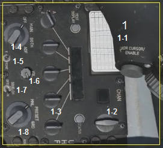{width="1.7183103674540683in"
height="1.5661351706036746in"}{width="3.625in"
height="1.0729166666666667in"}

***Manual Pitch Override Switch (Переключатель системы выбора
управления)***

В случае уменьшения скорости полёта до сваливания, переключатель
позволяет вам получить больше диапазон управления самолётом, чтобы
направить нос вниз, для более энергичного набора скорости и
контролируемого полета. Ограждения переключателя позволяют пилоту лучше
удерживать переключатель в случае нахождения самолёта в перевернутом
полёте, т.е. при нахождении пилота вниз головой в подвешенном положении
на ремнях безопасности.

.

***Canopy Jettison Handle Рукоятка сброса (управления) фонарём***

В случае крайней необходимости, вы можете потянуть за ручку сброса
фонаря. Это может быть использовано, если рукоятка сброса вытянута, но
фонарь не отделяется.

***De-Fog Lever (Рычаг вентиляции)***

Рычаг защиты от запотевания (не реализовано) можно перемещать вперед и
назад, чтобы обеспечить удаление запотевание с фонаря.

**ЛЕВАЯ КОНСОЛЬ (часть под РУД и перед ним)**

**33**

{width="5.200220909886264in"
height="3.6901410761154856in"}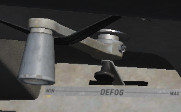{width="1.8875in"
height="1.16875in"}{width="1.542361111111111in"
height="0.8520833333333333in"}{width="0.9791666666666666in"
height="0.9152777777777777in"}

[]{#Правая_консоль .anchor}**Right Console (Правая консоль)**

***Sensor Power Control Panel (Панель управления сенсорами)***

Панель управления сенсорами состоит из четырех переключателей. Все они
представляют собой выключатели питания для включения и выключения
питания Сhin pod stations (питание подвесного контейнера на пилонах,
левый и правый пилоны фюзеляжа), Fire control radar (радар управления
оружием или FCR), и Radar altimeter (радиовысотомер).

***HUD Remote Control Panel***

Как следует из названия, панель управления HUD определяет, что и как
отображается информация для HUD. Назначение органов управления подробно
описана в разделе HUD ниже.

***Interior Lighting Control Panel***

Панель освещения кокпита состоит из трех ручек, которые включают и
контролируют яркость приборов кабины. Большая часть освещения кокпита
зеленого цвета для поддержки систем ночного видения. Ручка основных
консолей управляет освещением левой и правой консолей. Основная ручка
панели приборов устанавливает освещение панели приборов и
вспомогательных панелей. Ручка освещения первичного ввода данных
управляет освещением DED и PFLD дисплеи.

Выключатель яркости устанавливает указатель AОA, индикаторы управления
носового колеса / заправки, DED, панель управления ECM, MFD, PFLD и
индикаторы предупреждения об угрозе либо на яркий, либо на тусклый.

Ручка усиления регулирует интенсивность свечения на приборной панели, а
ручка усиления регулирует интенсивность свечения на левой и правой
консоли.

**34**

{width="0.7106681977252843in"
height="1.468251312335958in"}{width="1.6340277777777779in"
height="2.1972222222222224in"}{width="1.0141437007874017in"
height="1.7449978127734034in"}{width="5.526526684164479in"
height="2.8802810586176726in"}

***Air Cond Control Panel***

Environmental Control System Panel (Панель системы обогрева) разделена
между установкой температуры в кабине и настройкой обдува источником
воздуха. Время работы не имеет никакой реальной функции в симуляторе, но
у ручки источника воздуха есть опции отключения т.е.\
закрывает все клапаны выпуска воздуха из двигателя; нормально
устанавливает ECS для автоматической работы; сброс - выравнивает
давление воздуха до давление наружного воздуха; и поршень закрывает
клапаны выпуска воздуха и сбрасывает давление в кабине.

***Secure Voice Panel***

Система защищенной голосовой связи используется в сочетании с
радиостанциями UHF и VHF для обеспечения защищенной голосовой связи.

***Voice Message Switch***

Переключатель блокировки голосовых сообщений позволяет отключить все
голосовые сообщения, если он настроен на запрет.

***Oxygen Panel***

Oxygen regulation panel (Панель управления подачей кислорода)
контролирует поток O2 в лицевую маску. Рычаг подачи позволяет системе
выключаться, подавать воздух во включенном положении, а также включать
дыхание под давлением для G с установкой PBG. Рычаг разбавления может
быть установлен на нормальную смесь O2 или 100% 02, а аварийный рычаг
может установить систему между аварийным, нормальным и тестом маски. В
верхней части панели находится индикатор, который показывает PSI
(давление) системы O2.

***Engine Anti Ice Switch***

Аnti-ice system (Противообледенительная система) предотвращает
образование льда на датчиках и двигателе. Он активируется путем
установки переключателя в положение ON (Вкл.) или его можно установить в
положение AUTO, и он автоматически включается, если обнаружено
обледенение. OFF (Выкл) отключает систему.

***ANT SEL Panel***

Два переключателя на панели выбора антенн позволяют выбрать верхнюю, обе
или только нижние антенны для радиостанций IFF и UHF.

***Avionics Power Panel***

Панель управления питанием авионики имеет следующие переключатели:

• Питание на модульном компьютере или MMC.

• Питание на подвесках или ST STA.\
• Питание двух MFD.\
• Питание для внешних элементов управления или UFC.

• Также есть переключатель питания карты, но он не используется в Block
50 Viper.

• Питание на приемник GPS

• Питание для Data Link (передачи данных), или DL.

**35**

{width="1.8169017935258094in"
height="0.9839370078740157in"}{width="2.316901793525809in"
height="1.0198643919510062in"}{width="1.9225349956255469in"
height="0.5550164041994751in"}{width="0.8521128608923885in"
height="0.5659208223972003in"}{width="0.6834744094488189in"
height="1.5935640857392825in"}{width="1.6194444444444445in"
height="0.9718318022747157in"}

***Inertial navigation system***

Инерциальная навигационная система, или селектор INS, имеет выбор для
выключенного, сохраненного и нормального выставления при запуске на
земле. Режимы выставления, обычная навигация INS, режим выставление
полета и ориентации, или режим ATT, который позволяет правильное
выставить INS путем полета стабильного положения, чтобы позволить GPS
обновить INS.

***Мultifunctional information distribution***

Многофункциональная система распространения информации, или ручка MIDS,
которая может отключить MIDS, радионавигацию (в том числе ТАКАN) или
обнулить все данные.

***Zeroize Switch***

В чрезвычайной ситуации, например, при аварийной посадке на вражеской
территории, переключатель обнуления может стереть все конфиденциальные
данные из всех систем, таких как защищенный голосовой канал, ключи GPS и
другие.

**Правая консоль**

\\

**36**

{width="0.9335739282589677in"
height="1.0776246719160105in"}{width="1.0845067804024497in"
height="1.1525688976377952in"}{width="1.1368547681539807in"
height="1.0845067804024497in"}{width="7.401408573928259in"
height="2.8534416010498687in"}

[]{#HOTAS .anchor}**HANDS-ON CONTROLS (HOTAS)**

Управление, иногда называемое «Руки на газе и ручке» (HOTAS), позволяет
управлять цифровой системой управления системами самолёта, не отрывая
рук от органов управления полетом. Переключатели на РУД и РУС (РУ)
позволяют практический взаимодействовать с системой управления огнем и
выполнять различные функции доставки оружия. Некоторые из этих
выключателей универсальны, и их функция в любое время зависит от
основного режима, режима доставки оружия и мета нахождения датчика
интереса (SOI).

[]{#РУС .anchor}**Stick (РУС)**

Основной функцией РУC (РУ) является подача команд тангажа и крена для
маневрирования самолёта. Усилие на РУ влияет на высоту самолета
(перемещает стабилизаторы) и перемещает РУ из стороны в сторону на точке
крепления (перемещает флапероны и стабилизаторы).

На РУ есть несколько кнопок и переключателей, которые позволяют
управлять различными системы, не отрывая рук от ОУ.

**WPN REL Button**. Нажмите и удерживайте кнопку, чтобы выполнить пуск
АСП класса «воздух-земля», включая бомбы, ракеты и ракеты класса
«воздух-поверхность».

**Trigger Switch.** Нажатие переключателя до первого фиксатора включает
лазер, если подвешен контейнер. Нажатие на переключатель далее фиксатора
выполнение стрельбы из пушки, если она выбрана.

**NWS A/R DISC MSL STEP Button**. Эта кнопка имеет разные функции в
зависимости от состояния самолета:

-   Управление передним колесом шасси **Nose-wheel Steering**. На земле,
    кратковременное нажатие кнопки включает управление. Нажатие кнопки
    во второй раз отключает рулевое управление.

-   Отключение A/R. **A/R Disconnect.** Когда в полете выполняется
    дозаправка и переключатель AIR REFUEL в положении ОТКРЫТО, нажатие
    кнопки отключает блокировку штанги.

-   Выбор ракет. **Missile Step** Находясь в полете, нажатие кнопки в
    режиме EO или A-A выбирает следующую точку подвески ракеты. Нажатие
    кнопки в режиме A-G циклически выбирает CCRP, CCIP и DTOS

**37**

{width="5.450694444444444in"
height="3.5305555555555554in"}

**TRIM Button**. Кнопка TRIM. Позиционирование кнопки вперед и назад
снимает нагрузку с РУС по тангажу. Позиционирование кнопки влево и
вправо снимает нагрузку с РУС по крену.

**Display Management Switch (DMS) (Переключатель управления дисплеем)**

DMS используется для управлением выбора сенсора внимания (SOI).

**Target Management Switch (TMS). (Переключатель управления
целеуказанием)**

TMS используется для выбора целей и управление данными для радара,
ракеты AGM-65 Maverick и контейнера.

**38**

{width="4.854166666666667in"
height="4.515503062117236in"}{width="4.21875in"
height="4.21875in"}

**Countermeasures Management Switch (CMS).**

CMS управляет отстрелом дипольных отражателей и тепловых ловушек, а
также работу модуля ECM (постановка помех), если он установлен.

**Expand/FOV Button.** Нажатие на эту кнопку переключает доступное поле
обзора для датчика или системы, которые выбраны в данный момент.

**Paddle Switch (not shown).** Приостанавливает работу автопилота.

**39**

  **Direction**   **Function**
  --------------- --------------------------------------
  Вперёд          Отстрел согласно ручной программе
  Назад           Включает SEMI и запускает AUTO режим
  Влево           Не задействовано
  Вправо          Отключает AUTO режим
                  

[]{#РУД .anchor}**Throttle (РУД)**

Двигатель управляется РУД, установленным над левой консолью с
фиксаторами в положениях OFF, IDLE, MIL и MAX AB. Положение ВЫКЛ (OFF)
прекращает работу систем зажигание двигателя и подачи топлива. Система
IDLE управляет минимальной тягой и используется для запусков на земле и
воздушных запусков. От IDLE до MIL, РУД управляет мощностью двигателя в
полёте.

При положении далее за положения MIL (вперёд) РУД управляет работой
форсажной камеры.

РУД также содержит переключатели, которые обеспечивают различные системы
управления. Как и в случае с ручкой управления, функции РУД HOTAS
различаются в зависимости от состояния систем и режима полета самолета.
Они рассматриваются в соответствующих разделах этого документа.

**UHF VHF Transmit Switch.** Подключает радиостанции UHF (назад) и VHF
(вперёд) для передачи.

**Manual Range/Uncage/Gain (MAN RNG/UNCAGE/GAIN) Control**. Имеет
различные функции в зависимости от основного режима и выбранной системы.

**Вращение регулятора** управляет уровнем масштабирования видео с
контейнера (Targeting Pod).

**Нажатие переключателя** выдает команду головке AIM-9 или AGM-65
сбросить текущий захват и выполнить поиск цели.

**Dogfight/Missile Override (DOGFIGHT) Switch**. DOGFIGHT - это
трехпозиционный переключатель, который отменяет любой режим, кроме
аварийного сброса. Возврат переключателя в центральное положение
приводит к последнему выбранному режиму Master.

-   **DOGFIGHT (outboard):** выводит символы на HUD как для стрельбы
    20-мм пушкой, так и для пусков ракет A-A.

-   **Missile Override (inboard)**: эта позиция выводит символы только
    для стрельбы ракет A-A.

**Antenna Elevation (ANT ELEV) Knob**. Ручка ANT ELEV используется для
ручной установки угла места антенны радара.

**Cursor/Enable (CURSOR/ENABLE) Control**. Этот элемент управления
используется для управления курсора радара управления огнем или видео
TGP / оружия.

-   Нажатие на кнопку управления изменяет опцию BORE / SLAVE для ракет
    AIM-9 и AIM-120 в режиме A-A Master.

-   Нажатие кнопки управления переключит опции RE / VIS / BORE для ракет
    AGM-65 в режиме A-G Master.

**Speed brake Switch**. **SPD BRK Switch.** Выпуск (назад) положение
позволяет ступенчато выпустить тормозные щитки. Закрыть (переднее)
положение убирает тормозные щитки.

**40**

{width="5.570833333333334in"
height="2.752083333333333in"}

UHF VHF Transmit Switch\
(4-Way)

MAN RNG / UNCAGE / Gain\
Knob / Switch (Rotate, Depress)

DOG FIGHT Switch\
(3-Position, Slide)

SPD BRK Switch\
(3-Position, Aft\
Momentary)

ANT ELEV Knob\
(Rotate, Center Detent)

RDR CURSOR / ENABLE Switch\
(Depress, Multidirectional)

[]{#SOI_Сенсор_внимания .anchor}**Sensor of Interest (SOI) (Сенсор
внимания)**

SOI – это особый элемент управления. Характеризует точку, куда
направлены сенсоры систем самолёта. Подобные функции активируются теми
же переключателями, для обеспечения согласованной работы независимо от
выбранного SOI или режима. Дальнейшая работа этих переключателей
подробно описана в обсуждениях соответствующего режима далее в этом
руководстве.

Текущий SOI можно определить по светлой рамке вокруг экрана MFD или по
звездочке (SOI Asterisk) в левом верхнем углу HUD.

Переключение SOI дисплея на дисплей с помощью переключателя управления
дисплеем (DMS).

Основные функциональные возможности, применяемые к SOI:

{width="2.285416666666667in"
height="1.5194444444444444in"}

-   **DMS FWD.** DMS Вперёд (короткое). SOI переходит в HUD, если
    система вооружения в режиме A-G Master.

-   **DMS AFT.** DMS Назад. (Короткое). SOI переходит от HUD к MFD с
    наивысшим приоритетом.

-   **DMS AFT.** DMS Назад (Длинное) Меняет SOI на другой MFD.

41

Display Management\
Switch

SOI Asterisk

{width="5.090972222222222in" height="2.49375in"}

[]{#UFC .anchor}**UPFRONT CONTROLS (UFC)**

Элементы управления (UFC) включают в себя Интегрированную панель
управления (ICP) и Дисплей ввода данных (DED). Они обеспечивают быстрый
доступ к навигационному управлению, радиочастотам и каналам, а также к
режимам и данным системы управления огнем. Большая часть вашего времени
будет потрачена на использование ICP для управления этими функциями, но
менее часто используемые функции, такие как питание и громкость звука,
расположены на панелях консоли.

Данные, доступные через ICP, отображаются на DED.

> Integrated Control Panel (ICP)
>
> Data Entry Display (DED)

Элементы управления доступны во время нормальной работы, когда ручка C&I
(панель управления IFF) установлена в положение UFC. Это обеспечивает
управление коммуникациями, навигацией и IFF, главным образом, с помощью
предварительного управления. В случае отказа управления с ICP положение
BACKUP обеспечивает альтернативную работу радиостанций TACAN и IFF с
использованием их панелей управления в кабине.

{width="3.922222222222222in" height="1.675in"}

**42**

{width="5.313194444444444in"
height="2.5868055555555554in"}

[]{#ICP_Панель_управления .anchor}**Integrated Control Panel (ICP)**
(**Интегрированная панель управления)**

ICP обеспечивает выбор основного режима применения АСП, управление
оборудованием связи, навигации и идентификации (CNI), ввод данных о
доставке оружия и контроль яркости / контрастности HUD.

COM 1 (UHF), COM 2 (VHF), IFF\
and LIST Override Buttons

Master Mode Buttons

Reticle Depression Control

HUD Symbology\
Brightness Knob

Recall (RCL) Button

ENTR Button

Priority Function\
Pushbuttons and\
Numeric Keyboard

HUD FLIR/TFR Controls\
(not used)

HUD Raster Bright\
Knob (not used)

HUD Raster Contrast\
Knob (not used)

DED Increment /\
Decrement switch

Data Control\
Switch (DCS)

Drift Cutout / Warning\
Reset Switch

Mode Select\
(M-SEL) Button

I 5J

**Master Mode Buttons** Кнопки основного режима. Нажатие этих кнопок
выбирает основной режим «воздух-воздух» или «воздух-земля». Это
настраивает системы самолета и отображает выбранный режим атаки одним
простым шагом. При повторном нажатии на ту же кнопку вы вернетесь в
предыдущий режим.

**Override Buttons.** Кнопки переназначения. Четыре кнопки отмены
обеспечивают быстрый выбор и управление системами с высоким приоритетом.
Они переназначают вывод данных на текущую страницу DED, чтобы показать
страницу, которая соответствует нажатой кнопке. При повторном нажатии
кнопки вы вернетесь на предыдущую страницу.

• COM 1 выбирает UHF (основную) страницу радио

• COM 2 выбирает страницу радио VHF (aux)

• IFF выбирает страницу IFF

• LIST отображает список менее часто используемых страниц, которые можно
выбрать, нажав соответствующий номер на клавиатуре.

**Priority Function Buttons.** Функциональные кнопки приоритета. Нажатие
одной из девяти отмеченных кнопок на клавиатуре выбирает соответствующую
страницу DED для этой? часто используемой функции. Затем клавиатура
может использоваться для ввода или изменения данных.

**Data Control Switch (DCS).** Переключатель управления данными (DCS).
Этот переключатель используется для перемещения звездочки на страницах
DED, для ввода в них значений, переключения между различными полями
данных, переключения данных ветра на странице CNI и возврата на страницу
CNI с других страниц.

**DED Increment/Decrement Switch.** DED Переключатель Увеличения /
Уменьшения. Этот переключатель увеличивает или уменьшает значения для
поля, выбранного на текущей странице DED. Значения, которые можно
увеличить или уменьшить, обозначены стрелками вверх и вниз рядом с ними
на дисплее. DCS используется для переключения между доступными полями.

**Mode Select (M-SEL) Button.** Кнопка выбора режима (M-SEL). Эта кнопка
используется на некоторых страницах для переключения между доступными
режимами.

**43**

{width="5.366666666666666in"
height="3.066666666666667in"}

**Enter (ENTR) Button.** Кнопка ввода (ENTR). Нажмите эту кнопку, чтобы
ввести числа, введенные в поле с клавиатуры.

**Recall (RCL) Button.** Кнопка стирания (RCL). Нажмите эту кнопку один
раз, чтобы стереть последнюю введенную цифру, то есть клавишу возврата.
Нажмите еще раз, чтобы восстановить первоначально введенное значение.

**Symbology Brightness (SYM) Knob.** Регулятор яркости символики (SYM).
Вращайте эту ручку, чтобы включить HUD и отрегулировать яркость
символов.

**Reticle Depression (RET DEPR) Control.** Контроль положения сетки (RET
DEPR). Эта ручка поднимает и опускает прижимную сетку, когда она
отображается на экране. Могут быть установлены значения от 0 до 260
миллирадиан.

**Drift Cutout (DRIFT C/O)/Warn Reset (WARN RESET) Switch.**
Переключатель отключения дрейфа (DRIFT C/O) / сброса предупреждения
(RESN). Этот переключатель используется для сброса мигающих
предупреждений, отображаемых на HUD, и для центрирования маркера
траектории полета и линии тангажа, когда они отклоняются от бокового или
бокового скольжения.

**44**

[]{#DED_Дисплей_ввода_данных .anchor}**Data Entry Display (DED) (Дисплей
ввода данных)**

Дисплей DED показывает цифровое отображение данных систем связи,
навигации и IFF (CNI). Различные страницы вызываются и управляются с
использованием элементов управления на ICP, как описано выше.

{width="5.259722222222222in"
height="3.2597222222222224in"}

[]{#CNI_Page .anchor}**CNI Page.** Сводная, начальная страница.

На этой странице отображается текущий канал или частота UHF и VHF, точки
управления, системное время, состояние IFF и канал TACAN. Данные о ветре
можно включать и выключать, переключая DCS в положение SEQ. Время
получения данных отображается под системным временем, если оно включено
на странице «Время». Страница CNI отображается при включении питания и
может быть доступна в любое время путем переключения переключателя DCS в
положение RTN.

**45**

{width="5.423611111111111in"
height="1.13580271216098in"}

**46-47**

[]{#ALOW_Page .anchor}**ALOW Page.** Страница Опасная высота.

На этой странице вы можете установить высоту звукового оповещения
ALTITUDE – ALTIUTUDE (ОПАСНАЯ ВЫСОТА), которое воспроизводит модуль
голосовых сообщений (VMU). Доступ к ней осуществляется с помощью кнопки
быстрого доступа ALOW (2).

**CARA ALOW.** VM VMU (речевой информатор) выдает сигнал ОПАСНАЯ ВЫСОТА
(ALTITUDE – ALTITUDE) - звуковое предупреждение, при снижении до высоты,
установленной в поле ввода CARA ALOW. Значение AL (высоты) также будет
мигать на HUD. Это сообщение основано на высоте полёта по **radar
altitude** (радиовысотомеру) и требует включения радиолокационного
высотомера.

Чтобы ввести новую высоту, DMS вверх или вниз, установите звездочки
(символ работы с параметром) в поле CARA ALOW. Введите новую высоту с
клавиатуры ICP и нажмите ENTR. Новая настройка будет видна на HUD.

**MSL FLOOR.** VM VMU выдает сигнал ОПАСНАЯ ВЫСОТА (ALTITUDE – ALTITUDE)
- звуковое предупреждение, при снижении до высоты, установленной в поле
ввода MSL FLOOR. Данное поле предназначено для ввода значений высоты,
измерение которой основано на измерении барометрической высоте полета.

Чтобы ввести новую высоту, DMS вверх или вниз, установите звездочки
(символ работы с параметром) в поле MSL FLOOR. Введите новую высоту с
клавиатуры ICP и нажмите ENTR. Новая настройка будет видна на HUD.

Эти звуковые сообщения не выводятся (заблокированы), при выпущенных
шасси.

{width="4.549479440069991in"
height="2.6953116797900263in"}{width="6.126910542432196in"
height="2.5234372265966756in"}

**48**

[]{#Time_Page .anchor}**Time Page.** Страница Время.

На этой странице отображаются текущая дата и время, используемые
системами авионики самолета.

Доступ к нему осуществляется с помощью кнопки быстрого доступа **Time**
(6).

**System (System time).** Системное время. Это время, используемое
авиационными системами для навигации. Системное время автоматически
вводится в систему авионики на основе данных GPS. Ручного ввода
системного времени не требуется. Однако, чтобы ввести новое системное
время, установите переключатель DCS вверх или вниз, пока звездочки
(символ работы с параметром) не будут рядом с полем системного времени.
Введите время с помощью клавиатуры ICP и нажмите кнопку ENTR.

**Hack (Hack Time)** Условное Время. Этот параметр ввода времени
позволяет использовать дополнительную временную привязку независимо от
системного времени. Примеры его использования включают в себя настройку
резервного времени для локального или другого заранее установленного
условного времени или при использование его в качестве секундомера для
навигации низкого уровня автоматизации.

Чтобы ввести новое время, установите переключатель DCS вверх или вниз,
пока звездочки не будут рядом с полем времени взлома. Введите время с
помощью клавиатуры ICP и нажмите кнопку ENTR. Новое условное время будет
отображаться здесь и на странице CNI.

-   При переводе переключателя INC/DEC в INC запускается таймер.
    > Повторное нажатие останавливает таймер.

-   При нажатии переключателя INC /DEC вниз до DEC таймер обнуляется.

**Delta TOS** (Delta Time on Station (TOS)) Изменение времени (дельта Т)
между временными моментами начала отсчета времени. Это позволяет
обновлять время на Station (станции, т.е. самолёте) для всех управляемых
моментов времени из одного места. Это может быть использовано, если,
например, плановое время выхода на цели для всех самолетов в группе для
нанесения удара изменяется.

TOS может быть обновлено путем ввода значения DELTA TOS на DED.
Введенное время будет добавлено или вычтено из всех значений TOS.
Диапазон значений может быть от -23: 59: 59 до 23:59:59.

**Data**. Дата. Здесь можно ввести новую дату в формате MM / DD / YY
(месяц/день/год).

{width="6.815104986876641in"
height="2.6406244531933507in"}

[]{#МФД .anchor}**MULITFUNCTION DISPLAYS (MFD) (МФД)**

Два цветных многофункциональных дисплея (MFD), левый и правый,
предоставляют видео и текстовые данные для следующих систем:

• Радар управления огнем (Fire Control Radar)

• Подвесной контейнер (Targeting Pod)

• AGM-65 видео с ГН (AGM-65 Weapon Video)

• Выбор и управления точками подвески (Stores Management Set)

• горизонтальный дисплей ситуации (Horizontal Situation Display)

• Оборудование для передачи данных (Data Transfer Equipment)

• Тесты (Tests)

• Управление полетом (Flight Controls)

Управление системами осуществляется с помощью кнопок выбора опций (OSB)
на экране дисплея каждого MFD Каждый OSB взаимодействует с текстом
(символом), отображаемым рядом с ним, для переключения между функциями
или выбора другой подстраницы.

{width="4.584722222222222in"
height="3.0256944444444445in"}

**49**

[]{#HSD_Дисплей_горизонтальной_ситуации .anchor}**Horizontal Situation
Display (HSD) (Дисплей горизонтальной ситуации)**

HSD отображает вид в плане вашей текущей тактической ситуации с
символами, представляющими положение вашего самолета (Ownship), текущую
точку полёта (ППМ), активный план полета и кольца дальности.

Тактическая информация также отображается на основе заранее
запланированных мест угроз, информации, полученной с помощью бортовых
датчиков, или информации, полученной через канал данных Link 16.
Смотрите раздел по Link 16 для получения подробной информации

**47**

{width="3.9323468941382327in"
height="2.349650043744532in"}

**48**

[]{#SMS_Управление_подвесками .anchor}**Stores Management Set (SMS)
(Управление подвесками)**

The Stores Management Set (SMS) MFD page. Страница и подстраницы MFD
набора управления подвесками (SMS) позволяют просматривать,
конфигурировать и отслеживать состояние загруженных на пилоны средств
АСП и иных устройств. Доступны различные варианты в зависимости от типа
выбранного оружия. Доступна страница инвентаризации, которая показывает
подвески, загруженные на каждом пилоне, и позволяет модифицировать их
при необходимости. Также доступна страница выборочного сброса, которая
позволяет выбрасывать выбранные подвески в безопасном состоянии.

Функции страницы SMS, относящиеся к нормальному применению оружия,
описаны в следующих разделах.

A/A Guns SMS Page

AIM-9 SMS Page

AIM-120 SMS Page

Bombs SMS Page

A/G Guns SMS Page

Rocket SMS Page

[]{#Страница_подвесок .anchor}**Inventory Page (Страница подвесок)**

Состояние подвесок на пилонах можно просмотреть или изменить, выбрав
кнопку **OSB4** рядом с мнемоникой **INV**. Здесь отображаются
загруженные подвески по пилонам, начиная с пилона 1 внизу слева и
заканчивая пилоном 9 внизу справа. Тип боеприпасов к оружию и количество
оставшихся патронов отображаются в правом верхнем углу.

{width="4.761043307086614in"
height="2.601398731408574in"}

**49**

[]{#Страница_выборочного_сброса .anchor}**Selective Jettison (S-J) Page
(Страница выборочного сброса)**

Эта страница позволяет сбросить выбранные подвески в безопасном
состоянии. Это обеспечивает большую гибкость в работе с подвесками,
которые должны быть сброшены, чем доступно с помощью кнопки Emergency
Jettison, которая сбрасывает все подвески, подлежащие сбросу.

Доступ к странице **S-J** осуществляется путем выбора **OSB11** рядом с
**S-J** в правом нижнем углу. Доступные для сброса подвески отображаются
и доступны для выбора. Нажатие OSB рядом с мнемоникой пилона/подвески
выделяет его для сброса.

Если на пилон загружено более одной сбрасываемого АСП или устройства,
например, подвеска на стойке TER-9, одно нажатие OSB выделяет подвеску,
а другое - как подвеску, так и пилон.

Выделенные подвески сбрасываются при нажатии кнопки **ПУСК** на РУС.

{width="4.617662948381453in"
height="2.8321675415573053in"}{width="3.0311154855643045in"
height="2.5205653980752407in"}

[]{#ИЛС .anchor}HEAD UP DISPLAY (HUD) (ИЛС)

Head Up Display, или HUD, является одним из ваших самых важных
инструментов и предоставляет ценную информацию о режиме полёта вашего
самолета и информацию об оружии / датчиках (сенсорах).

В последующих разделах этого руководства мы обсудим особенности и вид
HUD, характерные для определенного оружия и датчиков, но у HUD есть
общий набор информации, который почти всегда отображается в полёте.

Boresight Cross

Flight Path Marker |

Steering Cue

Horizon Line

> Steerpoint Symbol

Current G

> Attitude Bars
>
> Airspeed Scale

Baro Altitude Scale

> Master Arm Status

Radar Altitude

Mach

Altitude Low Setting

Max G

Slant Range

Time to Go

Bearing / Distance\
to Bullseye

Distance to Steerpoint /\
Steerpoint Number

Roll Indicator

EGI Magnetic Heading

PL 500\
B030.9 ■\
003:30 •\
030)001,

Вся информация отображается на стекле (ИЛС) , установленном перед полем
зрения пилота, на уровне глаз. Символы ориентированы на бесконечность и
накладываются на внешний мир вдоль траектории полета самолета.

Панель дистанционного управления HUD (правая консоль) обеспечивает
управление комплектом HUD.

С помощью Удаленной и Интегрированной панелью управления пилот управляет
отображаемой символикой. Данные HUD отображаются как функция выбранного
основного режима и подрежимов.

Поверхность дисплея имеет общее поле обзора 30 градусов в ширину и 20
градусов в высоту.

**50**

{width="5.320138888888889in"
height="3.020138888888889in"}

[]{#ИЛС_Панель_управления .anchor}HUD Remote Control Panel (ИЛС Панель
управления)

Как следует из названия, панель управления HUD определяет, что и как
отображается информация для HUD.

Панель состоит из восьми переключателей:

**Scales Switch.** Переключатель выбора отображения шкал. При установке
значения VV / VAH отображаются вертикальная шкала скорости, шкала
скорости, шкала высоты и лента курса. При установке на VAH отображаются
все шкалы, кроме вертикальной шкалы скорости. OFF (Выкл.) Удаляет все
шкалы, кроме цифровых показаний.

**Flight path Marker Switch.** Переключатель Маршрутного маркера. При
установке на ATT/FPM отображаются маркер траектории полета и контрольные
полосы положения самолёта. Если установлено значение FPM, отображается
только маркер траектории полета. OFF (Выкл.) удаляет оба.

**DED Data Switch.** Этот переключатель позволяет отображать данные с
этих дисплеев в HUD на основе выбора DED или PFLD. OFF (Выкл.) Не
отображает данных.

**Depressible Reticle Switch.** Переключатель сетки. Нажатие
переключателя прицельной сетки управляет выбором первичной и вторичной
резервной прицельной сетки на HUD. В режиме ожидания отображается сетка
в режиме ожидания и удаляются все другие символы HUD. Основной режим
показывает основную сетку, но не удаляет символы HUD. OFF (Выкл.) Не
отображает сетку.

**Velocity Switch.** Переключатель скорости. Переключатель воздушной
скорости позволяет отображать воздушную скорость в виде Калиброванной
воздушной скорости calibrated airspeed), Истинной воздушной скорости
(true airspeed) или Путевой скорости (скорости относительно земли)
(ground speed).

**Altitude Switch.** Переключатель высоты. Этот переключатель позволяет
ленте высоты показывать высоту по радиовысотомеру (radar altitude),
барометрическую высоту (barometric altitude) или автоматически
(automatic). Если задано автоматическое значение, высота по
радиовысотомеру отображается, когда высота полёта над уровнем земли ниже
1500 футов, а барометрическая высота - выше.

**Brightness Control Switch.** Переключатель яркости. Переключатель
яркости HUD имеет настройки яркости по умолчанию для дня и ночи и
функцию автоматической яркости, которая будет регулироваться
соответствующим образом.

**Test Switch.** Тестовый выключатель. Тестовый переключатель HUD может
отображать шаблон, когда он включен, или метки хэша, чтобы наилучшим
образом установить поле зрения (Design-Eye Seat Height), когда
установлено на шаг.

{width="4.0256944444444445in"
height="1.4673611111111111in"}

**51**

{width="8.272872922134733in"
height="10.975510717410323in"}

**.•35\***

NAVIGATION

НАВИГАЦИЯ

[]{#Навигация_INS .anchor}**Embedded GPS/INS (EGI) Navigation**

Система EGI является основной навигационной системой F-16C и
обеспечивает точную информацию об ориентации, навигации, а также
информацию о вертикальном и горизонтальном управлении. Up Front Controls
(UFC) являются основным устройством управления для EGI.

В этой главе по навигации мы обсудим практическое применение EGI для
целей навигации в полёте.

**INS Alignment** (**Селектор управления INS)**

Навигационная система может быть выставлена различными способами на
земле. Выставление начинается с установки ручки INS на панели питания
Avionics в нужное положение. Селектор INS устанавливается на NAV, когда
выставление завершено.

{width="4.389583333333333in"
height="1.9222222222222223in"}

**Normal (NORM) Alignment.** Нормальное (NORM) выставление является
основным режимом выставления. Для выставления NORM требуется примерно
четыре минуты.

**Stored Heading (STOR HDG) Alignment.** Выставление по
загруженному/сохраненному курсу (STOR HDG) позволяет выполнить быстрое
выставление за 30 секунд или менее в некоторых условиях. Это можно
использовать только в том случае, если самолет был предварительно
настроен специально для этого выставления системы.

**An Inflight Alignment (INFLT ALIGN).** Выставление в полете (INFLT
ALIGN) может быть выполнено в полете, если доступны данные GPS. Доступна
только ограниченная навигационная информация, пока выставление не
завершено.

**The Attitude (ATT) Alignment.** Выставление ориентации (ATT) можно
использовать в полете для восстановления информации об ориентации, если
она потеряна из-за сбоя в электросети. Навигационная информация
недоступна, пока не будет выполнено NORM или INFLT ALIGN.

[]{#_bookmark1 .anchor}

**53**

[]{#НАВИГАЦИЯ .anchor}**НАВИГАЦИЯ**

F-16C использует различные способы навигации, чтобы выполнить полёт по
заданию миссии. В зависимости от миссии или стадии миссии вы можете
использовать разные источники навигации. Хотя мы рассмотрели многие из
навигационных систем в главе «Элементы управления кабиной», в этой главе
по навигации будет рассмотрено практическое применение этих систем.

**54**

**Normal Gyrocompass (NORM) Alignment. Выставление (процедура)**

Выставление гирокомпаса (NORM)

Полное выставление INS в положении NORM должно выполняться перед каждым
полетом. Обычно оно запускается сразу после запуска двигателя и
включения авионики, чтобы дать время для полного выставления до руления.

***Процедура:***

1\. Установите ручку INS в положение NORM.

Это начинает выставление INS и вызывает страницу INS на DED. За ходом
выставления можно следить странице INS на DED.

**Time Into Alignment**. Время выставления. Это истекшее время в минутах
и десятичных секундах с начала выставления INS.

**Alignment Status**. Статус выставления. Это оценка качества
выставления. Значения отсчитываются от 99 со следующими значениями:

> • 99 - Инициализация
>
> • 90 - Действительные данные об ориентации, начинается грубое
> выставление
>
> • 79 - действительные данные курса
>
> • 70 - ухудшенное состояние навигации, постоянный RDY отображается на
> DED, постоянный ALIGN отображается на HUD
>
> • 60-20 - расчетная ошибка положения по сравнению с полностью
> выровненным состоянием; 60 = 6,0 раза больше нормы, 20 = 2,0 раза
> больше нормы
>
> • 10 - INS полностью выставлен, RDY мигает на DED, ALIGN мигает на HUD
>
> • 6 - INS полное выставление

**Latitude.** Широта. Широта стартовой позиции.

**Longitude**. Долгота. Долгота стартовой позиции.

**System Altitude**. Высота стартовой позиции. Высота, используемая
компьютером управления огнем для применения АСП А/G.

**True Heading.** Истинный курс. Последний известный истинный курс или
курс, полученный во время выставления

**Ground Speed.** Путевая Скорость. Текущая скорость относительно земли.

{width="5.041666666666667in"
height="1.2916666666666667in"}

**55**

2\. Введите широту, долготу и высоту для начального местоположения.

Последние известные координаты и оценка высоты отображаются в начале
выставления, однако данные должны быть введены повторно, даже если они
все еще верны.

Если данные точные, используйте DED-переключатель, чтобы выделить каждую
строку, и нажмите ENTR для каждой из них по очереди (подтвердите
значения). Если данные не точные, введите правильные данные для каждого
поля с помощью клавиатуры ICP.

Невозможность ввода данных отмечает выставления как ухудшенное и не
позволяет выполнять важные функции мониторинга в полёте. Также могут
возникнуть ошибки навигации, доставки оружия и прицеливания.

Выставление остановится и начнется снова, если новые данные введены
позднее, но не более чем через две минуты после выставления.

3\. Наблюдайте за ходом выставления. (по окончанию переключите ручку INS
в положение NAV).

4\. Когда **RDY** на DED и **ALIGN** на HUD начнут мигать, когда
выставления будет завершено. Это должно произойти за 8 минут или меньше.
Установите ручку INS в положение **NAV**, чтобы начать использование
системы.

{width="5.854166666666667in"
height="2.3854166666666665in"}{width="3.9479166666666665in"
height="1.2916666666666667in"}

[]{#ИЛС_Индикатор .anchor}**HUD Indication (ИЛС индикатор)**

Вы можете просмотреть свой текущий курс (МК) вверху или внизу HUD, в
зависимости от выбранного основного режима на Шкале курса или в центре
индикатора в квадрате EGI Magnelio Heading. Шкала курса показывает ваш
текущий магнитный курс, тот же, что и в обозначенном центральном
квадрате.

Символ Steering Cue показывает направление к выбранной точке ППМ
(steerpoint) . Если вы развернете самолет, чтобы выровнять Маркер
траектории полета (Flight Path Marker) помощью Steering Cue, вы
выполните полёт к текущему ППМ (steerpoint).

Flight Path Marker

56

Steering Cue

> Steerpoint Symbol

{width="5.320138888888889in"
height="3.020138888888889in"}

[]{#МФД_горизонтальной_ситуации .anchor}**Horizontal Situation Display
(HSD) Indication (МФД горизонтальной ситуации)**

Когда есть активная точка ППМ (active steerpoint), она будет
отображаться на HSD в виде сплошного круга. Другие ориентиры будут
отображаться в виде пустых кружков с линиями, соединяющими их все для
отображения маршрута. Flight Path – план полёта.

Маркер места (Ownship Marker) показывает текущее местоположение вашего
самолета.

{width="4.298611111111111in"
height="2.6104166666666666in"}

**57**

Steerpoints

Flight Path

Current Steerpoint

[]{#HSI__ПНП_горизонтальной_ситуации .anchor}**Horizontal Situation
Indicator (HSI) Indication **

**(Индикатор горизонтальной ситуации или Плановый навигационный
прибор**)

Индикатор HSI - ваш основной указатель, помогающий в навигации к ППМ,
маякам TACAN и радиомаякам.

Хотя вы, скорее всего, будете использовать символы на HUD для решения
большинства своих навигационных задач, необходимо четкое понимание
значение индикатора HSI для доступа к дополнительным навигационным
данным, которых нет на дисплеях HUD или DED, а также в случае их боевого
повреждения.

**Compass Card**. Вращающийся лимб Компаса. Расположенный по периферии
HSI, это компас, который вращается так, что верхняя часть компаса
указывает магнитный курс самолета.

**Aircraft Symbol.** Символ самолета. В центре индикатора находится
символ самолета, который всегда остается статичным. Все дисплеи HSI
имеют ссылку на этот символ.

**Lubber Line.** Штрих-линия курса. Это фиксированная линия, которая
проходит от символа самолета до верхней части шкалы. Эта строка
представляет текущий курс самолета относительно лимба компаса.

**Range Indicator.** Индикатор дальности. Указывая дальность в морских
милях, этот индикатор на «барабанах» с цифрами показывает наклонное
расстояние от вашего самолета до выбранной точки ППМ или станции TACAN.

**Bearing Pointer.** Указатель курса (длинная стрелка). Этот
стрелообразный индикатор перемещается за пределами лимба компаса и
указывает КУР или МПР (ИПР) на текущий ППМ или станцию ​​TACAN. В 180
градусах от стрелки Bearing Pointer находится Bearing Pointer «кончик
хвоста стрелки», который представляет собой обратный указатель курса
(МПС).

**Heading Set Knob.** Ручка установки Маркера курса (ЗМПУ или ЗИПУ).
Расположенная в левой нижней левой части индикатора, при вращении эта
ручка позволяет установить положение Маркера курса (Heading Marker) на
лимбе компаса.

**Heading Marker.** Маркер курса (ЗМПУ или ЗИПУ) Этот маркер, показанный
в виде двух толстых линий на внешней стороне лимба компаса, можно
перемещать вокруг лимба компаса с помощью Ручка установки Маркера курса
(Heading Set Knob). После установки этот Маркер вращается вместе с
лимбом компаса, чтобы обеспечить возможность выдерживание заданного
магнитного путевого угла (ЗМПУ или ЗИПУ).

58

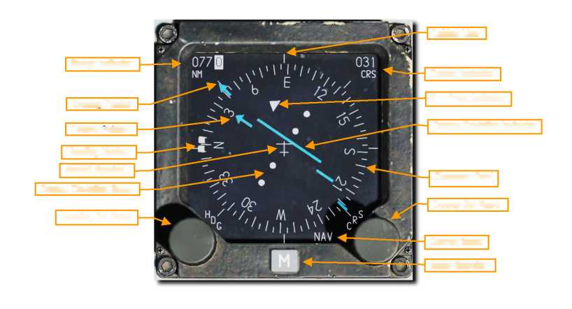{width="5.45296697287839in"
height="2.9469695975503063in"}

Range Indicator

Lubber Line

Course Indicator

To - From Indicator

Bearing Pointer

Course Deviation Indicator

Course Pointer

Heading Marker

Compass Card

Aircraft Symbol

Course Deviation Scale

Course Set Knob

Heading Set Knob

Current Mode

Mode Selector

**Course Set Knob.** Ручка установки Курса (МК или ИК). Расположенная в
правом нижнем углу индикатора, эта ручка при вращении позволяет
установить значение Курса следования (МК или ИК) в окне выбора курса и
перемещать стрелки курса по лимбу компаса.

**Course Indicator.** Индикатор курса. В этом окно отображается значение
установленных МК или ИК курсов с помощью Ручки установки курса (Course
Set Knob) в цифровом виде в градусах.

**Course Pointer.** Указатель Курс (короткая стрелка). Установленные
ручкой набора курса, эти короткие две линии представляют короткую
стрелку, и указывают произвольный заданный курс и обратный курс на лимбе
компаса.

**Course Deviation Indicator.** Индикатор отклонения от курса. Эта
Линия, проходящая через центральную зону датчика, показывает, насколько
точно вы летите по заданной линии полёта (ЛЗП). Когда линия проходит
через символ самолета в центре указателя, вы находитесь на ЛЗП выполняя
полет с необходимым курсом с учетом угла сноса. Если Линия смещена в
какую-то сторону, то Вы отклонились от ЛЗП вам нужно исправить курс,
чтобы вернуть самолет на ЛЗП.

**Course Deviation Scale.** Шкала отклонения от курса. С учетом
нахождения Индикатора отклонения от курса на той или иной отметке и
дальности до ППМ/РНТ, рассчитываются и вводятся поправки в курс полета.

**To-From Indicator.** Индикатор - указатель направления полёта
относительно радиомаяка. Эти два треугольника вдоль намеченной линии
курса указывают курс, выдерживая который самолет будет лететь к
выбранной станции или точке управления TACAN или от нее.

**Mode Selector.** Выбор режима. В данном окошке отображается режим
работы HSI: М – для выхода на ППМ (steerpoint) или TCN – для выхода на
РНТ (TACAN).

**59**

[]{#TACAN .anchor}TACAN (TCN) Navigation (Навигационная система TACAN)

Тактическая аэронавигационная система (TACAN) представляет собой
всемирный массив всенаправленных радиомаяков с уникальными кодами,
которые используются в основном военными самолетами. Гражданские
самолеты используют аналогичную систему под названием VOR (VHF
всенаправленного радиомаяка) в другом диапазоне частот. Многие станции
VOR связаны с TACAN. Эти станции передают оба сигнала, поэтому они могут
использоваться военными и / или гражданскими воздушными судами. Эти
станции известны как «VORTACS».

Маяки TACAN могут быть не только установлены на земле, но также могут
быть установлены на самолетах и кораблях (авианосцам). TACAN служит
средством для быстрой навигации в определенном месте.

TACAN является частью радиосистемы MIDS и должен быть включен поворотом
ручки MIDS LVT на панели питания авионики в положение ON. Громкость
звука TACAN регулируется на панели AUDIO 2.

Перед тем, как использовать TACAN, вы должны сделать следующее:

***1. Выберите станцию TACAN. ***

Текущая выбранная станция TACAN всегда отображается в правом нижнем углу
страницы DED CNI.

см. станция 1X выбрана в этом примере.

Чтобы выбрать новую станцию, нажмите функциональную кнопку приоритета
T-ILS на ICP. Это отображает страницу TACAN / ILS на DED. Информация о
системе TACAN отображается в левой половине страницы.

**60**

{width="4.692452974628171in"
height="2.0139851268591427in"}{width="2.0162631233595802in"
height="0.7762237532808399in"}{width="4.503642825896763in"
height="3.0559437882764655in"}

***2. На ICP переключите переключатель DCS вниз, чтобы выделить поле
CHAN.***

Используйте клавиатуру ICP для ввода нового канала. Нажмите ENTR, чтобы
принять изменения.

В этом примере канал 25 введен. Система определила его как маяк GTB,
станция TACAN в Тбилиси.

3\. При необходимости вы можете изменить диапазон, нажав кнопку M-SEL (0)
на ICP и далее и нажав ENTR. Это переключает диапазон между X и Y. Для
этого примера мы переключим диапазон между X и Y для Y -диапазона.

***4. На панели ICP переключите DCS вправо для переключения между
следующими параметрами: REC, T / R, A / A REC или A / A T / R. REC. ***

TACAN работает только в режиме приема и обеспечивает направление,
отклонение от курса и идентификацию станции.

**61**

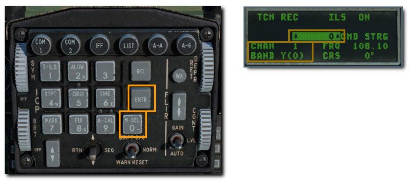{width="4.825694444444444in"
height="2.1465277777777776in"}
{width="4.468031496062992in"
height="1.9440562117235345in"}

**Режим T / Р.** TACAN работает в режиме приемопередатчика (отправка и
получение) и обеспечивает определение направления, дальности, отклонения
и станции. Это будет ваш самый распространенный выбор.

**Режим A / A REC**. TACAN работает в режиме «воздух-воздух» и может
принимать только направление, отклонение от курса и идентификацию
станции для самолета, оборудованного TACAN.

**Режим A / A T / R.** TACAN работает в режиме приемопередатчика типа
«воздух-воздух» и обеспечивает определение направления, дальности,
отклонения и станции с помощью самолета, оборудованного TACAN.

В большинстве случаев вы будете использовать TACAN в режиме T / R.

5\. Переключите DCS влево на RTN. Это вернет вас на страницу CNI, где ваш
новый канал TACAN отображается в правом нижнем углу.

**62**

{width="2.188888888888889in"
height="0.8597222222222223in"}{width="4.69245406824147in"
height="2.013986220472441in"}

Navigate to Selected TACAN Station (Выбор станции TACAN на HSI)

После того, как действующая и необходимая для полёта станция TACAN была
введена в DED, станция находится в пределах рабочего диапазона для
навигационной системы, информация о ППМ (steering information) доступна
на HIS.

Нажимайте кнопку выбора режима «М» на HSI, пока в Поле режима (Mode
Selector) не отобразится TCN. Операция идентична навигации по ППМ
(steerpoint) , за исключением того, что указатель направления указывает
на станцию TACAN вместо ППМ.

***Примечание:*** Навигация с помощью системы TACAN считаются надежными
только для удалений от станций не более 130 морских миль (130nm),
поэтому максимальное расстояние между станциями TACAN обычно составляет
260 морских миль (260 nм).

**63**

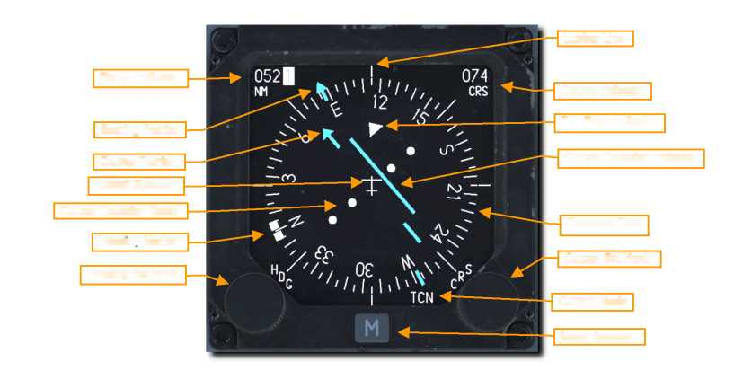{width="5.441287182852143in"
height="2.8560608048993874in"}

Lubber Line

Course Indicator

Range Indicator

To - From Indicator

Bearing Pointer

Course Deviation Indicator

Course Pointer

Aircraft Symbol

Course Deviation Scale

Compass Card

Course Set Knob

Heading Marker

Heading Set Knob

Current Mode

Mode Selector

[]{#ILS .anchor}Instrument Landing System (ILS) Navigation
(Инструментальная система посадки (ILS)

Заход и посадка с использованием Инструментальной системы посадки (ILS)
обычно используется в условиях Правил полетов по приборам (IFR) при
посадках ночью или в СМУ. При использовании ILS предоставляет информацию
о вертикальном и горизонтальном положении самолёта на глиссаде посадки,
для её выдерживания, чтобы выполнить безопасное снижение и посадку.

Частота ILS устанавливается с помощью Up Front Controls (UFC), а на HSI
выбирается управление ILS. Затем информация о положении самолёта на
глиссаде выводится НUD, ADI и HSI. Система ILS обеспечивает безопасный
заход на посадку после 4-го разворота, т.е. на посадочной прямой.

В дополнение к показаниям прибора, ILS обеспечивает пилота звуковой
сигнализацией, которая оповещает о пролете над посадочными маяками. Вы
можете настроить громкость звука на панели управления Аudio 2.

Большинство, но не все взлетно-посадочные полосы допускают приземления в
любом направлении (в зависимости от направления ветра у земли). Система
ILS должна использоваться для соответствующей посадочной полосы в
соответствии с указаниями УВД.

Система ILS должна быть включена вращением ручки ILS на панели
управления Аudio 2 из положения OFF.

**64**

***Примечание:*** система ILS принимает сигналы в диапазоне частот 108,1
- 111,95 МГц. Частоту для любой взлетно-посадочной полосы, оборудованной
для ILS, можно увидеть на карте Планировщика полетов перед началом
миссии или в игре, используя вид карты F10.

Нажмите на любой аэродром, и информация будет отображаться.

В примере мы настроим систему на посадку на ВПП аэродрома в Вазиани 31,
используя частоту 108,75.

{width="5.482638888888889in"
height="4.132638888888889in"}{width="3.3987478127734034in"
height="1.2587412510936133in"}

2\. На ICP переключите переключатель DCS вниз, чтобы выделить поле FREQ.
Используйте клавиатуру ICP для ввода новой частоты.

Нажмите ENTR, чтобы принять изменения.

3\. Затем переключите переключатель DCS вниз, чтобы выделить поле CRS.
Используйте клавиатуру ICP для ввода курса, соответствующего активной
взлетно-посадочной полосе.

Нажмите ENTR, чтобы принять изменения.

В этом примере мы настроили систему на посадку на ВПП Вазиани 31,
используя частоту 108,75. CMD STRG подсвечивается, показывая, что сигнал
ILS принимается.

**66**

Select ILS Frequency (Установка частоты ILS)

1\. Чтобы выбрать новую станцию, нажмите кнопку функции приоритета T-ILS
на ICP. Это отображает страницу TACAN / ILS на DED. Информация о системе
ILS отображается в правой половине страницы.

{width="4.629515529308836in"
height="1.9790212160979876in"}{width="4.209936570428696in"
height="1.8041961942257219in"}

**67**

Navigate with ILS Glide Slope and Localizer (Навигация с помощью ILS
Glide Slope и Localizer)

После того, как действующая станция ILS была введена, и находится в
пределах рабочего диапазона дальности, а ILS выбран на панели выбора
режима навигации, вам будет предоставлена информация о положении
самолёта по ADI и HSI для выбранной станции (во многом аналогично
TACAN).

Выбор одного из режимов PLS (Precision Landing System) на HSI необходим
до того, как данные отклонения ILS (направления и глиссада) могут быть
отображены на HSI, HUD и ADI.

HSI Indications (ПНП индикатор)

Нажимайте кнопку выбора режима на HSI, пока не отобразится режим PLS NAV
или PLS TCN.

1\. Чтобы выбрать новую станцию, нажмите кнопку функции приоритета T-ILS
на ICP. Это отображает страницу TACAN / ILS на DED. Информация о системе
ILS отображается в правой половине страницы.

Данные идентичны данным по навигации для ППМ, за исключением того, что
указатель направления указывает на направление на станцию ILS, а не на
ППМ.

{width="4.755390419947506in"
height="2.461538713910761in"}

**68**

ADI Indications (Индикатор ADI)

ADI предоставляет указания, которые показывают ваше положение
относительно глиссады.

**Localizer and Glide Slope Bars.** Направление и траектория снижения.
Когда горизонтальная полоса расположена в центре на ADI, вы снижаетесь
по глиссаде, соответствующей глиссаде, задаваемой углом наклона системы
посадки на аэродроме. Если полоса находится выше центра ADI, это
означает, что вы находитесь ниже глиссады и вам необходимо уменьшить
скорость снижения. Вертикальная полоса направления показывает,
находитесь ли вы слева или справа от ВПП. Если полоса находится справа
от центра ADI, пролетите вправо, чтобы отцентрировать ее. Для
правильного подхода по глиссаде вы должны, выдерживать параметры захода
на посадку ток. чтобы два полосы были центрированы и образовывали
идеальный крест на ADI (он же «center the bars»).

**Glide Slope Deviation Scale and Glide Slope Indicator.** Шкала
отклонения глиссады и индикатор глиссады. Расположенный вдоль левой
стороны ADI, этот индикатор фиксированной шкалы и движущейся каретки
отображает положение глиссады относительно самолета. По сути, каретка -
это глиссада. Если это высоко, вы низко. Например: если каретка
находится на нижней точке, вы находитесь над глиссадой. Общая
терминология гласит: «Вы на высоте 2 точки». И наоборот, если каретка
находится на первой точке выше середины, вы находитесь ниже глиссады.
Термин будет «вы на 1 точку ниже». По общему правилу, если вы идете ниже
1 точки или выше 2 точек, вы пропускаете подход и попробуйте снова.

**Glide Slope and Localizer Warning Flags** (not visible).
Предупреждающие знаки о траектории и направлении (не видны на картинке).
Когда они отображается, то это означает, что существует проблема в
получении правильного сигнала системы ILS по глиссаде или направлению.

{width="4.440705380577428in"
height="2.286713692038495in"}

**69**

**HUD Indications (Индикация на HUD)**

HUD также показывает вашу позицию относительно глиссады. Данные
выводятся, если CMD STRG настроен на странице DED ILS.

**Loc** **Command Steering Symbol.** Командный символ. Этот символ будет
отображаться в HUD, чтобы указать вам направление захода, когда будут
получены действительные данные направления от системы посадки. При
приближении к центру глиссады на символе появляется отметка, указывающая
на то, что данные управления тангажом верны.

**Localizer and Glide Slope Bars.** Символы направление и траектория
снижения. Эти столбцы выполняют те же функции, что и на ADI. Когда
горизонтальная полоса отцентрирована на маркере траектории полета
(Flight Path Marker (FPM), вы летите по глиссаде, созданной посадочной
системой ILS. Если полоса находится выше центра FPM, это означает, что
вы находитесь ниже глиссады и вам необходимо увеличить высоту или
уменьшить вертикальную скорость снижения. Вертикальная полоса
направления показывает, находитесь ли вы слева или справа от ВПП. Если
полоса находится справа от центра FPM, пролетите вправо, чтобы
отцентрировать ее. Для правильного подхода к глиссаде вы хотите, чтобы
два стержня были центрированы и образовывали идеальный крест на FPM (он
же «center the bars»).

{width="4.713432852143482in"
height="2.559440069991251in"}

> RADIO COMMUNICATIONS
>
> РАДИОСВЯЗЬ

{width="8.314830489938757in"
height="10.909090113735783in"}

[]{#РАДИОСВЯЗЬ .anchor}**РАДИОСВЯЗЬ**

**Overview**

Для того, чтобы иметь радиосвязь с другими объектами миссии и
получать/передавать сообщения, очень важно, чтобы у вас были правильно
настроены радиостанции! Если нет, то вы будете разговаривать с самим
собой.

**Radio Frequencies**

Текущая частота для радиостанций UHF (COM 1) и VHF (COM 2) показана на
странице DED CNI.

{width="2.1819444444444445in"
height="0.8569444444444444in"}

Когда создается миссия, каждому дружественному борту и аэродрому
предоставляется частота VHF AM и UHF AM. Они обычно указываются в
брифинге миссии и должны быть установлены на ваши радиостанции в начале
миссии.

Как правило, применяются следующие правила:

-   Вашему звену чаще всего назначается частота УКВ (UHF). Вы будете
    использовать этот канал для связи между самолётами.

-   Другие дружественные полёты выполняются на общей частоте УВЧ,
    назначенной для рабочей зоны. При правильной настройке вы услышите
    радиосвязь с других самолётов, выполняющих полёты в этом районе.
    AWACS будет работать на этой общей частоте или ему будет назначена
    уникальная частота УВЧ (UHF).

-   JTAC чаще всего назначается уникальная частота УКВ (UHF).

-   Каждому УВД авиабазы назначается уникальная частота VHF AM и UHF.

Таким образом, вам, возможно, придется переключать несколько частот во
время миссии. Предустановленные функции частоты на радио станет большой
помощью.

**71**

**Preset Frequency Change (Ввод предустановленных каналов)**

1.  1\. *Нажмите кнопку выбора COM 1 или COM 2 на ICP.*

2.  *2. Введите желаемый предварительно настроенный канал и нажмите
    ENTR.*

3.  *Радио теперь будет передавать и принимать на новой
    предустановленной частоте.*

{width="4.623611111111111in"
height="2.0388888888888888in"}

1.  С выбранным предустановленным каналом вы можете переключаться между
    доступными каналами.

2.  4\. *Переключайте DCS вверх или вниз, пока стрелки не отобразятся рядом с
    предварительно установленным каналом.*

3.  *5. Используйте переключатель Increment/Decrement, чтобы изменить
    канал*.

{width="2.623611111111111in"
height="2.0388888888888888in"}

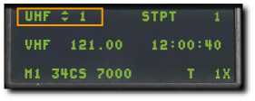{width="1.8701388888888888in"
height="0.7534722222222222in"}

**72**

**Manual Frequency Change (Ввод частоты канала)**

1.  *1. Нажмите кнопку выбора COM 1 или COM 2 на ICP.*

2.  *2. Введите необходимую частоту для радиосвязи и нажмите ENTR.*

3.  *3. Радио теперь будет передавать и принимать сообщения на новой
    частоте.*

{width="4.675in" height="2.0388888888888888in"}

**73**

**Radio Commands Радиосвязь**

Commands or requests to and from other agencies must be made through the
radio system. On the ground, the radio communications window may be
accessed by a press of the **\[\\\] backslash** key. Once airborne,
communications are only initiated using the HOTAS controls:

UHF VHF Transmit Switch**.**

-   Forward: VHF (Aux) radio \[**RCTRL + \\\]**

-   Aft: UHF (Prim) radio \[**RALT + \\\]**

-   Up: No function

-   Down: No function

{width="5.3358103674540684in"
height="1.4168219597550307in"}

There are two optional modes of using the radio that depend on the "EASY
COMMUNICATION" OPTION under the GAMEPLAY tab.

Easy Communication Not Enabled

This is the more realistic mode and requires you to know the correct
modulation / frequencies for each recipient.\
You must select the correct channel pre-set or manually enter the
frequencies on the correct radio.

Easy Communication Enabled

The radio communications window is accessed by a press of the \\
backslash key (this is for US keyboards; other language keyboards may
vary). Upon doing so, the list of radio command recipients is displayed
along with the function (Fx) key required to view its sub-command
window.

When the radio menu is displayed, recipients are color-coded as follows:

-   Recipients on which at least one of the radios is tuned to are
    > colored white.

-   Recipients on which at least one of the radios can be tuned to, but
    > are not currently on the correct frequency, are colored gray.

-   Recipients that cannot be contacted due to range or terrain masking
    > / earth curvature are colored black.

Each will also have their modulation / frequency listed. When you select
a recipient, the appropriate radio will automatically be tuned to
communicate with the selected recipient.

74

UHF VHF Transmit Switch\
(4-Way)

После того, как корреспондент будет выбран для связи, соответствующая
радиостанция будет автоматически настроена на правильную частоту.

Используя переключатель Mic, корреспонденты будут иметь цветовую
кодировку в соответствии с тем, что они находятся в той же модуляции,
что и выбранная радиостанция.

**75**

> PROCEDURES
>
> ПРОЦЕДУРЫ

{width="8.279865485564304in"
height="10.899370078740157in"}

[]{#ПРОЦЕДУРЫ .anchor}**ПРОЦЕДУРЫ**

[]{#Холодный_старт .anchor}**Cold Start (Холодный старт)**

Существует два метода запуска самолёта с отключенными системами
самолета.

Первый и самый простой - это автозапуск. Нажмите \[Left Win + Home\], и
самолет будет запущен

автоматически для вас. Чтобы прекратить автозапуск, вы можете нажмите
\[Left Win + End\].

Будучи гордостью DCS, самолет порадует Вас проработкой систем, когда вы
пользуетесь преимуществами детального моделирования систем, например,
запуск самолета вручную, так, как его выполняют летчики ВВС.

**77**

  ---------------------------------------------------------------------------------------------------------------------------------------------------------------------------------------------------------------------------------------------------------------
  **1.**   **MAIN PWR переключатель**                                                                                                                                                                                                      **BATT**
  -------- ------------------------------------------------------------------------------------------------------------------------------------------------------------------------------------------------------------------------------- ------------------- --
           Keyboard Command: N/A                                                                                                                                                                                                           

           a\. ***Убедитесь, что индикатор FLCS RLY включен***                                                                                                                                                                             
                                                                                                                                                                                                                                           
           > Количество энергии, доступной от батареи, ограничено, поэтому не оставляйте переключатель MAIN PWR в положении BATT или MAIN PWR более 5 минут. Запустите двигатель или подайте внешнее питание, если нужно больше времени.   

  **2.**   **FLCS PWR TEST переключатель**                                                                                                                                                                                                 **TEST and hold**

           Keyboard Command: N/A                                                                                                                                                                                                           

           a.  ***Проверьте огни на панели ELEC :***                                                                                                                                                                                       
                                                                                                                                                                                                                                           
           -   ***FLCS PMG on***                                                                                                                                                                                                           
                                                                                                                                                                                                                                           
           -   ***TO FLCS on***                                                                                                                                                                                                            
                                                                                                                                                                                                                                           
           -   ***FLCS RLY light turns off***                                                                                                                                                                                              
                                                                                                                                                                                                                                           
           -   ***Verify lights on TEST Panel:***                                                                                                                                                                                          
                                                                                                                                                                                                                                           
           -   ***FLCS PWR (4) on***                                                                                                                                                                                                       
                                                                                                                                                                                                                                           
           > Этот тест проверяет работу компьютера управления полетом с батареей самолета в качестве источника питания.                                                                                                                    

  **3.**   **FLCS PWR TEST переключатель**                                                                                                                                                                                                 **Release**

           Keyboard Command: N/A                                                                                                                                                                                                           

                                                                                                                                                                                                                                           
  ---------------------------------------------------------------------------------------------------------------------------------------------------------------------------------------------------------------------------------------------------------------

{width="1.1298611111111112in"
height="4.909027777777778in"}

{width="0.9868055555555556in"
height="6.1819444444444445in"}

78

+-----------------+-----------------+-----------------+-----------------+
| **4.**          | **MAIN PWR      | **MAIN PWR**    |                 |
|                 | переключатель** |                 |                 |
+=================+=================+=================+
|                 | Keyboard        |                 |
|                 | Command: N/A    |                 |
+-----------------+-----------------+-----------------+-----------------+
|                 | Verify lights   |                 |
|                 | on:             |                 |
|                 |                 |                 |
|                 | -   ***ENGINE** |                 |
|                 | *               |                 |
|                 |                 |                 |
|                 | -   ***HYD/OIL  |                 |
|                 |     > PRESS***  |                 |
|                 |                 |                 |
|                 | -   ***ELEC     |                 |
|                 |     > SYS***    |                 |
|                 |                 |                 |
|                 | -   ***SEC***   |                 |
|                 |                 |                 |
|                 | -   ***FLCS     |                 |
|                 |     > RLY***    |                 |
+-----------------+-----------------+-----------------+-----------------+
| **5.**          | **EPU GEN and   |                 |
|                 | EPU PMG lights  |                 |
|                 | Confirm off**   |                 |
+-----------------+-----------------+-----------------+-----------------+
|                 | Keyboard        |                 |
|                 | Command: N/A    |                 |
+-----------------+-----------------+-----------------+-----------------+
|                 | > Illumination  |                 |
|                 | > of either     |                 |
|                 | > light         |                 |
|                 | > indicates     |                 |
|                 | > criteria for  |                 |
|                 | > EPU           |                 |
|                 | > activation\   |                 |
|                 | > are met. The  |                 |
|                 | > EPU will      |                 |
|                 | > activate and  |                 |
|                 | > create a      |                 |
|                 | > hazardous\    |                 |
|                 | > condition if  |                 |
|                 | > the EPU       |                 |
|                 | > safety pin is |                 |
|                 | > removed by    |                 |
|                 | > the ground\   |                 |
|                 | > crew.         |                 |
|                 | >               |                 |
|                 | > Turn the MAIN |                 |
|                 | > PWR switch to |                 |
|                 | > OFF and abort |                 |
|                 | > the aircraft  |                 |
|                 | > (re-\         |                 |
|                 | > start the     |                 |
|                 | > mission) if   |                 |
|                 | > the lights    |                 |
|                 | > are on.       |                 |
+-----------------+-----------------+-----------------+-----------------+
| **6.**          | **JFS           | **START 2**     |                 |
|                 | переключатель** |                 |                 |
+-----------------+-----------------+-----------------+-----------------+
|                 | Keyboard        |                 |
|                 | Command: N/A    |                 |
+-----------------+-----------------+-----------------+-----------------+
|                 | > The JFS RUN   |                 |
|                 | > light         |                 |
|                 | > illuminates   |                 |
|                 | > within 30     |                 |
|                 | > seconds       |                 |
|                 | > indicating\   |                 |
|                 | > the Jet Fuel  |                 |
|                 | > Starter is    |                 |
|                 | > operational.  |                 |
|                 | > Engine rpm    |                 |
|                 | > should start\ |                 |
|                 | > to increase.  |                 |
|                 | >               |                 |
|                 | > Power is      |                 |
|                 | > applied to    |                 |
|                 | > the Flight    |                 |
|                 | > Control       |                 |
|                 | > System relays |                 |
|                 | > when\         |                 |
|                 | > the JFS       |                 |
|                 | > Switch is set |                 |
|                 | > to either     |                 |
|                 | > position. The |                 |
|                 | > FLCS RLY      |                 |
|                 | > light\        |                 |
|                 | > should turn   |                 |
|                 | > off and the   |                 |
|                 | > FLCS PMG      |                 |
|                 | > light and     |                 |
|                 | > ACFT BATT TO\ |                 |
|                 | > FLCS light    |                 |
|                 | > should        |                 |
|                 | > illuminate.   |                 |
|                 | >               |                 |
|                 | > The toe       |                 |
|                 | > brakes become |                 |
|                 | > functional at |                 |
|                 | > this point.   |                 |
+-----------------+-----------------+-----------------+-----------------+
| **7.**          | **At 20% RPM –  |                 |
|                 | РУД в положение |                 |
|                 | IDLE**          |                 |
+-----------------+-----------------+-----------------+-----------------+
|                 | Keyboard        |                 |
|                 | Command: RShift |                 |
|                 | + Home          |                 |
+-----------------+-----------------+-----------------+-----------------+
|                 | > Advance       |                 |
|                 | > throttle to   |                 |
|                 | > IDLE after 20 |                 |
|                 | > percent rpm   |                 |
|                 | > is reached.   |                 |
|                 | >               |                 |
|                 | > The engine    |                 |
|                 | > should        |                 |
|                 | > light-off     |                 |
|                 | > within 10     |                 |
|                 | > seconds and   |                 |
|                 | > engine\       |                 |
|                 | > RPM and FTIT  |                 |
|                 | > should        |                 |
|                 | > increase.     |                 |
|                 | > Only the RPM  |                 |
|                 | > and FTIT\     |                 |
|                 | > indicators    |                 |
|                 | > function      |                 |
|                 | > until the     |                 |
|                 | > standby       |                 |
|                 | > generator is  |                 |
|                 | > on line.      |                 |
+-----------------+-----------------+-----------------+-----------------+

{width="1.038888888888889in" height="6.675in"}

79

+-----------------------------------+-----------------------------------+
| **8.**                            | **SEC caution light Off**         |
+===================================+===================================+
|                                   | Keyboard Command: N/A             |
+-----------------------------------+-----------------------------------+
|                                   | The SEC caution light goes off at |
|                                   | 20 percent rpm.                   |
+-----------------------------------+-----------------------------------+
| **9.**                            | **ENGINE warning light**          |
+-----------------------------------+-----------------------------------+
|                                   | Keyboard Command: N/A             |
+-----------------------------------+-----------------------------------+
|                                   | > The standby generator becomes   |
|                                   | > operational at\                 |
|                                   | > approximately 60% RPM. This     |
|                                   | > should extinguish the\          |
|                                   | > ENGINE warning light.           |
|                                   | >                                 |
|                                   | > Five to ten seconds after the   |
|                                   | > standby generator comes on\     |
|                                   | > line, the main generator comes  |
|                                   | > on line and the standby\        |
|                                   | > generator goes off line.        |
|                                   | >                                 |
|                                   | > Checking the SEAT NOT ARMED     |
|                                   | > caution light and three\        |
|                                   | > green WHEELS down lights are on |
|                                   | > prior to the main\              |
|                                   | > generator coming on line        |
|                                   | > confirms the emergency busses   |
|                                   | > are\                            |
|                                   | > being powered by the standby    |
|                                   | > generator.                      |
+-----------------------------------+-----------------------------------+
| **10.**                           | **JFS переключатель**             |
+-----------------------------------+-----------------------------------+
|                                   | Keyboard Command: N/A             |
+-----------------------------------+-----------------------------------+
|                                   | > The JFS should have             |
|                                   | > automatically shut down at\     |
|                                   | > approximately 55% RPM. Turn the |
|                                   | > JFS off if that did not\        |
|                                   | > occur.                          |
+-----------------------------------+-----------------------------------+
| **11.**                           | **ENGINE INSTRUMENTS**            |
+-----------------------------------+-----------------------------------+
|                                   | Keyboard Command: N/A             |
+-----------------------------------+-----------------------------------+
|                                   | Normal indications after engine   |
|                                   | start are:                        |
|                                   |                                   |
|                                   | -   ***HYD/OIL PRESS warning      |
|                                   |     > light - Off***              |
|                                   |                                   |
|                                   | -   ***FUEL FLOW - 700-1700       |
|                                   |     > pph***                      |
|                                   |                                   |
|                                   | -   ***OIL pressure - 15 psi      |
|                                   |     > (minimum)***                |
|                                   |                                   |
|                                   | -   ***NOZ POS - Greater than 94  |
|                                   |     > percent***                  |
|                                   |                                   |
|                                   | -   ***RPM - 62-80 percent***     |
|                                   |                                   |
|                                   | -   ***FTIT - 650° C or less***   |
|                                   |                                   |
|                                   | -   ***HYD PRESS A & B -          |
|                                   |     > 2850-3250 psi***            |
+-----------------------------------+-----------------------------------+

{width="1.038888888888889in"
height="4.7659722222222225in"}

80

+-----------------------+-----------------------+-----------------------+
| **12.**               | **PROBE HEAT Check**  |                       |
+=======================+=======================+=======================+
|                       | Keyboard Command: N/A |                       |
+-----------------------+-----------------------+-----------------------+
|                       | a.  PROBE HEAT        |                       |
|                       |     switch - PROBE    |                       |
|                       |     HEAT              |                       |
|                       |                       |                       |
|                       | -   ***Verify PROBE   |                       |
|                       |     > HEAT caution    |                       |
|                       |     > light off.***   |                       |
|                       |                       |                       |
|                       | -   ***Illumination   |                       |
|                       |     > means one or    |                       |
|                       |     > more probe      |                       |
|                       |     > heaters are     |                       |
|                       |     > inoperative or  |                       |
|                       |     > a failure of    |                       |
|                       |     > the monitoring  |                       |
|                       |     > system has      |                       |
|                       |     > occurred. PROBE |                       |
|                       |     > HEAT switch –   |                       |
|                       |     > TEST***         |                       |
|                       |                       |                       |
|                       | -   ***PROBE HEAT     |                       |
|                       |     > caution light   |                       |
|                       |     > should flash    |                       |
|                       |     > 3-5 times\      |                       |
|                       |     > per second.***  |                       |
|                       |                       |                       |
|                       | -   ***The probe heat |                       |
|                       |     > monitoring      |                       |
|                       |     > system is       |                       |
|                       |     > inoperative if  |                       |
|                       |     > this does not   |                       |
|                       |     > occur.***       |                       |
|                       |                       |                       |
|                       | -   ***PROBE HEAT     |                       |
|                       |     > switch - OFF*** |                       |
+-----------------------+-----------------------+-----------------------+
| **13.**               | **FIRE & OHEAT DETECT | **Test**              |
|                       | кнопка**              |                       |
+-----------------------+-----------------------+-----------------------+
|                       | Keyboard Command: N/A |                       |
+-----------------------+-----------------------+-----------------------+
|                       | > Verify ENG FIRE     |                       |
|                       | > warning light and   |                       |
|                       | > OVERHEAT caution    |                       |
|                       | > light\              |                       |
|                       | > illuminated when    |                       |
|                       | > button is pushed.   |                       |
|                       | >                     |                       |
|                       | > This checks for     |                       |
|                       | > continuity of the   |                       |
|                       | > fire and overheat   |                       |
|                       | > detection\          |                       |
|                       | > loops.              |                       |
+-----------------------+-----------------------+-----------------------+
| **14.**               | **MAL & IND LTS       | **Test**              |
|                       | кнопка**              |                       |
+-----------------------+-----------------------+-----------------------+
|                       | Keyboard Command: N/A |                       |
+-----------------------+-----------------------+-----------------------+
|                       | > All cockpit         |                       |
|                       | > warning, caution    |                       |
|                       | > and indicator       |                       |
|                       | > lights should\      |                       |
|                       | > illuminate when the |                       |
|                       | > button is           |                       |
|                       | > depressed.          |                       |
|                       | >                     |                       |
|                       | > Voice Message       |                       |
|                       | > System (VMS) audio  |                       |
|                       | > alerts should play  |                       |
|                       | > in\                 |                       |
|                       | > priority sequence   |                       |
|                       | > (i.e., PULLUP,      |                       |
|                       | > ALTITUDE, WARNING,\ |                       |
|                       | > etc.). A brief LG   |                       |
|                       | > warning horn should |                       |
|                       | > be heard prior to   |                       |
|                       | > the\                |                       |
|                       | > WARNING and CAUTION |                       |
|                       | > words.              |                       |
+-----------------------+-----------------------+-----------------------+

{width="1.038888888888889in"
height="5.038888888888889in"}

**81**

+-----------------+-----------------+-----------------+-----------------+
| **15.**         | **AVIONICS      | **Set**         |                 |
|                 | POWER Panel**   |                 |                 |
+=================+=================+=================+
|                 | Keyboard        |                 |
|                 | Command: N/A    |                 |
+-----------------+-----------------+-----------------+-----------------+
|                 | a.  MMC         |                 |
|                 |     switch -    |                 |
|                 |     MMC         |                 |
|                 |                 |                 |
|                 | b.  STA SEL     |                 |
|                 |     switch - ST |                 |
|                 |     SEL         |                 |
|                 |                 |                 |
|                 | c.  MFD         |                 |
|                 |     Switch -    |                 |
|                 |     MFD         |                 |
|                 |                 |                 |
|                 | d.  UFC         |                 |
|                 |     Switch -    |                 |
|                 |     UFC         |                 |
|                 |                 |                 |
|                 | e.  GPS         |                 |
|                 |     Switch - On |                 |
|                 |                 |                 |
|                 | f.  DL Switch - |                 |
|                 |     On          |                 |
|                 |                 |                 |
|                 | This applies    |                 |
|                 | power to the    |                 |
|                 | aircraft's      |                 |
|                 | avionics and    |                 |
|                 | begins\         |                 |
|                 | running         |                 |
|                 | built-in-test   |                 |
|                 | (BIT) checks.   |                 |
+-----------------+-----------------+-----------------+-----------------+
| **16.**         | **EGI/INS       | **Align**       |                 |
|                 | Knob**          |                 |                 |
+-----------------+-----------------+-----------------+-----------------+
|                 | Keyboard        |                 |
|                 | Command: N/A    |                 |
+-----------------+-----------------+-----------------+-----------------+
|                 | This begins     |                 |
|                 | alignment of    |                 |
|                 | the EGI/INS     |                 |
|                 | ring laser      |                 |
|                 | gyro\           |                 |
|                 | navigation      |                 |
|                 | system. A       |                 |
|                 | normal          |                 |
|                 | alignment takes |                 |
|                 | approximately\  |                 |
|                 | four minutes to |                 |
|                 | accomplish if   |                 |
|                 | the aircraft    |                 |
|                 | remains         |                 |
|                 | stationary.     |                 |
|                 |                 |                 |
|                 | The knob should |                 |
|                 | be set to NAV   |                 |
|                 | prior to taxi.  |                 |
+-----------------+-----------------+-----------------+-----------------+
| **17.**         | **SNSR PWR      | **Set**         |                 |
|                 | Panel**         |                 |                 |
+-----------------+-----------------+-----------------+-----------------+
|                 | Keyboard        |                 |
|                 | Command: N/A    |                 |
+-----------------+-----------------+-----------------+-----------------+
|                 | a.  LEFT HDPT   |                 |
|                 |     Switch -    |                 |
|                 |     OFF         |                 |
|                 |                 |                 |
|                 | b.  RIGHT HDPT  |                 |
|                 |     Switch - As |                 |
|                 |     Required    |                 |
|                 |                 |                 |
|                 | c.  FCR         |                 |
|                 |     Switch -    |                 |
|                 |     FCR         |                 |
|                 |                 |                 |
|                 | d.  RDR Alt     |                 |
|                 |     switch -    |                 |
|                 |     RDR ALT     |                 |
|                 |                 |                 |
|                 | Set RIGHT HDPT  |                 |
|                 | On if a         |                 |
|                 | Targeting Pod   |                 |
|                 | is installed on |                 |
|                 | the\            |                 |
|                 | hardpoint.      |                 |
|                 |                 |                 |
|                 | Radar and Radar |                 |
|                 | Altimeter       |                 |
|                 | transmission is |                 |
|                 | inhibited until |                 |
|                 | the\            |                 |
|                 | aircraft        |                 |
|                 | becomes         |                 |
|                 | airborne.       |                 |
|                 | Activation of   |                 |
|                 | these systems   |                 |
|                 | may\            |                 |
|                 | be delayed      |                 |
|                 | until just      |                 |
|                 | before takeoff  |                 |
|                 | if desired.     |                 |
+-----------------+-----------------+-----------------+-----------------+

{width="1.038888888888889in"
height="5.701388888888889in"}

71

  -------------------------------------------------------------------------------------------
  **18.**   **HUD Control Panel**                                         **As Desired**
  --------- ------------------------------------------------------------- ---------------- --
            Keyboard Command: N/A                                         

            Set switches to display you desired HUD symbology and\        
            format.                                                       

  **19.**   **C&I Knob**                                                  **UFC**

            Keyboard Command: N/A                                         

            This enables control of primary communications, navigation\   
            and identification functions from the upfront controls.       

  **20.**   **ECM panel As Required**                                     

            Keyboard Command: N/A                                         

                                                                          

  **21.**   **Throttle SPD BRK switch Cycle and Close**                   

            Keyboard Command: N/A                                         

            This verifies proper operation on the speedbrakes. Confirm\   
            visually and monitor speedbrake indicator.                    
  -------------------------------------------------------------------------------------------

{width="1.038888888888889in"
height="5.961111111111111in"}

**72**

+-----------------------------------+-----------------------------------+
| **22.**                           | **WHEELS down lights Check three  |
|                                   | green**                           |
+===================================+===================================+
|                                   | Keyboard Command: N/A             |
+-----------------------------------+-----------------------------------+
|                                   | This indicates all three landing  |
|                                   | gear are down and locked.         |
+-----------------------------------+-----------------------------------+
| **23.**                           | **SAI Set**                       |
+-----------------------------------+-----------------------------------+
|                                   | Keyboard Command: N/A             |
+-----------------------------------+-----------------------------------+
|                                   | Pull and rotate knob to uncage    |
|                                   | the stand-by attitude\            |
|                                   | indicator.                        |
+-----------------------------------+-----------------------------------+
| **24.**                           | **Engine SEC Mode Check**         |
+-----------------------------------+-----------------------------------+
|                                   | Keyboard Command: N/A             |
+-----------------------------------+-----------------------------------+
|                                   | a.  ENG CONT switch - SEC         |
|                                   |                                   |
|                                   | b.  SEC caution light - On        |
|                                   |                                   |
|                                   | c.  RPM - Stabilized.             |
|                                   |                                   |
|                                   | RPM may drop up to 10 percent     |
|                                   | from PRI value before\            |
|                                   | stabilizing. Stabilized SEC idle  |
|                                   | rpm may be up to 5 percent\       |
|                                   | lower than that in PRI.           |
|                                   |                                   |
|                                   | a.  Throttle - Snap to MIL and    |
|                                   |     then snap to IDLE when rpm\   |
|                                   |     reaches 85 percent. Check for |
|                                   |     normal indications and\       |
|                                   |     smooth operation.             |
|                                   |                                   |
|                                   | b.  NOZ POS - 5 percent or less   |
|                                   |     within 30 seconds after\      |
|                                   |     selecting SEC                 |
|                                   |                                   |
|                                   | c.  ENG CONT switch - PRI         |
|                                   |                                   |
|                                   | d.  SEC caution light - Off       |
|                                   |                                   |
|                                   | e.  NOZ POS - Greater than 94     |
|                                   |     percent                       |
|                                   |                                   |
|                                   | This checks engine operation in   |
|                                   | the Secondary Engine\             |
|                                   | Control (SEC) mode. This mode is  |
|                                   | selected in the case of\          |
|                                   | failure of the engine-mounted     |
|                                   | digital computer that controls\   |
|                                   | scheduling of engine fuel flow.   |
+-----------------------------------+-----------------------------------+

{width="1.038888888888889in"
height="4.298611111111111in"}

73

+-----------------+-----------------+-----------------+-----------------+
| **25.**         | **FLCS BIT**    | **Initiate and\ |                 |
|                 |                 | Monitor**       |                 |
+=================+=================+=================+
|                 | Keyboard        |                 |
|                 | Command: N/A    |                 |
+-----------------+-----------------+-----------------+-----------------+
|                 | a.  Flight      |                 |
|                 |     Controls -  |                 |
|                 |     Cycle       |                 |
|                 |                 |                 |
|                 | This is done in |                 |
|                 | preparation for |                 |
|                 | running the     |                 |
|                 | Flight Control\ |                 |
|                 | System (FLCS)   |                 |
|                 | bit check.      |                 |
|                 | Maximum stick   |                 |
|                 | inputs warm     |                 |
|                 | and\            |                 |
|                 | remove air      |                 |
|                 | bubbles from    |                 |
|                 | the hydraulic   |                 |
|                 | fluid           |                 |
|                 |                 |                 |
|                 | a.  Position    |                 |
|                 |     BIT switch  |                 |
|                 |     to BIT.     |                 |
|                 |                 |                 |
|                 | The RUN light   |                 |
|                 | on FLCP         |                 |
|                 | illuminates. At |                 |
|                 | successful\     |                 |
|                 | completion of   |                 |
|                 | BIT             |                 |
|                 | (approximately  |                 |
|                 | 45 seconds),    |                 |
|                 | the RUN light\  |                 |
|                 | goes off, the   |                 |
|                 | BIT switch      |                 |
|                 | returns to OFF, |                 |
|                 | and the FAIL    |                 |
|                 | light\          |                 |
|                 | and FLCS        |                 |
|                 | warning light   |                 |
|                 | remain off. A   |                 |
|                 | BIT pass        |                 |
|                 | message\        |                 |
|                 | appears on the  |                 |
|                 | FLCS MFD page.  |                 |
|                 |                 |                 |
|                 | Other tasks may |                 |
|                 | be completed    |                 |
|                 | while the FLCS  |                 |
|                 | BIT runs.       |                 |
+-----------------+-----------------+-----------------+-----------------+
| **26.**         | **FUEL QTY SEL  |                 |
|                 | knob Check**    |                 |
+-----------------+-----------------+-----------------+-----------------+
|                 | Keyboard        |                 |
|                 | Command: N/A    |                 |
+-----------------+-----------------+-----------------+-----------------+
|                 | a.  TEST - FR,  |                 |
|                 |     AL pointers |                 |
|                 |     indicate    |                 |
|                 |     2000(+-100) |                 |
|                 |     pounds and\ |                 |
|                 |     totalizer   |                 |
|                 |     indicates   |                 |
|                 |     6000        |                 |
|                 |     (+-100)     |                 |
|                 |     pounds. FWD |                 |
|                 |     and AFT\    |                 |
|                 |     FUEL LOW    |                 |
|                 |     caution     |                 |
|                 |     lights      |                 |
|                 |     illuminate. |                 |
|                 |                 |                 |
|                 | b.  NORM - AL   |                 |
|                 |     pointer     |                 |
|                 |     indicates   |                 |
|                 |     approximate |                 |
|                 | ly              |                 |
|                 |     2675/2810\  |                 |
|                 |     pounds. FR  |                 |
|                 |     pointer     |                 |
|                 |     indicates   |                 |
|                 |     approximate |                 |
|                 | ly              |                 |
|                 |     3100/3250\  |                 |
|                 |     pounds.     |                 |
|                 |                 |                 |
|                 | c.  RSVR - Each |                 |
|                 |     reservoir   |                 |
|                 |     indicates   |                 |
|                 |     approximate |                 |
|                 | ly              |                 |
|                 |     460/480\    |                 |
|                 |     pounds.     |                 |
|                 |                 |                 |
|                 | d.  INT WING -  |                 |
|                 |     Each wing   |                 |
|                 |     indicates   |                 |
|                 |     approximate |                 |
|                 | ly              |                 |
|                 |     525/550\    |                 |
|                 |     pounds.     |                 |
|                 |                 |                 |
|                 | e.  EXT WING -  |                 |
|                 |     Each        |                 |
|                 |     external    |                 |
|                 |     wing tank   |                 |
|                 |     indicates\  |                 |
|                 |     approximate |                 |
|                 | ly              |                 |
|                 |     3750/3925   |                 |
|                 |     pounds for  |                 |
|                 |     full tanks. |                 |
|                 |                 |                 |
|                 | f.  EXT CTR -   |                 |
|                 |     FR pointer  |                 |
|                 |     indicates   |                 |
|                 |     approximate |                 |
|                 | ly              |                 |
|                 |     1800/1890\  |                 |
|                 |     pounds for  |                 |
|                 |     full tank.  |                 |
|                 |     AL pointer  |                 |
|                 |     drops to    |                 |
|                 |     zero.       |                 |
|                 |                 |                 |
|                 | g.  FUEL QTY    |                 |
|                 |     SEL knob -  |                 |
|                 |     As desired  |                 |
+-----------------+-----------------+-----------------+-----------------+

{width="1.038888888888889in" height="5.3375in"}

**74**

+-----------------+-----------------+-----------------+-----------------+
| **27.**         | **DBU**         | **Check**       |                 |
+=================+=================+=================+
|                 | Keyboard        |                 |
|                 | Command: N/A    |                 |
+-----------------+-----------------+-----------------+-----------------+
|                 | a.  DIGITAL     |                 |
|                 |     BACKUP      |                 |
|                 |     switch -    |                 |
|                 |     BACKUP.     |                 |
|                 |     Verify that |                 |
|                 |     DBU\        |                 |
|                 |     ON warning  |                 |
|                 |     light       |                 |
|                 |     illuminates |                 |
|                 | .               |                 |
|                 |                 |                 |
|                 | b.  Operate     |                 |
|                 |     controls -  |                 |
|                 |     All         |                 |
|                 |     surfaces    |                 |
|                 |     respond     |                 |
|                 |     normally.   |                 |
|                 |                 |                 |
|                 | c.  DIGITAL     |                 |
|                 |     BACKUP      |                 |
|                 |     switch -    |                 |
|                 |     OFF. Verify |                 |
|                 |     that DBU    |                 |
|                 |     ON\         |                 |
|                 |     warning     |                 |
|                 |     light goes  |                 |
|                 |     off.        |                 |
|                 |                 |                 |
|                 | This checks     |                 |
|                 | operation of    |                 |
|                 | the digital     |                 |
|                 | backup          |                 |
|                 | software. It    |                 |
|                 | is\             |                 |
|                 | used if         |                 |
|                 | problems arise  |                 |
|                 | with the        |                 |
|                 | primary FLCS    |                 |
|                 | software.       |                 |
+-----------------+-----------------+-----------------+-----------------+
| **28.**         | **Trim**        | **Check**       |                 |
+-----------------+-----------------+-----------------+-----------------+
|                 | Keyboard        |                 |
|                 | Command: N/A    |                 |
+-----------------+-----------------+-----------------+-----------------+
|                 | a.  TRIM/AP     |                 |
|                 |     DISC        |                 |
|                 |     switch -    |                 |
|                 |     DISC        |                 |
|                 |                 |                 |
|                 | -   Stick TRIM  |                 |
|                 |     button -    |                 |
|                 |     Activate in |                 |
|                 |     roll and    |                 |
|                 |     pitch       |                 |
|                 |                 |                 |
|                 | -   No control  |                 |
|                 |     surface     |                 |
|                 |     motion      |                 |
|                 |                 |                 |
|                 | -   No TRIM     |                 |
|                 |     wheel or    |                 |
|                 |     indicator   |                 |
|                 |     motion      |                 |
|                 |                 |                 |
|                 | a.  TRIM/AP     |                 |
|                 |     DISC        |                 |
|                 |     switch -    |                 |
|                 |     NORM        |                 |
|                 |                 |                 |
|                 | -   Stick TRIM  |                 |
|                 |     button -    |                 |
|                 |     Check and   |                 |
|                 |     center      |                 |
|                 |                 |                 |
|                 | -   Control     |                 |
|                 |     surface     |                 |
|                 |     motion      |                 |
|                 |                 |                 |
|                 | -   TRIM wheel  |                 |
|                 |     and         |                 |
|                 |     indicator   |                 |
|                 |     motion      |                 |
|                 |                 |                 |
|                 | a.  Rudder trim |                 |
|                 |     check.      |                 |
|                 |                 |                 |
|                 | -   YAW TRIM    |                 |
|                 |     knob -      |                 |
|                 |     Check and   |                 |
|                 |     center      |                 |
+-----------------+-----------------+-----------------+-----------------+
| **29.**         | **MPO**         | **Check**       |                 |
+-----------------+-----------------+-----------------+-----------------+
|                 | Keyboard        |                 |
|                 | Command: N/A    |                 |
+-----------------+-----------------+-----------------+-----------------+
|                 | a.  Stick -     |                 |
|                 |     Full        |                 |
|                 |     forward and |                 |
|                 |     hold; note  |                 |
|                 |     horizontal  |                 |
|                 |     tail\       |                 |
|                 |     deflection. |                 |
|                 |                 |                 |
|                 | b.  MPO         |                 |
|                 |     switch -    |                 |
|                 |     OVRD and    |                 |
|                 |     hold;       |                 |
|                 |     confirm     |                 |
|                 |     that        |                 |
|                 |     horizontal  |                 |
|                 |     tail\       |                 |
|                 |     trailing    |                 |
|                 |     edges move  |                 |
|                 |     farther     |                 |
|                 |     down.       |                 |
|                 |                 |                 |
|                 | c.  Stick and   |                 |
|                 |     MPO         |                 |
|                 |     switch -    |                 |
|                 |     Release;    |                 |
|                 |     confirm     |                 |
|                 |     that the\   |                 |
|                 |     horizontal  |                 |
|                 |     tail        |                 |
|                 |     returns to  |                 |
|                 |     its         |                 |
|                 |     original    |                 |
|                 |     position.   |                 |
+-----------------+-----------------+-----------------+-----------------+

{width="1.038888888888889in"
height="6.013194444444444in"}

75

+-----------------+-----------------+-----------------+-----------------+
| **30.**         | **EPU FUEL      | **Check 95-102  |                 |
|                 | quantity**      | percent**       |                 |
+=================+=================+=================+
|                 | Keyboard        |                 |
|                 | Command: N/A    |                 |
+-----------------+-----------------+-----------------+-----------------+
|                 | This indicates  |                 |
|                 | the percentage  |                 |
|                 | of hydrazine    |                 |
|                 | remaining.      |                 |
+-----------------+-----------------+-----------------+-----------------+
| **31.**         | **EPU Check**   |                 |
+-----------------+-----------------+-----------------+-----------------+
|                 | Keyboard        |                 |
|                 | Command: N/A    |                 |
+-----------------+-----------------+-----------------+-----------------+
|                 | a.  OXYGEN -    |                 |
|                 |     100%        |                 |
|                 |                 |                 |
|                 | b.  Engine      |                 |
|                 |     rpm -       |                 |
|                 |     Increase 10 |                 |
|                 |     percent     |                 |
|                 |     above       |                 |
|                 |     normal idle |                 |
|                 |                 |                 |
|                 | c.  EPU/GEN     |                 |
|                 |     TEST        |                 |
|                 |     switch -    |                 |
|                 |     EPU/GEN and |                 |
|                 |     hold.       |                 |
|                 |     Check\      |                 |
|                 |     lights:     |                 |
|                 |                 |                 |
|                 | -   EPU AIR     |                 |
|                 |     light - On  |                 |
|                 |                 |                 |
|                 | -   EPU GEN and |                 |
|                 |     > EPU PMG   |                 |
|                 |     > lights -  |                 |
|                 |     > Off (may  |                 |
|                 |     > come\     |                 |
|                 |     > on        |                 |
|                 |     > momentari |                 |
|                 | ly              |                 |
|                 |     > at start  |                 |
|                 |     > of test)  |                 |
|                 |                 |                 |
|                 | -   FLCS PWR    |                 |
|                 |     lights - On |                 |
|                 |                 |                 |
|                 | -   EPU run     |                 |
|                 |     light - On  |                 |
|                 |     for a       |                 |
|                 |     minimum of  |                 |
|                 |     5 seconds   |                 |
|                 |                 |                 |
|                 | -   EPU/GEN     |                 |
|                 |     TEST        |                 |
|                 |     switch -    |                 |
|                 |     OFF         |                 |
|                 |                 |                 |
|                 | a.  Throttle -  |                 |
|                 |     IDLE        |                 |
|                 |                 |                 |
|                 | b.  OXYGEN -    |                 |
|                 |     NORMAL      |                 |
|                 |                 |                 |
|                 | This check      |                 |
|                 | verifies EPU    |                 |
|                 | electrical      |                 |
|                 | power is        |                 |
|                 | available in    |                 |
|                 | case\           |                 |
|                 | of an           |                 |
|                 | emergency. It   |                 |
|                 | may be delayed  |                 |
|                 | until just      |                 |
|                 | before takeoff\ |                 |
|                 | if desired.     |                 |
+-----------------+-----------------+-----------------+-----------------+
| **32.**         | **Avionics**    | **Program as    |                 |
|                 |                 | required**      |                 |
+-----------------+-----------------+-----------------+-----------------+
|                 | Keyboard        |                 |
|                 | Command: N/A    |                 |
+-----------------+-----------------+-----------------+-----------------+
|                 | Use the time on |                 |
|                 | the ground as   |                 |
|                 | your INS aligns |                 |
|                 | to check and\   |                 |
|                 | set your        |                 |
|                 | systems for the |                 |
|                 | assigned        |                 |
|                 | mission. Things |                 |
|                 | to\             |                 |
|                 | consider        |                 |
|                 | include SMS     |                 |
|                 | pages and       |                 |
|                 | profiles, radio |                 |
|                 | channels\       |                 |
|                 | and             |                 |
|                 | frequencies,    |                 |
|                 | navigation      |                 |
|                 | data, bingo     |                 |
|                 | fuel settings,  |                 |
|                 | ALOW\           |                 |
|                 | settings and    |                 |
|                 | any other       |                 |
|                 | system          |                 |
|                 | applicable to   |                 |
|                 | the mission.    |                 |
+-----------------+-----------------+-----------------+-----------------+

[]{#Руление .anchor}**Taxi (перед рулением)**

Независимо от того, выполнили ли вы холодный старт или начинаете миссию
на «горячем» самолете, ваш следующий шаг - руление на взлетную полосу.

Когда вы будете готовы начать выруливание, медленно сдвиньте РУД вперёд,
(от себя). \[PAGE UP\] или \[Num +\] и используйте педали руля
направления для поворота влево \[Z\] и вправо \[X\]. Уменьшите скорость
руления, сдвинув РУД назад (на себя). нажав \[PAGE DOWN\] или \[Num-\].
Нажмите \[W\], чтобы использовать тормоза колёс.

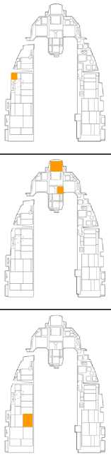{width="1.0256944444444445in"
height="4.298611111111111in"}

76

+-----------------------+-----------------------+-----------------------+
| **1.**                | **Canopy**            | **Close and Lock**    |
+=======================+=======================+
|                       | Keyboard Command:     |
|                       | LCtrl + C             |
+-----------------------+-----------------------+-----------------------+
|                       |                       |
+-----------------------+-----------------------+-----------------------+
| **2.**                | **Altimeter**         | **Set and Check**     |
+-----------------------+-----------------------+-----------------------+
|                       | Keyboard Command: N/A |
+-----------------------+-----------------------+-----------------------+
|                       | Verify altitude       |
|                       | displayed on your HUD |
|                       | matches the altitude\ |
|                       | on your altimeter.    |
|                       |                       |
|                       | Check that the        |
|                       | altimeter readings in |
|                       | ELECT and PNEU are\   |
|                       | +-75 feet of a known  |
|                       | elevation and are     |
|                       | +-75 feet of one\     |
|                       | another.              |
+-----------------------+-----------------------+-----------------------+
| **3.**                | **Exterior Lights**   | **As required**       |
+-----------------------+-----------------------+-----------------------+
|                       | Keyboard Command: N/A |
+-----------------------+-----------------------+-----------------------+
|                       |                       |
+-----------------------+-----------------------+-----------------------+

{width="1.0256944444444445in"
height="5.753472222222222in"}

77

+-----------------------+-----------------------+-----------------------+
| **4.**                | **EGI Knob**          | **NAV**               |
+=======================+=======================+
|                       | Keyboard Command: N/A |
+-----------------------+-----------------------+-----------------------+
|                       |                       |
+-----------------------+-----------------------+-----------------------+
| **5.**                | **NWS**               | **Engage**            |
+-----------------------+-----------------------+-----------------------+
|                       | Keyboard Command: N/A |
+-----------------------+-----------------------+-----------------------+
|                       | Press the NWS/AR Disc |
|                       | button on your stick. |
|                       | The NWS/AR\           |
|                       | light right of the    |
|                       | HUD should illuminate |
|                       | to indicate NWS is\   |
|                       | engaged.              |
+-----------------------+-----------------------+-----------------------+
| **6.**                | **Throttle**          | **Advance**           |
+-----------------------+-----------------------+-----------------------+
|                       | Keyboard Command: N/A |
+-----------------------+-----------------------+-----------------------+
|                       | A throttle setting    |
|                       | just beyond idle will |
|                       | be required to begin\ |
|                       | rolling. Return       |
|                       | throttle to idle      |
|                       | after desired speed   |
|                       | is reached.           |
+-----------------------+-----------------------+-----------------------+
| **7.**                | **Brakes and NWS**    | **Check**             |
+-----------------------+-----------------------+-----------------------+
|                       | Keyboard Command: N/A |
+-----------------------+-----------------------+-----------------------+
|                       | Gently test the       |
|                       | brakes and nosewheel  |
|                       | steering immediately\ |
|                       | after your aircraft   |
|                       | begins to move        |
|                       | forward.              |
|                       |                       |
|                       | Heat may build up     |
|                       | quickly if brakes are |
|                       | used for an extended\ |
|                       | period so do not ride |
|                       | the brakes to control |
|                       | taxi speed. Use\      |
|                       | one firm application  |
|                       | of the toe brakes to  |
|                       | slow the aircraft.    |
+-----------------------+-----------------------+-----------------------+

{width="1.0256944444444445in"
height="1.363888888888889in"}

78

  ---------------------------------------------------------------------------------------
  **8.**   **Heading and Flight Instruments**                                 **Check**
  -------- ------------------------------------------------------------------ -----------
           Keyboard Command: N/A                                              

           Verify aircraft heading updates as your aircraft turns and that\
           all instruments behave as expected.
  ---------------------------------------------------------------------------------------

[]{#Взлёт .anchor}Before Takeoff (Перед взлетом)

Часть проверок систем и оборудования должна быть выполнена
непосредственно перед ВПП. Некоторые аэродромы имеют безопасные зоны, в
которых вы можете временно остановиться, чтобы освободить рулежную
дорожку для другого самолёта.

Вы также можете выполнить эти проверки, остановившись на рулежной
дорожке перед ВПП.

{width="1.2208333333333334in"
height="5.83125in"}

79

  ------------------------------------------------------------------------------------------------------------------------------------------------------------------------------------------------------------------------------------------------------------------------
  **1.**   **PROBE HEAT переключатель**
  -------- --------------------------------------------------------------------------------------------------------------------------------------------------------------------------------------------------------------------------------------------- -----------------
           Keyboard Command: N/A

           **Обогрев ПВД. **
           
           Его надо включиь как минимум за две минуты до взлета, если существуют условия обледенения. Задержка включения обогрева как можно дольше до взлета, если на земле отсутствует обледенение, предотвратит перегрев и повреждение оборгева ПВД.

  **2.**   **ALT FLAPS переключатель**

           Keyboard Command: N/A

           

  **3.**   **Trim **

           Keyboard Command: N/A

           **Триммер.**
           
           установка тангажа и рыскания - по центру
           
           установка по крену - по необходимости
           
           Это окончательная проверка правильности настроек триммера до взлета и проверка того. Не были ли они случайно изменены .

  **4.**   **ENG CONT switch Verify PRI (gd down)**

           Keyboard Command: N/A

           
  ------------------------------------------------------------------------------------------------------------------------------------------------------------------------------------------------------------------------------------------------------------------------

{width="1.0256944444444445in"
height="5.701388888888889in"}

80

+-----------------------+-----------------------+-----------------------+
| **5.**                | **Canopy Verify       |                       |
|                       | closed, locked, light |                       |
|                       | off**                 |                       |
+=======================+=======================+=======================+
|                       | Keyboard Command: N/A |                       |
+-----------------------+-----------------------+-----------------------+
|                       |                       |                       |
+-----------------------+-----------------------+-----------------------+
| **6.**                | **STORES CONFIG       | **As Required**       |
|                       | switch**              |                       |
+-----------------------+-----------------------+-----------------------+
|                       | Keyboard Command: N/A |                       |
+-----------------------+-----------------------+-----------------------+
|                       | In general:           |                       |
|                       |                       |                       |
|                       | CAT I: Air to Air     |                       |
|                       | loadouts without      |                       |
|                       | external wing tanks.  |                       |
|                       |                       |                       |
|                       | CAT III: Air to       |                       |
|                       | Ground loadouts, or   |                       |
|                       | any loadout with      |                       |
|                       | external\             |                       |
|                       | wing tanks.           |                       |
+-----------------------+-----------------------+-----------------------+
| **7.**                | **Speedbrakes**       | **Verify closed**     |
+-----------------------+-----------------------+-----------------------+
|                       | Keyboard Command: N/A |                       |
+-----------------------+-----------------------+-----------------------+
|                       |                       |                       |
+-----------------------+-----------------------+-----------------------+
| **8.**                | > **IFF**             | **Set and check**     |
+-----------------------+-----------------------+-----------------------+
|                       | > Keyboard Command:   |                       |
|                       | > N/A                 |                       |
+-----------------------+-----------------------+-----------------------+
|                       |                       |                       |
+-----------------------+-----------------------+-----------------------+

{width="1.0256944444444445in"
height="5.792361111111111in"}

81

+-----------------------+-----------------------+-----------------------+
| **9.**                | **External Tanks      |                       |
|                       | Verify Feeding**      |                       |
+=======================+=======================+=======================+
|                       | Keyboard Command: N/A |                       |
+-----------------------+-----------------------+-----------------------+
|                       | Wing external fuel    |                       |
|                       | tanks should feed     |                       |
|                       | first and have a      |                       |
|                       | lower\                |                       |
|                       | quantity than at      |                       |
|                       | engine start. The     |                       |
|                       | internal wing tanks   |                       |
|                       | should\               |                       |
|                       | be full.              |                       |
|                       |                       |                       |
|                       | If three external     |                       |
|                       | tanks are installed,  |                       |
|                       | verify that the       |                       |
|                       | centerline\           |                       |
|                       | tank is feeding. This |                       |
|                       | action checks that    |                       |
|                       | pressurization is\    |                       |
|                       | available to all      |                       |
|                       | tanks.                |                       |
+-----------------------+-----------------------+-----------------------+
| **10.**               | **FUEL QTY SEL knob   |                       |
|                       | NORM**                |                       |
+-----------------------+-----------------------+-----------------------+
|                       | Keyboard Command: N/A |                       |
+-----------------------+-----------------------+-----------------------+
|                       | The FUEL QTY SEL knob |                       |
|                       | must be set to the    |                       |
|                       | NORM position\        |                       |
|                       | to allow the          |                       |
|                       | automatic forward     |                       |
|                       | fuel transfer system, |                       |
|                       | trapped\              |                       |
|                       | fuel warning, and for |                       |
|                       | the BINGO fuel        |                       |
|                       | warning computation   |                       |
|                       | to\                   |                       |
|                       | be based on fuselage  |                       |
|                       | fuel.                 |                       |
+-----------------------+-----------------------+-----------------------+
| **11.**               | **Flight Controls**   | > **Cycle**           |
+-----------------------+-----------------------+-----------------------+
|                       | Keyboard Command: N/A |                       |
+-----------------------+-----------------------+-----------------------+
|                       | This is to verify     |                       |
|                       | freedom of movement   |                       |
|                       | and ensure controls\  |                       |
|                       | are not obstructed.   |                       |
+-----------------------+-----------------------+-----------------------+
| **12.**               | **OIL Pressure**      | **Check psi**         |
+-----------------------+-----------------------+-----------------------+
|                       | Keyboard Command: N/A |                       |
+-----------------------+-----------------------+-----------------------+
|                       | Normal indication is  |                       |
|                       | 15-65 psi             |                       |
+-----------------------+-----------------------+-----------------------+

{width="1.038888888888889in"
height="4.298611111111111in"}

82

+-----------------------+-----------------------+-----------------------+
| **13.**               | **All warning and     |                       |
|                       | caution lights        |                       |
|                       | Check**               |                       |
+=======================+=======================+=======================+
|                       | Keyboard Command: N/A |                       |
+-----------------------+-----------------------+-----------------------+
|                       | Verify no unexpected  |                       |
|                       | indications.          |                       |
+-----------------------+-----------------------+-----------------------+
| **14.**               | **TGP Stow (if        |                       |
|                       | installed)**          |                       |
+-----------------------+-----------------------+-----------------------+
|                       | Keyboard Command: N/A |                       |
+-----------------------+-----------------------+-----------------------+
|                       | Targeting Pod is      |                       |
|                       | stowed by selecting   |                       |
|                       | STBY on the           |                       |
|                       | Targeting\            |                       |
|                       | Pod Control Page.     |                       |
|                       |                       |                       |
|                       | This is done prior to |                       |
|                       | takeoff and before    |                       |
|                       | landing to prevent\   |                       |
|                       | foreign object damage |                       |
|                       | to components.        |                       |
+-----------------------+-----------------------+-----------------------+
| **15.**               | **Ejection safety     |                       |
|                       | lever Arm (down)**    |                       |
+-----------------------+-----------------------+-----------------------+
|                       | Keyboard Command: N/A |                       |
+-----------------------+-----------------------+-----------------------+
|                       | This arms the         |                       |
|                       | ejection seat and     |                       |
|                       | allows ejection when  |                       |
|                       | the\                  |                       |
|                       | ejection handle is    |                       |
|                       | pulled. This is       |                       |
|                       | delayed for as long   |                       |
|                       | as\                   |                       |
|                       | possible to prevent   |                       |
|                       | inadvertent ejection  |                       |
|                       | on the ground.\       |                       |
|                       | Egress through other  |                       |
|                       | means is usually      |                       |
|                       | preferable.           |                       |
+-----------------------+-----------------------+-----------------------+

Takeoff (Взлёт)

После того, как выстроитесь в очередь для взлета на ВПП, вы можете
выполнить окончательную проверку перед взлетом:

{width="1.038888888888889in"
height="5.779166666666667in"}

83

+-----------------+-----------------+-----------------+-----------------+
| **1.**          | **Brakes**      | **Hold**        |                 |
+=================+=================+=================+
|                 | Keyboard        |                 |
|                 | Command: N/A    |                 |
+-----------------+-----------------+-----------------+-----------------+
|                 |                 |                 |
+-----------------+-----------------+-----------------+-----------------+
| **2.**          | **Parking Brake |                 |
|                 | Verify          |                 |
|                 | disengaged**    |                 |
+-----------------+-----------------+-----------------+-----------------+
|                 | Keyboard        |                 |
|                 | Command: N/A    |                 |
+-----------------+-----------------+-----------------+-----------------+
|                 |                 |                 |
+-----------------+-----------------+-----------------+-----------------+
| **3.**          | **Throttle**    | **90% RPM**     |                 |
+-----------------+-----------------+-----------------+-----------------+
|                 | Keyboard        |                 |
|                 | Command: N/A    |                 |
+-----------------+-----------------+-----------------+-----------------+
|                 | Check for       |                 |
|                 | normal engine   |                 |
|                 | indications:    |                 |
|                 |                 |                 |
|                 | -   HYD/OIL     |                 |
|                 |     PRESS       |                 |
|                 |     warning     |                 |
|                 |     light - Off |                 |
|                 |                 |                 |
|                 | -   OIL         |                 |
|                 |     > pressure  |                 |
|                 | -               |                 |
|                 |     > 25-65 psi |                 |
|                 |     > (must     |                 |
|                 |     > increase  |                 |
|                 |     > as RPM\   |                 |
|                 |     > increases |                 |
|                 | )               |                 |
|                 |                 |                 |
|                 | -   FTIT - 935° |                 |
|                 |     C or less   |                 |
|                 |                 |                 |
|                 | -   HYD PRESS A |                 |
|                 |     & B -       |                 |
|                 |     2850-3250   |                 |
|                 |     psi         |                 |
+-----------------+-----------------+-----------------+-----------------+
| **4.**          | **Brakes**      | **Released**    |                 |
+-----------------+-----------------+-----------------+-----------------+
|                 | Keyboard        |                 |
|                 | Command: N/A    |                 |
+-----------------+-----------------+-----------------+-----------------+
|                 |                 |                 |
+-----------------+-----------------+-----------------+-----------------+

{width="1.2986111111111112in"
height="2.9090277777777778in"}

Осторожно потяните ручку на себя и установите тангаж для взлёта взлета
(8-12 градусов) на скорости примерно на 10 узлов ниже скорости взлета
для взлетной мощности или на 15 узлов ниже скорости взлета для форсаже.

Раннее Взятие РУС на себя может привести к потере управляемости на
взлёте из-за раннего отрыва на низкой скорости и увеличивает взлетную
дистанцию для набора безопасной скорости для взлета.

Убедитесь, что установлена необходимая скорость набора высоты, и уберите
шасси. Закрылки убираются одновременно с шасси и могут привести к тому,
что самолет незначительно уменьшит вертикальную скорость набора высоты
или потеряет высоту.

Шасси должно быть включено и заблокировано до превышения 300 узлов.
Более высокие воздушные скорости могут отсоединить проводку и другие
компоненты или вызвать структурное повреждение дверей шасси.

Crosswind Takeoff

При взлете с боковым ветром, самолет будет разворачивать на ветер
(стремиться развернуться против ветра). Это приведет к увеличению
подъёмной силы на одном из крыльев. Чтобы парировать возникающее
кренение на взлёте, вы должны двинуть РУС на ветер (влево или вправо).
Это поможет выдержать правильное положение на отрыве. Вы также должны
движением педалей удержать самолёт в направлении взлета, на осевой линии
ВПП, не допуская его увода влево или вправо.от использовать небольшой
ввод руля, чтобы держать прямой взлет по центру ВПП.

Во время увеличения тангажа будьте осторожны, и плавно действуйте
органами управления. Плавно. При правильном угле тангажа и направлении
на разбеге и отрыве полета маркер траектории полета (FPM) должен быть
выровнен по взлетно-посадочной полосе, не зависимо от направления и
величины силы ветра относительно направления взлёта.

84

  ---------------------------------------------------------------------------
  **5.**   **Throttle Advance to desired thrust**                          
  -------- --------------------------------------------------------------- --
           Keyboard Command: N/A                                           

           Engine FTIT and RPM should stabilize within 5-15 seconds\       
           while on the takeoff roll. Check for normal acceleration and\   
           normal engine indications.                                      

  **6.**   **NWS Disengage at 70 Knots**                                   

           Keyboard Command: N/A                                           

                                                                           
  ---------------------------------------------------------------------------

Normal Flight

There are no specific procedures to follow once airborne. You will need
to rely on your own understanding of aircraft systems and basic flight
to keep the aircraft in one piece and accomplish the mission.

In-Flight Checks

At frequent intervals, check the aircraft systems, engine instruments,
cockpit pressure, and oxygen flow indicator and system operation.
Monitor fuel in each internal and external tank to verify that fuel is
transferring properly by rotating the FUEL QTY SEL knob and checking
that the sum of the pointers and totalizer agree, and that fuel
distribution is correct.

Trimming the Aircraft

The Flight Control System does a great job of maintaining aircraft trim
but there are some situations where you will need to manually trim the
aircraft. When out of trim, you will notice the aircraft wanting to
pitch, roll or yaw (roll being the most common).

The trim switch on the stick is used to move the control stick to a new
"neutral "position. For example: if the nose wants to raise, you can
input some nose down trim that will move the stick forward to a new
neutral position. This relieves you from maintaining continuous pressure
on the stick to maintain level flight when out of trim.

{width="1.6912871828521434in"
height="1.5227274715660541in"}

Trim Switch

The most common need for trim is when stores are released that cause an
asymmetric configuration. For example, releasing a bomb from a left wing
station but not the right will cause a roll to the right, in the
direction of the heavier wing. Roll trim will be required for the
aircraft to maintain wings level flight with no stick input.

85

97

[]{#Дозаправка_в_воздухе .anchor}Air Refueling (Дозаправка в воздухе)

В некоторых миссиях Вам может потребоваться дозаправка в воздухе, чтобы
у хватило топлива, чтобы добраться до цели и благополучно вернуться на
базу. Даже если больше топлива не требуется, вы можете дополнить свои
баки, чтобы иметь больше возможностей в районе цели, таких как
выполнение полета на ПМВ, полет на больших скоростях в районе цели или
более чвстое использование форсажной камеры для разгона скорости в
полёте.

Места расположения танкеров будут отмечены на брифинге миссии или
отображены на экране Планировщика миссии. Танкеры также оснащены
системой TACAN, чтобы помочь определением места встречи. В случае
сомнений, вы также можете запросить вектор до ближайшего танкера от
АВАКС.

Вы должны оповестить танкер о своем намерении заправиться, прежде чем
подойти к танкеру для дозаправки с помощью радиоменю сообщений.

Танкер ответит с указанием текущей высоты и скорости полета, что
подготовит вас к заправке до предварительного контакта с ним.
Продолжайте полёт в место контакта, используя радар или TACAN в качестве
указателя курса.

{width="2.9770833333333333in"
height="2.4166666666666665in"}{width="2.547349081364829in"
height="1.6060608048993876in"}

[]{#Посадка .anchor}Descent/Before Landing (Предпосадочное снижение /
Заход на посадку)

Вы должны подготовить оборудование самолета к посадке.

{width="1.1539238845144357in"
height="6.174757217847769in"}

  ----------------------------------------------------------------------------------------------------------------------------------------------------
  > **1.**   **Fuel Check quantity/transfer/balance**
             
             **Проверка количества топлива / перекачка / баланс**
  ---------- ----------------------------------------------------------------------------------------------------------------------------- -----------
             Keyboard Command: N/A

             

  > **2.**   **Landing Light **
             
             **Посадочная фара.**

             Keyboard Command: N/A

             

  > **3.**   **Altimeter Set and Check**
             
             Установка и проверка высотомера

             Keyboard Command: N/A

             Убедитесь, что высота, отображаемая на вашем HUD, соответствует высоте на вашем альтиметре.
             
             Убедитесь, что показания высотомера в режимех ELECT и PNEU + / - 75 футов от известной высоты и + -75 футов друг от друга .

  > **4.**   **Attitude references **

             Keyboard Command: N/A

             Положение самолета в воздухе на ADI, HUD и SAI должны быть согласованы.
  ----------------------------------------------------------------------------------------------------------------------------------------------------

86

{width="1.0256944444444445in"
height="2.8180555555555555in"}

87

+-----------------------+-----------------------+-----------------------+
| **5.**                | **ANTI ICE Switch As  |                       |
|                       | required**            |                       |
+=======================+=======================+=======================+
|                       | Keyboard Command: N/A |                       |
+-----------------------+-----------------------+-----------------------+
|                       |                       |                       |
+-----------------------+-----------------------+-----------------------+
| **5.**                | **TGP Stow (if        |                       |
|                       | installed)**          |                       |
+-----------------------+-----------------------+-----------------------+
|                       | Keyboard Command: N/A |                       |
+-----------------------+-----------------------+-----------------------+
|                       | Targeting Pod is      |                       |
|                       | stowed by selecting   |                       |
|                       | STBY on the           |                       |
|                       | Targeting\            |                       |
|                       | Pod Control Page.     |                       |
|                       |                       |                       |
|                       | This is done prior to |                       |
|                       | takeoff and before    |                       |
|                       | landing to prevent\   |                       |
|                       | foreign object damage |                       |
|                       | to components.        |                       |
+-----------------------+-----------------------+-----------------------+

Landing (Посадка)

После завершения полетного задания, возможно, самая сложная часть может
все еще ждать вас.

{width="4.986805555555556in"
height="3.623611111111111in"}

1\. **Initial Approach. Исходное положение**. Выровняйте свой самолет по
курсу на взлетно-посадочной полосе на высоте 1500 футов над уровнем
аэродрома (AGL) и с калиброванной воздушной скоростью 300 узлов (KCAS).

2\. **Overhead Break. Точка разворота над ВПП.** Определите точку над
полосой для выполнения левого или правого разворота над точкой
приземления на ВПП, установите РУД примерно на 80% об / мин и выпустите
воздушный тормоз. Установите крен около 45- 70 градусов и 3-4 G.
Совместите маркер траектории полета HUD с линией горизонта, чтобы
выдержать разворот в горизонте.

3\. **Downwind Leg. Прямая между вторым и третьим разворотами.**
Выполните полет в горизонтальном полёте на скорости, примерно на 200-220
KCAS и 1500 футов над аэродромом (порогом ВПП). Выпустите шасси и
проверьте загорание три зеленых указателя их выпуска и постановки на
замки. При необходимости уменьшите скорость, чтобы предотвратить
чрезмерное увеличение воздушной скорости при развороте на полосу, и
установите угол атаки (AOA) 11 градусов.

4\. **Base Turn. Базовый разворот (3-й разворот).** Выполните базовый
поворот, когда достигнете точки разворота. Начните разворот с креном 45
градусов. Начало выполнения разворота Вы можете определить, когда кончик
вашего крыла находится в конце ВПП, если смотреть из кабины. Опустите
нос на 8-10 градусов и выполните разворот на снижении выдерживая AOA -
11 градусов.

5\. **Final Turn. 4-й разворот.** Используйте РУД, чтобы управлять
воздушной скоростью, в то время как РУС выдерживайте 8-10 градусов
тангажа и 11 градусов AOA в течение разворота. Закончите разворот выйдя
в створ ВПП и поднимите нос, чтобы сохранить правильную траекторию
снижения. Цель состоит в том, чтобы выйти по курсу и створу ВПП примерно
на 300 футов над уровнем порога ВПП (AGL) в одной миле от точки
приземления. Совместите маркер траектории полета HUD и отметку тангажа в
2,5 градуса (2.5-degree pitch ladder) с порогом ВПП, чтобы обеспечить
правильную глиссаду при поддержании 11-градусного AOA.

**88**

6\. **Short Final. (Перед касанием полосы)**. При приближении к порогу
ВПП переместите маркер траектории полета вперед (вверх) до точки 300-500
по взлетно-посадочной полосе. Осторожно потяните РУС на себя, чтобы
увеличить тангаж (АОА) и уменьшить скорость снижения, но не переходите в
горизонтальный полёт. Установите РУД (назад) в положение малого газа и
выполните касание полосы основными колесами шасси с максимальным AOA 13
градусов.

При касании ВПП с углом АОА более 15 градусов может привести к тому, что
створки воздушного тормоза или сопло двигателя соприкоснутся с ВПП,
поэтому не перетягивайте РУС на себя.

7\. **Roll-Out. Пробег после посадки**. Для аэродинамического торможения
на двух стойках шасси сохраняйте посадочный тангаж (ОАО) 13 градусов до
тех пор, пока ваша воздушная скорость не уменьшиться примерно до 100
узлов. Отпустите РУС от себя и опустите носовое колесо на ВПП. Полностью
откройте воздушный тормоз (если производили посадку с не полностью
выпущенными створками тормоза) и придерживайте РУС на себя, для
достижения максимальной эффективности торможения.

Примените плавное/раздельное или энергичное торможение тормозами колес
шасси, чтобы замедлить самолет. Включите управление передним колесом при
скорости менее 30 узлов, если это не требуется ранее для руления по ВПП.

Crosswind Landing (Посадка с боковым ветром)

При посадке с боковым ветре вы должны до точки **Short Final**
выдерживать направление захода сначала отворотом на угол сноса, а с
высоты 150-120 футов над уровнем аэродрома (AGL). созданием крена на
ветер. После прохода точки **Short Final** убираем крен и создаём
скольжение, равное скорости сноса до касания шасси полосы.

При касании, энергично удерживаем самолет от разворота на ветер педалями
по направлению чтобы сохранить курс посадки на ВПП. (После приземления
самолет начнет разворачивать против ветра, поэтому вы должны
компенсировать это с помощью руля или дифференциального торможения.) Для
выдерживания на пробеге без крена может потребоваться небольшое
отклонение РУС на ветер.

Выполните пробег после посадки, как описано выше, но выдерживайте
положение самолёта на 2-х стойках (колёсах) шасси (aerobraking) до тех
пор, пока скорость не снизится менее 80 узлов, или влияние ветра на
самолет не будет проблемой (прекратится разворот на ветер).

Резкие движения педалями для выдерживания курса на пробеге вызывает
отклонение /резкое рыскание при включенном управлении носовым колесом.
Включайте управление носовым колесом на пробеге при нейтральном
положении педалей.

**89**

After Landing

После приземления, когда вы освободили ВПП и выполняете руление по
рулежным дорожкам аэродрома до стоянки, пора начинать отключать системы
и готовиться к выключению двигателя на стоянке.

{width="1.0256944444444445in"
height="5.753472222222222in"}

90

  ----------------------------------------------------------------------------------------------
  **1.**   **PROBE HEAT switch**                                              **OFF**
  -------- ------------------------------------------------------------------ --------------- --
           Keyboard Command: N/A                                              

           Leaving heating applied to the probe without airflow to cool it\   
           may damage probe components.                                       

  **2.**   **ECM Power**                                                      **OFF**

           Keyboard Command: N/A                                              

                                                                              

  **3.**   **Speedbrakes**                                                    **Close**

           Keyboard Command: N/A                                              

                                                                              

  **4.**   **Ejection safety lever**                                          **Safe (up)**

           Keyboard Command: N/A                                              

           The ejection seat is safed after landing to prevent\               
           inadvertent ejection. A ground egress is usually preferable\       
           to ejection in an emergency on the ground.                         
  ----------------------------------------------------------------------------------------------

{width="1.0256944444444445in"
height="5.792361111111111in"}

91

+-----------------------+-----------------------+-----------------------+
| **5.**                | **IFF MASTER knob**   | > **STBY**            |
+=======================+=======================+
|                       | Keyboard Command: N/A |
+-----------------------+-----------------------+-----------------------+
|                       |                       |
+-----------------------+-----------------------+-----------------------+
| **6.**                | **LANDING TAXI        | **As required**       |
|                       | lights**              |                       |
+-----------------------+-----------------------+-----------------------+
|                       | Keyboard Command: N/A |
+-----------------------+-----------------------+-----------------------+
|                       |                       |
+-----------------------+-----------------------+-----------------------+
| **7.**                | **Armament Switches   |
|                       | Off, Safe, or         |
|                       | Normal**              |
+-----------------------+-----------------------+-----------------------+
|                       | Keyboard Command: N/A |
+-----------------------+-----------------------+-----------------------+
|                       | This should be        |
|                       | accomplished before   |
|                       | ground personnel\     |
|                       | approach the          |
|                       | aircraft.             |
+-----------------------+-----------------------+-----------------------+
| **8.**                | **Avionics Off**      |
+-----------------------+-----------------------+-----------------------+
|                       | Keyboard Command: N/A |
+-----------------------+-----------------------+-----------------------+
|                       | This may be delayed   |
|                       | until you are stopped |
|                       | at the parking\       |
|                       | location if you wish  |
|                       | to record data or     |
|                       | maintain INS          |
|                       | alignment.            |
+-----------------------+-----------------------+-----------------------+

Engine Shutdown

Perform the following after coming to a stop in your parking location.
This is much simpler than aircraft start-up\
because the order is less critical and proper operation of the systems
are not being checked.

{width="1.0256944444444445in"
height="5.870138888888889in"}

92

+-----------------------+-----------------------+-----------------------+
| **1.**                | **Throttle**          | > **Off**             |
+=======================+=======================+
|                       | Keyboard Command:     |
|                       | RShift + End          |
+-----------------------+-----------------------+-----------------------+
|                       | This terminates       |
|                       | ignition and shuts    |
|                       | off the fuel supply   |
|                       | to the\               |
|                       | engine. The engine    |
|                       | spools down and the   |
|                       | generator drops\      |
|                       | offline. Caution and  |
|                       | Warning lights are to |
|                       | be expected.          |
+-----------------------+-----------------------+-----------------------+
| **2.**                | **JFS RUN light       |
|                       | Confirm Off**         |
+-----------------------+-----------------------+-----------------------+
|                       | Keyboard Command: N/A |
+-----------------------+-----------------------+-----------------------+
|                       |                       |
+-----------------------+-----------------------+-----------------------+
| **3.**                | **EPU GEN and EPU PMG | **Confirm off**       |
|                       | lights**              |                       |
+-----------------------+-----------------------+-----------------------+
|                       | Keyboard Command: N/A |
+-----------------------+-----------------------+-----------------------+
|                       | Check after main      |
|                       | generator power drops |
|                       | offline. Lights on\   |
|                       | may indicate          |
|                       | impending activation  |
|                       | of the EPU and a\     |
|                       | hazardous condition.  |
+-----------------------+-----------------------+-----------------------+
| **4.**                | **MAIN PWR switch**   | **Off**               |
+-----------------------+-----------------------+-----------------------+
|                       | Keyboard Command: N/A |
+-----------------------+-----------------------+-----------------------+
|                       | Delay placing MAIN    |
|                       | PWR switch to OFF     |
|                       | until after engine\   |
|                       | rpm decreases through |
|                       | 20 percent. This      |
|                       | delay should allow\   |
|                       | the exhaust nozzle to |
|                       | remain open and makes |
|                       | it easier for\        |
|                       | the crew chief to     |
|                       | accomplish the post   |
|                       | flight inspection.    |
+-----------------------+-----------------------+-----------------------+

{width="1.2986111111111112in"
height="2.870138888888889in"}

93

  ---------------------------------------------------------------------------------------
  **5.**   **OXYGEN REGULATOR**
  -------- ----------------------------------------------------------- ------------------
           Keyboard Command: N/A

           This closes the regulator valve and prevents damage from\
           foreign objects or small particles entering the system.

  **6.**   **Canopy**

           Keyboard Command: LCtrl + C

           
  ---------------------------------------------------------------------------------------

{width="8.279865485564304in"
height="10.858663604549431in"}

APG-68 FIRE CONTROL RADAR

РАДАР УПРАВЛЕНИЯ ВООРУЖЕНИЕМ

[]{#РАДАР .anchor}РАДАР

Overview (Введение)

Возможно, наиболее важным сенсором F-16C является его радар управления
огнем AN / APG-68 (FCR). AN / APG-68 - это всепогодный, согласованный,
многоканальный сенсор поиска и отслеживания, в котором используются
программируемые цифровые процессоры для обеспечения большой гибкости при
выполнении задач «воздух-воздух». Он имеет импульсный допплер-радар,
возможность просмотра вниз / вниз для ситуаций, выходящих за пределы
визуального диапазона (Beyond Visual Range (BVR) и ближнего действия,
маневрирования в воздушном бою (Air Combat Maneuvering (ACM). Радар
может обнаруживать и отслеживать цели в пределах 60 ° влево и вправо от
носа и 60 ° вверх и вниз.

[]{#Режим_Воздух_Воздух .anchor}Air-to-Air Modes (Режим Воздух – Воздух)

FCR предоставляет два основных режима A-A для обнаружения, захвата и
отслеживания цели:

Combined Radar Mode (**CRM**). Комбинированный режим радара. Этот режим
объединяет подрежимы «воздух-воздух», используемые для поиска, в одном
интерфейсе.

> Подрежимами являются:
>
> • Range While Search (**RWS**). Поиск цели в диапазоне дальности.
>
> • Track While Scan (**TWS**). Отслеживать (иные цели) во время захвата
> (сканировать область).

Air Combat Mode (ACM). Режим воздушного боя. Этот режим объединяет все
подрежимы для автоматического захвата цели под одним интерфейс.

> Подрежимами являются:
>
> • 30 ° x 20 °
>
> • Boresight. Линии визирования головки ракеты
>
> • 10 ° x 60 °
>
> • Slewable

Single Target Track (**STT**) Отслеживание одной цели в захвате - это
дополнительный режим, который вводится путем захвата цели в подрежимах
RWS или ACM.

Применение оружия «воздух-воздух» с использованием радара обсуждается в
следующих разделах:

> *[Air to Air Gunnery](#bookmark195)\
> [AIM-9M/X Employment](#bookmark205)\
> [AIM-120 Employment](#bookmark234)*

Сначала мы обсудим особенности радара, охватывающего несколько режимов,
а затем обсудим функции радара, характерные для уникальных способов
использования оборудования или оружия.

**113**

Вывод данных с радара на МФД в режиме радара «воздух-воздух» использует
стандартный формат B-scope, в котором собственное судно (ваш самолет)
находится в нижней центральной части дисплея.

Таким образом, все показания на целей b-scope перед Вами. Цели на
прицеле отображаются в диапазоне от ближайшей, находящегося внизу, и
более удаленных к верху. Контакты слева и справа от владельца
представлены как обозначенные слева и справа от центра дисплея для
определения азимута. Учитывайте искажения, при «растягивании» развертки
радара по нижний части дисплея.

***Fire Control Radar (FCR) Display***

Важные или основные компоненты МФД включают в себя:

**Radar Display Range.** Диапазон отображения радара. OSB 19-20. Текущий
выбранный диапазон, отображаемый на MFD, отображается слева от дисплея.
Это может быть увеличено или уменьшено путем нажатия соседних OSB или
путем движения курсора захвата к верхней или нижней части дисплея.

**Target Symbols.** Символы цели. Символы цели отображаются в виде
квадратов (кубиков) (bricks). Горизонтальное положение цели указывает
угловое положение её относительно Вашего луча развертки радара и
определяется по штрихам азимута (Azimuth Scale). Вертикальное положение
указывает на диапазон. Определяется по штрихам дальности (Range Scale).

**Acquisition Cursor.** Перемещающийся Курсор. Состоит из двух
параллельных вертикальных линий, этот курсор перемещается в ответ на
команды управления переключателя Cursor / Enable на газе. В режиме
поиска RADAR полоса высот, охватываемая лучом RADAR, указывается выше и
ниже курсора (Acquisition Cursor and\
Min Max Search Altitude). Захват Цели (Targets are locked), наложите
курсор над символом цели и нажмите TMS ВПЕРЁД (Up) на РУС.

**Range Scale.** Шкала Диапазона. Правая сторона режима b-scope
представляет диапазон дальности радара. Шкала содержит метки для
определения дальности до цели исходя из общего диапазона дальности,
указанного Radar Display Range.

**Antenna Azimuth and Elevation Caret.** Азимут антенны и указатель
высоты луча радара. Текущий азимут луча радара отображается
символом-кареткой Т в нижней части дисплея. Текущий уровень высоты луча
радара отображается в виде символа-каретки **Т** слева от дисплея.
Символы Т движутся вдоль шкал, которые показывают полный диапазон
развертки в ± 60 ° антенны.

**Ownship Bearing and Range**. Азимут и дальность до Bullseye. Это
показывает азимут и дальность полета от вашего собственного места
самолета до точки Bullseye.

{width="5.417170822397201in"
height="2.6212117235345582in"}

114

Steerpoint

Range Scale

Radar Display Range

Target Symbols

Acquisition Cursor and\
Min Max Search Altitude

Azimuth Caret

Elevation Caret

Ownship Bearing\
and Range

Режимы выбираются нажатием кнопки OSB рядом с текущим режимом. Меню всех
доступных режимов «воздух-воздух» отображается в левой части дисплея.

Нажмите OSB рядом с нужным режимом, чтобы выбрать его.

{width="3.938509405074366in"
height="2.5833333333333335in"}

***Fire Control Radar (FCR) Mode Selection***

115

Mode Selections

Radar Mode

[]{#CRM .anchor}Combined Radar Mode (CRM) (Комбинированный режим радара)

Этот режим выбирается по умолчанию при включении питания. Это
разработано, чтобы уменьшить рабочую нагрузку пилота, комбинируя
подрежимы воздух-воздух, используемые для поиска в одном интерфейсе.
Подрежимами являются:

> • Range While Search (**RWS**). Диапазон дальности при поиске.
>
> • Track while Scan (**TWS**). Отслеживать во время сканирования

Подрежимы RWS и TWS могут циклически переключаться, нажимая кнопку OSB
**2** рядом с введенным подрежимом.

{width="5.220833333333333in"
height="3.075757874015748in"}

116

***Combined Radar Mode (CRM)***

Radar Mode

Radar Submode

{width="3.0416666666666665in"
height="2.6013888888888888in"}Подрежимы также могут циклически
переключаться с использованием HOTAS, удерживая TMS вправо в течение
более одной секунды.)

[]{#RWS .anchor}Range While Search (RWS) Submode

**Подрежим Range While Search (RWS)** «Диапазон при поиске» используется
для обнаружения и захвата на больших расстояниях. Пилот может установить
дальность захвата (10, 20, 40, 80 или 160 морских миль) и изменить
азимут и высоту направления луча радара.

Цели могут быть обнаружены, захвачены и отслежены двумя способами:

**Situation Awareness Mode (SAM)** Отслеживание в режиме ситуационной
осведомленности

или

**Single Target Track (STT)** Отслеживание одной цели в захвате.

1.  **Situational Awareness Mode (SAM) acquisition. **

> **Отслеживание в режиме ситуационной осведомленности.** Обнаружение и
> захват цели инициируются путем наведения Курсора захвата на цель,
> однократного нажатия TMS «Вперёд» на РУС и затем отпускания TMS. Это
> включит режим Отслеживание в режиме ситуационной осведомленности.

Во время захвата антенна направлена на последнюю известную позицию цели,
и выполняется поиск лучом в полосе 4-bar ±10 градусов (Spotlight Scan).

{width="5.417171916010498in"
height="2.924242125984252in"}

Если цель не находится под курсором захвата, когда TMS «Вперёд», или
цель не обнаружена, сканирование области цели возвращается к предыдущему
шаблону сканирования.

117

Acquisition Cursor

Target

Spotlight Scan

***Spotlight Scan***

После успешного захвата, включается режим SAM. Цель отслеживается, но
радар продолжает сканировать область и отображать дополнительные цели.
Это обычно называют «обозначением» (designating) или «прослушиванием»
(bugging) цели.

AIM-120 AMRAAM можно применять по «прослушиваемой» цели даже без захвата
Single Target Track (STT).

Additional Target

> Bugged Target
>
> Scan Limit Lines
>
> Acquisition Cursor

***Situational Awareness Mode (SAM)***

Из режима SAM можно выйти нажав TMS назад. Перемещение TMS вперед с
курсором захвата над SAM-целью переводит радар в режим Single Target
Track (STT).

Функции **HOTAS TMS** в режиме радара []{#RWS_SOI .anchor}**RWS** и
радара в качестве SOI:

-   С Курсором захвата над целью **TMS-Вперёд** из **RWS** переводит
    > радар в режиме **SAM**.

-   С Курсором захвата над целью **TMS-Вперёд** из **SAM** переводит
    > радар в режим **STT**.

-   **TMS «Назад»** возвращает радар в режим **SAM** со сбросом с цели.

-   **TMS – «Двойное назад»** (TMS Aft twice) возвращает радар в режим
    > **RWS** со сбросом с цели.

-   **TMS «Влево» Режим** IFF М4 **- «Scan»; **

-   **TMS «Влево-долгое» Режим** М4 IFF **«LOS»** (опрос по линии
    > азимута).

**118**

{width="5.526388888888889in"
height="2.966666666666667in"}

1.  Single Target Track (STT)

**Отслеживание одной цели в захвате.** Обнаружение и захват цели
инициируются путем помещения Курсора захвата над целью, быстрого и
последовательного позиционирования **TMS-Вперед** и последующего
отпускания TMS.

Последовательность сбора данных такая же, как указано выше, за
исключением того, что отслеживается только одна цель.

**Радар теперь фокусирует всю свою энергию на одной цели и обеспечивает
постоянные обновления. Однако радар больше не будет обнаруживать другие
контакты, и противник может быть предупрежден этим радарным замком**.

Aspect Angle

Ground Track

Locked Target

Altitude

***Single Target Track (STT)***

Функции **HOTAS TMS** в режиме радара **STT** и радара в качестве SOI

-   Режим **STT** может быть отключен **TMS – Назад** (TMS Aft).

-   TMS Назад **один раз**, радар возвращается в режим SAM со сбросом
    цели.

-   TMS Назад **дважды** возвращает радар в режим RWS.

-   Этот режим обсуждается в разделе «Одиночная цель в захвате» Single
    Target Track (STT) ниже.

119

Closure Rate

Airspeed

{width="5.473611111111111in"
height="3.2291666666666665in"}

120

[]{#TWS .anchor}Track While Scan (TWS) Submode.

**Отслеживание во время сканирования.** Подрежим. Этот режим объединяет
информацию, уникальную для режимов RWS и STT. Как правило, дисплей TWS
очень похож на дисплей RWS, однако каждый контакт имеет векторную линию,
которая указывает в направлении движения контакта, и цифровую индикацию
высоты над ним. Это позволяет иметь подробные данные о цели на контакте,
в то же время имея возможность сканировать другие цели.

TWS имеет несколько ограничений. Радар будет пытаться создавать файлы
треков для каждого контакта, но при большом объеме сканирования, между
сканированиями будет существенное время обновления. Во время каждого
сканирования радар будет пытаться предсказать положение контакта для
следующего сканирования. Однако, если цель совершает маневры уклонения с
большими перегрузками (G) и быстро меняет свою траекторию и скорость,
радар может потерять трек, сделав неправильный прогноз файла трека.
Используя такую ​​защитную тактику, цель может быстро стать охотником.

TWS в сочетании с AIM-120 обеспечивает мощную способность быстро
поражать несколько целей. Тем не менее, надежность отслеживания цели
ниже, чем у STT, но больше, чем у SAM. В отличие от режима STT, запуск
AIM-120 в режиме TWS не обеспечит вражеский самолет захватом радара и
индикацией запуска ракеты. Таким образом, первое предупреждение, которое
может получить вражеский пилот, - это когда активный радиолокатор
AIM-120 становится активным вблизи цели.

{width="4.443800306211724in"
height="3.8854166666666665in"}

121

Файлы треков создаются для 10 целей на основе информации, получаемой при
каждом радиолокационном проходе. Параметры объема радиолокационного
сканирования идентичны тем, которые используются для RWS, но уменьшены
до 3 бар, в секторе ± 25 градусов, когда обозначена цель.

Перевод системы в подрежим TWS выполняется нажатием **OSB 2** на МФД или
**TMS Вправо Долгое.** Повторное нажатие данных кнопок, переведёт
систему в подрежим **RWS.**

Доступны четыре типа данного подрежима с типами символов целей для
сопровождения контактов в порядке приоритета:

**цель в поиске** (Search Target),

**цель с треком отслеживания** (Track Target),

**системные цели** (System Target),

**цель с прослушиванием** (Bugged Target).

**Search Target.** Цель в поиске. Это радиолокационные контакты,
положение которых не было рассчитано бортовым компьютером достаточно
хорошо, чтобы построить их трек. Они отображаются в виде небольшого
квадратов, во многом так же, как в RWS.

Эти цели исчезают после нескольких движений, если трек не может быть
получен. Если получена правильная дорожка, обычно после обнаружения в
двух последовательных развертках, контакт становится целью отслеживания.

**Track Target** . Цель с треком отслеживания. Эти цели отображаются в
виде большого заполненного квадратов с линией вектора скорости,
показывающей направление их движения. Их высота отображается чуть ниже
каждого контакта. Одновременно на экране могут присутствовать до 10
целей и их треков.

Отслеживание цели с треком можно считать базовым типом контакта. Другие
параметры становятся доступными после того, как контакт достиг этой
стадии. Контакты, которые определены как дружественные посредством
опроса IFF или другими способами, могут быть оставлены в качестве
наблюдаемой цели.

Контакты, требующие более пристального внимания, могут быть переведены в
системные цели (System Target).

{width="4.729166666666667in"
height="3.0416666666666665in"}

122

**System Target.** Системные цели, это режим, для облегчение опознания и
отслеживания контактов, которые считаются наиболее важными. Они
отображаются в виде пустых квадратов и включают в себя линию вектора
скорости и высоту.

Цель с треком отслеживания (**Track targets**) могут быть перемещены к
системным целям (**System Target**) двумя способами:

-   поместите курсор радара на цель и **TMS Вперёд** чтобы перевести
    только эту цель, или

-   **TMS Вправо Коротко,** все цели отслеживания к системным целям,
    если другие системные цели не отображаются.

Один из вариантов, который затем становится доступным далее, - это
создание Цели Курсора (Cursor Target).

Это выполняется путем наведения курсора на любую системную цель.

{width="3.9479166666666665in"
height="3.0729166666666665in"}{width="4.854166666666667in"
height="3.0104166666666665in"}

123

Это переводит сканирование в 3 бара, шириной ± 25 градусов по центру от
этой цели, чтобы обеспечить более быстрые обновления и уменьшить
вероятность потери трека. Это не назначает цель для прицеливания
AIM-120, но увеличивает ее приоритет для обновлений радара.

Приоритетную цель можно изменить, поместив курсор на другую системную
цель. Отклонение от всех системных целей возвращает радар к нормальному
сканированию.

Системные цели можно обозначить как прослушиваемые цель, поместив над
ней курсор радара и **TMS Вперёд**. Это переводит сканирование в 3 бара,
± 25 градусов по центру на прослушиваемой цели, чтобы обеспечить более
быстрые обновления и уменьшить вероятность потери трека.

**Bugged Target.** Прослушивание цели. Это наивысший приоритет среди
всех отслеживаемых целей, и цель, по которой будет поражена ракета
AIM-120, выпущенная в этот момент. Он отображается в виде контакта с
кружком вокруг него.

**TMS Right** (TMS) Вправо также выберет ближайшую системную цель в
качестве прослушиваемой цели.

Последующие нажатия TMS Вправо будут циклически проходить по всем
отображаемым системным целям, превращая каждую в прослушиваемую цель по
очереди.

Итак, поражение нескольких целей ракетами AIM-120 может быть выполнено
следующим образом:

1.  Переведите цели, которые вы хотите поразить, в системные цели.

2.  Обозначьте системную цель с наивысшим приоритетом и запустите
    ракету.

3.  Перебирайте системные цели и запускайте ракету по целям по очереди,
    когда она (цель) прослушивается.

Кроме того, цель с прослушивания может быть переведен в режим захвата
STT путем выбора **TMS Вперёд** с курсором на целью в прослушивании.

Выбор **TMS Назад** из STT возвращает в режим TWS. Каждое последующее
движение **TMS Назад** понижает статус/уровень файла треков.

Функции **HOTAS TMS** в режиме радара []{#TWS_SOI .anchor}**TWS** и
радара в качестве SOI

-   **TMS – Назад** (TMS Aft). В Режиме **TWS** может быть понижен
    уровень файла трека или выполняется выход из **STT** в **TWS**

-   TMS Вперед преводит **Track targets** в **System Target**, или из
    **System Target** переводит в **Bugged Target** и далее радар в
    подрежим **STT**

-   TMS Вправо переводит **System Target** в **Bugged Target**
    (ближайшую или последовательный перебор) .

{width="4.791666666666667in"
height="3.0416666666666665in"}

[]{#ACM .anchor}Air Combat Mode (ACM) (Режим воздушного боя (БВБ)

1.  **Air Combat Mode (ACM)** Режим воздушного боя (ACM) автоматически
    захватывает самолеты на коротких дистанциях. Этот режим используется
    чаще всего, когда цель уже обнаружена визуально. Пилот направляет на
    цель самолёт, чтобы поместить цель в правильном положении для
    захвата радара.

2.  3.  Различные шаблоны сканирования доступны в четырех различных
    подрежимах:

> • **Boresight (BORE)** Прицел (**BORE**)
>
> • **10 ° x 60 ° (Vertical Scan)** (Вертикальное сканирование)
>
> • **30 ° x 20 °** **(HUD Scan) (Сканирование зоны ИЛС)**
>
> • **Slewable**

1.  Радар блокирует первую обнаруженную цель в пределах схемы поиска
    каждого подрежима. Максимальная дальность обнаружения составляет
    ***10 морских миль д***ля всех подрежимов ACM, кроме **Boresight**,
    где возможно получение до ***20 морских миль***.

2.  Каждый подрежим имеет свои сильные и слабые стороны и лучше всего
    используется в различных ситуациях.

3.  4.  ***ACM может быть включен двумя способами:***

5.  1\. *Установите переключатель «**Dogfight/Missile Override**» (DOGFIGHT),
    на РУД в положение «DGFT». Это выбирает режим ACM автоматически*.

6.  Или

2\. *Нажмите **OSB 19** рядом с режимом радара и выберите режим ACM из
вариантов режимов в левой части экрана*.

> Radar Mode
>
> Mode Selection
>
> ***ACM Radar Mode Selection***

124

{width="5.2131944444444445in"
height="2.533333333333333in"}

> **\[**F-16C Viper**\]**

**DCS**

**Подрежим 30 ° x 20 ° - OSB 2.** Сканирование зоны ИЛС, входит в
неизлучающее состояние (NO RAD) по умолчанию, когда выбран режим ACM.

Радар активируется, когда подрежим выбирается либо циклически
переключаясь между подрежимами на MFD **OSB 2**, либо с помощью
переключателя TMS Вправо на РУС.

> Submode Selection

***ACM Radar Submode Selection***

125

{width="4.9534722222222225in"
height="2.573611111111111in"}

Функции **HOTAS TMS** в режиме радара []{#ACM_SOI .anchor}**ACM** и
радара в качестве SOI:

-   **TMS Up (ВПЕРЁД)** Boresight (BORE) подрежим (Прицел (БОРЕ)

-   **TMS Down (НАЗАД)** Без захвата цели: 10°x 60° (Vertical Scan)
    (Вертикальное сканирование)\
    С захватом цели: Цель сброшена и 30°x 20° (HUD Scan) NO RAD

-   **TMS Right (ВПРАВО)** 30°x 20° (HUD Scan) (Сканирование зоны ИЛС)

-   **TMS «Влево»** Режим IFF М4 **- «Scan» ; TMS «Влево-долгое»**
    РежимМ4 IFF **«LOS »** .

**126**

{width="5.425694444444445in"
height="1.5451388888888888in"}

30° x 20° (HUD Scan) Submode

Шаблон сканирования HUD 30 ° x 20 ° ищет область, немного большую, чем
поле зрения HUD. Дальность захвата составляет ***10 морских миль***.
Радар автоматически фиксируется на первой, ближайшей цели в этой зоне.

При захвате цель автоматически отслеживается в режиме STT.

Для этого подрежима нет специальной символики на HUDe.

> Scan Zone

Этот подрежим 30° x 20° менее быстр для захвата, чем подрежим BORE. Для
получения захвата может потребоваться больше времени из-за большей
области вероятного расположения целей, которую должно охватить
сканирование радара.

127

{width="5.320138888888889in"
height="2.573611111111111in"}

Boresight (BORE) Submode

Развёртка луча радара в режиме BORE сканирует небольшую область шириной
в один луч (one-beamwidth), расположенную на 3 ° ниже точки попадания
оружия HUD. Дополнительный крест прицеливания отображается в HUD в
центре зоны сканирования радара, чтобы помочь в позиционировании цели в
луче радара.

> Scan Zone
>
> BORE Cross

BORE полезен для быстрого захвата цели радаром в пределах визуального
диапазона (WVR) и позволяет точно контролировать направление захвата
цели.

Первая цель, обнаруженная в пределах 20 морских миль, захватывается и
автоматически отслеживается в режиме STT.

128

{width="4.006944444444445in"
height="2.620138888888889in"}

10° x 60° (Vertical Scan) Submode

Развёртка луча радара в режиме 10° x 60° (Vertical Scan) сканирует
область от середины ИЛС на 10° и на 60° вверх. Ширина сектора 10°.

Центр сканирования находится на 23 ° выше стрелкового креста HUD. Этот
режим обозначен вертикальной линией, проходящей от креста оружия до
нижней части HUD

Режим 10° x 60° используется для быстрого захвата целей в пределах
видимого диапазона (WVR). Первая цель, обнаруженная в пределах 20
морских миль, захватывается и автоматически отслеживается в режиме STT.

HUD Line

Scan Zone

Дальность захвата составляет 10 морских миль. Радар автоматически
фиксируется на первой цели в этой зоне. При захвате цель автоматически
отслеживается в режиме STT.

129

Этот режим чаще всего используется во время воздушных боев (ACM). Во
время таких боев вы часто пытаетесь поместить цель в «вектор лифта» и
«втянуть» цель в HUD. В этом режиме вы часто можете зафиксировать цель
раньше, даже если она находится значительно выше рамки HUD.

{width="3.9791666666666665in"
height="2.5381944444444446in"}{width="4.059722222222222in"
height="2.202777777777778in"}

Slewable Submode (не реализован)

Диаграмма сканирования составляет приблизительно 20 ° в высоту и 60 ° в
ширину. Если выбран этот параметр, сканирование будет сосредоточено
непосредственно перед самолетом на горизонте. Сектор сканирования можно
поворачивать с помощью регулятора CURSOR / ENABLE на РУД, пока цель не
будет обнаружена. Зона захвата ограничена секторами поворота луче
радара.

Как и в других подрежимах, радар автоматически фиксируется на первой
цели в этой зоне. При захвате цель автоматически отслеживается в режиме
STT.

Этот режим полезен, когда у вас есть направление, курс, азимут, чтобы
обнаружить цель, например, «бандиты высотой 2 часа», но вы еще не
обнаружили их визуально.

**130**

[]{#STT .anchor}Single Target Track (STT) Mode (Режим «Одиночная цель в
захвате»)

После того, как вы захватили цель из подрежимов RWS или ACM, радар
перейдет в режим STT. Радар фокусирует всю свою энергию на одной цели и
обеспечивает постоянный контроль и обновления данных по цели. Однако
радар больше не будет обнаруживать другие контакты, и противник может
быть предупрежден этим радарным захватом.

Дисплей MFD в режиме STT практически не отличается от режима RWS со
следующими отличиями:

-   Захваченная радаром цель отображается в виде символа обведенного
    кругом треугольника с линией вектора её полета.

-   Высота цели отображается под символом цели.

В верхней части дисплея отображается аспект цели (aspect angle),
траектория движения (курс) (ground track), откалиброванная скорость
(calibrated airspeed) и скорость сближения (closure rate).

Aspect Angle

Ground Track

Locked Target

Closure Rate

Airspeed

Altitude

Система независимого распознавания целей (NCTR) автоматически пытается
идентифицировать (отобразить) захваченную цель.

Система сохраняет в памяти библиотеку образцов радиолокационных сигнатур
самолетов и пытается сравнить ее с захваченной целью. Метод
идентификации целей основан на отражении луча радара, который частично
отражается лопатками компрессора первой ступени цели. Если образец
соответствует записи библиотеки, имя цели отображается в верхней части
экрана. Такой метод не гарантирует 100% успешной идентификации цели.

Удаление цели, перепад высот и аспект цели могут влиять на отпечаток
NCTR.

**131**

{width="5.506944444444445in"
height="2.8666666666666667in"}

[]{#EXP_FCR .anchor}Expand (EXP) Feature (Увеличение зоны внимания
сенсора FCR)

Радар обеспечивает возможность ввода расширенного поля обзора, что
позволяет сортировать и разрешать близко сгруппированные контакты. Это
можно рассматривать как функцию масштабирования изображения, которая
обеспечивает увеличение масштаба отображения целей 4: 1 с центром вокруг
курсора радара.

Эта функция доступна во всех режимах радара.

Расширенный дисплей можно включить или выключить, выбрав OSB3 рядом с
**NORM / EXP** или нажав кнопку **Expand / FOV** (pinky switch) на РУС,
пока FCR является сенсором внимания.

**132**

Расширенное поле обзора дисплей имеет увеличение в квадрате в морских
милях (2 х 2) центрированный на курсоре. Основные функции и символы не
отличаются от обычного дисплея.

{width="4.855555555555555in"
height="2.067361111111111in"}{width="3.1477055993000875in"
height="2.061797900262467in"}

**133**

[]{#IFF .anchor}IFF Interrogation (IFF) (Работа системы “Свой Чужой»)

Система идентификации Свой - Чужой (IFF) позволяет опросить воздушные
суда, чтобы определить, являются ли они дружественными или враждебными.
Это делается путем передачи кодированного сигнала, нацеленного на
конкретный радиолокационный контакт или объем пространства в пределах
выбранного радиолокационного азимута и угла места. Приемоответчики в
дружественных воздушных судах получают этот сигнал и отвечают правильным
кодированным ответом.

Контакты классифицируются на основе ответа, и на экране радара
отображаются символы, идентифицирующие контакты как дружественные или
враждебные. Система IFF не зависит от радара, поэтому опрос контактов
по-прежнему возможен при выключенном радаре.

Главный выключатель IFF должен быть установлен на NORM или LOW на панели
IFF, чтобы выполнить опрос целей / контактов системой IFF.

Опрос инициируется командой HOTAS в одном из двух режимов:

• **Scan.** Сканирование. Нажмите на **РУС** переключатель **TMS Влево
Коротко** (1 секунда или меньше), чтобы опросить все контакты в объеме
сканирования радара.

• **Line of Sight (LOS)**. Линия обзора. Нажмите на **РУС**
переключатель **TMS Влево Долго** (более 1 секунды), чтобы опросить
захваченную цель или непосредственную область вокруг курсора радара
(сектор над подвижным курсором).

{width="5.608536745406824in"
height="2.0559437882764655in"}{width="2.420725065616798in"
height="1.8571423884514435in"}

**134**

Если контакт дружественный, вокруг него в течение трех секунд рисуется
зеленый кружок.

Если ответ не получен, индикация не отображается, и контакт
классифицируется как неизвестный. Эти контакты можно считать враждебными
в зависимости от правил участия (ROE) в вашем текущем сценарии.

{width="3.885528215223097in"
height="2.5104888451443568in"}

> LINK 16 DATALINK

{width="7.165088582677165in"
height="9.54545384951881in"}

[]{#DATALINK .anchor}LINK 16 DATALINK

Overview (Обзор)

F-16C использует радиостанцию Многофункциональной системы
распространения информации (Multifunction Information Distribution
System (MIDS), которые позволяют передавать и принимать данные по сети
Link 16 Tactical Data Information Link (TADIL). Link 16 позволяет НАТО и
другим службам обмениваться данными друг с другом.

Link 16 является частью радиосистемы MIDS и должен активироваться
поворотом ручки MIDS LVT на панели питания авионики в положение ON.

Переключатель DL рядом с ручкой не применим к этой модификации F-16C и
может быть выключен / не включён.

Основная цель Link 16 / MIDS состоит в том, чтобы предоставить картинку
тактической обстановки в зоне вокруг самолета пилота. Данные от датчиков
других самолётов, других дружественных объектов в сети и средств
наблюдения, таких как AWACS, соотносятся для создания единой ситуативной
картины тактической обстановки. Это, в свою очередь, позволяет
организовать более скоординированное участие и меньше шансов на открытие
дружественного огня.

**136**

{width="4.834722222222222in"
height="2.188888888888889in"}

Display Symbology (Отображение символов)

Каждый трекфайл целей представлен на HSD и дисплее радара символом.

В зависимости от формы и цвета вы можете определить, является ли он
дружественным или враждебным, и каков источник трека: бортовые системы,
внешние данные или их комбинация.

**Hostile Tracks**. Вражеский трек/отметка.

**Friendly Tracks.** Дружеский трек/отметка.

-   **Symbol**. Условное обозначение. Основной символ меняет форму и
    цвет для представления различной информации. Смотрите ниже примеры.

-   **Vector Line**. Векторная линия. Эта линия указывает направление
    движения.

-   **Altitude**. Высота над уровнем моря. Это отображает высоту трека
    целей в тысячах футов.

> **137**

{width="4.314831583552056in"
height="3.475523840769904in"}

**138**

Дисплей радара представляет информацию почти так же, как HSD, но
включает дополнительный идентификатор, когда цель «прослушивается» в
качестве основной цели другим воздушным судном-донором в сети.

Это очень помогает при сортировке целей, так как позволяет пилоту
расставлять приоритеты для целей, не задействованных другими воздушными
судами в этом районе.

Идентификатор прослушиваемой цели (**Bugged Target ID**) показывает
самолет, который в данный момент отслеживает на вражеский трек, и может
интерпретироваться следующим образом:

**2, 3 или 4.** Они идентифицируют участника полета, пилота, который в
настоящее время атакует цель.

FD11, EN23, CY14 и т. Д. Первая и последняя буквы позывного и номера
позиции полета отображаются, когда цель прослушивается донором
информации, который не является участником звена/группы пилота.

Например, FD11 идентифицирует Ford 11, CY14 идентифицирует Chevy 41 и
так далее.

**M**. Цель прослушивается несколькими донорами.

-   **Bugged Target ID.** Идентификатор прослушиваемой цели

-   **Symbol**. Условное обозначение. Основной символ меняет форму и
    цвет для представления различной информации. Смотрите ниже примеры.

-   **Vector Line**. Векторная линия. Эта линия указывает направление
    движения.

-   **Altitude**. Высота над уровнем моря**.** Это отображает высоту
    трека целей в тысячах футов.

{width="4.902244094488189in"
height="3.930813648293963in"}

**139**

Отметки с прослушиваемыми целями идентифицируются на HSD иначе, чем на
дисплее радара. Пунктирная голубая линия наблюдения ведомого (Wingman
Lockline) «рисуется» от ведомых к их, в настоящее время,
«прослушиваемым» целям. Это может быть очень полезно для сортировки
целей для их атаки. Поражайте цели, не задействованные ведомыми.

Обратите внимание, что линии наблюдения ведомого отображаются только для
участников звена/группы, а не для всех источников в сети.

Идентификаторы ошибочных целей отображаются только на дисплее радара, а
линии наблюдения ведомых Wingman отображаются только на HSD

Система данных Link 16 / MIDS может получать и отображать для пилота три
типа файлов треков:

• **Surveillance Tracks.** Наблюдаемые треки. Это треки, предоставляемые
источниками данных, такими как АВАКС и наземные радиолокационные
станции.

-   Hostile Враждебный

-   Unknown Неизвестный

-   Suspect Подозрительный

-   Friendly Дружественный

{width="4.419444444444444in"
height="1.35625in"}{width="4.503642825896763in"
height="2.45454615048119in"}

**140**

Трекфайлы от каждого из этих трех источников (ведомых) затем соотносятся
с датчиками самолета – (на борту). Это называется Multi Source
Integration (MSI).

На примере показаны треки после их коррекции датчиками самолета (на
борту)

**Precise Participant Location and Identification (PPLI) Tracks**.
Точные данные о местонахождении и идентификации участников (PPLI).

Они показывают местонахождение и статус участников звена/группы пилота.
Могут отображаться треки PPLI для четырех дополнительных
самолетов-источников.

-   Wingman - Ведомый

-   Otner Donnor - Другой источник

**Fighter Tracks**. Данные от Самолётов. Это треки, предоставленные
самолетами - источниками данных, другими истребителями, предоставляющими
данные о треках в сети. Все они связаны друг с другом, чтобы избежать
дублирования файлов треков. MIDS может получить данные от семи
источников данных, и каждый источник данных может поделиться до восьми
треков

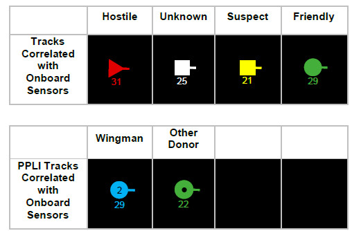{width="3.8180555555555555in"
height="2.5034722222222223in"}{width="3.94375in"
height="1.1881944444444446in"}{width="4.091054243219598in"
height="1.2097900262467192in"}

**141**

Положение переключателя передачи UHF / VHF короткое (менее 0,5 с)
выбирает три варианта фильтра (Filter Option):

**ALL.** ВСЕ. Все символы отображаются

**FTR +**. Следы наблюдения удалены

**TGTS.** Наблюдения и треки PPLI удалены.

Короткое движение переключателя (**outboard short)** (менее 0,5 с)
выбирает NONE и удаляет все треки datalink (datalink tracks) данных.

При повторном выборе outboard short возвращается к ранее выбранной опции
фильтра.

Текущая опция Filter Option отображается в левом нижнем углу экрана
радара.

Radar Display Filtering

Символы треков, отображаемые на странице FCR, могут быть отфильтрованы с
помощью переключателя передачи UHF / VHF. Это влияет на треки,
отображаемые только на радаре, и не влияет на треки, отображаемые на
HSD.

{width="3.38919728783902in"
height="2.716048775153106in"}{width="2.8243055555555556in"
height="1.3215277777777779in"}

DED Pages (Страница DED DLNK)

На DED доступны три страницы связи данных (DLNK) для мониторинга и
проверки конфигурации системы Link 16. Для доступа к первой странице
нажмите кнопку LIST на панели ICP и выберите ENTR (E).

Следующая страница может быть выбрана переключением DCS прямо в
положение SEQ.

Network Status (Состояние сети)

Страница Р1 отображает состояние сети и время обмена данными.

**GPS Time Reference**. Все участники сети Link 16 должны работать по
единому времени. Это обеспечивается данными с часов GPS, когда
установлено значение ON.

**Pilot Entered Time.** Время пилота. Если GPS не используется или
недоступен, участники сети могут ввести время, основываясь на заранее
известном едином времени

**Network Time Reference.** Сетевое время. Если этот параметр включен,
этот самолет идентифицируется как сетевой контроллер. Обычно это
установлено на OFF.

**Network Synchronization Status.** Состояние синхронизации сети. Это
отображает качество синхронизации времени с сетью.

**142**

{width="4.092361111111111in"
height="0.9506944444444444in"}{width="4.524621609798775in"
height="2.04545384951881in"}

**Flight Member Track Numbers.** Трек номера участника полета. Они
идентифицируют треки участников полета. Предварительно установлены и не
должны быть изменены.

**Own Flight Position.** Собственная позиция в звене/группе. Это
определяет место самолета в строю звена/группы.

MIDS Radio Options (MIDS Радио Опции)

Страница Р2 устанавливает параметры радио MIDS, включая каналы для
приема данных и мощности передачи.

**Fighter, Mission and Surveillance Channel selection**. Выбор
порядкового номера канала в звене/группе, канала группы и канала связи.
При этом выбираются данные канала MIDS от участников полета, других
самолётов и AWACS. Они предварительно установлены и не должны быть
изменены в полёте.

**Callsign.** Позывной. Это идентификатор данных, поступающих с
самолета.

**Flight Lead Identifier.** Идентификатор ведущего полета. Если
включено, это идентифицирует самолет как ведущего в группе/звене.

**Transmission Power.** Мощность передачи. Устанавливает выходную
мощность для радио MIDS.

Flight Management Управление полетом

Страница Р3 позволяет управлять и идентифицировать номера участников
полета в сети.

**143**

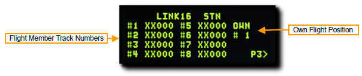{width="4.670223097112861in"
height="0.983740157480315in"}{width="4.91871719160105in"
height="1.0in"}\
14

> LITENING AT TARGETING POD

USAF Photo

by MSgt Kevin J. Gruenwald

{width="7.0in" height="9.333333333333334in"}

[]{#LITENING .anchor}LITENING AT TARGETING POD

Overview (Введение)

Модуль подвесного контейнера предоставляет вам возможность
просматривать, отслеживать или назначать цели днем или ночью. Существует
два видео режима в реальном времени: Charge Coupled Device (CCD)
(например, дисплей телевизора) и Forward Looking Infrared (FLIR) в
подрежимах Black Hot и White Hot.

Основные функциональные режимы и подрежимы для TGP включают:

-   Standby (STBY)

-   Air-to-Ground (A-G)

-   Slave (Ground)

-   AREA Track

-   POINT Track

-   INR Track

-   Laser Spot Search (LSS)

-   Air-to-Air (A-A)

-   Slave (Body)

-   POINT Track

-   RATE Track

-   HUD

Каждый из этих режимов также имеет страницу управления, которая дает вам
возможность настраивать функции TGP.

145

TGP Activation (Включение контейнера)

Для работы всех функций TGP на панели питания Avionics Power Panel
должны быть установлены следующие переключатели:

-   MMC переключатель - MMC

-   ST STA переключатель - ST STA

-   MFD переключатель - MFD

-   UFC переключатель - UFC

-   EGI/INS - NORM

Питание подается на TGP с панели управления Sensor Control Panel:

-   RIGHT HDPT переключатель - RIGHT HDPT

Выберите TGP в меню MFD для доступа к странице TGP.

Когда TGP включён, страница режима ожидания (Standby page) будет
отображаться с сообщением «NOT TIMED OUT», отображаемым в верхней
центральной части. Требуется время для автоматического самотестирования
при включении питания и для охлаждения датчика FLIR.

Сообщение «FLIR HOT» отображается белым текстом на черном фоне с
половиной высоты текста как сообщение «NOT TIMED OUT». Примерно через
три минуты сообщение будет удалено, появится видео и будет выбрана
страница режима ожидания.

146

{width="5.325in" height="2.8180555555555555in"}

TGP Page Select

Standby (STBY) Mode (Режим ожидания)

Это будет первый экран режима TGP, отображаемый после активации TGP.
После удаления сообщения «NOT TIMED OUT» (через 3 минуты) можно выйти из
режима, выбрав один из двух других режимов TGP или страницу управления в
режиме ожидания.

Могут отображаться следующие функции OSB:

Current Mode

Field of View and\
Zoom Factor

Override Select

STBY Control Page Select

**Current Mode.** Текущий режим. **OSB 1.**Это режим, в котором в данный
момент находится TGP.

**Field of View.** Поле обзора. **OSB 3.** Нажатие OSB 3 переключает
между узким полем зрения (Narrow Field of View) (**NFOV**) или широким
полем зрения (Wide Field of View) (**WFOV**). Эти виды могут различаться
между датчиками CCD и FLIR в TGP.

> • Поле зрения FLIR:
>
> o Широкое поле зрения (WFOV) составляет 4 градуса х 4 градуса
>
> o Узкое поле зрения (NFOV) составляет 1 градус х 1 градус
>
> • Поле зрения ПЗС:
>
> o Широкое поле зрения (WFOV) составляет 3,5 градуса х 3,5 градуса

o Узкое поле зрения (NFOV) составляет 1 градус на 1 градус

**Zoom Factor**. Коэффициент увеличения. В пределах выбора FOV вы можете
дополнительно отрегулировать коэффициент увеличения, увеличивая и
уменьшая масштаб с помощью ручки RANGE на РУД. Диапазон масштабирования
изменяется от 0Z (без увеличения) до 9Z (самый высокий уровень
увеличения в поле зрения). Объекты в поле зрения TGP увеличиваются в два
раза при изменении от 0 до 9 (zoom).

**OVRD Select.** (Override Select) Отмена/возврат. **OSB 4.** Нажатие
OSB 4 отменяет любой текущий режим и возвращает в STBY. Последний
выбранный режим возвращается, когда OVRD нажимается во второй раз.

**STBY Control Page Select.** Страница управления STBY. **OSB 5.** При
нажатии OSB 5 выбирается страница управления STBY. Опции и функции
описаны ниже.

**Radar Altitude**. Отображается текущая высота (определённая
радиовысотомером).

147

Radar Altitude

Sensor Type

Laser Spot Search Code

{width="5.420138888888889in"
height="2.533333333333333in"}

**Sensor Type.** Тип датчика. **OSB 6**. В этом текстовом поле,
отображаемом в верхнем правом углу, отображается текущий режим видео, в
котором работает TGP. Три параметра включают в себя:

> • WHOT. При использовании камеры FLIR горячие объекты выглядят
> светлее, чем холодный фон.
>
> • BHOT. При использовании камеры FLIR горячие объекты выглядят темнее,
> чем холодный фон.
>
> • ТВ. Камера Charge Coupled Device отображает это изображение. Это
> дневная, электрооптическая камера.

**Laser Spot Search Code.** Код поиска лазерного пятна. **OSB 7.** Это
код частоты лазерных импульсов (laser pulse rate frequency) (PRF),
который TGP попытается найти в режиме поиска лазерного пятна (laser spot
search) (LSS).

Mode Selection (Выбор режимов)

Вы можете изменить режимы, нажав OSB 1 рядом с STBY. Будут отображены
следующие параметры:

> Current Mode
>
> A-A Mode Select
>
> **A-A Mode Select.** При нажатии этой **OSB 20** выбирается режим A-A.
>
> **A-G Mode Select.** При нажатии этой **OSB 6 выбирается** режим A-G.\
> **STBY Mode Select**. Нажатие этой OSB 1 или 10 выбирает режим STBY.

148

> 8STBY Mode Select

A-G Mode Select

{width="5.373611111111111in"
height="2.5597222222222222in"}

Air-to-Ground (A-G) Mode

При первом входе в режим A-G TGP захватывает зону обзора на удалении 150
миль ниже линии нулевого обзора самолета (boresight), прямо перед собой.
Могут отображаться следующие элементы:

> Current Mode

Field of View and\
Zoom Factor

> Situational Awareness Cue
>
> Crosshairs
>
> FOV Indicators
>
> A-G Control Page Select

Laser Spot Search Code

**Current Mode. OSB 1.** Текущий режим. A – G. Это режим, в котором в
данный момент находится TGP.

**Field of View.** Нажатие этой OSB 3 переключает между узким полем
зрения (Narrow Field of View) (**NFOV**) или широким полем зрения (Wide
Field of View) (**WFOV**). Эти виды могут различаться между датчиками
CCD и FLIR в TGP.

> • Поле зрения FLIR:
>
> o Широкое поле зрения (WFOV) составляет 4 градуса х 4 градуса
>
> o Узкое поле зрения (NFOV) составляет 1 градус х 1 градус
>
> • Поле зрения ПЗС:
>
> o Широкое поле зрения (WFOV) составляет 3,5 градуса х 3,5 градуса
>
> o Узкое поле зрения (NFOV) составляет 1 градус на 1 градус

**Zoom Factor**. OSB 3. В пределах выбора FOV вы можете дополнительно
отрегулировать коэффициент увеличения, увеличивая и уменьшая масштаб с
помощью ручки RANGE на РУД. Диапазон масштабирования изменяется от 0Z
(без увеличения) до 9Z (самый высокий уровень увеличения в поле зрения).
Объекты в поле зрения TGP увеличиваются в два раза от 0 до 9 zoom.

**Crosshairs.** Линия визирования для прицеливания и лазерного подсвета.

**Field of View (FOV) Indicators.** Индикаторы поля зрения (FOV). Эти
четыре угловые скобки отображаются только при включенном WIDE FOV и
указывают часть изображения, которая будет отображаться, если включен
NARO FOV.

**OVRD Select.** Нажатие этой OSB 4 отменяет любой текущий режим и
возвращает в STBY. Последний выбранный режим возвращается, когда OVRD
выбирается во второй раз.

**A-G Control Page Select.** При нажатии этой OSB 5 выбирается страница
управления STBY.

**Radar Altitude**. Отображается текущая высота (определённая
радиовысотомером).

149

> Override Select
>
> Radar Altitude

Sensor Type

Track Mode

{width="5.2131944444444445in"
height="2.459722222222222in"}

**Sensor Type.** **OSB 6**. Тип датчика. **TMS Влево.** В этом текстовом
поле, отображаемом в верхнем правом углу, отображается текущий режим
видео, в котором работает TGP. Три параметра включают в себя:

> • WHOT. При использовании камеры FLIR горячие объекты выглядят
> светлее, чем холодный фон.
>
> • BHOT. При использовании камеры FLIR горячие объекты выглядят темнее,
> чем холодный фон.
>
> • ТВ. Камера Charge Coupled Device отображает это изображение. Это
> дневная, электрооптическая камера.

**Laser Spot Search Code. OSB 7.** Лазерный точечный поисковый код. Это
код частоты лазерных импульсов (laser pulse rate frequency) (PRF),
который TGP попытается найти в режиме поиска лазерного пятна (laser spot
search) (LSS).

**Track Mode.** Режим трека. **TMS Вперед.** Если TGP находится в режиме
трека, в этом поле будет указан режим трека, в котором он находится.
Типы включают в себя:

•**AREA**. ПЛОЩАДЬ. TGP стабилизирован по пространству в общей сцене, но
не отслеживает указанный объект. Если трек AREA не может быть сохранен
из-за маскировки самолета, он возвращается в режим INR и вернется в
местоположение трека AREA, если трек можно восстановить путем снятия
маски.

• **POINT**. TGP установил трек на конкретном объекте / цели и
стабилизируется на нем. Он будет продолжать отслеживать, даже если цель
движется. При отслеживании в режиме POINT прямоугольник рисуется вокруг
края отслеживаемого объекта. Объект не должен быть ограничен, и
прямоугольник не будет расширяться, чтобы охватить весь объект - он
остается фиксированного размера. Если объект не может быть отслежен
из-за маскировки самолета, он вернется в режим INR, но вернется к треку
ТОЧКА, если трек можно восстановить путем снятия маски.

• **INR**. В режиме инерционной скорости (INR) TGP останется
фиксированным в географической контрольной точке.

**Situational Awareness Cue.** Ситуационная осведомленность. Сигнал SA
предоставляет вам маркер (КВАДРАТ) , чтобы указать текущую линию
визирования TGP относительно продольной оси (оси прицеливания)
контейнера, которая совпадает с продольной осью самолета. Маркер
представлен в виде небольшого квадрата, который может перемещаться в
любое место на дисплее. Положение маркера SA представляет текущую линию
видимости TGP.

Применение оружия с использованием TGP описана в разделе Air to Ground
Employment section.

**150**

[]{#Laser_Ranging .anchor}**Laser Ranging (Измерение наклонной дальности
лазером)**

Одна очень важная особенность лазерного указателя Targeting Pod - это
способность измерять наклонную дальность до цели. Лазер запускается, и
измеряется время, необходимое для получения отраженной энергии лазера,
обеспечивая точный диапазон определения дальности до цели. Затем эта
информация подается на компьютер управления огнем, чтобы обновить
сохраненную высоту цели и значительно повысить точность вычисленного
решения для прицеливания.

Это можно и нужно делать, когда это возможно, для всех типов оружия, а
не только для бомб с лазерным наведением. Для этого TGP автоматически
подчиняется pipper в режимах пушка, CCIP ракеты и бомбы, а также
целеуказателю в режимах CCRP и DTOS.

Эти способы применения вооружения обсуждаются полностью в разделе
Занятость воздух-земля.

Чтобы получить лазерный подсвет, переключатель Laser Arm должен быть
установлен в положение ARM. Лазерный луч блокируется, если переключатель
установлен в положение OFF.

{width="1.9222222222222223in" height="1.6625in"}

Состояние лазера отображается как L на дисплее HUD и TGP, когда
переключатель Laser Arm установлен в режим охраны.

Лазер запускается нажатием курка на ручке до первого фиксатора. L
мигает, когда лазерный указатель светит. Отпускание курка прекращает
подсвет.

> Laser Status

151

{width="5.253472222222222in"
height="2.120138888888889in"}

Air-to-Air (A-A) Mode (Режим)

Линия визирования TGP автоматически согласовывается с линией направления
луча радара, когда выбран основной режим A-A, и радар отслеживает цель.
Если радар не отслеживает воздушную цель, модуль направляет линию
визирования TGP прямо по курсу, на угол -3 градуса.

Вы можете убрать прицел TGP с помощью переключателя **CURSOR** на РУД.
При повороте камера TGP перемещается в пространстве стабилизированным
образом. В этом подвижном режиме, но без отслеживания цели, на дисплее
отображается «**RATES**». После отключения перекрестие уменьшится до
половины.

Если воздушная цель проходит в узкой зоне поля зрения (представленной
четырьмя угловыми маркерами), TGP попытается отследить цель и поставить
крестик «+» на ней. Если цель вылетит за пределы узкого поля зрения,
крест исчезнет.

Если затем вы введете команду **TMS Вперёд Коротко** (захват командной
точки), цель будет центрирована в перекрестии, и вокруг цели будет
нарисован прямоугольник, соответствующий его размеру. В этом режиме
будет отображаться «**POINT**», а также перекрестный трекинг (tracking
cross). Чтобы выйти из трека POINT, пользователь может подать команду
**INR track** и вернуться в режим **RATES**.

На экране отображаются следующие элементы:

> Situational Awareness Cue
>
> Crosshairs
>
> FOV Indicators
>
> Current Mode
>
> \_SUAP\_|E3\_\_FLCS TEST DCLT

Laser Spot Search Code

Track Mode

Field of View and\
Zoom Factor

**Current Mode.** Это режим, в котором в данный момент находится TGP.

**Field of View.** Нажатие этой OSB 3 переключает между узким полем
зрения (NFOV) или широким полем зрения (WFOV). Эти виды могут
различаться между датчиками CCD и FLIR в TGP.

FLIR поле зрения:

> Широкое поле зрения (WFOV) составляет 4 градуса х 4 градуса
>
> Узкое поле зрения (NFOV) составляет 1 градус x 1 градус

CCD поле зрения:

> Широкое поле зрения (WFOV) составляет 3,5 градуса х 3,5 градуса
>
> Узкое поле зрения (NFOV) составляет 1 градус на 1 градусe

152

Sensor Type

> Radar Altitude
>
> A-G Control Page Select
>
> Override Select

{width="5.473611111111111in"
height="2.520138888888889in"}

**Zoom Factor.** В пределах выбора FOV вы можете дополнительно
отрегулировать коэффициент увеличения, увеличивая и уменьшая масштаб с
помощью ручки **RANGE** на РУД. Диапазон масштабирования изменяется от
0Z (без увеличения) до 9Z (самый высокий уровень увеличения в поле
зрения). Объекты в поле зрения TGP увеличиваются вдвое от 0 до 9.

**Crosshairs.** Линии прицеливания для прицела и лазерного подсвета

**Field of View (FOV) Indicators.** Эти четыре угловые скобки
отображаются только при включенном WIDE FOV и указывают часть
изображения, которая будет отображаться, если включен NARO FOV.

**OVRD Select.** Нажатие этой **OSB4** отменяет любой текущий режим и
возвращает в STBY. Последний выбранный режим возвращается, когда OVRD
выбирается во второй раз.

**A-G Control Page Select**. При нажатии этой **OSB5** выбирается
страница управления STBY.

**Radar Altitude.** Отображается текущая высота радара.

**Sensor Type**. В этом текстовом поле, отображаемом в верхнем правом
углу, отображается текущий режим видео, в котором находится TGP. Три
варианта режима:

> • Whot. При использовании камеры FLIR горячие объекты выглядят
> светлее, чем холодный фон.
>
> • BHOT. При использовании камеры FLIR горячие объекты выглядят темнее,
> чем холодный фон.
>
> • TV. Камера Charge Coupled Device отображает это изображение. Это
> дневная, электрооптическая камера.

**Laser Spot Search Code.** Это код частоты лазерных импульсов (PRF),
который TGP попытается найти в режиме поиска лазерного пятна (LSS).

**Track Mode**. Если TGP находится в режиме трека, в этом поле будет
указан режим трека, в котором он находится. Типы включают:

-   **RATES**. Когда в режиме A-A и функция движения отключена, TGP
    автоматически войдет в режим RATES (указывается в поле типа
    трекинга).

-   **POINT**. Как и в режиме A-G, пользователь может управлять
    > движением точки захвата над объектом. Этот режим также
    > используется для радиолокационных целей.

**Situational Awareness Cue**. Сигнал SA предоставляет вам Указатель,
чтобы указать текущую линию визирования TGP относительно продольной
(прицеленной) оси контейнера, которая совпадает с продольной осью
самолета.

Указатель представлен в виде небольшого квадрата, который может
перемещаться в любое место на дисплее. Положение квадрата SA
представляет текущую линию видимости TGP.

Применение оружия с использованием TGP описана в разделе Air to Air
Employment section.

**153**

[]{#LASR_DED_Page .anchor}**LASR DED Page (Страница DED настройки
лазера)**

Лазерный код для обозначения TGP и поиска LST задается на странице LASR
DED.

1\. Выберите страницу LIST и нажмите 0, чтобы открыть страницу MISC.

2\. Затем нажмите 5, чтобы выбрать страницу LASR.

{width="4.649305555555555in"
height="1.9222222222222223in"}

Введите новый код лазера TGP или код LST на клавиатуре и нажмите ENTR.

{width="2.623611111111111in"
height="2.0388888888888888in"}

Теперь TGP будет подсвечивать лазерным указателем по новому коду TGP или
искать лазерные пятна с новым LST-кодом.

Установите DCS влево, чтобы вернуться на страницу CNI.

**154**

{width="2.234722222222222in"
height="0.9819444444444444in"}

{width="8.293851706036746in"
height="11.062937445319335in"}

> HELMET MOUNTED CUEING SYSTEM

[]{#HCMS .anchor}**HELMET MOUNTED CUEING SYSTEM (СИСТЕМА НАШЛЕМНОГО
УКАЗАТЕЛЯ)**

**Overview (Нашлемный указатель)**

> Система нашлемного указателя (Helmet Mounted Cuing System (HCMS) - это
> спецкомплект на летном шлеме, который позволяет пилоту просматривать
> информацию о самолете и оружии на козырьке шлема. Это называется
> дисплеем, установленным на шлеме (HMD).
>
> Это также позволяет наводить датчики и оружие по линии прямой
> видимости шлема. Это особенно эффективная система в сочетании с
> ракетой для ближнего боя AIM-9X. Шлем может управлять оружием и
> датчиком на расстоянии до 80 градусов от прицела.
>
> Питание HMD выбирается с помощью ручки управления HMD на правой панели
> приборов. Вращение ручки по часовой стрелке из положения ВЫКЛ. В
> положение BRT (яркость) обеспечивает питание HMD. Продолжение вращения
> по часовой стрелке увеличивает яркость HMD.

{width="5.467361111111111in"
height="1.5451388888888888in"}

Символика на HMD видна только в правом глазу (при использовании шлема
виртуальной реальности). Это может вызвать дискомфорт в Вашей
виртуальной реальности, т.к. Вы не имеете специального летного отбора,
поэтому вы можете изменить способ визуализации в DCS: Опции мира F-16C
Специальная вкладка.

Эти опции доступны:

Применение АСП с использованием системы HCMS описана в следующих
разделах:\
[AIM-9M/X HMCS Radar BORE Employment](#bookmark223)

155

{width="3.8569444444444443in"
height="1.2340277777777777in"}

**Non-Designated Mode (Не-обозначенный режим)**

Основные характеристики HMCS могут быть проиллюстрированы в
не-назначенном режиме.

Это можно рассматривать как расширение HUD, с большей частью символики,
имитируемой на HMD. Эти функции применяются ко всем режимам HMCS:

> Master Mode

Bearing/Range\
to Bullseye

> Dynamic Aiming Cross

Distance to Steerpoint /\
Steerpoint Number

> Helmet Heading

**Acceleration (G)**. Перегрузка (G). Дублирование текущей Г.

**Airspeed.** Скорость полета. Дублирование воздушной скорости от HUD.

**Master Arm Status.**Статус Master Arm. Положение переключателя
главного переключателя: OFF, ARM или SIM.

**Master Mode.** Мастер режим. Текущий Режим управления полёта.

**Bearing/Range to Bullseye.** Курс /Удаление. Курс и дальность от
вашего самолета до Bullseye.

**Altitude.** Высота над уровнем моря. Дублирование HUD барометрической
высоты.

**Dynamic Aiming Cross.** Прицельная марка динамического прицела.
Находясь в режиме A / A в HMD, прицельный крест может находиться в одном
из трех положений на HMD, основываясь на угле обзора HMD.

> • Когда HMD LOS на 0 градусов ниже стабилизированного горизонта,
> прицельный крест центрируется в HMD.
>
> • Когда HMD LOS находится между 0 и 30 градусами над стабилизированным
> горизонтом, прицельный крест центрируется между индикаторами воздушной
> скорости и высоты на HMD.
>
> • Когда HMD LOS больше 30 градусов над стабилизированным горизонтом,
> прицельный крест центрируется над направляющей лентой на HMD.

**Distance to Steerpoint / Steerpoint Number.** Расстояние до Steerpoint
/ Steerpoint номер. Выбранный ППМ и расстояние в морских милях.

**Helmet heading.** Указатель взгляда (поворота шлема). Цифровая
индикация курса (XXX), куда направлен шлем.

157

Master Arm Status

> Barometric Altitude

Acceleration (G)

> Airspeed

{width="5.373611111111111in"
height="2.020138888888889in"}

> AIR-TO-AIR EMPLOYMENT
>
> ВООРУЖЕНИЕ ВОЗДУХ - ВОЗДУХ

{width="8.279865485564304in"
height="10.93464457567804in"}

[]{#ВООРУЖЕНИЕ_ВОЗДУХ_ВОЗДУХ .anchor}**ВООРУЖЕНИЕ ВОЗДУХ - ВОЗДУХ**

**Air Combat Preparation (Подготовка к воздушному бою)**

> ***«Не забывайте предугадывать, что будет дальше, ***
>
> ***и оставайтесь на шаг впереди своего противника».***
>
> При входе в район, где вы ожидаете встретить вражеский самолет, вам
> нужно будет предпринять следующие шаги:

1.  ***Установите главный переключатель (Master Arm Switch) в положение
    ARM*. **

> Оружие может быть применено только в положении ARM. Если переключатель
> Master Arm находится в безопасном положении (SAFE position),
> применение АСП невозможно.

{width="2.207638888888889in"
height="2.2729166666666667in"}

1.  ***Нажмите кнопку основного режима A-A на ICP, чтобы перевести
    систему управления огнем в режим «воздух-воздух, с применением
    ракет» (Air to Air Missile (AAM) Mode) или пушки.***

{width="5.195138888888889in"
height="2.0131944444444443in"}

**159**

[]{#M61A1 .anchor}**M61A1 20mm Gun (Пушка)**

> Автоматическая пушечная система M61A1 20MM обеспечивает пилота оружием
> большой мощности. Это 6-ствольная пушка, типа Гатлинга (с вращающимися
> стволами), установленное в левой части фюзеляжа самолета. Пушка имеет
> запас снарядов 512 штук, скорострельность 6000 выстрелов в минуту.
>
> ***Порядок действий пилота***
>
> *1. Выберите основной режим **AAM** на MFD или **DGFT** на РУД.*
>
> *2. Установите Главный переключатель в положение **ARM.***
>
> *3. Обнаружьте/захватите цель, используя режим радара **ACM.***
>
> *4. Наложите воронку прицела **EEGS** на цель.*
>
> *5. Прижмите курок на РУС ко второму стопору, чтобы открыть стрельбу
> из пушки.*

**Air to Air Gunnery (Применение пушки по воздушным целям)**

Существует два способа установить правильную конфигурацию SMS для
стрельбы в воздухе.

la. ***Выберите подрежим «Воздух-воздух» на MFD, нажимая OSB 1, пока не
отобразится GUN***.

или же

lb. ***Установите переключатель «Dogfight / Missile Override» (DOGFIGHT)
в положение «DGFT»***.

Это обеспечивает символику на HUD как для стрельбы 20-мм пушкой, так и
для пусков ракеты A-A.

> **Operating Mode.** Выбор режима. OSB 1.
>
> **Submode.** Подрежим выбора типа прицела. EEGS .OSB 2.
>
> **Gun Status.** Статус Пушки.
>
> **Rounds Remaining.** Остаток снарядов
>
> Submode

160

> Rounds Remaining
>
> System Status

Gun Status

> Operating Mode

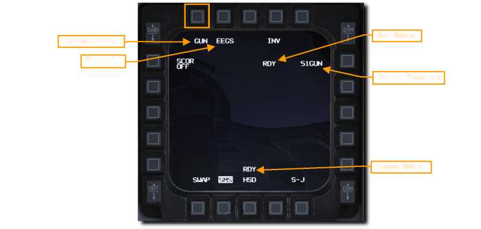{width="5.320138888888889in"
height="2.540277777777778in"}

0

2.  ***Убедитесь, что символы A-A GUN отображаются в HUD.***

Система Enhanced Envelope Gun Sight (EEGS) предоставляет различные виды
(уровни) информации на ИЛС в зависимости от того, имеет цель
радиолокационный захват или нет.

**Уровень I** - это режим отказа системы, при котором отображается
положение точки прицеливания только в случае сбоя блока датчика скорости
(RSU) и INS. Это почти никогда не должно встречаться.

**Уровень II** обеспечивает прогнозирование траектории полета снарядов,
когда цель не имеет радиолокационного захват. На ИЛС выводятся линии
прицеливания - воронки EEGS и несколько эталонных линий прицела (MRGS).

**Уровни III и IV** являются промежуточными уровнями, которые ведут к
отображению уровня V. Они обычно не замечаются пилотом.

Boresight Cross

*Level II Symbology (no radar lock). *

*Маркер II уровня, (нет захвата цели радаром)*

**Уровень V** отображается после радиолокационного захвата цели радаром,
и с помощью полученных данных рассчитывается решение для стрельбы.
Дополнительные метки в HUD включают в себя: Обозначение цели (**Target
Designator**), T-символ (**T-Symbol**), наклонную дальность (**Slant
Range**), скорость сближения (**Closure Rate**) и точку положения
маркера/пиппера (**Level V Pipper**).

**Operating Mode.** Выбор режима. OSB 1.

**Boresight Cross**. Прицельное перекрестие, (проекция оси канала ствола
пушки) Этот символ всегда доступен и показывает направление
прицеливания. Это направление, в котором полетят снаряды, при отсутствии
на них влияния других сил, таких как гравитация или сопротивление
воздуха.

**EEGS Funnel (EEGS).** Прицельная Воронка EEGS. Каждая точка вдоль оси
воронки представляет цель на определенном расстоянии, на которое
правильно направлено оружие. Другими словами, воздушное судно, крылья
которого имеют такой же размах, что и ограничительные линии воронки,
находится на правильном удалении, чтобы быть пораженным выстрелами, в
этот момент времени.

По мере уменьшения дальности размер цели будет увеличиваться. При этом,
вы должны поместить цель по размаху крыльев в воронку, чтобы держать
размах крыла цели, просто касаясь сторон воронки. Это приводит к
расположению цели выше в HUD или, что более важно, ближе к прицельному
перекрестию (Boresight Cross), что приводит к уменьшенному рассеиванию
снарядов на траектории при меньшей дальности стрельбы.

**Multiple Reference Gunsight Lines** (MRGS)**.** Прицел MRGS состоит из
пяти отрезков, направленных на линию ствола орудия (Gun Bore Line (GBL),
и расположенных по дуге у основания HUD. Они помогают прицеливаться на
больших дальностях и/или больших ракурсах (аспект)цели, при условии
правильного, без скольжения, прицеливания, и нахождения цели (по её
размаху крыльев) в прицельной воронке.

MRGS используется путем расположения оси фюзеляжа цели параллельно одной
из условной линий, направленной от основания штриха до прицельного
перекрестия. Положение штрихов MRGS определяется длиной фюзеляжа и
данными о воздушной скорости цели, введенными в FCC. Линии расположены
на расстоянии от GBL, соответствующем Аспекту и Скорости цели.

161

EEGS Funnel

MRGS Lines

Master Arm Status

EEGS Submode

{width="5.419444444444444in"
height="2.4402777777777778in"}

При использовании линии MRGS, если цель меньше штриха, она либо выходит
за пределы дальности стрельбы, либо движется быстрее, чем
предполагалось, и требует дополнительного упреждения.

Если цель больше линии MRGS, цель движется медленнее, чем
предполагалось, и потребует меньше упреждение.

Каждая точка вдоль центра воронки представляет цель на определенном
расстоянии, на которое необходимо направить оружие. Другими словами,
самолет, крылья которого имеют тот же размах, что и данные введённые в
вычислитель воронки, находится на необходимом месте (удалении и
упреждении), чтобы попасть в него и сбить.

*Маркер V-го уровня (при захвате цели радаром)*

**Target Designator.** Обозначение цели. Этот символ сосредоточен на
захваченной радаром цели. Аспект цели (Target Aspect Caret) показывает
угол аспекта цели (target’s aspect angle). Максимальная эффективная
дальность применения пушки показана с помощью **In-Range Cue,** двух
маленьких линий на внешней стороне символа. Положение Target Range Caret
указывает наклонный диапазон до захваченной цели. Каждая позиция на
условных часах представляет 1000 футов наклонного диапазона, таким
образом:

> • 12 часов = 12 000 футов
>
> • 9 часов = 9000 футов
>
> • 6 часов = 6000 футов
>
> • 3 часа = 3000 футов

**Target Slant Range.** Наклонная дальность до цели. Расстояние до
захваченной радаром цели. Десятки мили отображаются для диапазонов,
превышающих одну милю. Сотни футов отображаются на расстоянии менее
одной мили.

**Closure Rate**. Скорость сближения. Скорость сближения с целью в
узлах.

**T-Symbol.** Т-Символ. Этот символ показывает два решения для стрельбы
по захваченной радаром цели. +Символ (+Symbol), или «one-G pipper»,
показывает угол упреждения относительно не маневрирующей цели. Небольшая
горизонтальная полоса, или «nine-G pipper», показывает угол упреждения
для подвижной цели с максимальной устойчивой скоростью. Эти данные могут
использоваться в качестве резервных данных о цели в ситуациях, когда
маркер Level V Pipper не отображается.

Две потенциальные линии для маневра отображаются по обе стороны от
одноразового пиппера. Чем длиннее линии, тем больше потенциал
маневрирования вне плоскости цели.

**Level V Pipper.** Маркер 5-го уровня. Это представляет собой решение о
стрельбе, рассчитанное для текущей дальности и скорости цели. Задача
пилота при прицеливании в том, чтобы стабилизировать этот маркер над
целью и открыть огонь.

162

{width="4.251199693788276in"
height="2.6923075240594927in"}

163

Угол крена, высота полёта и скольжение в момент выстрела сильно влияет
на эффективность стрельбы. Когда снаряды вылетают из ствола пушки, они
постепенно рассеиваются по траектории полёта и теряют скорость.
Повышенное рассеивание и потеря скорости снаряда снижают точность и
эффективность оружия.

Верхняя часть воронки представляет минимальную дальность приблизительно
600 футов (200 метров). Нижняя часть воронки представляет максимальную
дальность приблизительно 3000 футов (1000 метров). Если цель меньше
нижней части воронки, она находится дальше, чем дальность возможного
поражения.

2.  ***Маневрируйте самолетом, чтобы поместить самолет - цель в воронку
    EEGS так, чтобы концы крыльев касались краев. ***

Каждая точка (место положение цели) вдоль центра воронки представляет
цель на определенном расстоянии, на которое необходимо направить оружие.
Другими словами, самолет, крылья которого имеют тот же размах, что и
данные введённые в вычислитель прицела (воронки), находится на
необходимом месте для попадания в него снарядом (удалении и упреждении).

Поместите вражеский самолет в воронку прицела так, чтобы кончики крыльев
касались кромок или Маркер V уровня стабилизировался над целью.

2.  ***Нажмите курок РУС до второго фиксатора, чтобы открыть огонь из
    пушки, когда кончики крыльев касаются воронки (уровень II) или
    Маркер (Pipper) находится над целью (уровень).***

{width="4.084061679790026in"
height="2.9440551181102363in"}

164

{width="3.4910936132983377in"
height="2.6433562992125985in"}Дополнительный символ, известный как
символ **«Bullets at Target Range (BATR)**, отображается после
прекращения стрельбы. BATR отображается, после того, когда первая
реальная или симулированная (условная, учебная) стрельба произведена и
снаряды находятся в диапазоне дальности попадания в цель и удаляется
после того, как окончена стрельба. Этот символ доступен только при
наличии радиолокационного захвата цели и при наличии отображаемых
символов прицела EEGS уровня III, IV или V.

{width="3.5079057305336834in" height="3.0in"}

[]{#AIM_9MX .anchor}**AIM-9M/X Sidewinder**

AIM-9 - это ракета малой дальности с инфракрасным наведением, лучше
всего используемая в воздушном бою. Принцип применения в бою,
Пустил-и-Забыл. Она может применяться с и без захвата цели радаром.
Основным признаком захвата цели ГСН является высокий тональный сигнал
захвата. Пилот также может не использовать захват цели радаром, чтобы
убедиться, что он отслеживает цель, когда она впервые была захвачена
ГСН.

Обратите внимание, что AIM-9 может перенацелится в полёте или при поиске
цели на тепловые ловушки, и есть хорошая идея использовать этот приём в
бою, чтобы убедиться, что у вас есть хороший захват ГСН, прежде чем
запускать AIM-9, при наличии тепловых ловушек в поле зрения ГСН ракеты.

> ***Порядок действий пилота***
>
> *1. Выберите основной режим **AAM** на MFD или **DGFT** на РУД.*
>
> *2. Установите Главный переключатель в положение **ARM***
>
> *3. Обнаружьте/захватите цель, используя режим радара **ACM**
> (опционально)*
>
> *4. Маневрируйте, пока цель не окажется в зоне запуска*
>
> *5. Нажмите переключатель **Uncage** (Uncage switch) на РУД, чтобы
> ориентировать ГСН по полёту (если требуется)*
>
> *6. Убедитесь, что **Ракетный захват (Ромб)** находится на цели и
> слышен сигнал захвата*
>
> *7. Нажмите переключатель Пуск (**Weapon Release) на** РУС, чтобы
> выполнить пуск ракеты*.

**165**

**AIM-9M/X Employment (Применение)**

Существует два способа получить правильную конфигурацию SMS для запуска
AIM-9.

Вот они:

la. ***Выберите AIM-9 на MFD, нажимая OSB 7, пока не отобразятся
AIM-9.***

или же

lb. ***Установите переключатель «Dogfight / Missile Override» (DOGFIGHT)
в положение «DGFT»***.

Это отменяет любой другой основной режим и настраивает дисплеи для
воздушного боя. Положение DOGFIGHT обеспечивает символику на HUD как для
стрельбы 20-мм пушкой, так и для пусков ракеты A-A. Позиция MSL
обеспечивает символику на HUD только для пусков ракет A-A.

**Operating Mode.** Выбор режима. ААМ. OSB 1.

**Selected Weapon.** Количество и тип ракет отображается рядом с OSB 7.
Пилоны с загруженными ракетами отображаются внизу.

**Available Stations**. Пилоны с загруженными ракетами отображаются
радом с OSB 16 или 10, а выбранный пилон помещен в квадрат. Вы можете
проверить доступные точки подвески с помощью кнопки MSL Step или выбрав
OSB 16 или 10

**Field of View**. SPOT / SCAN - OSB 2 дает команду ГСН ракеты
сканировать либо в узком поле зрения (SPOT), либо в широком поле зрения
(SCAN). Более широкое поле зрения достигается нутацией/вращением ГСН
вокруг линии обзора. Диапазон обнаружения цели по дальности уменьшается
при использовании режима SCAN.

**Line of Sight**. SLAVE / BORE OSB 19 направляет ГСН ракеты либо
следовать линии прямой видимости радара (SLAVE), либо продолжать
смотреть прямо вниз по оси прицеливания (BORE).

**Argon Cooling Status - WARM / COOL** активирует или деактивирует
аргонное охлаждение ГСН. Это должно быть установлено на COOL перед
включением, чтобы охладить ГСН и увеличить чувствительность обнаружения.
COOL выбирается автоматически при входе в режим DGFT или MSL Override.
Продолжительность подачи аргона зависит от температуры наружного
воздуха, давления и уровня заряда баллона при установке, но средняя
продолжительность составляет 90 минут.

166

{width="5.197916666666667in"
height="3.0104166666666665in"}

2.  ***Убедитесь, что символ A-A Missile отображается в HUD.***

HUD в режиме "воздух-воздух" предоставляет информацию о состоянии и
нацеливании ГСН ракеты. Большая часть символов режима NAV сохраняется,
но добавлено несколько новых функций, помогающих в обнаружении цели и
запуске ракеты.

«**Ромб**» указывает на положение ГСН AIM-9. Он находится в направлении
визирования/прицеливания ГСП, но разблокирован, чтобы следовать за
линией обзора радара или отслеживать захваченную цель, когда выполнен её
захват.

**«Круг»** показывает поле зрения ГСН. Он будет разного размера, так как
его разные размеры будут в зависимости от настройки поля зрения SPOT /
SCAN, выбранной на МФД.

> Master Arm Status
>
> Missile Diamond

1.  ***Обнаружить цель с помощью радара (опционально)***

Возможно, самый распространенный и самый простой способ захвата цели ГСН
AIM-9 - это обнаружить цель с помощью одного из режимов радара ACM. Это
направляет ГСН AIM-9 к цели захваченной радаром, если выбран режим ГСН
SLAVE.

Это приводит к захвату цели ГСН AIM-9, если цель находится в радиусе
захвата и выполняются другие условия обнаружения ИК излучения.

1.  ***Маневрируйте, пока цель не окажется в зоне запуска***

Поместите цель внутрь круга прицела (зоны захвата) на ​​HUD. Если ракета
обнаруживает достаточное количество ИК-энергии от цели, обнаружение цели
ГСН обозначается звуковым сигналом обнаружения ракеты (рычащий звук).

1.  ***Нажмите переключатель Uncage, для самостоятельного отслеживания
    Цели.***

Когда ГСН AIM-9 обнаруживает цель, ее можно захватить, нажав кнопку
**Cage/Uncage** на РУД, чтобы позволить захвату ГСН включиться и
следовать за целью в пределах поля зрения ГСН ракеты. Маркер (ракетный)
ромб (**Missile Diamond**) фиксируется на цели при её захвате.

> AAM Mode
>
> Missile Reticle

167

{width="4.486805555555556in"
height="2.3930555555555557in"}

1.  ***Убедитесь, что Ракетный ромб находится на цели и слышен сигнал
    захвата.***

Рычание ракеты станет высоким, когда цель захвачена. Квадрат с
Указателем цели (Target Designator Box) будет присутствовать над целью,
захваченной радаром.

При пуске, по цели, захваченной радаром Ракетный Ромб (Missile Diamond)
должен находиться над полем Указателя цели (Target Designator box).

> Target Designator Box
>
> Missile Diamond
>
> Dynamic Launch Zone

Зона динамического запуска (DLZ) будет отображаться с правой стороны
HUD, когда цель обозначена с помощью радара. Контролируйте DLZ и
оценивайте ситуацию с угрозой, чтобы определить оптимальную точку
запуска ракеты. Символ HUD мигает, когда цель находится в пределах
максимальной дальности против маневрирующей цели.

168

> Range Scale
>
> Maximum Missile Range
>
> Closure Rate and Range
>
> Minimum Missile Range

***7. Нажмите на кнопку Пуск на РУС, чтобы запустить ракету.***

Ракета перехватит цель, и будет выбрана следующая ракета в
последовательности. AIM-9 - это оружие для стрельбы и забывания, поэтому
нет необходимости продолжать отслеживать цель.

{width="2.9166666666666665in"
height="2.2395833333333335in"}{width="5.206944444444445in"
height="2.6131944444444444in"}

**AIM-9M/X HMCS Missile BORE Employment (Применение AIM-9M/X с нашлемной
системой)**

HMCS позволяет ГСН ракет AIM-9M или AIM-9X подчиняться подвижному
целеуказателю (HMD), когда на ГСН ракеты выбран режим BORE. Это полезно
в ситуациях, когда захват радаром невозможен, но необходим. Это можно
рассматривать как нормальное использование AIM-9, за исключением того,
что линия обзора HMD используется вместо линии обзора HUD. Алгоритм
работы в остальном такой же.

1.  **Подготовка.**

***Включите символику дисплея, установленного на шлеме (HMD).***

Питание HMCS выбирается с помощью ручки управления HMD Symbology на
правой панели приборов. Вращающийся ручка по часовой стрелке из
положения OFF в положение BRT (яркость) подает питание на HMD.
Продолжение вращения по часовой стрелке увеличивает яркость символов.

{width="3.636111111111111in"
height="1.0777777777777777in"}

***2а. Выберите AIM-9 на MFD, нажимая OSB 7, пока не отобразятся
AIM-9.***

или же

***2b. Установите переключатель «Dogfight/Missile Override» (DOGFIGHT),
на РУД в положение «DGFT»**.*

Символы и функции идентичны не-HMCS прицеливанию. Установите, на MFD,
режим прямой видимости BORE **(Sight mode to BORE) OSB 19**, чтобы
использовать HMCS для прицеливания AIM-9M / X без радара.

> Argon Cooling Status
>
> Available Stations

169

> Selected Weapon
>
> Operating Mode

Field of View

> Line of Sight

{width="5.0in" height="2.566666666666667in"}

***2. Захват цели в HMD***.

Если для AIM-9 установлен режим радара BORE и включен HMCS, искатель
будет следовать Кресту динамического прицеливания на дисплее HMD.
Прицельный крест рассматривается как позиция прицеливания. Просто
посмотрите на цель, вместо того, чтобы лететь и разворачивать самолёт до
момента захвата цели ГСН AIM-9.

Помните, что вы все равно будете ограничены пределами секторов поворота
карданного подвеса ГСН, когда смотрите вокруг. «Ракетный Ромб»
показывает, куда смотрит искатель ракет. Если вы посмотрите слишком
далеко от точки прицеливания самолета, ГСН ракеты не сможет следовать за
вашей линией визирования цели, и Ромб не будет виден.

Другая символика на дисплее намеренно имитирует символы из HUD.

170

> Missile Diamond (Ромб)
>
> Dynamic Aiming Cross

Master Arm Status

> Master Mode

{width="5.106944444444444in"
height="2.566666666666667in"}

***3. Нажмите переключатель Uncage, чтобы запустить команду на
сопровождение.***

Когда искатель AIM-9 обнаруживает цель, ее можно сбросить, нажав кнопку
«**Cage / Uncage**» на РУД. Это позволяет ГСН захватывать и следовать за
целью в пределах ограничений карданного подвеса ГСН.

Ракетный Ромб (Missile Diamond) фиксируется на цели, когда ГСН
захватывает цель.

1.  ***4. Убедитесь, что ракета находится на цели и слышен сигнал
    захвата.***

Рычание ракеты станет высоким, когда цель захвачена. Ракетный ромб
(Missile Diamond) должен быть привязан к цели и больше не следовать за
Крестом цели.

***5. Нажмите переключатель Weapon Release на РУС, чтобы запустить
ракету.***

Ракета начнёт перехват цели, и будет выбрана следующая ракета в
последовательности подвесок.

AIM-9 - это оружие для стрельбы без контроля наведения, поэтому Вам нет
необходимости продолжать отслеживать ракету в полёте.

{width="3.9090277777777778in"
height="2.571527777777778in"}

171

Dynamic Aiming Cross

Target

Missile Diamond

**AIM-9M/X HMCS Radar BORE Employment**

HMCS также позволяет Радару управления огнем (Fire Control Radar)
подчиняться перекрестку наведения HMCS, когда выбран режим радара ACM
BORE. Это можно рассматривать как нормальное использование AIM-9, за
исключением того, что линия обзора HMD используется вместо линии обзора
HUD. Алгоритм работы в остальном такой же.

**1.Подготовка.**

***Включите символику дисплея, установленного на шлеме (HMD).***

Питание HMCS выбирается с помощью ручки управления HMD Symbology на
правой панели приборов. Вращающийся ручка по часовой стрелке из
положения OFF в положение BRT (яркость) подает питание на HMD.
Продолжение вращения по часовой стрелке увеличивает яркость символов.

{width="3.636111111111111in"
height="1.1041666666666667in"}

***2а. Выберите AIM-9 на MFD, нажимая OSB 7, пока не отобразятся
AIM-9.***

или же

***2b. Установите переключатель «Dogfight/Missile Override» (DOGFIGHT),
на РУД в положение «DGFT»**.*

Символы и функции идентичны не-HMCS прицеливанию. Установите, на MFD,
режим прямой видимости (Sight mode) SLAVE **OSB 19**, чтобы используйте
HMCS и радар для наведения AIM-9M / X.

> Line of Sight \]■
>
> Selected Weapon
>
> Argon Cooling Status

172

Field of View

> Operating Mode
>
> Available Stations

{width="5.006944444444445in"
height="2.459722222222222in"}

***2. Выберите режим радара ACM BORE и наведите прицел на цель в HMD.***

Если выбран режим радара ACM BORE и включен HMCS, он будет следовать
прицелу динамического наведения на дисплее HMD. Прицельный крест
рассматривается как позиция прицеливания. Просто посмотрите на цель,
вместо того, чтобы лететь и разворачивать самолёт до момента захвата
цели ГСН AIM-9.

Помните, что вы все равно будете ограничены пределами секторов поворота
карданного подвеса ГСН, когда смотрите вокруг. «Ракетный Ромб»
показывает, куда смотрит искатель ракет. Если вы посмотрите слишком
далеко от точки прицеливания самолета, ГСН ракеты не сможет следовать за
вашей линией визирования цели, и Ромб не будет виден.

Обратите внимание, что «Ракетный Ромб» Missile Diamond находится за
пределами дисплея HMD. ГСН ракеты будет подчинятся радиолокационной
линии видимости позже, когда будет выполнен радиолокационный захват.

Символика на дисплее HMD имитирует символы из HUD.

173

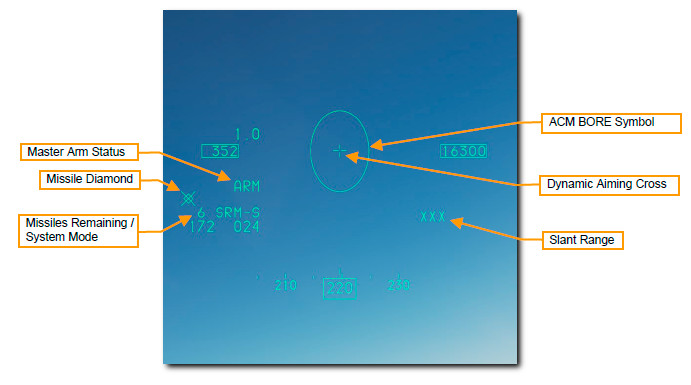{width="5.1068350831146105in"
height="2.846153762029746in"}

***3. Добиться захвата цели радаром в режиме ACM BORE.***

Радар захватит первую обнаруженную цель в ACM Bore Symbol. Target
Designator Box будет присутствовать над целью, захваченной радаром.

Установите, на MFD, режим прямой видимости (Sight mode) SLAVE **OSB
19**, ГСН поворачивается к линии захвата радара. Ракетный Ромб (Missile
Diamond) находится на цели. Рычание ракеты станет высоким, когда цель
захвачена.

{width="4.809027777777778in" height="2.625in"}

Зона динамического запуска (DLZ) будет отображаться справа от HMD, когда
цель обозначена с помощью радара. Контролируйте DLZ и оценивайте
ситуацию с угрозой, чтобы определить оптимальную точку запуска ракеты.
Символ HMD мигает, когда цель находится в пределах максимальной
дальности против маневрирующей цели

***4.Выполните мониторинг DLZ и оценка ситуации с угрозой для
определения оптимальной точки запуска ракеты***.

{width="1.8729166666666666in" height="1.5in"}

***5.*** ***Убедитесь, что маркер захвата на цели и слышен сигнал
блокировки.***

Рычание ракеты станет высоким, когда цель захвачена. Маркер ромб должен
быть наложен и следовать за целью.

***6. Нажмите переключатель Weapon Release на РУС, чтобы запустить
ракету.***

Ракета начнёт перехват цели, и будет выбрана следующая ракета в
последовательности подвесок.

AIM-9 - это оружие для стрельбы без контроля наведения, поэтому Вам нет
необходимости продолжать отслеживать ракету в полёте.

174

Dynamic Launch Zone

Dynamic Aiming Cross

Target Designator Box

Missile Diamond

Range Scale

Maximum Missile Range

Closure Rate and Range

Minimum Missile Range

[]{#AIM_120 .anchor}**AIM-120 AMRAAM**

AIM-120 AMRAAM - это ракета класса воздух-воздух с Активной головкой РЛС
наведения (Active Radar-Homing (ARH), которая может наводить себя на
цель, используя миниатюрный радар установленный в носовом конусе. Ракета
может также сопровождаться радаром в режимах «Одна цель» (STT) и
«Ситуационная осведомленность» (SAM). Благодаря активному наведению,
пилот может поражать сразу несколько целей и не ограничиваться
сопровождением РЛС наведения с самолёта ракеты в течение всего времени
полета ракеты.

AIM-120 является ракетой средней дальности и может поражать цели за
пределами 20 миль. Однако дальность поражения сильно зависит от аспекта
цели, высоты захвата, скорости запуска и маневров цели после запуска
ракеты. Как таковой, диапазон захвата AIM-120 может быть и менее 10 миль
в некоторых ситуациях.

В ближнем бою с воздуха AIM-120 также может запускаться в режиме БОРЕ
без поддержки радара. Как только ракета будет запущена, она будет искать
первую обнаруженную, ближайшую цель в сетке AIM-120 на HUD.

Будь осторожен в групповом бою!

***Порядок действий пилота***

1\. *Выберите основной режим **AAM или MSL.***

*2. Установите Главный переключатель вооружения (Master Arm) в положение
**Arm***

*3. Обнаружьте цель с помощью радара (необязательно, но рекомендуется)*

*4. Маневрируйте, пока цель не окажется в зоне запуска*

*5. Нажмите кнопку **Пуск** ракеты (Weapon Release), чтобы запустить
ракету.*

**176**

**AIM-120 Employment (Процедура)**

1.  Есть два способа войти в правильную конфигурацию SMS для запуска
    AIM-120:

***1а. Выберите AIM-120 на MFD, нажимая OSB 7, пока не отобразятся
AIM-120.***

Или же

***1б. Установите переключатель «Dogfight/Missile Override» (DOGFIGHT),
на РУД в положение «DGFT».***

Это отменяет любой другой основной режим и настраивает дисплеи для
воздушного боя. Позиция MSL обеспечивает условное обозначение на HUD для
доставки ракеты A-A и выбор загруженного типа ракеты самого большого
радиуса действия.

Количество и тип ракет отображается рядом с **OSB 7.** Пилоны с
загруженными ракетами отображаются внизу, а выбранный пилон заключён в
квадрат. Просмотрите доступные пилоны с помощью кнопки MSL Step на РУС
или выбрав соседнюю **OSB 16**.

**SLAVE / BORE** приказывает ракете либо следовать линии прямой
видимости радара (SLAVE), либо продолжать смотреть прямо вниз по оси
прицеливания (BORE). Это также можно включить с помощью переключателя
**CURSOR / ENABLE** на РУД.

> • В режиме прицеливания BORE данные о целеуказании с самолета не
> принимаются. Ракета использует свой собственный радар для обнаружения
> и отслеживания цели.
>
> • В режиме **SLAVE** данные о прицеливании передаются по каналу
> передачи данных до тех пор, пока ракета не будет в состоянии
> отслеживать цель со своим собственным радаром.

177

{width="5.259722222222222in"
height="2.714583333333333in"}

Operating Mode

Selected Weapon

Line of Sight

Available Stations

***2. Убедитесь, что символ A-A Missile отображается в HUD**.*

HUD "воздух-воздух" предоставляет информацию о состоянии и нацеливании
воздушных на воздушные ракеты. Большая часть символов в режиме NAV
сохраняется, но добавлено несколько новых функций, помогающих в
обнаружении цели и запуске ракеты.

{width="4.604166666666667in"
height="2.7083333333333335in"}

**Ракетный Ромб (Missile Diamond)** указывает начало линии обзора
ракеты. Она начинается в положении прицеливания искателя, но следует за
линией обзора радара или отслеживает захваченную цель, когда выбран
режим SLAVE, и выполняется захват.

**Круг допустимых ошибок захвата (Allowable Steering Error Circle
(ASEC)** показывает максимальную угловую вероятность ошибок захвата.
Значение ASEC пропорционально точке рулевого управления от центра круга
ASE. Круг ASE показывает зону, в которой должна находиться точка захвата
до запуска, чтобы поразить цель с заданной вероятностью поражения. Круг
увеличивается в размере при уменьшении расстояния до цели, что означает,
что при уменьшении расстояния ракета может быть запущена с большей
ошибкой ASEC). При маневрировании вашего самолета необходимо убедиться,
что контрольный сигнал возможности атаки находится как можно ближе к
центру круга ASEC.

**Сигнал управления атакой (Attack Steering Cue (ASC)** отображается
после захвата цели РЛС головкой радара ракеты.

178

Missile Diamond

Allowable Steering\
Error Circle

Master Arm Status

AAM Mode

***3. Обнаружить цель с помощью радара***

Как правило, цель будет захвачена с использованием RWS, TWS или любого
подрежима радара ACM, а AIM-120 будет установлен на SLAVE.

Когда захваченная цель находится вне поля HUD на виде, как показано
ниже, Линия определения цели (Target Locator Line (TLL) проходит от
Пушечной марки (Gun Cross) и указывает прямо на цель. Относительный угол
отображается рядом с Gun Cross, показывая количество градусов в десятках
между крестом и целью.

*Зона динамического запуска будет отображаться справа от HUD, когда цель
захвачена с помощью радара самолёта.*

**Range Scale** Диапазон шкалы дальности.

**Maximum Missile Range** Максимальная дальность полета ракеты

**Closure Rate and Range** Скорость сближения (узлах) и удаление цели на
шкале дальности (&gt;).

**Radar Activation Rang** Дальность РЛС ракеты для актив. режима

**Minimum Missile Range** Минимальная дальность пуска ракеты

**Time to Missile Radar Active**

(**А\*\***) Время до активации радара ракеты (в сек)

(**Т\*\***) Время до попадания ракеты в цель (в сек)

179

{width="5.0in" height="3.0833333333333335in"}

{width="3.125in" height="2.2708333333333335in"}

Relative Angle Off

Radar Target Locator Line

Dynamic Launch Zone

Range Scale

Maximum Missile Range

Closure Rate and Range

Radar Activation Range

Minimum Missile Range

Time to Missile Radar Active

***4. Маневрируйте, пока Attack Steering Cue (ASC) не окажется внутри
допустимого круга ошибок захвата (ASEC).***

Когда цель входит в HUD, поле цели (Target Designator Box) будет
отображаться над целью и ракетой

Ромб, (Diamond) будет отслеживать это местоположение.

Размер допустимого круга ASEC будет варьироваться в зависимости от
удаления от цели и аспекта. Вам необходимо что бы Attack Steering Cue
расположен как можно ближе к центру круга ASEC, насколько это возможно
при стрельбе для достижения наилучшей вероятности поражения цели
ракетой.

Контролируйте зону динамического запуска и оценивайте ситуацию с
угрозой, чтобы определить оптимальную точку запуска ракеты.

***5. Нажмите и удерживайте кнопку пуска ракеты (Weapon Release) оружия,
чтобы запустить ракету.***

Ракета будет отслеживать цель, и будет выбрана следующая ракета в
последовательности.

AIM-120 также может использоваться в режиме BORE без радиолокационного
захвата цели. Это используется, когда быстрый пуск должен быть сделан
без захвата цели радаром.

Ракетный радар активируется при запуске и направляет её по первой
обнаруженной цели, поэтому используйте этот режим осторожно.

180

{width="5.309027777777778in"
height="2.8958333333333335in"}

Target Designator Box

Missile Diamond

Dynamic Launch Zone

Allowable Steering\
Error Circle

Attack Steering Cue

AIR TO GROUND EMPLOYMENT

ПРИМЕНЕНИЕ ВООРУЖЕНИЯ

ВОЗДУХ - ЗЕМЛЯ

{width="8.314831583552056in"
height="10.986013779527559in"}

[]{#ВООРУЖЕНИE_ВОЗДУХ_ЗЕМЛЯ .anchor}**ВООРУЖЕНИE ВОЗДУХ - ЗЕМЛЯ**

**Attack Preparation (Подготовка к атаке)**

Прежде чем выйти в район целей и провести их атаку, вам нужно заранее
настроить системы вооружения самолета, чтобы вы могли наиболее
эффективно выполнить их атаку. Находясь на расстоянии не менее 40 миль
от цели, вам необходимо предпринять следующее:

1***а. Установите главный ручной выключатель в положение ARM.***

Оружие может быть применено при положении переключателя ARM вверх
(Master Arm). Если переключатель Master Arm находится в безопасном
положении (нейтрально (OFF) или вниз), применение оружия не возможно.

***1б. Установите переключатель лазерного подсвета в положение ARM.***

Это необходимо для включения лазерного указателя. Подсвет целей лазерным
лучом не возможен, если переключатель установлен в положение OFF.

{width="2.298611111111111in"
height="2.077777777777778in"}

***2. Переведите систему управления огнем в режим A-G, нажав кнопку
основного режима A-G на панели ICP.***

{width="2.623611111111111in"
height="2.0388888888888888in"}

{width="1.16875in"
height="1.5451388888888888in"}

182

[]{#MG1A1_Пушка .anchor}**MG1A1 20mm Gun Strafe **

**(Пушка MG1A1 20mm для атак с малой высоты)**

Автоматическая пушечная система M61A1 20MM обеспечивает пилота
эффективным оружием. В левой части фюзеляжа самолета установлено
6-ствольное орудие (с вращающимся блоком стволов, т.н. тип Гатлинга).
Пушка имеет боезапас 512 выстрелов/снарядов, скорострельность 6000
выстрелов в минуту.

183

**Gun Dispersion (Рассеивание снарядов)**

Снаряды в очереди, вылетевшие из ствола любой системы оружия, не летят
по прямой линии. Они расходятся в форме конуса после того, как они
вылетают из ствола. Круг рассеивания становится все больше и больше, в
форме конуса с увеличением наклонной дальности. Плотность траекторий
снарядов внутри конуса становится все меньше и меньше по мере
приближения к краю конуса.

Среднее рассеивание M61A1 составляет 8 мил (в диаметре) для 80%
выстрелов и 12 мил для 100% выстрелов. \* Подразделения ВВС США
выполняют программу прицеливания, чтобы гарантировать, что пушечная
система, установленная на самолете, соответствуют спецификациям
программы во время их эксплуатации.

Один мил равен 1/1000 радиана, поэтому 8 мил - это круг диаметром 8
футов на расстоянии 1000 футов, а 12 мил - круг диаметром 12 футов.
Размер круга будет увеличиваться с увеличением дальности до цели.

На практике это означает, что вы стреляете из пушки тем менее точно, чем
больше дальность до цели. В этом примере зеленый круг траекторий
снарядов - это круг диаметром 4 мил. Здесь снаряды наиболее плотны в
конусе. Красная заштрихованная область - 8-мил круг, через который
пройдет 80% снарядов в очереди в диапазоне дальности до цели. Оранжевая
заштрихованная область - это круг 12 мил, через который пройдут 100%
снарядов в очереди в диапазоне дальности до цели.

\* Это основано на MIL-DTL-45500 / 1A, который указывает: «В диапазоне
1000 дюймов 80% от 75-кратного (мин.) выстрелы должны быть полностью в
пределах круга диаметром 8,0 дюймов для необходимой точности» и паспорта
производителя. В нем говорится «диаметр 8 миллирадиан, круг 80
процентов».

Диаграмма рассеивания выстрелов из пушки - это круг, только если цель
перпендикулярна траектории полета. Она напоминает эллипс при стрельбе по
горизонтальной цели на земле.

{width="1.0470669291338583in"
height="1.0246916010498688in"}{width="4.383333333333334in"
height="1.2895833333333333in"}{width="5.4606474190726155in"
height="2.0185192475940505in"}

183

***Порядок действий пилота:***

1\. *Выберите **A-G Master Mode***

*2. Установите Главный переключатель вооружения (Master Arm) в положение
**Arm***

*3. Установите **Laser Arm Switch** в положение **Arm**, если требуется
использование лазерного дальномера.*

*4. Выберите подрежим **STRF (GUN)** в **SMS MFD***

*5. Наложите маркер **Pipper** на цель*

*6. Нажмите **Кнопку стрельбы** (**Курок)** на РУС ко **второму
фиксатору**, чтобы открыть огонь из пушки.*

**Подготовка оборудования для атаки наземных целей.**

После выбора основного режима **A-G** страница **SMS Air-to-Ground (SMS
A-G)** отображается справа на MFD.

В зависимости от приоритетного оружия информация на странице SMS A-G
может отличаться.

Выполните следующие действия для достижения правильной конфигурации
систем вооружения для атаки наземных целей с помощью пушки:

1а. ***Выберите подрежим STRF на MFD, нажимая OSB 1, пока не отобразится
GUN*;**

***или ***

***1б. Установите переключатель Dogfight / Missile Override (DOGFIGHT)
на РУД в положение DGFT.***

{width="4.096373578302712in"
height="2.395062335958005in"}

***2. Убедитесь, что символы STRF отображаются в HUD.***

Прицельная метка (Strafe Reticle) является прицелом по умолчанию для
прицеливания с в режиме **A-G** и обеспечивает прицельной информацией,
необходимой для эффективной стрельбы из пушки.

Центр прицела - это метка в виде точки/ пиппер (aiming pipper), и он
показывает, куда попадут снаряды, если цель находится в пределах
досягаемости по дальности. Используя пиппер, это просто - «наложить
метку на цель» и нажать на курок.

Наклонная Дальность до цели указывается цифровым диапазоном в правом
нижнем углу HUD и сеткой дальности в виде круга, которая по – часовой
стрелке или против часовой стрелки движется по окружности (**Strafe
Reticle**) дальности со штрихами дальности. Положение дальномера
(внутренняя окружность) (Ranging Reticle) указывает наклонную дальность
до точки положения маркера/пиппера на земле. Каждая часть четверти круга
на прицельной сетке составляет 3000 футов наклонной дальности, поэтому
дальности соответствуют:

> • 12 часов = 12 000 футов ( 3658 метров )
>
> • 9 часов = 9000 футов ( 2743 метра )
>
> • 6 часов = 6000 футов ( 1829 метров )
>
> • 3 часа = 3000 футов ( 914 метров )

Положение метки **In-Range Cue** в пределах дальности поражения может
быть установлено пилотом, обеспечивая дополнительную визуальную метку
для определения эффективного диапазона/дальности относительно цели
запланированной для атаки.

184

{width="5.1in" height="2.8958333333333335in"}

Gun Cross

Strafe Reticle

Ranging Reticle

Pipper

In-Range Cue

Master Arm Status

A-G Strafe Submode

Slant Range

***3. Маневрируйте своим самолетом, чтобы расположить метку/пиппер в
цель.***

Один из методов - поместить пиппер в короткое расстояние от цели и
позволить ему проследить вдоль земли, пока не достигнет цели. Это
произойдет естественным образом при уменьшении наклонной дальности.

{width="2.8180555555555555in"
height="1.3118055555555554in"}

Если установлен подвесной контейнер, то, чтобы улучшить вычисление
решения для стрельбы производится определение дальности с помощью
лазерного подсвета цели. См. Раздел «Laser Ranging» для получения
дополнительной информации.

***4. Нажмите Курок до второго фиксатора**,**, чтобы открыть огонь их
пушки, когда метка/пиппер находится над целью, и вы находитесь в
пределах эффективной дальности стрельбы.***

На примере ниже метка/пиппер находится на цели на удалении по наклонной
дальности около 5500 футов, как показано положением дальномера на
прицельной сетке.

{width="1.7013888888888888in"
height="1.7013888888888888in"}

Угол наклона траектории (угол пикирования) сильно влияет на
эффективность поражения цели. Когда снаряды вылетают из ствола, они
постепенно рассеиваются по своим траекториям и теряют скорость.
Повышенная дисперсия и потеря скорости снижают точность и эффективность
оружия. Эффективная дальность поражения обычно составляет от **2500** до
**7000** футов. Для бронетехники ближе - лучше, и вы должны атаковать
цели сзади, где ее броня самая слабая.

Когда атакуете наземные цели с пушки, будьте осторожны, чтобы избежать
поражения Вас целью. Слишком увлечение процессом прицеливания может
привести к тому, что вы не заметите невидимую угрозу или не начнете
атаковать слишком близко. Не становитесь легкой целью для пулемета БТРа!

Как только вы достигнете минимальной дальности атаки, прекратите атаку,
как по горизонтали, так и по вертикали, чтобы избежать ответного огня
противника. Возможно, Вам понадобится сбросить тепловые ловушки в
случае, если по Вам была запущена инфракрасная ракета во время вашей
атаки цели, из сил ПВО цели, но вы ее не видели.

**185**

**In-Range Cue Update (Метка, точка, рекомендованной дальности открытия
стрельбы)**

Положение метки In-Range Cue на сетке можно изменить, выбрав **OSB9**
рядом с расстоянием In-Range Cue на странице SMS.

{width="3.8833333333333333in"
height="2.558333333333333in"}

Введите новое расстояние для метки в пределах диапазона поражения цели,
используя **OSB** слева и справа от дисплея (значения указаны для кнопок
**OSB 6-10** и **OSB 16-20**, и выберите **ENTR (OSB2)**.

Вы можете исправить ошибочно введенные значения, выбрав **RCL (OSB4)**,
или вернуться на страницу SMS, не внося изменений, выбрав **RTN
(OSB3).**

{width="3.6881944444444446in"
height="2.558333333333333in"}

186

In-Range Cue Distance

In-Range Cue Distance

Вы вернетесь на страницу SMS и отобразится новое значение. Метка
**In-Range Cue** будет расположена на HUD Strafe Reticle на этом новом
расстоянии.

{width="5.272916666666666in" height="2.50625in"}

187

In-Range Cue Distance

[]{#НАР .anchor}**2.75" Rockets (НАР)**

НАР наносят больше повреждение цели, чем 20-миллиметровая пушка, но их
лучше всего используются в качестве АСП для поражения площадных целей.
Они выпускаются с различными вариантами боеголовок для различных целей,
включая фугасные (High Explosive (HE), фугасные противотанковые (High
Explosive Anti-Tank (HEAT) и бронебойные(кумулятивные) (Armor Piercing
(AP). Ракеты, снаряженные белым фосфором (White Phosphorus (WP) могут
также использоваться как зажигательные, для поражения легкогорючих целей
или для маркировки целей на земле их характерным белым дымом.

***Порядок действий пилота:***

1\. *Выберите **A-G Master Mode***

*2. Установите Главный переключатель вооружения (Master Arm) в положение
**Arm***

*3. Установите **Laser Arm Switch** в положение **Arm**, если требуется
использование лазерного дальномера.*

*4. Выберите подрежим и НАР **в** **SMS MFD***

*5. Наложите маркер **Pipper** на цель*

*6. Нажмите кнопку **Пуск** ракеты (**Weapon Release**) на РУС, чтобы
произвести пуск НАР.*

**Target Attack (CCIP) (Прицеливание в режиме CCIP)**

После выбора основного режима **A-G** страница **SMS Air-to-Ground (SMS
A-G)** отображается на правом MFD.

В зависимости от приоритетного оружия информация на странице SMS A-G
может отличаться. Выполните следующие действия, чтобы получить
правильную конфигурацию и атаковать наземные цели с помощью ракет в
режиме CCIP:

***1. Выберите НАР на МФД, нажимая OSB 6, пока не отобразятся ракеты.***

**188**

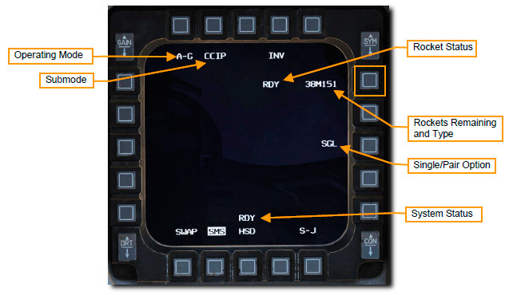{width="4.309858923884515in"
height="2.502542650918635in"}

***2. Убедитесь, что выбран режим пуска CCIP (OSB 2), и установите
желаемую опцию Single / Pair (OSB 8).***

Ракеты могут быть запущены одиночным (SGL) или парным (PAIR) пуском.
Если выбран SGL, ракеты будут запускаться по одной и только с одного
блока. При выбранном режиме PAIR ракеты будут запускаться из каждого
блока при условии, что ракетные блоки загружены на пилонах **3** и
**7**.

189

{width="5.0in" height="2.8333333333333335in"}

Submode

Rockets Remaining\
and Type

Single / Pair Option

***3. Убедитесь, что символика CCIP Rockets отображается в HUD.***

Режим CCIP, пожалуй, является наиболее интуитивным режимом, из всех
остальных режимов применения АСП на самолёте, наведения оружия на цель и
в основном включает в себя размещение «точки смерти» (death dot) маркера
(Pipper) CCIP над целью и пуска ракет. Наведи – пусти – забудь.

Центр маркера CCIP показывает, куда пойдут ракеты, предполагая, что цель
находится в пределах досягаемости по дальности. Наклонная дальность
(Slant Range) до цели указывается цифрами в правом нижнем углу HUD.

Маркер In-Range Cue будет отображаться над маркером CCIP, когда
наклонная дальность будет менее 8000 футов и применение ракет наиболее
эффективно.

{width="5.054861111111111in" height="2.375in"}

190

Gun Cross

CCIP Pipper

Master Arm Status

CCIP Submode

Slant Range

***4. Маневрируйте своим самолетом, чтобы установить маркер CCIP на
цель.***

Один из методов - поместить маркер в непосредственной близости от цели и
позволить ему проследовать вдоль земли, пока не достигнет цели. Это
произойдет естественным образом при уменьшении дальности до цели.
Контролируйте дальность, отображаемую в правом нижнем углу HUD, и
следите за появлением сигнала (Маркер In-Range Cue) о нахождении
самолёта в пределах диапазона пуска над маркером (Pipper) прицеливания.

{width="3.3375in" height="1.49375in"}

Определение дальности с помощью Лазерного подсвета может быть выполнено,
чтобы улучшить вычисленное решение для пуска НАР, если установлен модуль
прицеливания. См. Раздел «Laser Ranging» для получения дополнительной
информации.

***4. Нажмите кнопку Пуск** (**Weapon Release)**, **чтобы выполнить пуск
НАР, когда маркер CCIP находится над целью, и Вы находитесь в пределах
эффективного диапазона пусков.***

Маркер In-Range Cue - это линия над маркером CCIP, которая отображается,
когда наклонный диапазон составляет менее 8000 футов. В этом примере
(ниже) pipper находится на цели, и отображается сигнал в диапазоне.

{width="2.870138888888889in"
height="1.804861111111111in"}

Когда проводите атаку цели НАР, будьте осторожны, чтобы избежать
излишнего внимания цели. Слишком большое внимание на цель может привести
к тому, что вы не заметите ранее не обнаруженную невидимую угрозу или не
начнете атаковать слишком близко от другой вероятной цели. Не
становитесь легкой целью для пулемета БТРа «в кустах»!

Как только вы достигнете минимальной дальности атаки, прекратите её,
чтобы избежать ответного огня противника. Возможно, вы также захотите
прервать атаку в случае, если по вас была запущена инфракрасная SAM.

191

{width="2.443662510936133in"
height="1.6264905949256343in"}

[]{#Неуправляемые_бомбы .anchor}**Unguided Bombs (Неуправляемые бомбы)**

Неуправляемые бомбы, которые F-16C может использовать, подразделяются на
три категории.

-   Универсальные /общего назначения/ (General Purpose (GP),

-   Кассетные (Cluster )

-   Тренировочные (Training).

**General Purpose Bombs (Бомбы общего назначения)**

**MK 82 LDGP**. Стандартная бомба тип MK 82 представляет собой «гладкую»
бомбу с низким сопротивлением, также называемую бомбой общего назначения
с низким сопротивлением (LDGP). Бомба обтекаемая, с четырьмя коническими
хвостовыми стабилизаторами для устойчивости полета. Бомба имеет тонкий
стальной кожух, который способствует фрагментации при взрыве. MK 82
может подвешиваться отдельно на держатель (WWP) пилона крыла или три
бомбы могут быть подвешены на подвеску для размещения 3-х бомб (TER). MK
82 служит основой для нескольких других бомб, включая MK 82AIR, GBU-12 и
GBU-38.

**MK 82 AIR**. В этой версии MK 82 добавлен узел хвостовика высокого
сопротивления BSU-49/B, также называемый «баллут» (ballute). Это
позволяет бомбе быстро замедляться после сброса. Сброс таких
отстающих/тормозящих бомб на малой высоте позволяет не попасть в их
поражающий эффект. Вы можете выбрать сброс MK 82AIR в режиме без
торможения на траектории - «slick». Для сброса в режиме «slick»,
выберите только носовой взрыватель, а чтобы сбросить с торможением,
выберите настройку носовой / хвостовой или хвостовой взрыватель на
странице SMS.

**MK 82 SE**. Эта тип «Змеиный глаз» (Snake Eye). MK 82 предшествует MK
82 AIR и использует стабилизаторы, которые развертываются из хвостовой
части Mk-15, чтобы замедлить падение бомбы. Вы можете выбрать сброс MK
82 SE с торможением или «slick» режиме. Чтобы бросить как «slick»,
выберите только носовой взрыватель, а чтобы сбросить с торможением,
выберите настройку носовой / хвостовой или хвостовой взрыватель на
странице SMS.

МК **MK 84 LDGP**. MK 84 является «старшим братом» MK 82 и весит 2039
фунтов /с 945 фунтами H-6 или взрывчатого вещества Tritonal. Несмотря на
то, что MK 84 наиболее эффективен против небронированных и
легкобронированных целей, он также может быть эффективен против
бронированных целей при падении в непосредственной близости. MK 84 может
быть установлен только на держатели WWP и не может быть загружен на TER.

МК 84 служит основой для других бомб, которые применяют с F-16C, в том
числе GBU-10 и GBU-31.

**Cluster Bombs (Кассетные бомбы)**

**CBU-87**. Боеприпасы с комбинированным эффектом CBU-87 (CEM) весят 950
фунтов и являются универсальной кассетной бомбой. ДSUU-65 Tactical
Munitions Dispenser, из которого состоит бомба, содержит 202 бомбы с
комбинированным эффектом (CEM) BLU-97/B, которые эффективны против
легкобронированных и небронированных целей. Разброс точек падения бомб
зависит от настройки высоты раскрытия (HOF) и скорости вращения,
заданной с помощью «циферблатов» на бомбе и отображаемой на странице
SMS. Тем не менее, общая площадь поражения бомбы составляет до 200 на
400 метров.

CBU-87 может монтироваться отдельно на WWP. Если установлены внешние
топливные баки на крыле, из-за ограничений по зазору, только два
Боеприпаса могут быть загружены на TER. Это обычно называют «наклонной
нагрузкой» (slant load).

**CBU-97**. CBU-97 - это Боеприпас весом 1000 фунтов, содержащий
суббоеприпасы с сенсорным зарядом в кассете SUU-66B для специальной
атаки бронетехники. Это сенсорное оружие (SFW) содержит 10
суббоеприпасов BLU-108 / B и 40 снарядов в форме "хоккейной шайбы" в
форме инфракрасного сенсора.

Каждый BLU-97 / B SFW состоит из кумулятивного заряда, стального корпуса
с надрезом и циркониевого кольца для поражения брони и противопехотных
осколков, и зажигательных эффектов. Каждый SFW предназначен для
разделения на 300 фрагментов (осколков).

Учитывая угол атаки этого боеприпаса под большими углами, сверху, SFW
может быть эффективен и против легкой брони, покрывающей верх
бронированного транспортного средства, такого как танк.

Как и в случае с CBU-87, площадь рассеивания бомб зависит от высоты
раскрытия (HOF), установленной на «циферблатах» бомбы и отображаемой на
странице SMS. Скорость вращения не устанавливается. Применяются те же
ограничения на подвеску боеприпасов, что и на CBU-87: один на WWP и два
на TER.

**192**

**Training Bombs (Учебные Бомбы)**

**БД-33.** BDU-33 - небольшая учебная бомба, которая имитирует
баллистику более крупных бомб общего назначения тип MK 82. BDU-33
содержит небольшой заряд дыма, чтобы помочь точному определению места
падения.

**193**

[]{#Страница_SMS_AG .anchor}**Unguided/Guided Bombs A-G SMS Page **

**(Неуправляемые / управляемые бомбы. Страница SMS A-G)**

Дисплей SMS A-G и процедура настройки системы управления вооружением для
атаки с помощью управляемых или неуправляемых бомб очень похожи для всех
типов бомб. Первоначальная настройка вооружения будет рассмотрена только
один раз, с различиями в подрежиме прицеливания CCIP.

Подрежим CCRP рассматриваются в отдельных разделах ниже.

***Порядок действий:***

*1. Выберите режим вооружения **A-G Master Mode***

*2. Выберите бомбы и установите нужные параметры в SMS A-G MFD*

После выбора основного режима A-G страница SMS Air-to-Ground (SMS A-G)
отображается справа на MFD.

В зависимости от приоритетного оружия информация на странице SMS A-G
может отличаться. Выполните следующие действия, чтобы получить
правильную конфигурацию системы вооружения и атаковать наземные цели с
помощью GP bombs в режиме CCIP:

1\. ***Выберите тип боеприпаса на МФД, нажимая OSB 6, пока не отобразится
тот, который вы хотите применить***.

194

Operating Mode

Submode

Fuzing Option

Weapon Status

Bombs Remaining\
and Type

Selected Profile

Single / Pair Option\
and Release Pulses

Release Interval Distance

Release Pulses Requested

System Status

{width="5.0509416010498684in"
height="2.493150699912511in"}

**Выберите нужный профиль для выбранного АСП.**

Два разных профиля предварительно установлены по умолчанию. К ним
относятся типовые настройки режима сброса, опция выбора взрывателя,
импульсы сброса, расстояние между точками падения бомб и интервал
сброса. Если профиль уже соответствует вашему запланированному профилю
атаки, то больше никаких изменений не требуется! Если нет, выполните
действия, описанные в этом разделе, чтобы настроить профиль по своему
заданию.

***2.Выбор OSB 7 рядом с текущим профилем для переключения между двумя
вариантами: PROF1 и PROF2.***

*PROF1 – для бомбометания в режиме CCIP*

*PROF2 – для бомбометания в режиме* CCRP

{width="3.8048611111111112in"
height="2.49375in"}

Изменения настроек, сделанные при выборе профиля, сохраняются для
последующего использования. Обычно они должны быть установлены или
проверены как часть карты (чек-листа) запуска самолета, хотя они могут
быть изменены в любое время.

**195**

> 3\. ***Выберите нужный подрежим сброса (OSB 2).***
>
> Если выбран подрежим, отличный от того, который вы хотите, вы можете
> нажать OSB 2 для отображения следующих опций:
>
> • CCIP - непрерывно вычисляемая точка падения (применяется как в ГП
> так и в режиме пикирования)
>
> • CCRP - непрерывно вычисляемая точка сброса (применяется как в ГП так
> и в режиме пологого пикирования)
>
> • DTOS – сброс в пикировании с предварительным захватом цели (Dive
> Toss)
>
> • LADD – низковысотное бомбометание с кабрирования (45 град) (Low
> Altitude Drogue Delivery)
>
> • MAN – ручной

Затем выберите OSB рядом с нужным подрежимом. Это установит новый
активный подрежим и вернет вас к

страница SMS A-G

Вы также можете циклически переключаться между подрежимами, нажимая
кнопку «Missile Step» (MSL STEP) на РУС.

196

Submode Options

{width="3.6493055555555554in"
height="2.49375in"}

4\. ***Установите необходимую опцию взрывателя бомбы (OSB 18).***

Бомбы обычно оснащены двумя взрывателями, один в носу и один в хвосте.
Иногда они устанавливаются с различными настройками задержки удара,
чтобы пилот мог выбирать, как работает взрыватель и когда детонирует
бомба после удара. Иногда мгновенная детонация желательна для эффектов
фрагментации, а иногда задержанная детонация желательна для
проникновения или образования кратеров.

Выбор OSB 18 переключается между тремя вариантами постановки взрывателей
(Fuzing Option): NOSE, TAIL и NSTL (Nose / Tail). Обычно устанавливается
на NSTL (нос / хвост) для эффективности, если не требуется особый
эффект, когда бомба детонирует.

Есть также некоторые особые случаи, когда опция взрывателя изменяет
поведение бомбы после сброса:

MK 82 AIR / SE:

> • NOSE - Нос - низкое сопротивление
>
> • TAIL - ХВОСТ – высокое сопротивление
>
> • NSTL - Нос/Хвост - высокое сопротивление

CBU-87/97:

> • NSTL – раскрытие кассеты по высоте с использованием настроек,
> отображаемых на странице SMS
>
> • NOSE – раскрытие сразу после сброса
>
> • TAIL – без раскрытия кассеты (Dud)

197

Fuzing Option

{width="4.285416666666666in"
height="2.6881944444444446in"}

***5. Установите желаемую опцию Single / Pair (OSB 8).***

Бомбы могут быть сброшены с выбранного пилона одиночно (**SGL**) или
парой (**PAIR**).

Если выбран **SGL**, бомбы будут сбрасываться только с одного
пилона/держателя.

При выборе **PAIR** бомбы будут сбрасываться с обеих противоположных
пилонов/держателей, при условии, что одинаковые бомбы загружены на
пилоны 4 и 6 или 3 и 7.

198

{width="3.700133420822397in"
height="2.6901399825021874in"}

***6. Установите желаемую дистанцию сброса, если нужно сбросить более
одной бомбы. (OSB 9).***

Время между импульсами сброса вычисляется вычислителем вооружения для
обеспечения падения бомб на определённом, заданном расстоянии по линии
разрывов вдоль земли. Допустимые расстояния варьируются от 10-999 футов.
Этот параметр не действует, если предусмотрен сброс только одной бомбы
или одной пары бомб.

Введите новое расстояние между точками падения, используя **OSB** слева
и справа от дисплея, и выберите **ENTR**.

{width="3.545138888888889in"
height="2.376388888888889in"}

Вы можете исправить ошибочно введенные значения, выбрав **RCL** или
вернуться на страницу SMS, не внося изменений, выбрав RTN.

{width="3.7534722222222223in"
height="2.50625in"}

199

Interval Distance

Impact Spacing Distance

***7. Установите количество импульсов сброса, если нужно сбросить более
одной бомбы. (OSB 10).***

Устанавливает количество импульсов сброса, отправляемых на точки
подвески бомб при нажатии кнопки сброса АСП. Например, установка 1
сбрасывает только одну бомбу или пару бомб за раз, в то время как
установка 4 сбрасывает четыре бомбы или четыре пары бомб за раз. Это
обычно известно, как «последовательный сброс» или «сброс серией».

{width="3.298611111111111in" height="2.3375in"}

Введите желаемое количество импульсов на сброс с помощью OSB слева и
справа от дисплея и выберите ENTR.

Вы можете исправить ошибочно введенные номера, выбрав RCL, или вернуться
на страницу SMS, не внося изменений, выбрав RTN.

{width="3.454861111111111in" height="2.50625in"}

200

Release Pulses

Release Pulses

[]{#Режим_CCIP .anchor}Unguided Bombs CCIP Attack

(Режим Непрерывно вычисляемой точки падения)

Режим Непрерывно вычисляемой точки падения (CCIP) - это вычисляемый
режим визуального сброса по обнаруженной цели с ручным сбросом АСП. Этот
режим обеспечивает высокую степень гибкости прицеливания и сброса,
поскольку точка на земле, на которую будет воздействовать бомба после
попадания в неё, непрерывно указывается CCIP Pipper на HUD. Обозначение
цели не требуется. Бомбометание возможно с режима ГП или пикирования.
Поместите марку Pipper на цель и сбросьте бомбу.

***Порядок действий***

> 1\. *Выберите **A-G Master Mode***
>
> *2. Установите главный переключатель **Master Arm** в положение
> **Arm***
>
> *3. Установите переключатель **Laser Arm** в положение **Arm,** если
> требуется использование лазерного дальномера.*
>
> *4. Выберите Бомбы и нужные опции в SMS МФД*
>
> *5. Наведите марку прицела Pipper на цель*
>
> *6. Нажмите кнопку **СБРОС (Weapon Release**), чтобы сбросить АСП*

1***. Убедитесь, что символика CCIP отображается в HUD***.

Если точка падения бомбы не лежит в поле зрения HUD, (CCIP Pipper
находится за пределами поля зрения HUD) сигнал временной задержки (TDC)
отображается в виде короткой горизонтальной линии на линии падения бомб
(линии разрывов). В этой ситуации необходимо изменить режим полёта или
может быть использован второй метод прицеливания «назначения CCIP», но
он будет рассмотрен в следующем ниже разделе.

201

{width="4.954861111111111in" height="3.03125in"}

Flight Path Marker

Bomb Fall Line

Pull-Up Anticipation Cue

Slant Range

Time Delay Cue

Master Arm Status

CCIP Submode

CCIP Pipper

***2. Маневрируйте своим самолетом, чтобы наложить CCIP Pipper на
цели.***

Когда TDC больше не отображается на линии разрывов, Pipper находится в
поле зрения HUD. Это будет точкой падения бомб, если бомбы будут
сброшены немедленно.

Один из методов прицеливания - поместить FPM впереди цели, а Pipper чуть
ниже цели. Наложите линии разрывов бомб на цель и наблюдайте движение
Pipper по этой линии. Это будет происходить естественным образом по мере
уменьшения дальности до цели.

{width="4.59375in" height="2.3125in"}

Следите за маркером - перевернутой скобкой - Pull-Up Anticipation Cue,
чтобы убедиться, что он не находится выше маркера траектории полета -
FPM. Маркер PUAC обеспечивает визуальное представление высоты,
необходимой для подрыва взрывателя бомбы, или высоты, чтобы выполнить
маневр выхода из атаки, чтобы избежать воздействия бомбы или
столкновения с землёй на пикировании (в зависимости от того, что
наступит раньше). PUAC движется вверх, в направлении маркера траектории
полета (FPM), когда самолет снижается. Сброс бомбы с FPM ниже PUAC не
даст бомбе время на взведение и приведет к падению бомбы без взрыва.

Определение дальности до цели лазером улучшит вычисленное решение для
сброса, (если установлен модуль TGP). См. Раздел «Laser Ranging» для
получения дополнительной информации.

202

Flight Path Marker

Pull-Up Anticipation Cue

Bomb Fall Line

Target

CCIP Pipper

***3. Нажмите кнопку СБРОС (Weapon Release), чтобы сбросить бомбы, когда
Pipper CCIP находится над целью.***

Pipper CCIP будет в центре «клюшки», если в результате последовательного
сброса будет сброшено более одной бомбы. Держите кнопку СБРОС достаточно
долго, чтобы убедиться, что все АСП сброшено.

FPM мигает после того, как АСП сброшено..

{width="4.018055555555556in"
height="2.3854166666666665in"}

Немедленно перейдите в набор высоты и примите меры уклонения, чтобы
избежать попадания осколков бомбы и избежать огня противника.

203

CCIP Pipper

Target

Unguided Bombs CCIP Attack (Post-Designate)

(Атака неуправляемыми бомбами CCIP (назначения CCIP)

Режим назначения CCIP для сброса бомб CCIP применяется для ситуаций,
когда цель не может быть в поле зрения HUD при сбросе. Иногда это может
происходить при атаках с небольшого угла пикирования или большой высоты.

Действия для входа в режим CCIP такие же, как описано выше. Разница в
том, когда вы нажимаете и держите кнопку сброса АСП.

1\. *Маневрируйте своим самолетом, чтобы расположить CCIP Pipper на
цели.*

Когда на линии падения бомбы отображается сигнал временной задержки TDC
(Time Delay Cue), Pipper не находится в поле зрения HUD, однако вы все
равно должны поместить Pipper над намеченной для атаки целью (точкой
падения бомбы).

Вы можете обозначать это место как цель, нажав и удерживая кнопку
СБРОСА. Компьютер управления огнем сделает все остальные вычисления.

{width="4.385416666666667in"
height="2.8645833333333335in"}

Определение дальности до цели лазером улучшит вычисленное решение для
сброса, (если установлен модуль TGP). См. Раздел «Laser Ranging» для
получения дополнительной информации.

204

Time Delay Cue

CCIP Pipper

Bomb Fall Line

Target

***2. Нажмите и удерживайте кнопку Сброс (Weapon Release).***

Отображаемая символика HUD идентична используемой для сброса в CCRP.
Держите маркер траектории полета на линии разрывов. Это выведет ваш
самолет на линию атаки цели, даже если цель будет вне поля зрения.

Метка Solution Cue (Решение на сброс) отображается в верхней части линии
разрывов. Она будет снижаться по линии разрывов, до сброса.

205

{width="4.7in" height="3.0729166666666665in"}

Solution Cue

Steering Line

Flight Path Marker

**3. *Удерживайте кнопку Сброс (Weapon Release) до тех пор, пока
«Solution Cue» не пройдет маркер траектории полета*.**

Продолжайте лететь маркером траектории полета над линией разрывов
(Steering Line), пока метка Solution Cue продолжает снижаться. Бомбы
сбрасываются, когда Solution Cue проходит маркер траектории полета
(Flight Path Marker).

Держите кнопку СБРОС достаточно долго, чтобы убедиться, что все АСП
сброшено. FPM мигает после того, как АСП сброшено.

Перейдите в набор высоты и примите меры уклонения, чтобы избежать
попадания осколков бомбы и избежать огня противника.

206

{width="4.490972222222222in"
height="2.9895833333333335in"}

Solution Cue

Steering Line

Г Flight Path Marker

[]{#Режим_CCRP .anchor}Unguided Bombs CCRP Attack

(Режим Непрерывно вычисляемой точки сброса)

Режим Непрерывно вычисляемой точки сброса (CCRP) обеспечивает вычисление
точки автоматического сброса бомб. Сброс АСП может быть выполнен как из
пологого пикирования, так и из режима горизонтального полёта.

Этот режим требует обозначения точки цели, из которой можно создать
решение для сброса бомбы. Пилот выходит на линию наведения (Steering
Line) в ручном режиме пилотирования до соответствующей точки сброса АСП,
и бомбы автоматически сбрасываются, так что они поражают цели.

***Порядок действий***

> *1. Выберите A-**G Master Mode***
>
> *2. Установите главный переключатель **Master Arm** в положение
> **Arm***
>
> *3. Установите **Laser Arm Switch** в положение **Arm**, если
> требуется использование лазерного дальномера.*
>
> *4. Выберите Бомбы и нужные опции в SMS МФД*
>
> *5. Установите желаемый номер ППМ **(steerpoint number)** или
> назначьте цель с помощью TGP.*
>
> *6. Центр FPM на линии разрывов Steering Line*
>
> *7. Нажмите и удерживайте кнопку **Сброс (Weapon Release)**, чтобы
> сбросить бомбы*.

***1. Убедитесь, что символика CCRP отображается в HUD.***

Система управления огнем обеспечивает отображение линии наведения
(атаки) (SL) для обеспечения выхода для атаки по назначенной цели.
Поместите маркер траектории полета (FPM) на SL и удерживайте кнопку
Сброс. Бомбы будут сброшены в необходимой точке с учётом ветра.

Маркер Solution Cue отображается в верхней части SL. Он снизится по
линии, когда дальность до цели уменьшится, и бомбы вот-вот будут
сброшены.

Когда указатель цели (TD) находится за пределами поля HUD на виде, как
показано выше, линия указателя цели (TLL) выходит от Gun Cross, и
направлена прямо на цель. Относительный угол отображается рядом с Gun
Cross, показывая количество градусов в десятках между крестом (Gun
Cross) и целью.

207

{width="5.054861111111111in"
height="2.2708333333333335in"}

Solution Cue

Target Locator Line

Steering Line

Target Designator

Master Arm Status

CCRP Submode

Time to Release

Slant Range

Pull-Up Anticipation Cue

Flight Path Marker

Gun Cross

***2. Определите цель.***

Чтобы рассчитать решение по сбросу в режиме CCRP, сначала должна быть
обозначена цель. Это может быть сделано:

• Выбором ППМ (Steerpoint), который размещен на цели (в районе цели).

• Назначение цели с помощью Targeting Pod (если установлен).

Обновление местоположения цели может быть сделано путем наложения TD Box
в HUD или наложения курсоров TGP на МФД в новое положение цели с помощью
Cursor / Enable Control на РУД.

Следите за маркером - перевернутой скобкой - Pull-Up Anticipation Cue,
чтобы убедиться, что он не находится выше маркера траектории полета -
FPM. Маркер PUAC обеспечивает визуальное представление высоты,
необходимой для подрыва взрывателя бомбы, или высоты, чтобы выполнить
маневр выхода из атаки, чтобы избежать воздействия бомбы или
столкновения с землёй на пикировании (в зависимости от того, что
наступит раньше). PUAC движется вверх, в направлении маркера траектории
полета (FPM), когда самолет снижается. Сброс бомбы с FPM ниже PUAC не
даст бомбе время на взведение и приведет к падению бомбы без взрыва.

Определение дальности до цели лазером улучшит вычисленное решение для
сброса, (если установлен модуль TGP). См. Раздел «Laser Ranging» для
получения дополнительной информации.

208

{width="5.010416666666667in"
height="2.6041666666666665in"}

Solution Cue

Flight Path Marker

Steering Line

Pull-Up Anticipation Cue

Target Designator

Time to Release

***3. Нажмите и удерживайте кнопку Сброс (Weapon Release).***

Держите маркер траектории полета на Steering Line. Это выведет ваш
самолет на цель, даже если цель будет вне поля зрения.

Время до сброса отсчитывается в правом нижнем углу HUD.

Когда маркер Solution Cue начнет двигаться по Steering Line, примерно за
10 секунд до сброса, нажмите и удерживайте кнопку СБРОС на ручке. Это
дает команду компьютеру управления огнем на Сброс.

209

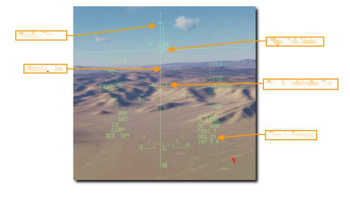{width="4.790972222222222in"
height="2.7604166666666665in"}

Solution Cue

Flight Path Marker

Steenna Line

Pull-Up Anticipation Cue

Time to Release

***4. Держите кнопку Сброс (Weapon Release) нажатой до тех пор, пока
Solution Cue не пройдет маркер траектории полета*.**

Продолжайте выдерживать маркер траектории полета (Flight Path Marker)
над Steering Line, пока маркер Sulution Cue продолжает идти вниз. Бомбы
сбрасываются, когда Steering Cue проходит маркер траектории полета.

Держите кнопку Сброс достаточно долго, чтобы убедиться, что все бомбы
сброшены. FPM мигает после того, как сброс АСП выполнен.

{width="4.59375in"
height="2.3229166666666665in"}

210

Steering Line

Flight Path Marker

Time to Release

Solution Cue

211

[]{#Управляемые_бомбы .anchor}**Управляемые бомбы**

**Laser Guided Bombs**

Разработка оружия с лазерным наведением значительно повысила точность
наведения и доставки АСП. С помощью комплектов для наведения базовые
бомбы общего назначения превращаются в бомбы с лазерным наведением
(LGB). Комплекты состоят из группы управления компьютером (CCG),
направляющих устройств, прикрепленных к передней части боеголовки для
обеспечения команд рулевого управления, и узла крыла, прикрепленного к
задней части для обеспечения подъема. LGBs - маневренное оружие
свободного падения, не требующее электронного соединения с самолетом. У
них есть внутренняя полуавтоматическая система наведения, которая
обнаруживает лазерную энергию и направляет оружие к цели, освещаемой
внешним лазерным источником. Обозначение может быть расположено в
самолете доставки, другом самолете или наземном источнике.

Все оружие LGB имеют группу управления компьютером (CCG), боеголовку
(корпус бомбы с взрывателем (bomb body with fuze) и аэродинамическую
группу (airfoil group). Компьютерная секция передает командные сигналы
направления на соответствующую группу управления. Навигационные карты
прикрепляются к каждому квадранту блока управления для изменения
траектории полета оружия.

Траектория полета LGB разделена на три этапа: баллистическое, переходное
и конечное управление. Во время баллистической фазы оружие продолжает
движение по неуправляемой траектории, определяемой траекторией полета
самолета доставки в момент сброса. В баллистической фазе отношение
доставки приобретает дополнительное значение, поскольку маневренность
LGB связана со скоростью оружия во время наведения терминала.
Следовательно, потеря воздушной скорости во время баллистической фазы
равняется пропорциональной потере маневренности. Переходный этап
начинается с захвата лазерного пятна на цели. На переходном этапе оружие
пытается выровнять свой вектор скорости с вектором прямой видимости к
цели. Во время наведения терминала LGB пытается сохранить свой вектор
скорости на одной линии с мгновенной линией прямой видимости. В момент
мгновенного выравнивания отраженная энергия лазера центрируется на
детекторе и переводит АСП в положение отслеживания цели, что заставляет
оружие лететь по баллистической, но управляемой траектории к цели.

**GBU-10 Paveway II.** Этот блок управляемой бомбы (GBU) весит 2562
фунта и является в основном лазерной версией управляемой бомбы Mk-84 с
боеголовкой общего назначения. Лазерный детектор на носу искателя
обнаруживает отраженную энергию назначающего лазера при установленном
лазерном коде. После падения крыловидные аэродинамические поверхности в
задней части бомбы расширяются и используются для маневрирования бомбы
до точки обозначенной лазером. Вместо плавного и постоянного ввода
корректировок курса для достижения цели, бомба использует серию
дискретных входных корректировок, и это часто называют режимом наведения
«взрывом».

GBU-10 можно подвесить только на стойке держателя MAU-12 на пилонах 3,
4, 6 и 7. Подходящими целями для GBU-10 являются большие и / или
бронированные цели, которые требуют точного и мощного удара. Такие цели
часто включают мосты, бункеры и усиленные командные пункты.

**GBU-12 Paveway II.** GBU-12 Paveway II. Этот GBU является версией
неуправляемой бомбы общего назначения Mk-82 с лазерным наведением.
Наведение GBU-12 использует те же принципы, что и GBU-10, с той лишь
разницей, что бомба, на которой основан LGB GBU-12 может монтироваться
отдельно на держателе MAU-12 на пилонах 3, 4, 6 и 7. Из-за ограничений
по зазору на держатель TER могут быть загружены только две из них.
Обычно это называется «наклонная нагрузка».

212

[]{#Laser_Code_Bomb .anchor}**Laser Code**

Головка самонаведения (искателя) на каждой бомбе с лазерным наведением
настроена на отслеживание только определенного кода частоты лазерного
импульса (PRF). Они устанавливаются вручную экипажем загрузки АСП во
время наземной подготовки и не могут быть установлены или изменены из
кабины во время полета.

Лазерный код в ГСН бомбы может быть установлен с помощью редактора
миссий. В этом примере лазерный код на каждой голове искателя бомбы -
1564.

Дополнительный метод установки лазерного кода для ГСН бомб реализован в
наколенном планшете летчика в игре. Вы можете получить доступ к
настройке кода, используя клавиатурное сочетание клавиш RSHFT + K, а
затем используйте клавиши \[ \] (скобки) для доступа к странице.

Лазерный указатель на Targeting Pod должен быть установлен в
соответствии с кодом на бомбе. Смотрите раздел на странице LASR DED для
процедур.

**SMS-страница**

Дисплей SMS A-G и процедуры настройки параметров атаки с помощью
управляемых или неуправляемых бомб идентичны. См. Смотрите раздел
SMS-страницы Bombs A-G для ознакомления с процедурами.

{width="3.1330129046369204in"
height="1.412587489063867in"}

[]{#Laser_Guided_Bomb .anchor}Laser Guided Bomb CCRP Attack

Режим Непрерывно вычисляемой точки сброса (CCRP) обеспечивает
вычисляемый автоматический сброс бомб.

Это может быть сделано как из снижения, горизонтального полёта
(wings-level) или с больших высот (nose-high attitude). Атака бомбой с
лазерным наведением идентична неуправляемым бомбам с добавлением
лазерного обозначения с Targeting Pod (TGP).

В этом режиме требуется точка обозначения цели, из которой можно создать
решение для сброса АСП. Управление пилотом обеспечивается полет до
соответствующей точки сброса, и бомбы автоматически сбрасываются в
нужное время, так что они поражают цель.

***Порядок действий***

> 1\. *Выберите **A-G Master Mode***
>
> *2. Установите главный **Master Arm** переключатель в положение
> **Arm***
>
> *3. Установите переключатель **Laser Arm** в положение **Arm***
>
> *4. Выберите Бомбы и нужные опции в SMS MFD*
>
> *5. Установите желаемый номер **ППМ (steerpoint number)** или
> назначьте цель с помощью TGP.*
>
> *6. Центр FPM на* Steering *Line*
>
> *7. Нажмите и удерживайте кнопку **Сброс (Weapon Release)** чтобы
> сбросить АСП в вычисленной точке.*
>
> *8. Выдерживайте лазерный подсвет на цель как минимум до 8-12 секунд
> до попадания АСП.*

***1. Убедитесь, что символика CCRP отображается в HUD.***

Система управления огнем обозначает линии наведения (атаки) (Steering
Line (SL) для обеспечения выхода на точку сброса по назначенной цели.
Поместив маркер траектории полета (FPM) на SL и удерживайте кнопку
СБРОС, бомбы будет сброшены нужное время с учетом ветра.

Маркер Solution Cue отображается в верхней части SL. Он СНИЗИТСЯ по
линии наведения (Steering Line), когда дальность до цели уменьшится, и
бомбы будут сброшены.

Когда указатель цели (Target Designator (TD) находится за пределами поля
HUD на виде, как показано выше, линия указателя цели (Target Locator
Line (TLL) выходит от Gun Cross, и направленна прямо на цель.
Относительный угол отображается рядом с Gun Cross, показывая количество
градусов в десятках между Крестом и целью (cross and the target).

213

{width="5.010416666666667in"
height="2.3020833333333335in"}

Solution Cue

Gun Cross

Flight Path Marker

Target Locator Line

Steering Line

Target Designator

Pull-Up Anticipation Cue

Slant Range

Master Arm Status

Time to Release

CCRP Submode

***2. Убедитесь, что TGP настроен для поиска цели и лазерного
подсвета.***

Выберите режим A-G на TGP, чтобы настроить его для получения вида цели и
управления оружием. Линия визирования будет направлена к текущей точке
ППМ (Steerpoint), когда выбран режим CCRP.

Дисплей TGP должен быть выбран в качестве датчика интереса (SOI) путем
установки переключателя управления дисплеем **DMS Вниз** на РУС. Текущий
SOI можно определить по рамке вокруг дисплея.

{width="5.0in" height="2.5833333333333335in"}

Затем перекрестие можно переместить в новое положение с помощью к
Cursor/Enable Control на РУД.

214

Current Mode

Radar Altitude

Situational Awareness Cue

Field of View anc\
Zoom Factor

Sensor Type

Laser Spot Search Code

Crosshairs

Laser Status

Track Mode

***3. Найдите и укажите цель.***

Чтобы рассчитать решение по сбросу в режиме CCRP, сначала должна быть
обозначена цель. Это можно сделать двумя способами

• Выбор точки ППМ (Steerpoint), которая была размещена в районе цели

• Назначение цели с помощью TGP

Обновление местоположения цели может быть сделано путем перемещения TD
Box в HUD или перемещения курсоров TGP в новое положение с помощью
Cursor / Enable Control на РУД.

Линия прицела Targeting Pod используется для расчета решения по
бомбардировке независимо от используемого режима отслеживания.

Установите захват области (area track) с **TMS Right**, чтобы
стабилизировать перекрестие по цели. Захват точки (Point Track) может
быть задан с помощью **TMS Вверх** на РУС, чтобы помочь при нацеливании,
если это необходимо.

{width="4.845138888888889in"
height="2.5833333333333335in"}

Лазерное определение дальности может быть выполнено до сброса, чтобы
улучшить вычисленное решение для сброса. См. Раздел «Laser Ranging» для
получения дополнительной информации.

Лазерный указатель (Laser designator) может быть запущен с любым
выбранным типом датчика и с любого режима прицельного контейнера.
Состояние лазера отображается в виде буквы L в нижней части экрана,
когда переключатель Laser Arm установлен в Arm.

Лазер запускается нажатием курка на РУС до первого фиксатора. Символ
**L** мигает, когда лазерный указатель подсвечивает.

215

Situational Awareness Cue

Crosshairs

Track Mode

г Laser Status

***4. Выполнить сброс бомб с CCRP.***

Применение оружия для бомб с лазерным наведением идентично применению
неуправляемой бомбы в режиме прицеливания CCRP.

Держите маркер траектории полета (Flight Path Marker) на линии наведения
(Steering Line). Это выведет ваш самолет на цель, даже если цель будет
вне поля зрения.

Маркер Steering Cue снизится по линии Steering Line, когда удаление до
цели уменьшится, и бомбы вот-вот будут сброшены. Время на сброс
отсчитывается в правом нижнем углу HUD.

Следите за маркером - перевернутой скобкой - Pull-Up Anticipation Cue,
чтобы убедиться, что он не находится выше маркера траектории полета -
FPM. Маркер PUAC обеспечивает визуальное представление высоты,
необходимой для подрыва взрывателя бомбы, или высоты, чтобы выполнить
маневр выхода из атаки, чтобы избежать воздействия бомбы или
столкновения с землёй на пикировании (в зависимости от того, что
наступит раньше). PUAC движется вверх, в направлении маркера траектории
полета (FPM), когда самолет снижается. Сброс бомбы с FPM ниже PUAC не
даст бомбе время на взведение и приведет к падению бомбы без взрыва.

216

{width="4.8909722222222225in"
height="2.8645833333333335in"}

Solution Cue

Flight Path Marker

Steering Line

Pull-Up Anticipation Cue

Master Arm and\
Laser Status

Time to Release

Target Designator

***5. Нажмите и удерживайте кнопку Сброс (Weapon Release).***

Держите маркер траектории полета (Flight Path Marker) на линии разрывов
(Steering Line). Это выведет ваш самолет на цель, даже если цель будет
вне поля зрения.

Когда маркер Solution Cue начнет двигаться по Steering Line, примерно за
10 секунд до подхода к FPM, нажмите и удерживайте кнопку СБРОС на РУС.
Это дает команду компьютеру управления огнем на сброс бомб.

{width="4.7in" height="2.4270833333333335in"}

217

Solution Cue

Flight Path Marker

Pull-Up Anticipation Cue

Steering Line

Time to Release

***6. Держите кнопку Сброс (Weapon Release) нажатой до тех пор, пока
Solution Cue не пройдет маркер траектории полета (Flight Path
Marker).***

Продолжайте выдерживать Flight Path Marker над Steering Line, пока
маркер Steering Cue продолжает идти вниз. Бомбы выпущены, когда Steering
Cue проходит маркер Flight Path Marker.

Держите кнопку Сброс достаточно долго, чтобы убедиться, что все оружие
сброшено. FPM мигает после того, как оружие сброшено. Выполните
контрольный отворот на 30-45 градусов влево или вправо, чтобы избежать
пролета цели и возможной блокировки TGP. Продолжайте отслеживать цель в
TGP и обновлять положение перекрестия Crosshairs на цели, при
необходимости.

218

{width="4.541666666666667in"
height="2.7083333333333335in"}

{width="4.845138888888889in" height="2.65625in"}

Solution Cue

Flight Path Marker

Steering Line

Time to Release

Crosshairs

Situational Awareness Cue

Track Mode

Laser Status

***7. Laser подсвет на цель с TGP.***

Нажмите на включение лазерного подсвета, не позднее, чем за 8-12 секунд
до попадания бомбы в цель. Символ L мигает, когда лазерный указатель
«светит». При попадании экран засвечивается от ИК энергии взрыва.

{width="2.558333333333333in"
height="2.623611111111111in"}

Переключитесь на широкое поле зрения для оценки и документирования
попадания и ущерба цели. Настройтесь на повторную атаку в случае
необходимости или выйдите из зоны цели.

{width="2.558333333333333in"
height="2.623611111111111in"}

**219**

{width="8.32817147856518in"
height="10.916083770778652in"}

> DEFENSIVE SYSTEMS
>
> СИСТЕМЫ ЗАЩИТЫ

[]{#СИСТЕМЫ_ЗАЩИТЫ .anchor}**СИСТЕМЫ ЗАЩИТЫ**

**Overview (Введение)**

Вы часто будете попадать в захват систем оружия противника. Самолет
включает в себя несколько защитных систем, которые помогут вам в бою,
чтобы сохранить жизнь, в том числе отстрел дипольных отражателей,
тепловых ловушек, а также электронные контрмеры (ECM).

[]{#RWR .anchor}**Azimuth Indicator (RWR) (Азимутальный индикатор)**

Обнаруженные радары отображаются на индикаторе азимута (он же приемник
предупреждений радара).

**Azimuth Indicator**. Индикатор азимута - это круглый дисплей-индикатор
на левой передней консоли приборной доски, который обеспечивает
визуальное представление радиолокационных излучателей вокруг вашего
самолета. Дисплей в отображает вид плане, а ваш самолет в центре.

Поскольку угрозы отображаются в центре дисплея, значки обозначают
азимутальное направление угрозы.

Например: значок с левой стороны дисплея будет обозначать излучатель,
расположенный слева от вас. В дополнение к значкам аудиосистема
предупредит вас о состоянии/типе обнаруженных радаров (поиска, наведения
и сопровождения).

Расположение радиолокационных излучателей на дисплее не зависит от
радиуса действия радара вашего самолета.

Расстояние значка угрозы от центра дисплея указывает на уровень
радиолокационного сигнала. Чем ближе иконка к центру дисплея, тем, как
правило, указывает, что ближе к вам радар, а значит возможная угроза в
приоритете контроля. Более мощные наземные излучатели могут быть ближе к
центру дисплея чем менее мощные, воздушные. Каждый раз, когда новый
символ излучателя сигнала отображается на дисплее, изменения статуса
индикатора азимута, генерируется системой тоновым сигналом. Специальные
сигналы также генерируются для определенных угроз или критических
режимов работы угроз.

Символ может иметь три состояния на дисплее:

• Если символ отображается **без круга** или **ромба** вокруг него, это
означает, что радар находится в режиме **обнаружения / поиска**. При
обнаружении нового излучателя будет слышен новый сигнал угрозы.

• Если символ окружен **постоянным кругом или ромбом**, это означает,
что радар находится в режиме **сопровождения / захвата** самолета. Когда
вас начинает отслеживает радар, вы получите сигнал захвата вас радаром.

• Если вокруг символа **мигающий круг**, это означает, что радар
**сопровождает запущенную в вас ракету**. При запуске ракеты с
радиолокационным наведением вы услышите сигнал запуска ракеты и
загорится индикатор запуска **LAUNCH** слева на панели кнопок. После
перехода ракеты в активный режим, на дисплее будет индикация её радара
«M».

**221**

{width="4.2340277777777775in"
height="1.7013888888888888in"}

> Индикаторы-кнопки расположены слева от дисплея.
>
> **HANDOFF.** Не задействован.
>
> **LAUNCH.** Загорается при обнаружении запуска ракеты.
>
> **MODE.** Режим. Эта кнопка переключает между **OPEN** (Открытый)
> режимом, который может отображать **16 угроз** с самым высоким
> приоритетом, или **PRI (PRIORITY)** режим Приоритет, который
> отображает только **пять самых высоких угроз**.
>
> **UNKNOWN SHIP**. (неопределённый). Включает и выключает отображение
> символов излучателя неизвестных систем оружия.
>
> **SYS TEST**. Инициирует самопроверку системы.
>
> **T (TGT SEP)**. Разделяет символы, которые закрывают друг друга на
> индикаторе азимута. Символ с наивысшим приоритетом угрозы остается на
> месте.

Панель дополнительного предупреждения об угрозе на левой вспомогательной
консоли используется для включения и выключения RWR и дополнительных
систем.

**SEARCH. (**Поиск). Кнопка-индикатор RWR SEARCH. Позволяет отображать
символом «S» поисковый радар ПВО (SAM) на дисплее RWR, если система EWS
включена и обнаруживает поисковый радар. По умолчанию выключено. (При
выключенном **SEARCH** радар ПВО (SAM) в режиме поиска будет
отображаться символом «S», на кнопке, задолго до того, как вы увидите
его символ на дисплее, если режим **SEARCH** не был включен, что дает
вам заблаговременное предупреждение о наличии ПВО в большинстве
случаев).

**ACT / PWR. ACT** (RWR ACT) - система EWS (Electronic Warfare System)
(Система Электронной Войны) При работе обнаруживает радар, облучающий
самолет. / **PWR** - PWR Indicator - Вкл. системы EWS. ***Не
реализовано.***

**ALTITUDE.** (Высота). Кнопка управления RWR LOW Fltitude & Indicator.
2 индикатора. Индикатор LOW (Низкий). Приоритет опасных угроз на низкой
высоте, а когда индикации нет, приоритет опасной угрозы на большой
высоте. Индикатор ALT (EWS) Вкл. питания режима определения высоты.

**POWER.** Кнопка-индикатор. Включение. Включает и выключает питание
системы RWR.

**DIM -** RWR Dimming Control Knob - Ручка управления яркостью символов
на дисплее RWR.

**222**

{width="2.50625in"
height="2.077777777777778in"}{width="1.7270833333333333in"
height="2.129861111111111in"}

[]{#CMDS .anchor}**Countermeasures Dispensing Set (CMDS) (Система
противодействия)**

Выбор и применение электронных контрмер (ECM) (дипольные отражатели
(диполи) и тепловые ловушки (ловушки) осуществляется с помощью панели
управления в кабины, элементов управления HOTAS и страницы отображения
ввода данных (DED).

**CMDS Control Panel**

На левой вспомогательной консоли расположена панель системы
противодействия или электронных контрмер (ECM). Эта система обеспечивает
защиту от следящих РЛС радаров, ракет «воздух-воздух» и «земля-воздух».
Защита обеспечивается путем отстрела диполей и / или тепловых ловушек:
CH (Chaff) и FL (Flare).

**Status Display.** Дисплей состояния. Левый дисплей отображает
состояние CMDS, GO или NO GO. Правый дисплей отображает готовность к
применению (DISPENSE READY), когда требуется ручное управление на
отстрел контрмер в режиме SEMI или AUTO.

**RWR and JMR Source Switch.** Переключатели источника от RWR и JMR. Они
не контролируют подачу питания (включения) на RWR или ECM (Jammer), а
позволяют CMDS использовать свои данные для управления отстрелом в
режимах SEMI или AUTO.

**MWS Switch.** Система предупреждения о ракетном пуске не применяется к
F-16C блок 50.

**JETT Switch.** JETT Переключатель. Это позволяет использовать
контрмеры, когда они не могут быть использованы в иных режимах. Этот
переключатель работает, даже если CMDS выключен.

**Quantity Indicators.** Счетчики диполей и ловушек. Отображается
количество, оставшееся от каждого типа контрмер. LO отображается при
достижении уровня бинго, установленного на DED. Сообщения об ошибках
системы также отображаются в этих полях, когда это применимо.

**CH (Chaff) and FL (Flare) Switch.** Переключатель CH (Chaff) и FL
(Flare). Эти переключатели должны быть включены, чтобы разрешить
управление отстрелом диполей и / или ловушек.

**PRGM Knob.** При этом выбирается одна из четырех предварительно
заданных программ противодействия, которые запускаются командой **CMS
HOTAS Вперед** на РУС.

**MODE Knob** Селектор режима. Выбирает режим работы CMS.

-   **MAN** - Выбранная программа может быть запущена «в ручном пуске»
    путем перемещения **CMS вперед**.

-   **SEMI** - Авиационные системы определяют программу, которая будет
    выполняться в зависимости от угрозы. Команда на отстрел должна быть
    дана путем установки **CMS Назад** на РУС.

-   **AUTO** - системы воздушного судна определяют программу, которая
    будет выполняться в зависимости от угрозы наземного ПВО. Включается
    путем перемещения **CMS Назад.**

**Countermeasures are dispensed automatically**. Ловушки и диполи
сбрасываются автоматически. Этот режим также должен быть включен путем
перемещения **CMS Назад.** Его можно отключить, выбрав **CMS Вправо**.

-   **BYPASS** - этот режим выбран, чтобы разрешить ручной отстрел
    диполей и/или ловушек, когда сбои мешают работе других режимов.

**223**

{width="4.259722222222222in"
height="1.8701388888888888in"}

**PRGM Knob (Программы по умолчанию,** можно редактировать**)**

1.  10 залпов по 1 CH/FL Интервал 1 сек.

2.  10 залпов по 1 CH/FL Интервал 0,5 сек.

3.  5 залпов по 2 CH/FL Интервал 1 сек.

4.  10 залпов по 2 CH/FL Интервал 0,5 сек.

**MODE Knob**

**AUTO**

1.  **Радар старого поколения SAM -** 10 залпов по 1 CH Интервал 1 сек.

2.  **Радар нового поколения SAM -** 10 залпов по 2 CH Интервал 0,5 сек.

3.  **Инфракрасного наведения SAM -** 5 залпов по 2 FL Интервал 0,2 сек

**BYPASS**

> 20 залпов по 2 CH/FL Интервал 0,75 сек.

**Panic - Dispense button** (Кнопка отстрела диполей/теп. ловушек), (по
левому борту, рядом с РУД)

> 2 залпа по 2 CH/FL Интервал 1 сек.

**HOTAS**

На РУС есть четырехпозиционный переключатель для управления отстрелом
диполей и / или ловушек.

-   **Center**. Центр. Это положение ВЫКЛ, и отстрел не выполняется.

-   **Forward.** Вперед. Это включает «в ручную» программу, выбранную на
    > панели CMDS, с помощью ручки PRGM.

-   **Aft.** Назад. Включает режим AUTO, когда ручка MODE находится в
    > режиме AUTO. Это запуск запрошенной программы, когда ручка MODE
    > находится в режиме SEMI.

-   **Left.** Не работает.

-   **Right.** Вправо. Это отключает автоматический режим отстрела.

Countermeasures Management Switch

**224**

{width="2.3430555555555554in"
height="1.5180555555555555in"}

**CMDS DED Page** (Страница)

> Доступ к элементам управления CMDS возможен со страницы LIST, нажав 7
> на ICP.

{width="5.298611111111111in"
height="2.0388888888888888in"}

Перечислены количество остатка - «бинго» по умолчанию для диполей CH
(chaff) и ловушек FL (flare). Их можно изменить, поместив ручку CMDS
Mode в STBY и введя новое количество «бинго» в каждом поле.

На этой странице можно включить или отключить три варианта.

**Feedback FDBK**. Это включает или отключает звуковое сообщение «Chaff/
Flare», которое воспроизводится при запуске программы контрмер.

**Request Counter measures REQCTR**. Это включает или отключает звуковое
сообщение «Счетчик», которое воспроизводится, когда запрашивается
согласие на отстрел контрмер в режиме SEMI или AUTO.

**БИНГО**. Это включает или отключает звуковое сообщение «Low (Низкий)»
или «Out (Кончились)», которое воспроизводится при достижении количества
«бинго» или, когда все контрмеры израсходованы.

**225**

{width="5.948863735783027in"
height="1.075757874015748in"}

На следующих страницах DED отображается количество диполей и / или
ловушек и интервал между отстрелом для каждого типа контрмер. Значения
могут быть изменены путем ручного ввода новых значений количества
отстрелов, серий и интервалов.

Регулятор CMDS Mode должен быть установлен в положение STBY перед
изменением программ с использованием страниц DED.

Указанные значения относятся к программе, отображаемой в правом верхнем
углу страницы DED.

Любая из четырех программ может быть изменена с помощью переключателя
Increment/Decrement на ICP для последовательного выбора каждой из них.
Страницы для диполей и ловушек идентичны, поэтому ниже показана только
страница ловушек.

Burst Quantity. Количество ловушек при их отстреле, в серии.

Burst Interval. Интервал в секундах между ловушками в серии. Обычно это
очень маленькая величина.

Salvo Quantity. Количество серий, при нажатии на кнопку пуск или запуске
программы.

Salvo Interval. Время в секундах между каждым отстрелом ловушки.

*В приведенном выше примере будет произведён отстрел двух ловушек каждую
секунду в течение 10 секунд.*

**226**

{width="4.462312992125984in"
height="1.0224715660542432in"}{width="4.1305555555555555in"
height="1.8645833333333333in"}

{width="8.30517169728784in"
height="11.006992563429572in"}
