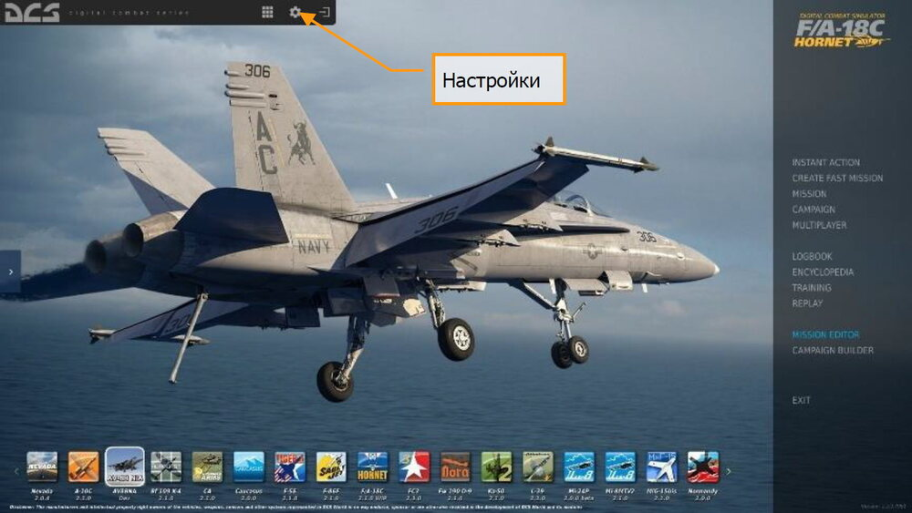
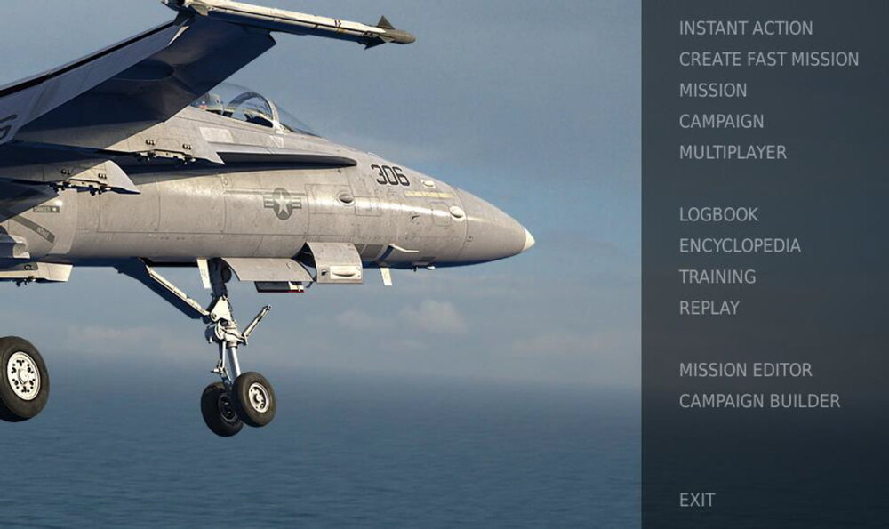
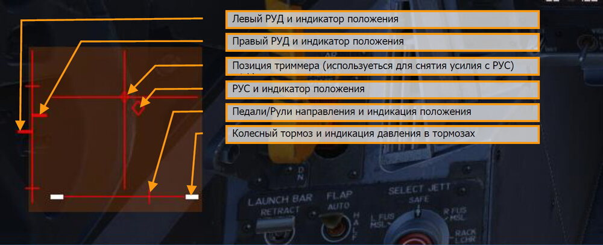
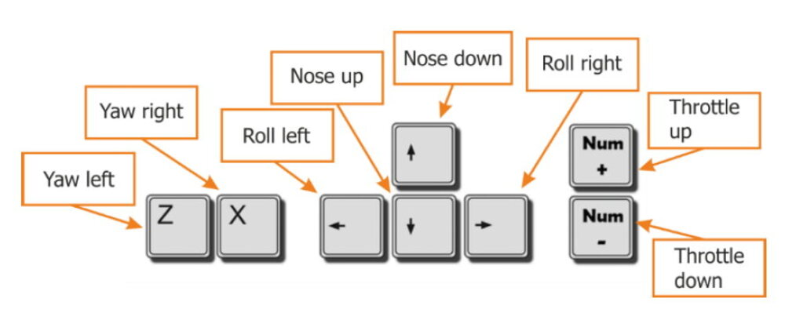

# Установка и запуск

Вы должны выполнить вход в Windows с наличием прав администратора для того, чтобы иметь
возможность установить игру.

После приобретения DCS: F/A-18C Hornet в нашем электронном магазине, запустите DCS World.
Перейдите в Менеджер Модулей, кликнув по иконке в верхней панели меню. После выбора и
подтверждения, ваш Hornet будет автоматически установлен.

DCS World – это компьютерная симуляторная среда, на базе которой работает симуляция F/A-
18C Hornet. Запуская DCS World, в свою очередь, вы запускаете DCS: F/A-18C Hornet.
Боевой СУ-25Т и тренировочный TF-51 самолёты также включены в DCS World как бесплатные
модули.

После запуска пиктограммы DCS World, расположенной на вашем рабочем столе, происходит
запуск главного меню DCS World. Здесь вы можете читать новости, изменять обои игры нажатием
на иконки F/A-18C Hornet или Su-25T Frogfoot в нижней части страницы или выбирать желаемые
опции в правой части страницы. Для быстрого старта вы можете выбрать "Быстрая миссия" и
запустить любую миссию из списка, доступного на вкладке F/A-18C Hornet.

### Проблемы запуска и их решение

Если у вас наблюдаются проблемы с настройками управления, мы предлагаем вам создать
резервную копию, а потом удалить папку Saved Games\User Name\DCS\Config, которую создаёт
DCS на вашей системе в момент первого запуска. Перезапустите игру и данный каталог будет
создан автоматически с набором стандартных настроек вместе с профилями игровых устройств.
Если проблема всё же присутствует, мы рекомендуем вам обратиться в онлайн техподдержку на
форуме по ссылке [http://forums.eagle.ru/forumdisplay.php?f=251](http://forums.eagle.ru/forumdisplay.php?f=251)

### Полезные ссылки

DCS Главная страница: 
[http://www.digitalcombatsimulator.com/](http://www.digitalcombatsimulator.com/)

DCS: F/A-18C Hornet форум: 
[https://forums.eagle.ru/forumdisplay.php?f=583](https://forums.eagle.ru/forumdisplay.php?f=583)

DCS Вики: 
[http://en.wiki.eagle.ru/wiki/Main_Page](http://en.wiki.eagle.ru/wiki/Main_Page)

## НАСТРОЙКА ИГРЫ
Перед тем как занять рабочее место пилота Хорнета, мы предлагаем вам выполнить настройки
параметров вашей игры. Для этого нажмите кнопку Настройки в верхней части Главного Меню.
Вы можете найти детальное описание всех настроек в Руководстве Пользовательского
интерфейса DCS World. В данном руководстве раннего доступа, мы рассмотрим только основы.

После входа в меню Параметры, вы увидите семь вкладок вверху страницы.

**СИСТЕМА.** Настройка параметров графики позволяет наилучшим образом сбалансировать
визуальное отображение с производительностью. В нижней части страницы у находятся пресеты,
но вы можете дополнительно настроить параметры графики в соответствии с конфигурацией ПК.
Если производительность вашего компьютера низкая, мы рекомендуем выбрать пресет Низкий,
после чего постепенно увеличивать настройки графики, чтобы найти наиболее подходящую
конфигурацию параметров игры.

**УПРАВЛЕНИЕ.** Настройка элементов управления. Давайте рассмотрим данную страницу более
детально:
Для начала, выберите летательный аппарат, для которого вы хотите настроить функции
управления, используя выпадающий список летательных аппаратов. Вдоль левой части экрана
отображаются все категории действий, связанные с выбранным разделом Команд управления. В
правой части находятся все обнаруженные устройства, включая клавиатуру, мышку, джойстики,
рычаги управления двигателями и педали.

1.   **Выбор типа ЛА.** Выберите F/A-18C СИМ из данного выпадающего списка.
2.   **Команды управления.** Выпадающий список содержит категории настроек управления, таких как осевые команды, виды, элементы управления в кабине, и т.п. Для того, чтобы назначить команду, выполните двойное нажатие ЛКМ в поле, которое отвечает за определённую функцию в левой части и относится к устройству, которое вы желаете настроить. После открытия меню назначения, нажмите кнопку, комбинацию кнопок или подвигайте желаемую ось устройства для назначения.

    *Пример 1:* для назначения оси тангажа, сперва выберите Осевые команды из выпадающего списка Команд управления. Дважды щелкните левой кнопкой мыши на поле, находящемся на пересечении столбца назначения команд вашего джойстика и строки Тангаж. Откроется панель ADD ASSIGNMENT PANEL, после чего переместите джойстик вперед и назад для назначения оси. Подтвердите выбор нажатием кнопки OK.

    *Пример 2:* для назначения клавиатурного сочетания для команды HOTAS,
    например, выпуска/уборки шасси, сперва выберите ВСЕ из выпадающего списка
    Команд управления. Найдите поле на пересечении столбца необходимого
    устройства и строки Шасси — Выпустить/убрать и выполните на нем двойной
    щелчок левой кнопкой мыши. После открытия панели ADD ASSIGNMENT PANEL,
    нажмите желаемую кнопку на клавиатуре или устройстве управления.
    Подтвердите выбор нажатием кнопки OK.

4.   **Осевые настройки.** После назначения осей (например, оси X и Y для джойстика), эта подстраница используется для настройки мёртвой зоны джойстика, кривой отклика оси и других параметров. Это может быть очень полезно, если вы обнаружите, что летательный аппарат слишком чувствителен к управлению.

**ИГРА.** Данная страница позволяет настроить уровень реалистичности или аркадности в зависимости от предпочтений игрока. Выберите желаемые параметры из множества различных
настроек сложности, таких как: ярлыки, всплывающие подсказки, неограниченное количество
топлива и оружия и т.д.

**ЗВУКИ.** Страница используется для настройки уровней громкости игры, а также содержит опции
включения/отключения различных аудиоэффектов.

**РАЗНОЕ.** Данная страница содержит разнообразные настройки игры для дальнейшей настройки
в соответствии с вашими предпочтениями.

**ВР.** Страница позволяет активировать поддержку устройств виртуальной реальности Oculus Rift
и HTC Vive и настроить работу данных устройств. При использовании устройства виртуальной
реальности, стоит помнить, что параметр Плотность Пикселей оказывает серьезное влияние на
производительность игры в целом.

## ЗАПУСК МИССИИ

После того, как вы выполнили настройки игры, перейдём к тому, для чего вы приобрели
DCS: F/A-18C – к полётам! В вашем распоряжении есть несколько опций для запуска одиночной
миссии.

1.   **БЫСТРАЯ МИССИЯ.** Набор простых миссий, позволяющих выбрать задание на свой вкус. Мы будем использовать некоторые из них в данном руководстве для закрепления пройденного материала.
2.   **СОЗДАТЬ БЫСТРУЮ МИССИЮ.** Данное меню позволяет быстро сконфигурировать собственную миссию.
3.   **МИССИЯ.** Более продвинутые одиночные миссии.
4.   **КАМПАНИЯ.** Набор связанных в кампании миссий.
5.   **МУЛЬТИПЛЕЕР.** Позволяет создать свой сервер либо присоединиться к существующему в интернете.
6.   **РЕДАКТОР МИССИЙ.** Мощный редактор для создания своих собственных миссий.

Главное меню содержит следующие возможности для полётов на Хорнете: БЫСТРАЯ МИССИЯ,
СОЗДАТЬ БЫСТРУЮ МИССИЮ, загрузить МИССИИ, играть КАМПАНИЮ (при наличии доступных),
или создать свою собственную миссию в РЕДАКТОРЕ МИССИЙ. Также существует возможность
совместных полётов в сети.

Для быстрого старта миссии, выберите пункт БЫСТРАЯ МИССИЯ в правой части главного экрана.
В данном меню вам будет доступно большое количество миссий для F/A-18C Hornet.
Для начала, мы рекомендуем вам миссию СВОБОДНЫЙ ПОЛЁТ. Позже вы можете использовать
эти миссии для тренировки запуска самолёта, взлетов, посадок, навигации и использования
сенсоров/вооружения.

## УПРАВЛЕНИЕ ПОЛЁТОМ

Основные органы управления полётом самолёта включают в себя ручку управления самолётом,
рычаги управления двигателями и педали. РУС используется для управления самолётом по крену
для выполнения разворотов, и тангажу для набора высоты и снижения. РУДы используются для
управления тягой двигателей и контроля скорости самолёта. Педали используются для
управления самолётом по рысканию (как корабль). Использование педалей в полёте ограничено
компенсацией бокового скольжения и помогает выполнять плавные повороты, а также для
управления носовой стойкой самолёта на земле при выполнении руления.

Для выполнения разворота влево или вправо: накрените самолёт в сторону желаемого
направления, и осторожно потяните РУС на себя. Чем сильнее вы потянете РУС на себя, тем
выше будет скорость разворота и, соответственно, больше потеря скорости.

При выполнении полётов в кабине самолёта, вы можете включить отображение позиций органов
управления нажатием комбинации клавиш [[RCtrl]] + [[Enter]].

Индикатор максимального отклонения триммера по тангажу. Перед взлетом, триммер по тангажу
(5) должен быть установлен приблизительно по центру.

Если вы управляете самолётом с помощью клавиатуры, используйте следующие клавиши:
стрелки курсора для управления по крену и тангажу, [[Numpad+]] и [[Numpad-]] для управления
РУДами, и [[Z]] / [[X]] для управления рулями направления/педалями. Если у вас есть джойстик, он
может быть оборудован рычагом управления двигателями и/или поворотным механизмом
"Твист", который позволяет управлять педалями/рулями направления.

