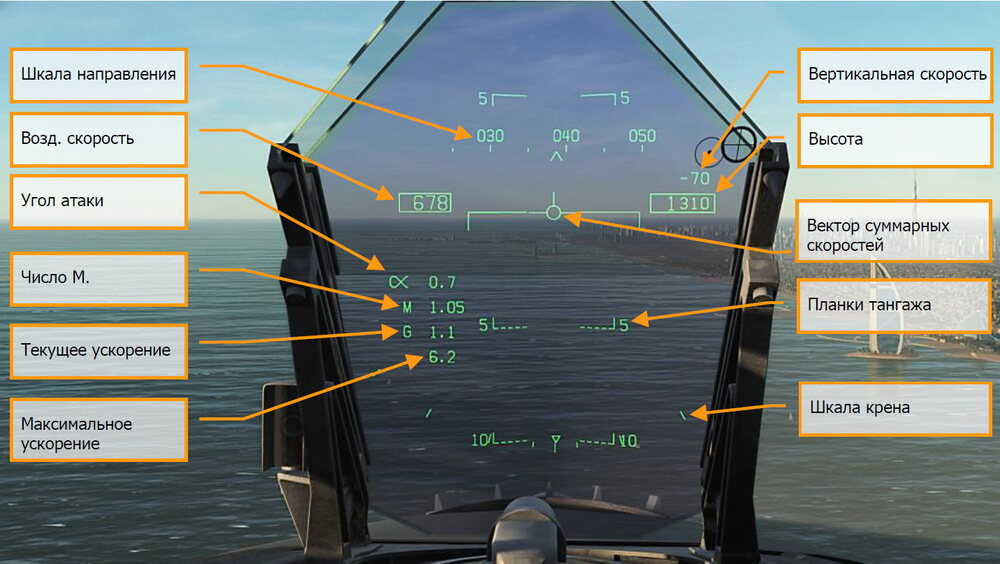

# Индикатор на лобовом стекле (ИЛС)

Индикатор на лобовом стекле или ИЛС, является одним из самых главных инструментов, который
обеспечивает вывод полетной информации и данных сенсоров/вооружения. В последующих
разделах мы рассмотрим специфику индикации ИЛС, относящуюся к различным сенсорам и
вооружению, но несмотря на данную специфику, ИЛС обладает общим набором индикации,
отображаемым практически всегда.

!!! hint "Быстрая миссия"
    Hornet Ready on the Ramp

Индикация ИЛС, представленная ниже, не зависит от ГЛАВНОГО РЕЖИМА, за исключением
шкалы крена, вертикальной скорости и шкалы направления.

1.      **Шкала направления**. Двигающаяся шкала шириной 30 градусов отображает
магнитное или истинное направление самолета (настраивается на странице HSI, меню
DATA). Символ "^" в центре шкалы показывает направление полета.

    В случае, если
    установлено отображение истинного направления, ниже символа "^" отображается
    символ "Т".

2.      **Воздушная скорость**. Приборная воздушная скорость (в узлах) согласно данным
вычислителя воздушных параметров (Air Data Computer).
3.  **Вертикальная скорость**. Положительная или отрицательная вертикальная скорость
(в футах в минуту).
4. **Высота**. Барометрическая или высота по радиовысотомеру (в футах), в зависимости
от положения тумблера ALT на панели управления индикацией ИЛС. Если тумблер
находится в положении RADAR, справа от значения высоты отображается символ "R".
В случае, если данная величина некорректна (превышен лимит отображаемой радио
высоты), справа от значения высоты будет отображаться мигающий символ "B",
обозначающий отображение барометрической высоты.
5. **Угол атаки**. Истинный угол атаки в градусах.
6. **Число М**. Индикация скорости полета, представленная в виде числа Маха.
7. **Перегрузка**. Текущая перегрузка.
8. **Максимальная положительная перегрузка**. Индикация максимальной перегрузки
свыше 4G.
9. **Вектор суммарной скорости**. Представляет точку, в которой окажется самолет, при
условии сохранения текущей траектории полета. В случае неточности данных
суммарной скорости, данный символ будет мигать. Этот символ может быть
зафиксирован к центральной вертикали ИЛС с помощью переключателя Сage/Uncage
на РУД.
10. **Индикатор горизонта/Шкала тангажа**. Угол наклона траектории полета
индицируется вектором суммарной скорости на шкале тангажа. Тангаж самолета
индицируется в виде символа W на шкале.
11. **Шкала крена**. Отображает угол крена самолета. При выполнении маневров,
индикатор угла крена (в виде треугольника) совмещается с делениями, которые имеют
значения 5, 15, 30 и 45 градусов.

Барометрическое давление. Величина барометрического давления отображается ниже
индикации высоты в течение 5 секунд после изменения значения с помощью кремальеры
установки барометрического давления на резервном высотомере. Также текущее значение
давления отображается, если высота полета менее 10 000 футов и воздушная скорость
менее 300 узлов в случае превышения обоих значений ранее в полете.

Истинный вектор суммарных скоростей. Данный индикатор появляется в случае, если
вектор суммарных скоростей арретирован (зафиксирован) к центру вертикали ИЛС и
отображает реальный вектор скоростей самолета. В случае, если вектор суммарных
скоростей арретирован, сам вектор и планки тангажа будут зафиксированы по центру ИЛС.

Смещение вектора суммарных скоростей и планок тангажа относительно центра ИЛС
является результатом скольжения или ветра. Для их центрирования нажмите кнопку
Cage/Uncage на РУД, после чего на ИЛС появится “истинный” вектор суммарных скоростей.

{!abbr.md!}
