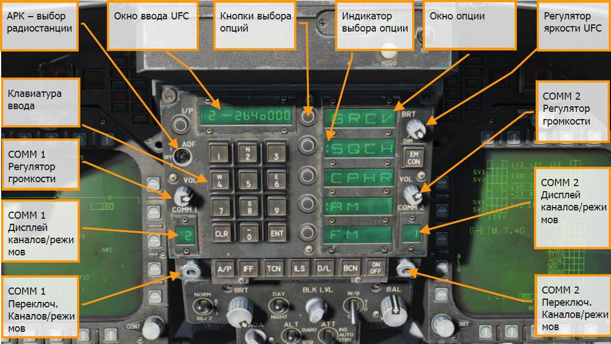

# СИСТЕМЫ СВЯЗИ

DCS F/A-18C Hornet оборудован двумя радиостанциями ARC-210 (RT-1556). Радиостанции
COMM1/COMM2, работающие в диапазонах VHF и UHF, используются для выполнения голосовых
радиопередач, а также могут выполнять роль автоматического радиокомпаса.

Для каждой радиостанции возможна настройка до 20 предустановленных каналов в диапазоне
30–400 МГц. Аварийная частота — 243,00 МГц AM. Предустановленные частоты устанавливаются
в Редакторе Миссий, но могут быть изменены вручную в полете.

Для выполнения радиопередачи с помощью COMM 1 или COMM 2, переключатель радио на РУД
должен быть установлен в соответствующую позицию (1 или 2).

!!! hint "Быстрая миссия"
    Hornet Ready on the Ramp

#### Процедура использования радиостанций

1.   Выберите желаемую предустановленную частоту с помощью поворотного
переключателя радиочастот COMM1/COMM2 на UFC. Выбранная частота будет
отображена на дисплее UFC.
2.   Нажмите переключатель COMM1/COMM2 на РУД в зависимости от выбранной
радиостанции.
3.   Используйте меню для выполнения радиопередачи.

## Управление радио через пульт UFC

Основное управление функциями радио выполняется с помощью пульта ввода и информации -
ПВИ (UFC). Данный пульт содержит следующие элементы управления:

**Регуляторы громкости радиостанций COMM 1 / COMM 2**. Отвечают за регулирование
громкости радиостанций COMM1 и COMM2.

**Переключатели выбора каналов COMM 1 и COMM 2**. Для отображения на дисплее текущей
частоты, необходимо вытянуть любой из поворотных переключателей. Для установки частоты
необходимо поворотом переключателя осуществить перебор из 20 предустановленных каналов.
В дополнение к ним существуют: режим ручного ввода частоты (М), аварийный канал радиосвязи
(G) на частоте 121,5 МГц диапазона VHF и 243,00 МГц диапазона UHF, интерком (С) и морской
канал (S).

Когда выбран режим ручного ввода (M), вы можете использовать клавиатуру ввода данных UFC
для установки частоты, не перезаписывая существующую предустановленную.

**Дисплеи каналов радиостанций COMM 1 и COMM 2**. Данные окна отображают выбранный
пресет канала (1–20), а также G (Guard), M (Manual), C (Cue) и S (Maritime).

**Переключатель АРК (ADF)**. Данный тумблер включает режим автоматического радиокомпаса
на выбранном радиомаяке. В положении ADF 1 режим автоматического радиокомпаса будет
использовать радиостанцию COMM1, соответственно ADF 2 будет использовать радиостанцию
COMM2. Положение OFF отключает АРК. Данные АРК отображаются на странице HSI (ПНП) в
виде маленького круга. Для более детальной информации обратитесь к разделу “Навигация”
данного руководства.

**Дисплей UFC**. При повороте или вытягивании ручки COMM1/2, на дисплее данных UFC
отображается выбранный пресет радио или частоты G/M/C/S. Клавиатура используется для
ручного ввода частоты радиостанции.

**Дисплеи опций**. Если выбран какой-либо предустановленный канал или выбраны пресеты
G/M/C/S для радио, опциональные дисплеи отображают следующие доступные опции:

- **GRCV**. Если выбрана данная опция и отображается символ “:”, резервный канал радио
включен. Резервный канал отключен, если отсутствует символ “:”.
- **SQCH**. Если присутствует символ “:”, включен режим подавления радиопомех.
- **CPHR**. Не реализован в версии раннего доступа.
- **AM**. Используется амплитудная AM модуляция.
- **FM**. Используется частотная FM модуляция.

**Кнопки выбора опций**. Данные кнопки используются для выбора опций, которые отображены
на опциональных дисплеях.

**Регулятор яркости индикаторов UFC**. Данный регулятор осуществляет регулировку яркости
дисплеев UFC.

{!abbr.md!}
