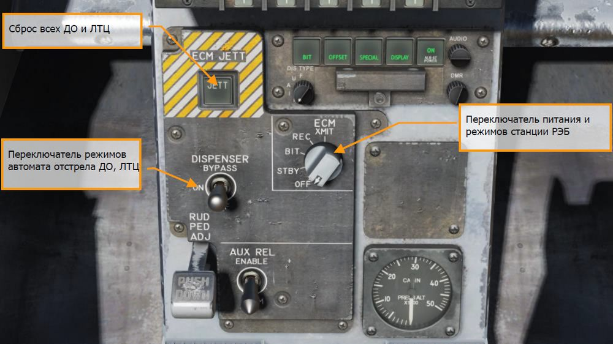
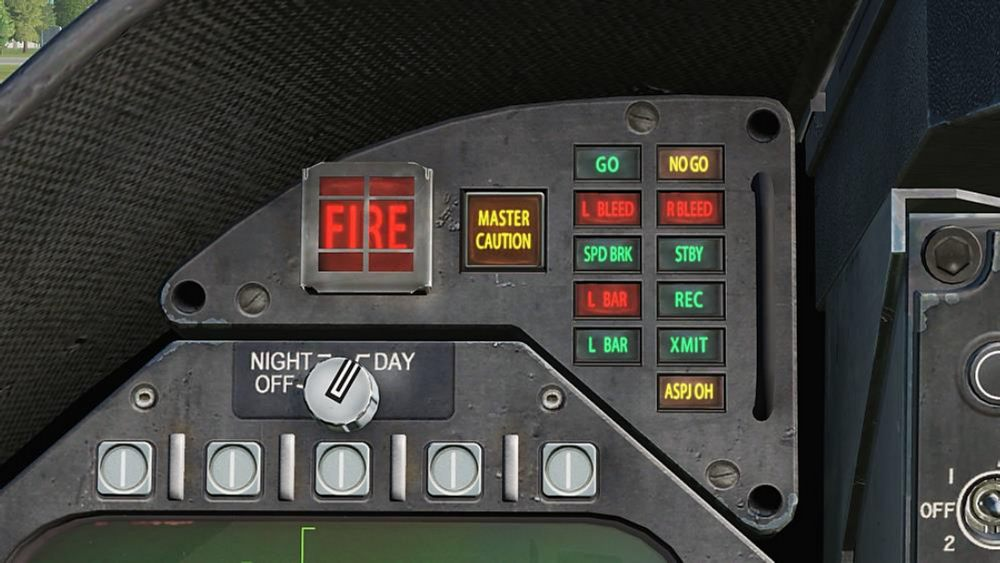
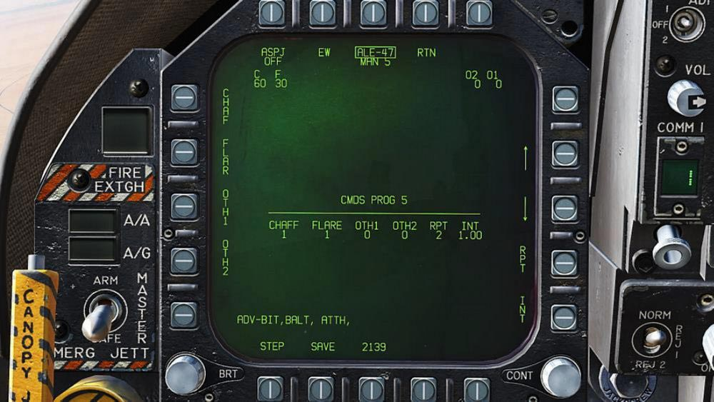

# Системы противодействия

Поскольку DCS World это симулятор боевых действий, вы будете очень часто являться целью
противника. Хорнет оснащен рядом систем, призванных оказывать помощь летчику защитить
самолёт от средств поражения противника. Средства противодействия включают в себя ЛТЦ
(Ложные тепловые цели), ДО (Дипольные отражатели) и средства РЭБ (радио электронной
борьбы).

!!! hint
    Быстрая миссия : Hornet Defensive Systems

В нижней части центральной консоли размещена панель управления системами
противодействия. Данные системы обеспечивают защиту против вражеских радаров, ракет
класса воздух-воздух/воздух-поверхность. Защита обеспечивается путем выброса ЛТЦ, ДО или
ложных радиолокационных элементов (GEN-X).

Система ALQ-165 Airborne Self Protection Jammer (ASPJ) является станцией постановки
радиоэлектронных помех, которая обнаруживает и сбивает работу радаров сопровождения цели
противника (впрочем, при некоторых условиях, и своих тоже). Данная система работает в 4х
режимах: standby (Ожидание), repeat (Повторение), transmit (Передача), и built in test (Тест).
Система РЭБ обнаруживает, обрабатывает и выполняет передачу симулированного сигнала
после получения сигналов от радара противника. Сигнал определяется вражеским радаром как
сигнал, отраженный от цели, после чего радар противника сопровождает ложную цель, снимая
захват с истинной цели. При облучении вражескими РЛС источники радиоизлучения
отображаются регистрируются приемником RWR и отображаются на экране СПО, при этом
загораются два светосигнальных табло на панели Warning/Caution/Advisory.

## Интегрированная панель управления системами противодействия (ICMCP)

Данная панель заменила старую панель управления системой ALR-39, большинство функций
управления системами противодействия перенесены на МФД (страница EW).

Набор переключателей данной панели состоит из:

- **Кнопка выброса всех ДО и ЛТЦ (ECM JETT)**. После нажатия на данную кнопку
происходит мгновенный сброс всех ЛТЦ/ДО и включается подсветка кнопки. Данная
кнопка работает только в случае, если стойки шасси не обжаты (самолёт находится в
воздухе, Weight off Wheels, стойки шасси не обжаты).
- **Переключатель DISPENSER**. Данный переключатель отвечает за управление режимами
автомата отстрела контрмер и имеет следующие позиции:
    - OFF: Отключает питание автомата отстрела, после чего на странице EW
        надпись ALE-47 зачеркивается. Несмотря на это, кнопка ECM JETT будет
        функционировать.
    - ON: После включения автомата отстрела в режим ON происходит
        пятисекундный горячий запуск, после которого проводиться самотест. После
        5 секунд система отстрела ловушек переходит в режим готовности. На
    странице EW появляются следующие, доступные для выбора режимы
    отстрела ловушек: STBY, MAN, SEMI и AUTO.
    
        Если автомат отстрела сперва включить в режим ON, на МФД
        странице EW ниже надписи EW появится надпись SF TEST на время
        до 5 секунд, после чего на 10 секунд появится надпись PBIT GO.
        После окончания тестирования, появится надпись OFF или ранее
        выбранный режим автомата отстрела контрмер.
        
- **BYPASS**. Данная позиция выполняет обход программатора автомата отстрела
    ловушек, после чего при нажатии соответствующей позиции переключателя
    противодействия будет происходить одиночный отстрел ЛТЦ или ДО. Если
    автомат отстрела контрмер находится в режиме обхода, надпись ALE-47 на
    странице EW будет зачеркнута и индикатор статуса BIT-теста на странице EW
    будет отображаться как NOT RDY.

## Экран РЭБ (EW)

Данная страница содержит следующую индикацию:

- **Питание и индикация режима станции РЭБ**. Под надписью ASPJ отображается
        статус системы ALQ-165 и зависит от положения тумблера питания ALQ-165 ASPJ и
        поворотного переключателя режимов. Доступны следующие режимы системы ASPJ:
        OFF, BIT, STBY, REC, XMIT. (Будет реализовано позже, в Open Beta)
- **Индикатор остатка ДО (Chaff)**. Данное поле индицирует остаток зарядов
        Дипольных Отражателей. Индикатор обрамляется при выполнении отстрела ДО.
- **Индикатор остатка ЛТЦ (Flare)**. Данное поле индицирует остаток зарядов Ложных
        Тепловых Целей. Индикатор обрамляется при выполнении отстрела ЛТЦ.
- **Индикатор остатка элементов GEN-X (O1 и O2)**. Ложные цели GEN-X размещаются
        в специальных отсеках O1/O2. В данном поле отображается остаток ЛРЦ в каждом из
        отсеков. При отстреле ложной цели из определённого отсека - индикатор отсека
        обрамляется. (Будет реализовано позже, в Open Beta)
- **Питание ALE-47 и индикатор программы**. Под надписью ALE-47 отображается
        выбранная программа автомата отстрела, если тумблер автомата отстрела на панели
        ICMCP установлен в положение ON. Существует 6 программ отстрела ловушек в ручном
        режиме, которые могут быть отредактированы и сохранены. Также, доступны режимы
        Полу (S/A) и Автоматического (AUTO) отстрела ловушек, которые выполняют
    автоматический выбор программы противодействия в зависимости от типа угрозы,
    предоставляя пилоту возможность запуска программы противодействия (режим S/A)
    или выполнить автоматический пуск программы противодействия в режиме AUTO.
    Нажатие кнопки STEP выполняет циклическое переключение ручных программ
    автомата отстрела ловушек, при этом выбранная программа будет отображаться под
    надписью ALE-47 (например, MAN 5). Если выбран режим автомата отстрела S/A, под
    надписью ALE-47 будет отображаться надпись S/A. Если выбран Автоматический
    режим работы автомата отстрела, под надписью ALE-47 будет отображаться надпись
    AUTO.
    - Если автомат отстрела ALE-47 отключён на панели ICMCP, под надписью ALE-
             47 будет отображаться надпись OFF.
    - При первом включении автомата отстрела в режим ON под надписью EW на
             5 секунд появляется надпись SF TEST на странице BIT, после чего появится
             надпись PBIT GO, что значит BIT тест системы EW закончен и пропадает
             надпись OFF на странице EW.
    - После нажатия клавиши ALE-47, надпись ALE-47 обрамляется и появляются
             индикаторы C/F/O1/O2 вдоль верхней части страницы EW со следующими
             значениями: C 14, F 18, O1 14 и O2 14.
    - Если автомат отстрела находится в режиме обхода (BYPASS), надпись ALE-47
             будет зачеркнута.
- **Питание EW**. Надпись отображает статус системы ALR-67(V) и зависит от состояния
    кнопки питания на панели управления СПО. Если СПО отключена, под надписью EW
    отображается надпись OFF, отсутствует индикация статуса, смещения, лимита и статус
    ИЛС на странице EW.
- **Индикация статусов EW**. В зависимости от активированных опций MODE, OFFSET и
    LIMIT на панели управления ALR-67(v), в правой части страницы EW будут
    отображаться данные выбранные опции.
- **Опция MODE**. Нажатие на данную кнопку осуществляет циклическое переключение
    между несколькими опциями EW:
    - **STBY**. Автомат отстрела ловушек запитан, но выброс ловушек невозможен,
            кроме аварийного сброса всех контрмер с помощью кнопки ECM JETT.
    - **MAN**. С помощью подменю PROG можно выбрать одну из 6 программ
            противодействия для редактирования профиля отстрела ловушек. Опции
            STEP и PROG доступны лишь в этом режиме.
    - **S/A**. Система противодействия автоматически выбирает наилучшую
            программу, анализируя самую высокую по приоритету угрозу. Лётчик должен
            вручную “подтвердить” запуск программы. (Coming later in Open Beta)
    - **AUTO**. Система противодействия автоматически выбирает наилучшую
            программу, анализируя самую высокую по приоритету угрозу и выполнит
            запуск программы противодействия. (Coming later in Open Beta)
- **Опция ARM**. Данная опция появляется после нажатия кнопки ALE-47 (надпись должна
    быть обрамлена). После нажатия кнопки ARM появляется кнопка SAVE, которая
    размещается следующей после кнопки STEP. Дополнительно, появляются опции
        редактирования программы противодействия. Нажатие кнопки ARM открывает
        подменю для создания ручной программы противодействия CMDS PROG. Нажатие на
        кнопку STEP выполняет последовательное переключение между шестью программами
        противодействия, ручными программами. Выбранная программа отображается в
        центре дисплея в формате CMDS PROG X. Вдоль левой вертикальной стороны МФД
        расположены опции выбора ДО(CHAF), ЛТЦ(FLAR), ловушки GEN-X (OTH1 и OTH2),
        количество залпов (RPT) и интервал между залпами (INT). Нажатие на определенную
        опцию обрамляет соответствующий блок индикации, предоставляя возможность
        настройки значения опции. В правой части МФД с помощью кнопок-стрелок вверх/вниз
        выполняются изменения значения выбранной опции программы противодействия.
        Значение каждого элемента программы отображается в центре страницы МФД. После
        окончания настройки программы противодействия нажатие кнопки SAVE (Сохранить)
        сохранит новые параметры выбранной программы противодействия, нажатие на
        кнопку RTN (Возврат) выполнит выход в главное меню страницы EW.

    

- **Опция STEP**. С помощью данной кнопки осуществляется циклическое переключение
        между пятью программами противодействия. Номер выбранной программы
        отображается под надписью ALE-47.

Основным средством запуска программы противодействия является специальный переключатель
на РУД (HOTAS Dispense Switch).

  -    Позиция назад: выброс одного заряда ЛТЦ из левого и правого отсека, которые
             содержат заряды в группе по 10 шт.
  -    Позиция вперед: выброс одного заряда ДО.

{!abbr.md!}
