# Стандартные процедуры

## Предполётные процедуры

В кабине пилота нужно проделать следующие операции:

- Выбрать наиболее удобное положение в кабине, используя комбинации клавиш [[RightCtrl]] + [[RightShift]] + [[Numpad8]] и [[RightCtrl]] + [[RightShift]] + [[Numpad2]].
- Проверить отклик руля направления на движение педалей и соответствие его центрального положения центральному положению педалей.
- Открыть кислородный кран, расположенный справа внизу на передней панели.

    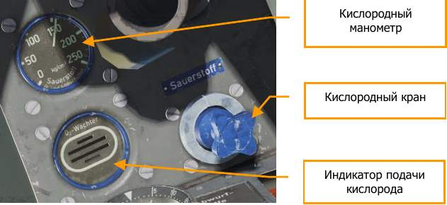

- На пульте управления шасси и щитками левой панели должна быть нажата кнопка ”шасси выпущено” (зеленая кнопка ”Aus”), иначе при включении электросистемы шасси может подняться.

    

### Запуск двигателя

!!! warning
    Электрический стартер использовать с подключенным внешним электропитанием!

    Бортовой аккумулятор применять только в чрезвычайных ситуациях!

- Магнето установить на “0”.
- Подать сигнал наземному персоналу на подключение аэродромного электропитания.
- Включить АЗС Аэродромного электропитания, Зажигания, Стартера, Управления шагом винта, Генератора. АЗС аккумулятора не включать!
- Управление шагом винта перевести в ручной режим. Установить шаг винта на 12:35, затем — в положение 12:00.

    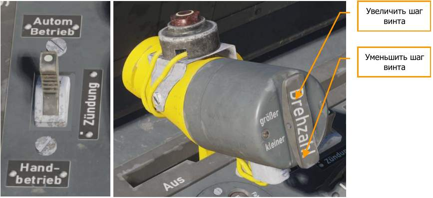

- Рычаг селектора топливных баков в верхнее положение "Auf" (открыто). Вверх [[T]], вниз [[RShift]] + [[T]].

    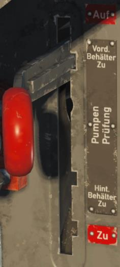

- Проверить работу подкачивающих насосов топливных баков; включать на панели переключателей топливной системы по одному АЗС каждого насоса и контролировать давление топлива (0,3-0,4 atü) по прибору. Выключить насосы.
- Включить бензонасосы:
    - E14   Бензонасос переднего бака
    - E13   Бензонасос заднего бака
    - E16   Бензонасос подвесного бака, если он используется
    - E96   Насос системы дополнительного бака, если необходимо

- Поставить РУД в положение ¼ газа. “Anlassen-Aus”. [[RAlt]] + [[Home]]

    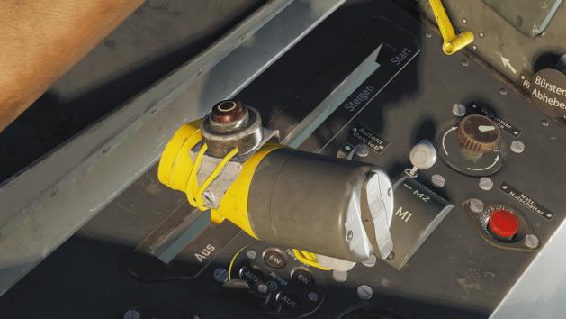

- Закрыть фонарь кабины. Нажать и удерживать [[LCtrl]] + [[C]].
- Подкачать топливо заливающим насосом, сделав несколько коротких энергичных движений рукояткой на левой панели, от 1 до 15 раз, в зависимости от температуры окружающего воздуха. [[LAlt]] + [[P]]

    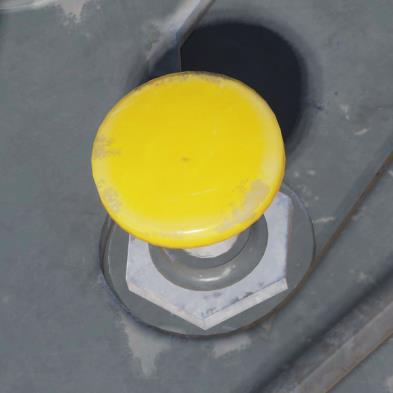
    
- Нажать рукоятку стартера и удерживать 10 секунд (в холодную погоду до 20 секунд) для раскрутки маховика. Нажмите и удерживайте [[Home]].
- Переключатель зажигания (магнето) перевести в положение M1+М2. Вперед [[End]], назад [[RShift]] + [[End]].

    

- После раскрутки маховика вытянуть рукоятку стартера вверх для запуска двигателя. Нажмите и удерживайте [[RCtrl]] + [[Home]].

    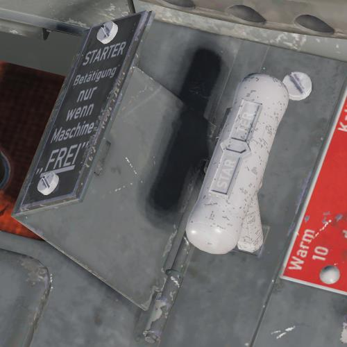

- Если двигатель работает с перебоями, повторно подкачать топливо заливающим насосом, при необходимости добавить обороты.
- После запуска держите работу двигателя в режиме 500-600 об/мин до того, как стрелка указателя давления масла начнет движение, после этого незамедлительно увеличьте обороты до 1200 об/мин.
Если в течение 15 секунд стрелка указателя давления масла не придет в движение, заглушите двигатель и вызовите персонал для ремонта.
Если возникла неисправность бортовой сети электропитания, двигатель не запустится.
- Подать сигнал наземному персоналу на отключение аэродромного электропитания.

!!! info
    В экстренном случае или при невозможности использования внешнего электропитания возможен запуск двигателя от бортового аккумулятора.

    Для выполнения запуска вместо подключения АЗС внешнего питания и вызова наземного персонала включите АЗС аккумулятора и выполняйте запуск.

### Прогрев двигателя на старте

- Включить автомат управления шагом винта. Практика показывает, что прогрев с включенной автоматикой способствует правильному распределению масла в системе, и предотвращает неполадки в ходе выполнения полета.
- Увеличить обороты до 1200 об/мин незамедлительно после начала индикации давления масла и прогревать двигатель до как минимум +25°С (по указателю на приборной панели). Работы двигателя в режиме 600-1100 об/мин следует всеми средствами избегать, чтобы исключить вибрационные повреждения крыльчатки вентилятора.
- Увеличивать обороты выше 1200 допускается исключительно после прогрева масла до 30°С. Дальнейший прогрев проводить на 1400-1500 об/мин. 
Контролировать давление масла! При температуре масла в диапазоне 40-45°С, давление до 15 atü. При температуре выше 40-45°С давление снижается терморегулятором автоматически до 8-9 atü.

- Проверка топливных насосов

    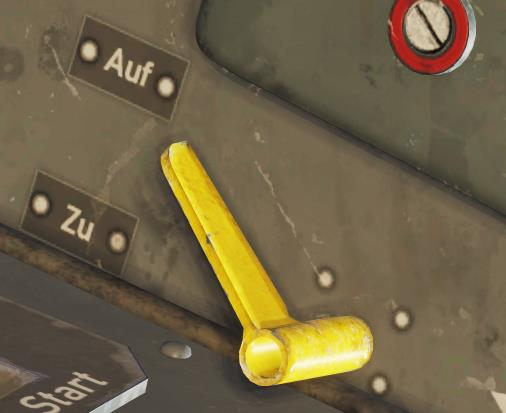

    Установить и держать кран кольцевания топливной магистрали в положение "Zu" — подпружинен, при отпускании возвращается в положение "Auf". Переключать кран селектора топливных баков с переднего бака на задний и наблюдать за указателем давления топлива. Контроль: при работе двигателя на 1200 об/мин оставить краны в выбранном положении не менее, чем на 1 минуту. Давление топлива не должно заметно упасть.

    После проверки установить все краны в положение "Auf".

    !!! warning
        Избегайте длительной работы двигателя в диапазоне 600-1000 об/мин!

- Включить АЗС основной панели
    - Внешняя подвеска
    - Прицел и фотокинооборудование
    - Приборы
    - Обогрев костюма
    - Обогрев трубки Пито
    - FuG 25a

### Опробование двигателя

Опробование двигателя должно выполняться только после прогрева масла до 30°С.

Щитки установить во взлетное положение, РУС взять на себя.

1. Установить шаг винта на 12:00, отключить автоматическое управление шагом винта.
2. Выполнять прогон без задержек. Контролируйте параметры работы по таблице:

    Шаг винта | Обороты, об/мин | Наддув, ata | Давление топлива, atü | Давление масла, atü | Температура масла, °С
    ----------|-----------------|-------------|-----------------------|---------------------|----------------------
    12:00 часов (Базовая настройка 12:35 при 25°) | 2430 ± 40 | 1,42 | От 1,25 До 1,75 | 15 8-9 | до 45 выше 45

    Проверка магнето и свечей зажигания на 2400 об/мин — последовательно переключать магнето в положения М1 и М2. 
    Обороты двигателя не должны упасть более, чем на 50 об/мин.

3. Проверка автомата управления шагом винта. Контролировать соответствие параметров “Наддув — Обороты” по таблице:

    Наддув, ata | Связанные обороты, об/мин
    ---------------|-----------------------------
    0,85           | 1600
    0,9            | 1700
    1,0            | 1900
    1,05           | 2000
    1,10           | 2100
    1,14           | 2250
    1,28           | 2350
    1,32           | 2400
    1,42           | 2700

    При включении автомата шага винта показатели приборов не должны отличаться от табличных значений более, чем на ±80 оборотов. Причина расхождений: инертность центрального поста управления и неточность индикации тахометра.

4. Избегайте длительной работы двигателя на малых/холостых оборотах по причине недостаточной смазки клапанов и, если требуется более длительное время ожидания, установите обороты 1200 об/мин.

### Руление

1.   Руление и взлет допускаются только с полностью открытыми створками радиатора.
     Рукоятка управления створками расположена под верхней приборной панелью. Нажмите
     и удерживайте [[LeftAlt]] + [[A]] для полного открытия створок. Избегайте активной работы
     створками, особенно возле крайних положений.
2.   Старайтесь удерживать обороты не ниже 1200 об/мин. Длительное руление может вызвать
     повреждения пневматиков от сильного нагрева тормозов.
3.   Перед началом движения разблокируйте хвостовое колесо, отдав РУС вперед примерно
     на 3 сантиметра, иначе не сможете поворачивать.
4.   После разблокирования хвостового колеса проверьте раздельные тормоза основных колес,
     избегайте чрезмерно интенсивного воздействия.
5.   Если хвостовое колесо не разблокируется, попробуйте освободить его переменным
     торможением и одновременной отдачей РУС вперед.
6.   При построении на полосе перед взлетом дайте самолету проехать немного вперед, чтобы
     выровнять хвостовое колесо.
7.   При рулении старайтесь сократить использование тормозов; короткие нажатия на тормоз
     предпочтительнее длительного торможения.

### Проверка перед взлетом

Перед взлетом необходимо выполнить следующие проверки:

1. Органы управления:

    Проверьте ход ручки управления и педалей, убедитесь, что они двигаются без
          помех. При этих манипуляциях осмотрите рулевые поверхности на предмет
          правильного отклика.

2. Топливная система:
    1. Рычаг селектора топливных баков в верхнем положении "Auf" (открыто).
    1. Переключатели бензонасосов включены.
    1. Уровень топлива в обоих баках. Выбор бака — переключателем топливомера. Правое положение [[RAlt]] + [[T]], левое положение [[RCtrl]] + [[T]]

    

3.   Щитки:

     3.  Щитки во взлетном положении — нажата кнопка "Start".

     

4.   Стабилизатор в положение 0° (переключатель и индикатор на левой панели).

    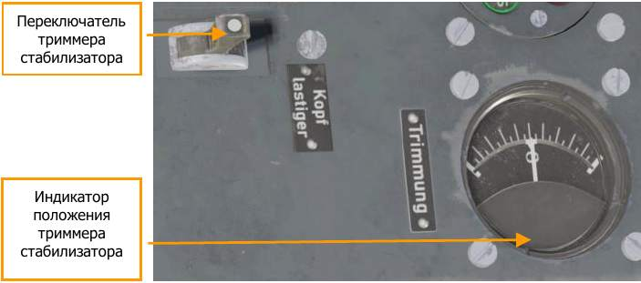

5.   Приборы и переключатели:
    5. Обнулите альтиметр.

        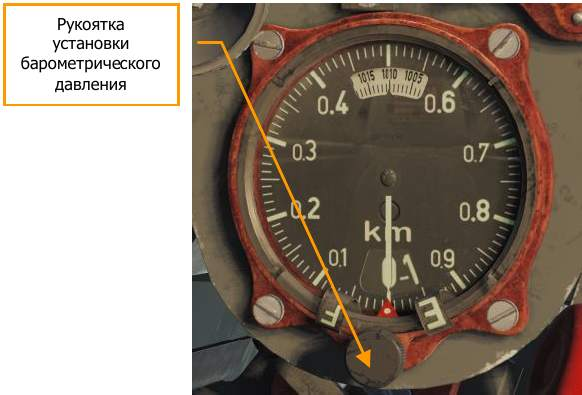

    5. Установите на компасе нужный курс.

        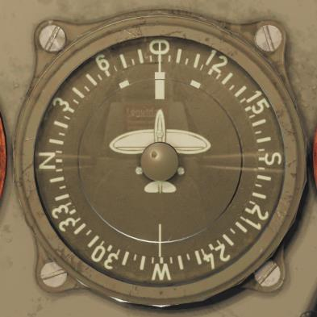

    5. Разарретируйте авиагоризонт.

        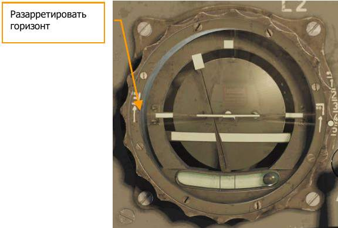

    5. Показания всех приборов должны быть в норме.
    5. Все переключатели и органы управления в правильном положении.

## Взлет

Для выполнения нормального взлета придерживайтесь следующих инструкций:

1. В условиях высокой влажности и при температурах ниже 0°С включите обогрев трубки Пито и лобового стекла.
2. Включите оба бензонасоса и переключите топливомер на задний бак.
3. В случае, если полет проводится с подвесным топливным баком, включите бензонасосы только заднего и подвесного баков.
4. Установите щитки во взлетное положение на пульте на левой панели.
5. Проверьте постановку щитков во взлетное положение.
6. Отдача ручки управления от себя разблокирует хвостовое колесо, затрудняя управление. На разбеге рекомендуется удерживать хвост на земле взятием РУС на себя до достижения скорости, достаточной для эффективного применения руля направления, и затем, плавно возвратив РУС в центральное положение, позволить хвосту подняться. Во время разбега, особенно в его начале, требуется постоянная работа педалями для поддержания направления.
7. Переместите РУД во взлетное положение. Держите РУС в центре и не двигайте вперед.
8. Взлет выполняется с двух точек.
9. Отрыв на приборной скорости 150-160 км/ч.
10. Длина разбега в безветренную погоду приблизительно 350-400 метров, в зависимости от
    взлетного веса.
11. На разбеге выдерживайте направление взлета.
    Самолет не имеет тенденции к неконтролируемому уводу в сторону.

!!! hint
    Работайте с РУД плавно! Не допускайте резкого увеличения мощности во время взлета!

### Уборка шасси и щитков

Уборка шасси производится на скоростях по прибору до 250 км/ч. После отрыва слегка нажмите тормоза, чтобы остановить вращение колес, после чего можете убрать шасси.

Для уборки шасси нажмите красную кнопку "Ein" на пульте левой панели (кнопка под крышкой), [[G]].

Шасси имеет электрический световой индикатор на левой панели и механические индикаторы на крыльях (красно-белые штыри). При уборке шасси штыри опускаются в крыло.

Когда главные стойки и хвостовое колесо убраны, на световом индикаторе включатся красные лампы. Проверьте также положение штырей на крыльях.

Щитки можно убирать только после уборки шасси — красная кнопка "Ein" для щитков, [[LShift]] + [[F]].

Проверьте также положение щитков по механическому индикатору на крыле — круглому окну с
градуированной шкалой.

!!! info
    Самолет имеет тенденцию немного проседать при уборке щитков

## Набор высоты

После взлета выполните следующие действия:

- По достижении безопасной высоты отведите РУД назад, снизив обороты до 2400 об/мин.  Оттриммируйте самолет для набора высоты.
- Оптимальная скорость в наборе высоты — 280-290 км/ч по прибору.
- Проверьте температуру и давление масла.
- Проверьте работу всех приборов.

В случае необходимости при наборе высоты допускается использовать взлетный режим 2700
об/мин, и 1.42 ata, не превышая температуру масла 85°С, и не дольше 3 минут.

!!! hint
    Положение РУД может быть зафиксировано с помощью стопора слева внизу.

!!! info
    На высоте 3300 ±200 метров происходит автоматическое переключение скорости нагнетателя с низкой на высокую и обратно. Старайтесь не летать и часто не менять высоту в районе этого порога.

### Наддув и обороты двигателя в зависимости от положения РУД

Ручка,  угол поворота | Наддув, ata | Обороты, об/мин
-------|--------|-----
22°    |  0.8   | 1500
26°    |  0.85  | 1600
31°    |  0.9   | 1700
36°    |  0.95  | 1800
42°    |  1     | 1900
48°    |  1.05  | 2000
54°    |  1.1A  | 2100
60°    |  1.1R  | 2200
64°    |  1.15  | 2260
66°    |  1.2   | 2300
68°    |  1.25  | 2330
71°    |  1.3   | 2375
76°    |  1.35  | 2460
79°    |  1.37  | 2530
84-90° |  1.42  | 2700

Параметры работы двигателя на первой скорости нагнетателя

Режим | Время,  мин | Высота,  м (фут) | Мощность,  лс | Обороты,  об/мин | Наддув,  ata (psi)
----|-----|-----|-----|----|-----
 Взлетная или экстренная |   3 |  600 (1790) | 1705 | 2700 | 1,4 (20.2)
 Боевой и набор высоты | 30 | 700 (2300) | 1500  | 2400 | 1,3 (18.7)
 Макс. продолжительность | Постоянно | 1200 (3940) | 1350 | 2300     | 1,2 (17)
 Макс. экономичность | Постоянно | 1800 (5900) | 1045 | 2100 | 1,1   (15.6)

Параметры работы двигателя на второй скорости нагнетателя

Режим | Время,  мин | Высота,  м (фут) | Мощность,  лс | Обороты,  об/мин | Наддув,  ata (psi)
----|-----|-----|-----|----|-----
 Взлетная или экстренная |   3 |  5700 (18700) | 1420 | 2700 | 1,4 (20.2)
 Боевой и набор высоты | 30 | 5300 (17400) | 1300  | 2400 | 1,3 (18.7)
 Макс. продолжительность | Постоянно | 5500 (18000) | 1165 | 2300     | 1,2 (17)
 Макс. экономичность | Постоянно | 5400 (17700) | 970 | 2100 | 1,1   (15.6)

Температура масла:

 - Предпочтительная в течение полета — 60°С
 - Максимально допустимая в течение длительного времени — 70°С
 - Краткосрочно — 85°С, до 15 минут

!!! hint
    Если превышена максимально допустимая температура масла, необходимо прибрать газ.

### Использование радиатора

При запуске, опробовании и рулении положение “Auf”.

При выполнении полетов в Европе радиатор должен использоваться только в ходе взлета
и длительного набора высоты.

Температура | Установка створок радиатора
------------|----------
Ниже -5°С   | “Zu”
До +15°С    | 20°
Выше +15°С  | 30°

Для всех горизонтальных полетов, при снижении и на посадке положение “Zu”.
При выполнении полетов в тропиках в ходе полета на малых высотах положение 20°,
в горизонтальном полете на других высотах, в снижении и на посадке положение “Zu”.

При длительном наборе высоты руководствоваться следующей таблицей:

Температура | Установка створок радиатора
------------|----------
Выше 16°С   | 40° на высоте от 5 км
Выше 16°С   | 40° на высоте от 0 км

!!! warning
    Нарушение этих инструкций может привести к неисправности двигателя

## Крейсерский режим и управление топливной системой

При полете с дополнительными баками (ПТБ и/или наличие бензина в фюзеляжном
вспомогательном баке), необходимо следовать нижеприведенной процедуре:

- Установите топливный селектор в положение "Auf" (открыто).
- Установите переключатель датчиков топливомера в положение “Hinten” (задний бак).
- Включите подкачивающий насос заднего бака, нажав на белую кнопку АЗС E13 (“Hinten”).
- При наличии ПТБ, необходимо задействовать подкачивающий насос ПТБ, включив АЗС E16 (“Abwurf-behälter”). Топливо из ПТБ выдавливается воздухом, отбираемым от нагнетателя двигателя, что вкупе с работой подкачивающего насоса создает высокое давление топлива в магистрали ПТБ. Если давление воздуха от нагнетателя меньше атмосферного, работы подкачивающего насоса достаточно для нормальной перекачки  топлива в задний бак.
- Топливо ПТБ расходуется в первую очередь, так как данный бак может быть сброшен.
- После выработки топлива из ПТБ (стрелка топливомера показывает менее 240 л.), необходимо выключить подкачивающий насос ПТБ, нажав на красную кнопку АЗС E16 (“Abwurf-behälter”), затем сбросить бак, потянув соответствующую рукоятку.
- При отсутствии ПТБ АЗС E16 (“Abwurf-behälter”) должен находиться в положении “Выкл”
- При наличии бензина во вспомогательном фюзеляжного баке включить подкачивающий насос бака, однако, так как топливо из вспомогательного фюзеляжного бака также выдавливается воздухом от нагнетателя, это действие не является обязательным.

При включении сигнальной лампы аварийного остатка в заднем баке (лампа загорается при
остатке 10 литров), выполните следующие действия:

- Включите подкачивающий насос переднего бака, нажав белую кнопку АЗС E14 (“Vorn”).
- Установите топливный селектор в положение “Hinterer Behälter zu” (задний бак перекрыт), чтобы предотвратить засасывание воздуха из бака насосом двигателя.
- Выключите подкачивающий насос заднего бака, нажав на красную кнопку АЗС E13 (“Hinten”).
- Переведите переключатель датчиков топливомера в положение “Vorn” (передний бак).

Сигнальная лампа аварийного остатка топлива переднего баке загорается при остатке
примерно 90 л., что соответствует приблизительно 25 минутам полета.

Отрегулируйте положение РУД так, чтобы мощность двигателя не превышала допустимую
постоянную 2300 об/мин. На высотах свыше 7500 м допустима постоянная мощность 2300
об/мин.

Для достижения большей дальности полета и сбережения ресурса двигателя выбирайте
экономические режимы ниже 2100 об/мин.

В случае превышения максимальной температуры мощность двигателя должна быть снижена.

**Определение остатка топлива.** Электрический топливомер с переключателем на передний/
задний бак расположен на нижней приборной панели. Индикация остатка топлива в подвесном
баке отсутствует. Топливо из подвесного бака поступает в задний бак. Если топливомер
показывает в заднем баке уровень 240 литров и он продолжает снижаться — значит подвесной
бак уже пуст.

**Предупреждение о переключении заднего бака** выдается, когда в нем остается около
10 литров топлива — загорается белая сигнальная лампа.

**Предупреждение об аварийном остатке топлива** в переднем баке выдается, когда в нем
остается 90-100 литров — загорается красная сигнальная лампа. В баке остается топлива
примерно на 25 минут полета в экономичном режиме.

### Переключение топливных баков

Без подвесного и дополнительного баков, перед запуском двигателя:

- Рычаг селектора топливных баков в положение "Auf"(открыто).
- Включите бензонасосы обоих баков.
- Переключите топливомер на задний бак.

В полете:

- Рычаг селектора топливных баков в положение "Auf"(открыто).
- Подача топлива управляется включением и отключением насосов топливных баков.
- Контролируйте остаток топлива по переключаемому топливомеру.
- Первым опустеет задний бак с отключенным бензонасосом. Если красная лампа загорается раньше белой, отключите передний бак на топливном селекторе. Переключите топливомер на задний бак.
- Когда загорится белая лампа, включите бензонасосы обоих баков. Рычаг топливного селектора остается в положении "Auf" (открыто).
- Переключите топливомер на передний бак.
- Если загорелась красная лампа, то бензина осталось на 25 минут полета в экономичном режиме.

С подвесным подфюзеляжным баком:

- Рычаг селектора топливных баков в положение "Auf" (открыто).
- Включите бензонасосы подвесного и заднего баков. Отключите бензонасос переднего бака.
- На высотах свыше 8000 м может потребоваться включение бензонасоса переднего бака.
- Переключите топливомер на задний бак.
- Когда топливомер начинает показывать в заднем баке меньше 240 литров, значит подвесной бак пуст.
- Отключите бензонасос подвесного бака.
- Чтобы сбросить подвесной бак вытяните рукоятку сброса подфюзеляжных подвесок.

С дополнительным баком в фюзеляже:

- Рычаг селектора топливных баков в положение "Auf" (открыто).
- Включите бензонасос заднего бака. Отключите бензонасос переднего бака.
- Включите бензонасос дополнительного бака.
- Переключите топливомер на задний бак.
- Когда топливомерначинает показывать в заднем баке меньше 240 литров, значит дополнительный бак пуст.
- Отключите насос дополнительного бака.

С подвесным и дополнительным баками:

- Рычаг селектора топливных баков в положение "Auf" (открыто).
- Включите бензонасосы подвесного, дополнительного и заднего топливных баков.
     Отключите бензонасос переднего бака.
- Переключите топливомер на задний бак.
- Когда топливомер начинает показывать в заднем баке меньше 240 литров, значит подвесной и дополнительный баки пусты.
- Отключите бензонасосы подвесного и дополнительного баков.

!!! warning
    В боевой обстановке подвесной бак должен быть сброшен, непротектированный дополнительный бак в фюзеляже опорожнен

### Полет на большой высоте

При полете на большой высоте регулярно проверяйте подачу кислорода. Кислородный
манометр расположен справа внизу на передней панели рядом с индикатором подачи.

Надевайте кислородную маску на высоте 4000 м.

### Полет ночью

Если приборы и сигнальные лампы светятся слишком ярко, уменьшите яркость с помощью
регулятора освещения на левой панели.

Перед взлетом очень важно установить стабилизатор на 0°.

## Специфические режимы полета

### Планирование

Установить обороты двигателя на 1200 ±50 об/мин.
При длительном планировании периодически давайте газ для прожига свечей.

### Пикирование

Скорости пикирования для истребителей и истребителей-бомбардировщиков:

- на высоте 9 км приборная скорость = 500 км/ч
- на высоте 7 км приборная скорость = 600 км/ч
- на высоте 5 км приборная скорость = 700 км/ч
- на высоте 3 км приборная скорость = 800 км/ч
- на высоте 2-0 км приборная скорость = 850 км/ч

!!! warning
    Не превышайте максимально допустимые обороты 2700 об/мин!

### Перевернутый полет

Длительный перевернутый полет крайне нежелателен — возможны сбои в работе системы
смазки. Однако допускается выполнение любых маневров, в том числе и таких, при которых
самолет кратковременно находится в перевернутом положении.

## Посадка

- Снизьте скорость приблизительно до 300 км/ч.
- Выпустите шасси. Для включения механизма нажмите кнопку "Aus" на пульте левой панели. При отказе механизма вытяните рукоятку аварийного выпуска шасси слева под приборной панелью.
- Штыри механической индикации поднимаются при выпуске.
- Выпустите щитки на скорости от 300 до 220 км/ч.
- Проверьте выпуск по индикаторам. С выпущенными щитками не превышайте скорость 300 км/ч.
- При необходимости триммируйте стабилизатор на кабрирование (переключатель отклонения стабилизатора расположен рядом с пультом управления шасси и щитками налевой панели).
- Скорость на подходе 220-200 км/ч.
- Касание, в зависимости от веса самолета, на скорости от 160 до 180 км/ч.
- После приземления возьмите РУС на себя.
- В конце пробега уберите щитки.
- Если намереваетесь маневрировать на рулении, отдайте РУС вперед, чтобы разблокировать хвостовое колесо.

## Уход на второй круг

- Уходите на второй круг с полностью выпущенными щитками.
- Уберите шасси.
- При наборе достаточной высоты и скорости поставьте щитки во взлетное положение.
- Выполняйте стандартные посадочные операции.

!!! info
    Самолет имеет тенденцию немного проседать при уборке щитков

## Остановка двигателя

На режиме 1200 об/мин дайте двигателю остыть примерно 2 минуты.

При теплой погоде полностью открывайте створки радиатора уже на выравнивании перед
посадкой, а в холодную погоду во время руления.

Поставьте РУД в крайнее заднее положение с помощью клавиш
[[RAlt]] + [[End]], выключите зажигание, перекройте подачу топлива, передвинув рычаг селектора
баков в нижнее положение "Zu", бензонасосы, перекройте все баки и нажмите кнопку
отключения электросистемы самолета.

!!! warning
    Выключение недостаточно охлажденного двигателя может привести к термическим повреждениям, поломкам и невозможности последующего запуска

## Справочные данные

Расстояния и скорости разбега и пробега в зависимости от веса и типа покрытия ВПП

Вес, кг | Длина разбега, м Бетон (Трава) | Скороподъемность после взлета, м/с (щитки 10°) | Длина пробега, м Бетон (Трава) | Время пробега, с  Бетон (Трава)
-----|-------------|----|-----------|----------
4000 |  640 (660)  | 11 | 380 (400) | 14,5 (15,5)
4500 |  780 (820)  | 9  | 520 (560) | 18 (19,5)
5000 |  960 (1110) | 7  | 680 (730) | 22 (24)
5500 | 1200 (1280) | 5  | 880 (960) | 26,5 (29,5)

Посадочная скорость в зависимости от веса

Вес кг | Скорость Км/ч
----------|-----------------
3500      | 159
3600      | 161
3700      | 163
3800      | 165
3900      | 167
4000      | 169
4100      | 171
4200      | 173
4300      | 175
4400      | 177
4500      | 179
5000      | 180

Параметры полета без бомбовой нагрузки, замеры и вычисления при условиях:

- Взлетный вес: 4365 кг (9625 фунтов)
- Количество топлива: 640л (141 галлон)
- Вооружение: 2 MG 131 (по 475 снарядов), 2 MG 151 (по 250 снарядов), 2 MG 151 (по 140 патронов)
- Топливо: 500 кг (1102 фунта)

Высота полета км (ft) | Обороты двигателя Об/мин | Давление нагнетателя ata (psi) | Потребление топлива Кг/час  (lb/h) | Средняя скорость Км/ч (mph) | Время полета часов | Дистанция полета км (miles)
------------|------|-------------|-----------|-----------|------|----------
0,3 (984)   | 2300 | 1,20 (17,0) | 360 (795) | 515 (320) |  1,2 | 615 (382)
0,3 (984)   | 2100 | 1,10 (15,6) | 225 (496) | 465 (289) | 1,91 | 885 (550)
0,3 (984)   | 2000 | 1,05 (14,9) | 205 (452) | 440 (273) | 2,10 | 920 (572)
2,0 (6562)  | 2300 | 1,20 (17,0) | 370 (816) | 550 (342) | 1,28 | 635 (394)
2,0 (6562)  | 2100 | 1,10 (15,6) | 240 (529) | 505 (314) | 1,82 | 890 (554)
2,0 (6562)  | 2000 | 1,05 (14,9) | 215 (474) | 480 (298) | 2,01 | 945 (587)
3,0 (9843)  | 2300 | 1,20 (17,0) | 350 (772) | 540 (335) | 1,30 | 665 (413)
3,0 (9843)  | 2100 | 1,10 (15,6) | 240 (529) | 505 (314) | 1,82 | 885 (575)
3,0 (9843)  | 2000 | 1,05 (14,9) | 215 (474) | 490 (304) | 2,01 | 955 (612)
5,0 (16405) | 2300 | 1,20 (17,0) | 360 (795) | 575 (357) | 1,32 | 695 (431)
5,0 (16405) | 2100 | 1,10 (15,6) | 240 (529) | 535 (332) | 1,84 | 925 (575)
5,0 (16405) | 2000 | 1,05 (14,9) | 215 (474) | 510 (317) | 2,02 | 985 (612)
7,0 (22967) | 2300 | 1,20 (17,0) | 325 (716) | 580 (360) | 1,48 | 775 (481)
7,0 (22967) | 2100 | 1,10 (15,6) | 220 (485) | 530 (329) | 1,98 | 990 (616)
7,0 (22967) | 2000 | 1,05 (14,9) | 195 (430) | 495 (308) | 2,18 | 1035 (644)

Параметры полета с подвесным топливным баком, замеры и вычисления при условиях:

- Взлетный вес: 4682 кг (10326 фунтов)
- Бомбодержатель: ETC 501
- Нагрузка: Сбрасываемый бак 300 литров (66,2 галлона)
- Количество топлива: 940л (207 галлон)
- Вооружение: 2 MG 131 (по 475 снарядов) 2 MG 151 (по 250 снарядов) 2 MG 151 (по 140
- патронов)
- Топливо: 734 кг (1618 фунтов)

Высота полета км (ft) | Обороты двигателя Об/мин | Давление нагнетателя ata (psi) | Потребление топлива Кг/час (lb/h) | Средняя скорость Км/ч (mph) | Время полета часов | Дистанция полета км (miles)
------------|------|-------------|-----------|-----------|------|----------
0,3 (984)   | 2300 | 1,20 (17,0) | 360 (795) | 490 (304) | 1,85 |  915 (569)
0,3 (984)   | 2100 | 1,10 (15,6) | 225 (496) | 440 (273) | 2,95 | 1310 (816)
0,3 (984)   | 2000 | 1,05 (14,9) | 205 (452) | 415 (258) | 3,24 | 1370 (852)
2,0 (6562)  | 2300 | 1,20 (17,0) | 370 (816) | 520 (323) | 1,86 |  950 (590)
2,0 (6562)  | 2100 | 1,10 (15,6) | 240 (529) | 475 (295) | 2,79 | 1325 (825)
2,0 (6562)  | 2000 | 1,05 (14,9) | 215 (474) | 455 (282) | 3,10 | 1415 (880)
3,0 (9843)  | 2300 | 1,20 (17,0) | 350 (772) | 515 (320) | 1,98 |  990 (616)
3,0 (9843)  | 2100 | 1,10 (15,6) | 240 (529) | 480 (298) | 2,80 | 1325 (825)
3,0 (9843)  | 2000 | 1,05 (14,9) | 215 (474) | 460 (286) | 3,10 | 1420 (884)
5,0 (16405) | 2300 | 1,20 (17,0) | 360 (795) | 545 (338) | 1,97 |  630 (637)
5,0 (16405) | 2100 | 1,10 (15,6) | 240 (529) | 505 (314) | 2,79 |  830 (856)
5,0 (16405) | 2000 | 1,05 (14,9) | 215 (474) | 485 (301) | 3,10 |  875 (915)

Параметры полета с бомбовой нагрузкой, замеры и вычисления при условиях:

- Взлетный вес: 4923 кг (10855 фунтов)
- Бомбодержатель: ETC 501
- Бомбовая нагрузка: SC500
- Количество топлива: 640л (141 галлон)
- Вооружение: 2 MG 131 (по 475 снарядов) 2 MG 151 (по 250 снарядов) 2 MG 151 (по 140 патронов)
- Топливо: 500 кг (1102 фунта)

Высота полета км (ft) | Обороты двигателя Об/мин | Давление нагнетателя ata (psi) | Потребление топлива Кг/час (lb/h) | Средняя скорость Км/ч (mph) | Время полета часов | Дистанция полета км (miles)
------------|------|-------------|-----------|-----------|------|----------
0,3 (984)   | 2300 | 1,20 (17,0) | 360 (795) | 485 (301) |  1,2 | 575 (357)
0,3 (984)   | 2100 | 1,10 (15,6) | 225 (496) | 430 (267) | 1,91 | 825 (513)
0,3 (984)   | 2000 | 1,05 (14,9) | 205 (452) | 410 (255) | 2,10 | 860 (535)
2,0 (6562)  | 2300 | 1,20 (17,0) | 370 (816) | 515 (320) | 1,21 | 590 (366)
2,0 (6562)  | 2100 | 1,10 (15,6) | 240 (529) | 470 (292) | 1,79 | 815 (506)
2,0 (6562)  | 2000 | 1,05 (14,9) | 215 (474) | 450 (280) | 2,00 | 870 (546)
3,0 (9843)  | 2300 | 1,20 (17,0) | 350 (772) | 510 (317) | 1,28 | 610 (379)
3,0 (9843)  | 2100 | 1,10 (15,6) | 240 (529) | 470 (292) | 1,78 | 805 (500)
3,0 (9843)  | 2000 | 1,05 (14,9) | 215 (474) | 455 (282) | 1,96 | 860 (535)
5,0 (16405) | 2300 | 1,20 (17,0) | 360 (795) | 540 (335) | 1,29 | 630 (391)
5,0 (16405) | 2100 | 1,10 (15,6) | 240 (529) | 500 (311) | 1,77 | 830 (516)
5,0 (16405) | 2000 | 1,05 (14,9) | 215 (474) | 475 (295) | 1,94 | 875 (544)

{!abbr.md!}
