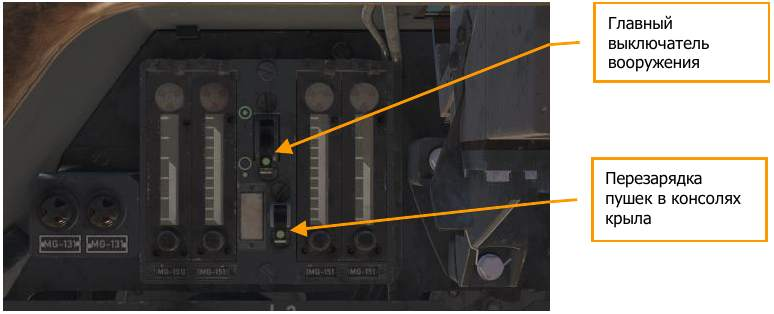
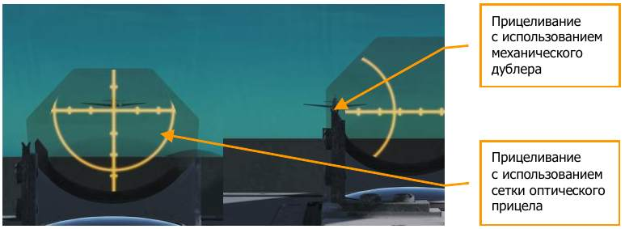
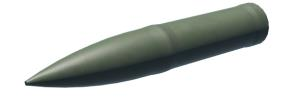

# Боевое применение

В этом разделе рассматриваются методы применения вооружения Fw 190 A-8.
Основным вооружением самолета является пулеметно-пушечное, дополнительно
на подфюзеляжном бомбодержателе Fw 190 A-8 может нести бомбовую нагрузку
до 500 кг и ракеты Werfer-Granate 21 (WG 21) на подкрыльевых подвесках.

## Пушки и пулеметы

- Включите систему вооружения.

    Пулеметы MG 131, размещенные в фюзеляже, и пушки MG 151, установленные в корнях
    крыльев, управляются главным выключателем вооружения.
    Пушки MG 151, размещенные в консолях крыльев, управляются вторым выключателем
    системы вооружения.

    Между включением первого и второго переключателей необходимо выдержать паузу как
    минимум 3 секунды – это гарантирует завершение зарядки вооружения, размещенного
    в фюзеляже и в корнях крыльев. Бортовая электросистема самолета может обслуживать
    только четыре единицы вооружения одновременно, трехсекундная задержка позволяет
    избежать перегрузки электроцепи.

    

- Маневрируйте самолетом таким образом, чтобы совместить прицельную сетку с целью.

    

- Выполнив прицеливание, открывайте огонь с помощью кнопок [[Space]] и/или [[RAlt]] + [[Space]]

## Бомбы

### Бомбометание

Стандартный способ бомбометания:

- Переключателем режимов взрывателей бомб установить тип атаки и режим работы
    взрывателя. Влево [[LShift]] + [[B]], вправо [[LCtrl]] + [[B]].

    

- Нажать на кнопку В2 (сброс бомб/пуск ракет) [[RAlt]] + [[Space]], расположенную на ручке
    управления, чтобы сбросить бомбы.

    Бомбы могут сбрасываться при любом положении самолета, от 30-градусного
    кабрирования до пикирования.

!!! warning
    Запрещается сбрасывать бомбы при наличии бокового скольжения более 5 градусов в вертикальном пике. Бомба может столкнуться с воздушным винтом.

### Аварийный сброс бомб и подвесного бака

Бомбы или подвесной бак можно сбросить специальной рукояткой, расположенной ниже
главной приборной панели.

"Bomben" – Рукоятка аварийного сброса фюзеляжных подвесок. [[LCtrl]] + [[R]]

## Ракеты

Направляющие для неуправляемых авиационных ракет (НАР) типа Werfer-Granate 21 (WG 21)
устанавливаются под крыло самолета.

WG 21 представляет собой тяжелую (НАР) диаметром 210 мм, предназначенную для поражения
воздушных целей. Вес – 110 кг, боевая часть весом 40 кг содержит 10 кг взрывчатого
вещества.

Ракета оснащена временным взрывателем, осуществляющим подрыв боевой части
на определенном расстоянии от носителя.

Благодаря мощной БЧ ракета способна поражать самолеты, находящиеся на удалении
до 15 метров от точки подрыва. К Fw 190 -8 могут подвешиваться 2 НАР WG 21.

### Пуск НАР

- Включить главный выключатель НАР [[LShift]] + [[O]], находящийся на панели управления
    вооружением.
- Нажать кнопку В2 (сброс бомб/пуск ракет) [[RAlt]] + [[Space]] на ручке управления для пуска
    ракет.

При стрельбе НАР WG 21, после каждого нажатия на кнопку В2, происходит сход одной ракеты.

### Аварийный сброс НАР

Ракеты могут быть сброшены аварийно с помощью выключателя аварийного пуска НАР,
расположенного справа от главного выключателя НАР [[LShift]] + [[I]].

{!abbr.md!}
