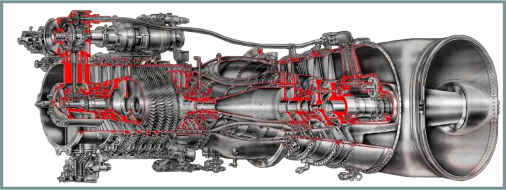
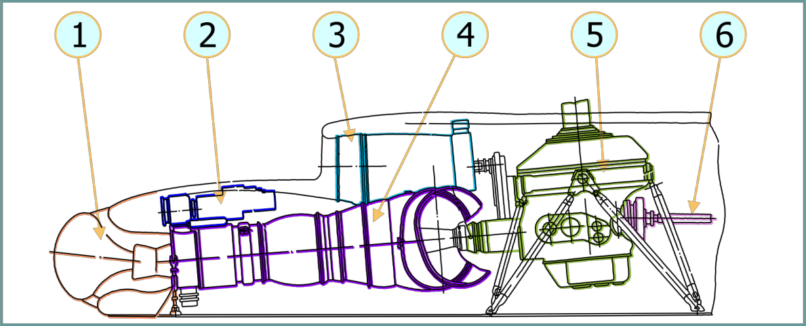
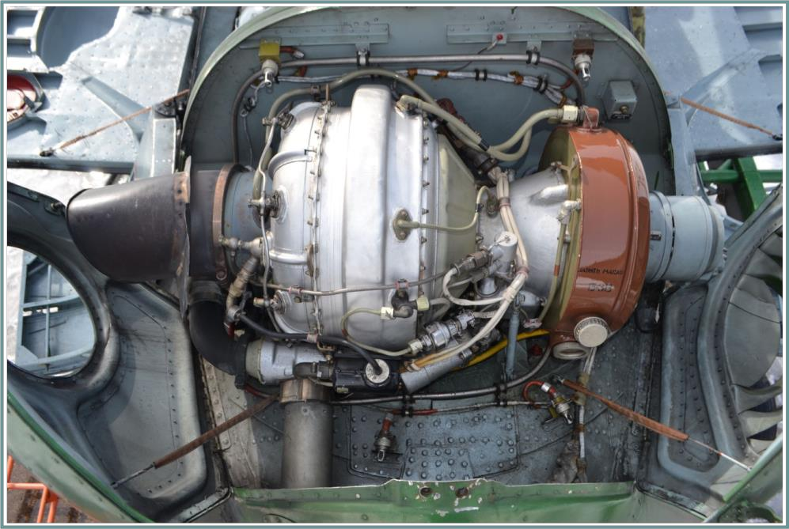
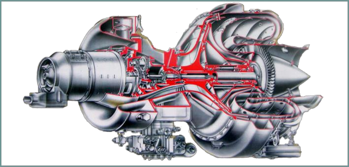
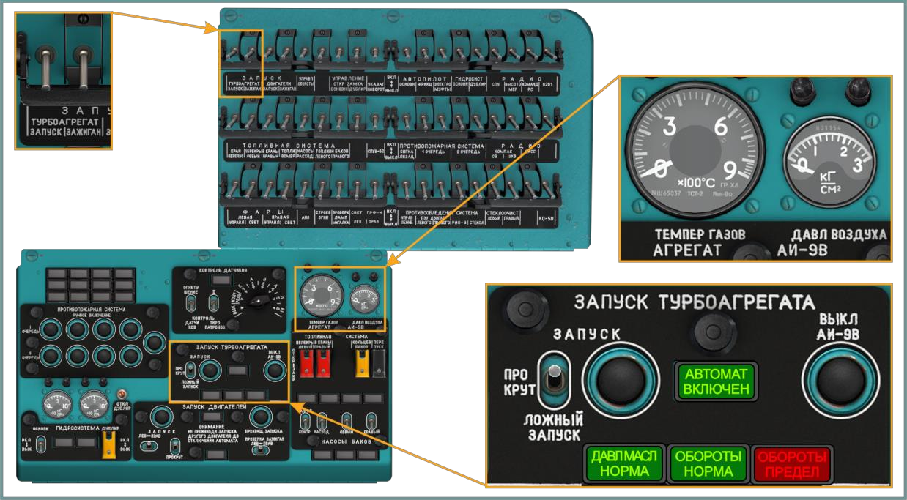
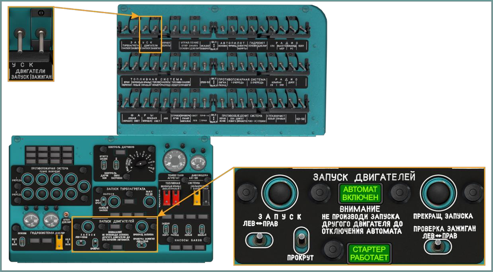
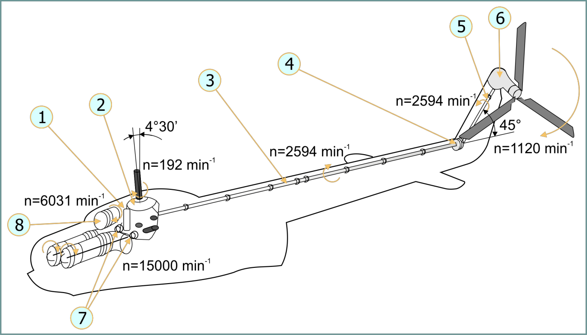
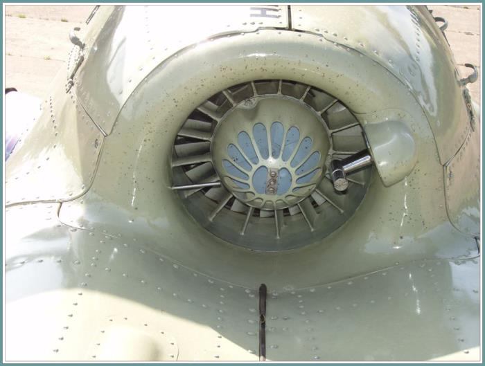

# СИЛОВАЯ УСТАНОВКА И ТРАНСМИССИЯ ВЕРТОЛЕТА

## Силовая установка

Силовая установка вертолета состоит из двух турбовальных двигателей ТВ3-
117ВМ со свободными турбинами, установленных над потолком центральной
части фюзеляжа впереди главного редуктора.

Двигатели расположены симметрично относительно продольной оси вертолета
на расстоянии 600 мм друг от друга с наклоном вперед вниз под углом 4°30' к
строительной горизонтали фюзеляжа. Задние выводные валы двигателей
подключаются к одному главному редуктору вертолета, который суммирует
мощности, и передает их потребителям.

Спаренная установка двух двигателей повышает безопасность эксплуатации
вертолета. При выходе из строя одного двигателя, второй обеспечивает
возможность продолжения полета.

1. Входной воздухозаборник с
пылезащитным устройством (ПЗУ)
2. Воздушный стартер и коробка приводов 
агрегатов                                 
3. Вентилятор системы охлаждения
4. Двигатель ТВ3-117ВМ
5. Главный редуктор ВР-14
6. Вал трансмиссии

### Основные ТТХ двигателя

Направление вращения роторов: левое

Сухая масса двигателя 285(+5,7) кг

Габаритные размеры

- длина с агрегатами и выхлопным патрубком 285(+5,7) кг
- длина от переднего фланца до стыковки с редуктором 1736,5 мм
- ширина 650 мм
- высота 728 мм

Диапазон температур наружного воздуха при которых обеспечивается запуск

- при Н=0 м -60…+60 °С
- при Н=4000 м 60…+30°С

Время выхода на режим малого газа с момента нажатия на кнопку запуска не более 60 сек

- Применяемое топливо Т-1,ТС-1
- Применяемое масло Б-3В

### Режимы и мощности двигателя

Макс. темп.
Температура
газов перед Частота
Мощность на °С
турбиной вращения
Режим выходном валу, Высота (м) (при
компрессора ротора ТК
кВт (л.с.) стандартных
по макс, %
условиях)
прибору,°С.

Режим | Мощность  на выходном  валу, кВт (л.с.) | Высота (м) | Температура °С  (при стандартных  условиях) | Макс. темп.  газов перед  турбиной  компрессора  по прибору,°С. | Частота   вращения  ротора ТК  макс, %
-------------|--------------|----------|----------|-------|-------
Чрезвычайный |  1545 (2100) | 0...2200 | До +30°С | 990°С | 101,15
Взлетный     | 1397(1900) | 0...3600 | До +40°С | 990°С | 101,15
Номинальный  | 1250 (1700) | 0...3600 | До +30°С | 955°С | 99.0
1 Крейсерский | 1103 (1500) | 0...3600 | До +30°С | 910°С | 97,50
2 Крейсерский | 883(1200) | 0...3600 | До +30°С | 870°С | 95,50
Малый газ | около 200 | | | 780°С | В зависимости  от t°C  наружного  воздуха

!!! note "Примечание"
    Чрезвычайный режим работы двигателя включается только при отказе другого
    двигателя (т.е. никакими действиями экипажа для двух исправных двигателей его установить
    невозможно). См. также Ограничения по двигателям и редукторам

## Пылезащитное устройство

Пылезащитное устройство (ПЗУ) предназначено для очистки воздуха,
поступающего в двигатели ТВЗ-117ВМ, от пыли и посторонних предметов во
время руления, взлета и посадки вертолета. В конструкции ПЗУ предусмотрены
воздушно-тепловая и электрическая противообледенительные системы.
В комплект ПЗУ входят два пылеочистителя (левый и правый), два сепаратора,
две электроуправляемые заслонки, трубопроводы подачи воздуха к эжекторам
и противообледенительным системам ПЗУ.

Принцип работы ПЗУ (Рис. 4.3) заключается в следующем. Поступающий в
компрессор воздух проходит через кольцевой искривленный туннель (1),
образованный задней частью обтекателя и носком внешней обечайки. Под
действием центробежных сил частицы пыли прижимаются к поверхности задней
части обтекателя и, перемещаясь вместе с частью воздуха, поступают на вход
сепаратора (2). Большая, очищенная от пыли, часть воздуха проходит по
основному каналу (3), образованному внешней обечайкой и сепаратором, на
вход в двигатель.

Проходя сепаратор, часть воздуха с пылью очищается в нем за счет поворота
потока в межкольцевых каналах, поступает в основной канал и далее на вход в
двигатель. Небольшая часть воздуха с пылью через канал сепаратора поступает
в трубопровод вывода пыли (4) и за счет разряжения, создаваемого эжектором
(5), выводится в атмосферу (6). Включение ПЗУ в работу осуществляется при
подаче сжатого воздуха к эжектору.

Противообледенительная система ПЗУ выполнена смешанной: часть узлов
обогревается горячим воздухом, другая часть имеет систему электрообогрева.
Воздушно-тепловая противообледенительная система ПЗУ включается
одновременно с противообледенительной системой двигателей, см. ПОС ПЗУ и
входных частей двигателей.

## Бортовая вспомогательная силовая установка (ВСУ)

Бортовая вспомогательная силовая установка состоит из газотурбинного
двигателя АИ-9В и обслуживающих систем. Располагается в верхней части
фюзеляжа перед хвостовой балкой.

Газотурбинный двигатель АИ-9В является источником сжатого воздуха для
запуска двигателей ТВЗ-117ВМ и электроэнергии для питания потребителей.
Отбор сжатого воздуха осуществляется от компрессора АИ-9В.
Двигатель АИ-9В имеет собственную топливную систему, автономную масляную
систему, систему регулирования, стартер-генератор и агрегаты,
обеспечивающие запуск и работу
двигателя.
Запуск автоматизирован,
обеспечивается автоматической
панелью АПД-9В выдающей команды
на включение и выключение
агрегатов системы запуска в
соответствии с временнОй
циклограммой.

Электрическая система запуска АИ-9В обеспечивает:

- запуск двигателя на земле;
- ложный запуск двигателя;
- холодную прокрутку двигателя;
- прекращение процесса запуска, ложного запуска, холодной прокрутки
в любой момент времени и останов двигателя.

Электрическая цепь запуска АИ-9В имеет автоматы защиты сети АЗСГК-10
ЗАПУСК ТУРБОАГРЕГАТ "ЗАПУСК" и "ЗАЖИГАН.".

Управление системой запуска осуществляется переключателем "ЗАПУСК–
ПРОКРУТ. – ЛОЖНЫЙ ЗАПУСК", кнопками "ЗАПУСК" и "ВЫКЛ. АИ-9В".

Контроль за температурой выходящих газов двигателя ведется по измерителю
ТСТ-2 АГРЕГАТ – АИ-9В – "ТЕМПЕР. ГАЗОВ"; за давлением воздуха, подаваемым
для запуска двигателей ТВЗ-117ВМ – по указателю УИТ-8 АГРЕГАТ – АИ-9В –
"ДАВЛ. ВОЗДУХА".

Кроме того, о работе АИ-9В сигнализирует табло "ДАВЛ. МАСЛА НОРМА",
"ОБОРОТЫ НОРМА", "ОБОРОТЫ ПРЕДЕЛ".

О включении автоматики запуска сигнализирует табло "АВТОМАТ. ВКЛЮЧЕН".

## Система запуска

Как запустить АИ-9В и двигатели ТВ3-117ВМ см.9.3.

Запуск двигателей ТВЗ-117ВМ осуществляется турбостартером СВ-78Б, который
работает от бортовой вспомогательной силовой установки АИ-9В. Кроме того,
турбостартер обеспечивает холодную прокрутку и ложный запуск двигателей.
Управление запуском осуществляется автоматической панелью АПД-78А в
соответствии с циклограммой.

В систему запуска двигателя входят:

- турбостартер СВ-78Б;
- агрегат зажигания СК-22-2;
- две запальные свечи СП-26ПЗ;
- автоматическая панель запуска АПД-78А (одна на оба двигателя);
- аппаратура защиты, коммутации, управления и сигнализации.

Турбостартер СВ-78Б, агрегат зажигания СК-22-2 и запальные свечи СП-26ПЗ
установлены на двигателе, а автоматическая панель запуска АПД-78А,
аппаратура защиты, коммутации, управления и сигнализации – на вертолете.

Для запуска двигателей ТВЗ-117ВМ включаются автоматы защиты сети ЗАПУСК
– ДВИГАТЕЛИ – "ЗАЖИГАН." и ЗАПУСК – ДВИГАТЕЛИ – "ЗАПУСК",
переключатель ЗАПУСК – "ЛЕВ. – ПРАВ." устанавливается в положение
запускаемого двигателя, а переключатель "ЗАПУСК–ПРОКРУТ." – в положение
"ЗАПУСК".

Для холодной прокрутки или ложного запуска переключатель "ЗАПУСК–
ПРОКРУТ." установить в положение ПРОКРУТ. Ложный запуск производится с
открытым пожарным краном (перекрывным краном, электродистанционный),
открытым стоп-краном (или КРАН ОСТАНОВА, механический) и включенным
подкачивающим топливным насосом. Холодная прокрутка двигателя
производится аналогично ложному запуску, но с закрытым стоп-краном.
Управление запуском производится нажатием кнопок "ЗАПУСК" или "ПРЕКРАЩ.
ЗАПУСКА".

О работе стартера СВ-78Б сигнализирует табло "СТАРТЕР РАБОТАЕТ", а о
включении автоматики запуска – табло "АВТОМАТ ВКЛЮЧЕН".
При запуске двигателя ТВЗ-117ВМ сжатый воздух от бортовой вспомогательной
силовой установки поступает в турбину стартера для раскрутки. Турбина
стартера через коробку приводов передает вращение на ротор турбины
двигателя.

Система запуска выключается автоматически на оборотах двигателя 55% или
через 55 с после начала запуска. Прекратить запуск можно в любой момент.

## Главный редуктор и трансмиссия

Главный редуктор ВР-14 и трансмиссия вертолета предназначены для
изменения числа оборотов и передачи крутящего момента от двух
газотурбинных двигателей ТВЗ-117ВМ к несущему и рулевому винтам,
вентилятору системы охлаждения и агрегатам, установленным на главном
редукторе. Трансмиссия включает (Рис. 4.8):

- промежуточный редуктор;
- хвостовой редуктор;
- валы трансмиссии;
- систему торможения.

1. Привод вентилятора           
2. Главный редуктор ВР-14       
3. Хвостовой вал трансмиссии    
4. Промежуточный редуктор       
5. Концевая часть вала трансмиссии
6. Хвостовой редуктор
7. Приводы двигателей ТВЗ-117ВМ
8. Вентилятор

(2) ГЛАВНЫЙ РЕДУКТОР ВР-14 представляет собой самостоятельный агрегат,
предназначенный для суммирования мощности обоих двигателей, понижения
оборотов турбин и передачи крутящего момента от двигателей к несущему
винту, рулевому винту, вентилятору, гидронасосам, генераторам переменного
тока, воздушному компрессору, маслоагрегату, датчикам тахометра.
Для обеспечения полета вертолета при одном работающем двигателе, а также
для возможности использования авторотации несущего винта в редукторе
предусмотрены две муфты свободного хода, которые автоматически отключают
редуктор от одного или от обоих двигателей.

Для контроля за состоянием редуктора установлен фильтр-сигнализатор
стружки, выдающий световой сигнал при появлении металлической стружки в
масле. Контроль работы масляной системы редуктора производится замером
температуры масла в поддоне редуктора и давления масла за нагнетающей
ступенью маслоагрегата.

(4) ПРОМЕЖУТОЧНЫЙ РЕДУКТОР предназначен для изменения направления оси
хвостового вала на угол 45° в соответствии с изгибом концевой балки.

(6) ХВОСТОВОЙ предназначен для передачи вращения рулевому винту.

Вращение от хвостового вала на рулевой винт передается через ведущий вал,
пару спирально-зубчатых конических колес, ведомый вал. На фланце ведомого
вала крепится втулка рулевого винта. Внутри картера кроме конических колес
размещен узел механизма управления переменным шагом рулевого винта.

ВАЛЫ ТРАНСМИССИИ включают в себя хвостовой вал (3), (5) и карданный вал
привода (1) вентилятора (8).

Хвостовой вал предназначен для передачи крутящего момента от главного
редуктора через промежуточный и хвостовой редукторы к рулевому винту.

Главный и промежуточный редукторы соединяются горизонтальной частью
хвостового вала, а промежуточный и хвостовой редукторы – наклонной
концевой частью хвостового вала.

Карданный вал предназначен для передачи крутящего момента от главного
редуктора к вентилятору, соединяется с фланцем привода на главном
редукторе и со шлицевым наконечником вала вентилятора.

СИСТЕМА ТОРМОЖЕНИЯ НВ предназначена для уменьшения времени вращения
несущего винта после выключения двигателей, а также для стопорения
трансмиссии во время стоянки вертолета.

Тормоз колодочного типа с механическим управлением от рычага (в кабине
экипажа справа от сиденья левого летчика), связанного с тормозом тросом.

## Система воздушного охлаждения

Воздушная система охлаждения агрегатов вертолета служит для охлаждения
масла в маслорадиаторах масляных систем двигателей и главного редуктора,
генераторов переменного тока, шестеренчатых гидронасосов и воздушного
компрессора.

Охлаждение масла двигателей и главного редуктора происходит путем
продувки воздуха вентилятором через воздушно-масляные радиаторы.

Охлаждение генераторов, гидронасосов и воздушного компрессора происходит
путем непосредственного обдува воздухом, поступающим по гибким
трубопроводам.

Сам вентилятор засасывает воздух из входного канала. Часть поступающего из
вентилятора воздуха через отверстия нагнетается в маслорадиаторы. Из
радиаторов нагретый воздух отводится за пределы капота.

Другая часть воздуха через предохранительные сетки попадает в воздушный
коллектор, откуда воздух по гибкому трубопроводу отбирается для охлаждения
генераторов, гидронасосов и воздушного компрессора.

{!docs/mi8/abbr.md!}
