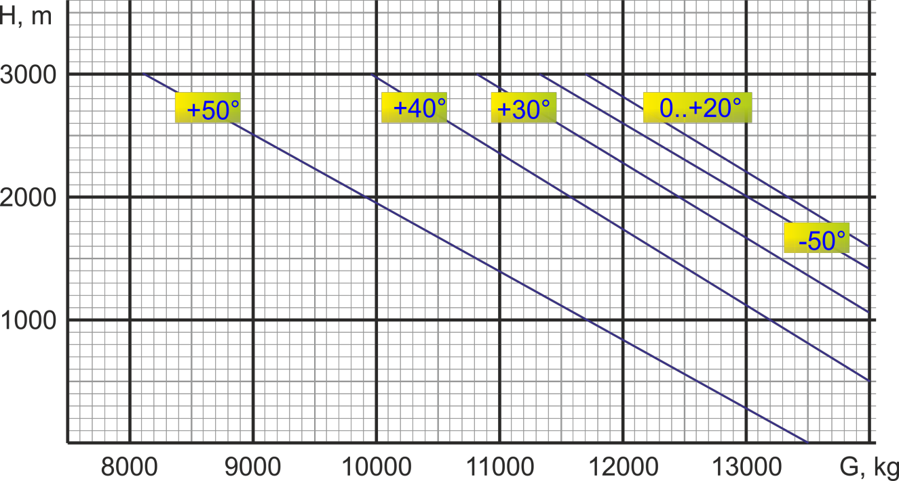
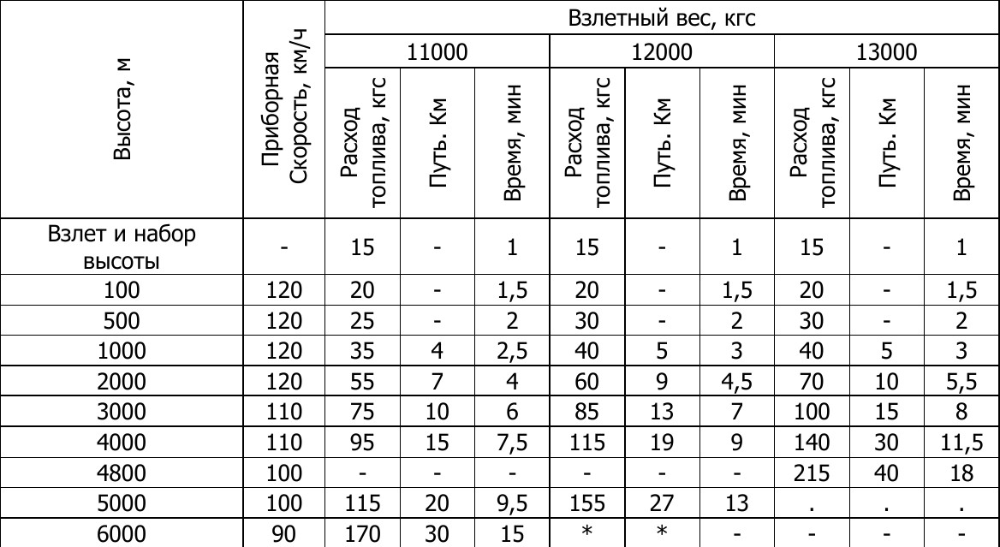
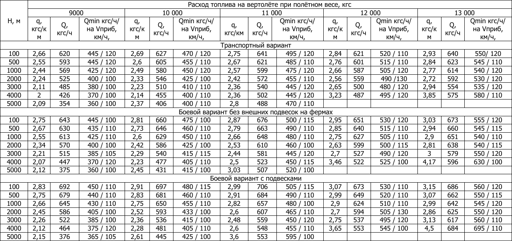
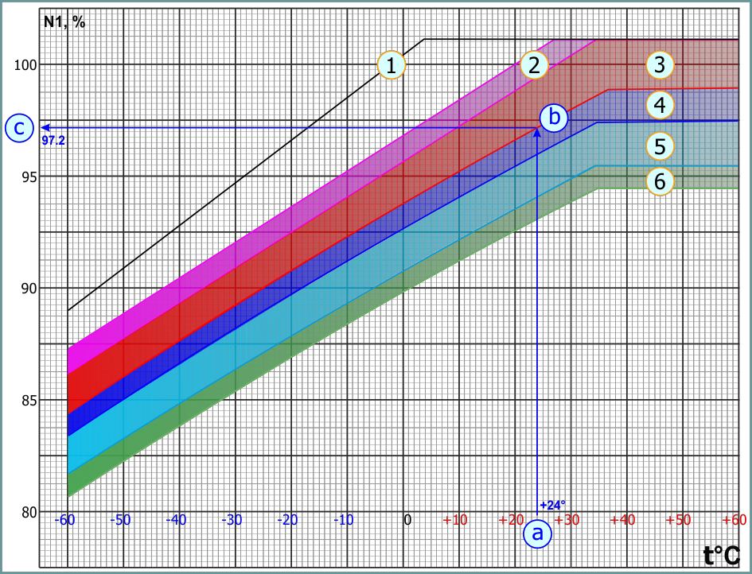

# Летные ограничения и выполнение расчётов

## Ограничения и инженерно-штурманские расчеты

### Определение предельного взлетного веса вертолета

Предельный взлетный вес вертолета при взлете и посадке по-вертолетному ВНЕ
ЗОНЫ ВЛИЯНИЯ ЗЕМЛИ определять по номограммам Рис. 8.1, в зоне влияния земли
– по номограмме на Рис. 8.2.

На номограммах Рис. 8.1 и Рис. 8.2 показаны зависимости предельного
взлетного (посадочного) веса вертолета от барометрической высоты площадки
при различных температурах наружного воздуха в штилевых условиях.

Номограммы рассчитаны для оборотов несущего винта 93% при выключенном
отборе воздуха на эжекторы ПЗУ и выключенной противообледенительной
системе входов двигателей, несущего и рулевого винтов.

!!! note "Примечание"
	При установленных на вертолет ЭВУ (7.12) предельный вес вертолета,
    определенный по номограммам, уменьшить на 300 кгс.

При включении отбора воздуха на эжекторы ПЗУ предельный вес вертолета,
определенный по номограммам, уменьшить на 200 кгс; при включении ПОС
двигателей и винтов уменьшить на 1000 кгс.

Встречный ветер увеличивает возможности по весу: при ветре 5м/с вес можно
увеличить до +400кг, при ветре 10м/с – до +1200кг. Влияние бокового ветра до
4м/с сказывается негативно за счет влияния на РВ и необходимость большего
отбора мощности при боковом ветре. Поэтому при боковом ветре 3..5м/с
необходимо уменьшить взлетный вес на 200кг. При большем значении бокового
ветра уже сильнее проявляется влияние косой обдувки НВ. Негативное влияние
ветра сзади на двигатели ("задувание" горячего воздуха на вход двигателей) в
игре не смоделировано.

При определении предельного веса с учетом влияния ветра следует иметь в
виду, что как направление, так и скорость ветра могут меняться в процессе
взлета и посадки. Поэтому при определении предельного веса при
неустойчивом ветре следует брать минимальное значение предельного веса для
возможного диапазона изменения ветра.

При отсутствии данных о ветре и невозможности определить направление при
посадке расчет предельного веса производить для наиболее неблагоприятного
сочетания скорости и направления ветра (ветер сзади скоростью 4-6 м/с).
Для пояснения пользования номограммами на них дан ключ.

!!! hint "Пример"
    Определить предельный полётный вес вертолета для взлета по-вертолетному с
    разгоном в зоне влияния земли с площадки, расположенной на высоте 2300 м над уровнем
    моря, при температуре наружного воздуха +30°С.

    РЕШЕНИЕ. По номограмме [Рис. 8.2](#82) находим предельный полётный вес для взлета в штилевых
    условиях. На шкале барометрической высоты Н находим точку, соответствующую высоте 2300 м
    и проводим горизонтальную прямую до пересечения с линией с отметкой +30°С. Из полученной
    точки проводим вертикаль до горизонтальной шкалы и определяем предельный вес вертолета в
    штилевых условиях (11 780 кгс).

Определение предельного веса вертолета при взлете и посадке по-
вертолетному с разгоном вне зоны влияния земли производить в той же
последовательности, используя номограммы [Рис. 8.1](#81).

ОПРЕДЕЛЕНИЕ ПРЕДЕЛЬНОГО ВЕСА ВЕРТОЛЕТА ПРИ ВЗЛЕТЕ И ПОСАДКЕ ПО-САМОЛЁТНОМУ
производить по номограмме [Рис. 8.2](#82) увеличивая полученное значение веса на
500 кгс. Перед взлетом по-самолётному выполнить контрольное висение на
высоте не менее 1 м и убедиться, что предельный взлетный вес определен
правильно.

ОПРЕДЕЛЕНИЕ ПРЕДЕЛЬНОГО ВЗЛЕТНОГО ВЕСА ВЕРТОЛЕТА ПРИ ВЗЛЕТЕ С РАЗБЕГОМ НА НОСОВОМ
КОЛЕСЕ производить по номограмме Рис. 8.3.

Правильность выбора предельного взлетного веса для взлета с разбегом на
носовом колесе производить по результатам контрольного висения на взлетном
режиме работы двигателей. Взлет с разбегом на носовом колесе можно
производить, если контрольное висение показало, что вертолет отрывается от
земли.

Во всех случаях предельный вес не должен превышать максимального
взлетного веса вертолета -13000 кгс.

Для расчета веса вертолета и его возможностей по заправке топливом и
загрузке необходимо знать исходные весовые характеристики вертолета,
экипажа и оборудования. Они представлены в таблице ниже.

Табл. 8.1

 № пп | Ми-8МТВ2. Список объектов, которые могут находиться на вертолете объектов, кг | Вес объектов, кг | Объекты, которые учитываются в модели (в "Вес пустого вертолета")
------|-------------|--------|----------
1  | Пустой вертолёт| 7200,0 |
2  | Входной трап |7,3| 7,3
3  | Сейф |4.5| 
4  | Доп. топливный бак |70 |Не моделируется
5  | Десантные сиденья (30 шт.) |58,7 |58,7
6  | Грузовые трапы |31,6|
7  | ЛПГ-150м (на полу гр. кабины) |33,5| 33,5
8  | Шкворневые установки |19,8 |19,8
9  | Санитарное оборудование |93,6 |
10 | Десантные троса |6 |
11 | Невырабатываемый остаток топлива |20 |20
12 | Топливо 0,775 кг/л | |
   | - в расходном баке |322 | Учитывается в редакторе миссий
   | - в подвесных баках |1608 |Учитывается в редакторе миссий
   | - в дополнительных баках |1388 |Не моделируется
13 | Спец плиты (броня) |419 |419
   |  - в кабине лётчиков |332 |
   |  - в грузовых створках | 33 |
   |  - в гидроотсеке |54 |
14 | Фермы с 6-ю БД3-57кр ВМ |401 |401
15 | ПКТ носовой с бк |38,8 |Не моделируется
16 | ПКТ кормовой с бк (750 патронов в 3 коробках по 250 патронов) | 26,9 |Учитывается в редакторе миссий
17 | Дверной пулемет "КОРД" 12,7-мм с устройством крепления и БК (600 патронов в 12 коробках по 50 патронов) | 138 |Учитывается в редакторе миссий
18 | УВ-26 (вместе с БК 128 ППИ-26-1) |26,3 |26,3
19 | Б8В20-а (блок для НАР без снаряжения) |100|Учитывается в редакторе миссий
20 | НАР (20 шт калибра 80-мм.) |242|Учитывается в редакторе миссий
21 | ГУВ-1 (подвесной контейнер с 12,7-мм и 7,62-мм пулеметами)| 452 |Учитывается в редакторе миссий
22 | ГУВ-1 (подвесной контейнер с 30-мм гранатометом)| 274 |Учитывается в редакторе миссий
23 | УПК-23-250 (универсальный пушечный контейнер) | 230 |Учитывается в редакторе миссий
24 | Контейнер ВСМ-1 (пустой) |70 |Не моделируется
25 | Кислородное оборудование экипажа |19,3 |Не моделируется
26 | Верёвочная лестница |19,7 |Не моделируется
27 | Прицел ПКВ |2,5 |2,5
28 | Прицел ОПБ-1p |8,2 |Не моделируется
29 | РК вооружения с пультом БВ |15,9 |15,9
30 | Спасательное оборудование: |216 |Не моделируется
   | - лебёдка ЛПГ-300 |60 |
   | - стрела |95,5 |
   | - ферма с РК |15,6 |
   | - прожектор |20,5 |
   | - люлька |30 |
   | - багор |0,9 |
   | - ручной прожектор (2 шт.) |2 |
   | - пояс спасательный (2 шт.) |4 |
   | - пояс бортового техника |1,8 |
   | - резиновый коврик |6,6 |
   | - подъёмное сиденье |9 |
   | - прочее |5,4 |
31 | Внешняя подвеска: |160,5 |160,5
   | - замок ДГ-64М | 21,3 |
   | - ограждение люка внешней подвески | 9,3 |
   | - силовые тросы 4х1,11м |10 |
   | сбрасываемая часть: |119,9 |
   | - удлинительный трос 1,7м |3,15 |
   | - удлинительный трос 5м |7,3 |
   | - удлинительный трос 10м (2шт) |27,3 |
   | - удлинительный трос 20м(2шт) |52,5 |
   | - грузовые стропы (4х4м) или "паук" |24 |
   | - детали сборки |5,6 |
32 | Швартовка лопастей |43,3 |Не моделируется
33 | Л166В1А (система РЭБ ИЗ) |25 |Не моделируется
   | Набор оборудования, кг |1164.5 |
34 | Масло в системах и агрегатах |71.7 |71.7
35 | Экипаж |270 |270
   | Вес снаряженного вертолета с экипажем, заправленным маслом, БЕЗ топлива и вооружения | | 8706.2

Теперь, зная вес снаряженного вертолета без вооружения и топлива, можно
определить возможные вариации между топливом и полезной нагрузкой.

## Расчет дальности, радиуса и продолжительности полёта

В этом разделе представлены необходимые данные для выполнения
инженерно-штурманского расчета полёта.

Дальность полёта (радиус) и продолжительность зависит от запаса топлива и
интенсивности его расхода, которая в свою очередь зависит от полётного веса,
снаряжения вертолета навесным оборудованием (изменение аэродинамики),
высоты и скорости полёта.

Влияние перечисленных факторов на пространственные и временные
показатели рассмотрены ниже.

#### Высота полёта.

Как правило, полёты вертолетов производятся на малых
высотах. Однако в тех случаях, когда необходимо получить наибольшую
дальность, полёт следует производить на высотах 2000-3000 м. где дальность
полёта примерно на 15% больше, чем на малых высотах.

#### Скорость полёта.

Наибольшая дальность достигается на крейсерской или
близкой к ней скорости (в пределах ±20км/ч).

#### Крейсерская скорость полёта

Это скорость наибольшей дальности полёта
(минимального километрового расхода топлива), Табл. 8.2.

<a name="t82">Табл. 8.2</a>

Высота, м| Скорость полёта при полётном весе 11 100 кгс и менее, км/ч  Приборная, воздушная |Скорость полёта при полётном весе более 11 100 кгс, км/ч  Приборная, воздушная
-----|----------|--------
100  | 230, 233 | 215, 219
500  | 225, 233 | 210, 218
1000 | 220, 233 | 205, 218
2000 | 210, 234 | 195, 218
3000 | 195, 230 | 160, 190
4000 | 170, 213 | 120, 154
5000 | 120, 163
6000 | 100, 145

#### Аэродинамика вертолета

При выполнении полётов с установленными на вертолете [ЭВУ](07.systems.md#-_3)
километровые и часовые расходы топлива по сравнению с указанными в [Табл.
8.4](t84) увеличиваются на 6%.

При подвеске вооружения расход соответствует данным, представленным в
[Табл. 8.4](t84) для соответствующего раздела.

#### Отбор воздуха ОТ двигателей

При включении противообледенительных систем вертолета и ПЗУ двигателей
километровый и часовой расходы топлива сравнению с указанными ниже в
таблицах увеличиваются:

- при включении противообледенительной системы воздухозаборников
и ВНА двигателей – на 3%;
- при включении противообледенительной системы несущего и
рулевого винтов – на 2%.

При включении ПЗУ на висении вертолета часовой расход топлива по
сравнению с указанным в Табл. 8.4 увеличивается на З%.

#### Гарантийный запас топлива

Для обеспечения безопасности маршрутных полётов устанавливается
гарантийный запас топлива не менее минимального, равный для вертолета Ми-
8МТВ2 200 кгс (260 л).

#### Расход топлива при работе двигателей на земле GT3

Cостоит:

- из расхода топлива при запуске и прогреве двигателей, рулении на старт — 30
кгс за 5 мин (по 6 кгс в мин);
- из расхода топлива при работе двигателя АИ-9В на бортсеть до запуска
двигателей (по 1,25 кгс/мин).

#### При заходах на наземную цель

Затрачивается 12 кгс топлива в минуту. При
продолжительности повторного захода 4 мин на каждый последующий заход
(считать, что первый производится с ходу) расходуется 50 кгс топлива, что
эквивалентно уменьшению радиуса полёта примерно на 10 км.

Данные по расходу топлива на различных этапах полёта представлены в Табл.
8.3.

#### Расход топлива, путь и время при взлете и наборе высоты

Приборная скорость 120 км/ч, режим работы двигателей номинальный

<a name="t83">Табл. 8.3</a>

Километровый и часовой расход топлива на различных высотах и скоростях наибольшей дальности в зависимости от полётного веса
Число оборотов несущего винта 95%

<a name="t84">Табл. 8.4</a>

#### Расход топлива, путь и время при снижении и посадке

<a name="t85">Табл. 8.5</a>

#### Часовой расход топлива (кгс/ч) при висении вертолета вне зоны влияния земли

<a name="t86">Табл. 8.6</a>

Для расчета досягаемости при выполнении задач, необходимо определить
затраты топлива на этапы, не связанные с продвижением по маршруту (запуск,
руление, работа в районе цели), добавить к ним гарантийный запас топлива,
далее отнять эту сумму от общего запаса топлива на борту. В полученном
результате учесть навигационный (5%) запас (умножением на 0,95) и запас на
выдерживание места в строю (5% для звена, выполняется умножением на
0,95).

## Ограничения по двигателям и редукторам

### Двигатели

Максимально допустимые параметры работы двигателей на всех
высотах и скоростях полёта должны быть не выше, приведенных в Табл. 8.7

<a name="t87">Табл. 8.7</a>

Эксплуатационные параметры работы двигателей приведены в Табл. 8.8

<a name="t88">Табл. 8.8</a>

!!! note "Примечание"
	Чрезвычайный режим работы двигателя включается только при отказе другого
    двигателя (т.е. никакими действиями экипажа для двух исправных двигателей его установить
    невозможно).

Зависимость частоты вращения ротора ТК (N1) от температуры воздуха на входе в двигатель

Рис. 8.4. Зависимость частоты вращения ротора ТК (N1) от температуры воздуха на входе в двигатель (Н= 0; V= 0; P0 = 1013,25 ГПа (760 мм рт. ст.))

1. Макс.допустимая частота вращения 
2. Зона ЧР 
3. Зона взлетного режима 
4. Зона номинального режима 
5. Зона II крейсерского режима 
6. Зона I крейсерского режима

!!! hint "Пример"
    Определить границы оборотов ТК взлетного режима при +24°C.
    Ключ (для нижней границы оборотов): снизу от точки +24°С (a) вертикально до пересечения с
    нижней границей зоны взлетного режима (b). От (b) провести горизонтальную линию до
    пересечения с осью оборотов (с), получаем 97.2%. Максимальное значение рассчитывается
    аналогично (99.4%).

!!! note "Примечание"
	График Рис. 8.4 позволяет определить обороты ТК только для стандартных
    условий. Для учета изменения атмосферного давления необходимо использовать график на Рис. 8.5.

Рис. 8.5. График для определения поправок 𝛥𝑁1
в зависимости от давления воздуха (по закону, заложенному в ЭРД)

Значению "0" соответствует давление 760 мм рт ст. Уточненное значение
оборотов ТК по режимам получается добавлением поправки 𝛥𝑁1 к значениям,
полученным на графиках Рис. 8.4

### Редукторы

Допустимые значения эксплуатационных параметров работы главного
редуктора следующие:

- давление масла:
    - на режиме малого газа не менее 0,5 кгс/см2;
    - на остальных режимах 3.5±0,5 кгс/см2;

- температура масла на входе в редуктор на всех режимах:
    - максимальная не более 90°С;
    - рекомендуемая 50 - 80°С;
    - минимальная для выхода на режим выше малого газа –15°С;
    - минимально допустимая при длительной работе +30°С.

Максимальная температура масла в хвостовом и промежуточном редукторах
допускается не более 110°С.

{!docs/mi8/abbr.md!}
