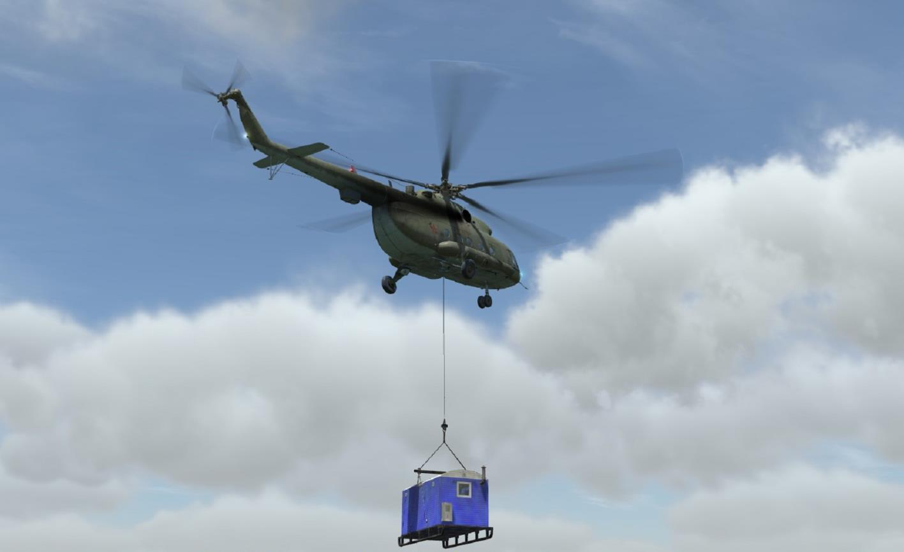
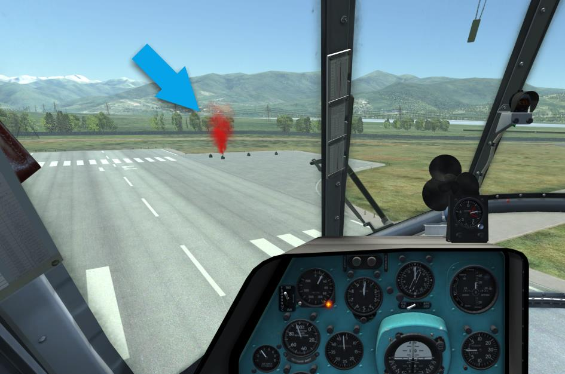
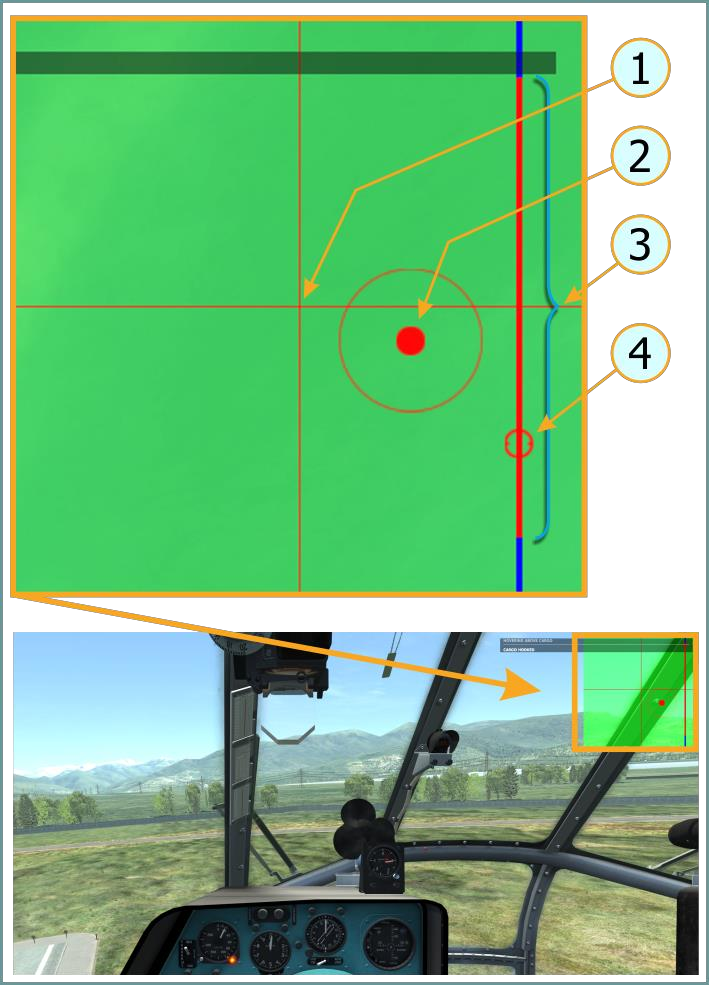
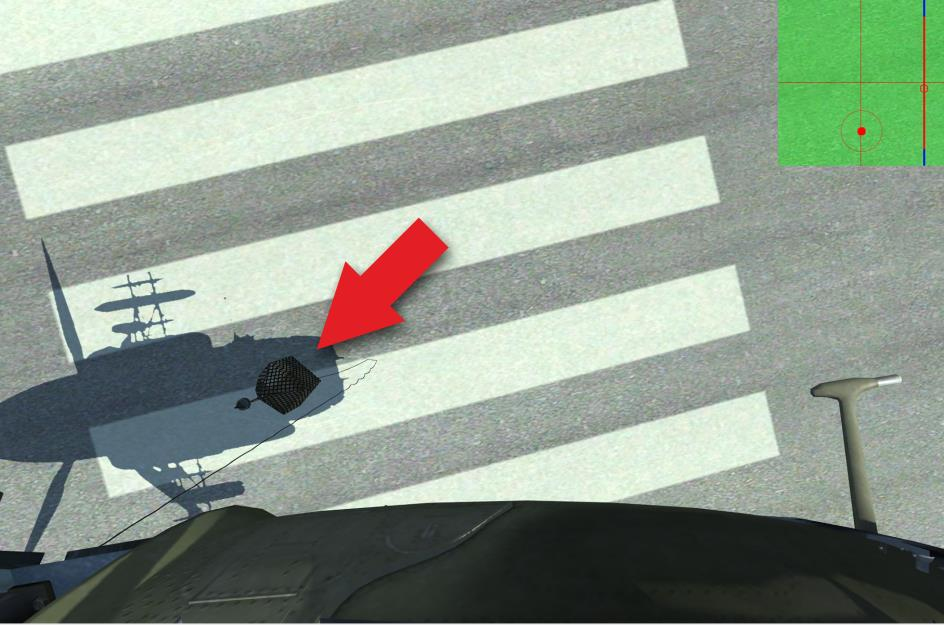
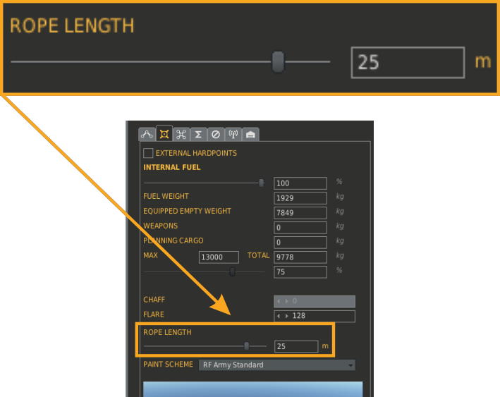
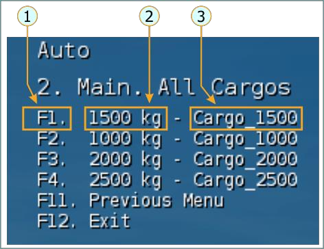
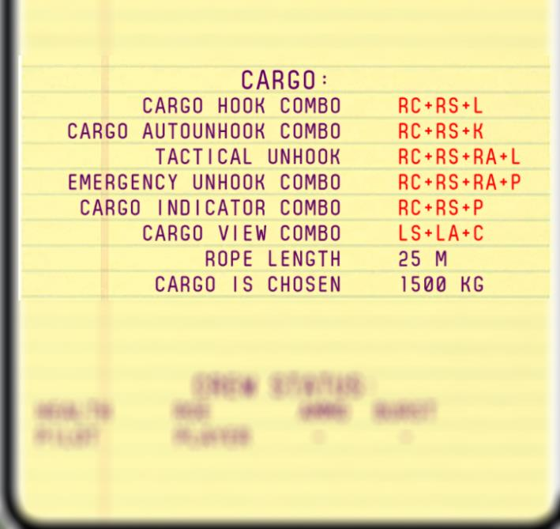

# ВЫПОЛНЕНИЕ СПЕЦИАЛЬНЫХ ЗАДАЧ

## Перевозка грузов на тросовой внешней подвеске

В игре реализована возможность перевозки грузов на тросовой внешней
подвеске.

Наиболее сложные этапы выполнения полета с грузом на тросовой внешней
подвеске включают в себя:

- выполнение зависания над грузом и подцеп груза;
- взлет с грузом;
- полет в район укладки (отцепа) груза;
- заход и зависание в зоне (точке) укладки, отцеп груза.

В реальной жизни выполнение задач по перевозке грузов на внешней подвеске
является одним из самых сложных видов полетов. В таком полете активно
работает весь экипаж. Для частичной компенсации необходимой помощи от
членов экипажа в игру добавлены несколько опций игры с внешней подвеской,
которые активируются либо игроком, либо автоматически, см. ниже.

Кроме того, чтобы играть с внешней подвеской, в редакторе миссий необходимо
создать миссию с добавлением груза (грузов) для коалиции игрока.

### Опции игры при перевозке грузов на тросовой внешней подвеске

Эти опции предназначены для облегчения точного зависания над грузом по
месту и высоте перед его зацепом, а также во время полета к зоне укладки и
зависания над зоной укладки груза. Опции включают в себя:

- маркирование груза дымом с некоторого расстояния (2000 м)
 – автоматическая опция, активируется после выбора груза из
радиоменю, см.ниже; //link
- индикатор груза, указывающий положение груза относительно замка
внешней подвески, а также положение вертолета в пределах зоны
висения по высоте (опция работает на этапе подцепа груза) – опция
активируется игроком;
- автоматический голосовой ассистент (бортовой техник ИИ), который
подсказывает куда и насколько следует переместить вертолет для
точного зависания над грузом, (опция работает на этапах подцепа,
взлета с грузом, полета к месту зоны укладки, при укладке груза (при
соответствующей подготовке миссии))
 – автоматическая опция, условия активации см ниже;
- вид с блистера на груз (вниз под вертолет), облегчающий контроль
места вертолета относительно груза
 – опция активируется игроком, работает всегда.

Маркирование груза дымом осуществляется автоматически
после выбора груза из радиоменю (см. ниже). Маркерный дым виден только
игроку, который выбрал этот груз (если выполняется полет в сети).

Индикатор груза:

1. Проекция замка внешней подвески на поверхность 
2. Положение груза 
3. Допустимые пределы зоны висения по высоте 
4. Индикация положения вертолета относительно пределов зоны висения по высоте (на красной линии – ОК)

Активация/деактивация индикатора происходит после выбора груза из
радиоменю и применения клавиатурной команды [RCtrl] + [RShift] + [P].

Автоматический голосовой ассистент (бортовой техник ИИ RU или EN)
подачей голосовых команд помогает:

- на этапе выполнения зависания над грузом и подцепа груза – дает
необходимые команды по занятию точного положения над грузом,
информирует о факте подцепа груза;
- на этапе взлета с грузом – информирует о поведении груза и его
текущей высоте;
- на этапе полета в район укладки (отцепа) груза – информирует о
возникновении раскачки груза, а также снижении груза на высоту
ниже 20м до поверхности;
- на этапе зависания в зоне (точке) укладки и отцепа груза (при
указании в миссии места укладки триггером, см.ниже) – дает
необходимые команды по занятию точного положения над точкой
укладки, информирует о факте касания грузом поверхности.

На этапе зависания над грузом голосовой ассистент включается при
уменьшении расстояния от груза до вертолета менее 10 м по X, Z, Y, (т.е. если
хотя бы одно из расстояний меньше 10 м). На этапе зависания в зоне укладки
ассистент включается при уменьшении расстояния от груза до центра зоны
укладки менее 75 м.

В случае укладки груза с обозначением зоны укладки (триггером в миссии с
правилом "груз отцеплен в зоне”), голосовой ассистент ведет игрока в
окружность с радиусом 5 метров по логике наводки на зону отцепа на высоте не
менее 6 метров от нижней центральной точки груза, команды "ниже-выше"
выдает относительно этой метки, а после попадания в указанную окружность
начинает выдавать команды на снижение.

В случае укладки груза без обозначения зоны укладки (триггером в миссии
с правилом "груз отцеплен в зоне”), голосовой ассистент будет помогать
контролировать высоту груза до земли фразами: "груз 60 до земли", "груз 50 до
земли", груз 30 до земли", "груз 20 до земли", "груз 15 до земли", "груз 10 до
земли", "груз 5 до земли", "груз 3 до земли", "груз метр до земли", "груз на
земле, сброс".

После фразы, "груз на земле, сброс", автоматический голосовой ассистент
(бортовой техник ИИ RU или EN) прекратит свою работу до выбора следующего
груза.

Следует помнить, что во время энергичных перемещений вертолета в районе
подцепа или укладки груза (по месту или высоте) актуальность информации
сообщений быстро устаревает.

Вид с блистера на груз (Рис. 13.4) служит для контроля места зависания
после "закрытия" видимости груза фюзеляжем. Активируется/деактивируется
[LShift] + [LAlt] + [С],

Вид с блистера на груз можно использовать как с места командира, так и с
места второго пилота.

Рекомендуется назначить на одну из кнопок джойстика и применять во время
зависания над грузом частой, но кратковременной активацией.

### Создание миссии в редакторе для игры с внешней подвеской

#### Установка груза на карте и выбор длины троса внешней подвески

Для создания миссии необходимо выполнить действия, указанные на схеме:

1. Выбрать "Добавить статический объект"

    

2. Выбрать категорию ГРУЗЫ (Cargos), тип – Груз-1 (или хх):

    

3. Установить объект на карте (левой кнопкой мыши);
4. Установить флаг "МОЖЕТ БЫТЬ ГРУЗОМ" (для возможности выбора и
подцепки груза во время игры):

    

5. Установить необходимый вес груза (для начинающих рекомендуется не
более 500кг), для многих грузов вес изменить нельзя;
6. Переименовать этот объект (рекомендуется), например "ГРУЗ\_500",
чтобы облегчить его выбор, если в игре не один груз;
7. Установить требуемую длину троса (максимально до 30м):

    

8. Сохранить миссию, создание миссии завершено.

Созданная миссия позволяет выполнить подцеп груза, полет с грузом и
самостоятельную его укладку по желанию игрока (укладка осуществляется без
использования автоматических опций – обозначения места укладки и помощи
голосового ассистента).

Для создания более продвинутой миссии, где при выполнении точной укладки
груза по месту будут работать автоматические опции (маркирование дымом
места укладки, помощь автоматического голосового ассистента) в миссию
необходимо добавить обозначение места укладки груза триггерной зоной.

#### Обозначение места укладки груза

Для возможности маркирования места укладки груза дымом, а также получения
помощи голосового ассистента (бортового техника ИИ, см.ниже) при укладке
груза необходимо:

1. Установить триггерную зону, присвоить ей имя и указать радиус (в
данном случае размер радиуса не имеет значения):

    

2. В настройке триггеров, Рис. 13.6 (1) создать новый триггер (2); выбрать
тип условия CARGO UNHOOKED IN ZONE (3); выбрать, для какого именно
груза должно быть маркирование места укладки (4); связать выбранный
груз с нужной зоной (5):

    

3. В действиях, которые должны произойти при наступлении указанного
условия, выбрать любое событие/события (например, вывод сообщения
 "Выполнена точная укладка груза"). Действие по триггеру выбирать
обязательно, иначе триггер не запишется.

Теперь во время игры после приближения вертолета с указанным грузом
"1000kg" на расстояние менее двух километров до центра триггерной зоны
"UnHooked Zone-1" место укладки будет маркировано дымом, а с удаления 50м
голосовой ассистент начнет уточнять место зависания перед укладкой. К одной
триггерной зоне можно "привязать" любое количество грузов.

### Действия игрока во время игры

Рассмотрим действия по выбору груза и этапам полета с грузом на примере.
Итак: в некотором районе находятся несколько грузов различной массы.
Необходимо выбрать один из них, выполнить зависания над грузом и подцеп
груза, взлет с грузом, полет в район укладки (отцепа) груза, заход и зависание
в зоне (точке) укладки, отцеп груза.

ДЕЙСТВИЯ ИГРОКА

#### Выбор груза

Для возможности выбора грузов (с использованием радиоменю) из некоторого
множества реализована "зона видимости грузов", которая движется вместе с
вертолетом игрока или бота (обозначены окружностями вокруг вертолетов №1
и 2). Поэтому грузы игроком могут быть выбраны в случае, когда вертолет
приблизиться к ним на дальность менее размера радиуса зоны видимости
грузов (см. Рис. 13.7, вертолет №2)

Исходя из опыта тестирования, радиус зоны обнаружения грузов установлен
2000м (6.562ft). Если удаление вертолета от грузов более 2000m, то груз
выбрать нельзя (меню вертолета №1). Как только грузы окажутся в зоне
"видимости", которая движется вместе с вертолетом, тогда в меню появится
дополнительный пункт для активации дополнительной страницы [F6] со
списком грузов (меню вертолета №2).

При попадании грузов в радиус обнаружения, игрок имеет возможность выбора
грузов из списка.

1. Клавиша выбора 
2. Действительная масса груза
3. Имя груза

Для выбора груза игрок должен нажать одну из клавиш [F1..F10]. При этом
место расположения груза будет немедленно маркировано дымом.

В случае необходимости поменять выбор груза необходимо снова активировать
радиоменю, войти в раздел работы с грузами [F6] и выбрать команду CANCEL
для ранее выбранного груза. Затем повторить выше описанную процедуру для
выбора нового груза.

#### Выполнение зависания над грузом и подцеп груза

Подцеп груза может быть выполнен ИИ (т.е. автоматически) или игроком в
режиме "ручного подцепа".

АВТОМАТИЧЕСКИЙ ПОДЦЕП груза активируется после выбора груза из радиоменю.
Реализуется только с режима висения над грузом. При этом автоматический
подцеп груза осуществляется при соблюдении определенных условий, которые
учитывают длину троса, точность выдерживания места висения и промежуток
времени, который необходим виртуальному стропальщику для подцепа крюка к
грузу. Поэтому для подцепа необходимо зависнуть в пределах границ некоторой
зоны над грузом и находится в ней в течение заданного времени. Ограничения
зоны висения:

- относительно продольной и поперченной оси – радиус 2,5м;
- относительно вертикальной оси – от значения "высота груза + 0,5м"
до значения "длина троса + высота груза минус 0,5м". Например,
если трос 30м, груз высотой 7м, то диапазон допустимой для подцепа
высоты висения над поверхностью будет составлять: от 7+0.5м (7,5м)
до 30+7–0.5 (36,5м).

Время нахождения в этой зоне – не менее 5 с.

Трос в игре может быть использован от 5 м до 30 м.

После выбора груза можно активировать индикатор груза [RShift] + [RCtrl] +
[P].

За 10 м до груза (по любой из осей) включается автоматический голосовой
ассистент.

Во время нахождения в зоне подцепа (когда все условия выполняются)
появится сообщение HOVER ABOVE CARGO (Висение над грузом) и через 5
секунд – CARGO HOOKED (Груз подцеплен). В случае выхода за пределы зоны –
также выводится соответствующее сообщение.

"РУЧНОЙ ПОДЦЕП" ГРУЗА. Применяется при посадке вблизи груза, выбранного из
меню. "Ручной подцеп" работает, когда вертолет находится на земле и если
используется трос большей длины, чем удаление места посадки вертолета до
точки подцепа груза, подцеп – [RCtrl] + [RShift] + [L]. Факт подцепа
указывается текстовым сообщением и сообщением голосового ассистента.

#### Взлет с грузом

После подцепа груза необходимо без спешки вертикально набрать высоту для
натяжения троса. После натяжения троса плавно увеличить ОШ НВ и выполнить
вертикальный отрыв груза от поверхности. Далее, не фиксируя зависание (без
уменьшения ОШ НВ) после подъема груза на 1–3м над поверхностью, плавно
перевести вертолет в разгон скорости с набором высоты. Отдавать РППУ с
изменением угла тангажа более чем на 1–2° не рекомендуется. Во время
отрыва груза от поверхности продолжает работу голосовой ассистент.

В процессе разгона скорости не допускать уменьшения вертикальной скорости
менее нуля. Учитывать необходимый запас высоты груза при пролете над
препятствиями.

#### Полет в район укладки (отцепа) груза

Во время полета следить за раскачкой груза и в случае сильной раскачки –
компенсировать ее небольшим уменьшением ОШ во время начала движения
груза от одного из крайних положений к центру. Воздерживаться от резких
движений РППУ и РОШ для изменения режима. О раскачке груза, или при
снижении груза на высоту менее 60 м над поверхностью информирует
голосовой ассистент.

#### Заход и зависание в зоне (точке) укладки, отцеп груза

Выполнить выход в зону укладки груза. Гашение скорости начинать заранее
(1.600–1.400 м), с темпом уменьшения скорости значительно ниже, чем при
обычных полетах.

Если во время создания миссии была указана зона укладки груза (триггерная
зона), то после приближения вертолета с грузом на расстояние менее двух
километров место укладки будет маркировано дымом. С удаления 50 м
голосовой ассистент начнет уточнять место зависания перед укладкой и
сообщит о факте касания грузом поверхности.

Перед укладкой груза можно активировать функцию "автоматического сброса"
(см. здесь) [RCtrl] + [RShift] + [K] для немедленной отцепки груза при касании
им земли. Также можно выполнить отцеп груза вручную, уже после его точной
укладки на поверхность, используя кнопки тактического или аварийного сброса,
расположенные на РОШ (Рис. 7.43) [RCtrl] + [RShift] + [RAlt] + [L] или [RCtrl]
+ [RShift] + [RAlt] + [P].

После открытия замка выводится соответствующее сообщение.

### Информационная помощь игроку при игре с грузом

Во время игры есть возможность получить подсказки, которые информируют
игрока о возможных сочетаниях клавиш, установленной длине троса, факте
выбора и подцепки груза. Для этого необходимо активировать наколенный
планшет (ниборд),
[RShift] + [K].

{!docs/mi8/abbr.md!}
