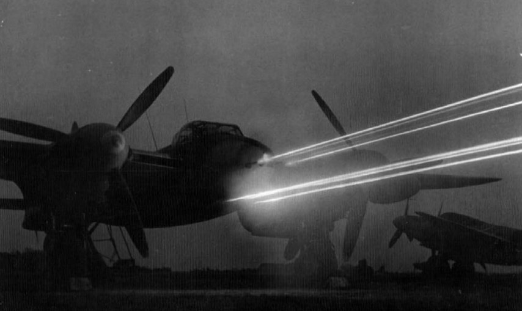
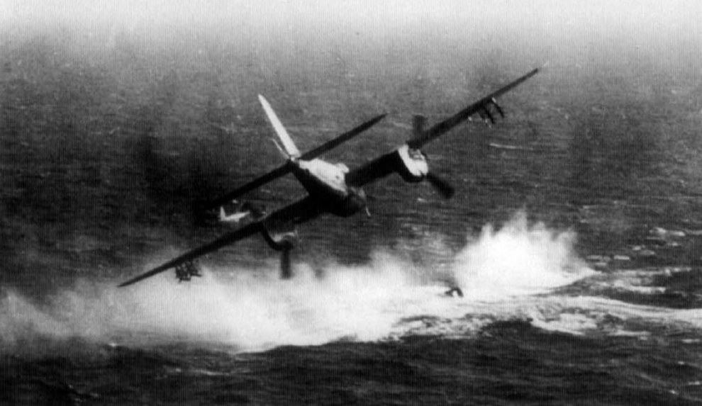
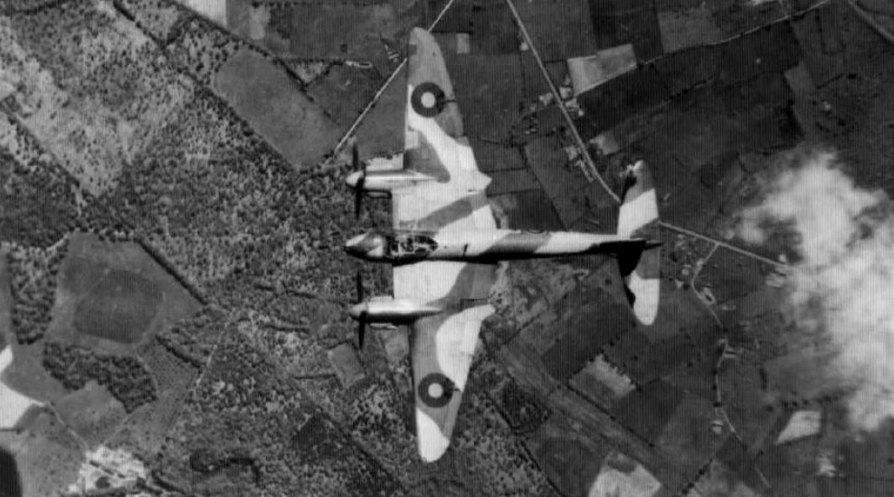

# История самолета

Одним из выдающихся самолетов периода Второй мировой войны является Де Хэвилленд
"Москито", воплотивший в себе идеи, являвшиеся полной противоположностью преобладавшим
в то время взглядам на концепцию бомбардировщика.

Министерство авиации Великобритании в предвоенные годы организовало развитие
бомбардировщиков таким образом, что каждый последующий требуемый тип должен был быть
тяжелее и лучше вооружен, чем предыдущий. Вне зависимости от специализации, требовались
всё большие бомбовая нагрузка, дальность, оборонительное вооружение и, как следствие,
увеличение экипажа.

Исходной предпосылкой для создания DH.98 послужила спецификация Р.13/36 от 24 августа
1936 года, выпущенная коммодором авиации Р. Х. Верни от имени Директората технического
развития ВВС Великобритании (DTD). Впоследствии она послужила толчком к появлению
серийных самолетов "Манчестер", "Ланкастер" и "Галифакс", и согласно которому требовалось
создать хорошо вооруженный цельнометаллический бомбардировщик.

Это задание декларировало “двухмоторный средний бомбардировщик для повсеместного
применения”, при этом уточняя, что “В ходе всех операций необходимо уменьшить время
пребывания над территорией противника до минимума. Таким образом, необходима наивысшая
возможная крейсерская скорость”.

Спецификация также призывала к использованию носового и хвостового оборонительного
вооружения, ярусной горизонтальной укладке бомбовой нагрузки, и пригодности к
обслуживанию как дома, так и за рубежом. В ней высказывалось мнение, что “вероятно, есть
возможность скомбинировать в одном базовом дизайне средний бомбардировщик, разведчик и
самолет общего назначения”, и предполагалась возможность нести две 18” торпеды.
Требовалась скорость 275 миль/час на высоте 15000 футов и радиус действия 3000 миль с
бомбовой загрузкой 4000 lb. Дополнительно следовало рассмотреть возможность применения
дистанционно управляемого пулеметно-пушечного вооружения.

Компания Джефри Де Хевилленда в середине 30-х годов не входила в список основных
поставщиков боевых самолетов британских ВВС, и, с учетом опыта 1920-х годов и осторожного
отношения к военным спецификациям, специализировалась на выпуске выполненных из дерева
легкомоторных самолетах и пассажирских машин для открытого рынка. Однако, когда угроза
начала войны стала казаться реальной, де Хэвилленд обратил свое внимание и на Р.13/36.
В то время авиалайнер DH.91 Albatross, изготовленный из дерева с усиленной обшивкой,
и легкий самолет DH.94 Moth Minor были новейшими проектами компании, впервые
совершившие полеты 20 мая и 22 июня 1937 года, соответственно.

В ходе эксплуатации Альбатроса де Хэвилленд отмечал, что концепция аэродинамической
чистоты обводов и минимализации площади поверхности обшивки эффективна для применения
для конструкций как истребителя, так и бомбардировщика, и, изначально, военная версия
Альбатроса была возможностью реализовать требования спецификации с минимальными
затратами.

Фирма полагала, что дополнительные мощности деревянного самолетостроения окажутся
не лишними в случае начала войны, когда потребность в самолетах увеличится,
а металлообрабатывающая промышленность будет перегружена заказами.
Деревянная конструкция, помимо всего прочего, позволяла быстрее построить прототип
и ускорить подготовку последующих модификаций.

К апрелю 1938 года появилась двухмоторная модификация "Альбатроса" с двигателями
"Мерлин", для сравнения с экземплярами укомплектованными двигателями Hercules HE 1M
и Sabre и, конечно же, она была цельнодеревянной.
7 июля 1938 года де Хэвилленд отправил письмо, в котором обсуждались технические
характеристики и аргументировалась идея постройки именно деревянного самолета, сэру
Уилфреду Фримену, своему старому другу по Первой мировой войне, ныне члену Воздушного
совета по исследованиям и разработкам. Де Хэвилленд отмечал, что, за исключением
скручивания, прочность дерева на вес была такой же, как у дюралюминия или стали. В письме
далее говорилось, что в случае возникновения войны без предупреждения, соответствующие
запасы подходящей древесины и квалифицированная рабочая сила в виде рабочей силы из
мебельной, вагоностроительной и других отраслей деревообработки помогут быстро ввести
новый самолет в строй. Также Де Хэвилленд подчеркивал, что согласно спецификации P.13/36
будет создан посредственный самолет, и предложил другой подход.
Во втором письме от 27 июля Де Хэвилленд еще больше отдалился от первоначальной
концепции, когда был сделан вывод, что требования спецификации не могут быть реализованы
даже двумя двигателями “Мерлин” - если первостепенное значение имела скорость, то можно
было нести только половину требуемой бомбовой нагрузки, если же первостепенное значение
отдавалось нагрузке, в результате получался бы более крупный и медленный самолет.
К 11 августа был разработан компромиссный проект с двумя двигателями “Мерлин”, бомбовой
нагрузкой 4000 фунтов, максимальной скоростью 260 миль в час и дальностью полета 1500
миль. Однако было сочтено, что продолжение этой работы было бы признанием поражения
в принципах дизайна, и компания отказалась от этой идеи.
Мюнхенский кризис сентября 1938 года обострил ход подготовки к боевым действиям и
Де Хэвилленд начал рассматривать проект нового, меньшего по размерам самолета.
Предлагался маленький, двухмоторный, с экипажем из двух человек, бомбардировщик с
высокими летными характеристиками, настолько быстрый, что не нуждался в каком-либо
оборонительном вооружении.

Новый бомбардировщик DH.98 с двумя двигателями "Мерлин" должен был получить следующие
характеристики: максимальная скорость - 652 км/ч, крейсерская - 515 км/ч (на высоте 6100 м);
самолет сможет нести бомбовую нагрузку в 454 кг на расстояние в 2414 км. В качестве
бомбардировщика DH.98 не должен был нести оборонительное вооружение, но вместо бомб
на самолете могло устанавливаться наступательное стрелковое оружие для применения
в качестве потенциального дальнего истребителя сопровождения.
Проект Де Хевилленда был далек от простой замены металла деревом. Самолет должен был
быть дешевле и менее трудоемок, чем какой-либо их средних бомбардировщиков того времени,
и ему не были нужны стратегические материалы. Формирование экипажей всего из двух
человек обещало уменьшить расходы на обучение и содержание личного состава ВВС.
С учетом более высокой скорости полета, новый самолет за месяц мог бы доставить к цели
большую бомбовую нагрузку, чем большие тихоходные машины.
В своей основе проект был подготовлен уже к октябрю 1938 года. Де Хэвилленд и К.С. Уокер
отправились в министерство авиации в начале октября, чтобы сделать это предложение. Они
снова выступили за постройку самолета из дерева, рассчитывая сэкономить год на стадии
прототипа, а также сэкономить время на производстве самолетов и разработке последующих
вариантов.

Однако, хорошо вооруженные бомбардировщики металлической конструкции, Бленхейм, Уитли,
Веллингтон и Хэпден, к настоящему времени уже находились в производстве, и вполне имели
тенденцию к созданию более крупных четырехмоторных машин. В таких условиях предложение
де Хэвилленда было бесцеремонно отклонено - Министерство авиации совершенно
не интересовалось концепцией безоружного бомбардировщика с архаичной деревянной
конструкцией.

Однако уже в конце 1939 года, после начала войны, министерство стало более восприимчивым,
но все еще скептически относилось к безоружному бомбардировщику, и вернулось к этому
проекту.

12 ноября маршал авиации Фриман поручил де Хэвилленду создать быстрый самолет,
оснащенный двигателями “Мерлин”, с вариантами использования более мощных двигателей
Rolls-Royce Griffon и Napier Sabre. Были снижены требования к оборонительному вооружению
и повышены требования к машине, предусматривающие создание высокоскоростного легкого
разведывательного бомбардировщика, способного 400 миль/ч - 645 км/ч на высоте 18000
футов.

К ноябрю 1939 года уже были проработаны три варианта базового проекта: бомбардировщик,
истребитель и разведчик. В конструкции под полом кабины было зарезервировано
пространство для установки четырех 20-мм пушек.
1 января 1940 года был заказан прототип DH.98. Специализация машины не была жестко
определена, но заказ формировался заданием как на бомбардировщик. Была предусмотрена
и возможность проведения разведки, интереса к истребителю в министерстве не проявили.
Из-за огромной потребности в металлах для авиастроения и опасений в срыве их поставок из-
за военных действий, чиновники министерства вспомнили проекте о DH.98, лишенном изъянов,
связанных с нехваткой металла, и самолет оказался настолько востребованным, что к моменту
подписания заказа на прототип DH.98, уже было решено закупить партию из 50
бомбардировщиков-разведчиков в соответствии с заданием В.1/40.
Этот заказ и получили в Хэтфилде 1 марта 1940 года. Самолет, как и планировалось с самого
начала, должен был быть цельнодеревянным. Моноблочное крыло должно было вмещать
10 топливных баков. Фюзеляж собирался из двух половин, соединявшихся по продольной оси,
что облегчало установку оборудования и проводку магистралей до их скрепления. Обшивка
большей частью была из березовой фанеры.

В мае 1940 года была выпущена спецификация F.21/40, предусматривающая истребитель
дальнего радиуса действия, с четырьмя 20-мм пушками и четырьмя пулеметами 0,303”
в носовой части, после чего фирма де Хэвилленда была уполномочена построить прототип
истребителя DH.98.

К июню 1940 года DH.98 получил наименование “Москито”. Наличие истребительного варианта
концепции подкрепляло этот проект, так как в правительстве и министерстве авиации
сомневались в полезности невооруженного бомбардировщика даже после демонстрации его
возможностей.

Изготовление партии DH.98 заняло большую часть 1940 года. Весной и летом 1940 года акцент
делали на выпуске пяти типов самолетов, которые могли бы быстро и эффективно усилить
британские ВВС. В июле 1940 года был дополнительно заказан прототип варианта DH.98
в истребительной модификации, для переоборудования под него был выделен один из
серийных самолетов. Оставшаяся серия по-прежнему готовилась как бомбардировщики-
разведчики.

В январе 1941 года заказ был в очередной раз изменен, в него включили третий прототип
разведчика, и оставшаяся серия теперь состояла из 19 разведчиков, 28 истребителей,
бомбардировщики в ней уже не числились.

Впоследствии ситуация продолжала меняться, новые заказы накладывались в дополнение
к старым. Фактически же в первую серию из 50 самолетов вошли три прототипа с разными
функциями, 10 бомбардировщиков, 28 истребителей и 9 разведчиков.
Они и стали «первыми ласточками» из 7781 "Москито", построенных в Англии, Канаде и
Австралии.

Первый прототип DH.98 поднялся в небо 25 ноября 1940 года. Хотя с момента начала
проектирования прошло меньше года, результаты уже первого полета показали
оптимистические результаты. С двигателями Rolls-Royce “Merlin” 21 по 1480 л.с. от каждого
этот самолёт смог развить скорость 640 км/ч, и это определило его начальный успех.

Можно считать, что именно с этого момента и началась длинная история De Havilland Mosquito
DH.98, завершившаяся лишь во второй половине 1950-х годов.
19 февраля 1941 года прототип передали в испытательный центр ААЕЕ. Там он показал
отличную управляемость и в воздухе, и на земле. При весе 7612 кг скорость "Москито"
определялась в 624 км/ч на высоте в 707 м.

Скорость нового самолета была просто превосходной, что в итоге сделало будущую программу
его производства секретной. Впоследствии, уже к концу 1942 года, на той же машине после
установки сначала моторов “Мерлин” 61 с двухступенчатым двухскоростным нагнетателем,
а затем “Мерлин” 77, и увеличения размаха крыла, были получены значительно более высокие
скорости. В таком виде W4050 развил скорость 703 км/ч в горизонтальном полете и достиг
высоты 11521м.

Завершившиеся в феврале 1941 года испытания окончательно убедили чиновников
Министерства авиации, что “Mosquito” вполне может заменить собой более ранние средние
и легкие бомбардировщики. Продемонстрированные высокие летные качества прототипа
позволили сделать вывод о возможности применения машины и в качестве ночного
истребителя.

Концепция истребительно-бомбардировочного варианта "Москито" была впервые озвучена
11 июля 1941 г. Конструкторы "Де Хевилленд" сначала планировали вооружить
бомбардировочную модификацию четырьмя пушками, но позже эту мысль развили до
разработки многоцелевой машины на базе истребителя с новым усиленным крылом.

В феврале 1942 г. от выполнения вариантов ночного истребителя и дальнего истребителя
сопровождения отказались, и остался только FB.VI - "рафинированный" истребитель-
бомбардировщик. Опытный самолет c заводским номером DZ434, созданный на базе
претерпевшего серьезные изменения серийного В.IV, поступил для испытаний в Боскомб Даун.

С учетом особенностей боевого применения "интрудеров" на нем установили более мощные,
но менее высотные моторы "Мерлин" 25 с взлетной мощностью по 1620 л.с.
Первый полет эта машина, ставшая прототипом истребителя-бомбардировщика "Москито"
FB.VI, совершила 1 июня 1942 г., однако спустя месяц машина потерпела аварию из-за отказа
одного из двигателей, при разбеге самолет столкнулся с двумя другими. Это происшествие
задержало завершение испытаний до октября, однако ввод модификации в серию
задерживался и по причине необходимости разработки нового, так называемого базового или
универсального, усиленного крыла, с узлами подвески дополнительных бензобаков, бомб
и реактивных снарядов, по этой причине в серию FB.VI пошел только в феврале 1943 г.
На этой модели "Москито" внедрена усиленная конструкция крыла, позволившая нести
на подкрыльевых пилонах две 110-кг или 230-кг бомбы, или два 450-литровых подвесных бака
для горючего, или восемь 27-кг ракет. Ещё две бомбы по 110 кг или 230 кг размещались
в бомбовом отсеке. Стрелковое вооружение включало четыре 20-мм авиапушки “Испано-сюиза
HS.404” под полом кабины и четыре пулемёта “Браунинг” калибра 0.303” в носовой части.

Самолеты FB.VI ранних серий имели нормальную взлетную массу 9000 кг и оборудовались
двигателями Мерлин 21, 23, реже - дефицитными в тот период Мерлин 25. При боевой
нагрузке из четырех 113 кг бомб - две в бомбовом отсеке и две под крылом, боекомплектом
по 150 снарядов на пушку и по 500 патронов на пулемет, с 1825 л топлива в баках самолет
имел боевой радиус в 1950 км. На бреющем полете "Москито" с двигателями Мерлин 25
выдавал максимальную скорость 541 км/ч, на высоте 1550 м разгонялся до 577 км/ч, а на
второй границе высотности в 3960 м – уже до 608 км/ч.

С февраля 1943 г. в британских ВВС стала внедряться концепция "рейнджеров". Конструктивно
"Москито"-"рейнджеры" не отличались от "интрудеров", но тактика их боевого применения
была другая: "интрудеры" в ночное время находились в постоянной готовности и совершали
вылеты только в случае реального или ожидаемого повышения активности люфтваффе,
"рейнджеры" же работали по собственным задачам. Первые постоянно координировались
с земли, вторые вели свободную охоту и соблюдали радиомолчание во избежание
обнаружения. "Рейнджеры" акцентировались на изнурении вражеского ПВО, их основу
составляли шестерки от каждой из 6 выделенных эскадрилий истребителей-бомбардировщиков
"Москито", еще 4 подразделения "Бьюфайтеров" добавили по 3 специально оборудованные
машины.

Поступивший в войска зимой 1943 г. истребительно-бомбардировочный вариант "Москито"
FB.VI очень хорошо подходил для применения в роли "рейнджера". Увеличенный радиус
действия, четыре бомбы и полный комплект стрелково-пушечного вооружения сделали его
весьма эффективным средством для нанесения “кинжальных” ударов. Первой в Королевских
ВВС получила FB.VI на вооружение 418-я эскадрилья "рейнджеров".
Боестолкновения с немецкими ВВС разворачивались не только над сушей. Самолеты
из эскадрилий "Москито"-"рейнджеров" привлекали к борьбе с дальними истребителями
сопровождения немцев, прикрывавшими морские конвои. В ходе операции "Инстеп" 11 июля
1943 г. пять бортов из 25-й и 456-й эскадрилий встретились над Бискайским заливом с пятью
Ju-88.

В ходе боя один “Юнкерс” был сбит, еще три получили повреждения. Позднее немцам удалось
взять реванш: восемь FW-190 сбили четыре "Москито" и одному FB.VI удалось вернуться
на свой аэродром, несмотря на полученные повреждения.

В августе 1943 года истребителями-бомбардировщиками начали комплектовать 2-ю группу 2-х
Тактических ВВС в составе 21, 464 (австралийской) и 487-я (новозеландской) эскадрилий,
объединенных в 140-е крыло. Единственными "Москито", бомбившими немцев днем, с октября
1943 г. по ноябрь 1944 г. были именно самолеты этих частей. Они специализировались
на уничтожении как отдельных строений, так и железнодорожных депо, транспортных
средств на дорогах, пусковых установок и складов "Фау-1" и "Фау-2".

В октябре того же года в составе 2-й группы было начато формирование 138-го крыла,
в которое составили 613, 305 польская и 107-я эскадрильи истребителей-бомбардировщиков.
К вылетам подразделение было готово только к февралю 1944 г. и тогда же "Москито" из 140-
го крыла провели операцию, прочно вошедшую в историю Королевских ВВС.

Для выполнения операции под кодовым названием "Иерихон" отобрали по шесть "Москито"
из каждой эскадрильи 140-го крыла, "киносъемочный" DZ414 и двенадцать "Тайфунов" из 198-й
эскадрильи для сопровождения. Авианалет позволил освободить 258 из почти 700
заключенных тюрьмы в Амьене. С точки зрения рациональности результаты налета не были
абсолютно безупречными: более ста находившихся в заключении французов погибли под
взрывам бомб и пулеметным огнем охраны, также пострадало и гражданское население за
пределами тюрьмы. Но другой аспект был важнее - руководители Сопротивления отмечали,
что удар по амьенской тюрьме, ставший одним из примеров самопожертвования британских
экипажей ради спасения жизней французов, произвел огромный моральный эффект. Один
из участников вылета утверждал: "Это была операция такого сорта, которая создает
ощущение: если бы ты ничего больше не сделал в ходе войны, и тогда этого было
бы достаточно".

До момента высадки войск союзников во Франции задачи "рейнджеров" и истребителей-
бомбардировщиков из 2-й группы отличались минимально. Основными целями 138-го и 140-го
крыльев были мосты, заводы, здания штабов войск СС и гестапо, командные пункты, Боевая
работа 140-го крыла в цифрах выглядит так: с 3 октября 1943 г. по 26 мая 1944 г. совершено
более 1600 вылетов, нанесено 155 групповых ударов, потеряно 36 машин, 21 "Москито" FB.VI
списан из-за полученных боевых повреждений.

4 июня на камуфляж самолетов 2-х Тактических ВВС нанесли "полосы вторжения". В ночь на
6 июня эскадрильи выполнили 113 вылетов, акцентируя удары в основном на коммуникациях
противника, и потеряв только одну машину. На следующую ночь работа шла еще интенсивнее -
196 боевых вылетов. Истребители-бомбардировщики летали много и эффективно - за 72 дня
после высадки в Нормандии самолеты 140-го крыла совершили 2319 вылетов - в среднем
по 32 вылета ежесуточно. Только за одну ночь 1 сентября 1944 г. атаковали 23 поезда
и 300 вагонов, более 300 автомобилей на дорогах, и 20 речных судов и барж на реках
и водоемах Франции, Бельгии и Германии. Не обошлось без потерь – с июля по сентябрь
не вернулись с боевых заданий 32 самолета и 11 получили критические повреждения.
Для осуществления непосредственной поддержки наступающих войск союзников
планировалось в наикратчайшие сроки перебазировать все шесть истребительно-
бомбардировочных эскадрилий на территорию Франции. Однако первые машины 2-х
Тактических ВВС удалось переправить на континент только 20 ноября.
Осенью 1944 г. широкую огласку получил налет двадцати четырех "Москито" из 140-го крыла
в Ютландии, на штаб-квартиру гестапо, в которой хранились тысячи дел на патриотов,
подозреваемых и находившихся в розыске. Как и в операции “Иерихон”, экипажи тщательно
отработали выполнение задания на макете. Бомбометание выполнялось с бреющего полета,
из-за чего некоторые машины получали повреждения от разлетающихся осколков. Это привело
к вынужденной посадке одного из экипажей в Швеции.

Плохая погода во время новогоднего контрнаступления фон Рундштедта не позволила
"Москито" проявить себя в полной мере. Большая часть боевых вылетов совершалась в ночное
время, что делало поиск малоразмерных объектов почти невозможным. Позднее их удары
по железным и автомобильным дорогам значительно затруднили германским войскам
переброску на восток.

22 февраля 1945 г. с участием истребителей-бомбардировщиков состоялась операция
"Кларион" — это был массированный удар по коммуникациям, заводам и важнейшим узлам
сопротивления немцев в дневное время. Вопреки распространенному мнению о том, что в 1945
г. немецкая авиация утратила силу, именно в период февраль - апрель 1945 г. потери
"Москито" оказались самыми тяжелыми. Зенитная артиллерия немцев, сконцентрированная
на территории рейха, сумела записать на свой счет подавляющее большинство сбитых
самолетов в этот период.

Трудным этот период был и для Берегового командования, и подразделений "рейнджеров".
4 мая истребители-бомбардировщики "Москито" выполнили закончили войну и боевых вылетов
уже не совершали.

После окончания боевых действий эскадрильи 2-й группы вошли в состав британских
оккупационных ВВС в Германии, также их части разместились на территории Бельгии
и Голландии.

Дольше всех, до сентября 1949 г., "Москито" FB.VI оставались на вооружении 107-й
эскадрильи.

В общей сложности было построено 7781 “Mosquito” в 48 модификациях. Из этого количества
фирма de Havilland Canada в Торонто собрала 1076 машин, а австралийская фирма de Havilland
of Australian в 1943-1945 гг. выпустила 212 машин. Последними в 1961 году сняли с вооружения
буксировщики мишеней модели ТТ.Мк.35.

Самолётов модификации FB.VI было построено 2298 – больше трети от общего числа DH.98,
из них 1066 на заводе Standard Motor Company и 56 на заводе Airspeed Ltd.
