# Конструкция самолета

## Описание

De Havilland 98 Mosquito FB. VI представляет собой моноплан со среднерасположенным крылом,
построенный, в основном, из дерева, с двумя двигателями Merlin 25 и трехлопастными винтами
с гидроприводом. Он спроектирован и оборудован для выполнения задач типа “Intruder”,
дневного истребителя дальнего действия и истребителя сопровождения большой дальности.

Экипаж состоит из двух человек, пилота и наблюдателя. Экипаж размещается рядом, пилот
находится по левому борту. Спинки сидений экипажа изготовлены из бронированного листа,
перед кабиной позади приборной панели расположена перегородка из бронированного листа,
а переднее ветровое стекло - пуленепробиваемое многослойное. Переплет фонаря кабины
изготовлен из сварной трубчатой стали, за исключением переднего ветрового стекла
полностью покрыт плексигласом. Фонарь кабины оборудован люком запасного выхода
на крыше и блистером над пилотом для обеспечения обзора вверх и вперед. Сдвижные
боковые форточки дают прямой обзор для подхода и посадки.

Фюзеляж овального сечения, состоит из двух половин, соединяющихся вдоль верхней
и нижней кромок. Сконструирован из панелей бальсового дерева, собранных между
фанерными листами, которые образуют монокок с деревянными переборками.
Вход и выход экипажа осуществляется через дверь в правом борту, которая может быть
сброшена в случае чрезвычайной ситуации. Люк за крылом по правому борту обеспечивает
доступ к отсекам в задней части фюзеляжа, где располагается наземное оборудование,
аварийные пайки, аккумуляторы, баллоны с кислородом, гидравлический резервуар,
оборудование для пустыни и прочее.

Крыло представляет собой цельную консольную конструкцию, состоящую из двух деревянных
коробчатых лонжеронов во весь размах крыла, с покрытием из фанерной обшивки, усиленным
продольными стрингерами. Внутри крыла расположены десять протектированных топливных
баков, доступ к ним осуществляется через съемные панели обшивки в нижней части крыла.

Щитки с гидравлическим приводом, изготовлены из фанеры, элероны - с металлической
обшивкой. Крыло крепится к фюзеляжу четырьмя основными болтами и дополнительными
болтами, проходящими через фланцы внутренних ребер.

Стабилизатор и киль представляют собой консольные цельные деревянные конструкции,
состоящие из двух коробчатых лонжеронов и фанерной обшивки. Рули высоты и руль
направления выполнены из алклада, обшивка руля высоты металлическая, руля направления -
тканевая. Триммеры и балансиры установлены на всех поверхностях управления, кроме
элерона правого борта, триммер которого действует только как балансир.

Шасси состоит из двух полностью взаимозаменяемых одиночных колесных блоков, по одному
под каждой гондолой двигателя, и выдвижного хвостового колеса. Приводы всех колес
гидравлические. Опоры амортизатора выполнены из прессованной резины. Два
пневматических тормоза Dunlop установлены на каждом колесе ходовой части. Самолет
оборудован индикаторами, устройствами предупреждения и аварийного выпуска шасси.

Двигатели Merlin монтируются на стальных трубчатых рамах, прикрепленных к переднему
лонжерону и несущей конструкции шасси. Радиаторы масла и охлаждающей жидкости для
каждого двигателя встроены в переднюю кромку крыла между гондолой двигателя
и фюзеляжем. Температура охлаждающей жидкости регулируется электропневматически,
управляемыми заслонками в выходах воздуховодов радиаторов.

В каждой колесной нише шасси расположен протектированный масляный бак.
На каждом двигателе установлен гидравлический насос для управления приводами,
закрылками и бомболюком, и вакуумный насос, приводящий гироскопические инструменты,
правый насос обеспечивает создания давления в топливных баках. От левого двигателя
приводится компрессор Heywood, управляющий вооружением, тормозами, заслонками
охлаждения радиатора, приводом двухскоростного нагнетателя и системой управления
воздухозаборниками. Самолет оборудован электрическими стартерами и бустерными
катушками. В каждой гондоле двигателя установлены автоматические огнетушители Graviner,
которыми также можно управлять вручную из кабины.

Питание бортовой электросети обеспечивается генератором 24 Вольт мощностью 1500 Вт,
который приводится от правого двигателя. От левого двигателя приводится генератор
переменного тока для работы специального радиооборудования. Радиостанция установлена
в задней части фюзеляжа с левой стороны, управляется с места пилота дистанционно.
Самолет оборудован системой связи между пилотом и наблюдателем. A.R.I.5083 установлена
на переднем лонжероне за сиденьем пилота.

Вооружение состоит из четырех пушек калибра 20мм в нижней части фюзеляжа, четырех
пулеметов 0,303 дюйма, и кинофотопулемета в носовой части. 20-мм пушки управляются
гашеткой, а пулеметы 0.303 дюйма - нажимным переключателем на ручке управления
самолетом, главный выключатель вооружения расположен на приборной панели правого
борта. Фотокинопулемет приводится в действие, либо в ходе стрельбы пушек или пулеметов,
либо, для практических стрельб, независимо от вооружения, с помощью нажимного
переключателя рядом с переключателем стрельбы из пулеметов на верхней части ручки
управления самолетом. Управление всем вооружением электропневматическое. Обогрев
вооружения управляется из кабины. Дополнительное оборудование включает в себя
электрический стеклоочиститель и антиобледенительный спрей, кислородный аппарат,
надувную лодку и пиротехнические припасы.

Две 250-фунтовые или две 500-фунтовые бомбы или, альтернативно, два небольших
контейнера для бомб находятся в задней части 20-мм. оружейный отсек; одна 250-фунтовая
или 500-фунтовая бомба также находится под каждым крылом. Вместо бомб крыльев могут
перевозиться два крылатых сбрасывающих резервуара, или, в качестве дополнительной
альтернативы, когда не предусмотрены ни крыловые бомбы, ни сбрасывающие резервуары
крыла, предусмотрена возможность переноса реактивных снарядов под каждым крылом. Блоки
реактивных снарядов могут перевозиться в качестве груза в дополнение к бомбам в
фюзеляже.

Массогабаритные характеристики DH FB Mk.VI:

- Размах крыла - 10,5 м.
- Площадь крыла - 18,3 м2.
- Длина самолета - 8,95 м.
- Высота самолета - 3,95 м.
- Вес пустого - 3490 кг.
- Взлетный вес - 4909 кг.

## Фюзеляж

Фюзеляж DH FB Mk.VI – деревянный, овального сечения, состоит из двух половин,
соединяющихся вдоль верхней и нижней кромок. Сконструирован из панелей бальсового
дерева, собранных между фанерными листами, в носовой части - из ели, остальные –
из березы, образующих монокок с переборками. Овальные секции имеют слегка коническое
сужение, с вырезами для монтажа кабины и крыла.

Все отверстия и вырезы отделаны еловыми элементами, встроенными между слоями фанеры.
Внешняя обшивка фюзеляжа тканевая, из мадаполама.

На правом борту смонтирована дверь в кабину, которая при необходимости может быть
сброшена.

Доступ к задней части фюзеляжа обеспечивается дверкой, расположенной за крылом
на правом борту фюзеляжа.

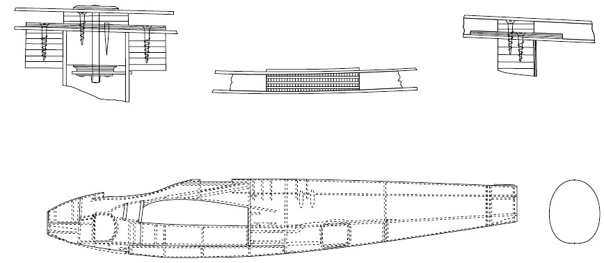

## Фонарь

Фонарь кабины представляет собой сварную конструкцию из стальных труб, крепится
к фюзеляжу болтовыми соединениями, полностью покрытую плексигласом, за исключением
лобового стекла, которое является пуленепробиваемым.

Фонарь оборудован сдвижными боковыми панелями и люком аварийного выхода на крыше.

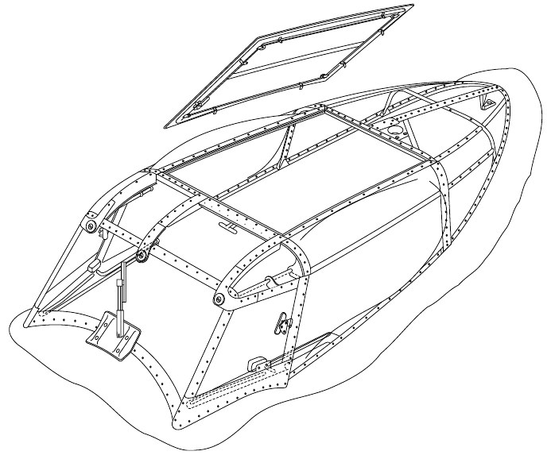

## Бронирование

Носовой отсек, в котором установлены пулеметы Браунинг .303 отделен от кабины
бронированной переборкой.

Спинки кресел пилота и наблюдателя выполнены из бронеплит.

## Крыло

Крыло DH FB Mk.VI представляет собой цельную консольную конструкцию, состоящую из двух
деревянных коробчатых лонжеронов, с покрытием из фанерной обшивки, усиленным
продольными стрингерами.

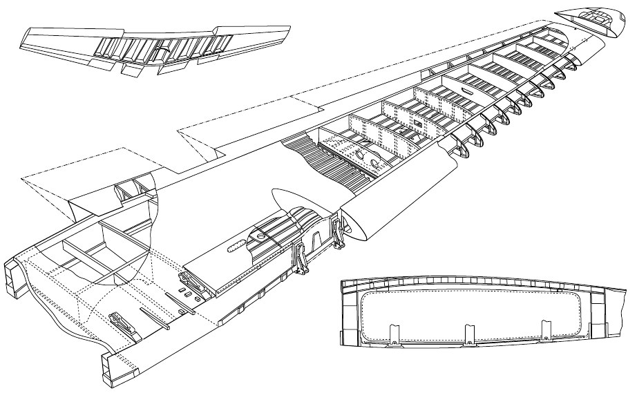

Крыло монтируется к фюзеляжу на четыре основных точках крепления, две под задним
лонжероном и две на верхней поверхности около переднего лонжерона.

На крыле установлены крепления для двигателей и шасси.

Внутри крыла размещены десять топливных баков, установленных попарно.

Навигационные огни установлены на отсоединяемых законцовках крыла, защищены
плексигласовыми обтекателями.

Передние кромки крыла между фюзеляжем и мотогондолами выполнены из алюминиевого
сплава и образуют воздухозаборники для радиаторов, размещенных внутри крыла. Внешние
передние кромки деревянные с обшивкой из прессованной фанеры.

Щитки размещены на задней кромке, между мотогондолами и фюзеляжем.

В крыле также размещаются посадочные фары, проходят кабели электро- и шланги пневмо-
и гидросистем, и тросы системы управления полетом.

## Система управления полетом

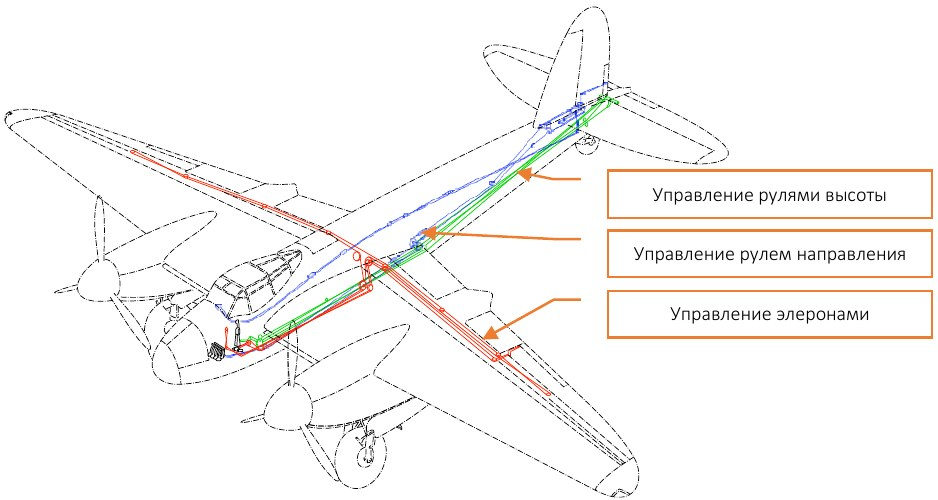

DH FB Mk.VI имеет традиционную схему управления, включающую киль и стабилизатор, руль
направления, рули высоты, элероны и щитки. Хвостовое оперение деревянное, за исключением
металлических триммеров.

Триммеры установлены на всех поверхностях управления, кроме элерона правого борта,
который действует только как балансир.

Вертикальное оперение состоит из киля и руля направления. В полете положение киля
и стабилизатора не меняется.

Киль – консольный цельнодеревянный, состоит из двух коробчатых лонжеронов и фанерной
обшивки, крепится лонжеронами к переборкам 6 и 7 хвостовой секции фюзеляжа, по два болта
на лонжерон, внутри размещен блок хвостового колеса.
На киле размещен приемник воздушного давления трубки Пито.

Руль направления выполнен из алклада, с тканевой обшивкой, и подвижно крепится на киле.
Оснащен триммером и компенсатором массы. Отклоняется вправо 26°, влево 26, +2°, -1°. Ход
триммера руля направления вправо 16°±2 ½°, влево 16°±2 ½°.

Горизонтальное оперение – симметричное, трапециевидной формы со скругленными
законцовками.

Стабилизатор, как и киль, представляет собой симметричную консольную цельную деревянную
конструкцию, из двух коробчатых лонжеронов и фанерной обшивки. Передний лонжерон
крепится в трех точках к задней переборке фюзеляжа, задний лонжерон крепится в двух
точках к регулируемым трубам, которые в свою очередь также пристыкованы к задней
переборке. Угол установки стабилизатора регулируется настроечными трубами на земле.

Рули высоты, как и руль направления, выполнены из алклада, обшивка руля высоты
металлическая. Снабжены компенсатором массы. Левый и правый рули жестко соединены.
Отклоняются вниз 12 ½°, вверх 21 ½°, +2°, -1°. Триммер руля высоты имеет ход вниз 7 ½°±
¼°, вверх 7 ½° ± ¼°

Элероны - с металлической обшивкой, взаимозаменяемые. Отклоняются в пределах от 11 ½°
вниз и 26 ½ ° ± ½° вверх

Щитки раздельные, с гидравлическим приводом, изготовлены из фанеры. Управление
положением щитков осуществляется рычагом на передней панели кабины. Стандартное
взлетное положение щитков - отклонены вниз на 15°; посадочное положение - полностью
отклонены вниз на 45°±2°.

Ручка управления перемещается вперед и назад для обычного управления рулями высоты.

Ручка управления также перемещается в стороны для управления элеронами.
Педали руля направления регулируются по выносу для удобства пилота.

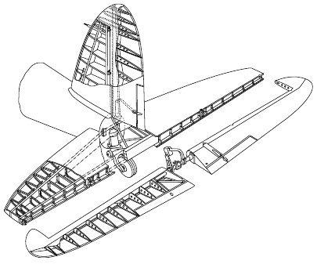

Углы отклонения управляющих поверхностей:

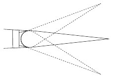

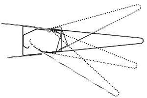

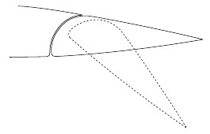

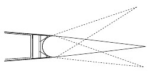

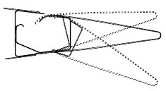

## Шасси

Шасси состоит из двух основных убирающихся одноколесных стоек, размещенных под
мотогондолами; каждая стойка имеет два амортизатора, расположенных по разные стороны
колеса, с поперечными распорками между ними, двумя шарнирными стержнями,
гидравлическим приводом, осью, колесом и блоком тормозов.

Основные стойки шасси убираются внутрь мотогондол, ниши закрываются створками
обтекателей полностью.

Хвостовое колесо полностью убираемое. Блок амортизатора крепится к задней переборке
фюзеляжа. Ось вилки на вращающихся креплениях крепится к блоку амортизатора, который
при посадке принимает на себя нагрузку. Подпружиненный самоцентрирующийся кулачок
обеспечивает центральное положение колеса в полете, а в выпущенном состоянии позволяет
свободно поворачиваться при рулении.

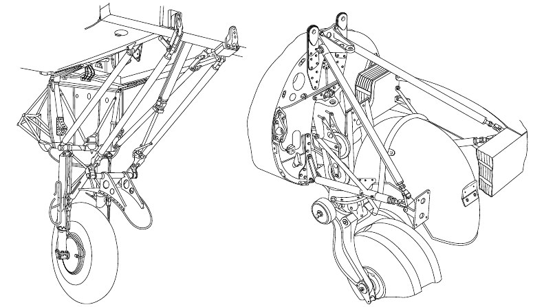

Колея основных стоек 16 футов 4 дюйма, амортизаторы резиновые под давлением (типа D.H.)

Колеса основных стоек:

- Тип: Dunlop 10\*16 AH 8079
- Шины: Dunlop 15\*16 IG.11 Dunlop 1. GT. R-11

Блок хвостового колеса:

- Амортизатор: Резиновый под давлением (типа D.H.)

Колесо хвостовой стойки:

- Тип: Dunlop 5 in. AH.10. 191
- Шина: Dunlop, Marstrand

Тормоза колес основных стоек шасси пневматические, типа Dunlop Pneumatic.

Торможение управляется педалями руля направления и рычагом тормоза на РУС.

## Двигатель

Самолет оснащен двумя двигателями Rolls-Royce Merlin 25.

Двигатель 12-цилиндровый, V-образный, с жидкостным охлаждением. Степень сжатия 6:1.
Сухой вес составляет 1430 фунтов - 687 кг.

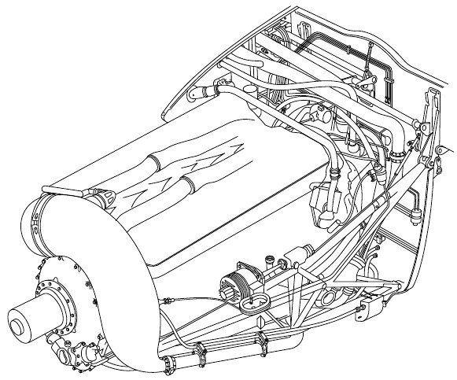

Карбюратор Merlin типа SU с двумя дросселями и восходящей тягой, является, за исключением
отдельного блока управления наддувом, полностью автономным и выполнен с возможностью
полностью автоматического функционирования, в результате чего ответственность пилота
сводится к минимуму, и уменьшается опасность повреждения двигателя в результате
неправильного управления.

Коробка приводов крепится позади картера и несет на себе магнето, насос охлаждающей
жидкости, привод генератора, электрический поворотный механизм и блок топливного насоса.

В нем находится пружинный привод и определенные валы, через которые приводятся в
действие магнето, распределительные валы, электрический генератор, топливный, масляный
и охлаждающий насосы.

Система зажигания состоит из двух магнето, которые расположены на коробке, один слева
и один справа. К ним прикреплены высоковольтные жгуты проводов для свечей зажигания,
которые имеют металлический экран, служащий двойной цели – он действует как коллектор
для индуцированного поля вокруг высоковольтных проводов, возвращает результирующий
электрический ток на землю, и предотвращет радиопомехи.

В каждом цилиндре две свечи зажигания: одно магнето обеспечивает искру для свечей на
стороне впуска, а другая - для свечей на стороне выпуска, что гарантирует работоспособность
двигателя в случае выхода из строя одного из магнето.

Управление газом, смесью и пропеллером выплнятеся из кабины.

Самолет комплектуется трехлопастными пропеллерами de Havilland, полностью
флюгирующимися, с гидроавтоматическим управлением тип 5000. В штатной ситуации
управляются рычагами регулировки скорости. Нормальный диапазон углов 35°,
дополнительный диапазон для флюгирования 45°.

Двухскоростной одноступенчатый нагнетатель с жидкостным охлаждением, высокоскоростного
центробежного типа, представляет собой полузакрытое рабочее колесо, приводимое
от заднего конца коленвала через двухскоростной редуктор. Переключение скоростей
нагнетателя регулируется автоматически электро-пневматическими приводами и анероидным
переключателем, который срабатывает на 15000 футов в режиме AUTO.

Перевод управления нагнетателями в режим MOD отключит цепь анероидного переключателя.

На левом двигателе устанавливаются:

- Компрессор Heywood, тип SH6/2
- Регулятор пропеллера, тип A.Y.105
- Генератор тахометра, тип Mk. IV A.C.
- Гидравлический насос Lockheed, Mk.IV
- Генератор A.C., тип U, 80В, 500Вт

На правом двигателе устанавливаются:

- Регулятор пропеллера, тип A.Y.105
- Генератор тахометра, тип Mk. IV A.C.
- Гидравлический насос Lockheed, Mk.IV
- Электрогенератор 24В, 1500Вт, тип KX

## Топливная система

На самолете устанавливаются пять пар алюминиевых протектированных топливных баков
общей вместимостью 453 галлона.

На самолет также могут подвешиваться подкрыльевые, металлические или деревянные,
емкостью 40 или 50 галлонов соответственно, сбрасываемые баки, топливо из них
перекачивается в полете во внешние крыльевые баки давлением от вакуумного насоса.

Бак для выполнения длительного полета емкостью 63 галлона может быть установлен в отсеке
20мм пушек, топливо из него перекачивается погружным насосом.

Блок топливного насоса, установленный на обшивке со стороны левого борта колесной ниши,
состоит из двух отдельных насосов, работающих параллельно. Каждый насос может работать
независимо от другого, и каждый из них обладает достаточной производительностью для
подачи большего, чем требуется, максимального количества топлива.

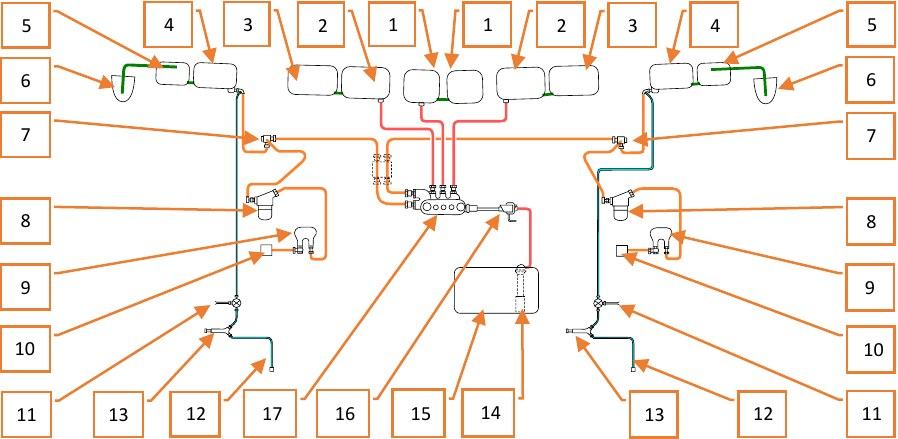

1. Бак на 25 галлонов
2. Бак на 78 галлонов
3. Бак на 65 галлонов
4. Бак на 34 галлона
5. Бак на 24 галлона
6. Подкрыльевой сбрасываемый бак
7. Четырехпозиционный кран
8. Топливный фильтр
9. Насос
10. Карбюратор
11. Заливочный кран
12. Подключение к нагнетателю
13. Заливочный насос
14. Погружной насос бака для дальних вылетов
15. Бак на 63 галлона для дальних вылетов
16. Блок предупреждения и кран понижения давления
17. Заправочные горловины

Предварительная заливка топлива выполняется Ki-gass насосами, расположенными в каждой
мотогондоле, доступ к насосам осуществляется снаружи, через лючок справа. Топливо для
предварительной заливки поступает из внешних баков. Дополнительно для предварительной
заливки можно использовать внешние топливные емкости, подключив их к имеющимся
горловинам

## Система смазки

Маслобаки по 15 галлонов расположены по одному в каждой мотогондоле.

В системе смазки двигателя четыре масляных контура: главный напорный контур; контур
подачи низкого давления; контур продувки переднего поддона; контур продувки заднего
поддона. Главный и нижний контуры обслуживаются одним нагнетательным насосом
и соответствующими предохранительными клапанами, в то время как каждый контур
продувки обслуживается отдельным продувочным насосом.

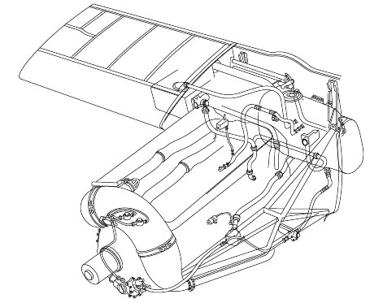

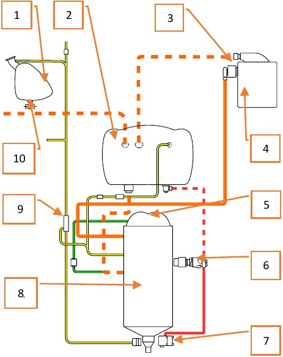

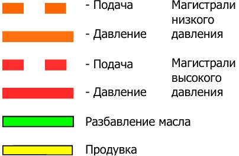

1. Маслобак для дальних полетов
2. Маслобак
3. Клапан Кларка
4. Маслорадиатор
5. Карбюратор
6. Насос гидроматики
7. Блок постоянной скорости
8. Двигатель
9. Отделитель масла 4
10. Кран 10

## Система охлаждения

Бак с охлаждающей жидкостью расположен перед каждым двигателем.

Всего, с учетом заполнения трубопроводов, в системе содержится 15 ½ - 16 галлонов
охлаждающей жидкости, из них 2 галлона 5 пинт в баке, 3 галлона 7 пинт в радиаторе
и обогревателе кабины, 4 галлона 4 пинты в двигателе.

Охлаждающая жидкость состоит на 70% из дистиллированной воды и 30% этилен гликоля.

Температура контролируется посредством термостата и подвижных створок радиатора,
управляемых летчиком.

Створки радиаторов охлаждения управляются вручную из кабины.

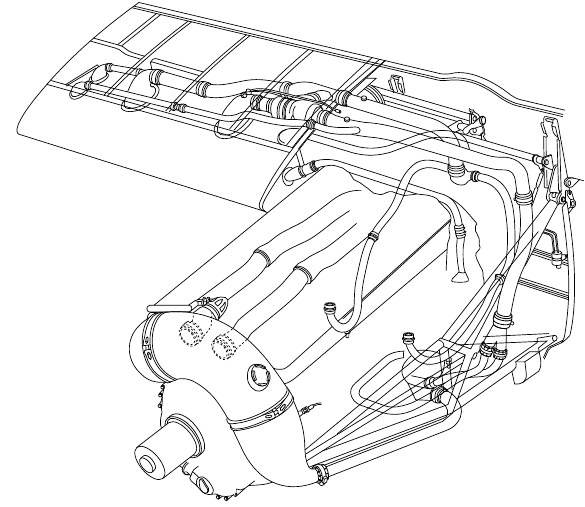

На бортах капотов двигателей расположены воздухозаборники, воздуховоды от которых ведут
к электрогенератору, воздушному компрессору, топливному насосу, магнето и выхлопным
трубам.

Летчик не может непосредственно контролировать температуру масла отдельно, но створки
радиаторов системы охлаждения работают и на маслорадиаторы.

## Гидравлическая система

Гидравлическая система типа Lockheed “low pressure” обеспечивает необходимое давление
в системе для управления шасси, щитками и створками бомбового отсека.

Гидравлическая система включает в себя из два насоса, приводимых от двигателя, по одному
на каждый двигатель, бак с гидравлической жидкостью, расположенный в задней части
фюзеляжа, соединительные линии и устройства управления.
Емкость бака 2 ½ галлона.

Гидроцилиндры:
1. Основных стоек шасси
2. Хвостового колеса
3. Щитков
4. Створок бомболюка
5. Аккумулятор
6. Краны контроля потока
7. Ручной насос
8. Аварийный кран
9. Насос двигателя
10. Строенный блок управления
11. Резервуар
12. Предохранительный клапан
13. Распределительная коробка

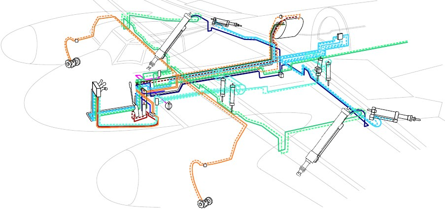

Система может функционировать при отказе одного из двух насосов, однако эффективность
при этом будет снижена. При отказе обоих насосов функционирование гидравлической
системы можно обеспечить с помощью аварийного ручного насоса.

Время выпуска шасси при использовании ручного насоса составляет 4 минуты

## Пневматическая система

Пневматическая система обеспечивает управление следующими системами:

- колесные тормоза
- автоматическое управление нагнетателем
- тропический воздушный фильтр (если установлен)
- створки радиатора
- .303” пулеметы
- 20-мм пушки

Компрессор системы установлен на левом двигателе, сзади на правой стороне блока
цилиндров. Нагнетаемый компрессором воздух закачивается в два цилиндрических баллона,
расположенных в хвостовой части фюзеляжа. Максимальное давление 450 lb./sq. in.

Система оборудована уловителями воды и масла, отделяющих воздух от жидкостей, которые
могли попасть в систему, и фильтрами.

Два вакуумных насоса, по одному на каждом двигателе. Система сконструирована так, что при
отказе какого-либо из насосов, он автоматически отключается от системы.

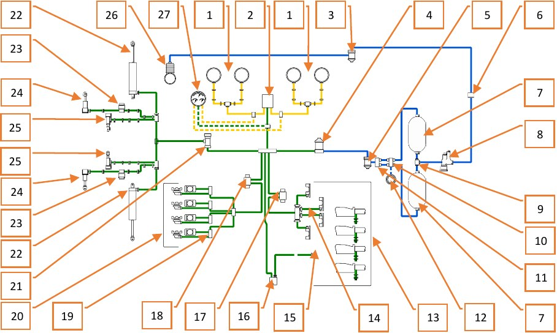

1. Колесные тормоза
2. Блок дифференциала
3. Масловодоуловитель
4. Кран понижения давления
5. Воздушный фильтр
6. Точка заправки
7. Воздушный баллон Dunlop 450 LBS /” 620 CU.INS
8. Регулятор давления Heywood тип A.R.5
9. Обратный клапан
10. Блок переключателей и проверочная точка
11. Обратные клапаны
12. Манометр наземной проверки
13. Блоки перезарядки пушек 20-мм
14. Блоки управления огнем пушек 20-мм
15. Шланг перезарядки
16. Клапан перезарядки пушек
17. E.P. firing valve
18. E.P. firing valve
19. Клапан задержки
20. Блок пулеметов Браунинг 0.303”
21. Клапан поддержания давления
22. Пневмоцилиндр
23. Магнитный клапан
24. Пневматическое управление нагнетателем
25. Пневматическое управление створками воздухозаборника
26. Компрессор Heywood
27. Манометры давления в тормозной системе

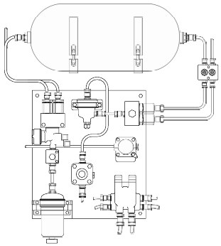

## Электрическая система

Питание электросистем обеспечивается генератором 24В, 1500 Вт. Расположен на правом
двигателе, обеспечивает питание 24 для следующих систем:

- Сигнальные лампы и звуковой сигнал положения шасси
- Предупреждающий сигнал давления топлива
- Краны разбавления масла
- Катушки стартера и бустера двигателя
- Соленоиды цилиндров створок радиатора, воздухозаборника и нагнетателя
- Фотокинопулемет
- Механизм стрельбы
- Прицел
- Огнетушители
- Радио
- Обогрев трубки Пито
- Огни распознавания, идентификации и посадочные фары
- Панель приборов и ультрафиолетовые лампы
- Двигатель насоса оперения
- Очиститель лобового стекла
- Выпуск шлюпки

Разъем для подключения батареи наземного питания находится по левому борту задней части
фюзеляжа.

## Система кислородного питания

Кислородные экономайзеры Mk. II установлены на местах пилота и наблюдателя, питаются
от четырех соединенных между собой цилиндрических кислородных емкостей, расположенных
по бортам в задней части фюзеляжа.

Подача управляется краном высокого давления MK. VIIIC, расположенным за пилотским
креслом, соединенным непосредственно с регуляторами давления Mk. VIIIA, один из которых
расположен около крана высокого давления, второй - на приборной доске под индикаторами
положения шасси и щитков.

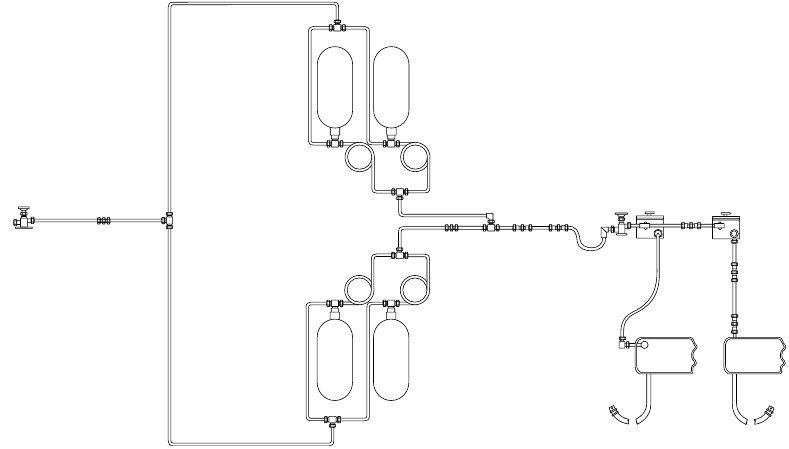

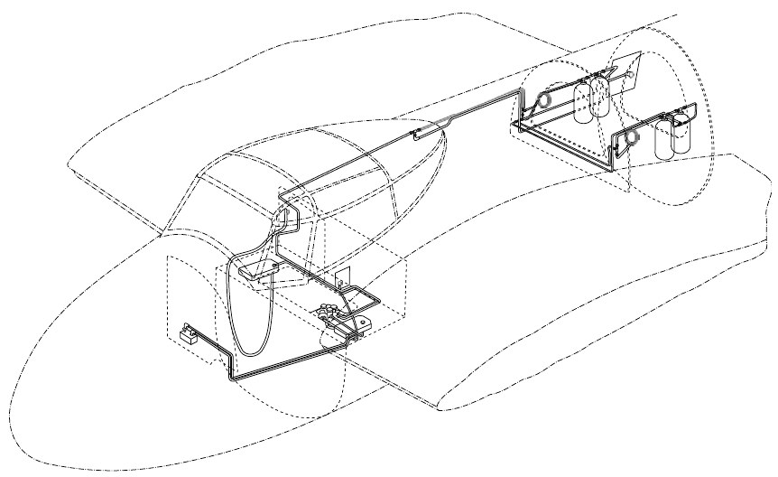

## Система вооружения

### Стрелковое вооружение

Стрелковое вооружение самолета состоит из четырех пушек British Hispano Mk. II калибра 20
мм и четырех пулеметов Browning калибра 0.303 дюйма.

Пулеметы Browning .303 установлены в верхней части носового отсека, перед кабиной
и отделяются от нее бронированной переборкой

Пушки Hispano Mk. II размещаются в отсеке в передней части фюзеляжа под отсеком с
пулеметами и кабиной пилотов.

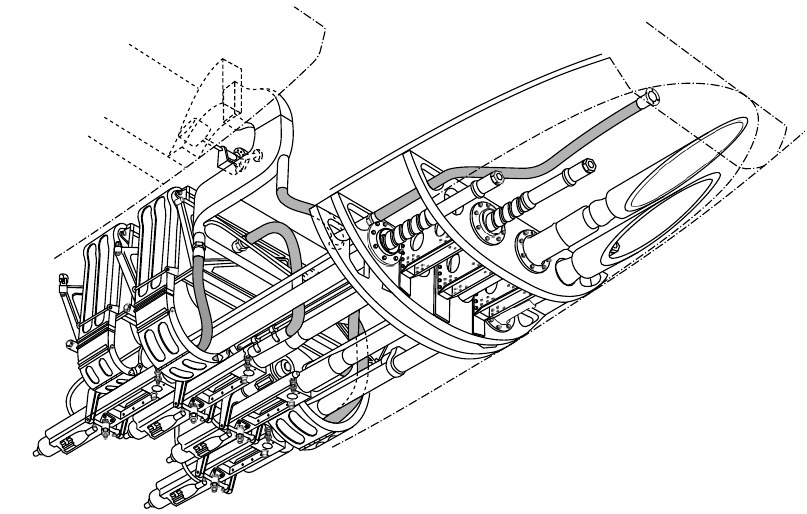

Управление вооружением электропневматическое, выполняется кнопками на РУС.

Для обеспечения безотказной работы оружия на самолете применяется система обогрева.

Горячий воздух для обогрева отбирается после радиаторов системы охлаждения и
по трубопроводам направляется в пулеметно-пушечные отсеки. Работа системы обогрева
не требует вмешательства летчика.

### Бомбовое вооружение

Самолет способен брать авиабомбы весом 250 или 500 lb в бомбовом отсеке фюзеляжа,
расположенном позади от 20-мм пушек и дополнительно по одной 250 lb или 500 lb бомбе
на подкрыльевые пилоны.

Альтернативно в бомбовом отсеке могли размещаться два контейнера с малыми бомбами.

### Ракетное вооружение

Под крыльями DH 98 может нести до 8 реактивных снарядов Rocket Projectiles
(будет реализовано позднее).

## Радиооборудование

Оборудование связи расположено сзади и слева от наблюдателя. Комплект включает в себя
передатчик T.1154, приемник R.1155, пульт SCR-522 и антенное оборудование.

Ведомая антенна размещается справа от места наблюдателя и оборудована штурвалом для
ориентирования.

Верхняя половина кресла наблюдателя откидывается назад для обеспечения доступа
к радиооборудованию.

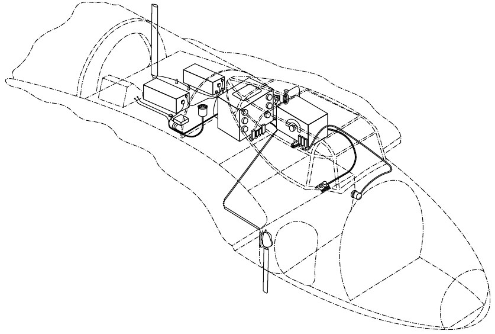

## Аварийное оборудование

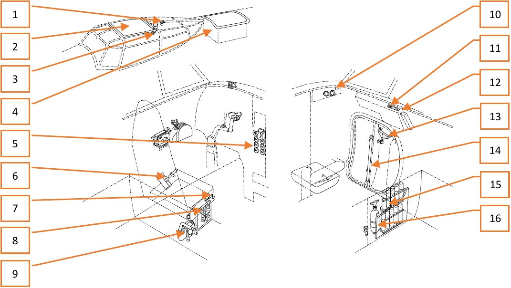

Самолет оборудован средствами спасения и реагирования на аварийные ситуации.

Верхняя панель остекления фонаря сбрасывается поворотом рычага на переплете кабины и
образует люк (2) для покидания самолета.

В контейнере за фонарем кабины расположена надувная лодка на случай посадки на воду (4).

Входная дверь экипажа оснащена рукояткой аварийного сброса (13) для облегчения покидания
самолета с парашютом. На двери размещена рукоятка (14) ручного насоса (9).

В кабине размещаются огнетушитель (16), ракетница (3) с запасом сигнальных ракет (15),
аптечка первой помощи (8), пилотское кресло снабжено ручкой аварийного отстегивания
пристежных ремней (7).

Под креслом размещается ручной насос на случай выхода из строя штатных насосов
гидравлической системы.

Приборная панель и РУС оборудованы кнопками безопасного сброса бомбовой нагрузки
и подвесных баков (5).

На случай остановки двигателя предусмотрены кнопки флюгирования воздушных винтов (10).

На правом борту смонтированы кнопки подрыва транспондера IFF (11) и огнетушителей
двигателей (12)

## Прицельное оборудование

De Havilland Mosquito FB Mk.VI оборудуется оптическим прицелом Barr&Stroud Mk.II

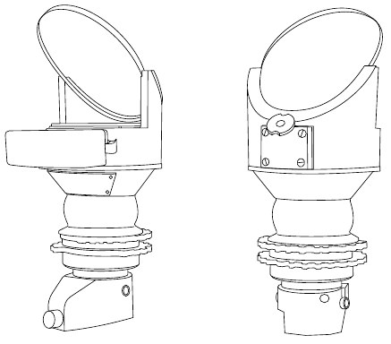

На самолете установлен коллиматорный прицел Mk.II (7A/1124), оборудованный оптическим
визиром (коллиматором) и дальномером.

В оптическую схему входят сетка, объектив, отражатель и светофильтр. Сетка имеет кольцо,
центральную точку, два коротких вертикальных и два длинных горизонтальных штриха. Сетка
нанесена на непрозрачный слой плосковыпуклой линзы. Снизу сетка подсвечивается лампой.

Лучи проходят через сетку объектива и попадают на стекло отражателя. Последнее
установлено под углом 45° к оптической оси системы. Отражатель поворачивает лучи
от источника света на 90° в сторону наблюдателя, который видит изображение светящейся
сетки, сфокусированной на бесконечность.

Дальномер прицела состоит из двух кулачков, горизонтальных линий сетки прицела, двух шкал
и двух маховичков. Работа механизмов дальномера обеспечивает изменение интервала между
видимым изображением горизонтальных линий сетки прицела. Этот переменный интервал
и является основой для измерения дальности до цели. Величина интервала между линиями
видимого изображения сетки прицела зависит от угла поворота верхнего маховичка дальности
и от нижнего маховичка баз. Поворот верхнего маховичка учитывается верхней шкалой,
называемой шкалой дальности, а нижнего маховичка - нижней шкалой, называемой шкалой
базы – размера - цели. Шкала дальности отградуирована в сотнях ярдов, а шкала базы
в футах.

## Камера и фотокинопулемет

DH 98 оборудуется фотокинопулеметом, устанавливаемым в носовом отсеке над пулеметами
спереди слева по борту, и камерой F.24, которая монтируется в задней части фюзеляжа.

Управление фотокинооборудованием осуществляется кнопками, расположенными на ручке
управления.

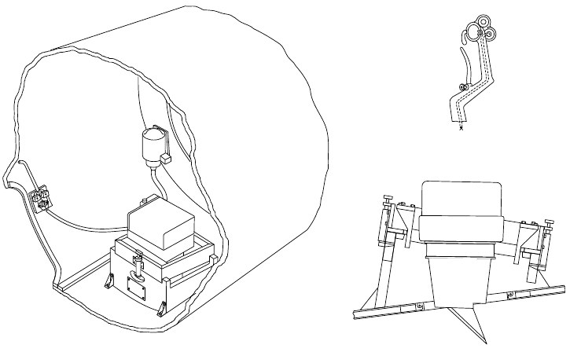

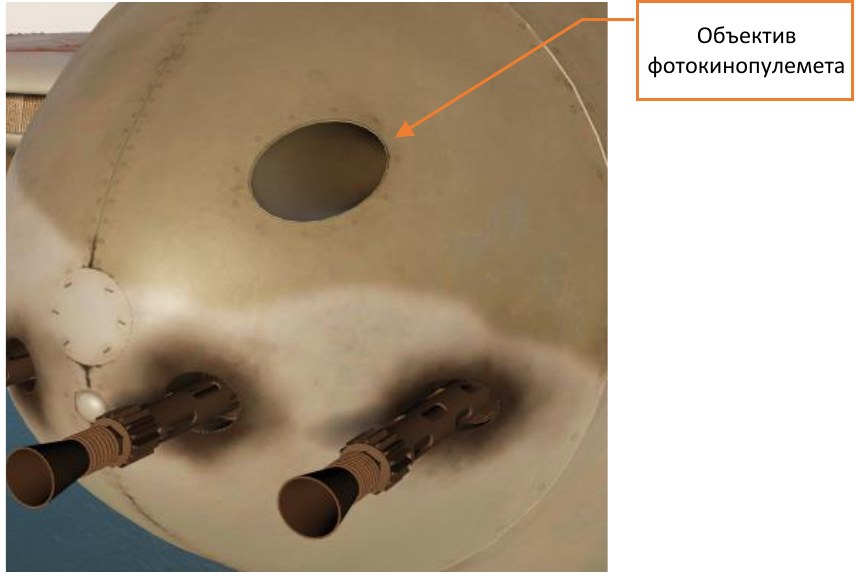

{!abbr.md!}
