# Конструкция самолета

## Общее описание

P-47D – это одноместный, металлический моноплан, с низким крылом, который оснащен
радиальным двигателем с жидкостным охлаждением Pratt & Whitney R-2800-59W Double Wasp.

Двигатель вращает 4х-лопастный воздушный винт Кертисс Электрикс. Самолет оснащен
гидравлически управляемыми посадочными шасси, хвостовым колесом, тормозами и
закрылками.

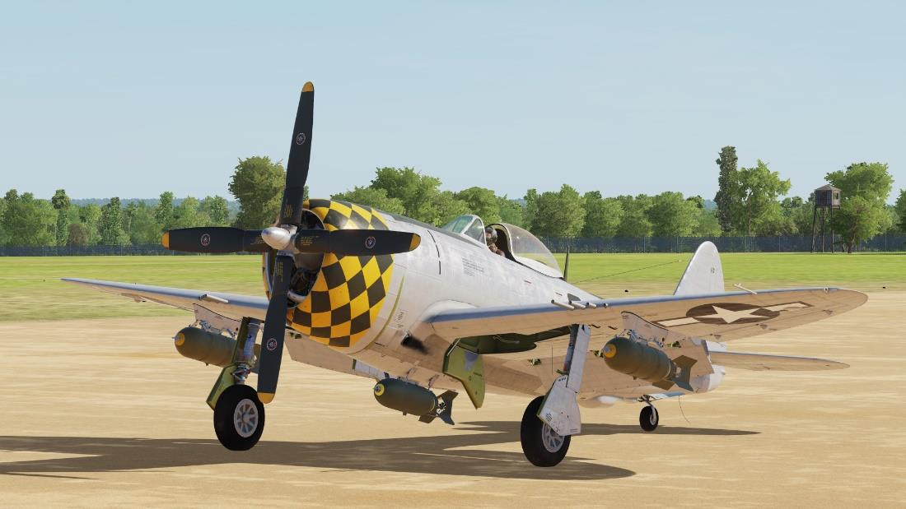

## Основные узлы и агрегаты

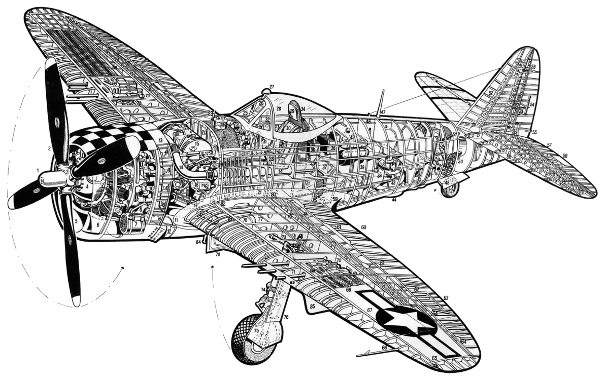

1. Обтекатель воздушного винта
2. 4-х лопастный воздушный винт Кертисс
3. Ступица воздушного винта постоянной скорости вращения
4. Корпус редуктора
5. Центральный воздухозаборник интеркулера
6. Воздухозаборники маслорадиатора
7. Масляный радиатор (по левому и правому борту)
8. Маслопроводы
9. 18-ти цилиндровый радиальный двухрядный двигатель Pratt & Whitney R-2800-59 с
воздушным охлаждением
10. Вывод выхлопного тракта в коллектор
11. Выхлопная труба от коллекторного кольца к компрессору
12. Клапан высокого давления выхлопной системы
13. Обтюратор обдува радиатора с переменным углом раскрытия
14. Воздуховод от турбокомпрессора к карбюратору (по правому и левому борту)
15. Бак с водой емкостью 30 галлонов для впрыска воды
16. Маслопроводы
17. Рама крепления двигателя
18. Отсек вспомогательных агрегатов двигателя
19. Тяги и рычаги управления двигателем
20. Огнеупорная перегородка из нержавеющей стали и сплава Альклед
21. Основной топливный бак
22. Заправочная горловина
23. Шарообразная мушка
24. Приборная доска
25. 1.5-дюймовое пуленепробиваемое лобовое стекло
26. Авиационный стрелковый прицел К-14
27. Зеркало заднего вида (На P-47D-30RE отсутствует)
28. Сдвижной каплевидный фонарь кругового обзора
29. Подголовник
30. Сидение пилота и ремни
31. Ручка управления самолетом
32. Правая панель переключателей
33. Блок управления двигателем
34. Бронированный заголовник
35. Бронеспинка
36. Радиоприемник Detrola.
37. Воздуховод к блоку интеркулера
38. Интеркулер
39. Выходные створки интеркулера
40. Трубопровод подачи выхлопных газов в турбину нагнетателя
41. Воздушный фильтр
42. Турбокомпрессор
43. Турбина
44. Обтекатель выхлопного тракта турбокомпрессора
45. Кислородные баллоны
46. Забор воздуха
47. Антенная мачта
48. Выдвижное управляемое хвостовое колесо
49. Гидравлический амортизатор хвостового колеса
50. Устройство демпфирования типа "шимми" хвостового колеса
51. Механизм выпуска хвостового колеса
52. Передний лонжерон стабилизатора
53. Шарнир руля направления
54. Триммер руля направления
55. Хвостовая аэронавигационная лампа
56. Набор стабилизатора (лонжероны и нервюры)
57. Статически и динамически сбалансированные рули высоты
58. Триммер руля высоты
59. Зализ крыла
60. Посадочные закрылки
61. Шарниры закрылков
62. Набор элерона типа Фрайз
63. Управляемый триммер
64. Шарниры элеронов
65. Навигационный фонарь (левый)
66. Трубка пито
67. Панель отсека с боеприпасами
68. Боеприпасы
69. Рукава боепитания, пулеметы
70. Оружейный отсек между лонжеронами крыльев
71. Пушечная амбразура в передней кромке крыла
72. Крепление основных стоек шасси
73. Подъемник основных стоек шасси
74. Амортизатор основных стоек шасси
75. Вилка шасси
76. Защитная крышка амортизатора
77. Ниша шасси
78. Защитная крышка шасси
79. Задний лонжерон
80. Заднее крепление лонжерона/фюзеляжа
81. Передний лонжерон
82. Переднее крепление лонжерона/фюзеляжа
83. Резервуар с гидравлической жидкостью
84. Топливный бак или измерительные такелажные скобы
85. Крыльевые точки подвески

## Характеристики

Модификация |P-47D-30-RE
------------|-----------
Размах крыла, м. |12.42
Длина, м. |10.99
Высота, м. |4.44
Площадь крыла, м2 |27.87
Масса, кг. |
*Пустого самолета* |4853
*Нормальная взлетная* |6622
*Максимальная взлетная* |7938
Тип двигателя |Pratt & Whitney R-2800-59
Мощность, л.с. |
*Взлетная* | 1 x 2000
*Кратковременно максимальная* | 1 x 2430
Максимальная скорость, км/ч | 690
Крейсерская скорость, км/ч |563
Практическая дальность, км|
*Без ПТБ* |1529
*С ПТБ* |2898
Максимальная скороподъемность, м/мин |847
Практический потолок, м | 12192
Экипаж, чел | 1
Вооружение |Восемь 12.7 мм. пулеметов Colt Browning M2, 1135 кг бомб, напалмовых баков или РС на внешней подвеске

## Фюзеляж

Фюзеляж имеет полумонококовую цельнометаллическую конструкцию. Силовой набор состоит
из лонжеронов и шпангоутов, изготовленных из алюминиевого сплава. Передняя часть
фюзеляжа, включая кабину, собирается из двух секций, верхней и нижней. Секции крепятся
между собой болтовыми соединениями. Задняя часть фюзеляжа соединяется с передней также
на болтах. Противопожарная перегородка изготовлена из жаропрочной стали. Капот двигателя
разделен на четыре съемные панели. Воздушный поток, охлаждающий двигатель, регулируется
отклоняемыми створками с гидравлическими приводами. Между двигателем и кабиной летчика
находится протектированный основной топливный бак, еще один бак расположен под полом
кабины летчика.

Перед приборной доской и сзади сидения пилота крепятся бронеплиты, защищающие летчика
от обстрела с передней и задней полусферы. Бронеплита выдерживает попадание обычных пуль
винтовочного калибра.

В верхней части фюзеляжа перед козырьком фонаря кабины находится отсек с агрегатами
двигателя, топливными и масляными фильтрами, позже здесь же установили маслобак емкостью
106 литров. В районе заднего лонжерона центроплана, проходящего сквозь фюзеляж, находится
задний топливный бак. Между кабиной пилота и задним топливным баком расположено
радиооборудование, баллоны с кислородом и компоненты системы турбонаддува двигателя.
Турбокомпрессор установлен в нижней части фюзеляжа ближе к хвосту, выше него находится
интеркулер. Воздуховоды, которые подводят к турбокомпрессору выхлопные газы двигателя
проложены по бортам нижней части фюзеляжа, воздуховоды от турбокомпрессора к
карбюратору двигателя – по бортам верхней части фюзеляжа. В нижней части фюзеляжа
имеется усиленная сварная стальная балка-киль, которая предохраняет пилота при
вынужденной посадке на "брюхо". Последний шпангоут фюзеляжа выполнен усиленным, к нему
крепится хвостовое оперение и убираемая хвостовая опора шасси.

## Остекление кабины

Одной из главных особенностей P-47D является каплевидный фонарь, который обеспечивает
круговой обзор из кабины пилота. Задняя секция для посадки летчика откатывается назад с
помощью переключателя, расположенного по левому борту кабины. В козырек вмонтировано
лобовое бронестекло.

Аварийный сброс фонаря кабины осуществляется с помощью Т-образной ручки, расположенной
по правому борту выше регулятора подачи кислорода.

## Кабина самолета

Кабина летчика не имеет герметизации и оснащена системой обогрева, а также, малозаметным
внутренним ультрафиолетовым освещением, заряжающим фосфоресцирующие панели
индикаторов. Кресло пилота с чашкой под парашют регулируется по высоте, спинка кресла
бронирована, изготовлена из стали толщиной 9,5 мм, выдерживающей попадания пуль
винтовочного калибра.

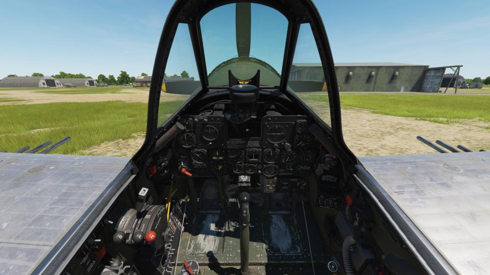

Ламинированное бронестекло толщиной 38 мм вмонтировано в остекление козырька
каплеобразного фонаря кабины. Лобовое остекление обогревается горячими выхлопными
газами двигателя. Сдвижной сегмент фонаря можно при необходимости сбросить, не открывая.

Основным отличием между кабинами P-47D, представленных в симуляторе, является наличие
прицела MkVIII на раннем P-47D-30, формой РУД и наличием панели управления подвесным
вооружением у версий P-47D30-RE и P-47D-40. Последние две оборудованы гироскопическим
стрелковым прицелом K-14.

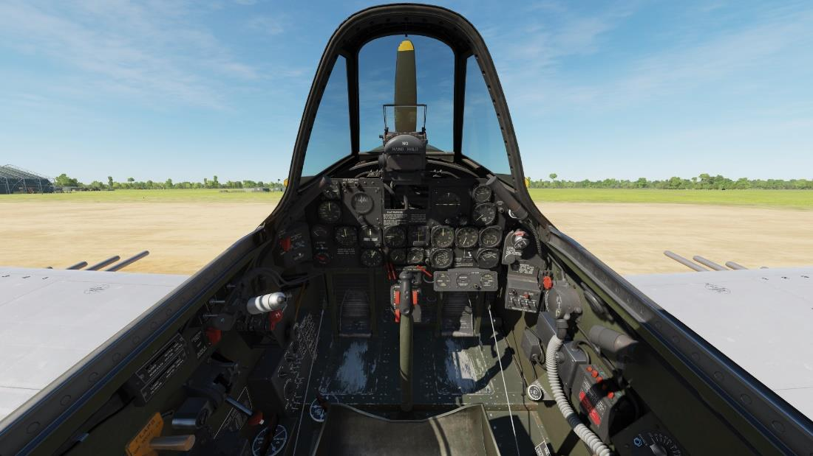

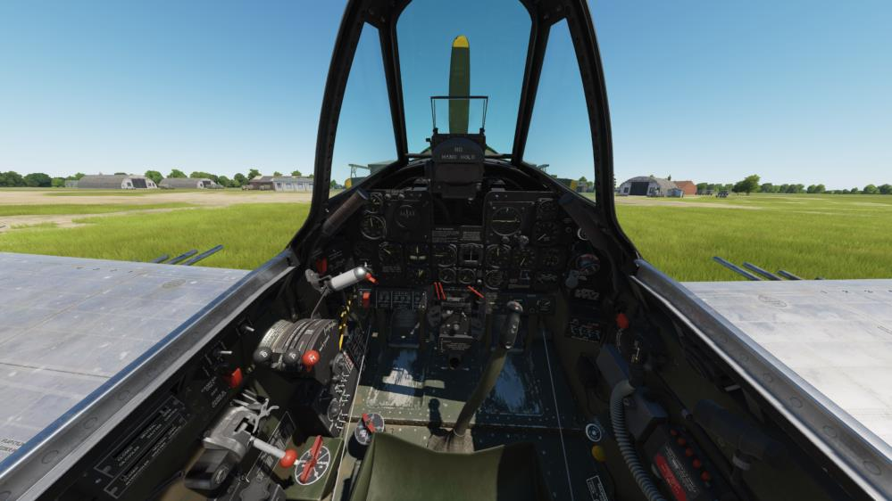

Cамолет P-47D-30RE оборудован панелью управления подвесным вооружением, которая
установлена спереди за РУС.

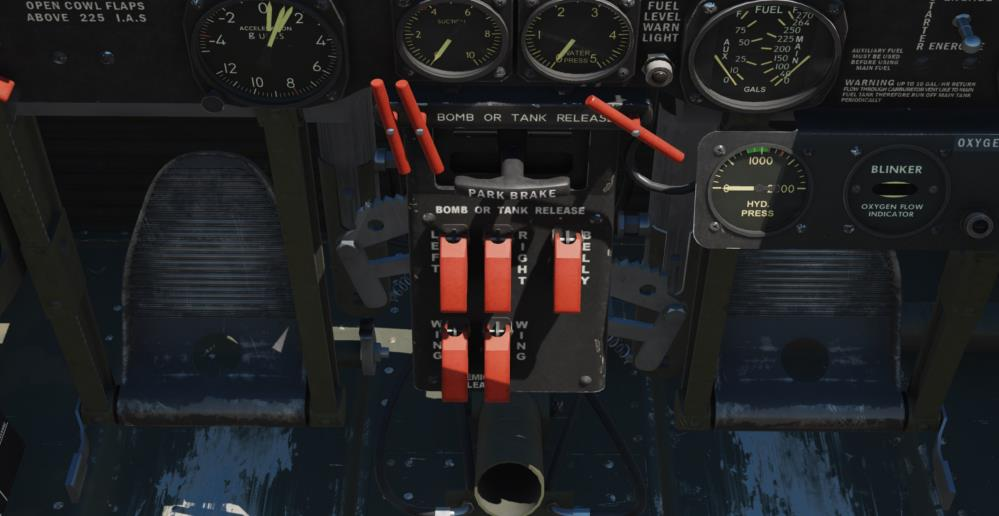

На P-47D-40 данная панель была заменена на панель управления ракетным вооружением, а
органы управления другим подвесным вооружением были перенесены на дополнительную
боковую панель, где установлен ГЛАВНЫЙ предохранитель.

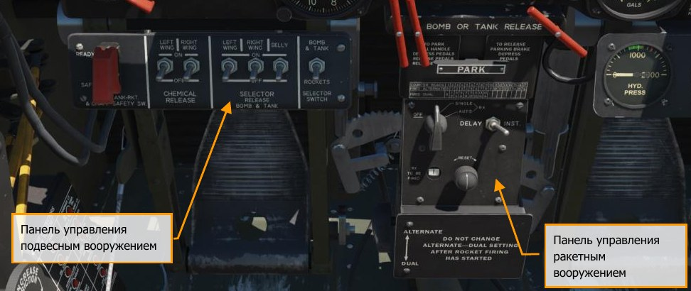

## Крыло

Консольное крыло представляет собой дальнейшее развитие крыла Северского. Основными
элементами крыла являются два основных лонжерона, которые поддерживают крепление крыла
к фюзеляжу и три вспомогательных лонжерона, один из которых поддерживает элерон и
закрылок, а другие поддерживают шасси. К переднему вспомогательному лонжерону крепятся
основные опоры шасси, к заднему – элероны и закрылки.

Консоли крыла крепятся к фюзеляжу на болтах. Элероны (типа Фрайз) на Р-47D-30 имеют
металлическую обшивку. Площадь элеронов составляет 3,177 м2 или 11,4% от площади крыла.
Площадь гидравлически управляемых закрылков составляет 3,62 м2 или 13% от площади крыла.
Угловое отклонение плоскости хорд крыла от его горизонтальной базовой плоскости составляет
+6 градусов, установочный угол атаки +1 градус, стреловидность по передней кромке составляет
+3 градуса. Длина средней аэродинамической хорды 2,221 м, удлинение крыла 5,61.

В консоли крыла имеется отсек вооружения. Над отсеком установлены съемные панели для
доступа к пулеметам и смены патронных лент. Аэронавигационные огни монтируются в
законцовках крыла, цветные сигнальные огни – на нижней поверхности правой консоли крыла.
Киль и консоли стабилизатора имеют по два силовых лонжерона и нервюры. Управление рулями
– тросовое.

## Управляющие поверхности

Управление самолетом осуществляется по классической схеме, с помощью ручки и педалей. С
помощью РУС происходит управление по крену и тангажу. Педали управляют самолетом по
рысканию.

Закрылки управляются гидравлически с помощью рычага, расположенного у левого борта
кабины. Закрылки могут отклоняться на любой желаемый угол, вплоть до 40°. Время выпуска
закрылок в крайнее положение составляет 11-15 секунд.

На самолетах версии P-47D-30 и выше используются элероны с затупленной носовой частью,
что в свою очередь, уменьшает вероятность бафтинга элеронов при выполнении пикирования
на больших скоростях.

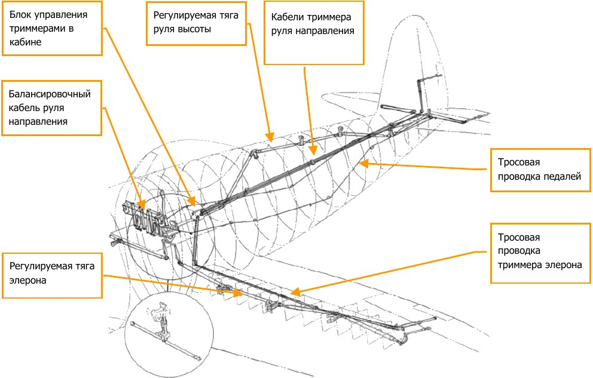

Управляющие плоскости имеют следующие угловые ограничения: руль направления: +/- 28°,
рули высоты: +30° / -20°, элероны: +/- 13°.

Органы управления триммерами левого элерона, руля направления и рулей высоты (в виде
регуляторов) находятся по левому борту кабины сзади, на специальном блоке.

### Элероны

Площадь элерона (типа Фрайз) составляет около 11,4% от площади крыла. Элероны
аэродинамически и динамически сбалансированы и имеют избыточный баланс в 16 фунтов. Они
прикреплены к стальным поковкам, которые прикреплены в свою очередь к вспомогательному
лонжерону крыла.

Элероны управляются системой двухконтактных стержней. На левом элероне размещен
полностью металлический регулируемый триммер. Фланцевые носовые и хвостовые нервюры
24СТ в шахматном порядке прикреплены к основному лонжерону, а лист Алклад 24СТ плотно
прикован к лонжерону и нервюрам. Шарниры элерона из кованного алюминиевого сплава и
прикреплены к наружному вспомогательному лонжерону крыла.

### Закрылки

Площадь посадочных закрылков (щелевой тип NACA) составляет 13% от площади крыла.
Закрылки имеют гидравлический привод. При выполнении процедуры выпуска закрылки сначала
перемещаются назад, затем вниз. При выполнении уборки закрылки перемещаются сначала
вверх, затем вперед. Данная траектория движения, задаваемая трапецеидальными шарнирами,
обеспечивает идеальное расположение закрылков относительно крыла, тем самым поддерживая
должный аэродинамический профиль.

Закрылки крепятся к шарнирам системы тяг и рычагов с помощью стандартных болтов. Двойная
выпуклая наружная поверхность Алклад 24СТ приклепана к фланцевым носовым и хвостовым
нервюрам, которые крепятся к лонжерону 24СТ в симметричном порядке. Между каждой парой
фланцевых нервюр предусмотрены дополнительные облегченные ребра жесткости.

### Щитки вывода из пикирования

В конструкции самолета предусмотрены специальные щитки, задачей которых является
облегчение вывода из пикирования на критических скоростях. Эти поверхности управляются
двумя электрическими реверсивными шаговыми приводами, синхронизированными с помощью
гибкого вала. В систему управления щитками встроены электромагнитные тормоза и муфты,
предотвращающие переход через крайнее положение.

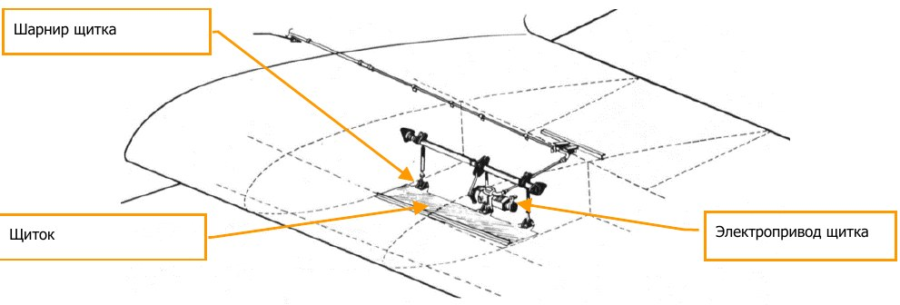

Угол выпуска щитков составляет 21o, что, в свою очередь, обеспечивает выдерживание
безопасной оптимальной перегрузки при выводе из пикирования. Щитки представляют собой
0,188 дюймовые плоские листы 24СТ, которые закреплены перед посадочными закрылками на
вспомогательном лонжероне шасси.

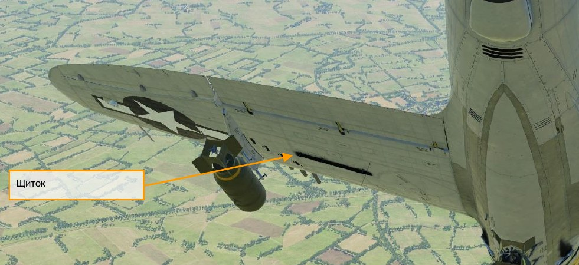

## Хвостовое оперение

Хвостовое оперение Тандерболта представляет собой полностью консольное сооружение общей
проектной площадью 81,45 кв. ф. Все поверхности цельнометаллические, рули направления и
высоты оснащены триммерами цельнометаллической конструкции.

Киль и горизонтальный стабилизатор имеют сходную конструкцию, при чем оба узла используют
фланцевые нервюры между передним и задним лонжероном, а также, фланцевыми носовыми
нервюрами (Алклад 24СТ).

Лонжероны киля охватывают лонжероны горизонтального стабилизатора в сборе и на этом
соединении крепятся болтами к обычным стыковочным пластинам, образуя единую конструкцию.
При установке на фюзеляж самолета, передний лонжерон стабилизатора крепится болтами к
фитингам на горизонтальной стенке задней части фюзеляжа, а задний лонжерон – болтами к
балке, прикрепленной к раме фюзеляжа.

### Руль направления

На Тандерболет установлен руль направления типа Хэндли-Пэйдж со статическим и
динамическим балансом. Триммер руля направления обеспечивает динамический баланс, так
же, как и триммирование в ходе выполнения полетов.

Как и все другие поверхности, руль направления покрыт листами из сплава Алклад.

### Рули высоты

Рули высоты изготавливаются отдельно и собираются в единую конструкцию путем сращивания
трубчатых валов, выходящих из внутренних носовых секций рулей. Поверхности выполнены из
алюминиевых листов сплава 24СТ. Рули состоят из лонжерона и штампованных фланцевых
нервюр. Вращающие трубки прикреплены к первым трем внутренним нервюрам каждого руля.

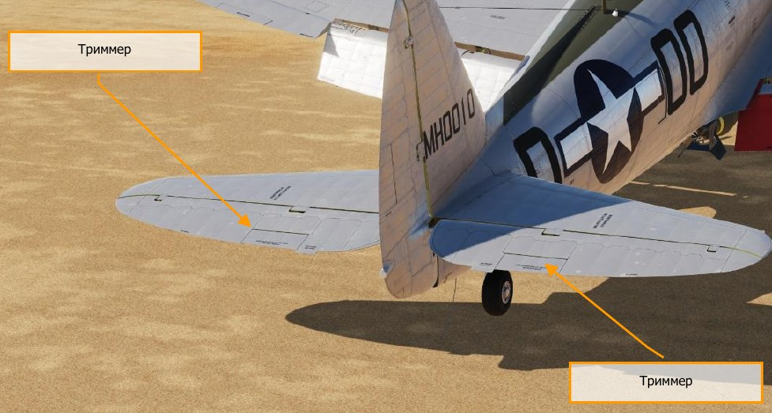

Рули высоты шарнирно крепятся к лонжерону стабилизатора, а передача крутящего момента
обеспечивается благодаря роликовым подшипникам, установленным в шарнирных кронштейнах,
которые прикреплены к последнему шпангоуту фюзеляжа. Последний управляющий стержень
соединен с рулем с помощью кронштейна, который является частью соединительных муфт
трубчатого вала.

## Шасси

Шасси полностью убираемое. Уборка всех стоек шасси реализуется посредством давления,
создаваемого в гидроцилиндрах. Размер пневматиков колес основных опор шасси – 864x229 мм.
Гидравлические тормоза колес основных опор шасси управляются педалями руля направления.

Хвостовое колесо представляет собой свободновращающийся, гидравлически убираемый,
элемент. Хвостовое колесо может быть заблокировано в продольное положение с помощью
рукоятки управления, которая находится справа от кресла пилота.

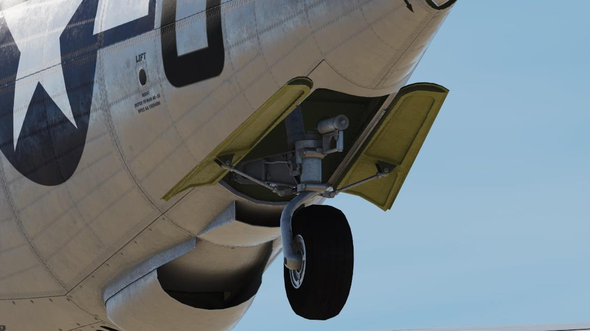

## Силовая установка

Самолет P-47D-30 оснащен четырехтактным, 18-ти цилиндровым, двухрядным звездообразным
карбюраторным двигателем Pratt & Whitney R-2800-59W Double Wasp с воздушным охлаждением,
мощностью в 2300 л.с. Обозначение R-2800 в маркировке означает “ радиальный двигатель
объёмом 2800 кубических дюймов”, что соответствует объёму в 45,9 литров.

Длина двигателя 72,75", диаметр – 52,5", масса сухого – 1068 кг. Двигатель снабжен
односкоростным механическим компрессором. Модификация P-47D-30RE оснащена воздушным
винтом “Curtiss Electrics”.

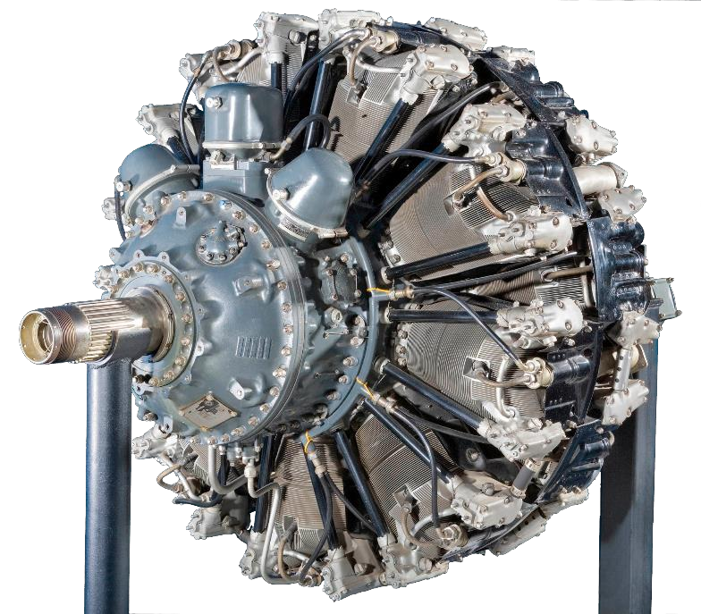

### Турбокомпрессор

Тандерболт получил свою славу как высотный истребитель благодаря турбокомпрессору (ТК),
который обеспечивает большую высотность силовой установки. ТК установлен в задней части
фюзеляжа, что повлекло за собой установку длинных трубопроводов: воздушного тоннеля к
мотору, длинных выхлопных трубопроводов и воздушного тоннеля к интеркулеру,
расположенного около ТК, задача которого – охлаждение нагретого сжатием воздуха.

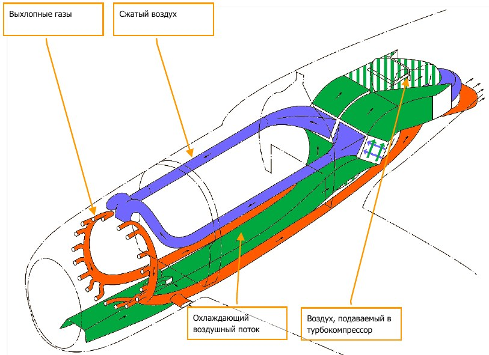

Принцип действия турбокомпрессора заключается в следующем: выхлопные газы, идущие от
двигателя, направляются в газовую турбину, которая приводит в движение компрессор,
который, в свою очередь и сжимает воздух. Побочным эффектом такого сжатия является
сильный нагрев воздуха. Поэтому, перед подачей этого воздуха в цилиндры двигателя
происходит его охлаждение с помощью интеркулера, установленного в хвостовой части
фюзеляжа.

Холодный воздух для обдува интеркулера поступает из воздухозаборника, который размещен
под двигателем, затем проходит по длинному воздуховоду, подается на внешние поверхности
трубок интеркулера, охлаждает сжатый воздух, идущий от турбокомпрессора в карбюратор, и
выпускается через два регулируемые сопла по бокам хвостовой части фюзеляжа.

Часть горячего воздуха от турбокомпрессора отводится к консоли крыла для обогрева
пулеметов, смазка которых может замерзнуть при полетах на большой высоте.

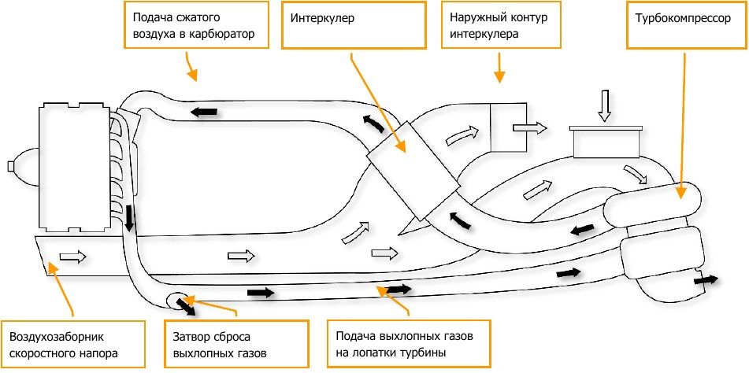

Обычно турбокомпрессор используется на высотах свыше 12 000 футов, а также, для
получения взлетного и чрезвычайного наддува на любой высоте.

На передней приборной панели справа вверху находится тахометр оборотов турбокомпрессора.

### Система впрыска воды

В целях получения возможности значительно увеличить мощность работающего в полете
двигателя на самолет установлена система впрыска воды (водно-метаноловой смеси).

Вода или смесь впрыскивается в мелкодисперсном состоянии во впускной коллектор и затем
увлекается в цилиндры. Наличие воды позволяет заметно снизить температуру смеси, что на
турбированных двигателях дает возможность не вызывая детонации, значительно увеличить
наддув, повысить КПД двигателя и снять бо́льшую мощность;

Данная система состоит из расходного водного бака на 30 галлонов, насоса с приводом от
двигателя, регулятора давления воды, сбросного клапана и механизма автоматической
коррекции наддува (boost-reset) и обеднения смеси.

Система управляется с помощью переключателя, расположенного на торце рукоятки
управления двигателем, который открывает электромагнитный клапан, пропускающий смесь
воды и метанола к регулятору. В то же время под давлением воды в подающей магистрали
срабатывает механизм автоматического увеличения наддува, а также, происходит обеднение
смеси, снижающее удельный расход топлива. Обогрев системы впрыска воды в полете
производится теплом двигателя, что исключает промерзание системы в полете.

Впрыск воды в двигатель происходит при работе двигателя в чрезвычайном режиме. При этом
давление в коллекторе достигает 64 дюйма рт. ст. в коллекторе, увеличивая мощность на 30%
относительно максимальной.

## Воздушный винт

На P-47D-30RE установлен четырехлопастный винт изменяемого шага с регулятором
постоянного числа оборотов от фирмы Curtiss Electrics. Изменение шага винта производится
электрически. Диаметр винта 12 футов и 2 дюйма, диапазон изменения шага лопастей 33° (от
23° при малом и до 56° при большом шаге).

Управление воздушным винтом осуществляется переключателями, расположенными на
небольшой коробке слева от приборной доски, и рукояткой оборотов\шага винта, находящейся
справа от РУД на блоке секторов ВМГ. Специальной защелкой ручка оборотов может
сцепляться с рукояткой управления двигателем (РУД), обеспечивая одновременный с ней ход.

## Топливная система

P-47D-30 имеет 2 протектированных топливных бака общей емкостью 370 галлонов. Основной
(Main) топливный бак емкостью 270 галлонов и вспомогательный (AUX) – 100 галлонов. Запас
топлива может быть увеличен с помощью 3х внешних ПТБ.

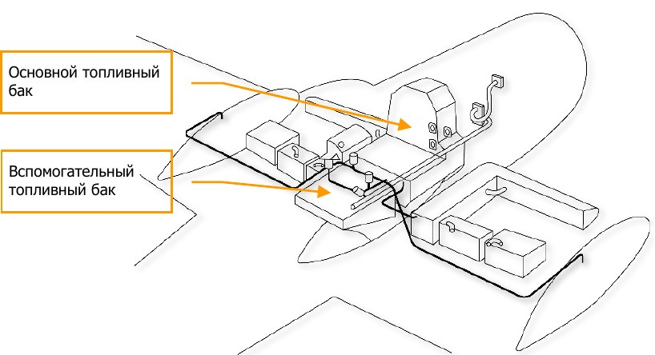

Подача топлива в карбюратор происходит с помощью механического топливного насоса,
установленного непосредственно на двигателе, при этом в каждом из баков установлены
подкачивающие электронасосы переменной производительности. Управление подкачивающими
насосами осуществляется при помощи реостата, который установлен на главном щитке
переключателей.

На самолет можно установить три ПТБ для увеличения дальности полета.

!!! warning
    Трубопроводы поддержания избыточного давления во внешних баках соединены
    между собой, поэтому сброс одного ПТБ вызывает общую разгерметизацию и
    неработоспособность оставшихся. Дождитесь выработки горючего во всех баках,
    чтобы сбросить их одновременно.

Процедура сброса ПТБ [более детально описана в разделе “Стандартные процедуры”](06.procedures.md#_12).

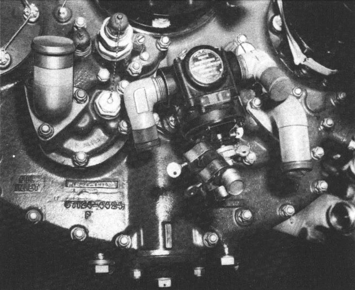

## Гидравлическая система

Гидравлическая система состоит из двух магистралей – рабочей и возвратной. Она
предназначена для управления работой шасси, закрылков и створок капота двигателя. Рабочее
давление в системе создается с помощью гидронасоса.

Подача жидкости из резервуара в верхнюю часть моторного отсека происходит через
регулятор давления. Этот блок выполняет подачу жидкости в систему, когда давление в
системе падает до 800 psi (фунтов на кв. дюйм), и возвращает жидкость в расходный бак при
достижении давления в системе 1000 psi.

Слева от кресла пилота находится аварийный гидронасос, который используется при отказах
насоса гидросистемы, приводящегося в работу валом идущим от двигателя.

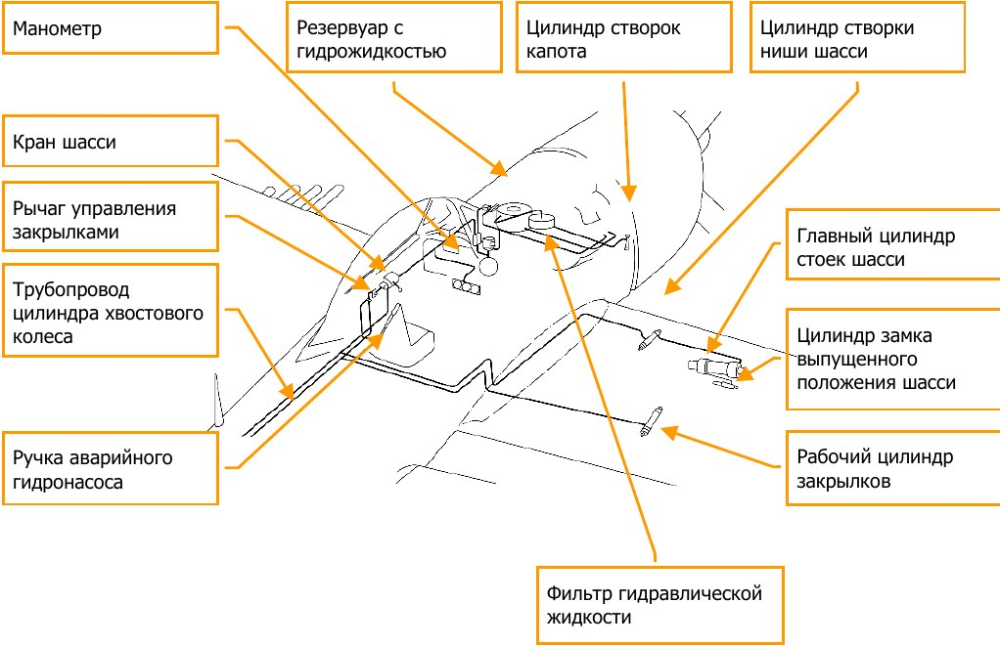

## Масляная система

В верхней части моторного отсека расположен масляный бак с заправочной горловиной. Общая
вместимость бака – 28 галлонов.

В нижней части моторного отсека слева и справа установлено по одному масляному радиатору.
Регулируемые створки радиатора расположены в выходных каналах и имеют электрическое
управление, управляются переключателем на главном щитке в кабине. Индикаторы положения
створок расположены на левом борту кабины над рычагом управления закрылками.

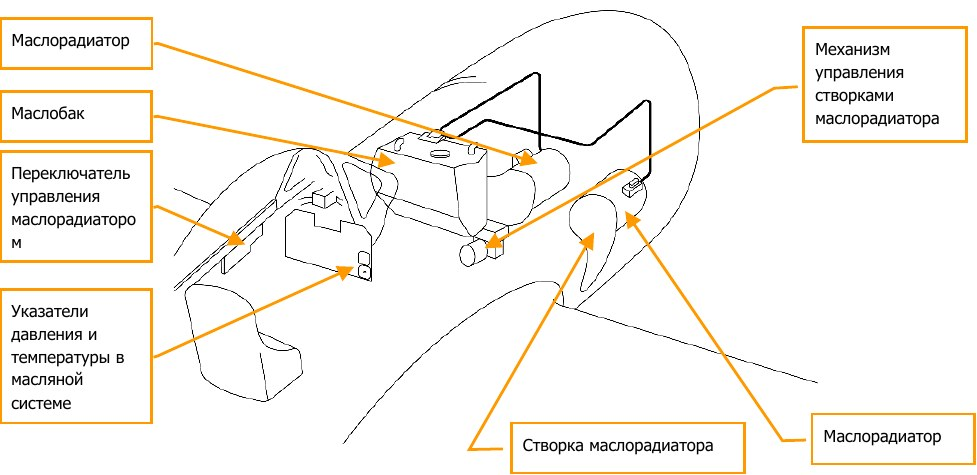

## Электрическая система

Электрическая система Тандерболта является 24В системой постоянного тока, однопроводной с
общей массой на раме. Силовая установка – генератор с силой тока до 100А. Амперметр
расположен на приборной панели и показывает силу тока зарядки.

По правому борту, в районе капота двигателя, за специальным люком находится разъем для
подключения внешнего источника питания, который подключается при обслуживании самолета
на аэродроме и при проведении ремонтных работ.

Аккумуляторная батарея установлена по правому борту самолета.

## Кислородная система

Кислород для дыхания поступает из пяти баллонов низкого давления типа D-2, расположенных
в кормовой части кабины, один баллон установлен в левом крыле. Дыхательный кислородный
прибор с регулятором подачи кислорода находится на стенке кабины справа от пилота.
Манометр и индикатор подачи кислорода находятся на дополнительной панели справа,
установленной на главной приборной панели. Зарядка баллонов происходит посредством
заправочного клапана, расположенного в левой части кабины.

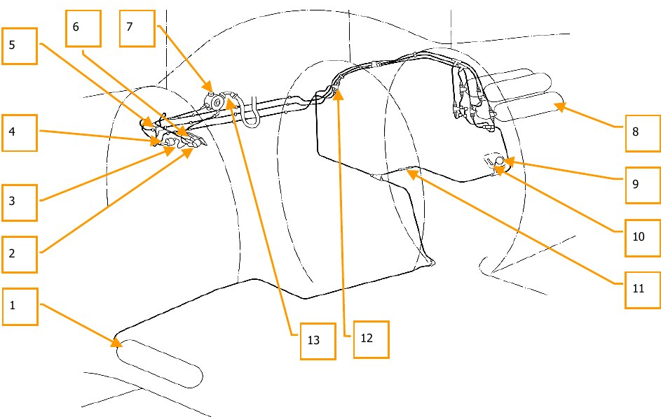

1. Кислородный бак (крыльевой)
2. Индикатор подачи кислорода
3. Провод – светосигнальная лампа
4. Пневматический сигнал датчика давления
5. Трехходовой кран
6. Манометр кислородной системы
7. Дыхательный кислородный прибор с отсечкой
8. Кислородные баллоны, установленные в задней части фюзеляжа
9. Заправочный клапан
10. Соединительная муфта
11. Штуцер контроля давления
12. Двойной обратный клапан
13. Трубка

Нормальное давление в кислородной системе – 400 psi.

## Связное оборудование

Радиооборудование P-47D-30 состоит из: ультракоротковолновой радиостанции SCR 522,
длинноволнового радиоприемника Detrola, самолетного радиолокационного ответчика системы
“свой-чужой” SCR 695, и RC-96. Радиостанция диапазона УКВ (VHF) – это станция голосовой
командной связи. Как и для всех радиостанций УКВ диапазона дальность работы увеличивается
с высотой полета.

Элементы управления радиостанциями расположены справа на стенке кабины.

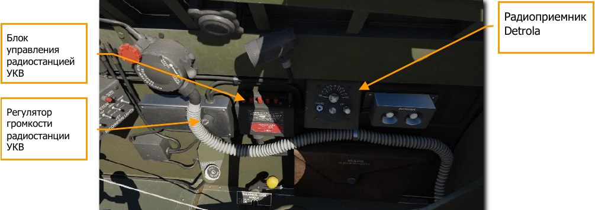

Четыре канала, обозначенные буквами, настраиваются на требуемую частоту на земле
обслуживающим персоналом. Для использования желаемого канала нажмите на
соответствующую кнопку. После нажатия загорается соответствующая зеленая лампа. Для
завершения связи нажмите кнопку OFF.

Главный переключатель режима работы внизу блока управления (при взгляде сверху) имеет 3
позиции: T (Передача), R (Прием) и REM (Remote – дистанционно).

Основное положение переключателя – позиция REM. В данной позиции радиопередача
активируется с помощью специальной кнопки активации микрофона на РУД.

Прием осуществляется автоматически. Если кнопка микрофона неисправна, прием
осуществляется при переключателе в позиции R или REM, а передача – T. Не оставляйте
переключатель в позиции T, поскольку вы активируете постоянную передачу, чем спровоцируете
“загрязнение” радиоканала. Если вы подвинете небольшой язычок рычага назад, который
находится возле канала D, главный переключатель приема-передачи будет оставаться в позиции
Т до тех пор, пока он будет удерживаться. Контрольная лампа приема рядом с переключателем
канала светится, когда радиостанция может осуществлять прием и гаснет, когда пилот
выполняет передачу.

## Элементы бронирования самолета

Бронещиты на Тандерболет расположены в двух местах: за спиной пилота и за передней
приборной панелью, перед бачком системы охлаждения. Кроме того, дополнительную защиту
летчика обеспечивает пуленепробиваемое лобовое стекло и сам двигатель, защищающий пилота
от лобового огня.

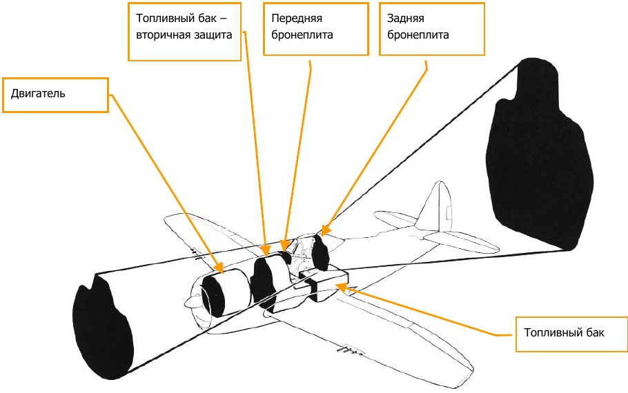

## Вооружение

Встроенное вооружение самолета состоит из восьми установленных в крыле пулеметов Кольт
Браунинг М-2 калибра .50 (12,7 мм). Нормальный боекомплект составляет 425 патронов на ствол.
Скорострельность пулемета находится на уровне 800-890 выстрелов в минуту. Стволы пулеметов
при стрельбе длинными очередями перегреваются, поэтому рекомендовано ограничивать
продолжительность очереди тремя секундами.

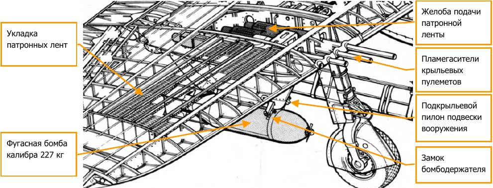

В состав подвесного вооружения входят неуправляемые ракеты М8 калибра 114 мм (4,5 дюйма)
со складывающимся хвостовым оперением. Ракеты запускаются из подвешенных пусковых
трубчатых установок М-10, трубы которых изготовлены из магниевого или стального сплавов.

Также можно подвешивать неуправляемые ракеты HVAR калибра 127 мм (5 дюймов), различные
авиабомбы и баки с напалмом, контейнеры с дымовыми завесами и слезоточивым газом. Баки с
напалмом представляют собой емкости, изготовленные из доработанных подвесных топливных
баков.

!!! note "Примечание"
     На данный момент напалм и химическое оружие в DCS World не реализовано.

{!abbr.md!}
