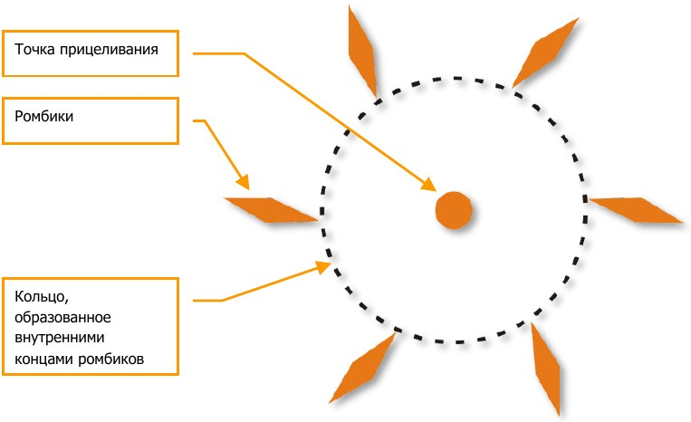
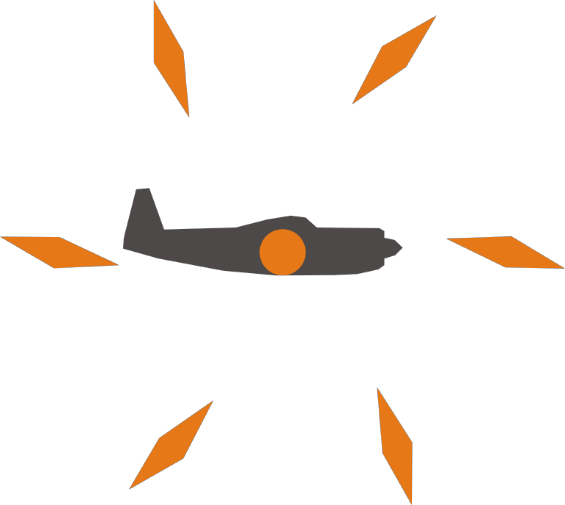

# ПРИМЕНЕНИЕ ОРУЖИЯ

В этом разделе мы рассмотрим процедуры применения вооружения на самолете P-47D.

## Пулеметы

На самолете установлено 8 пулеметов калибра 12,7 мм, по 4 шт. в каждом крыле, что
обеспечивает массу секунднго залпа в 5,8 кг – это один из самых высоких показателей для
истебителей тех лет. Заряд каждого пулемета составляет 425 патронов что дает возможность
сделать 15 двухсекундных очередей. Боеприпасы пулеметов – это самый важный расходный
материал, после топлива. Используйте его экономно.

Прицеливание осуществляется при помощи гироскопического прицела К-14, который
отображает требуемое упреждение для поражения вражеского самолета, в зависимости от
расстояния к нему.

Процедура стрельбы из пулеметов

1. Установите переключатель управления прицелом в позицию GUNS & CAMERA
2. Отрегулируйте желаемую яркость прицела с помощью реостата яркости прицела
на щитке коммутации
3. Выполните стрельбу, зажав гашетку на РУС.

### Работа с авиационным стрелковым прицелом К-14

Авиационный стрелковый прицел К-14 имеет два режима работы прицельной сетки: подвижная
сетка (гироскопический прицел) и неподвижная сетка. При неподвижной сетке, прицел
представляет собой кольцевой коллиматорный визир с перекрестием в центре. Режимы
прицельной сетки используются только одновременно.

!!! note "Примечание"
    На самолете P-47D-30RE не предусмотрена раздельная работа неподвижной и подвижной
    сетки.

Одновременное использовании обоих режимов позволяет получать визуальную информацию о
величине угла упреждения, образованного смещением гироскопического прицела относительно
положения линии визирования неподвижной сетки. В этом случае, лучше использовать
неподвижную сетку со скрытым кольцом, не загромождающую линию визирования прицела.

Неподвижная сетка состоит из перекрестия и кольца (когда оно не скрыто) с угловой величиной
дуги равной 8 миллирадиан (8 тысячных).

На передней панели прицела размещена шкала базы цели (размах крыльев самолетов
противника) с делениями от 30 до 120 футов. С ее помощью производится ввод значения базы
цели - первоначальная выставка диаметра кольца подвижной сетки.

Подвижная сетка состоит из центральной точки прицеливания и кольца из шести ромбиков.
Прицеливание с использованием подвижной сетки заключается в первоначальной выставке базы
цели на прицеле, а затем, после наложения на цель прицельной марки - в подкручивании
верньера дальности и доведения размера кольца до габаритов цели.

Шкала дальности прицела K-14 представляет собой верньер с делениями от 600 до 2400 футов.

Во время атаки, маневром самолета необходимо навести и удерживать точку прицеливания на
противнике, постоянно корректируя диаметр сетки из шести ромбиков так, чтобы цель была
обрамлена дальномерным кольцом, образованным внутренним концам ромбиков. Точка
прицеливания должна удерживаться на цели в течении 1 секунды до начала стрельбы, чтобы
дать время прицелу на стабилизацию.

При подготовке к бою, барабан (слева на прицеле) должен быть выставлен на значение,
соответствующее минимальной дальности прицела - 600 футов. Эту процедуру необходимо
проделывать всякий раз перед атакой новой цели.

В начале прицеливания необходимо сохранять минимальное значение введенной дальности до
цели (600 футов), до момента, пока точка прицеливания не окажется на цели или вблизи ее.
Затем, используя барабан, скорректировать дальность посредством вписывания цели внутрь
дальномерного кольца. Эта процедура снижает потерю времени на установку дальности,
предотвращая лишнюю коррекцию, и позволяет наиболее быстро получить решение для
стрельбы.

Когда воздушная цель движется под прямым углом (90°) относительно направления огня
атакующего самолета - ее ракурс не позволяет обрамить крылья самолета дальномерным
кольцом, даже если самолет-цель имеет крен. На большинстве самолетов расстояние от кабины
пилота до крайней задней точки хвоста составляет около половины размаха крыльев.
Следовательно, прицеливание может быть выполнено посредством наведения точки
прицеливания на кабину и установкой размера воображаемого дальномерного кольца до точки
касания с хвостовой частью.

Обратите внимание, что кольцо проходит не по самому хвосту, а по его крайней задней точке.

При сокращении видимого размера цели, то есть, когда самолет-цель расположен под углом
отличным от 90° (при взгляде из прицела), размер дальномерного кольца должен быть несколько
больше видимого размера цели (ракурса) для компенсации сокращения истинного размера. Если
крылья и фюзеляж самолета-цели находятся под углом 45° (при взгляде на него через прицел),
размер кольца должен быть увеличен на 1/6 диаметра от видимого размера цели или 1/3 радиуса
от границы каждой стороны цели - законцовок крыльев и крайней задней точки хвоста. Это
максимальная угловая поправка прицеливания. Для большинства целей применяют поправку в
одну десятую диаметра дальномерного кольца прицельной сетки.

Угол упреждения, образованный смещением точки прицеливания относительно перекрестия
неподвижной сетки, является допустимым для ведения прицельной стрельбы, если его величина
находится в пределах от 85 до 100 mils (миллирадиан, тысячных). Однако с увеличением
расстояния до цели, любые незначительные ошибки допущенные при обрамлении цели будут
возрастать и делать стрельбу на дальней дистанции невыгодной. Только при малом угле
упреждения, ошибки расчета дальности до цели будут несущественны, а стрельба на большой
дальности эффективна.

При приближении к цели на расстояние менее 600 футов, дальномерным кольцом из ромбиков
можно пренебречь. Эффективность стрельбы при этом может быть достигнута простым
удержанием точки прицеливания на цели.

Чтобы свести к минимуму эффект параллакса (эффект, в результате которого происходит
смещение цели относительно прицельной сетки при перемещении головы летчика), обе сетки
проецируются в бесконечность с помощью коллиматорной линзы.

На приведенных ниже рисунках показано правильное и неправильное наложение подвижной
сетки на цель.

### Порядок прицеливания

Правильно – Размер кольца из ромбиков Неправильно – Размер кольца из ромбиков
соответствует размаху крыльев цели. слишком большой, что делает расчет
дальности и угла упреждения ошибочным

Правильно – При выполнении атаки сбоку Неправильно – Размер воображаемого
размер кольца должен быть немного больше дальномерного кольца, образуемого
видимой длины его фюзеляжа, а также внутренними концами ромбиков, должен
больше величины размаха крыльев соответствовать размаху крыльев цели
Предполетная проверка авиационного стрелкового прицела К-14
Перед взлетом, произвести проверку прицела следующим образом:

• Предохранительный переключатель пулеметов установить в положение GUNS & CAMERA.

• Переключатель выбора режима работы сетки (слева от прицела) установить в желаемый
режим работы. На отражателе должны быть видны две сетки – подвижная и неподвижная
 (если реостат яркости прицелу уже установлен на какой-либо уровень яркости).

• Вращением реостата яркости прицела добиться желаемой яркости прицельной сетки.

• Расположить голову таким образом, чтобы прицельные сетки находились в центре
отражателя. При этом убедиться, что точка прицеливания подвижной сетки накладывается
на перекрестие неподвижной сетки.

• Вращая барабан на прицеле слева в пределах от минимального до максимального
значений, проконтролировать изменение размеров изображения кольца подвижной сетки
прицела.

Стрельба из пулеметов с использованием прицела К-14
Штатные действия по работе с прицелом в полете выполняются следующим образом:

• Предохранительный переключатель пулеметов установить в положение GUNS & CAMERA.

• Произвести визуальное обнаружение и опознавание цели; установкой стрелки-рычага на
верхней шкале ввести базу цели (размах крыльев) .

• Маневром самолета “загнать” цель внутрь дальномерного кольца подвижной сетки прицела,
и удерживая центр сетки на цели, вращать поворотный барабан дальности (на прицеле
слева) до тех пор, пока диаметр кольца не станет соответствовать размеру цели.

• Продолжая вращение барабана дальности, непрерывно обрамлять цель внутренними
концами ромбиков. Удерживать прицельную точку на цели в течении 1 секунды для
стабилизаци, после чего начать стрельбу короткими двухсекундными очередями.

• В процессе стрельбы добиваться удержания центра сетки на цели и обрамлении ее
дальномерным кольцом.
Авиационные бомбы
Бомбометание
Ниже приведена стандартная процедура для выполнения бомбометания на самолете P-47D-
30RE:
• Установить переключатели выбора бомб (Bomb Arming) в верхнее положение.
• Выполните взведение выбранных бомб с помощью блока управления взрывателями,
который расположен слева сзади блока триммеров (обратите внимание на подписи рукояток
взведения).
• Коротким нажатием кнопки применения Бомб-Ракет (Bomb-Rocket Release) на ручке
управления самолетом (РУС) произвести сброс выбранных бомб.

Кнопка сброса

Переключатели
выбора бомб

Рисунок 112. Кнопка сброса и переключатели взведения бомб

Следует обратить внимание на то, что безопасный сброс бомб может быть произведен при любом
угле тангажа самолета в пределах до 30° положительных значений и до 90° отрицательных
(отвесное пикирование).
Не допускайте сброса бомб в отвесном пикировании при наличии бокового скольжении более 5°
градусов. Это может привести к столкновению бомбы с воздушным винтом.
РАДИОССОБЩЕНИЯ
РАДИОСООБЩЕНИЯ И
ВЗАИМОДЕЙСТВИЕ
