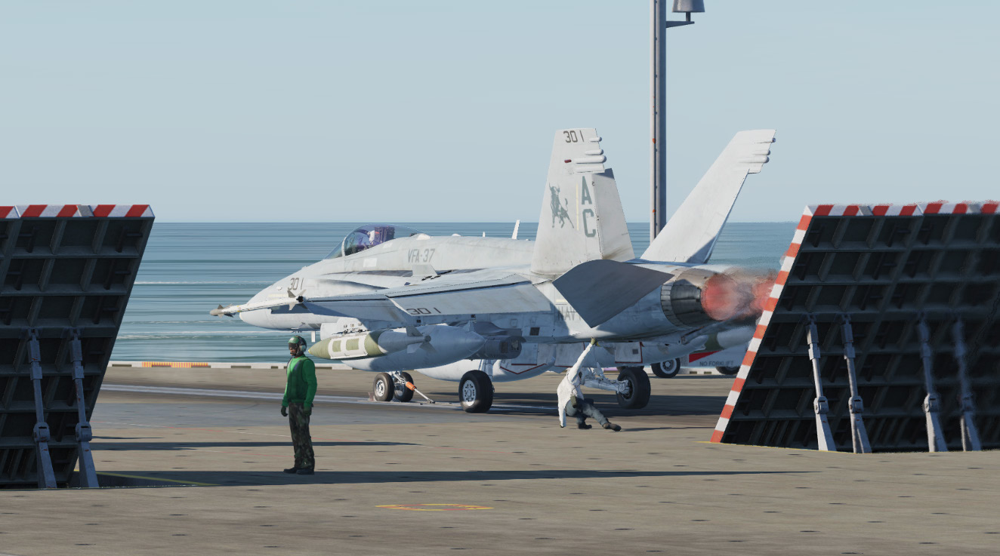
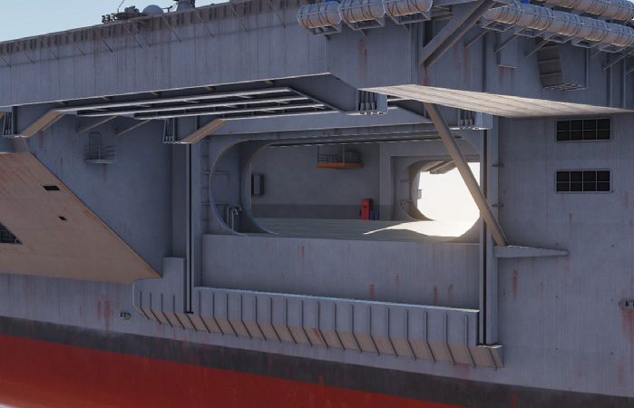
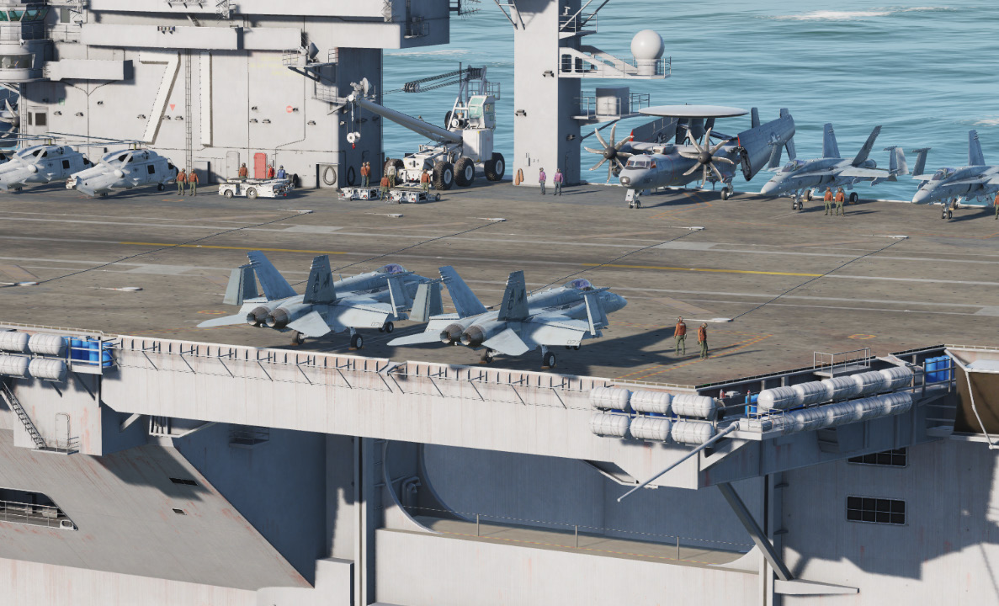
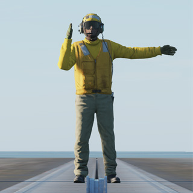
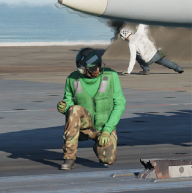
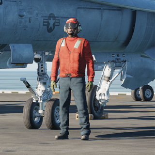
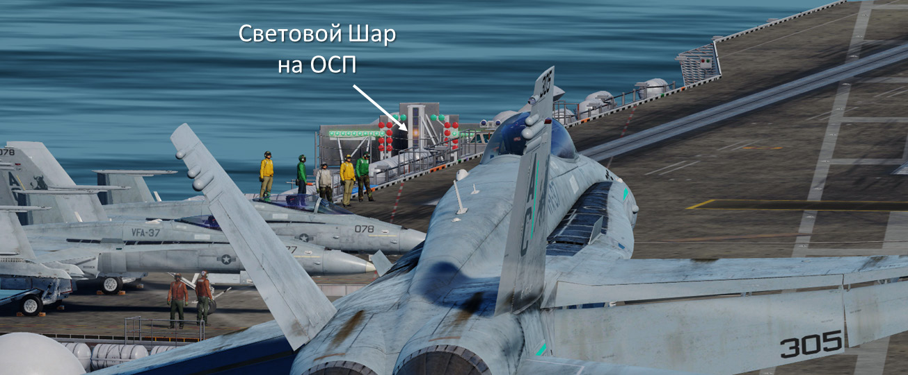
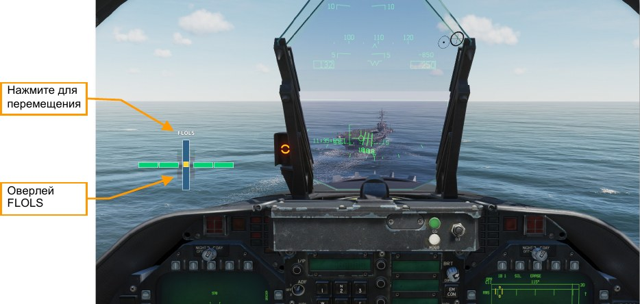
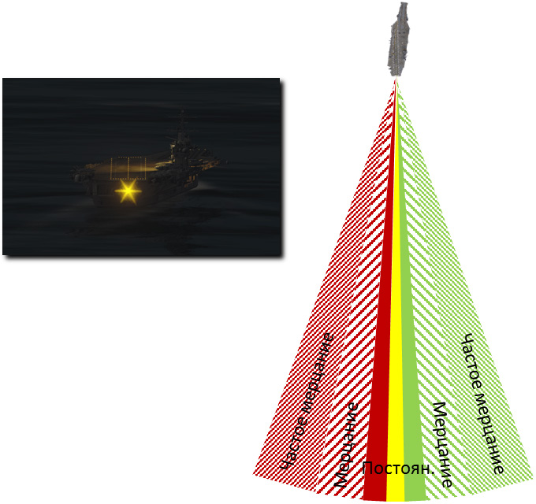
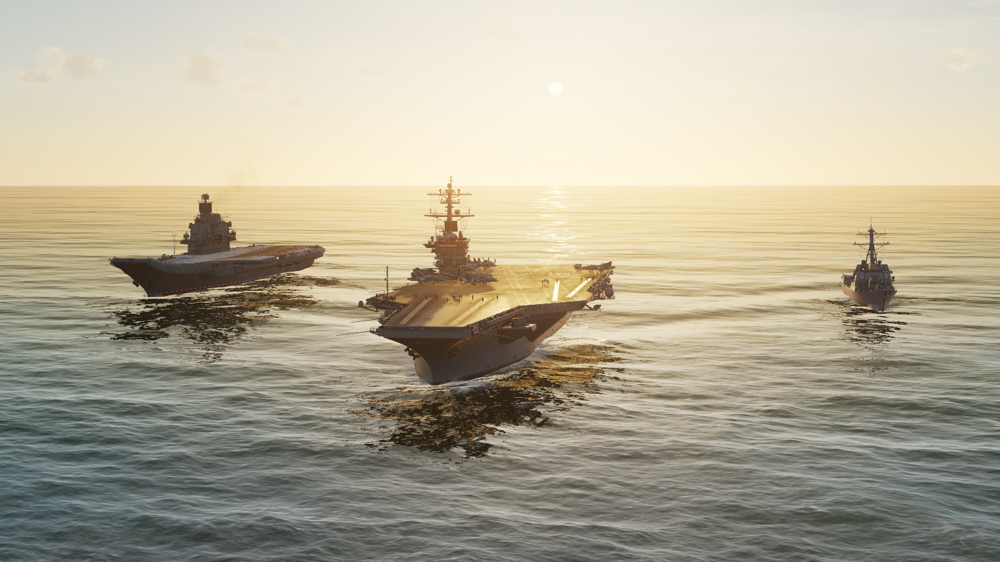

# АВИАНОСЦЫ КЛАССА НИМИЦ

## Общая информация

Авианосцы класса Нимиц (CVN) образуют собой серию из десяти атомных авианосцев, в настоящее
время находящихся на вооружении ВМС США. Общая конструкция этих кораблей аналогична
предыдущему классу Китти Хок с большой 4,5-акровой (18210 м^2^) полётной палубой и островной
надстройкой по правому борту, достигающей почти 20 этажей. Угловая палуба, используемая для
посадки, расположена примерно под углом 9° относительно оси корабля и имеет длину почти 800 футов
(243 м). Четыре грузовых авиационных лифта, каждый более 4000 квадратных футов (372 м^2^),
доставляют самолёты из ангара на палубу.

- Водоизмещение: 72,916 тонн стандартное, 96,000 - 102,000 тонн полное.
- Длина: 1040 футов по ватерлинии (317 м).
- Ширина: 252 футов (76.8 м).
- Скорость: более 30 узлов (56 км/ч).
- Энергоустановка: 2 ядерных реактора, 4 паровые турбины, 4 5-лопастных гребных винта
 (замена ядерного топлива через 13-15 лет или после 800,000 – 1,000,000 миль).
- Экипаж, чел.: 3,200 корабельной команды + 2,480 в составе авиакрыла.
- Вооружение: 4 установки по 8 ракет RIM-7 Sea Sparrow каждая, 3-4 6х20-мм установки
зенитного артиллерийского комплекса Mark15 Vulcan Phalanx CIWS.
- Авиагруппа (включая устаревшие типы ЛА): 70-80 самолётов F-14, F/A-18, EA-6B, E-2C, S-3A/B,
C-2, 6-8 противолодочных и спасательных вертолетов SH-60F, HH-60H.

Модуль DCS: Supercarrier представлен авианосцем Теодор Рузвельт - подклассом серии Нимиц, часто
называемым улучшенным классом Нимиц. Доступные авианосцы этого подкласса:

- CVN-71 Теодор Рузвельт. Введён в эксплуатацию: 25 октября 1986 года
- CVN-72 Авраам Линкольн. Введён в эксплуатацию: 11 ноября 1989 года
- CVN-73 Джордж Вашингтон. Введён в эксплуатацию: 04 июля 1992 года

## Схема и оборудование полётной палубы

Огромная палуба авианосца класса Нимиц является ядром его наступательных возможностей. С точки
зрения безопасности военной службы в мирное время, она считается одним из самых опасных мест
службы в мире (по американским источникам).

### Катапульты

Старт самолётов осуществляют четыре паровые катапульты. Движущая сила катапульты задаётся
давлением пара, действующим на два поршня, скользящих внутри двух длинных параллельных друг
другу цилиндров, расположенных под палубой. Оба поршня жёстко связаны между собой и через
направляющую щель в палубе соединяются с челноком, за который при катапультировании идёт
самолёт. Челнок имеет свободный ход по катапультному треку. При старте пар под высоким давлением
подаётся в цилиндры, действуя на поршни и разгоняя челнок катапульты запускает самолёт. В конце
хода челнок и поршни затормаживаются специальным гидротормозным устройством на участке всего
1,5 м.

Катапульты 1 и 2 расположены в носовой части палубы, а 3 и 4 – на угловой палубе. Такое количество
катапульт и их расположение позволяют производить выпуск самолётов с интервалом в 20 секунд.
Соединение передней стойки самолёта с челноком катапульты производится при помощи бросковой
штанги, при этом с противоположной стороны стойка жёстко привязывается к палубе посредством
задержника, настроенного на определённое разрывное усилие. Как только усилие, создаваемое
челноком и тягой двигателей, превысит настройку задержника, он резко рассоединяется, и самолёт
устремляется вперёд, достигая к концу трека скорости в 140-160 узлов (250-260 км/ч) необходимой для
взлёта. Движение по треку катапульты не превышает 2 секунд. Подробности старта с катапульты,
работа пилота и его взаимодействие палубной командой подробно расписано в разделе "ПОДГОТОВКА
К ВЫЛЕТУ".

### Газоотбойники (ДГС)

Для защиты персонала и оборудования от выхлопных струй реактивных двигателей в момент взлёта
самолёта стартовые позиции оснащены сверхпрочными отклоняемыми щитами газоотбойников
(дефлекторов газовых струй - ДГС). Гидравлические цилиндры поднимают каждый щит вверх под углом
45 градусов. Каждый газоотбойник имеет систему охлаждения проточной морской водой для
предотвращения повреждений. После взлёта самолёта щиты убираются в палубу.

### Аэрофинишёры

Посадочная палуба оснащена четырьмя тросами аэрофинишёров. При посадке самолёт зацепляется
посадочным гаком за один из них, позволяя ему остановиться на дистанции 300 футов (~90 м).
Троса изготовлены из плетёных стальных струн с сердечником из полиэстера для обеспечения гибкости.
Каждый конец троса соединён с поршнем тормозных цилиндров останавливающего устройства под
палубой. Эти цилиндры оснащены мощными гидравлическими тормозами, обеспечивающими
рассеивание кинетической энергии пробега самолёта при посадке.

Троса аэрофинишёров пронумерованы с первого по четвёртый по направлению от кормы к носовой
части авианосца. Несмотря на то, что имеется четыре троса, средства визуального захода на посадку,
при хорошо выполненном заходе обеспечивают касание и зацепление самолётом в зоне из трёх тросов.
При заходе на посадку ниже первого троса есть риск удара в корму авианосца. При заходе на посадку
выше четвёртого троса есть риск пролететь их все не зацепив ни одного.

### Ангарная палуба

Под полётной палубой проходит галерейная палуба, где размещён центр управления катапультами,
аэрофинишёрами и боевой пост управления. Под галерейной палубой находится ангарная палуба,
занимающая примерно две трети от общей длины авианосца. Для ограничения ущерба в случае пожара
она может быть разделена взрывозащитными раздвижными переборками на 3 герметичных отсека.

Ангарная палуба используется для технического обслуживания самолётов, а также для хранения
запасных частей и оборудования.

### Лифты

Из ангара на палубу самолёты поднимают 4 больших лифта. Каждый может вместить по два самолёта
или около 150 000 фунтов (68 тонн) оборудования.

В дополнение к четырём основным лифтам, есть несколько небольших лифтов боекомплекта,
размещённых близ штатных предстартовых позиций палубы.

## Палубная команда

В модуль DCS: Supercarrier входит палубная команда, которая будет помогать и ассистировать вам при
подготовке самолёта к запуску и старту. Также создателями миссии на палубу могут быть помещены
дополнительные члены команды.

Вся палубная команда носит цветные жилеты, указывающими на их роль.

### Жёлтые жилеты

К ним относятся регулировщики движения самолётов, которые руководят всем
движением, стартом и парковкой. Все команды по движению исходят от них.
К остальным жёлтым жилетам относятся главные офицеры, ответственные за
работу катапульт, офицеры старта, катапультная команда и буксировщики.

### Зелёные жилеты

Вы столкнётесь с ними перед стартом, когда катапультная команда
устанавливает задержник на переднюю стойку шасси и обеспечивает
правильное её крепление к челноку катапульты. Также рядом может
находиться обслуживающий персонал других специальностей, для устранения
проблем с самолётом в последний момент.

К остальным зелёным жилетам относятся специалисты, обслуживающие
посадку вертолётов (LSE), погрузчики, команда оборудования наземной
поддержки, группа операторов тормозных тросов и аварийных барьеров, фотографы.

### Коричневые жилеты

Это механики самолётов и младшие офицеры. Техническое обслуживание и
ремонт летательных аппаратов (ЛА) осуществляется этим персоналом. Они
отвечают за безопасную эксплуатацию ЛА. Они, также, отвечают за надёжное
крепление ЛА на стоянке сдерживающими цепями на полётной и ангарной
палубах.

### Синие жилеты

Этот персонал отвечает за точное размещение самолёта при старте и
парковке. К ним относятся смотрители такелажа, подсобные рабочие,
палубные водители, связисты и лифтёры.

### Фиолетовые жилеты

Это заправщики, специалисты, отвечающие за заправку топливных систем
самолётов. Это ответственная работа из-за большого риска возникновения
пожара на переполненной палубе.

### Красные жилеты

Это специалисты по настройке и обслуживанию авиационных средств
поражения. Осуществляют доставку ракет и авиабомб на лётную палубу, их
установку к узлам крепления на самолётах и вертолётах.

Аварийно-спасательные бригады и персонал по обезвреживанию боеприпасов
также носят красные жилеты.

### Белые жилеты

Вы столкнётесь с ними во время старта. Это инспекторы и отвечают за
финальную проверку готовности к запуску и контролируют все операции с
самолётом перед взлётом.

Офицеры посадки (LSO) также носят белые жилеты. Подробнее об этом см.
главу Пост офицера посадки (LSO) ниже. //link

К остальным белым жилетам относится персонал по технике безопасности,
диспетчеры, медицинский персонал, инспекторы по качеству и авиационные
инспекторы эскадрилий.

## Оборудование инструментальной посадки

Авианосец представляет собой плавучий аэропорт, укомплектованный всем необходимым
оборудованием для проведения заходов на посадку. См. главу Функции редактора миссий для
получения информации.

### Навигационная система (TACAN)

Система TACAN предоставляет относительные данные о направлении и наклонной дальности на
выбранный радиомаяк (станцию) системы TACAN (расположенный на земле, корабле, или другом
самолёте). Радиус действия TACAN зависит от высоты самолёта относительно маяка (станции), но
ограничен максимальным радиусом действия в 200 миль для станции воздушного базирования и в 390
миль для станций, размещённых на поверхности. Каждая станция TACAN имеет свой трёхзначный
идентификатор канала, который используется для работы.

Передатчик TACAN корабля используется самолётом для определения собственного положения при
заходе на посадку или на входе в зону ожидания. На авиационном сленге США TACAN зовётся "papa", а
сам авианосец "mother".

### Курсо-глиссадная система посадки на авианосец (ICLS)

Палубная авиация ВМС США и Корпуса морской пехоты оснащена аппаратурой AN/SPN-41A из состава
оборудования курсо-глиссадной системы (КГС) посадки на авианосец (ICLS). КГС авианосца (ICLS)
работает по тем же принципам, что и аэродромная КГС (ILS), однако первая учитывает особенности
посадки на авианосцы США и аппаратно они не совместимы между собой.

Используя систему ICLS при заходе на посадку на глиссаде пилоту необходимо следовать сигналам
визуальной индикации оптической системы посадки IFLOLS в зоне видимости авианосца.

Передатчик азимута установлен на корме корабля, чуть ниже центральной линии зоны посадки. А
передатчик высоты расположен выше палубы на антенной мачте в кормовой части надстройки.

### Система автоматической посадки на авианосец (ACLS)

Аппаратура AN/SPN-46 системы автоматической посадки (ACLS) аналогична ICLS и также использует
оптическую систему сигналов для ведения экипажей самолётов при заходе на посадку. Но, в отличие от
ICLS, радар AN/SPN-46 обеспечивает автоматическую контролируемую посадку на палубу в любых
погодных условиях, в том числе и при нулевой видимости. Система позволяет управлять посадкой
одновременно до двух самолётов или вертолетов.

У системы ACLS три режима посадки:

- Режим I. Этот режим обеспечивает автоматическое наведение. Сигналы команд и ошибок передаются
на борт самолёта из ACLS. Затем автоматика самолёта корректирует управление, чтобы оставаться на
правильной траектории глиссады вплоть до посадки. (Режим Iа является подрежимом, в котором пилот
берет управление при заходе на посадку после визуального обнаружения сигнальных огней ОСП.)
- Режим II. Этот режим похож на стандартную инструментальную посадку ILS. Ошибки глиссады и
азимута передаются на борт самолёта и отображаются на дисплее в режиме ПНП (HSI). Пилот
управляет самолётом вручную руководствуясь индикаторами крена и тангажа (директорный режим),
чтобы оставаться на правильной траектории глиссады при заходе на посадку.
- Режим III. Режим захода на посадку по командам с авианосца (CCA). Данные не передаются на
самолёт. Пилот управляет самолётом вручную при заходе на посадку, выполняя команды офицера
посадки по радиосвязи.

Для получения более подробной информации о работе систем самолёта и доступных режимах при
посадке см. соответствующее руководство пилота.

### Оптическая система посадки (IFLOLS)

Оборудование ОСП (оптической системы посадки) установлено на левом борту авианосца. Оно
предоставляет пилоту визуальный контроль траектории снижения на глиссаде вплоть до посадки на
авианосец. Главным сигналом является источник яркого жёлто-оранжевого света ("шар"), который
динамически стабилизируется относительно колебаний и качки палубы. По умолчанию, система
настроена на наклон глиссады в 3,5° нацеливая самолёт на третий трос аэрофинишёра.

Позиция шара относительно базовых огней отображает относительную позицию самолёта к заданной
траектории снижения. Если шар находится выше базовых огней (шар высоко), самолёт находится выше
глиссады и наоборот. Нахождение шара на одном уровне с базовыми огнями означает правильное
положение самолёта на глиссаде.

- Оптический блок. Это вертикальный короб, состоящий из 12 ячеек, через которые проецируется
световой сигнал. Верхние ячейки имеют жёлтый цвет, две нижние – красный. Позиция самолёта на
глиссаде определяется ячейкой, которая видна пилоту. Видимая ячейка ("шар") относительно зелёных
базовых огней указывает на положения самолёта относительно глиссады (выше, на глиссаде или ниже
глиссады). Если появляется красная линза – самолёт находится на опасно низкой высоте.
- Базовые огни. Зелёные базовые огни установлены горизонтально и имеют по 10 ламп с каждой
стороны оптического блока. Позиция шара в сочетании с базовыми огнями сигнализирует пилоту о его
местоположении относительно базы – глиссады. Если шар находится выше или ниже базовых огней –
самолёт выше или ниже глиссады соответственно.
- Огни сигнализации. Данные 4 зелёных лампы размещены горизонтально по центру относительно
оптического блока и используются офицером визуального управления посадкой (LSO) для “общения” с
пилотом без использования радио. Как только самолёт выходит на финальную стадию посадки, офицер
посадки подсвечивает лампы, сигнализируя пилоту о разрешении выполнения посадки (Шар пойман).
Последующее включение данных ламп оповещает пилота об необходимости увеличить тягу двигателей.
- Огни запрета посадки. Данные красные лампы установлены вертикально на каждой стороне
оптического блока и контролируются офицером визуального управления посадкой LSO. В момент, когда
лампы загораются, пилот должен немедленно прекратить посадку и уйти на следующий круг. Офицер
посадки может подать сигнал запрета посадки в любое время, когда палуба занята (люди или
оборудование находится в зоне посадки) или если самолёт не находится в пределах безопасных
параметров захода на посадку.

### Оверлей FLOLS

Для помощи пилотам, летающим в VR или с более низким разрешением экрана, которые не могут
разглядеть на авианосце индикацию огней оптической системы посадки (IFLOLS), доступен оверлей со
всеми вышеперечисленными элементами. Он появляется при входе самолёта в глиссаду и подготовке к
посадке.

Оверлей можно переместить, нажав и удерживая ЛКМ на надписи ‘FLOLS’ оверлея.

См. главу Пост офицера посадки (LSO) для получения дополнительной информации. //link

### Система лазерной коррекции курса

В системе лазерной коррекции курса используются безопасные для глаз лазеры с цветовой кодировкой,
которые обеспечивают визуальное оповещение о курсовом смещении. Эти низкоинтенсивные лазеры
установлены на корме авианосца и оказывают неоценимую помощь в ночное время.

Цвет лазерного излучения и скорость его мигания, указывают пилоту его угловое отклонение в горизонте
относительно осевой линии угловой палубы.

- Постоянный Жёлтый – в пределах 0,5° от осевой линии
- Постоянный Зелёный – 0,5 - 0,7° справа от осевой линии
- Мерцающий Зелёный – 0,75 - 4,0° справа от осевой линии
- Быстро мерцающий Зелёный – 4,0 - 6,0° справа от осевой линии
- Постоянный Красный – 0,5 - 0,7° слева от осевой линии
- Мерцающий Красный – 0,75 - 4,0° слева от осевой линии
- Быстро мерцающий Красный – 4,0 - 6,0° слева от осевой линии

## Виды обзора на авианосце

Стандартный ‘Вид на корабль’ доступен с помощью клавиши [F9]. Для перемещения вида, а также
увеличения и уменьшения масштаба используйте мышь.

Пост LSO можно занять с помощью клавиатурной команды [LALT+F9]. Пост имеет дополнительные
функции, которые подробно рассматриваются в главе ПОСТ ОФИЦЕРА ПОСАДКИ (LSO).

Нажмите [RCTRL+F9] для вида на каждую катапульту. Каждое последующее нажатие клавиатурной
команды перенесёт вас к следующей катапульте по порядку.

Нажмите [RSHIFT+F9] для вида ангарной палубы. Используйте мышь для обзора, а колесо мыши - для
перемещения вперёд и назад.

## Состав модуля DCS: Supercarrier

Несмотря на то, что основу модуля составляют авианосцы класса Нимиц, вместе с этим модулем были
обновлены или переработаны и другие военные корабли. К ним относятся полностью обновленный
эсминец класса “Арли Бёрк” с управляемым ракетным оружием (справа на фото) и новая модель ТАВКР
“Адмирал Кузнецов” (слева), которая ранее уже была включена в DCS: World.

