# Кабина

## Общий вид

Кабина предназначена для размещения экипажа, органов управления самолетом и двигателем,
приборами контороля и управления системами самолета.

Для удобства описания, разделим условно кабину на следующие элементы: переднюю часть
(приборную доску и прицел), левый борт (с приборами и оборудованием), правый борт (с
приборами и оборудованием).

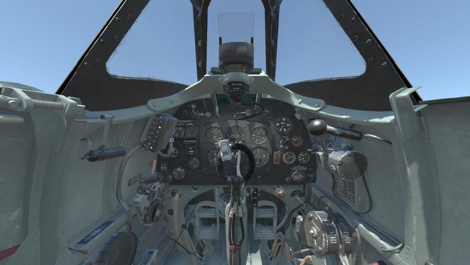

<a name="cockpit_part_1">1</a>\. Панель приборов слепого полета.           
<a name="cockpit_part_2">2</a>\. Кран закрылков.                           
<a name="cockpit_part_3">3</a>\. Гироскопический прицел Mk II.             
<a name="cockpit_part_5">5</a>\. Вольтметр.                                
<a name="cockpit_part_6">6</a>\. Тахометр. 
<a name="cockpit_part_8">8</a>\. Запасные лампы подсвета прицела. 
<a name="cockpit_part_10">10</a>\. Тумблер переключения скоростей нагнетателя.                                 
<a name="cockpit_part_11">11</a>\. Сигнальная лампа включения второй скорости нагнетателя.                        
<a name="cockpit_part_13">13</a>\. Указатель наддува.                       
<a name="cockpit_part_14">14</a>\. Термометр охлаждающей жидкости.          
<a name="cockpit_part_15">15</a>\. Ручная бензиновая помпа. 
<a name="cockpit_part_16">16</a>\. Бензиномер. 
<a name="cockpit_part_17">17</a>\. Пусковой насос.                          
<a name="cockpit_part_18">18</a>\. Термометр масла двигателя.               
<a name="cockpit_part_19">19</a>\. Сигнальная лампочка давления бензина.    
<a name="cockpit_part_21">21</a>\. Манометр масла двигателя. 
<a name="cockpit_part_22">22</a>\. Рукоятка бензокрана. 
<a name="cockpit_part_23">23</a>\. Кнопка стартера двигателя. 
<a name="cockpit_part_24">24</a>\. Карточка девиации компаса. 
<a name="cockpit_part_25">25</a>\. Магнитный компас. 
<a name="cockpit_part_26">26</a>\. Вспомогательная карточка девиации компаса. 
<a name="cockpit_part_27">27</a>\. Реостаты освещения кабины. 
<a name="cockpit_part_28">28</a>\. Указатель триммера руля высоты. 
<a name="cockpit_part_29">29</a>\. Трехстрелочный манометр пневмосистемы. 
<a name="cockpit_part_31">31</a>\. Тумблеры магнето. 
<a name="cockpit_part_33">33</a>\. Сигнализация шасси. 
<a name="cockpit_part_34">34</a>\. Регулятор подачи кислорода. 
<a name="cockpit_part_35">35</a>\. Указатель подачи кислорода. 
<a name="cockpit_part_36">36</a>\. Манометр кислорода. 
<a name="cockpit_part_37">37</a>\. Пульт управления радиостанцией. 
<a name="cockpit_part_52">52</a>\. Кран включения наддува баков. 
<a name="cockpit_part_79">79</a>\. Выключатель АНО. 
<a name="cockpit_part_97">97</a>\. Кнопка катушки зажигания. 
<a name="cockpit_part_161">161</a>\. Кнопка включения бензомера. 
<a name="cockpit_part_167">167</a>\. Рукоятка светофильтра прицела. 

## Приборная доска

Приборная доска на самолете состоит из двух частей. На центральной части, выполненной из
листа алюминиевого сплава толщиной 3 мм размещены основные пилотажно-навигационные
приборы. Приборная панель слепого полета устанавливается на три амортизационные опоры,
для уменьшения влияния вибрации на показания приборов. На правой части приборной доски
сгруппированы приборы контроля работы силовой установкой, на левой части расположены
приборы контроля и управления вспомогательными системами самолета. В нижней части
установлены магнитный компас, основной топливный кран, пусковой насос, кран наддува
топливных баков.

### Панель приборов слепого полета

На самолете установлена стандартная панель приборов слепого полета позднего типа (6А/760).
В целях уменьшения влияния вибрации на показания приборов, панель установлена на трех
антивибрационных опорах.

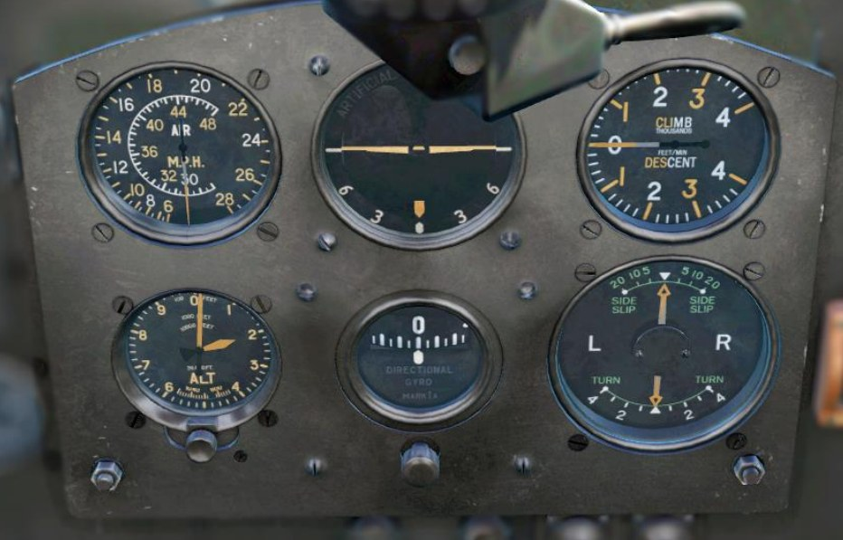

На панели приборов слепого полета установлены следующие пилотажно-навигационные
приборы:

#### Указатель воздушной скорости Mk.IXF

Предназначен для измерения воздушной скорости самолета в полете. Воздушной называется
скорость самолета относительно воздуха. Указатель воздушной скорости (6A/587) построен на
принципе измерения аэродинамического давления (силы сопротивления встречного потока
воздуха на единицу поверхности движущегося в нем тела) в полете. В качестве приемника
применяется усовершенствованная трубка Пито, состоящая из двух металлических трубок:
статической и динамической. Трубки соединяются с соответствующими камерами измерителя. В
качестве динамической камеры используется упругая гофрированная металлическая камера
Види, статической камерой является внутренняя полость измерителя. В динамической камере
создается полное давление, в статической - только статическое. Одинаковое статическое
давление в обоих камерах уравновешивается, и коробка Види расширяется (при увеличении
скорости полета) или сжимается (при уменьшении скорости) только от действия динамического
давления. Движение коробки через передающий механизм из системы рычагов передаются на
стрелку измерителя. Корпус прибора герметичен. Прибор сообщается с трубкой Пито
посредством двух выводных штуцеров, подсоединяемых к статическому и динамическому
трубопроводам. При стоянке самолета на земле трубку Пито закрывают чехлом,
предохраняющим ее от засорения.

Указатель имеет двойную концентрическую шкалу, тарированную в милях в час. По наружной
шкале считываются показания в диапазоне от 60 миль/час до 280 миль/час, далее от 280 до 480
миль/час считываются по внутренней шкале. Цена деления 5 миль/час для обеих шкал.

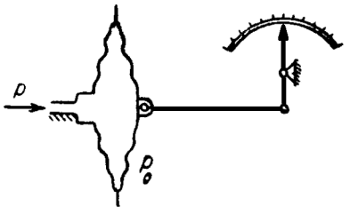

#### Авиагоризонт Mk.1B

Предназначен для определения положения самолета относительно плоскости горизонта при
слепом полете. Авиагоризонт (6A/1519) является важным прибором слепого полета, так как он
дает возможность сохранять горизонтальное положение самолета без видимости Земли.
Показания авиагоризонта безынерционны и не имеют запаздывания. Авиагоризонт мгновенно
реагирует на появившийся угол и не имеет колебаний при наличии ускорений, сопровождающих
полет.

Действие авиагоризонта основано на использовании свойств гироскопа с тремя степенями
свободы, ось которого корректируется при помощи маятниковой коррекции.
На лицевой части прибора имеется черный экран с горизонтальной чертой, покрытой светящейся
массой и изображающей линию горизонта. Силуэт самолета закреплен неподвижно и наглядно
воспроизводит положение действительного самолета, как бы летящего от наблюдателя,
относительно земного горизонта. Угол между силуэтом самолета и горизонтальной чертой равен
абсолютному поперечному крену самолета. Расстояние между центром силуэта и чертой
пропорционально абсолютному продольному крену самолета. В нижней части прибора
расположен указатель крена и нанесена шкала углов крена.

#### Вариометр Mk.1A

Указатель вертикальной скорости Mk.1A (6A/942) предназначен для индикации летчику скорости
изменения высоты полета, то есть скорости подъема или снижения. Показания вариометра
необходимы летчику на всех этапах полета. Для выполнения горизонтального полета необходимо
выдерживать высоту постоянной, однако показания высотомера изменяются заметно при
достаточно больших, в несколько десятков метров, изменениях высоты. Вариометр, будучи
достаточно чутким прибором, реагирует на довольно незначительные изменения скорости
изменения высоты, тем самым дает возможность вести самолет горизонтально. При
планировании, пикировании и наборе высоты, вариометр также помогает быстро установить
необходимый режим.

Принцип работы вариометра основан на измерении относительного давления в замкнутом
объеме, сообщающегося с атмосферой при помощи капиллярной трубки.
В горизонтальном полете давление в коробке Види и корпусе прибора равны атмосферному, при
этом коробка Види не испытывает никакой разности давлений и стрелка стоит на нуле.
При наборе высоты атмосферное давление уменьшается. Воздух из прибора начинает выходить
через капиллярную трубку. Капилляр имеет малый диаметр, поэтому давление внутри прибора
не успевает сравняться с атмосферным. При этом давление внутри корпуса больше атмосферного
давления в коробке Види на величину, пропорциональную скорости подъема. Под влиянием
разности коробка Види сжимается и передвигает указывающую стрелку вверх от нуля. При
прекращении подъема самолета внешнее давление перестает меняться, и давление внутри
корпуса уравнивается с атмосферным, а стрелка возвращается на нуль.
                                                

1.   Шкала вариометра
2.   Стрелка
3.   Трибка
4.   Сектор
5.   Капилляр
6.   Поводок
7.   Коробка Види

При снижении давление внутри коробки увеличивается, а давление внутри корпуса отстает на
величину пропорциональную скорости снижения. Под действием разности давлений коробка
Види расширяется и перемещает стрелку от нуля в другую сторону.

Показания вертикальной скорости имеет некоторое запаздывание, вследствие того, что при
изменении режима полета требуется некоторое время (несколько секунд) для установления
разности давлений внутри и вне камеры.

В горизонтальном полете стрелка должна находиться точно на нуле.
Шкала градуирована от 0 до 4000 футов/мин. причем цифры написаны без нулей, т.е. надпись
“3” означает 3000 и так далее. Цена деления шкалы 200 футов/мин.

#### Высотомер Mk.XIVA

Предназначен для определения барометрической высоты полета, по принципу измерения
статического давления воздуха, окружающего самолет. Метод барометрического измерения
высоты основан на законе падения давления воздуха с увеличением высоты над уровнем моря.
Высотомер представляет собой металлический барометр, упругим элементом которого является
анероидная коробка. Коробка помещается в герметичном корпусе, который сообщается со
статической камерой трубки Пито. Внешнее давление воздуха на коробку компенсируется
упругостью мембран. Прогиб центра мембраны анероидной коробки имеет наибольшую величину
у земли и уменьшается по мере подъема на высоту. Т.е. по мере уменьшения внешнего давления.
Ход центра мембраны передается на указывающую стрелку посредством передаточного
механизма.

Корпус прибора герметичен и сообщается со статической камерой трубки Пито. Используется для
подключения та же магистраль что и для указателя скорости.

Высотомер Mk.XIVA (6A/685) трехстрелочный. На циферблате высотомера указаны единицы
измерения для каждой стрелки, возле ее кончика.

Большая узкая стрелка указывает высоту в сотнях футов, малая широкая стрелка в тысячах
футов, малая узкая стрелка в десятках тысяч футов.

Высотомер оснащен механизм установки барометрического уровня давления. При вращении
кремальеры в окошке циферблата перемещается шкала давлений. При установке
барометрической шкалы высотомера соответственно атмосферному давлению в день вылета
допускается несовпадение большой стрелки с нулевым индексом не более чем на три деления
шкалы высот.

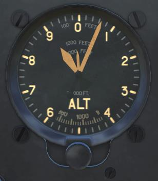

#### Гирополукомпас Mk.IA

Гирополукомпас Mk.IA (6A/1298) предназначен для выдерживания заданного курса самолета и
выполнения разворотов на заданное число градусов. Полукомпас построен на принципе
гироскопа с тремя степенями свободы, ось ротора гироскопа горизонтальна.
Гирополукомпас не указывает автоматически курс, а указывает отклонение от какого-либо курса,
установленного по показаниям магнитного компаса Р.8.М. Для этого шкала ГПК может быть
выставлена летчиком на любое показание при помощи специальной кремальеры, установленной
в нижней части прибора. Через каждые 10-15 минут полета показания прибора сверяются с
компасом и в случае необходимости исправляют показания арретиром. Необходимость
корректировки объясняется тем, что по принципу его работы в показаниях прибора с течением
времени накапливается ошибка (до 2°-3° за 10-15 мин.). Таким образом ГПК используется на
самолете в сочетании с магнитным компасом.

Показания гирополукомпаса, также как и авиагоризонта, безинерционны и не имеют
запаздываний. Благодаря этому ГПК применяют в слепом полете.
В передней стенке корпуса прибора имеется круглое окно, закрытое герметически
установленным стеклом. Под стеклом помещается круглая шкала с прямоугольным вырезом и
указателем курса. В окно видна картушка полукомпаса, разделенная от 0 до 360° с делениями
через каждые 5°. Оцифровка картушки сделана через 30°, причем цифры написаны без нулей,
т.е. надпись “9” означает 90° и так далее. Деления и цифры картушки, а также курсовой
индикатор покрыты светящейся массой. Под окном помещается кремальера, служащая для
установки необходимого показания по индикатору курса, а также как арретир (запирающее
устройство) при выключении прибора.

Как и все гироскопические приборы, ГПК чувствителен к падению производительности системы
питания, либо не герметичности корпуса прибора. При изменении вакуума, регулировка
полукомпаса нарушается и его устойчивость теряется. Также гирополукомпас подвержен
накоплению ошибок при пилотировании. На виражах с большим поперечным креном ось
вертикальной рамки гироскопа наклоняется на угол, равный абсолютному крену самолета. Это
обстоятельство вызывает ошибку в определении курса порядка 4°.
При совершении фигурных полетов, а также при посадке и рулении необходимо вдвигать
установочную кремальеру, это предохранит прибор от преждевременной порчи. ГПК допускает
продольные и поперечные крены не более 55°. Если они превышены, то гирополукомпас
необходимо заарретировать, и потом вновь выставить нужные показания.

#### Указатель крена и скольжения Mk.IB

Указатель крена и скольжения Mk.IB (6A/1302) предназначен для индикации летчику наличия
вращения самолета вокруг вертикальной оси и наличие поперечного скольжения самолета.
Указатель поворота в сочетании с магнитным компасом повышает точность пилотирования по
прямой, так как стрелка указателя поворота быстрее и точнее реагирует на отклонения самолета
от прямой, чем магнитный компас. Комбинация указателя поворота с указателем скольжения
позволяет выполнять правильный вираж с определенной скоростью.

Действие указателя поворота основано на использовании свойств гироскопа с двумя степенями
свободы. Ось гироскопа совпадает по направлению с продольной осью самолета. Демпфер в
указателе поворота предназначен для успокоения колебаний стрелки. Если бы не было
демпфера, то в случае малейшего рыскания самолета на курсе колебания стрелки были бы
настолько велики, что невозможно было бы пилотировать самолет по указателю поворота.
Указатель скольжения основан на принципе маятника.

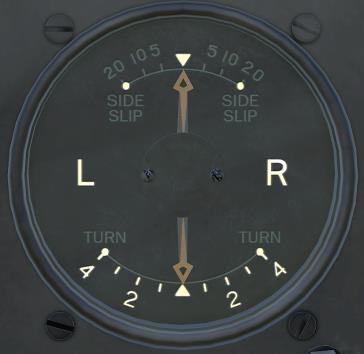

### Левая часть приборной доски

На левой части приборной доски установлены:

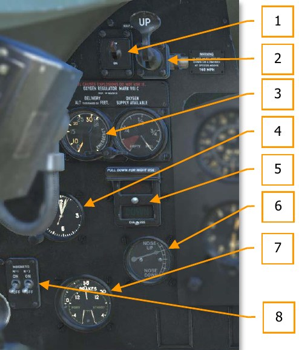

1.   Тумблер управления навигационными огнями (5С/543)
2.   Кран управления щитками (SHT 6/34959)
3.   Кислородный прибор Мk.VIIIC (6D/513)
4.   Бортовые часы Mk.IV (106A/322)
5.   Индикатор положения шасси (SHT 54/30036)
6.   Указатель триммера руля высоты (SHT 9/30034)
7.   Трехстрелочный манометр Mk.IC (6A/1754)
8.   Тумблеры магнето (5С/548)

#### Тумблер управления навигационными огнями
Выключатель выполнен конструктивно по типу перекидного переключателя. Служит для
включения верхнего, хвостового и крыльевых навигационных огней.

#### Кран управления щитками

Конструкция крана и схема работы подробно рассмотрена в описании “Кран управления
щитками”. \\\link

В верхнем положении рукоятки крана щитки убраны, в нижнем положении щитки выпущены.
Промежуточных положений кран и щитки не имеют. Щитки выпускаются на угол 85°. Рядом с
краном установлена табличка с напоминанием летчику о максимальной скорости полета с
выпущенными закрылками - 160 миль/час.

#### Кислородный прибор Мk.VIIIC

Кислородный прибор служит для регулировки подачи кислорода из баллона в кислородную маску
летчика. Манометры, установленные на лицевой поверхности, служат для указания летчику
имеющегося количества кислорода в баллоне – правый манометр; левый манометр - индикатор
кислородного потока (ИКП) контролирует правильность подачи потребного количества
кислорода в маску летчика в зависимости от высоты полета. Принцип действия ИКП основан на
использовании энергии скоростного напора струи кислорода, направленного на лопасть стрелки
прибора. По отклонению стрелки определяют высоту, которой соответствует определенный
расход кислорода. Если высота, указываемая стрелкой ИКП соответствует действительной
высоте полета, то можно считать, что прибор работает правильно.

Между манометрами установлен редукционный кран. Кислород из баллона подается через
кислородный прибор в экономайзер, и далее по гибкому шлангу в маску летчика.

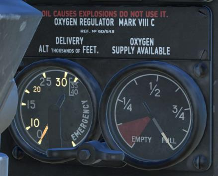

#### Часы авиационные Mk.IV

Часы предназначены для показания текущего времени в часах, минутах и секундах. Имеют
заводную головку в нижней части прибора. В качестве принципа работы используются
колебания маятника. Конструктивно являются обычными пружинными часами с круглым
маятником-балансиром. Запас хода 8 суток.

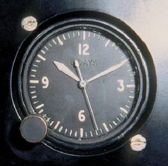

#### Индикатор положения шасси

Предназначен для индикации летчику положения основных стоек шасси. Соответствующее
сигнальное табло загорается при убранном (трафарет "UP") или выпущенном (трафарет "Down")
положении. В верхней части индикатора расположена шторка для приглушения свечения
индикатора при ночных полетах. Цепь сигнализации выпущенного положения имеет
выключатель, размыкающий цепь при стоянке самолета. Переключатель расположен на колонке
управления двигателем. При перемещении рычага управления двигателем вперед,
переключатель срабатывает и цепь выпущенного положения запитывается. После заруливания
и выключения двигателя переключатель необходимо перевести в выключенное положение
вручную, для предотвращения бесполезного разряда аккумулятора.

#### Указатель триммера руля высоты

Служит для визуальной индикации летчику положения триммера руля высоты. Стрелка в верхней
части шкалы указывает что триммер отклонен вверх, в нижней соответственно вниз.
Нейтральное положение триммера руля высоты - два деления по прибору вверх.

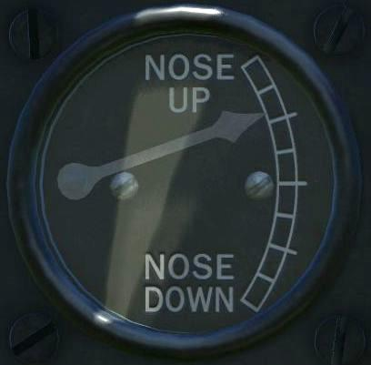

#### Трехстрелочный манометр Mk.IC

Прибор контроля за исправностью пневматической системы. Трехстрелочный индикатор
объединяет в одном приборе показания давления в пневматической системе самолета и в
пневматических тормозах колес. На общем циферблате нанесены три шкалы: давление в
пневмосистеме - от 0 до 600 фунтов на дюйм2, манометров левого и правого тормоза - от 0 до
130 фунт/дюйм2. Шкалы расположены таким образом, что при нормальных значениях
измеряемых величин стрелки образуют фигуру, что облегчает наблюдение за прибором, нет
необходимости считывать показания каждой стрелки, а позволяет оценить состояние системы
лишь по взаимному расположению стрелок.

Верхняя часть шкалы предназначена для контроля давления сжатого воздуха в системе, нижние
левая и правая шкалы указывают давление воздуха в тормозах колес. На верхней части
манометра установлен индикатор максимально допустимого давления в пневмосистеме.

#### Тумблеры магнето

Магнето - магнитоэлектрическая машина, преобразующая механическую энергию в
электрическую. В двигателях внутреннего сгорания магнето обеспечивает импульс
электрического тока к свечам зажигания и используются в двигателях без батареи. В самолётах
у каждого цилиндра обычно есть две свечи зажигания, подключённых к отдельному магнето.
Такая конструкция создаёт избыточность в случае отказа одного из магнето, а две искры
обеспечивают более полное и эффективное сгорание топливной смеси.

### Правая часть приборной доски

На правой части приборной доски установлены:

1.   Вольтметр (5U/1636)
2.   Тахометр Mk.IX G (6A/1191)
3.   Панель контроля нагнетателя (SHT183/35134)
4.   Указатель наддува Mk.IIIL (6A/1427)
5.   Манометр масла Mk.XIV (6A/570)
6.   Указатель температуры масла Mk.IA (6A/1094)
7.   Указатель температуры охлаждающей жидкости Mk.VIII (6A/1100)
8.   Бензиномер Mk.IV (6A/704)
9.   Лампа-сигнализатор давления бензина (5C/1069)

#### Вольтметр

Предназначен для измерения и индикации напряжения в бортовой электрической сети самолета.
Электроизмерительный прибор постоянного тока основан на возникновении в подвижной
системе со стрелкой вращающего момента под воздействием постоянного тока. Угол отклонения
стрелки зависит от силы тока, который в свою очередь зависит от приложенного напряжения.
Шкала имеет градуировку 0-20 В. Номинальное значение напряжения в бортовой сети при
работающем генераторе 13-14.5 В. Для удобства считывания показаний на отметке 12 В.
(напряжение заряженного аккумулятора) нанесена риска.

#### Тахометр Mk.IX g

Тахометр служит для определения скорости вращения главного (коленчатого) вала двигателя.
Скорость вращения определяется количеством оборотов в единицу времени, чаще всего в
минуту. Тахометр указывает скорость вращения главного вала в любой момент времени и быстро
реагирует на всякого рода изменения этой скорости. Ориентируясь по показаниям тахометра,
летчик задает двигателю необходимые для режима полета обороты.

Тахометр центробежного типа построен на принципе измерения центробежной силы,
развиваемой вращающимся грузом. Гибкий вал передает вращение на ось тахометра от
распределительного вала левого блока цилиндров. Шкала прибора имеет деления от 1000 до
5000 об/мин. Два крайних нуля отброшены. Цена наименьшего деления 100 об/мин. Цифры,
деления, а также стрелка покрыты светящейся массой.

#### Панель контроля нагнетателя

На панели расположен переключатель скоростей нагнетателя (10F/11714), контрольная лампа-
сигнализатор (5C/1553). Переключение скоростей нагнетателя автоматическое, по сигналу
датчика высоты, установленного за кабиной летчика. Однако, летчик может принудительно
переключить нагнетатель на первую скорость. Переключатель имеет два положения:

- AUTO NORMAL POSITION - автоматическое переключение скорости нагнетателя
- M.S. - принудительное включение первой скорости нагнетателя.

Лампа-сигнализатор красного цвета "Rotax H.1104" обозначена как "F.S. GEAR WARNING"
предупреждает летчика о том, что нагнетатель работает на второй скорости. В случае
срабатывания сигнализатора перед взлетом, взлет необходимо прекратить, выяснить причину и
устранить неисправность.

#### Указатель наддува

Для поддержания мощности авиационных двигателей необходимо, чтобы весовое отношение
засасываемого в цилиндры воздуха и горючего равнялось примерно 13:1. Это значит, что
весовых единиц воздуха должно быть в 13 раз больше чем тех же единиц горючего. Вес одного
и того же объема воздуха изменяется прямо пропорционально плотности воздуха. С увеличением
высоты полета и уменьшении плотности воздуха необходимое отношение уменьшается и вместе
с этим уменьшается мощность двигателя. Сохраняя нормально отношение за счет уменьшения
количества горючего, сохранить мощность двигателя нельзя, так как уменьшится общий вес
смеси. Мощность двигателя с увеличением высоты уменьшается весьма значительно, уже на
высоте 5000 м мощность примерно в два раза меньше чем у земли. Для сохранения мощности на
высоте на двигателе установлен нагнетатель. Нагнетатель захватывает горючую смесь из
карбюратора и нагнетает ее во всасывающие патрубки двигателя, увеличивая там давление и
тем самым плотность смеси. Давление во всасывающем патрубке зависит от скорости вращения
нагнетателя, а также от высоты полета. В каждый момент полета летчик должен иметь
возможность контролировать величину давления или, что все равно, величину наддува. Для
измерения давления во всасывающем патрубке двигателя служит прибор, называемый
мановакууметром или указателем наддува. Мановакууметр работает по принципу
металлического манометра с анероидной коробкой и измеряет увеличение давления по
сравнению с атмосферным. Когда двигатель не работает, давление во впускной трубе равно
атмосферному, указатель показывает 0.

На самолете установлен указатель наддува Mk.IIIL (6А/1427), рассчитанный на максимальное
давление +20 фунт/дюйм2. На шкале нанесены деления через 1 фунт/дюйм2. Цифры указывают
разницу между абсолютным давлением после нагнетателя и атмосферным давлением в
фунт/дюйм2.

#### Манометр масла Mk.XIV

Бесперебойность циркуляции масла зависит от разности давлений в масляной магистрали и в
картере двигателя. Эта разность измеряется манометром масла. Манометр контролирует
бесперебойность смазки и предупреждает летчика о неисправностях в системе смазки. По
принципу работы является дифференциальным манометром с пружиной Бурдона. Корпус
прибора негерметичен, так как разница между давлением окружающего прибор воздуха и
давлением масла в картере ничтожна по сравнению с измеряемым давлением масла.
Давление масла воспринимается специальным приемником, который устанавливается в
магистрали. Давление подается в корпус приемника и воспринимается сильфоном, внутренняя
полость которого соединяется с манометром при помощи соединительной трубки.
Сильфон, соединительная трубка и трубка Бурдона заполнены толуолом. Приемник и манометр
спаяны соединительной трубкой и являются неразъемными. Толуол не изменяет свою вязкость
и не замерзает при низких температурах. Диапазон измерений 0-150 фунт/дюйм2. Цена
наименьшего деления 10 фунт/дюйм2. Цифры, деления, а также конец стрелки покрыты
светящейся массой.

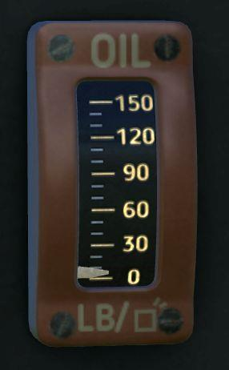

#### Указатель температуры масла Mk.IA

При работе двигателя выделяется много тепла, перегрев двигателя понижает предел упругости
металла вследствие чего, детали деформируются.

Температуру нагрева двигателя с жидкостным охлаждением определяют косвенным образом,
измеряя нагрев охлаждающей жидкости, так как жидкость непрерывно омывает стенки
цилиндров двигателя и воспринимает его температуру. С увеличением нагрева двигателя
температура смазывающего масла также повышается. Температуру масла и охлаждающей
жидкости измеряют паровыми термометрами, которые контролируют степень нагрева двигателя
и предупреждают о его перегреве летчика, а также контролируют качество смазки.
В основу работы паровых термометров положен метод измерения давления насыщенных паров
низкокипящей жидкости. Если такую жидкость поместить в замкнутый объем и подогреть до
температуры кипения, то жидкость будет превращаться в пар. По мере увеличения количества
пара будет увеличиваться давление пара в замкнутом объеме. При некоторой величине давления
дальнейшее парообразование прекращается и наступает равновесие. Пространство над
жидкостью, в котором не происходит дальнейшего испарения жидкости, называется
насыщенным, сами пары также называют насыщенными. При дальнейшем повышении
температуры испарение жидкости возобновится до тех пор, пока пространство опять не
насытится парами, но уже при более высоком давлении. Каждому значению измеряемой
температуры соответствует определенное давление насыщенных паров. Это свойство
насыщенных паров используется для измерения температуры.

Паровой термометр состоит из приемника, соединительного трубопровода и манометра.
Приемник выполнен в виде замкнутого металлического баллона, заполненного низкокипящей
жидкостью. Пространство над поверхностью жидкости сообщается при помощи трубопровода с
внутренней полостью трубки Бурдона. Приемник погружают в среду, температуру которой
необходимо измерить. При повышении измеряемой температуры давление насыщенных паров
увеличивается, трубка Бурдона разгибается и передвигает стрелку, указывающую измеряемую
температуру. При понижении измеряемой температуры часть паров конденсируется и давление
уменьшается, что вызывает обратное движение стрелки.

Диапазон измерений 0-100° С. Цена наименьшего деления 5° С. Цифры, деления, а также конец
стрелки покрыты светящейся массой.

#### Указатель температуры охлаждающей жидкости Mk.VIII

По конструкции и принципу работы аналогичен паровому термометру, измеряющего температуру
масла.

Диапазон измерений 40-140° С. Цена наименьшего деления 5° С. Цифры, деления, а также
стрелка покрыты светящейся массой.

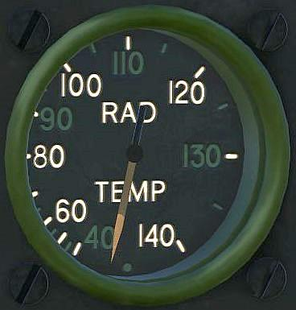

#### Бензиномер Mk.IV

Бензиномером называют прибор, указывающий летчику количество горючего, находящегося в
баках самолета. Количеством горючего определяется продолжительность полета самолета,
следовательно, знать его необходимо. В топливной системе самолета установлен поплавковый
бензиномер. Измеряется только количество горючего в нижнем баке.

Основной деталью поплавкового бензиномера является поплавок, который плавает на
поверхности горючего в баке. При изменении уровня горючего поплавок следует за уровнем и
при помощи передающего механизма заставляет работать указатель. По способу передачи
показаний в кабину, бензиномер является электрическим, постоянного тока.
Указатель электробензиномера представляет собой прибор электромагнитного типа. В основу
прибора положено воздействие магнитного поля неподвижной катушки с током на подвижный
сердечник из мягкого железа.

Шкала на бензиномере двойная, верхняя служит для измерения количества горючего на земле,
в трехточечном положении самолета, нижняя - для измерения горючего в полете. Максимальное
значение равно объему нижнего бака и составляет 37 галлонов. Для контроля уровня горючего
необходимо нажать и удерживать кнопку (5CW/4187) снизу слева от указателя, тем самым
запитав бензиномер от бортовой сети.

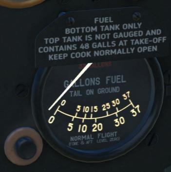

#### Сигнализатор давления бензина

Слева от бензиномера установлена лампа-сигнализатор, срабатывающая при падении давления
за бензонасосом ниже 10 фунт/дюйм2 (0,7 кг/см2). Электроцепь датчика давления бензина
запитана от цепи сигнализации выпущенного положения шасси, которая управляется
переключателем на колонке рычагов управления двигателем.

### Верхняя и нижняя части приборной доски

1. Светофильтр коллиматорного прицела.  В условиях яркого освещения, для удобства прицеливания через коллиматорный
  прицел предусмотрен светофильтр. Чтобы установить светофильтр перед отражателем,
  необходимо потянуть за кольцо, которое перемещает светофильтр по направляющим.
2. Тумблер коллиматорного прицела.  Для включения прицела, установлен отдельный переключатель.
3. Реостат искуственной подсветки коллиматорного прицела
  При помощи реостата регулируетсяяркость подсветки сетки коллиматорного прицела.
4. Штепсельный разъем коллиматорного прицела.  Для подключения прицела в электрическую сеть самолета, установлен штепсельный
  разъем.

    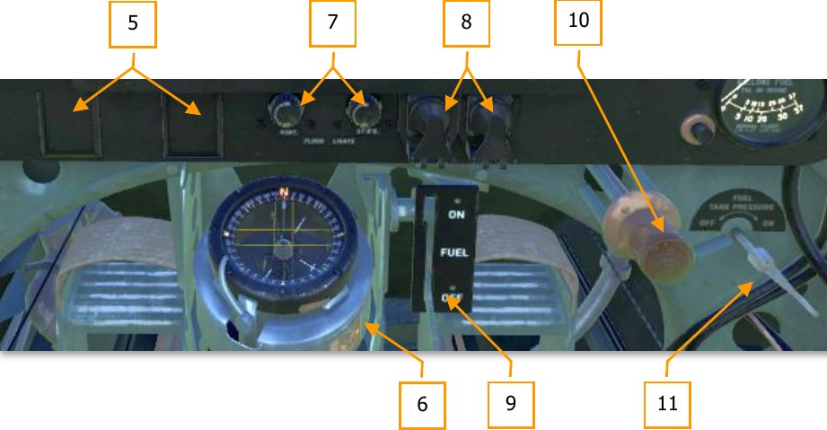

5. Карточки учета девиации.  Под панелью приборов слепого полета, установлено два держателя для карточек учета
  девиации магнитного компаса, c подвешенном подфюзеляжном топливном баке и без
  него.

    

6. Компас. Посередине приборной доски в нижней ее части на специальном кронштейне установлен
  магнитный компас P.8.M (6A/726).
7. Реостаты подсвета кабины. Для освещения кабины в темное время суток по бортам кабины установлено два
  светильника заливающего света. Включение светильников и установка яркости свечения
  производятся двумя реостатами в нижней части приборной доски.
8. Кнопки запуска.  Для запуска двигателя необходимо подать питание на пусковую катушку и электрический
  стартер. Для этого в нижней части приборной доски смонтированы две кнопки. Для
  предотвращения непреднамеренного нажатия, кнопки оснащены подпружиненными
  крышками. Левая кнопка - пусковая катушка, правая - электростартер.
9. Основной топливный кран.  Справа от компаса установлен основной топливный кран, перекрывающий подачу
  бензина от бака к бензонасосу двигателя.
10. Пусковой насос.  Для обеспечения запуска двигателя, в топливной системе установлен пусковой насос,
  подающий бензин из нижнего бака напрямую во впускную магистраль двигателя.
11. Кран наддува бензобаков. Снизу правой части приборной доски установлен кран наддува бензобаков (27F/2128).
  Нормальное положение - "OFF". Наддув баков необходимо включить при срабатывании
  сигнализации низкого давления бензина.

## Левый борт

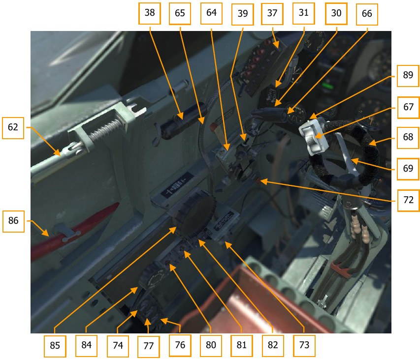

<a name="cockpit_part_30">30</a>\.   Рычаг газа. 
<a name="cockpit_part_31">31</a>\.   Тумблеры магнето.                             
<a name="cockpit_part_37">37</a>\.    Пульт управления радиостанцией.              
<a name="cockpit_part_38">38</a>\.   Лампа кабинного освещения.                    
<a name="cockpit_part_39">39</a>\.   Выключатель сигнализации шасси.               
<a name="cockpit_part_62">62</a>\.   Ручка дверцы кабины.                          
<a name="cockpit_part_64">64</a>\.   Рычаг управления шагом винта (здесь и      далее - исторический термин).                 
<a name="cockpit_part_65">65</a>\.   Рычаг управления стоп-краном.                 
<a name="cockpit_part_66">66</a>\.   Кнопка сброса бомб.                           
<a name="cockpit_part_67">67</a>\.   Гашетка управления пулеметно-пушечным    вооружением.                                  
<a name="cockpit_part_68">68</a>\.   Ручка управления самолетом.                   
<a name="cockpit_part_69">69</a>\.   Тормозной рычаг.                              
<a name="cockpit_part_72">72</a>\.   Фрикцион рычага газа.                         
<a name="cockpit_part_73">73</a>\. Ручка управления воздухозаборника.                                                    
<a name="cockpit_part_74">74</a>\. Кнопка крана разжижения масла. 
<a name="cockpit_part_76">76</a>\. Кнопка проверки исправности створок радиаторов. 
<a name="cockpit_part_77">77</a>\. Кнопка проверки исправности переключения скоростей нагнетателя. 
<a name="cockpit_part_80">80</a>\. Принудительное открытие створок радиаторов. 
<a name="cockpit_part_81">81</a>\. Выключатель обогрева трубки ПИТО. 
<a name="cockpit_part_82">82</a>\. Выключатель подкачивающего бензонасоса. 
<a name="cockpit_part_84">84</a>\. Штурвал триммера руля направления. 
<a name="cockpit_part_85">85</a>\. Штурвал триммера руля высоты. 
<a name="cockpit_part_86">86</a>\. Аварийный ломик. 
<a name="cockpit_part_89">89</a>\. Предохранитель спуска. 

## Правый борт

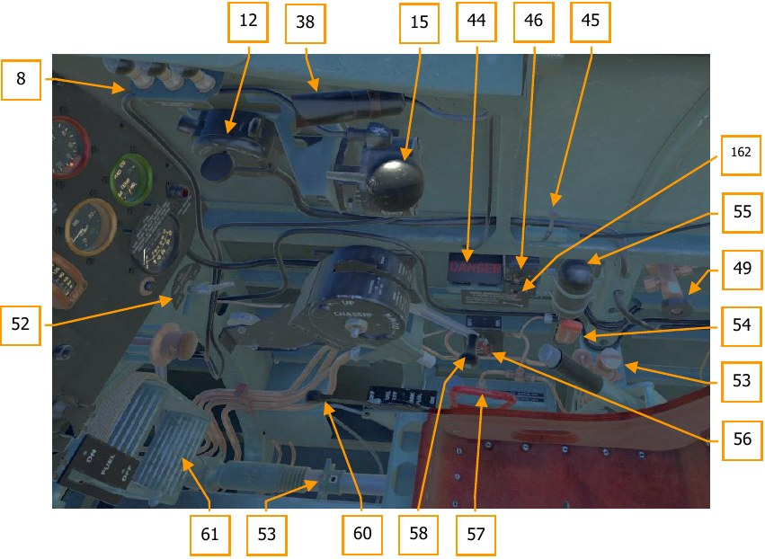

<a name="cockpit_part_8">8</a>\. Запасные лампы для прицела.                 
<a name="cockpit_part_12">12</a>\. Коммутатор опознавательных  огней.         
<a name="cockpit_part_15">15</a>\. Ручная бензопомпа 4(альвейер).             
<a name="cockpit_part_38">38</a>\. Лампа кабинного освещения.                 
<a name="cockpit_part_44">44</a>\. Кнопки включения самоликвидатора  ответчика.                                 
<a name="cockpit_part_45">45</a>\. Замок привязных ремней.                    
<a name="cockpit_part_46">46</a>\. Выключатель ответчика.                     
<a name="cockpit_part_49">49</a>\. Запорный кран кислородной системы.         
<a name="cockpit_part_52">52</a>\. Кран наддува баков.                        
<a name="cockpit_part_53">53</a>\. Ручной насос антиобледенительной системы.                                   
<a name="cockpit_part_54">54</a>\. Рукоятка аварийного выпуска шасси. 
<a name="cockpit_part_55">55</a>\. Баллон с углекислым газом системы аварийного выпуска шасси. 
<a name="cockpit_part_56">56</a>\. Кран подачи антиобледенительной жидкости. 
<a name="cockpit_part_57">57</a>\. Рукоятка сброса подвесного бака. 
<a name="cockpit_part_58">58</a>\. Рукоятка крана шасси. 
<a name="cockpit_part_59">59</a>\. Маховичок регулировки педали по росту. 
<a name="cockpit_part_60">60</a>\. Кран подачи бензина из подвесного бака. 
<a name="cockpit_part_61">61</a>\. Педаль руля направления. 
<a name="cockpit_part_162">162</a>\. Тумблер включения аварийного сигнала ответчика. 
